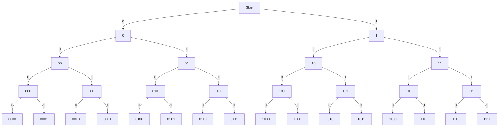

[TOC]

# 计算机组成原理

## 第一部分

### 第1章 计算机系统体系结构

### 第2章 计算机算术

#### 2.1 数据是什么

##### 2.1.1 位与字节

**计算机内存储和处理信息的最小单位是位（bit，BInary digiT），一个bit的值可以是0或者1。**bit是不可再分的，它是最小的信息单位。计算机将信息以一组或一串比特（称作字）的形式保存再存储器中。按照习惯，我们以最低位在最右端的方式书写二进制串。

计算机通常不会每次只对一个二进制位进行操作，而实对一组二进制位进行操作。**8个二进制位为一个字节（byte）。**当前的微处理器都是面向字节的，其字长都是8位的整数倍（即它们的数据和地址是8、16、32、64或128位）。一个字可以是2个、4个或8个字节长，因为它的所有位可以被分别组织为2个、4个或8个8位的组。

##### 2.1.2 位模式

一串二进制位可以表示任何数据，那么假如要将一天中的小时表示为24个不同值得一个（0 ~ 23），那么共需要多少位？如何指定这些数字对应的位模式？

<B>图 2-1</B>

图 2-1描述了如何用1位、2位、3位和4位得到一个二进制的值序列。我们可以看到，每当数字增加1位时，路径的总数就会翻一倍。依此类推，一个$n$位的字将得到$2^n$条不同的路径或位模式。即为了用二进制数表示一个拥有最多n个值的量，应当找到一个使不等式$n<=2^m$成立得最小位数$m$。即要表示0~100这101个值则m应该等于7，因为$101<=2^7$。 

**信息表示**

一个n位得字可以表示为$2^n$个不同的位模式，那么一个n位的二进制字又可以表示什么呢？实际上最简单的大难是什么也表示不了，因为一个由二进制1和0组成的串没有任何的内在意义。如何解释一个特定的二进制数只取决于程序员赋予它何种含义。以下是一些能够用字表示的对象：

- 指令：字长位32位或更长的计算机用一个字来表示CPU能完成的操作（8位或16位的计算机用多个字来表示一条指令）。指令的二进制编码与其功能之间的关系由计算机设计者决定。例如，一台计算机上表示“A加B”的二进制序列可能与另一台计算机上的完全不同。
- 数量：一个字或多个字都可以用来表示数量。一个数可以被表示为多种格式。字节10001001可能在一个系统 中表示数值-119，在另一个系统中表示数值89。
- 字符：字符是是一个叫作“字母表”的集合中的元素。拉丁或罗马字母表中的字母、数字 字符和一些符号都被分配了二进制值，因此可以在计算机内存储和处理。
- 图像、声音和视觉：数字计算机处理大量表示声音、静态图像和视频的数据。

#### 2.2 数字

##### 2.2.1 位置记数法

位置记数法：每个数位的值或权取决于它在数字中的位置。

在位置记数法中，当一个数只剩一位时所乘的值称作基数。例如，十进制数1261等于$1\times10^3+2\times10^2+6\times10^1+1\times10^0$。

按照位置记数法，一个n位的整数N将书写为：**$a_{n-1},a_{n-2},...,a_i,...,a_1,a_0$**。

这里$a_i$是与b的幂相乘的系数（此处b为基数）。例如，当基数为10时，我们可以将$N=278$写作$a_2a_1a_0$，这里$a_2=2，a_1=7，a_0=8$。

用小数点将整数部分和小数部分分开，可以对位置记数法进行扩展，使其能够表示实数。十进制运算中的实数按照形如1234.567方式书写。一个小数点前有n位，小数点后有m位的实数被表示为：**$a_{n-1}a_{n-2}...a_i...a_1,a_0.a_{-1}a_{-2}...a_{-m}$**。

一个用基数为b的位置记数法表示的数的值被定义为：

$$N=a_{n-1}b^{n-1}+···+a_1b^1+a_0b^0+a_{-1}b^{-1}+a_{-2}b^{-2}+···+a_{-m}b^{-m}=\sum_{i=-m}^{i=n-1}a_ib^i$$

采用位置记数法，一个数的数值等于它各位置的总和，而每一位的值则是该位的数值乘以它在数中的位置所对应的权。例如十进制数1982等于$1\times10^3+9\times10^2+8\times10^1+2\times10^0$。对于任意基数b，$b^0$的值总是1。

当基数为2时，二进制数10110.11的值为$1\times2^4+0\times2^3+1\times2^2+1\times2^1+0\times2^0+1\times2^{-1}+1\times2^{-2}=22.75$。

为了区分十进制数、二进制数和十六进制数，我们分别用下标10、2和16表示基数（例如$1234_{10}，1010011_2，12A3_{16}$）。表2-2为每种数制用到的数字：

<b>表 2-2</b>

数制|基数|数字集合
-----|-----|-----
十进制|b=10|a={0,1,2,3,4,5,6,7,8,9}
二进制|b=2|a={0,1}
八进制|b=8|a={0,1,2,3,4,5,6,7}
十六进制|b=16|a={0,1,2,3,4,5,6,7,8,9,A,B,C,D,E,F}

注意：十进制位置记数法不能精确地表示所有小数，例如$1/3=0.3333...333$。二进制位置记数法也是如此。特别的，一些能够用十进制表示的小数是无法用二进制表示的，例如$0.1_{10}$不能被精确地转换为二进制形式。

#### 2.3 二进制运算

二进制算术运算的规则与十进制基本相同；唯一的区别在于，十进制算术运算以10为基数，没位有10个数字，而二进制运算以2为基数，每位只有2个数字。其规则如下：

- **加法：**
	- $0 + 0 = 0$
	- $0 + 1 = 1$
	- $1 + 0 = 1$
	- $1 + 1 = 0$（进位1）
	- $0 + 0 + 0 = 0$
	- $0 + 0 + 1 = 1$
	- $0 + 1 + 0 = 1$
	- $0 + 1 + 1 = 0$（进位1）
	- $1 + 0 + 0 = 1$
	- $1 + 0 + 1 = 0$（进位1）
	- $1 + 1 + 0 = 0$（进位1）
	- $1 + 1 + 1 = 1$（进位1）
- 减法：
	- $0 - 0 = 0$
	- $0 - 1 = 1$（借位1）
	- $1 - 0 = 1$
	- $1 - 1 = 0$
- 乘法：
	- $0\times0 = 0$
	- $0\times1 = 0$
	- $1\times0 = 0$
	- $1\times1 = 1$

**两个n位字的乘法：**

**被乘数**					**乘数**		   				**步骤**																		**部分积**

0100100**1**			01101001						1																								0	1	1	0	1	0	0	1

010010**0**1			01101001						2																						 0	0	0	0	0	0	0	0

01001**0**01			01101001						3																				  0	0	0	0	0	0	0	0	

0100**1**001			01101001						4																		   0	1	1	0	1	0	0	1

010**0**1001			01101001						5																    0	0	0	0	0	0	0	0

01**0**01001			01101001						6															  0	0	0	0	0	0	0	0

0**1**001001			01101001						7												      0	1	1	0	1	0	0	1

**0**1001001			01101001						8												 0	1	1	0	1	0	0	1

​																		 **结果**                                    0	0	1	1	1	0	1	1	1	1	1	0	0	0	1

*实际上，计算机不会像上述这样完成乘法运算。*

**表示范围、精度、准确性和误差**

- 表示范围：一个数所能表示的最大值和最小值的差就是它的表示范围。例如一个n位二进制自然数的表示范围为0 ~ $2^n-1$。一个n位二进制有符号补码数可以表示$-2^{n-1}$ ~ $2^{n-1}-1$之间的值。
- 精度：数的精度是数据表示得有多好的衡量标准之一。例如$\pi$就不能用二进制或十进制实数精确表示。如果用5位十进制数表示$\pi$，那么其精度为$10^5$分之一。如果用20位，则为$10^{20}$分之一。
- 准确度：数的表示值与其真实值之间的差衡量了数据表示的准确度。
- 误差：误差是准确度的衡量标准，即误差 = 真实值 - 测量值。

#### 2.4 有符号整数

计算机设计者选择了3种方法来表示负数：符号及值表示法，二进制补码表示法，移码表示法。

##### 2.4.1 符号及值表示法

表示负数的一种方法是用它的最高位表示符号。通常符号位为0表示正数，符号位为1表示负数。

有符号数的值可以记为$(-1)^s\times M$，，这里S为数的符号为的值，M为其数值部分。例如两个8位有符号二进制数00001101和10001101的值为分别为+13和-13。

n位有符号的表示范围$-(2^{n-1}-1)$ ~ $+(2^{n-1}-1)$。一个8为有符号数可以表示为-127（11111111）至+127（01111111）之间的整数。

部分人反对该系统的一个原因是它有两个值来表示0：00000000和10000000。

符号及值表示法表示法并没有被用于整数算术运算中，因为它的加、减法运算分别用加法器和减法器实现。

##### 2.4.2 二进制补码运算

微处理器用二进制补码系统表示有符号整数，因为它可以将减法运算转换为对简述的补数的加法运算。例如，用7加上5的补数就可以完成运算7减去5。

