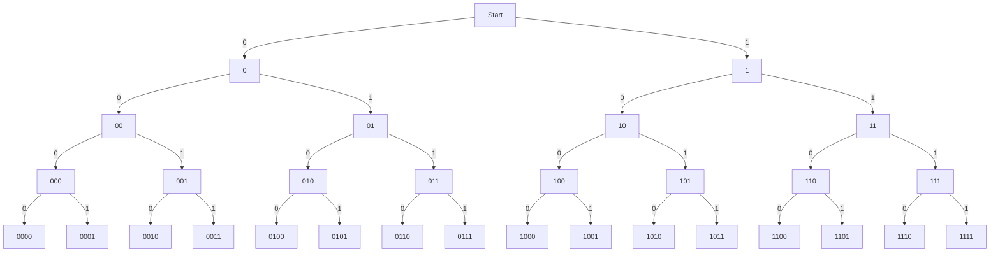

[TOC]

# 计算机组成原理

## 第一部分

### 第1章 计算机系统体系结构

### 第2章 计算机算术

#### 2.1 数据是什么

##### 2.1.1 位与字节

**计算机内存储和处理信息的最小单位是位（bit，BInary digiT），一个bit的值可以是0或者1。**bit是不可再分的，它是最小的信息单位。计算机将信息以一组或一串比特（称作字）的形式保存再存储器中。按照习惯，我们以最低位在最右端的方式书写二进制串。

计算机通常不会每次只对一个二进制位进行操作，而实对一组二进制位进行操作。**8个二进制位为一个字节（byte）。**当前的微处理器都是面向字节的，其字长都是8位的整数倍（即它们的数据和地址是8、16、32、64或128位）。一个字可以是2个、4个或8个字节长，因为它的所有位可以被分别组织为2个、4个或8个8位的组。

##### 2.1.2 位模式

一串二进制位可以表示任何数据，那么假如要将一天中的小时表示为24个不同值得一个（0 ~ 23），那么共需要多少位？如何指定这些数字对应的位模式？

<B>图 2-1 二进制树</B>

图 2-1描述了如何用1位、2位、3位和4位得到一个二进制的值序列。我们可以看到，每当数字增加1位时，路径的总数就会翻一倍。依此类推，一个$n$位的字将得到$2^n$条不同的路径或位模式。即为了用二进制数表示一个拥有最多n个值的量，应当找到一个使不等式$n<=2^m$成立得最小位数$m$。即要表示0~100这101个值则m应该等于7，因为$101<=2^7$。 

**信息表示**

一个n位得字可以表示为$2^n$个不同的位模式，那么一个n位的二进制字又可以表示什么呢？实际上最简单的大难是什么也表示不了，因为一个由二进制1和0组成的串没有任何的内在意义。如何解释一个特定的二进制数只取决于程序员赋予它何种含义。以下是一些能够用字表示的对象：

- 指令：字长位32位或更长的计算机用一个字来表示CPU能完成的操作（8位或16位的计算机用多个字来表示一条指令）。指令的二进制编码与其功能之间的关系由计算机设计者决定。例如，一台计算机上表示“A加B”的二进制序列可能与另一台计算机上的完全不同。
- 数量：一个字或多个字都可以用来表示数量。一个数可以被表示为多种格式。字节10001001可能在一个系统 中表示数值-119，在另一个系统中表示数值89。
- 字符：字符是是一个叫作“字母表”的集合中的元素。拉丁或罗马字母表中的字母、数字 字符和一些符号都被分配了二进制值，因此可以在计算机内存储和处理。
- 图像、声音和视觉：数字计算机处理大量表示声音、静态图像和视频的数据。

#### 2.2 数字

##### 2.2.1 位置记数法

位置记数法：每个数位的值或权取决于它在数字中的位置。

在位置记数法中，当一个数只剩一位时所乘的值称作基数。例如，十进制数1261等于$1\times10^3+2\times10^2+6\times10^1+1\times10^0$。

按照位置记数法，一个n位的整数N将书写为：**$a_{n-1},a_{n-2},...,a_i,...,a_1,a_0$**。

这里$a_i$是与b的幂相乘的系数（此处b为基数）。例如，当基数为10时，我们可以将$N=278$写作$a_2a_1a_0$，这里$a_2=2，a_1=7，a_0=8$。

用小数点将整数部分和小数部分分开，可以对位置记数法进行扩展，使其能够表示实数。十进制运算中的实数按照形如1234.567方式书写。一个小数点前有n位，小数点后有m位的实数被表示为：**$a_{n-1}a_{n-2}...a_i...a_1,a_0.a_{-1}a_{-2}...a_{-m}$**。

一个用基数为b的位置记数法表示的数的值被定义为：

$$N=a_{n-1}b^{n-1}+···+a_1b^1+a_0b^0+a_{-1}b^{-1}+a_{-2}b^{-2}+···+a_{-m}b^{-m}=\sum_{i=-m}^{i=n-1}a_ib^i$$

采用位置记数法，一个数的数值等于它各位置的总和，而每一位的值则是该位的数值乘以它在数中的位置所对应的权。例如十进制数1982等于$1\times10^3+9\times10^2+8\times10^1+2\times10^0$。对于任意基数b，$b^0$的值总是1。

当基数为2时，二进制数10110.11的值为$1\times2^4+0\times2^3+1\times2^2+1\times2^1+0\times2^0+1\times2^{-1}+1\times2^{-2}=22.75$。

为了区分十进制数、二进制数和十六进制数，我们分别用下标10、2和16表示基数（例如$1234_{10}，1010011_2，12A3_{16}$）。表2-2为每种数制用到的数字：

<b>表 2-2 四种数制用到的数字</b>

数制|基数|数字集合
-----|-----|-----
十进制|b=10|a={0,1,2,3,4,5,6,7,8,9}
二进制|b=2|a={0,1}
八进制|b=8|a={0,1,2,3,4,5,6,7}
十六进制|b=16|a={0,1,2,3,4,5,6,7,8,9,A,B,C,D,E,F}

注意：十进制位置记数法不能精确地表示所有小数，例如$1/3=0.3333...333$。二进制位置记数法也是如此。特别的，一些能够用十进制表示的小数是无法用二进制表示的，例如$0.1_{10}$不能被精确地转换为二进制形式。

#### 2.3 二进制运算

二进制算术运算的规则与十进制基本相同；唯一的区别在于，十进制算术运算以10为基数，没位有10个数字，而二进制运算以2为基数，每位只有2个数字。其规则如下：

- **加法：**
	- $0 + 0 = 0$
	- $0 + 1 = 1$
	- $1 + 0 = 1$
	- $1 + 1 = 0$（进位1）
	- $0 + 0 + 0 = 0$
	- $0 + 0 + 1 = 1$
	- $0 + 1 + 0 = 1$
	- $0 + 1 + 1 = 0$（进位1）
	- $1 + 0 + 0 = 1$
	- $1 + 0 + 1 = 0$（进位1）
	- $1 + 1 + 0 = 0$（进位1）
	- $1 + 1 + 1 = 1$（进位1）
- 减法：
	- $0 - 0 = 0$
	- $0 - 1 = 1$（借位1）
	- $1 - 0 = 1$
	- $1 - 1 = 0$
- 乘法：
	- $0\times0 = 0$
	- $0\times1 = 0$
	- $1\times0 = 0$
	- $1\times1 = 1$

**两个n位字的乘法：**

**被乘数**					**乘数**		   				**步骤**																		**部分积**

0100100**1**			01101001						1																								0	1	1	0	1	0	0	1

010010**0**1			01101001						2																						 0	0	0	0	0	0	0	0

01001**0**01			01101001						3																				  0	0	0	0	0	0	0	0	

0100**1**001			01101001						4																		   0	1	1	0	1	0	0	1

010**0**1001			01101001						5																    0	0	0	0	0	0	0	0

01**0**01001			01101001						6															  0	0	0	0	0	0	0	0

0**1**001001			01101001						7												      0	1	1	0	1	0	0	1

**0**1001001			01101001						8												 0	1	1	0	1	0	0	1

​																		 **结果**                                    0	0	1	1	1	0	1	1	1	1	1	0	0	0	1

**实际上，计算机不会像上述这样完成乘法运算。**

**表示范围、精度、准确性和误差**

- 表示范围：一个数所能表示的最大值和最小值的差就是它的表示范围。例如一个n位二进制自然数的表示范围为0 ~ $2^n-1$。一个n位二进制有符号补码数可以表示$-2^{n-1}$ ~ $2^{n-1}-1$之间的值。
- 精度：数的精度是数据表示得有多好的衡量标准之一。例如$\pi$就不能用二进制或十进制实数精确表示。如果用5位十进制数表示$\pi$，那么其精度为$10^5$分之一。如果用20位，则为$10^{20}$分之一。
- 准确度：数的表示值与其真实值之间的差衡量了数据表示的准确度。
- 误差：误差是准确度的衡量标准，即误差 = 真实值 - 测量值。

#### 2.4 有符号整数

计算机设计者选择了3种方法来表示负数：符号及值表示法，二进制补码表示法，移码表示法。

##### 2.4.1 符号及值表示法

表示负数的一种方法是用它的最高位表示符号。通常符号位为0表示正数，符号位为1表示负数。

有符号数的值可以记为$(-1)^s\times M$，，这里S为数的符号为的值，M为其数值部分。例如两个8位有符号二进制数00001101和10001101的值为分别为+13和-13。

n位有符号的表示范围$-(2^{n-1}-1)$ ~ $+(2^{n-1}-1)$。一个8为有符号数可以表示为-127（11111111）至+127（01111111）之间的整数。

部分人反对该系统的一个原因是它有两个值来表示0：00000000和10000000。

符号及值表示法表示法并没有被用于整数算术运算中，因为它的加、减法运算分别用加法器和减法器实现。

##### 2.4.2 二进制补码运算

微处理器用二进制补码系统表示有符号整数，因为它可以将减法运算转换为对简述的补数的加法运算。例如，用7加上5的补数就可以完成运算7减去5。

**一个数与它的补数之和是一个常数。**例如一个一位十进制数与它的补数之和总是9；2的补数是7，因为$2+7=9$。在n位二进制算术中，数P的补数为Q且$P+Q=2^n$。

在二进制算术中，**求一个数的补数的方法是将其各位数取反并加1**。例如，01100101的补数为$10011010+1=10011011$。因此一个二进制数减01100101等价于它加上补数10011011。

一个n位二进制数N的二进制补码定义为$2^n-N$。如果$N=5=00000101$，则N的补码为$2^8-00000101=10000000-00000101=11111011$。注意11111011可以代表-5或+123，这取决于我们是将二进制数11111011看作补码还是非符号整数。

下面的例子说明了8位二进制数的补码运算过程，首先我们将4个数+5、-5、+7和-7转换为补码表示：

- +5：00000101
- -5：11111011
- +7：00000111
- -7：11111001

 **正整数的补码表示是其二进制表示，与原码相同。**

现在将7与-5（11111011）相加，得到100000010，结果为9位二进制数。如果忽略最左边一位（进位位），结果为$00000010_2=+2$，这正是我们所希望看到的结果。下面来看-7（11111001）加5，得到11111110（进位位为0）。我们预期的结果为-2，即$2^8-2=100000000-00000010=11111110$。我们再一次得到了所需要的结果。

考虑n位二进制算术运算$Z=X-Y$，我们用X加上Y的补数来完成这一运算。Y的补数为$2^n-Y$，则有$Z=X+(2^N-Y)=2^n+(X-Y)$。换句话说，我们得到了所需要的结果，$X-Y$，以及位于最左边的一个并不需要的进位（$2^n$），而这个进位被丢弃了。

**对一个数两次求补将得到这个数本身。**例如，$-5=2^8-00000101=11111011$。再次求补，得到$-(-5)=100000000-11111011=00000101=5$。即$-x=2^n-x$，且$-(-x)=2^n-(2^n-x)=x$。

如下示例涵盖了被加数与加数分别为正和为负时全部四种可能的情形：

令$X=9=00001001$，$Y=6=00000110$，则有$-X=100000000-00001001=11110111$，$-Y=100000000-00000110=11111010$。

- $+X+Y=+9+6=00001001+00000110=00001111=15$

- $+X-Y=+9-6=00001001+11111010=100000011=3$

- $-X+Y=-9+6=11110111+00000110=11111101=-3$

- $-X-Y=-9-6=11110111-11111010=111110001=-15$

	

**求补运算**

考虑一个n位二进制数N的补码数，它被定义为$2^n-N$，我们将表达式$2^n-N$变为如下形式：$2^n-N=2^n-1-N+1=111...1（n位）-N+1$。

例如，8位（$n=8$）时有：$2^8-N=100000000-N=100000000-1-N+1$（调整后）$=11111111-N+1$。

表达式$11111111-N$的值很容易计算。对于N的第i位，$n_i$，若$n_i=0$，则$1-0=1$。同样，若$n_i=1$，则$1-1=0$。显然$1-n_i=\overline{n_i}$，可见计算N的补数非常容易，只需要将N的每一位取反并将结果加1即可。这种求补的方法的优点在于它很容易用硬件实现。

**补码系统的特点**

- 补码系统是一个真正的互补系统，因为$+X+(-X)=0$。
- 0的补码被表示为00...0。是唯一的。
- 补码的最高位为符号位。如果符号位是0，则该数为正，符号位为1，则该数为负。
- n位二进制补码数的表示范围$-2^{n-1}$~$2^{n-1}-1$，共$2^n$个数。
- 补码加法和减法的使用由硬件完成，因为补码减法由被减数加上减数的补数实现。

**运算溢出**

n位二进制补码数的表示范围$-2^{n-1}$~$2^{n-1}-1$。如果破坏了这个规则，即运算结果超出这个范围，那么会发生什么呢？

5位二进制补码数的表示范围为$-16$~$+15$，我们考虑如下两个情形：

- 情形一：5（00101）+7（00111）=12（01100）
- 情形二：12（01100）+13（01101）=25（11001）=-7

情形一种，我们得到了期望的结果12，但在情形二中，我们得到的结果为负数没因为它的符号位是1。如果结果视为无符号数，它将是+25，这个值显然是正确的。然而既然我们已经选择补码系统作为负数的表示方法，所有的运算结果都必须有一个合理的解释。

同样地，当两个负数相加结果小于-16时，也会超出5位二进制补码的表示范围。例如：

- 情形三：-9（10111）-12（10100）=-21（101011）=+11（01011）

情形二和情形三都说明了什么是运算溢出，它发生在补码加法当两个正数的和为负数，或两个负数的和为正数的时候。**如果操作数A和B的符号位相同但结果的符号位与它们不同，则发生了溢出。**假设A的符号位为$a_{n-1}$，B的符号位为$b_{n-1}$，A与B之和的符号位为$S_{n-1}$，则以下逻辑表达式可以用于判断是否溢出：$V=a_{n-1}·b_{n-1}·\overline{S_{n-1}}+\overline{a_{n-1}}·\overline{b_{n-1}}·S_{n-1}$。

实践中，真实系统通过加法器的进位输入和输出的最高位来判断是否发生溢出，即$V=C_{in}\neq C_{out}$。溢出是补码运算的结果，不应该与进位混淆，是否产生进位由被加数与加数的最高两位之和决定。

#### 2.5 乘除法简介

除了加减法，计算机还必须实现乘法和除法。这两个操作比加减法复杂的多，所需的完成时间也更长同时还可能需要更复杂的硬件。

##### 2.5.1 移位运算

在讨论如何进行二进制乘法之前，我们需要先了解二进制补码系统的算术移位运算（计算机实现了多种不同类型的移位操作：逻辑移位、算术移位、循环移位以及扩展移位）。进行移位运算时，一个数所有位都会向左或者向右移动一位。例如，将二进制数00101100左移一位得到01011000，右移一位变为00010110。部分计算机可以每次移动多个位。

<b>图 2-2 算术移位运算</b>

如图2-2所示，左移操作时，最低位补0，最高位被复制到进位标志中。**进位标志是计算机中的一个位存储单元，保存了进位位的状态。**

二进制补码系统中，左移一位等价于将该数乘2。例如39的二进制表示为00100111，左移一位得到01001110，对应于78。而有符号的二进制数11000101（-29）左移一位得到10001010（-58）。

二进制补码系统中，右移一位等价于将该数除以2。例如00001100（12）右移一位得到00000110（6）。负数右移时需要特别注意，简单地将补码系统中负数11100010右移一位，结果将变为01110001，这显然是不正确的。为了在移位时保持符号不变，右移时也会复制符号位。即11100010（-30）右移一位同时保持符号不变得到11110001（-15）。

为什么通过右移一位实现补码系统除以2时要在最高位补符号位？

二进制补码系统中，正数定义为0xxxx...xx（x为1或0），将该数除以2得到00ppp...pp。现在我们对0xxxx...xx求补，得到1yyyy...yy+1（这里每个y是对应x的补）。现在对00ppp...pp求补，得到11qqq...qq+1。现在我们可以看到1yyyy..yy+1右移一位将会得到11qqq...qq+1，移位前后符号位保持不变。

##### 2.5.2 无符号二进制乘法

首先我们来看人们计算二进制乘法的方式：

例如我们计算$10\times13$，乘数13（1101），被乘数（1010）：

**被乘数**			   **乘数**		   				**步骤**									**部分积**

1010					  1101		 						1										1010

1010					  1101		 						2									 0000

1010					  1101		 						3								  1010

1010					  1101		 						4						      1010

​																		 **结果**                   10000010（130）

我们从乘数的最低位开始，每次检查一位，判断它是否为0。如果乘数的当前位为1则写下被乘数，若该位为0则写下n个0。接下来检查乘数的上一位，但这个时候应从上一个数的左边一位开始写下被乘数（或0）。被写下的这一组数称为**部分积**。在得到所有的部分积后，将它们加到一起就得到乘法的结果。**两个n位的二进制数相乘会得到一个2n位的积。**

数字计算机并没有实现上面的算法，因为这种算法要求计算机存储n个部分积，然后将它们相加。一种更好的技术是每得到一个部分积时就做一次加法。方法下所示，示例参见表2-3：

- 步骤a：将计数器的值置为n。
- 步骤b：将2n位的部分积寄存器清零。
- 步骤c：检查乘数的最低位。如果该位是1，则将被乘数与部分积的最高n位相加。如果是0，则直接进入下一步。
- 步骤d：将部分积右移一位。
- 步骤e：将乘数右移一位。
- 步骤f：将计数器的值减1，重复步骤c直到n个周期后计数器的值变为0。此时部分积寄存器的内容就是乘积。

<b>表 2-3 用上述方法计算无符号数乘法</b>

<table>
 <col class=xl65 width=64 span=5 style='width:48pt'>
 <tr height=20 style='height:15.0pt'>
  <td rowspan=2 height=40 class=xl66 width=64 style='height:30.0pt;width:48pt'>周期</td>
  <td colspan=2 class=xl66 width=128 style='width:96pt'>乘数=1101</td>
  <td colspan=2 class=xl66 width=128 style='width:96pt'>被乘数=1010</td>
 </tr>
 <tr height=20 style='height:15.0pt'>
  <td height=20 class=xl65 style='height:15.0pt'>步骤</td>
  <td class=xl65>计数值</td>
  <td class=xl65>乘数</td>
  <td class=xl65>部分积</td>
 </tr>
 <tr height=20 style='height:15.0pt'>
  <td height=20 class=xl65 style='height:15.0pt'></td>
  <td class=xl65>a和b</td>
  <td class=xl65>4</td>
  <td class=xl65>1101</td>
  <td class=xl65>00000000</td>
 </tr>
 <tr height=20 style='height:15.0pt'>
  <td height=20 class=xl65 style='height:15.0pt'>1</td>
  <td class=xl65>c</td>
  <td class=xl65>4</td>
  <td class=xl65>110<u>1</u></td>
  <td class=xl65>10100000</td>
 </tr>
 <tr height=20 style='height:15.0pt'>
  <td height=20 class=xl65 style='height:15.0pt'>1</td>
  <td class=xl65>d和e</td>
  <td class=xl65>4</td>
  <td class=xl65>0110</td>
  <td class=xl65>01010000</td>
 </tr>
 <tr height=20 style='height:15.0pt'>
  <td height=20 class=xl65 style='height:15.0pt'>1</td>
  <td class=xl65>f</td>
  <td class=xl65>3</td>
  <td class=xl65>0110</td>
  <td class=xl65>01010000</td>
 </tr>
 <tr height=20 style='height:15.0pt'>
  <td height=20 class=xl65 style='height:15.0pt'>2</td>
  <td class=xl65>c</td>
  <td class=xl65>3</td>
  <td class=xl65>011<u>0</u></td>
  <td class=xl65>01010000</td>
 </tr>
 <tr height=20 style='height:15.0pt'>
  <td height=20 class=xl65 style='height:15.0pt'>2</td>
  <td class=xl65>d和e</td>
  <td class=xl65>3</td>
  <td class=xl65>0011</td>
  <td class=xl65>00101000</td>
 </tr>
 <tr height=20 style='height:15.0pt'>
  <td height=20 class=xl65 style='height:15.0pt'>2</td>
  <td class=xl65>f</td>
  <td class=xl65>2</td>
  <td class=xl65>0011</td>
  <td class=xl65>00101000</td>
 </tr>
 <tr height=20 style='height:15.0pt'>
  <td height=20 class=xl65 style='height:15.0pt'>3</td>
  <td class=xl65>c</td>
  <td class=xl65>2</td>
  <td class=xl65>001<u>1</u></td>
  <td class=xl65>11001000</td>
 </tr>
 <tr height=20 style='height:15.0pt'>
  <td height=20 class=xl65 style='height:15.0pt'>3</td>
  <td class=xl65>d和e</td>
  <td class=xl65>2</td>
  <td class=xl65>0001</td>
  <td class=xl65>01100100</td>
 </tr>
 <tr height=20 style='height:15.0pt'>
  <td height=20 class=xl65 style='height:15.0pt'>3</td>
  <td class=xl65>f</td>
  <td class=xl65>1</td>
  <td class=xl65>0001</td>
  <td class=xl65>01100100</td>
 </tr>
 <tr height=20 style='height:15.0pt'>
  <td height=20 class=xl65 style='height:15.0pt'>4</td>
  <td class=xl65>c</td>
  <td class=xl65>1</td>
  <td class=xl65>000<u>1</u></td>
  <td class=xl65>10000010</td>
 </tr>
 <tr height=20 style='height:15.0pt'>
  <td height=20 class=xl65 style='height:15.0pt'>4</td>
  <td class=xl65>d和e</td>
  <td class=xl65>1</td>
  <td class=xl65>0000</td>
  <td class=xl65>10000010</td>
 </tr>
 <tr height=20 style='height:15.0pt'>
  <td height=20 class=xl65 style='height:15.0pt'>4</td>
  <td class=xl65>f</td>
  <td class=xl65>0</td>
  <td class=xl65>0000</td>
  <td class=xl65>10000010</td>
 </tr>
</table>

该方法被称为移位相加法。

##### 2.5.3 快速乘法

实际上，移位相加法速度很慢。现实中的计算机采用了多种方法加快乘法运算的速度。例如，构造专门的逻辑阵列直接得到两个数的积而不必对操作数移位。

**与负数相乘**

上面讨论的移位相加法只适用于无符号数乘法。下面考虑一个整数X和一个负数-Y的乘法，这里-Y使用补码系统表示，表示为$2^{n}-Y$。

在二进制补码运算中，乘积$X(-Y)$就是$X(2^n-Y)=2^nX-XY$。我们期望的结果$-XY$是个负数，用二进制补码应该表示为$2^{2n}-XY$。这里最高位是$2^{2n}$，而不是$2^n$。因为两个n位数相乘会得到一个长度为2n的积。所以，为了得到正确的结果，应该给乘积加上一个矫正因子$2^{2n}-2^nX$，即$2^nX-XY+2^{2n}-2^nX=2^{2n}-XY$。实际上，矫正因子是将-X的二进制补码乘$2^n$。生成矫正银子并将它与乘积相加会使得乘法运算的速度变慢。如下示例所示：

这里，我们令X=3，Y=2，来计算X乘以-Y。3的二进制值为0011，2的二进制值为0010，补码表示下-2为1110。这样，使用0011乘以1110，得到8位二进制数00101010，这个数是十进制下的+42，线然这个数比我们预期的答案大的多。为了得到正确结果，应将乘积与这个矫正因子相加。-X的值为1101，乘以$2^4$得到11010000。所以00101010+11010000得到11111010，即得到正确结果-6的补码表示。

**布斯乘法**

布斯乘法是两个二进制补码有符号数相乘的经典方法，它适用于两个整数、一个负数和一个正数、两个负数相乘的情形。布斯乘法与传统的二进制无符号数乘法相似，但有一些不同。它将根据乘数相邻两位的值确定接下来将进行以下3种操作的哪一种：

- 若乘数当前位为1，下一位为0，则用部分积减去被乘数，得到新的部分积。
- 若乘数当前位为0，下一位为1，则用部分积加上被乘数，得到新的部分积。
- 若乘数当前位与下一位相同，则什么也不做。

注意事项：

- 当被乘数与部分积相加时，产生的进位将被丢弃。
- 部分积移位时，使用算术移位，最高位补符号位。
- 乘法开始时，乘数的最低位的下一位为0。
- 加减被乘数的操作均发生在最高n位上。

表 2-4 给出了使用布斯乘法计算+15（01111）乘以-13（10011）的过程：

<b>表 2-4 布斯乘法实例</b>

<table>
 <col class=xl65 width=64 span=2 style='width:48pt'>
 <col class=xl65 width=145 style='mso-width-source:userset;mso-width-alt:5302;
 width:109pt'>
 <tr height=20 style='height:15.0pt'>
  <td rowspan=2 height=40 class=xl65 width=64 style='height:30.0pt;width:48pt'>操作</td>
  <td rowspan=2 class=xl65 width=64 style='width:48pt'>乘数位</td>
  <td class=xl65 width=145 style='width:109pt'>部分积</td>
 </tr>
 <tr height=20 style='height:15.0pt'>
  <td height=20 class=xl65 style='height:15.0pt'>初始 0000000000</td>
 </tr>
 <tr height=20 style='height:15.0pt'>
  <td height=20 class=xl65 style='height:15.0pt'>减去被乘数</td>
  <td class=xl65>1001<u>10</u></td>
  <td class=xl65>1000100000</td>
 </tr>
 <tr height=20 style='height:15.0pt'>
  <td height=20 class=xl65 style='height:15.0pt'>部分积右移一位</td>
  <td class=xl65></td>
  <td class=xl65>1100010000</td>
 </tr>
 <tr height=20 style='height:15.0pt'>
  <td height=20 class=xl65 style='height:15.0pt'>什么也不做</td>
  <td class=xl65>100<u>11</u></td>
  <td class=xl65>1100010000</td>
 </tr>
 <tr height=20 style='height:15.0pt'>
  <td height=20 class=xl65 style='height:15.0pt'>部分积右移一位</td>
  <td class=xl65></td>
  <td class=xl65>1110001000</td>
 </tr>
 <tr height=20 style='height:15.0pt'>
  <td height=20 class=xl65 style='height:15.0pt'>加上被乘数</td>
  <td class=xl65>10<u>01</u>1</td>
  <td class=xl65>10101101000</td>
 </tr>
 <tr height=20 style='height:15.0pt'>
  <td height=20 class=xl65 style='height:15.0pt'>部分积右移一位</td>
  <td class=xl65></td>
  <td class=xl65>0010110100</td>
 </tr>
 <tr height=20 style='height:15.0pt'>
  <td height=20 class=xl65 style='height:15.0pt'>什么也不做</td>
  <td class=xl65>1<u>00</u>11</td>
  <td class=xl65>0010110100</td>
 </tr>
 <tr height=20 style='height:15.0pt'>
  <td height=20 class=xl65 style='height:15.0pt'>部分积右移一位</td>
  <td class=xl65></td>
  <td class=xl65>0001011010</td>
 </tr>
 <tr height=20 style='height:15.0pt'>
  <td height=20 class=xl65 style='height:15.0pt'>减去被乘数</td>
  <td class=xl65><u>10</u>011</td>
  <td class=xl65>1001111010</td>
 </tr>
 <tr height=20 style='height:15.0pt'>
  <td height=20 class=xl65 style='height:15.0pt'>部分积右移一位</td>
  <td class=xl65></td>
  <td class=xl65>1100111101</td>
 </tr>
</table>

有些程序员使用移位和加法等速度相对较快的操作以避免使用乘法，例如P乘以10和P乘以9可分别进行如下分解：

- $10P=2\times(2\times2\times P+P)$，即将P左移两次，加上P再将和左移一次。
- $9P=2\times2\times2\times P + P$，即将P左移三次，再加上P。

乘法运算也可以借助查找表（look-up table）实现。这种方法将两个数相乘所有可能的积保存在一个只读存储器内。这样，只需要简单地用X和Y的值找到表中的对应项就可以得到X和Y的积。例如两个8位二进制数乘法需要一个16位地址即$2^{16}$项的查找表，每项记录一个16位的积。计算00001010乘以00111100的积只需要读出地址0000101000111100的项的内容0000001001011000即可。

这种方法的缺点也很明显，所需ROM的容量随着乘数和被乘数的位数的增长呈指数增长。

##### 2.5.4 除法

二进制补码数胸痛