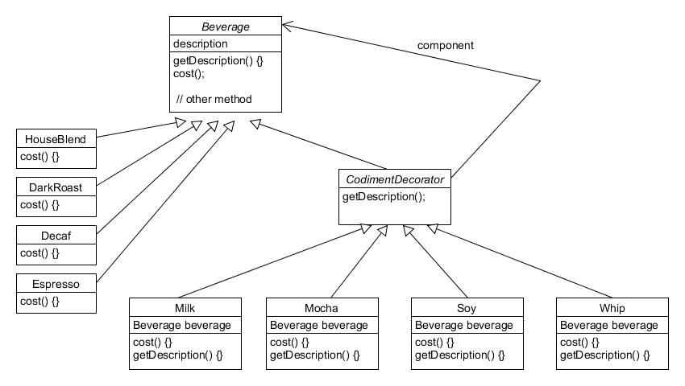
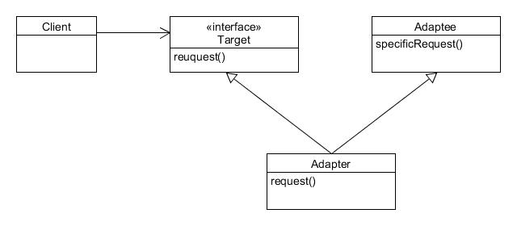
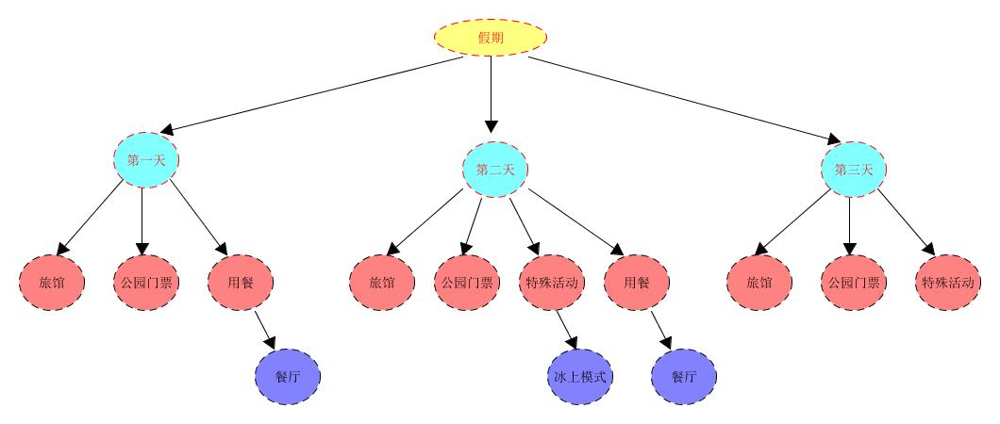

[TOC]

# Head First Design Patterns 笔记

## 前言

为什么要学习和使用设计模式？

>
1. 知道OO基础，并不足以让你设计出良好的OO系统。
2. 良好的OO设计必须具备可复用、可扩充、可维护三个特性。
3. 模式可以让我们建造出具有良好OO设计质量的系统。
4. 模式被认为是历经验证的。
5. 模式不是代码，而是针对设计问题的通用解决方案。你可以把它们应用到特定的应用中。
6. 模式不是被发明，而是被发现。
7. 大多数模式和原则，都着眼于软件变化的主题。
8. 大多数的模式都允许系统局部改变独立与其它部分。
9. 我们常把系统中会变化的部分抽出来封装。
10. 模式让开发人员之间有共享的语言，能最大化沟通价值。

## 第一章 策略模式 Strategy Pattern

> 该模式定义了算法族，分别封装起来，让它们之间可以相互替换，此模式让算法的变化独立于使用算法的客户。

### 1.1 引入问题
本章从简单的模拟鸭子的应用讲起。
Joe任职的公司有一个模拟鸭子的游戏，SimUDuck。游戏中会出现各种各样的鸭子，一边游泳戏水，一边呱呱叫。
在这个游戏设计中我们定义了一个超类Duck，并让各种鸭子继承它。

所有的鸭子都会呱呱叫，也都会游泳，所以这部分代码由超类进行负责。
由于每种鸭子的外观都不同。所以每个鸭子子类实现自己的display()行为。

现在Joe收到新的需求，需要给鸭子添加一个飞的方法，使鸭子实现飞的功能。
>Joe：我只需要在Duck类中加上fly()方法，然后所有鸭子都会继承该方法。

现在整个系统变成了这个样子：

看上去Joe好像满足了使鸭子会飞的需求。但是这样的设计导致了可怕的问题。
>项目经理：Joe，我正在股东会议上，刚刚看了一下展示，有很多“橡皮鸭子”在屏幕上飞来飞去，这是你在开玩笑吗？

Joe忽略一件事，并非所有Duck子类都会飞。在超类Duck中添加新的行为会导致原本不适合该行为的子类也具有该行为。

***对代码所做的局部修改，影响层面可不只是局部***

Joe想到了我可以对非法的方法进行覆盖，变成什么都不做

问题出现了：这样的设计会导致每当有新的鸭子子类出现时，他就要被迫检查并可能需要覆盖fly()和quark()方法。而这样的修改可以是无穷无尽的噩梦。

Joe的另一个想法出现了：
>我可以把fly()从超类中取出来，放进一个Flyable接口中。止呕会飞的鸭子才实现这个接口。同样的方式，也可以设计一个Quackable接口，因为不是所有的鸭子都会叫。

经过这样的设计，系统现在变成了这样：

但是。。。
>项目经理：这真是一个超笨的主意，你没发现这么一来重复的代码会变多吗？如果你认为覆盖你个和方法就算是差劲，那么对于48个Duck子类都要稍微修改一下飞行的行为，你又怎么说？

并非所有的子类都具有飞行和呱呱叫的行为，所以继承并不是适当的解决方法。虽然两个接口可以解决一部分问题（不再出现会飞的橡皮鸭），但是却造成代码无法复用。甚至在会飞的鸭子中，飞行的动作还会又多种变化....

现在我们知道使用继承并不能很好的解决问题，因为鸭子的行为在子类中不断的改变，并且让所有的子类都有这些行为是不恰当的。Flyable于Quackable接口一开始还挺不错，解决了问题。但是java接口不具有实现代码(现在有default方法了....)，这意味着：无论何时你需要修改某个行为，你必须得往下追踪并在每一个定义此行为的类中修改它。  

---
**设计原则**  

*一、找出应用中可能需要变化之处，把它们独立出来，不要和那些不需要变化的代码混在一起。*

---

这样代码变化引起的不经意后果变少，系统变得更有弹性。

### 1.2 策略模式

我们知道Duck类内的fly()和quack()会随着鸭子的不同而改变。为了要把这两个行为从Duck类中分开，我们将把它们从Duck类中取出来，建立一组新类来代表每个行为。
>鸭子类：依然是所有鸭子的超类。  
鸭子行为：拆分为飞行行为和呱呱叫行为两个类。

让鸭子的行为可以动态的改变，可以在“运行时”动态地“改变”具体鸭子的飞行行为和呱呱叫行为。

---
**设计原则**  

*二、针对接口编程，而不是针对实现编程。*

---

>“针对接口编程”真正的意思是“针对超类型编程”。“针对超类型编程”更明确地说：变量的声明类型应该是超类型，通常是一个抽象类或者是一个接口，如此只要是具体的实现此类型的类所产生的对象都可以指定给这个变量。这意味着，声明类时不用理会以后执行时的真正对象类型。

    //针对实现编程
    Dog d = new Dog();
    d.bark();
    Cat c = new Cat();
    c.meow();

    class Dog {
        void bark() {}
    }

    //针对超类型编程
    Animal animal = new Dog();
    animal.makeSound();
    animal = new Cat();
    animal.makeSound();

    interface Animal {
       void makeSound();
    }

    class Dog implements Animal {
        @Override
        public void makeSound() {
            bark();
        }
        void bark() {}
    }

    class Cat implements Animal {
        @Override
        public void makeSound() {
            meow();
        }
        void meow() {}
    }

我们利用接口来代表每个行为：FlyBehavior QuackBehavior。具体的行为都将实现其中的一个接口。
在我们的设计中，鸭子的子类将使用接口所表示的行为，所以实际的“实现”不会被绑死在鸭子的子类中。

这样的设计，可以让飞行和呱呱叫的行为被其它的对象复用，因为这些行为已经与鸭子无关了。而当我们新增加行为时也不会影响到既有的行为类，也不会影响“使用”到飞行行为的鸭子。
>这么一来，有了继承的“复用”好处，却没有继承所带来的包袱。

具体代码如下：

抽象基类：Duck
   
    package ch_01_StrategyPattern.duck.ducks;

    import ch_01_StrategyPattern.duck.flyBehavior.FlyBehavior;
    import ch_01_StrategyPattern.duck.quackBehavior.QuackBehavior;

    // 抽象基类Duck
    public abstract class Duck {
         // 含有两个策略
        protected FlyBehavior flyBehavior;
        protected QuackBehavior quackBehavior;
    
        public Duck() {
        
        }
    
        // Duck的共有方法，无论是什么鸭子均有该行为。
        public void swim() {
            System.out.println("All ducks float, even decoys");
        }
    
        public abstract void display();
        
        // 两个perform方法把具体的行为委托给了行为类
        public void performFly() {
            flyBehavior.fly();
        }
        
        public void performQuack() {
            quackBehavior.quack();
        }
        
        // 设置行为的方法
        public void setFlyBehavior(FlyBehavior fb) {
            flyBehavior = fb;
        }
        
        public void setQuackBehavior(QuackBehavior qb) {
            quackBehavior = qb;
        }
    }

FlyBehavior接口：

    package ch_01_StrategyPattern.duck.flyBehavior;

    // fly行为实现类均实现该接口
    public interface FlyBehavior {
        public void fly();
    }

QuackBehavior接口：

    package ch_01_StrategyPattern.duck.quackBehavior;

    // quack实现类均实现该接口
    public interface QuackBehavior {
        public void quack();
    }

FlyBehavior实现：

1、FlyNoWay：不会飞

    package ch_01_StrategyPattern.duck.flyBehavior;

    public class FlyNoWay implements FlyBehavior {
        @Override
        public void fly() {
            System.out.println("I can't fly");
        }
    }

2、FlyWithWings：用翅膀飞

    package ch_01_StrategyPattern.duck.flyBehavior;

    public class FlyWithWings implements FlyBehavior {
        @Override
        public void fly() {
            System.out.println("I'm flying");
        }
    }

QuackBehavior实现：

1、Quack：正常呱呱叫

    package ch_01_StrategyPattern.duck.quackBehavior;

    public class Quack implements QuackBehavior {
        @Override
        public void quack() {
            System.out.println("Quack");
        }
    }

2、Squeak：吱吱叫

    package ch_01_StrategyPattern.duck.quackBehavior;

    public class Squeak implements QuackBehavior {
        @Override
        public void quack() {
            System.out.println("Squeak");
        }
    }

3、MuteQuack：不会叫

    package ch_01_StrategyPattern.duck.quackBehavior;

    public class MuteQuack implements QuackBehavior {
        @Override
        public void quack() {
            System.out.println("<<Silence>>");
        }
    }

Duck的子类：

1、MallardDuck：绿头鸭

    package ch_01_StrategyPattern.duck.ducks;

    import ch_01_StrategyPattern.duck.flyBehavior.FlyWithWings;
    import ch_01_StrategyPattern.duck.quackBehavior.Quack;

    public class MallardDuck extends Duck {

        // 初始化时指定行为，“正常叫，使用翅膀飞”
        public MallardDuck() {
            quackBehavior = new Quack();
            flyBehavior = new FlyWithWings();
        }

        @Override
        public void display() {
            System.out.println("I'm a real Mallard duck");
        }

    }

2、ModelDuck：模型鸭子

    package ch_01_StrategyPattern.duck.ducks;

    import ch_01_StrategyPattern.duck.flyBehavior.FlyNoWay;
    import ch_01_StrategyPattern.duck.quackBehavior.Quack;

    public class ModelDuck extends Duck {
        
        // 初始化时指定行为，“不会飞，不会叫”
        public ModelDuck() {
            flyBehavior = new FlyNoWay();
            quackBehavior = new MuteQuack();
        }

        @Override
        public void display() {
            System.out.println("I'm a model duck");
        }

    }

DuckClient测试类：

    package ch_01_StrategyPattern.duck.duckClient;

    import ch_01_StrategyPattern.duck.ducks.Duck;
    import ch_01_StrategyPattern.duck.ducks.MallardDuck;
    import ch_01_StrategyPattern.duck.ducks.ModelDuck;
    import ch_01_StrategyPattern.duck.flyBehavior.FlyRocketPowered;

    public class MiniDuckSimulation {

        public static void main(String[] args) {
            
            Duck mallard = new MallardDuck();
            mallard.performQuack();
            mallard.performFly();

        }

    }

这里我们使用父类引用来创建绿头鸭，绿头鸭在初始化时行为被设定为“正常叫，使用翅膀飞”。由于perform方法的具体实现已经被委托给了两个行为类。所以当调用performQuack()和performFly()方法时会显示：

    /* output:
    Quack
    I'm flying
    */

现在我们有了新的需求，由于模型鸭子不会飞，我们现在要给它增加一个使用火箭助推的飞行行为。我们已经定义了给两个行为赋值的setter方法，所以我们只要定义一个新的飞行行为类并使用setter设置就可以了

该行为同样需要实现FlyBehavior

    package ch_01_StrategyPattern.duck.flyBehavior;

    public class FlyRocketPowered implements FlyBehavior {

        @Override
        public void fly() {
            System.out.println("I'm flying with a rocket!");
        }

    }

现在在Client中进行测试：

        duck model = new ModelDuck();
        model.performFly();
        model.setFlyBehavior(new FlyRocketPowered());
        model.performFly();

在更改行为前我们先调用一次performFly()方法，再设置新的飞行行为，然后在此调用performFly()方法。

    /* output:
    I can't fly
    I'm flying with a rocket!
    */

下面是整个重新设计后的类结构图：

鸭子继承Duck，飞行行为实现FlyBehavior接口，呱呱叫行为实现QuackBehavior接口。
在此我们不再把鸭子的行为说成是“一组行为”，我们开始把行为想成是“一组算法”。

>**“有一个”可能比“是一个”更好**

“有一个”关系相当有趣：每一个鸭子都有一个FlyBehavior和一个QuackBehavior，好将行为委托给它们代为处理。
当将两个类结合起来使用时，这称为*组合(composition)*。这种做法和继承不同的地方在于：鸭子的行为不是继承来的，而是和适当的行为对象组合来的。

---
**设计原则**  

*三、多用组合，少用继承。*

---
组合建立系统具有很大的弹性，不仅课将算法族封装成类更可以“在运行时动态地改变行为”，只要组合的行为对象复合正确的接口标准即可。

## 第二章 观察者模式 Observer Pattern

>该模式定义了对象之间的一对多依赖，这样一来，当一个对象改变状态时，它的所有依赖者都会收到通知并自动更新。

### 2.1 引入问题

本章引入一个描述气象观测站的系统。此系统的三个部分是：气象站（获取实际气象数据的物理装置）、WeatherData对象（追踪来自气象站的数据，并更新布告板）以及布告板（显示目前天气状况给用户看）。

在系统中，WeatherData对象知道如何跟物理气象站通信，以取得更新的数据。然后WeatherData对象会随即更新三个布告板的显示：目前状况（温度、湿度、气压）、气象统计和天气预报。

 

这里我们的工作是实现measureMentsChanged()方法，好让它更新布告板。

我们目前得到的信息：
1. WeatherData类具有getter方法，可以取得三个测量值。
2. 当新的测量数据就绪后，measurementsChanged()方法就会被调用。（我们不在乎此方法是如何调用的，我们之在乎它被调用了）
3. 我们需要实现三个布告板。WeatherData有新的测量数据，这些布告板必须马上得到更新。
4. *此系统必须可扩展，让其它开发人员可以建立定制的布告板。用户也可以随心所欲地添加或删除任何布告板。*

**这里我们先来看一个错误的实现：**

    public class WeatherData {

        // 实例变量声明

        public void measurementsChanged() {

            // 调用三个getter方法获取当前状态
            float temp = getTemperature();
            float humidity = getHumidity();
            float pressure = getPressure();

            // 调用updata方法对布告板进行更新
            currentConditionsDisplay.updata(temp, humidity, pressure);
            statisticsDisplay.updata(temp, humidity, pressure);
            forecastDisplay.updata(temp, humidity, pressure);
        }
        // other methods ...
    }

在这个实现中：
>
1. 我们是针对具体实现编程，而不是针对接口。
2. 对于每个新的布告板，我们都需要修改代码。
3. 我们无法在运行时动态地增加或删除布告板。
4. 我们没有封装改变的部分。

三个Display方法针对了具体实现编程，会导致我们以后在增加或删除布告板时必须修改程序。
>改变的地方应该封装起来。

### 2.2 观察者模式

对观察者模式的一个很好的比喻时报纸的订阅。

>
1. 报社的业务就是出版报纸。
2. 向某家报社订阅报纸，只要它们有新的报纸出版，就会给你送来。只要你是它们的订户，你就会一直收到新报纸。
3. 当你不想再看报纸时，取消订阅，它们就不会再送新报纸来。
4. 只要报社还在运营，就会一直有人向它们订阅报纸或取消订阅。

**出版者+订阅者=观察者模式**
在观察者模式中，出版者改称为“主题”（Subject），订阅者改称为“观察者”（Observer）。

>观察者模式定义了一系列对象之间的一对多关系。当一个对象改变状态，其它依赖者都会收到通知。

观察者模式类图：
 

当两个对象之间松耦合，它们依然可以交互，但是不太清楚彼此的细节。
观察者模式提供了一种对象设计，让主题和观察者之间松耦合。

松耦合是如何实现的？
**
1. 关于观察者的一切，主题只知道观察者实现了某个接口（Observer）。主题不需要知道观察者具体是谁、做了些什么或其它任何细节。
2. 任何时候我们都可以增加新的观察者。因为主题唯一依赖的东西是一个实现Observer接口对象列表，我们可以随时增加观察者。事实上在运行时我们可以用新的观察者取代现有观察者，而主题不会受到任何影响。同样地，也可以在运行时删除某些观察者。
3. 在有新类型的观察者出现时，主题的代码不需要修改。所有要做的就是在新的类中实现观察者接口，然后注册称为观察者即可。
4. 我们可以独立地复用主题或观察者，因为二者并非紧耦合。
5. 改变主题或观察者其中一方，并不会影响另一方，只要它们之间的接口扔被遵守，我们就可以自由地改变它们。
**

---
**设计原则**  

*四、为了交互对象之间的松耦合设计而努力。*

---

完整的类图：

三个接口：

    package ch_02_ObserverPattern.weatherStation;

    // 主题接口
    public interface Subject {
        public void registerObserver(Observer o); // 注册一个观察者
        public void removeObserver(Observer o); // 删除一个观察者
        public void notifyObservers(); // 当主题改变时，这个方法会被调用，以通知所有的观察者。
    }

    package ch_02_ObserverPattern.weatherStation;

    // 观察者接口
    public interface Observer {
        
        // 当气象观测值发生改变时，主题会把这些状态值当作方法的参数，传送给观察者。
        public void update(float temperature, float humidity, float pressure);

    }

    package ch_02_ObserverPattern.weatherStation;

    // 显示接口
    public interface DisplayElement {
        
        public void display(); // 当布告板需要显示时，调用此方法

    }

WeatherData类：实现Subject接口

    package ch_02_ObserverPattern.weatherStation;

    import java.util.ArrayList;
    import java.util.Iterator;

    // ConcreteSubject实现Subject
    public class WeatherData implements Subject {
        
        private ArrayList<Observer> observers; // 定义一个ArrayList来记录观察者
        private float temperature;
        private float humidity;
        private float pressure;
        
        public WeatherData() {
            observers = new ArrayList<>();
        }

        @Override
        public void registerObserver(Observer o) {
            observers.add(o); // 当注册观察者时，我们只要把它加到ArrayList后面即可。
        }

        @Override
        public void removeObserver(Observer o) { 
            // 当观察者想取消注册时，我们把它从ArrayList中删除
            Iterator<Observer> it = observers.iterator();
            while (it.hasNext()) {
                if (it.next().equals(o))
                    it.remove();
            }
        }

        @Override
        public void notifyObservers() {
            // 把状态通知每一个观察者，由于观察者均实现了Observer接口，
            // 故调用其update方法即可
            for (Observer obs : observers) {
                obs.update(temperature, humidity, pressure);
            }
        }
        
        public void measurementChanged() {
            // 当从气象站得到更新观测值时，通知观察者
            notifyObservers();
        }
        
        public void setMeasurements(float temperature, float humidity, float pressure) {
            this.temperature = temperature;
            this.humidity = humidity;
            this.pressure = pressure;
            measurementChanged();
        }
        
        // other method ...

    }

建立一个布告板：

    package ch_02_ObserverPattern.weatherStation;

    public class CurrentConditionDisplay implements Observer, DisplayElement {

        private float temperature;
        private float humidity; 
        private Subject weatherData;
        
        public CurrentConditionDisplay(Subject weatherData) {
            // 构造器需要weatherData对象作为注册之用。
            this.weatherData = weatherData;
            weatherData.registerObserver(this);
        }   
        
        @Override
        public void update(float temperature, float humidity, float pressure) {
            // 更新数据，并显示出来
            this.temperature = temperature;
            this.humidity = humidity;
            display();
        }
        @Override
        public void display() {
            System.out.println("Current Conditions: " + temperature + "F degrees and " + humidity + " % humidity");
        }
    }

客户端测试：

    package ch_02_ObserverPattern.weatherStation;

    public class WeatherStation {

        public static void main(String[] args) {
            
            WeatherData weatherData = new WeatherData();
            
            new CurrentConditionDisplay(weatherData);
            
            weatherData.setMeasurements(80, 65, 30.4f);

        }

    }

### 2.3 使用Java内置的观察者模式进行实现

Java API有内置的观察者模式。util包中含有最基本的Observer接口与Observable**类**。Observer接口与Observable类使用上很方便，许多功能都已经事先准备好了。甚至可以使用push或pull的方式传送数据。

push：Subject推送数据。
pull：Observer主动获取数据。

修改后的类图:

Java内置的观察者模式如何运作：
1. 把对象变为观察者
实现观察者接口（java.util.Observer），然后调用任何Observable对象的addObserver()方法。不想再当观察者时，调用deleteObserver()方法即可。
2. 观察者送出通知
首先继承java.util.Observable类以产生可观察者，。调用setChanged()方法标记状态已经发生改变，然后调用notifyObservers()或notifyObservers(Object arg)告知观察者。
3. 观察者接收通知
观察者实现了更新方法，update(Observable o, Object arg)。主题本身作为该方法的第一个变量，让观察者知道是哪个主题进行的通知。当可观察者送出通知时使用notifyObservers(Object arg)可以传送任何数据对象给每一个观察者，这个Object arg与update方法的第二个变量是同一变量。
如果要push数据给观察者，可以把数据当作数据对象传送给notifyObservers(arg)方法。

关于setChangedf()方法：
该方法用来标记状态已经改变的事实，好让notifyObservers()知道当它被调用时应该更新观察者。如果调用notifyObservers()前没有调用setChanged()，则观察者就“不会”被通知。

Observable类内部部分源码：

    private boolean changed = false; // 设置一个标签changed，初始化false
    private Vector<Observer> obs; // 观察者集合由Vector实现

    protected synchronized void setChanged() { // 调用setChanged()，标签changed变为true
        changed = true;
    }

    protected synchronized void clearChanged() { // 调用该方法重置changed标签
        changed = false;
    }

    public synchronized boolean hasChanged() { // 此方法用于获取changed标签当前的状态
        return changed;
    }

    public void notifyObservers() { // 通知观察者
        notifyObservers(null);
    }

    public void notifyObservers(Object arg) { // 通知观察者

        Object[] arrLocal; // 定义局部变量arrLocal

        synchronized (this) {
            if (!changed) // 如果changed为false，则方法直接返回
                return;
            arrLocal = obs.toArray(); // 将观察者集合转为数组
            clearChanged(); // 重置changed标签
        }

        // 注意：这里通知的顺序是数组从后向前通知
        // 即Vector集合中的观察者从后向前得到通知
        for (int i = arrLocal.length-1; i>=0; i--)
            ((Observer)arrLocal[i]).update(this, arg);
    }

重构代码：

定义可观察者：

    // 继承Observable后，就不再需要追踪观察者了，也不需要管理注册与删除，因为超类会代劳这部分。

    package ch_02_ObserverPattern.weatherStationObservable;

    import java.util.Observable;

    public class WeatherData extends Observable {
    
        private float temperature;
        private float humidity;
        private float pressure;
    
        public WeatherData() {
            // 构造器不需要为了记住观察者而建立数据结构了
        }
    
        public void measurementsChanged() {
            setChanged(); // 调用notifyObservers前需要先调用setChanged
            notifyObservers(); // 唤醒所有的Observer，调用其update方法
        }
    
        public void setMeasurements(float temperature, float humidity, float pressure) {
            this.temperature = temperature;
            this.humidity = humidity;
            this.pressure = pressure;
            measurementsChanged();
        }
    
        public float getTemperature() {
            return temperature;
        }
    
        public float getHumidity() {
            return humidity;
        }
        
        public float getPressure() {
            return pressure;
        }

    }

定义一个当前天气布告板：

    package ch_02_ObserverPattern.weatherStationObservable;
    import java.util.Observable;
    import java.util.Observer;
    import ch_02_ObserverPattern.weatherStation.DisplayElement;
    // 实现Observer接口，成为观察者

    public class CurrentConditionsDisplay implements Observer, DisplayElement {
    
        private Observable observable;
        private float temperature;
        private float humidity;    

        public CurrentConditionsDisplay(Observable observable) {
            this.observable = observable;
            this.observable.addObserver(this); // 注册成为observable的观察者
        }
        
        @Override
        public void update(Observable obs, Object arg) {
            if (obs instanceof WeatherData) {
                WeatherData weatherData = (WeatherData) obs;
                this.temperature = weatherData.getTemperature();
                this.humidity = weatherData.getHumidity();
                display();
            }
        }

        @Override
        public void display() {
            System.out.println("Current Conditions: " + temperature + "F degrees and " + humidity + " % humidity");
        }
    }

定义一个预报布告板：

    package ch_02_ObserverPattern.weatherStationObservable;
    import java.util.Observable;
    import java.util.Observer;
    import ch_02_ObserverPattern.weatherStation.DisplayElement;

    public class ForecastDisplay implements Observer, DisplayElement {
    
        private Observable observable;
        private float currentPressure = 29.92f;
        private float lastPressure;
        
        public ForecastDisplay(Observable observable) {
            this.observable = observable;
            this.observable.addObserver(this);
        }

        @Override
        public void update(Observable obs, Object arg) {
            if (obs instanceof WeatherData) {
                WeatherData weatherData = (WeatherData) obs;
                lastPressure = currentPressure;
                currentPressure = weatherData.getPressure();
                display();
            }
        }

        @Override
        public void display() {
            System.out.println("Forecast: pressure goes " + ( currentPressure - lastPressure > 0 ? "high" : "low" ));
        }
    }

测试用客户端：

    package ch_02_ObserverPattern.weatherStationObservable;

    public class WeatherStation {

        public static void main(String[] args) {
            
            WeatherData wd = new WeatherData();
            
            new CurrentConditionsDisplay(wd);
            new ForecastDisplay(wd);
            
            wd.setMeasurements(50, 34.3f, 30.1f);
        }
    }

output：
Forecast: pressure goes high
Current Conditions: 50.0F degrees and 34.3 % humidity

输出表明预告布告板先得到通知，这与Observable类中的源码是相符合的。
Observer集合被从后向前通知。

>java.util.Observable的黑暗面
Observable是一个类，而不是一个接口。我们必须去继承它，但如果我们同时还想继承其他类，就会导致多重继承的情况发生。其次setChanged方法是一个protected方法，这意味着除非继承Observable，否则你无法创建Observable实例并组合到你自己的对象中。这个设计违反了设计原则-----**多用组合，少用继承**。
同时不要依赖于观察者被通知的次序。java.util.Observable实现了notifyObservers()方法，这导致了通知观察者的次序（从后向前通知）与我们自己定义的观察者模式的通知顺序（从前向后）不同。这不是错误，只是双方选择不同实现方式罢了。但要注意，一旦我们的代码依赖于通知顺序就会产生问题，一旦notifyObservers()方法的实现发生变动就可能会导致通知次序的变动，从而导致错误的结果。

Java权限修饰符：

### 2.4 要点
- 观察者模式定义了对象之间的一对多关系。
- 主题（Subject即可观察者）用一个共同的接口来更新观察者。
- 观察者和可观察者之间用松耦合的方式结合，可观察者不知道观察者的具体细节，只知道观察者实现了观察者接口。
- 使用此模式时，你可以从被观察者处推（push）或拉（pull）数据。通常推的方式被认为更“正确”。
- 有多个观察者时，不可以依赖特定的通知次序。
- Java有多种观察者模式的实现，包括通用的java.util.Observable。
- 要注意java.util.Observable实现上所带来的一些问题。
- 如果有必要的话，尽量自己实现观察者模式，不要用java.util.Observable。
- Swing大量使用观察者模式，许多GUI框架也是如此。
- 此模式也被用在许多地方，比如JavaBeans、RMI（Remote Method Invocation）。

## 第三章 装饰者模式 Decorate Pattern

>该模式动态地将责任附加到对象上。想要扩展功能，装饰者提供比继承更有弹性的替代方案。

### 3.1 引入问题
对星巴兹的订单系统进行改造。
原系统类图：

购买咖啡时也可以要求其中加入各种调料，比如蒸奶（Steamed milk）、豆浆（Soy）、摩卡（Mocha）等等。星巴兹会根据所加入的调料收取不同的费用，所以订单系统必须要考虑这一部分。

第一个可能的尝试，将所有的咖啡类与调料类进行组合，创建出新类添加到系统中。
可能的新类：HouseBlendWithSteamMilk、HouseBlendWithSoy、HousetBlendWithMocha、HouseBlendWithSteamMilkAndSoy......
**类多到爆炸！**同时对于这个系统而言，任何的添加、删除及修改动作都将是毁灭性的，咖啡类、调料类与二者的组合类之间形成了强耦合，对任何咖啡类和调料类的修改都将导致我们不得不同时修改二者的组合类。**显然这是一个维护噩梦！**

第二个可能的尝试，利用实例变量和继承对这些调料进行追踪。
类图：

代码示例：cost()的实现

    public class Beverage {

        // ...

        private double condimentCost = 0; // 调料总价
        if (hasMilk()) {
            condimentCost += milkCost;
        }
        if (hasSoy()) {
            condimentCost += soyCost;
        }
        if (hasMocha()) {
            condimentCost += mochaCost;
        }
        if (hasWhip()) {
            condimentCost += whipCost;
        } 

        return condimentCost;
    } 

    public class DarkRoast extends Beverage {
        
        public DarkRoast() {
            description = "Most Excellent Dark Roast";
        }

        public double cost() {
            return 1.99 + super.cost(); // 特定的饮料价格加上调料总价
        }
    }

这个系统的问题：

+ 调料的价格改变会导致我们改变现有代码。
+ 一旦出现新的调料，我们就需要加上新的方法，并改变超类的cost()
方法。
+ 以后可能会开发出新的饮料（比如：冰茶）。对于某些饮料而言，某些调料可能并不合适，但是在这个系统中， Tea子类仍将继承那些不适合的方法，例如hasWhip()。
+ 万一顾客想要双倍摩卡，该怎么做？
+ ...

---
**设计原则**  

*五、类应该对扩展开放，对修改关闭。（开放-关闭原则）*

---

>虽然似乎有点矛盾，但是的确有一些技术可以允许在不直接修改代码的情况下对其进行扩展。在选择需要被扩展的代码部分要小心。每个地方都采用开放-关闭原则是一种浪费，也没必要，还会导致代码变得复杂且难以理解。

### 3.2 采用装饰者模式

我们以饮料为主题，然后再运行时以调料来“装饰”饮料。例如顾客想要摩卡和奶泡深焙咖啡，那么要做的是：

1. 拿一个DarkRoast对象
2. 以Mocha对象装饰它
3. 以Whip对象装饰它
4. 调用cost()方法，并以来委托将调料的价格加上去

类图：

当调用最外圈的装饰者（Whip）的cost()时就可以得到总价钱。Whip的cost()方法调用它装饰的对象（Mocha）的cost()方法，而Mocha会调用DarkRoast的cost()方法。DarkRoast的cost()返回价格，Mocha在DarkRoast的基础上加上自己的价格，并返回。Whip在Mocha返回的结果的基础上加上自己的价格并作为最终价格返回。

目前我们所知道的一切：

- 装饰者和被装饰对象有相同的超类型。
- 你可以用一个或多个装饰者包装一个对象。
- 既然装饰者和被装饰者具有相同的超类型，所以在任何需要原始对象的场合都可以用装饰过的对象代替它。
- 装饰者可以在所委托被装饰者的行为之前与/或之后加上自己的行为已达到特定的目的。
- 对象可以在任何时候被装饰，所以可以在运行时动态地、不限量地用你喜欢的装饰者来装饰对象。

定义装饰者模式：
**装饰者模式动态地将责任附加到对象上。若要扩展功能，装饰者提供了比集成更有弹性的替代方案。**

装饰者模式类图：

使星巴兹饮料符合该框架，类图：

代码实现：

Component :

    package ch_03_DecoratorPattern.starbuzz.component;

    // Component
    public abstract class Beverage {

        protected String description = "Unknown Beverage";

        public String getDescription() {
            return description;
        }

        public abstract double cost(); // 该方法在子类中实现

    }

Decorator : 

    package ch_03_DecoratorPattern.starbuzz.decorator;

    import ch_03_DecoratorPattern.starbuzz.component.Beverage;

    // 调料抽象类。必须让CondimentDecorator能取代Beverage，所以令其继承Beverage

    public abstract class CondimentDecorator extends Beverage {
        
        public abstract String getDescription(); // 所有的调料装饰者必须重新实现该方法

    }

ConcreteComponent : 均继承Beverage

DarkRoast :

    package ch_03_DecoratorPattern.starbuzz.concreteComponent;

    import ch_03_DecoratorPattern.starbuzz.component.Beverage;

    public class DarkRoast extends Beverage {

        public DarkRoast() {
            description = "DarkRoast";
        }

        @Override
        public double cost() {

            return .99;
        }

    }

Decaf : 

    package ch_03_DecoratorPattern.starbuzz.concreteComponent;

    import ch_03_DecoratorPattern.starbuzz.component.Beverage;

    public class Decaf extends Beverage {
        
        public Decaf() {
            description = "Decaf";
        }

        @Override
        public double cost() {

            return 1.05;
        }

    }

Espresso : 

    package ch_03_DecoratorPattern.starbuzz.concreteComponent;

    import ch_03_DecoratorPattern.starbuzz.component.Beverage;

    public class Espresso extends Beverage {
        
        public Espresso() {
            description = "Espresso";
        }

        @Override
        public double cost() {
            return 1.99;
        }

    }

HouseBlend : 

    package ch_03_DecoratorPattern.starbuzz.concreteComponent;

    import ch_03_DecoratorPattern.starbuzz.component.Beverage;

    public class HouseBlend extends Beverage {
        
        public HouseBlend() {
            description = "HouseBlend";
        }

        @Override
        public double cost() {

            return .89;
        }

    }

ConcreteDecorator : 均继承CondimentDecorator

Mocha :

    package ch_03_DecoratorPattern.starbuzz.concreteDecorator;

    import ch_03_DecoratorPattern.starbuzz.component.Beverage;
    import ch_03_DecoratorPattern.starbuzz.decorator.CondimentDecorator;

    public class Mocha extends CondimentDecorator {
        
        private Beverage beverage;
        
        public Mocha(Beverage beverage) {
            this.beverage = beverage;
        }

        @Override
        public String getDescription() {

            return beverage.getDescription() + ", Mocha";
        }

        @Override
        public double cost() {

            return .20 + beverage.cost();
        }

    }

Soy : 

    package ch_03_DecoratorPattern.starbuzz.concreteDecorator;

    import ch_03_DecoratorPattern.starbuzz.component.Beverage;
    import ch_03_DecoratorPattern.starbuzz.decorator.CondimentDecorator;

    public class Soy extends CondimentDecorator {
        
        private Beverage beverage;
        
        public Soy(Beverage beverage) {
            this.beverage = beverage;
        }

        @Override
        public String getDescription() {

            return beverage.getDescription() + ", Soy";
        }

        @Override
        public double cost() {

            return .15 + beverage.cost();
        }

    }

Whip : 

    package ch_03_DecoratorPattern.starbuzz.concreteDecorator;

    import ch_03_DecoratorPattern.starbuzz.component.Beverage;
    import ch_03_DecoratorPattern.starbuzz.decorator.CondimentDecorator;

    public class Whip extends CondimentDecorator {

        private Beverage beverage;

        public Whip(Beverage beverage) {
            this.beverage = beverage;
        }

        @Override
        public String getDescription() {

            return beverage.getDescription() + ", Whip";
        }

        @Override
        public double cost() {

            return .10 + beverage.cost();
        }

    }

TestClient : 

    package ch_03_DecoratorPattern.starbuzz;

    import ch_03_DecoratorPattern.starbuzz.component.Beverage;
    import ch_03_DecoratorPattern.starbuzz.concreteComponent.DarkRoast;
    import ch_03_DecoratorPattern.starbuzz.concreteComponent.Espresso;
    import ch_03_DecoratorPattern.starbuzz.concreteComponent.HouseBlend;
    import ch_03_DecoratorPattern.starbuzz.concreteDecorator.Mocha;
    import ch_03_DecoratorPattern.starbuzz.concreteDecorator.Soy;
    import ch_03_DecoratorPattern.starbuzz.concreteDecorator.Whip;

    public class StarBuzzCoffee {

        public static void main(String[] args) {

            // coffee No.1
            Beverage beverage = new Espresso();
            System.out.println(beverage.getDescription() + " $" + beverage.cost());
            // coffee No.2
            Beverage beverage2 = new Whip(new Mocha(new Mocha(new DarkRoast())));
            System.out.println(beverage2.getDescription() + " $" + beverage2.cost());
             // coffee No.3
            Beverage beverage3 = new Whip(new Mocha(new Soy(new HouseBlend())));
            System.out.println(beverage3.getDescription() + " $" + beverage3.cost());

        }

    }

    // output:
    /*
    Espresso $1.99
    DarkRoast, Mocha, Mocha, Whip $1.49
    HouseBlend, Soy, Mocha, Whip $1.34
    */

### 3.3 Java I/O中的装饰者模式

java.io包中有许多的类，其中许多类扮演装饰者的角色。

创建自己的Java I/O装饰者

需求：把输入流内的所有大写字符转为小写。

装饰者 ：

    package ch_03_DecoratorPattern.myIO;

    import java.io.FilterInputStream;
    import java.io.IOException;
    import java.io.InputStream;

    public class LowerCaseInputStream extends FilterInputStream {

        protected LowerCaseInputStream(InputStream in) {
            super(in);
        }
        
        public int read() throws IOException {
            int c = super.read();
            return c == -1 ? c : Character.toLowerCase((char) c);
        }
        
        public int read(byte[] b, int offset, int len) throws IOException {
            int result = super.read(b, offset, len);
            for (int i = offset; i < offset + result; i++) {
                b[i] = (byte) Character.toLowerCase((char) b[i]);
            }
            return result;
        }

    }

test.txt内容：
I know the decorator Pattern therefore I RULE!

测试：

    package ch_03_DecoratorPattern.myIO;

    import java.io.BufferedInputStream;
    import java.io.FileInputStream;
    import java.io.IOException;
    import java.io.InputStream;

    public class InputTest {

        static String fileName = "E:\\Programming\\myCode\\Eclipse_Prog\\Head_First_Design_Patterns\\src\\ch_03_DecoratorPattern\\myIO\\test.txt";

        public static void main(String[] args) throws IOException {
            int c;   
            InputStream in = null;
            try {
                in = new LowerCaseInputStream(new BufferedInputStream(new FileInputStream(fileName)));
                while ((c = in.read()) >= 0) {
                    System.out.print((char) c);
                }
            } catch (IOException e) {
                e.printStackTrace();
            } finally {
                in.close();
            }
 
        }

    }

    // output:
    /*
    i know the decorator pattern therefore i rule!
    */

### 3.4 要点
- 继承属于扩展形式之一，但不见得是达到弹性设计的最佳方式。
- 在我们的设计中，应该允许行为可以被扩展，而无须修改现有的代码。
- 组合和委托可以用于在运行时动态地加上新的行为。
- 除了继承，装饰者模式也可以让我们扩展行为。
- 装饰者模式意味着一群装饰者类，这些类用来包装具体组件
- 装饰者类反映出被装饰的组件类型（事实上，它们具有相同的类型，都经过接口或继承实现）
- 装饰者可以在被装饰者的行为前面与/或后面加上自己的行为，甚至将被装饰者的行为整个取代掉，而达到特定的目的
- 你可以用无数个装饰者包装一个组件
- 装饰者一般对组件的客户是透明的，除非客户程序依赖于组件的具体类型
- 装饰者会导致设计中出现许多小对象，如果过度使用，会让程序变得很复杂。

## 第四章 工厂模式 Factory Pattern

>
- 工厂方法模式(fm)：该模式定义了一个创建对象的接口，但由子类决定要实例化的类是哪一个。工厂方法让类把实例化推迟到子类。
- 抽象工厂模式(af)：该模式提供一个接口，用于创建相关或依赖对象的家族，而不需要明确指定具体类。

### 4.1 引入问题

假设有一个披萨订购方法，最初的代码可能是这样的：

    Pizza orderPizza() {
        Pizza pizza = new Pizza();
        pizza.prepare();
        pizza.bake();
        pizza.cut();
        pizza.box();
        return pizza;
    }

当需要更多的披萨类型时需要增加一些代码来“决定”适合的披萨类型，再制造这个披萨，代码可能是这样的：

    Pizza orderPizza(String type) {
        Pizza pizza;
        // 这些具体的Pizza实现Pizza接口
        // （1）
        if (type.equals("cheese")) {
            pizza = new CheesePizza();
        } else if (type.equals("greek")) {
            pizza = new GreekPizza();
        } else if (type.equals("pepperoni")) {
            pizza = new PepperoniPizza();
        }
        // 每个Pizza的具体实现类都知道如何准备自己
        pizza.prepare();
        pizza.bake();
        pizza.cut();
        pizza.box();
        return pizza;
    }  

上述的设计很差，当我们需要增加或删除我们可以提供的Pizza类型时，就要修改（1）中的代码，此部分代码没有“对修改关闭”。

### 4.2 简单工厂

抽出创建对象的代码，创建一个SimplePizzaFactory类来处理创建对象的细节。一旦有了SimplePizzaFactory，orderPizza()就变成此对象的客户。当需要披萨时，直接叫披萨工厂做一个就可以了，orderPizza()不再需要知道披萨的具体类型了。

SimplePizzaFactory类：

    package ch_04_FactoryPattern.simpleFactory;

    public class SimplePizzaFactory {

        public Pizza createPizza(String type) {
            Pizza pizza = null;

            if (type.equals("cheese")) {
                pizza = new CheesePizza();
            } else if (type.equals("pepperoni")) {
                pizza = new PepperoniPizza();
            } else if (type.equals("clam")) {
                pizza = new ClamPizza();
            } else if (type.equals("veggie")) {
                pizza = new VeggiePizza();
            }
            return pizza;
        }
    }

Q：这样做的好处？
A：SimplePizzaFactory可以有许多的客户。虽然目前只看到orderPizza()方法是它的客户，然而，可能还有其他类会利用这个工厂来取得披萨的价钱和描述。总而言之，SimplePizzaFactory可以有许多的客户。

PizzaStore类：

    package ch_04_FactoryPattern.simpleFactory;

    public class PizzaStore {
        SimplePizzaFactory factory;
     
        public PizzaStore(SimplePizzaFactory factory) { 
            this.factory = factory;
        }
     
        public Pizza orderPizza(String type) {
            Pizza pizza;
     
            pizza = factory.createPizza(type);
     
            pizza.prepare();
            pizza.bake();
            pizza.cut();
            pizza.box();

            return pizza;
        }
        // other method
    }

>
简单工厂并不是一个设计模式，反而比较像一个编程习惯。

类图：

Pizza类：

    package ch_04_FactoryPattern.simpleFactory;

    import java.util.ArrayList;

    abstract public class Pizza {
        protected String name;
        protected String dough;
        protected String sauce;
        protected ArrayList<String> toppings = new ArrayList<>();

        public String getName() {
            return name;
        }

        public void prepare() {
            System.out.println("Preparing " + name);
        }

        public void bake() {
            System.out.println("Baking " + name);
        }

        public void cut() {
            System.out.println("Cutting " + name);
        }

        public void box() {
            System.out.println("Boxing " + name);
        }

        public String toString() {
            // code to display pizza name and ingredients
            StringBuffer display = new StringBuffer();
            display.append("---- " + name + " ----\n");
            display.append(dough + "\n");
            display.append(sauce + "\n");
            for (int i = 0; i < toppings.size(); i++) {
                display.append(toppings.get(i) + "\n");
            }
            return display.toString();
        }
    }

VeggiePizza类：

    package ch_04_FactoryPattern.simpleFactory;

    public class VeggiePizza extends Pizza {
        public VeggiePizza() {
            name = "Veggie Pizza";
            dough = "Crust";
            sauce = "Marinara sauce";
            toppings.add("Shredded mozzarella");
            toppings.add("Grated parmesan");
            toppings.add("Diced onion");
            toppings.add("Sliced mushrooms");
            toppings.add("Sliced red pepper");
            toppings.add("Sliced black olives");
        }
    }

其他类 ...

### 4.3 工厂方法

对披萨店使用“工厂方法”来创建加盟店。

PizzaStore类：

    package ch_04_FactoryPattern.factoryMethod.pizzaStore;

    public abstract class PizzaStore {
     
        // 在pizzaStore中，“工厂方法是抽象的”
        abstract Pizza createPizza(String item);
     
        public Pizza orderPizza(String type) {
            Pizza pizza = createPizza(type);
            System.out.println("--- Making a " + pizza.getName() + " ---");
            pizza.prepare();
            pizza.bake();
            pizza.cut();
            pizza.box();
            return pizza;
        }
    }

现在已经有了一个PizzaStore作为超类，每个域类型（NYPizzaStore、ChicagoPizzaStore、CaliforniaPizzaStore...）都继承这个类。每个子类各自决定如何制造披萨。

各个区域的披萨店的差异在于他们制作的风味，我们现在要让createPizza()能够应对这些变化负责创建正确种类的披萨。做法是让PizzaStore的各个子类负责定义自己的createPizza()方法。同时这些子类都使用超类提供的orderPizza()方法（这个方法可以声明为final，防止子类进行修改）。

PizzaStore的orderPizza()方法对Pizza对象做了许多事情，但由于Pizza对象是抽象的，orderPizza()并不知道哪些实际的类参与了进来。当orderPizza()调用createPizza()时，某个披萨店子类将负责创建披萨。

具体实现：

NYPizzaStore类：

    package ch_04_FactoryPattern.factoryMethod.pizzaStore;

    import ch_04_FactoryPattern.factoryMethod.NYStyle.NYStyleCheesePizza;
    import ch_04_FactoryPattern.factoryMethod.NYStyle.NYStyleClamPizza;
    import ch_04_FactoryPattern.factoryMethod.NYStyle.NYStylePepperoniPizza;
    import ch_04_FactoryPattern.factoryMethod.NYStyle.NYStyleVeggiePizza;

    public class NYPizzaStore extends PizzaStore {

        Pizza createPizza(String item) {
            if (item.equals("cheese")) {
                return new NYStyleCheesePizza();
            } else if (item.equals("veggie")) {
                return new NYStyleVeggiePizza();
            } else if (item.equals("clam")) {
                return new NYStyleClamPizza();
            } else if (item.equals("pepperoni")) {
                return new NYStylePepperoniPizza();
            } else
                return null;
        }
    }

Pizza类：

    package ch_04_FactoryPattern.factoryMethod.pizzaStore;

    import java.util.ArrayList;

    public abstract class Pizza {
        protected String name;
        protected String dough;
        protected String sauce;
        protected ArrayList<String> toppings = new ArrayList<>();
     
        protected void prepare() {
            System.out.println("Preparing " + name);
            System.out.println("Tossing dough...");
            System.out.println("Adding sauce...");
            System.out.println("Adding toppings: ");
            for (int i = 0; i < toppings.size(); i++) {
                System.out.println("   " + toppings.get(i));
            }
        }
      
        protected void bake() {
            System.out.println("Bake for 25 minutes at 350");
        }
     
        protected void cut() {
            System.out.println("Cutting the pizza into diagonal slices");
        }
      
        protected void box() {
            System.out.println("Place pizza in official PizzaStore box");
        }
     
        public String getName() {
            return name;
        }

        public String toString() {
            StringBuffer display = new StringBuffer();
            display.append("---- " + name + " ----\n");
            display.append(dough + "\n");
            display.append(sauce + "\n");
            for (int i = 0; i < toppings.size(); i++) {
                display.append((String )toppings.get(i) + "\n");
            }
            return display.toString();
        }
    }

NYStyleVeggiePizza类：

    package ch_04_FactoryPattern.factoryMethod.NYStyle;

    import ch_04_FactoryPattern.factoryMethod.pizzaStore.Pizza;

    public class NYStyleVeggiePizza extends Pizza {

        public NYStyleVeggiePizza() {
            name = "NY Style Veggie Pizza";
            dough = "Thin Crust Dough";
            sauce = "Marinara Sauce";
     
            toppings.add("Grated Reggiano Cheese");
            toppings.add("Garlic");
            toppings.add("Onion");
            toppings.add("Mushrooms");
            toppings.add("Red Pepper");
        }
    }

测试类：

    package ch_04_FactoryPattern.factoryMethod;

    import ch_04_FactoryPattern.factoryMethod.pizzaStore.NYPizzaStore;
    import ch_04_FactoryPattern.factoryMethod.pizzaStore.Pizza;
    import ch_04_FactoryPattern.factoryMethod.pizzaStore.PizzaStore;

    public class PizzaTestDrive {
     
        public static void main(String[] args) {

            PizzaStore nyStore = new NYPizzaStore();
            Pizza pizza = nyStore.orderPizza("veggie");
            System.out.println("Ethan ordered a " + pizza.getName() + "\n");
        }
    }

首先创建一个NYPizzaStore实例nystore。nyStore调用继承自PizzaStore的orderPizza("veggie")方法。这个orderPizza方法调用createPizza("veggie")方法。createPizza("veggie")由子类NYPizzaStore实现，返回一个NYStyleVeggiePizza实例。之后在orderPizza()方法中调用这个实例的prepare() 、bake()、cut()、box()方法，这些方法继承自Pizza类，子类可以自由的选择覆盖与否。 最后返回pizza实例。

*所有工厂模式都用来封装对象的创建。工厂方法模式（Factory Method Pattern）通过让子类决定该创建的对象是什么，来达到将对象创建的过程封装的目的。*

**
工厂方法模式能够封装具体类型的实例化。抽象的Creator提供了一个创建对象的方法的接口，也成为“工厂方法”。在抽象的Creator中，任何其他实现方法，都可能使用到这个工厂方法所制造出来的产品，但只有子类真正实现这个工厂方法并创建产品。
**

Q & A:

- Q：工厂方法和创建者是否总是抽象？
- Ａ：不一定，可以定义一个默认的工厂方法来产生某些具体的产品，这样一来，即使创建者没有任何子类依然可以创建产品。

- Q：工厂方法中的子类与简单工厂的区别？
- A：简单工厂把全部的事情，在一个地方都处理完了，然而工厂方法却是创建一个框架，让子类决定要如何实现。

---
**设计原则**  

*六、要依赖抽象，不要依赖具体类。（依赖倒置原则）*

这个原则说明了：不能让高层组件依赖于低层组件，而且不管是高层还是低层组件，二者都应该依赖于抽象。

---

下面的指导方针，可以帮你避免在OO设计中违反依赖倒置原则：

- 变量不可以持有具体类的引用。如果使用new，就会持有具体类的引用。可以改用工厂避开这样的做法。
- 不要让类派生自具体类。如果派生自具体类，就会依赖具体类，应改为派生自抽象类。
- 不要覆盖基类中已实现的方法。如果覆盖基类已实现的方法，那么你的积累就不是一个真正适合被继承的抽象。基类中已实现的方法，应该由所有子类共享。

### 4.4 抽象工厂

现在我们向设计中添加一个生产原料的工厂。

抽象工厂:

    package ch_04_FactoryPattern.abstractFactory.IngredientFactory;

    import ch_04_FactoryPattern.abstractFactory.Ingredient.Clams.Clams;
    import ch_04_FactoryPattern.abstractFactory.Ingredient.Dough.Dough;
    import ch_04_FactoryPattern.abstractFactory.Ingredient.Pepperoni.Pepperoni;
    import ch_04_FactoryPattern.abstractFactory.Ingredient.Sauce.Sauce;
    import ch_04_FactoryPattern.abstractFactory.Ingredient.Veggies.Cheese;
    import ch_04_FactoryPattern.abstractFactory.Ingredient.Veggies.Veggies;

    public interface PizzaIngredientFactory {
     
        public Dough createDough();
        public Sauce createSauce();
        public Cheese createCheese();
        public Veggies[] createVeggies();
        public Pepperoni createPepperoni();
        public Clams createClam();
     
    }

对于纽约原料工厂的实现：

    package ch_04_FactoryPattern.abstractFactory.IngredientFactory;

    import ch_04_FactoryPattern.abstractFactory.Ingredient.Cheese.ReggianoCheese;
    import ch_04_FactoryPattern.abstractFactory.Ingredient.Clams.Clams;
    import ch_04_FactoryPattern.abstractFactory.Ingredient.Clams.FreshClams;
    import ch_04_FactoryPattern.abstractFactory.Ingredient.Dough.Dough;
    import ch_04_FactoryPattern.abstractFactory.Ingredient.Dough.ThinCrustDough;
    import ch_04_FactoryPattern.abstractFactory.Ingredient.Pepperoni.Pepperoni;
    import ch_04_FactoryPattern.abstractFactory.Ingredient.Pepperoni.SlicedPepperoni;
    import ch_04_FactoryPattern.abstractFactory.Ingredient.Sauce.MarinaraSauce;
    import ch_04_FactoryPattern.abstractFactory.Ingredient.Sauce.Sauce;
    import ch_04_FactoryPattern.abstractFactory.Ingredient.Veggies.Cheese;
    import ch_04_FactoryPattern.abstractFactory.Ingredient.Veggies.Garlic;
    import ch_04_FactoryPattern.abstractFactory.Ingredient.Veggies.Mushroom;
    import ch_04_FactoryPattern.abstractFactory.Ingredient.Veggies.Onion;
    import ch_04_FactoryPattern.abstractFactory.Ingredient.Veggies.RedPepper;
    import ch_04_FactoryPattern.abstractFactory.Ingredient.Veggies.Veggies;

    public class NYPizzaIngredientFactory implements PizzaIngredientFactory {
     
        public Dough createDough() {
            return new ThinCrustDough();
        }
     
        public Sauce createSauce() {
            return new MarinaraSauce();
        }
     
        public Cheese createCheese() {
            return new ReggianoCheese();
        }
     
        public Veggies[] createVeggies() {
            Veggies veggies[] = { new Garlic(), new Onion(), new Mushroom(), new RedPepper() };
            return veggies;
        }
     
        public Pepperoni createPepperoni() {
            return new SlicedPepperoni();
        }

        public Clams createClam() {
            return new FreshClams();
        }
    }

重新编写披萨类：

    package ch_04_FactoryPattern.abstractFactory.pizzas;

    import ch_04_FactoryPattern.abstractFactory.Ingredient.Clams.Clams;
    import ch_04_FactoryPattern.abstractFactory.Ingredient.Dough.Dough;
    import ch_04_FactoryPattern.abstractFactory.Ingredient.Pepperoni.Pepperoni;
    import ch_04_FactoryPattern.abstractFactory.Ingredient.Sauce.Sauce;
    import ch_04_FactoryPattern.abstractFactory.Ingredient.Veggies.Cheese;
    import ch_04_FactoryPattern.abstractFactory.Ingredient.Veggies.Veggies;

    public abstract class Pizza {
        protected String name;

        protected Dough dough;
        protected Sauce sauce;
        protected Veggies veggies[];
        protected Cheese cheese;
        protected Pepperoni pepperoni;
        protected Clams clam;

        public abstract void prepare();

        public void bake() {
            System.out.println("Bake for 25 minutes at 350");
        }

        public void cut() {
            System.out.println("Cutting the pizza into diagonal slices");
        }

        public void box() {
            System.out.println("Place pizza in official PizzaStore box");
        }

        public void setName(String name) {
            this.name = name;
        }

        public String getName() {
            return name;
        }

        public String toString() {
            StringBuffer result = new StringBuffer();
            result.append("---- " + name + " ----\n");
            if (dough != null) {
                result.append(dough);
                result.append("\n");
            }
            if (sauce != null) {
                result.append(sauce);
                result.append("\n");
            }
            if (cheese != null) {
                result.append(cheese);
                result.append("\n");
            }
            if (veggies != null) {
                for (int i = 0; i < veggies.length; i++) {
                    result.append(veggies[i]);
                    if (i < veggies.length - 1) {
                        result.append(", ");
                    }
                }
                result.append("\n");
            }
            if (clam != null) {
                result.append(clam);
                result.append("\n");
            }
            if (pepperoni != null) {
                result.append(pepperoni);
                result.append("\n");
            }
            return result.toString();
        }
    }

芝士披萨：

    package ch_04_FactoryPattern.abstractFactory.pizzas;

    import ch_04_FactoryPattern.abstractFactory.IngredientFactory.PizzaIngredientFactory;

    public class CheesePizza extends Pizza {
        private PizzaIngredientFactory ingredientFactory;
     
        public CheesePizza(PizzaIngredientFactory ingredientFactory) {
            this.ingredientFactory = ingredientFactory;
        }
     
        public void prepare() {
            System.out.println("Preparing " + name);
            dough = ingredientFactory.createDough();
            sauce = ingredientFactory.createSauce();
            cheese = ingredientFactory.createCheese();
        }
    }

蛤蜊披萨：

    package ch_04_FactoryPattern.abstractFactory.pizzas;

    import ch_04_FactoryPattern.abstractFactory.IngredientFactory.PizzaIngredientFactory;

    public class ClamPizza extends Pizza {
        private PizzaIngredientFactory ingredientFactory;
     
        public ClamPizza(PizzaIngredientFactory ingredientFactory) {
            this.ingredientFactory = ingredientFactory;
        }
     
        public void prepare() {
            System.out.println("Preparing " + name);
            dough = ingredientFactory.createDough();
            sauce = ingredientFactory.createSauce();
            cheese = ingredientFactory.createCheese();
            clam = ingredientFactory.createClam();
        }
    }

Pizza的代码利用相关的工厂生产原料。所生产的原料依赖所使用的工厂，Pizza类根本不关心这些原料，它只知道如何制作披萨。现在Pizza和区域原料之间被解耦。

披萨店：

    package ch_04_FactoryPattern.abstractFactory.pizzaStore;

    import ch_04_FactoryPattern.abstractFactory.pizzas.Pizza;

    public abstract class PizzaStore {

        protected abstract Pizza createPizza(String item);

        public Pizza orderPizza(String type) {
            Pizza pizza = createPizza(type);
            System.out.println("--- Making a " + pizza.getName() + " ---");
            pizza.prepare();
            pizza.bake();
            pizza.cut();
            pizza.box();
            return pizza;
        }
    }

纽约披萨店：

    package ch_04_FactoryPattern.abstractFactory.pizzaStore;

    import ch_04_FactoryPattern.abstractFactory.IngredientFactory.NYPizzaIngredientFactory;
    import ch_04_FactoryPattern.abstractFactory.IngredientFactory.PizzaIngredientFactory;
    import ch_04_FactoryPattern.abstractFactory.pizzas.CheesePizza;
    import ch_04_FactoryPattern.abstractFactory.pizzas.ClamPizza;
    import ch_04_FactoryPattern.abstractFactory.pizzas.PepperoniPizza;
    import ch_04_FactoryPattern.abstractFactory.pizzas.Pizza;
    import ch_04_FactoryPattern.abstractFactory.pizzas.VeggiePizza;

    public class NYPizzaStore extends PizzaStore {

        protected Pizza createPizza(String item) {
            Pizza pizza = null;
            PizzaIngredientFactory ingredientFactory = new NYPizzaIngredientFactory();

            if (item.equals("cheese")) {

                pizza = new CheesePizza(ingredientFactory);
                pizza.setName("New York Style Cheese Pizza");

            } else if (item.equals("veggie")) {

                pizza = new VeggiePizza(ingredientFactory);
                pizza.setName("New York Style Veggie Pizza");

            } else if (item.equals("clam")) {

                pizza = new ClamPizza(ingredientFactory);
                pizza.setName("New York Style Clam Pizza");

            } else if (item.equals("pepperoni")) {

                pizza = new PepperoniPizza(ingredientFactory);
                pizza.setName("New York Style Pepperoni Pizza");

            }
            return pizza;
        }
    }

我们引入了抽象工厂，来创建披萨原料家族。通过抽象工厂所提供的接口，可以创建产品的家族，利用这个接口书写代码，我们的代码将从实际工厂解耦，以便在不同的上下文中实现各式各样的工厂，制造出各种不同的产品。

### 4.5 要点

- 所用的工厂都是用来封装对象的创建
- 简单工厂，虽然不是真正的设计模式，但不失为一个简单的方法，可以将客户程序从具体类中解耦。
- 工厂方法使用继承：把对象的创建委托给子类，子类实现工厂方法来创建对象。
- 抽象工厂使用对象组合：对象的创建被实现在工厂接口所暴露出来的方法中。
- 所有工厂模式都通过减少应用程序和具体类之间的依赖促进松耦合。
- 工厂方法允许类将实例化延迟到子类进行。
- 抽象工厂创建相关的对象家族，而不需要依赖他们的具体类。
- 以来倒置原则，知道我们避免依赖具体类型，而要尽量依赖抽象。
- 工厂帮助我们针对抽象变成，而不是针对具体类变成。

## 第五章 单例（件）模式 Singleton Pattern

>
单件模式：确保一个类只有一个实例，并提供以个全局访问点。

### 5.1 经典的单例模式实现

*如果我们不需要这个实例，他就永远不会产生，这就是“延迟实例化。”*

    public class Singleton {
        // 利用一个静态变量来记录Singleton类的唯一实例
        private static Singleton uniqueInstance;
        // 其他有用的实例化变量

        // 私有构造器，只有Singleton类内才可以调用
        private Singleton() {}

        // 用这个方法实例化对象，并返回这个实例
        public static Singleton getInstance() {
            if (uniqueInstance == null) {
                uniqueInstance = new Singleton();
            }
            return uniqueInstance;
        }

        // 其他一些方法
    }

- getInstance()方法是静态的，这意味着它是一个类方法，所以可以在代码的任何地方使用Singleton.getInstance()访问它。这和访问全局变量一样简单，只是多了一个优点：单件可以延迟实例化。
- uniqInstance类变量持有唯一的单件实例。
- 单件模式的类也可以是一般的类，具有一般的数据和方法。

### 5.2 单例模式的多线程问题

getInstance()方法可能会引发同步问题。

**方案一：添加synchronized关键字**

    public calss Singleton {
        private static Singleton uniqueInstance;

        public static synchronized Singleton getInstance() {
            if (uniqueInstance == null) {
                uniqueInstance = new Singleton();
            }
            return uniqueInstance;
        }
    }

*通过增加synchronized关键字到getInstance()方法中，我们迫使每个线程在进入这个方法之前，要先等候别的线程离开该方法。也就是说，不会有两个线程可以同时进入这个方法。*

但是这个方法有些缺陷。事实上只有第一次执行此方法时需要同步。换句话说一旦设置好了uniqueInstance变量，就不再需要同步了。此时同步成了一个额外的开销。当程序中要频繁的调用getInstance()方法时，这种开销是不能容忍的。

**方案二：使用急切实例化，不用延迟实例化**

    public class Singleton {
        private static Singleton uniqueInstance = new Singleton();
        private Singleton() {}
        public static Singleton getInstance() {
            return uniqueInstance;
        }
    }

*在静态初始化器中创建单件。这段代码保证了线程安全。JVM保证在任何线程访问uniqueInstance静态变量之前，一定先创建此实例。*

如果应用程序总是创建并使用单件实例，或者在创建和运行时方面的负担不太繁重，可以使用这种方式。

**方案三：**用“双重检查加锁法”，在getInstance()中减少使用同步

双重检查加锁法：

1. 首先检查是否实例已经创建了
2. 如果尚未创建，“才”进行同步。

这样一来，只有第一次访问方法会进行同步，在实例存在的情况下会直接返回该实例。

    public class Singleton {
        private volatile static Singleton uniqueInstance;

        private Singleton() {}

        public static Singleton getInstance() {
            if (uniqueInstance == null) {
                Synchronized(Singleton.class) {
                    if (uniqueInstance == null) {
                        uniqueInstance = new Singleton();
                    }
                }
            }
            return uniqueInstance;
        }
    }

*voliate关键字确保当uniqueInstance变量被初始化成Singleton实例时，多个线程正确地处理uniqueInstance变量。*

### 5.3 要点

- 单间模式确保程序中一个类最多只有一个实例。
- 单间模式也提供访问这个实例的全局点。
- 在Java中实现单件模式需要私有的构造器、以个静态方法和一个静态变量。
- 却id那个在性能和资源上的限制，然后小心地选择适当的方案来实现单件模式。
- 如果使用多个类加载器可能会导致单件失效而产生多个实例。

## 第六章 命令模式 Command Pattern

>
命令模式：命令模式将“请求封装成对象”，以便使用不同的请求、队列或者日志来参数化其它对象。命令模式也支持可撤销的操作。

在本章，我们将把封装带到一个全新的境界：把方法调用封装起来。通过封装方法调用，我们可以把运算块包装成形。所以调用此运算的对象不需要关系事情是如何进行的，之要知道如何使用包装成形的方法即可。通过封装方法调用，我们也可以做一些很聪明的事情，例如记录日志，或者重复使用这些封装来实现撤销。

### 6.1 引入问题

我们现在有一个遥控器。遥控器有七个可编程的插槽，每个插槽都可以放上不同的装置。这七个插槽各自都有一组“开”“关”按钮。除此之外，遥控器还有一个整体公用的“撤销”按钮，会撤销最后一个按钮的动作。
我们要利用这个遥控器对一组家电进行控制，同时使这个遥控器具备可扩展性，以便能够控制任何未来可能会出现的装置。

除了遥控器以外我们还有许多家电厂商提供的类，他们封装了每个家电具有的方法：

1. Light
    + on()
    + off()
2. Sprinkler
    + waterOn()
    + waterOff()
3. SecurityControl
    + arm()
    + disarm()
4. TV
    + on()
    + off()
    + setInputChannel()
    + setVolume()
5. CeilingLight
    + on()
    + off()
    + dim()
6. ...

### 6.2 命令模式

**
实现命令接口。
**
首先，让所有的命令对象实现相同的包含一个方法的接口。

    public interface Command {
        public void execute();
    }

**
实现一个打开电灯的命令：
**

根据厂商所提供的类，Light类有两个方法：on()和off()。将其实现为命令：

    public class LightOnCommand implements Command {
        private Light light;
        public LightOnCommand(Light light) {
            this.light = light;
        }
        // execute()方法调用电灯的on()方法
        public void execute() {
            light.on();
        }
    }

**
使用命令对象：
**
我们简化这个遥控器，假设他只有一个按钮和对应的插槽，可以控制一个装置。

    public class SimpleRemoteControl {
        private Command slot;

        public SimpleRemoteControl() {}

        public void setCommand(Command command) {
            this.command = command;
        }

        public void buttonWasPressed() {
            command.execute();
        }
    }

**
简单测试:
**

    public class RemoteControlTest {
        public static void main(String[] args) {
            SimpleRemoteControl remote = new SimpleRemoteControl();
            Light light = new Light();
            LightOnCommand lightOn = new LightOnCommand(light);
            remote.setCommand(lightOn);
            remote.buttonWasPressured();
        }
    }

     // 输出：
     // Light is On

**
一个命令对象通过在特定接收者上绑定一组动作来封装一个请求。要达到这一点，命令对象将动作和接收者包进对象中。这个对象只暴露以个execute()方法当此方法被调用时，接收者就会进行这些动作。从外面来看，其他对系欸给你不知道究竟哪个接收者进行了哪些动作，只知道如果调用了execute()方法，请求的目的就可以达到。
**

- Client：客户负责创建一个ConcreteCommand，并设置其接收者。
- Invoker：这个调用者持有一个命令对象，并在某个时间点调用命令对象的execute()方法，将请求付诸实行。
- Command：Command为所有命令声明了一个接口。调用命令对象的execute()方法，就可以让接收者进行相关的当作。这个接口也具备一个undo()方法。
- Reciever：接收者知道如何进行必要的工作，实现这个请求。任何类都可以当接收者。
- ConcreteCommand：ConcreteCommand定义了动作和接受之间的绑定关系。调用者只要调用execute()就可以发出请求，然后由ConcreteCommand调用接收者的一个或多个动作。

**
现在我们真正开始实现这个系统。
**

实现遥控器：

    package ch_06_CommandPattern.remote;

    //
    // This is the invoker
    //
    public class RemoteControl {
        private Command[] onCommands;
        private Command[] offCommands;

        public RemoteControl() {
            onCommands = new Command[7];
            offCommands = new Command[7];

            Command noCommand = new NoCommand();
            for (int i = 0; i < 7; i++) {
                onCommands[i] = noCommand;
                offCommands[i] = noCommand;
            }
        }

        public void setCommand(int slot, Command onCommand, Command offCommand) {
            onCommands[slot] = onCommand;
            offCommands[slot] = offCommand;
        }

        public void onButtonWasPushed(int slot) {
            onCommands[slot].execute();
        }

        public void offButtonWasPushed(int slot) {
            offCommands[slot].execute();
        }

        public String toString() {
            StringBuffer stringBuff = new StringBuffer();
            stringBuff.append("\n------ Remote Control -------\n");
            for (int i = 0; i < onCommands.length; i++) {
                stringBuff.append("[slot " + i + "] " + onCommands[i].getClass().getSimpleName() + "    "
                        + offCommands[i].getClass().getSimpleName() + "\n");
            }
            return stringBuff.toString();
        }
    }

厂商类：

    package ch_06_CommandPattern.remote;

    public class Light {
        private String location = "";

        public Light(String location) {
            this.location = location;
        }

        public void on() {
            System.out.println(location + " light is on");
        }

        public void off() {
            System.out.println(location + " light is off");
        }
    }
    // ...

实现命令：

    package ch_06_CommandPattern.remote;

    public class LightOffCommand implements Command {
        private Light light;
     
        public LightOffCommand(Light light) {
            this.light = light;
        }
     
        public void execute() {
            light.off();
        }
    }

    package ch_06_CommandPattern.remote;

    public class StereoOnWithCDCommand implements Command {
        private Stereo stereo;
     
        public StereoOnWithCDCommand(Stereo stereo) {
            this.stereo = stereo;
        }
     
        public void execute() {
            stereo.on();
            stereo.setCD();
            stereo.setVolume(11);
        }
    }

    // ....

测试：

    package ch_06_CommandPattern.remote;

    public class RemoteLoader {

        public static void main(String[] args) {
            RemoteControl remoteControl = new RemoteControl();

            Light livingRoomLight = new Light("Living Room");
            Light kitchenLight = new Light("Kitchen");
            CeilingFan ceilingFan = new CeilingFan("Living Room");
            GarageDoor garageDoor = new GarageDoor("My House");
            Stereo stereo = new Stereo("Living Room");

            LightOnCommand livingRoomLightOn = new LightOnCommand(livingRoomLight);
            LightOffCommand livingRoomLightOff = new LightOffCommand(livingRoomLight);
            LightOnCommand kitchenLightOn = new LightOnCommand(kitchenLight);
            LightOffCommand kitchenLightOff = new LightOffCommand(kitchenLight);

            CeilingFanOnCommand ceilingFanOn = new CeilingFanOnCommand(ceilingFan);
            CeilingFanOffCommand ceilingFanOff = new CeilingFanOffCommand(ceilingFan);

            GarageDoorUpCommand garageDoorUp = new GarageDoorUpCommand(garageDoor);
            GarageDoorDownCommand garageDoorDown = new GarageDoorDownCommand(garageDoor);

            StereoOnWithCDCommand stereoOnWithCD = new StereoOnWithCDCommand(stereo);
            StereoOffCommand stereoOff = new StereoOffCommand(stereo);

            remoteControl.setCommand(0, livingRoomLightOn, livingRoomLightOff);
            remoteControl.setCommand(1, kitchenLightOn, kitchenLightOff);
            remoteControl.setCommand(2, ceilingFanOn, ceilingFanOff);
            remoteControl.setCommand(3, stereoOnWithCD, stereoOff);
            remoteControl.setCommand(6, garageDoorUp, garageDoorDown);

            System.out.println(remoteControl);

            remoteControl.onButtonWasPushed(0);
            remoteControl.offButtonWasPushed(0);
            remoteControl.onButtonWasPushed(1);
            remoteControl.offButtonWasPushed(1);
            remoteControl.onButtonWasPushed(2);
            remoteControl.offButtonWasPushed(2);
            remoteControl.onButtonWasPushed(3);
            remoteControl.offButtonWasPushed(3);
            remoteControl.onButtonWasPushed(6);
            remoteControl.offButtonWasPushed(6);
        }
    }

测试结果

    ------ Remote Control -------
    [slot 0] LightOnCommand    LightOffCommand
    [slot 1] LightOnCommand    LightOffCommand
    [slot 2] CeilingFanOnCommand    CeilingFanOffCommand
    [slot 3] StereoOnWithCDCommand    StereoOffCommand
    [slot 4] NoCommand    NoCommand
    [slot 5] NoCommand    NoCommand
    [slot 6] GarageDoorUpCommand    GarageDoorDownCommand

    Living Room light is on
    Living Room light is off
    Kitchen light is on
    Kitchen light is off
    Living Room ceiling fan is on high
    Living Room ceiling fan is off
    Living Room stereo is on
    Living Room stereo is set for CD input
    Living Room Stereo volume set to 11
    Living Room stereo is off
    My House garage Door is Up
    My House garage Door is Down

**
NoCommand
**

在遥控器中，我们不想每次都检查是否某个插槽都加载了命令。
例如：

    public void onButtonWasPushed(int slot) {
        if (onCommands[slot] != null) {
            onCommands[slot].execute();
        }
    }

为了避免上述做法，我们实现了一个不做事情的命令。

    public class NoCommand implements Command {
        public void execute() {}
    }

这样一来，在RemoteControl构造器中，我们将每个插槽都预先指定成NoCommand对象，以便确定每个插槽永远都有命令对象。所以在测试中，没有被明确指定命令的插槽，其命令将是默认的NoCommand对象。

>
NoCommand对象是一个空对象例子。当你不想返回一个有意义的对象时，空对象就很有用。客户也可以将处理null的责任转移给空对象。有时空对象也被视为是一种设计模式。

**
实现撤销功能：如果按下遥控器上的撤销按钮，那么上一个动作将被倒转。
**

先在Command接口中加入undo()方法：

    public interface Command() {
        public void execute();
        public void undo();
    }

修改ConcreteCommand：增加undo()方法

    package ch_06_CommandPattern.undo;

    public class LightOnCommand implements Command {
        private Light light;
     
        public LightOnCommand(Light light) {
            this.light = light;
        }
     
        public void execute() {
            light.on();
        }
     
        public void undo() {
            light.off();
        }
    }

    package ch_06_CommandPattern.undo;

    public class LightOffCommand implements Command {
        private Light light;
     
        public LightOffCommand(Light light) {
            this.light = light;
        }
     
        public void execute() {
            light.off();
        }
     
        public void undo() {
            light.on();
        }
    }

修改控制器类：

    package ch_06_CommandPattern.undo;

    //
    // This is the invoker
    //
    public class RemoteControlWithUndo {
        private Command[] onCommands;
        private Command[] offCommands;
        private Command undoCommand;

        public RemoteControlWithUndo() {
            onCommands = new Command[7];
            offCommands = new Command[7];

            Command noCommand = new NoCommand();
            for (int i = 0; i < 7; i++) {
                onCommands[i] = noCommand;
                offCommands[i] = noCommand;
            }
            undoCommand = noCommand;
        }

        public void setCommand(int slot, Command onCommand, Command offCommand) {
            onCommands[slot] = onCommand;
            offCommands[slot] = offCommand;
        }

        public void onButtonWasPushed(int slot) {
            onCommands[slot].execute();
            undoCommand = onCommands[slot];
        }

        public void offButtonWasPushed(int slot) {
            offCommands[slot].execute();
            undoCommand = offCommands[slot];
        }

        public void undoButtonWasPushed() {
            undoCommand.undo();
        }

        public String toString() {
            StringBuffer stringBuff = new StringBuffer();
            stringBuff.append("\n------ Remote Control -------\n");
            for (int i = 0; i < onCommands.length; i++) {
                stringBuff.append("[slot " + i + "] " + onCommands[i].getClass().getSimpleName() + "    "
                        + offCommands[i].getClass().getSimpleName() + "\n");
            }
            stringBuff.append("[undo] " + undoCommand.getClass().getSimpleName() + "\n");
            return stringBuff.toString();
        }
    }

测试：

    package ch_06_CommandPattern.undo;

    public class RemoteLoader {

        public static void main(String[] args) {
            RemoteControlWithUndo remoteControl = new RemoteControlWithUndo();
            Light livingRoomLight = new Light("Living Room");
            LightOnCommand livingRoomLightOn = new LightOnCommand(livingRoomLight);
            LightOffCommand livingRoomLightOff = new LightOffCommand(livingRoomLight);
            remoteControl.setCommand(0, livingRoomLightOn, livingRoomLightOff);

            System.out.println(remoteControl);
            
            remoteControl.onButtonWasPushed(0);
            remoteControl.offButtonWasPushed(0);
            remoteControl.undoButtonWasPushed();
        }
    }

    // 输出结果：
    ------ Remote Control -------
    [slot 0] LightOnCommand    LightOffCommand
    [slot 1] NoCommand    NoCommand
    [slot 2] NoCommand    NoCommand
    [slot 3] NoCommand    NoCommand
    [slot 4] NoCommand    NoCommand
    [slot 5] NoCommand    NoCommand
    [slot 6] NoCommand    NoCommand
    [undo] NoCommand

    Living RoomLight is on
    Living RoomLight is off
    Living RoomLight is on

**
使用状态实现撤销
**

实现电灯的撤销是有意义的，但也实在是太容易了。通常想要实现撤销的功能，需要记录一些状态。

示例：比方说厂商类中的天花板吊扇。吊扇允许有多种转动速度，当然也允许被关闭。

吊扇的源码：

    package ch_06_CommandPattern.undo;

    public class CeilingFan {
        public static final int HIGH = 3;
        public static final int MEDIUM = 2;
        public static final int LOW = 1;
        public static final int OFF = 0;
        private String location;
        private int speed;

        public CeilingFan(String location) {
            this.location = location;
            speed = OFF;
        }

        public void high() {
            speed = HIGH;
            System.out.println(location + " ceiling fan is on high");
        }

        public void medium() {
            speed = MEDIUM;
            System.out.println(location + " ceiling fan is on medium");
        }

        public void low() {
            speed = LOW;
            System.out.println(location + " ceiling fan is on low");
        }

        public void off() {
            speed = OFF;
            System.out.println(location + " ceiling fan is off");
        }

        public int getSpeed() {
            return speed;
        }
    }

加入撤销到吊扇的命令类：

    package ch_06_CommandPattern.undo;

    public class CeilingFanOffCommand implements Command {
        private CeilingFan ceilingFan;
        private int prevSpeed;
      
        public CeilingFanOffCommand(CeilingFan ceilingFan) {
            this.ceilingFan = ceilingFan;
        }
     
        public void execute() {
            prevSpeed = ceilingFan.getSpeed();
            ceilingFan.off();
        }
     
        public void undo() {
            if (prevSpeed == CeilingFan.HIGH) {
                ceilingFan.high();
            } else if (prevSpeed == CeilingFan.MEDIUM) {
                ceilingFan.medium();
            } else if (prevSpeed == CeilingFan.LOW) {
                ceilingFan.low();
            } else if (prevSpeed == CeilingFan.OFF) {
                ceilingFan.off();
            }
        }
    }

    // ...

测试：

    public class RemoteLoader {
        RemoteControlWithUndo remoteControl = new RemoteControlWithUndo();
        CeilingFan ceilingFan = new CeilingFan("Living Room");
        CeilingFanMediumCommand ceilingFanMedium = new CeilingFanMediumCommand(ceilingFan);
        CeilingFanHighCommand ceilingFanHigh = new CeilingFanHighCommand(ceilingFan);
        CeilingFanOffCommand ceilingFanOff = new CeilingFanOffCommand(ceilingFan);

        remoteControl.setCommand(0, ceilingFanMedium, ceilingFanOff);
        remoteControl.setCommand(1, ceilingFanHigh, ceilingFanOff);

        remoteControl.onButtonWasPushed(0); // 以中速开启吊扇
        remoteControl.offButtonWasPushed(0); // 关闭吊扇
        remoteControl.undoButtonWasPushed(); // 撤销，回到中速
        remoteControl.onButtonWasPushed(1); // 开启高速
        remoteControl.undoButtonWasPushed(); // 撤销，回到中速
    }

**
使用宏命令为遥控器设置一个"party"模式。
**
制造一个新的命令，用来执行其他一堆命令。

    public class MacroCommand implements Command {
        private Command commands;
        public Macroommand(Command[] commands) {
            this.commands = commands;
        }
        public void execute() {
            for (int i = 0; i < commands.length; i++) {
                commands[i].execute();
            }
        }
    }

测试：

    package ch_06_CommandPattern.party;

    public class RemoteLoader {

        public static void main(String[] args) {

            RemoteControl remoteControl = new RemoteControl();

            Light light = new Light("Living Room");
            TV tv = new TV("Living Room");
            Stereo stereo = new Stereo("Living Room");
            Hottub hottub = new Hottub();

            LightOnCommand lightOn = new LightOnCommand(light);
            StereoOnCommand stereoOn = new StereoOnCommand(stereo);
            TVOnCommand tvOn = new TVOnCommand(tv);
            HottubOnCommand hottubOn = new HottubOnCommand(hottub);
            LightOffCommand lightOff = new LightOffCommand(light);
            StereoOffCommand stereoOff = new StereoOffCommand(stereo);
            TVOffCommand tvOff = new TVOffCommand(tv);
            HottubOffCommand hottubOff = new HottubOffCommand(hottub);

            Command[] partyOn = { lightOn, stereoOn, tvOn, hottubOn };
            Command[] partyOff = { lightOff, stereoOff, tvOff, hottubOff };

            MacroCommand partyOnMacro = new MacroCommand(partyOn);
            MacroCommand partyOffMacro = new MacroCommand(partyOff);

            remoteControl.setCommand(0, partyOnMacro, partyOffMacro); // 将宏命令绑定在slot0上

            System.out.println(remoteControl);
            System.out.println("--- Pushing Macro On---");
            remoteControl.onButtonWasPushed(0);
            System.out.println("--- Pushing Macro Off---");
            remoteControl.offButtonWasPushed(0);
        }
    }
    // 输出：

    ------ Remote Control -------
    [slot 0] MacroCommand    MacroCommand
    [slot 1] NoCommand    NoCommand
    [slot 2] NoCommand    NoCommand
    [slot 3] NoCommand    NoCommand
    [slot 4] NoCommand    NoCommand
    [slot 5] NoCommand    NoCommand
    [slot 6] NoCommand    NoCommand
    [undo] NoCommand

    --- Pushing Macro On---
    Living RoomLight is on
    Living Room stereo is on
    Living Room TV is on
    Living Room TV channel is 3
    Hottub is heating to a steaming 104 degrees
    Hottub is bubbling!
    --- Pushing Macro Off---
    Living RoomLight is off
    Living Room stereo is off
    Living Room TV is off
    Hottub is cooling to 98 degrees

### 6.3 命令模式的更多用途

**
队列请求
**
想象有一个工作队列：你在某一端添加命令，然后另一端则是线程。线程进行下面的动作：从队列中取出一个命令，调用它的execute()方法，等待这个调用完成，然后将此命令对象丢弃，再取出下一个命令......
此时，工作队列和进行计算的对象之间是完全解耦的。工作队列对象不在乎到底要做些什么，他们只知道取出命令对象，然后调用execute()方法。类似地，他们只要是实现命令模式的对象，就可以放入队列中，当线程可用时就调用此对象的execute()方法。

### 6.4 要点

- 命令模式将发出请求的对象和执行请求的对象解耦
- 被解耦的对象之间是通过命令对象进行沟通的。命令对象封装了接收者和一个或一组动作。
- 调用者通过调用命令对象的execute()发出请求，这回使得接收者的动作被调用
- 调用者可以接受命令当作参数，甚至在运行时动态地进行
- 命令可以支持撤销，做法是实现一个undo()方法来回到execute()被执行前的状态
- 宏命令是命令的一种简单的眼神，允许调用多个命令。宏方法也可以支持撤销
- 实际操作时，很常见使用聪明命令对象，也就是直接实现了请求，而不是将工作委托给接收者
- 命令也可以用来实现日志和事务系统

## 第七章（1） 适配器模式 Adapter Pattern

>
该模式将一个类的接口，转换成客户期望的另一个接口。适配器让原本接口不兼容的类可以合作无间。
包装某些对象，让它们的接口看起来不像自己而像是别的东西。
这样就可以在设计中，将类的接口转换成想要的接口，以便实现不同的接口，使不兼容的接口变成兼容。

在本章中，我们将包装某些对象：让他们的接口看起来不像自己而像是别的东西。这样就可以在设计中，将类的接口转换成想要的接口，以便实现不同的接口。

### 7.(1).1 引入问题

假设现在有一个软件系统，你希望它能和一个新的厂商类库搭配使用，但是这个新厂商所涉设计出来的接口，不同于旧厂商的接口。你不想改变现有的代码，当然你也不能改变厂商的代码，此时可以写一个类，将新厂商接口转接成你所期望的接口。这个适配器工作起来就如同一个中间人，它将客户所发出的请求转换成厂商类能理解的请求。

**
包装了鸭子适配器的火鸡
**

现在有一个鸭子接口（Duck）：具备呱呱叫和飞行方法

    public interface Duck() {
        public void quack();
        public void fly();
    }

一个鸭子的具体实现：绿头鸭

    public class MallardDuck implements Duck {
        public void quack() {
            System.out.println("Quack");
        }
        public void fly() {
            System.out.println("I'm flying");
        }
    }

我们还有一个火鸡接口（Turkey）：具备咯咯叫和飞行方法

    public interface Turkey {
        public void gooble();
        public void fly();
    }

一个火鸡的具体实现：

    public class WildTurkey implements Turkey {
        public void gooble() {
            System.out.println("Gooble Gooble");
        }
        public void fly() {
            System.out.println("I'm flying a short distance");
        }
    }

现在假设你缺少鸭子对象，想用一些火鸡对象来冒充。显然因为接口的不同，我们不能公然拿来用。

### 7.(1).2 适配器模式 

适配器类：

    public class TurkeyAdapter implements Duck {
        private Turkey turkey;
        public TurkeyAdapter(Turkey turkey) {
            this.turkey = turkey;
        }
        public void quack() {
            turkey.gooble();
        }
        public void fly() {
            for (int i = 0; i < 5; i++) {
                turkey.fly();
            }
        }
    }

测试：

    package ch_07_AdapterPattern.duckAndTurkey;

    public class DuckTestDrive {
        
        static void testDuck(Duck duck) {
            duck.quack();
            duck.fly();
        }
        public static void main(String[] args) {
            
            MallardDuck duck = new MallardDuck(); // 创建一只鸭子
            
            WildTurkey turkey = new WildTurkey(); // 创建一只火鸡
            
            Duck turkeyAdapter = new TurkeyAdapter(turkey); // 将火鸡包装进一个火鸡适配器中，使它看起来像一只鸭子
            
            System.out.println("The Turkey says..."); // 测试火鸡
            turkey.gobble();
            turkey.fly();
            
            System.out.println("\nThe Duck says..."); // 测试鸭子
            testDuck(duck);
            
            System.out.println("\nThe TurkeyAdapter says..."); // 测试假装是鸭子的火鸡
            testDuck(turkeyAdapter);
        }     
    }
    // output:
    /*
    The Turkey says...
    Gobble gobble
    I'm flying a short distance

    The Duck says...
    Quack
    I'm Flying

    The TurkeyAdapter says...
    Gobble gobble
    I'm flying a short distance
    I'm flying a short distance
    I'm flying a short distance
    I'm flying a short distance
    I'm flying a short distance
    */

**
适配器模式解析：
**

- 客户通过目标接口调用适配器的方法对适配器发出请求。
- 适配器使用被适配者接口把请求转换成被适配者的一个或多个调用接口。
- 客户接收到调用结果，但并未察觉这一切是适配器在起转换作用。

**
这个模式可以通过创建适配器进行接口的转换，让不兼容的接口变成兼容。这可以让客户从实现的接口解耦。如果在一段时间之后，我们想要改变接口，适配器可以将干煸的部分封装起来，客户就不必为了应对不同的接口而每次跟着修改。
**

对象适配器：

- 客户只看到目标接口
- 适配器与被适配者组合
- 适配器实现目标接口
- 所有的请求都委托给被适配者

*
适配器模式具备良好的OO设计原则：使用对象组合，以修改的接口包装被适配者：这种做法还有额外的优点，那就是被适配者的任何子类都可以搭配着适配器使用。
*

除了对象适配器外，还有一种适配器：类适配器。

**
类适配器在Java中不能实现。
**

类适配器不是使用组合来适配被适配者，而是继承被适配者和目标类。

### 7.(1).3 适配器模式的实际使用

对Enumeration接口进行适配，使其可以使用Iterator。

适配器类：EnumerationIterator.java

    package ch_07_AdapterPattern.iterEnum;

    import java.util.Enumeration;
    import java.util.Iterator;

    public class EnumerationIterator<T> implements Iterator<T> {

        private Enumeration<T> enumeration;

        public EnumerationIterator(Enumeration<T> enumeration) {
            this.enumeration = enumeration;
        }

        @Override
        public boolean hasNext() {

            return enumeration.hasMoreElements();
        }

        @Override
        public T next() {
            return enumeration.nextElement();
        }

        @Override
        public void remove() {
            throw new UnsupportedOperationException();
        }
    }

测试类：EnumerationIteratorTestDrive.java

    package ch_07_AdapterPattern.iterEnum;

    import java.util.*;

    public class EnumerationIteratorTestDrive {

        public static void main(String args[]) {

            Integer[] arr = { 1, 2, 3, 4, 5, 6 };

            Vector<Integer> v = new Vector<>(Arrays.asList(arr));
            // v.element()返回一个Enuermation
            Iterator<Integer> iterator = new EnumerationIterator<Integer>(v.elements());
            while (iterator.hasNext()) {
                System.out.print(iterator.next() + " ");
            }
        }
    }

### 7.(1).4 要点

- 当需要使用一个现有的类而其接口并不符合你的需要时，就使用适配器。
- 适配器改变接口以符合客户的期望。
- 实现一个适配器可能需要一番功夫，也可能不费功夫，视目标接口的大小与复杂度而定。
- 适配器有两种形式：对象适配器和类适配器。类适配器需要用到多重继承(Java不允许多重继承)。

## 第七章（2） 外观模式 Facade Pattern

>
外观模式提供了一个统一的接口，用来访问子系统中的一群接口。外观定义了一个高层接口，让子系统更容易使用。

外观模式改变接口的原因是为了简化接口，它将一个或数个类的复杂的一切隐藏在背后，只露出一个干净美好的外观。**外观模式不仅简化了接口也将客户从组件的子系统中解耦。**

### 7.(2).1  引入问题

建立一个自己的家庭影院。

我们组装了一套系统，内含DVD播放器、投影仪、自动屏幕、环绕立体声，甚至还有爆米花机。

观赏电影，用困难的方式：

想看电影，我们必须先执行一些任务。

1. 打开爆米花机
2. 开始爆米花
3. 将灯光调暗
4. 放下屏幕
5. 打开投影仪
6. 将投影仪的输入切换到DVD
7. 将投影仪设置在宽屏模式
8. 打开功放
9. 将功放的输入设置为DVD
10. 将功放设置为环绕立体声
11. 将功放音量调到中
12. 打开DVD播放器
13. 开始播放DVD

如果我们把上文的描述转为代码：上述动作需要涉及6个类。

    popper.on();
    popper.pop();
    lights.dim(10);
    screen.down();
    projector.on();
    projector.setInput(DVD);
    projector.wideScreenMode();
    amp.on();
    amp.setDvd(DVD);
    amp.setSurroundSound();
    amp.setVolume(5);
    dvd.on();
    dvd.play(movie);

除此之外：

- 看完电影后，你还要把一切都关掉，怎么办？反向执行一次上述动作？
- 如果要听CD或广播也要这么麻烦？
- 假设系统升级，那么是否还需要重新学习新的操作过程。

### 7.(2).2 外观模式

**
使用外观模式解决。
**

我们需要的正是一个外观：有了外观模式，通过实现一个提供更合理的接口的外观类，我们可以将一个复杂的子系统变得容易使用。如果你需要复杂子系统的强大功能，还是可以使用原来的复杂接口的。但是如果你需要的是一个方便使用的接口，那就使用外观。

**
Q & A：
**

1. 
    - Q：如果外观封装了子系统的类，那么需要低层功能的客户如何接触这些类？
    - A：外观没有封装子系统的类，外观只提供简化的接口。所以如果客户觉得有必要，依然可以直接使用子系统的类。这是外观模式一个很好的特征：提供简化接口的同时，依然将系统完整的功能暴露出来，以供需要的人使用。
2. 
    - Q：外观会增加新功能吗？或者它只是将每一个请求转由子系统执行。
    - A；外观可以附加“聪明的”功能，让使用子系统更方便。
3. 
    - Q：每个子系统只能有一个外观吗？
    - A：不，可以为一个子系统创建多个外观。

代码实现：HomeTheaterFacade.java

    package ch_07_FacadePattern.hometheater;

    public class HomeTheaterFacade {
        private Amplifier amp;
        private Tuner tuner;
        private DvdPlayer dvd;
        private CdPlayer cd;
        private Projector projector;
        private TheaterLights lights;
        private Screen screen;
        private PopcornPopper popper;

        /*
         * 对外暴露的功能
         */
        public HomeTheaterFacade(Amplifier amp, Tuner tuner, DvdPlayer dvd, CdPlayer cd, Projector projector, Screen screen,
                TheaterLights lights, PopcornPopper popper) {

            this.amp = amp;
            this.tuner = tuner;
            this.dvd = dvd;
            this.cd = cd;
            this.projector = projector;
            this.screen = screen;
            this.lights = lights;
            this.popper = popper;
        }

        public void watchMovie(String movie) {
            System.out.println("Get ready to watch a movie...");
            popper.on();
            popper.pop();
            lights.dim(10);
            screen.down();
            projector.on();
            projector.wideScreenMode();
            amp.on();
            amp.setDvd(dvd);
            amp.setSurroundSound();
            amp.setVolume(5);
            dvd.on();
            dvd.play(movie);
        }

        public void endMovie() {
            System.out.println("Shutting movie theater down...");
            popper.off();
            lights.on();
            screen.up();
            projector.off();
            amp.off();
            dvd.stop();
            dvd.eject();
            dvd.off();
        }

        public void listenToCd(String cdTitle) {
            System.out.println("Get ready for an audiopile experence...");
            lights.on();
            amp.on();
            amp.setVolume(5);
            amp.setCd(cd);
            amp.setStereoSound();
            cd.on();
            cd.play(cdTitle);
        }

        public void endCd() {
            System.out.println("Shutting down CD...");
            amp.off();
            amp.setCd(cd);
            cd.eject();
            cd.off();
        }

        public void listenToRadio(double frequency) {
            System.out.println("Tuning in the airwaves...");
            tuner.on();
            tuner.setFrequency(frequency);
            amp.on();
            amp.setVolume(5);
            amp.setTuner(tuner);
        }

        public void endRadio() {
            System.out.println("Shutting down the tuner...");
            tuner.off();
            amp.off();
        }
    }

测试类：

    package ch_07_FacadePattern.hometheater;

    public class HomeTheaterTestDrive {

        public static void main(String[] args) {

            Amplifier amp = new Amplifier("Top-O-Line Amplifier");
            Tuner tuner = new Tuner("Top-O-Line AM/FM Tuner", amp);
            DvdPlayer dvd = new DvdPlayer("Top-O-Line DVD Player", amp);
            CdPlayer cd = new CdPlayer("Top-O-Line CD Player", amp);
            Projector projector = new Projector("Top-O-Line Projector", dvd);
            TheaterLights lights = new TheaterLights("Theater Ceiling Lights");
            Screen screen = new Screen("Theater Screen");
            PopcornPopper popper = new PopcornPopper("Popcorn Popper");

            HomeTheaterFacade homeTheater = new HomeTheaterFacade(amp, tuner, dvd, cd, projector, screen, lights, popper);

            homeTheater.watchMovie("Raiders of the Lost Ark");
            homeTheater.endMovie();
        }
    }

输出：

    Get ready to watch a movie...
    Popcorn Popper on
    Popcorn Popper popping popcorn!
    Theater Ceiling Lights dimming to 10%
    Theater Screen going down
    Top-O-Line Projector on
    Top-O-Line Projector in widescreen mode (16x9 aspect ratio)
    Top-O-Line Amplifier on
    Top-O-Line Amplifier setting DVD player to Top-O-Line DVD Player
    Top-O-Line Amplifier surround sound on (5 speakers, 1 subwoofer)
    Top-O-Line Amplifier setting volume to 5
    Top-O-Line DVD Player on
    Top-O-Line DVD Player playing "Raiders of the Lost Ark"
    Shutting movie theater down...
    Popcorn Popper off
    Theater Ceiling Lights on
    Theater Screen going up
    Top-O-Line Projector off
    Top-O-Line Amplifier off
    Top-O-Line DVD Player stopped "Raiders of the Lost Ark"
    Top-O-Line DVD Player eject
    Top-O-Line DVD Player off

---
**设计原则**  

*七、最少知识原则。*

这个原则说明了：不能让高层组件依赖于低层组件，而且不管高层或低层组件，二者都应该依赖于抽象。

---

这个设计原则告诉我们要减少对象之间的交互。这是说，当你正在设计一个系统，不管是任何对象，你都要注意它所交互的类有哪些，并注意它和这些类是如何交互的。
这个原则希望我们在设计中，不要让太多的类耦合在一起，免得修改系统中的一部分，会影响到其他部分。
这个原则提供了一些方针：就任何对象而言，在该对象的方法内，我们只应该调用属于以下范围的方法：

- 该对象本身
- 被当作方法的参数而传递进来的对象
- 此方法所创建或实例化的任何对象
- 对象的任何组件

示例1：

    // 不采用该原则
    public float getTemp() {
        Thermometer thermometer = station.getThermometer();
        return thermometer.getTemperature();
    }
    // 采用该原则
    public float getTemp() {
        return station.getTemperature();
    }

示例2：

    public class Car {
        private Engine engine;

        public Car(Engine engine) {
            this.engine = engine;
        }

        public void start(Key key) {
            // 这里创建了一个新的对象，它的方法可以调用
            Doors doors = new Doors();
            // 被当作参数传入方法的对象，其方法可以调用
            boolean authorized = key.turns();
            if (authorized) {
                // 可以调用对象组件的方法
                engine.start();
                // 可以调用同一个对象内的本地方法
                updateDashboardDisplay();
                // 可以调用你所创建或实例化对象的方法
                doors.lock();
            }
        }
        public void updateDashboardDisplay() {
            // 更新显示
        }
    }

### 7.(2).3 要点

- 当需要简化并统一一个很大的接口或者一群复杂的接口时，使用外观。
- 外观将客户从一个复杂的子系统中解耦。
- 实现一个外观，需要将子系统组合进外观中，然后将工作委托给子系统。
- 可以为一个子系统实现一个以上的外观。

## 第八章 模板方法模式 TemplateMethod Pattern

>
该模式在一个方法中定义一个算法的骨架，而将一些步骤延迟到子类中。
模板方法使得子类可以在不改变算法结构的情况下，重新定义算法的某些步骤。

### 8.1 引入问题

假设你现在是一名“咖啡师傅”，要创建咖啡和茶。

咖啡：

    public class Coffee {
        void prepareRecipe() {
            boilWater();
            brewCoffeeGrinds();
            pourInCup();
            addSugarAndMilk();
        }
        public void boilWater() {
            System.out.println("Boiling water");
        }
        public void brewCoffeeGrinds() {
            System.out.println("Dripping Coffee through filter");
        }
        public void pourInCup() {
            System.out.println("Pouring into cup");
        }
        public void addSugarAndMilk() {
            System.out.println("Adding Sugar and Milk");
        }
    }

茶：

    public class Tea {
        void prepareRecipe() {
            boilWater();
            steepTeaBag();
            pourInCup();
            addLemon();
        }
        public void boilWater() {
            System.out.println("Boiling water");
        }
        public void steepTeaBag() {
            System.out.println("Steeping the tea");
        }
        public void addLemon() {
            System.out.println("Adding Lemon");
        }
        public void pourInCup() {
            System.out.println("Pouring into cup");
        }
    }

我们在上述两个类中发现了重复代码。既然二者很相似，我们应该将共同的部分抽出放在一个基类中。

**
我们抽出一个基类：CaffineBeverage
**

CaffineBeverage：

- abstract prepareRecipe()
- boilWater()
- pourInCup()

prepareRecipe()方法在每个类中都不一样，所以定义成抽象方法。
boilWater()和pourInCup()方法被两个子类共享，所以被定义在这个超类中。

**
进一步进行提取：
**

首先观察两个子类的prepareRecipe()方法，发现咖啡类使用brewCoffeeGrinds()和addSugarAndMilk()方法；而茶使用steepTeaBag()和addLemon()方法。

将brewCoffeeGrinds()和steepTeaBag()两个方法抽象为brew()方法；
将addSugarAndMilk()和addLemon()方法抽象为addCodiments()方法。
这样一来，两个子类的prepareRecipe方法变为：

    void prepareRecipe() {
        boilWater();
        brew();
        pourInCup();
        addCondiments();
    }

确定了子类后，我们再回头改进超类：CaffineBeverage

    public abstract class CaffineBeverage {
        // 将基类中的prepareRecipe()方法去掉abstract
        // 加入final，避免子类覆盖
        final void prepareRecipe() {
            boilWater();
            brew();
            pourInCup();
            addCondiments();
        }
        // 这两个方法由子类实现
        abstract void brew();
        abstract void addCondiments();
        // 定义子类共有的方法
        public void water() {
            System.out.println("Boiling water");
            System.out.println("Pouring into cup");
        }
    }

子类：Tea

    public class Tea extends CaffineBeverage {
        public void brew() {
            System.out.println("Steeping the tea");
        }
        public void addCondiments() {
            System.out.println("Adding Lemon");
        }
    }

子类：Coffee 
    
    public class Coffee extends CaffineBeverage {
        public void brew() {
            System.out.println("Dripping Coffee through filter");
        }
        public void addCondiments() {
            System.out.println("Adding Sugar and Milk");
        }
    }

### 8.2 模板方法模式

实际上我们刚刚实现了模板方法模式。

prepareRecipe()是我们的模板方法：它用作一个算法的模板，在这个例子中，算法是用来制作咖啡因饮料的。在这个模板中，算法内的每一个步骤都被封装为了一个方法。某些方法由基类实现，某些方法由子类实现。

在这个例子中模板方法带来了什么？

- 由CaffineBeverage类主导一切，它拥有算法，而且保护这个算法。
- 对子类来说，CaffineBeverage类的存在，可以将代码的复用最大化。
- 算法只存在于一个地方，所以容易修改。
- 这个模板方法提供了一个框架，可以让其他的咖啡因饮料插进来。新的咖啡因饮料只要实现自己的方法就好了。
- CaffineBeverage类专注在算法本身，而由子类提供完整的实现。

类图：

**
对模板方法进行挂钩
**

钩子是一种被声明在抽象类中的方法，但是只有空的或者默认的实现。钩子的存在，可以让子类有能力对算法的不同点进行挂钩。要不要挂钩由子类决定。

示例：

抽象类：CaffineBeverageWithHook.java

    public abstract class CaffineBeverageWithHook {
        void prepareRecipe() {
            boilwater();
            brew();
            pourInCup();
            /*
             * 这里加上一个条件判断，而该条件是否成立
             * 由具体方法customerWantsCondiments()决定。
             */
            if (customerWantsondiments) {
                addConiments();
            }
        }

        abstract void brew();
        abstract void addCondiments();

        void boilWater() {
            System.out.println("Boiling water");
        }
        void pourInCup() {
            System.out.println("Pouring into cup");
        }
        /*
         * 这是一个钩子，子类可以覆盖这个方法，但不见得一定要覆盖。
         * 这个方法是空的缺省实现。只会返回true，不做别的事情。
         */
        boolean customerWantsCondiments() {
            return true;
        }
    }

子类：CoffeeWithHook.java

    public class CoffeeWithHook extends CaffineBeverageWithHook {
        public void brew() {
            System.out.println("Dripping Coffee through filter");
        }
        public void addCondiments() {
            System.out.println("Adding Sugar and Milk");
        }

        /*
         * 覆盖钩子
         */
         public boolean customerWantsCondiments() {
            String answer = getUserInput();
            return answer.toLowerCase().startsWith("y") ? true : false;
         }

        /*
         * 询问用户是否需要奶和糖
         */
        private String getUserInput() {
            String answer = null;
            System.out.println("Would you like milk and sugar with your coffee (y/n)");

            BufferedReader in = new BufferedReader(new InputStreamReader(System.in));
            try {
                answer = in.readline();
            } catch (IOException e) {
                System.err.println("I/O error while trying to read your answer");
            } 
            return answer == null ? "no" : answer;
        }
    }

子类：TeaWithHook.java

    public class TeaWithHook extends CaffeineBeverageWithHook {

        public void brew() {
            System.out.println("Steeping the tea");
        }

        public void addCondiments() {
            System.out.println("Adding Lemon");
        }

        /*
         * 子类覆盖基类的钩子，实现自己的钩子
         */
        public boolean customerWantsCondiments() {

            String answer = getUserInput();

            if (answer.toLowerCase().startsWith("y")) {
                return true;
            } else {
                return false;
            }
        }

        private String getUserInput() {
            // get the user's response
            String answer = null;

            System.out.print("Would you like lemon with your tea (y/n)? ");

            BufferedReader in = new BufferedReader(new InputStreamReader(System.in));
            try {
                answer = in.readLine();
            } catch (IOException ioe) {
                System.err.println("IO error trying to read your answer");
            } 
            if (answer == null) {
                return "no";
            }
            return answer;
        }
    }

测试类：BeverageTestDrive.java

    package ch_08_TemplateMethodPattern.barista;

    public class BeverageTestDrive {
        public static void main(String[] args) {

            TeaWithHook teaHook = new TeaWithHook();
            CoffeeWithHook coffeeHook = new CoffeeWithHook();

            System.out.println("\nMaking tea...");
            teaHook.prepareRecipe();
            System.out.println("\nMaking coffee...");
            coffeeHook.prepareRecipe();
        }
    }

output:

    Making tea...
    Boiling water
    Steeping the tea
    Pouring into cup
    Would you like lemon with your tea (y/n)? n

    Making coffee...
    Boiling water
    Dripping Coffee through filter
    Pouring into cup
    Would you like milk and sugar with your coffee (y/n)? y
    Adding Sugar and Milk

**
Q & A：
**

1. 
    - Q：当我创建一个模板方法时，怎么才能知道什么时候该使用抽象方法，什么时候使用钩子呢？
    - A：当你的子类“必须”提供算法中某个方法或步骤的实现时，就使用抽象方法。如果算法的这个部分是可选的，就用钩子。如果是钩子的话，子类可以选择实现钩子，但并不强制这么做。
2. 
    - Q：似乎我应该保持抽象方法的数目越少越好，否则，在子类中实现这些方法将会很麻烦。
    - A：当你在写模板方法时，心里随时记得这一点。想要做到这一点，可以让算法内的步骤不要切割太细，但是如果步骤太少的话，会比较没有弹性，所以要看情况折衷。

---
**设计原则**  

*八、好莱坞原则。（别调用我们，我们会调用你）*

好莱坞原则可以给我们一种防止“依赖腐败”（即高层组件、低层组件和边侧组件三者之间相互依赖）的方法。
在该原则之下，我们允许低层组件将自己挂钩到系统上，但是高层组件会决定什么时候和怎样使用这些低层组件。换句话说，高层组件对待低层组件的方式是“别调用我们，我们会调用你。”

---

在上述设计中，CaffineBeverage是高层组件，他能控制冲泡法的算法，只有在需要子类实现某个方法时，才调用子类。饮料的客户代码只依赖CaffineBeverage抽象，而不依赖具体的Tea或Coffee，这样可以减少整个系统的依赖。

**
Q & A：
**

1. 
    - Q：好莱坞原则和依赖倒置原则之间的关系如何？
    - A：依赖倒置原则教我们尽量避免使用具体类，而多使用抽象。而好莱坞原则是用在创建框架或组件上的一种技巧，好让低层组件能够被挂钩进计算中，而又不会让高层组件依赖低层组件。二者的目标都是在于解耦，但是依赖倒置原则更加注重如何在设计中避免依赖。好莱坞原则教我们一个技巧，创建一个有弹性的设计，允许低层结构能够互相操作，而又防止其他类太过依赖它们。
2. 
    - Q：低层组件不可以调用高层组件中的方法吗？
    - A：并不尽然。事实上，底层组件在结束时常常会调用从超类中继承来的方法。我们要做的是，避免让高层和低层组件之间有明显的环状依赖。

**
另一个示例：比较鸭子。
**

鸭子类：Duck.java

    package ch_08_TemplateMethodPattern.sort;

    public class Duck implements Comparable<Duck> {
        private String name;
        prvate int weight;

        public Duck(String name, int weight) {
            this.name = name;
            this.weight = weight;
        }

        public String toString() {
            return name + " weighs " + weight;
        }

        public int compareTo(Duck otherDuck) {

            if (this.weight < otherDuck.weight) {
                return -1;
            } else if (this.weight == otherDuck.weight) {
                return 0;
            } else { // this.weight > otherDuck.weight
                return 1;
            }
        }
    }

测试类：DuckSortTestDrive.java

    package ch_08_TemplateMethodPattern.sort;

    import java.util.Arrays;

    public class DuckSortTestDrive {

        public static void main(String[] args) {
            Duck[] ducks = { new Duck("Daffy", 8), new Duck("Dewey", 2), new Duck("Howard", 7), new Duck("Louie", 2),
                    new Duck("Donald", 10), new Duck("Huey", 2) };

            System.out.println("Before sorting:");
            display(ducks);

            Arrays.sort(ducks);

            System.out.println("\nAfter sorting:");
            display(ducks);
        }

        public static void display(Duck[] ducks) {
            for (int i = 0; i < ducks.length; i++) {
                System.out.println(ducks[i]);
            }
        }
    }

output：

    Daffy weighs 8
    Dewey weighs 2
    Howard weighs 7
    Louie weighs 2
    Donald weighs 10
    Huey weighs 2

    After sorting:
    Dewey weighs 2
    Louie weighs 2
    Huey weighs 2
    Howard weighs 7
    Daffy weighs 8
    Donald weighs 10

这个排序的内部工作：

1. 首先我们创建了一个鸭子数组。
2. 然后调用Arrays类的sort()方法，并传入鸭子数组。**这个sort()方法控制排序过程。**
3. 想要排序一个数组，需要一次又一次的比较两个项目，直到整个数组都排序完毕。当比较两个鸭子的时候，**排序方法依赖鸭子的compareTo()方法**，以知道谁大谁小。
4. 排序会持续比较并对调鸭子，直到整个数组的次序是正确的。

**
模板方法模式的优缺点：
**

1. 优点:
    - 算法只存在于一个地方，也就是在父类中，容易修改。需要修改算法时，只要修改父类的模板方法或者已经实现的某些步骤，子类就会继承这些修改。
    - 实现了最大化代码复用。父类的模板方法和已实现的某些步骤会被子类继承而直接使用。
    - 既统一了算法，也提供了很大的灵活性。父类的模板方法确保了算法的结构保持不变，同时由子类提供部分步骤的实现。
    - 提供了一个基本框架，容易扩展子类。模板方法有框架控制如何做事情，而由使用框架的人指定框架算法中每个步骤的细节。子类只要继承父类，实现抽象方法，就可以使用父类的算法。
2. 缺点:
    - 模板方法使用继承方式复用代码，如果要在基本算法里面增加一个步骤，而该步骤是抽象的话，每个子类都要修改代码，实现这个步骤。

### 8.3 要点

- “模板方法”定义了算法的步骤，把这些步骤实现延迟到子类。
- 模板方法模式为我们提供了一种代码复用的重要技巧。
- 模板方法的抽象类可以定义具体方法、抽象方法、钩子。
- 抽象方法由子类实现
- 钩子是一种方法，他在抽象类中不做事，子类可以选择是否覆盖它。
- 为了防止子类改变模板方法中的算法，可以将模板方法声明为final
- 好莱坞原则告诉我们，将决策权放在高层模块中，以便决定如何以及何时调用低层模块。
- 策略模式和模板方法模式都封装算法，一个使用组合，一个用继承。
- 工厂方法是模板方法的一个特殊版本。
- java类库中有大量的代码使用了模板方法模式的变体。

## 第九章（1） 迭代器模式 Iterator Pattern

>
迭代器模式提供了一种方法顺序的访问一个聚合对象中的各个元素，而又不暴露其内部的表示。
在设计中使用迭代器的影响是明显的：如果你有一个统一的方法访问聚合中的每一个对象，你就可以编写多态的代码和这些聚合搭配。另一个重要的影响是迭代器模式把在元素之间游走的责任交给迭代器，而不是聚合对象。这不仅让聚合的接口和实现变得更简洁，也可以让聚合更专注在它所应该专注的事情上面----管理对象集合，而不必理会遍历的事情。

### 9.(1).1 引入问题

假设现在你有一个餐厅和一个煎饼屋，现在二者要合并了。现在我们来合并二者的菜单。
二者的菜单都实现了菜单项，MenuItem。

菜单项：MenuItem.java

    public class MenuItem {
        private String name;
        private String description;
        private boolean vegetarian;
        private double price;

        /*
         * 使用构造函数来初始化菜单项
         */
        public MenuItem(String name, String description, boolean vegetarian, double price) {
            this.name = name;
            this.description = description;
            this.vegetarian = vegetarian;
            this.price = price;
        }

        /*
         * getter方法让我们获取菜单项的各个字段。
         */
        public String getName() {
            return name;
        }

        public getDescription() {
            return description;
        }

        public double getPrice() {
            return price;
        }

        public boolean isVegetarian() {
            return vegetarian;
        }
    }

下面麻烦来了，煎饼屋和餐厅使用了不同的数据结构来保存他们的菜单项。

煎饼屋菜单：PancakeHouseMenu.java，使用ArrayList。

    public class PancakeHouseMenu {
        private ArrayLisst<MenuItem> menuItems;
        public PancakeHouseMenu() {
            menuItems = new ArrayList<>();
            addItem("K&B's Pancake Breakfast", "Pancakes with scrambled eggs, and toast", true, 2.99);
            addItem("Regeular Pancake Breakfast", "Pancakes with fried eggs, sausage", false, 2.99);
            addItem("Blueberry Pancakes", "Pancakes made with fresh blueberries", true, 3.49);
            addItem("Waffles", "Waffles, with your choice of blueberries or strawberries", true, 3.59);
        }
        public void addItem(String name, String description, boolean vegetarian, double price) {
            MenuItem menuItem = new MenuItem(name, description, vegetarian, price);
            menuItems.add(menuItem);
        }
        public ArrayList<MenuItem> getMenuItems() {
            return menuItems;
        }
        // 其他方法
    }

餐厅菜单：DinerMenu.java，使用数组。

    public class DinerMenu {
        private final int MAX_ITEMS = 6;
        private int numberOfItems = 0;
        private MenuItem[] menuItems;
        public DinerMenu() {
            menuItems = new MenuItem[MAX_ITEMS];
            addItem("Vegetarian BLT", "(Fakin') Bacon with lettuce & tomato on whole wheat", true, 2.99);
            addItem("BLT", "Bacon with lettuce & tomato on whole wheat", false, 2.99);
            addItem("Soup of the day", "Soup of the day, with a side of potato salad", false, 3.29);
            addItem("Hotdog", "A hot dog, with saurkraut, relish, onions, topped with cheese", false, 3.05);
            addItem("Steamed Veggies and Brown Rice", "Steamed vegetables over brown rice", true, 3.99);
            addItem("Pasta", "Spaghetti with Marinara Sauce, and a slice of sourdough bread", true, 3.89);
        }

        public void addItem(String name, String description, boolean vegetarian, double price) {
            if (numberOfItems >= MAX_ITEMS) {
                System.out.println("Sorry, menu is full! Can't add item to menu");
            } else {
                menuItems[numberOfItems++] = new MenuItem(name, description, vegetarian, price);
            }
        }
        public MenuItem[] getMenuItems() {
            return menuItems;
        }
        // 其他方法
    }

下面我们创建一个女招待：她能应对顾客的需要打印定制的菜单，告诉你是否某个菜单项是素食。
功能一览：

- printMenu()：打印出菜单上的每一项
- printBreakfastMenu()：只打印早餐项
- printLunchMenu()：只打印午餐项
- printVegetarianMenu()：打印所有素食菜单项：
- isItemVegetarian(name)：制定项的名称，如果是素食，返回true，否则返回false。

实现方法：

打印每份菜单上的所有项：printMenu()：

    public void printMenu() {
        // 拿到各自的菜单项
        PancakeHouseMenu pancakeHouseMenu = new PancakeHouseMenu();
        ArrayList<MenuItem> breakfastItems = pancakeHouseMenu.getMenuItems();

        DinerMenu dinerMenu = new DinerMenu();
        MenuItem[] lunchItems = dinerMenu.getMenuItems();
        // 遍历
        for (int i = 0; i < breakfastItems.size(); i++) {
            MenuItem menuItem = breakfastItems.get(i);
            System.out.print(menuItem.getName() + " ");
            System.out.println(menuItem.getPrice() + " ");
            System.out.println(menuItem.getDescription());
        }
        for (int i = 0; i < lunchItems.length; i++) {
            MenuItem menuItem = lunchItems[i];
            System.out.print(menuItem.getName() + " ");
            System.out.println(menuItem.getPrice() + " ");
            System.out.println(menuItem.getDescription());
        }
    }

实现其他方法：

做法和上述代码类似。我们总是要处理两个菜单，并且用两个循环便利这些项。如果还有第三个菜单，我们就要再增加一个循环。

### 9.(1).2 迭代器模式

**
使用迭代器模式封装遍历。
**

重构代码：

Menu接口：Menu.java

    package ch_09_IteratorPattern;

    import java.util.Iterator;
    // 菜单接口，每个菜单都应该实现这个接口，并提供适当的迭代器
    public interface Menu<T> {
        public Iterator<T> createIterator();
    }

菜单项：MenuItem.java

    package ch_09_IteratorPattern;

    public class MenuItem {

        private String name;
        private String description;
        private boolean vegetarian;
        private double price;

        public MenuItem(String name, String description, boolean vegetarian, double price) {
            this.name = name;
            this.description = description;
            this.vegetarian = vegetarian;
            this.price = price;
        }

        public String getName() {
            return name;
        }

        public String getDescription() {
            return description;
        }

        public double getPrice() {
            return price;
        }

        public boolean isVegetarian() {
            return vegetarian;
        }
    }

煎饼屋：PancakeHouseMenu.java

    package ch_09_IteratorPattern;

    import java.util.ArrayList;
    import java.util.Iterator;

    public class PancakeHouseMenu implements Menu<MenuItem> {

        private ArrayList<MenuItem> menuItems;

        public PancakeHouseMenu() {
            menuItems = new ArrayList<>();
            addItem("K&B's Pancake Breakfast", "Pancakes with scrambled eggs, and toast", true, 2.99);
            addItem("Regeular Pancake Breakfast", "Pancakes with fried eggs, sausage", false, 2.99);
            addItem("Blueberry Pancakes", "Pancakes made with fresh blueberries", true, 3.49);
            addItem("Waffles", "Waffles, with your choice of blueberries or strawberries", true, 3.59);
        }

        public void addItem(String name, String description, boolean vegetarian, double price) {
            menuItems.add(new MenuItem(name, description, vegetarian, price));
        }

        // 使用ArrayList的迭代器实现一个迭代器
        public Iterator<MenuItem> createIterator() {
            return menuItems.iterator();
        }
        // 其它方法 ...
    }

餐厅：Diner.java

    package ch_09_IteratorPattern;

    import java.util.Iterator;
    import java.util.NoSuchElementException;

    public class DinerMenu implements Menu<MenuItem> {

        private static final int MAX_ITEMS = 6;

        private int numberOfItems = 0;

        private MenuItem[] menuItems;

        public DinerMenu() {
            menuItems = new MenuItem[MAX_ITEMS];

            addItem("Vegetarian BLT", "(Fakin') Bacon with lettuce & tomato on whole wheat", true, 2.99);
            addItem("BLT", "Bacon with lettuce & tomato on whole wheat", false, 2.99);
            addItem("Soup of the day", "Soup of the day, with a side of potato salad", false, 3.29);
            addItem("Hotdog", "A hot dog, with saurkraut, relish, onions, topped with cheese", false, 3.05);
            addItem("Steamed Veggies and Brown Rice", "Steamed vegetables over brown rice", true, 3.99);
            addItem("Pasta", "Spaghetti with Marinara Sauce, and a slice of sourdough bread", true, 3.89);
        }

        public void addItem(String name, String description, boolean vegetarian, double price) {
            if (numberOfItems >= MAX_ITEMS) {
                System.out.println("Sorry, menu is full! Can't add item to menu");
            } else {
                menuItems[numberOfItems++] = new MenuItem(name, description, vegetarian, price);
            }
        }

        // 使用匿名内部类实现一个迭代器
        public Iterator<MenuItem> createIterator() {

            return new Iterator<MenuItem>() {

                int size = menuItems.length;
                int position = 0;
                boolean okToRemove = false;

                @Override
                public boolean hasNext() {
                    return (position >= size || menuItems[position] == null) ? false : true;
                }

                @Override
                public MenuItem next() {
                    if (!hasNext())
                        throw new NoSuchElementException();
                    okToRemove = true;
                    return menuItems[position++];
                }

                @Override
                public void remove() {
                    if (!okToRemove) {
                        throw new RuntimeException("You should call 'next()' before you call 'remove()'");
                    } else {
                        for (int i = position - 1; i < size - 1; i++) {
                            menuItems[i] = menuItems[i + 1];
                        }
                        menuItems[size - 1] = null;
                    }
                    okToRemove = false;
                    position--;
                    size--;
                }
            };
        }
        // 其它方法 ...
    }

咖啡厅：CafeMenu.java

    package ch_09_IteratorPattern;

    import java.util.Hashtable;
    import java.util.Iterator;

    public class CafeMenu implements Menu<MenuItem> {

        private Hashtable<String, MenuItem> menuItems = new Hashtable<>();

        public CafeMenu() {
            addItem("Veggie Burger and Air Fries", "Veggie burger on a whole wheat bun, lettuce, tomato, and fries", true,
                    3.99);
            addItem("Soup of the day", "A cup of the soup of the day, with a side salad", false, 3.69);
            addItem("Burrito", "A large burrito, with whole pinto beans, salsa, guacamole", true, 4.29);
        }

        public void addItem(String name, String description, boolean vegetarian, double price) {
            menuItems.put(name, new MenuItem(name, description, vegetarian, price));
        }

        // 使用值的迭代器，而不是Hashtable的迭代器
        @Override
        public Iterator<MenuItem> createIterator() {
            return menuItems.values().iterator();
        }
    }

女招待：Waitress.java

    package ch_09_IteratorPattern;

    import java.util.Iterator;
    /*
     * 煎饼屋菜单和餐厅菜单的类现在都实现了Menu接口，于是Waitress类可以利用接口引用每一个菜单对象。
     * 实现“针对接口编程，而不针对实现编程”。
     * 减少了Waitress类与具体菜单类之间的依赖。
     * 
     * 使用菜单提供的迭代器对菜单进行遍历，无需知道菜单列表是如何实现的。
     * Waitress类与菜单类的具体实现解耦。
     */
    public class Waitress {

        private Menu<MenuItem> pancakeHouseMenu;
        private Menu<MenuItem> dinerMenu;
        private Menu<MenuItem> cafeMenu;

        public Waitress(Menu<MenuItem> pancakeHouseMenum, Menu<MenuItem> dinerMenu, Menu<MenuItem> cafeMenu) {
            this.pancakeHouseMenu = pancakeHouseMenum;
            this.dinerMenu = dinerMenu;
            this.cafeMenu = cafeMenu;
        }

        /*
         * 每次有新的菜单加入，我们就必须打开Waitress的实现，并加入更多的代码。
         * *我们使用组合模式来解决这个问题*
         */
        public void printMenu() {
            Iterator<MenuItem> pancakeIterator = pancakeHouseMenu.createIterator();
            Iterator<MenuItem> dinerIterator = dinerMenu.createIterator();
            Iterator<MenuItem> caftIterator = cafeMenu.createIterator();
            System.out.println("Menu\n----\nBreakFast");
            printMenu(pancakeIterator);
            System.out.println("\nLunch");
            printMenu(dinerIterator);
            System.out.println("\nDinner");
            printMenu(caftIterator);
        }

        private void printMenu(Iterator<MenuItem> iterator) {
            while (iterator.hasNext()) {
                MenuItem mi = iterator.next();
                System.out.print(mi.getName() + ", " + mi.getPrice() + " -- " + mi.getDescription() + "\n");
            }
        }
    }

测试类：MenuTestDrive.java

    package ch_09_IteratorPattern;

    public class MenuTestDrive {

        public static void main(String[] args) {

            PancakeHouseMenu phm = new PancakeHouseMenu();
            DinerMenu dm = new DinerMenu();
            CafeMenu cm = new CafeMenu();

            Waitress waitress = new Waitress(phm, dm, cm);
            waitress.printMenu();       
        }
    }

output：

    Menu
    ----
    BreakFast
    K&B's Pancake Breakfast, 2.99 -- Pancakes with scrambled eggs, and toast
    Regeular Pancake Breakfast, 2.99 -- Pancakes with fried eggs, sausage
    Blueberry Pancakes, 3.49 -- Pancakes made with fresh blueberries
    Waffles, 3.59 -- Waffles, with your choice of blueberries or strawberries

    Lunch
    Vegetarian BLT, 2.99 -- (Fakin') Bacon with lettuce & tomato on whole wheat
    BLT, 2.99 -- Bacon with lettuce & tomato on whole wheat
    Soup of the day, 3.29 -- Soup of the day, with a side of potato salad
    Hotdog, 3.05 -- A hot dog, with saurkraut, relish, onions, topped with cheese
    Steamed Veggies and Brown Rice, 3.99 -- Steamed vegetables over brown rice
    Pasta, 3.89 -- Spaghetti with Marinara Sauce, and a slice of sourdough bread

    Dinner
    Soup of the day, 3.69 -- A cup of the soup of the day, with a side salad
    Burrito, 4.29 -- A large burrito, with whole pinto beans, salsa, guacamole
    Veggie Burger and Air Fries, 3.99 -- Veggie burger on a whole wheat bun, lettuce, tomato, and fries

经过上述设计，女招待再也不需要担心究竟我们是如何实现菜单的了。只要菜单实现Menu接口，就可以进行遍历。

如果我们允许我们的聚合实现他们内部的集合，以及相关的操作和遍历的方法，又会如何？我们已经知道这回增加聚合中的方法个数，但又怎么样？为什么这么做不好？
**
当我们允许一个类不但要完成自己的事情（管理某种聚合），还同时要担负更多的责任（遍历）时，我们就给了这个类两个变化的原因：如果这个集合改变的话，这个类也必须改变；如果我们遍历的方式改变的话，这个类也必须跟着改变。
**

---
**设计原则**  

*九、单一责任原则。（一个类应该只有一个引起变化的原因。）*

类的每个责任都有改变的潜在区域。超过一个责任，意味着超过一个改变区域。这个原则告诉我们尽量让每个类保持单一责任。

当一个模块或一个类被设计成只支持一组相关功能时，我们说它具有高内聚；反之当被设计成支持一组不相关的功能时，我们说它具有低内聚。

---
但是在女招待的printMenu()方法中我们调用了3次createIterator()方法。同时如果有新的菜单加入，我们就必须修改女招待的代码。这违反了“开闭原则”。
我们需要一种新的模式----组合模式。

### 9.(1).3 要点

- 迭代器允许访问聚合的元素，而不需要暴露它的内部结构
- 迭代器将遍历聚合的工作封装进一个对象中。
- 当使用迭代器时，我们依赖聚合提供遍历。
- 迭代器提供了一个通用的接口，让我们遍历聚合的项，当我们编码使用聚合的项时，就可以使用多态机制。
- 我们应该努力让一个类只分配一个责任。

## 第九章（2） 组合模式 Composite Pattern

>
组合模式允许你将对象组合成树形结构来表现“整体/部分”层次结构。组合能让客户以一致的方式处理个别对象以及对象组合。
使用组合结构，我们能把相同的操作应用在组合和个别对象上。换句话说，在大多数情况下，我们可以忽略对象组合和个别对象之间的差别。

### 9.(2).1 引入问题

现在我们要为菜单加上一份餐后甜点的“子菜单”。也就是说我们现在不仅要支持多个菜单，还要支持菜单中的菜单。

也就是我们要支持这样的菜单结构：

- 所有菜单：
    + PancakeHouseMenu:ArrayList:[MenuItem], [MenuItem], [MenuItem], [MenuItem],...
    + DinerMenu:Array:[MenuItem], [MenuItem], [MenuItem],... ,[DessertMenu],...
        - DessertMenu:Array:[MenuItem], [MenuItem], [MenuItem],...
    + CafeMenu:Hashtable:[key-MenuItem], [Key-MenuItem], [Key-MenuItem],...

问题在于，DinerMenu中的一个MenuItem也是一个菜单，但我们之前的设计不能很好的支持。

我们需要什么？

- 我们需要某种树形结构，可以容纳菜单、子菜单和菜单项。
- 我们需要确定能够在每个菜单的各个项之间游走，而且至少要像现在用迭代器一样方便。
- 我们也需要能够更有弹性地在菜单项之间游走。 

### 9.(2).2 组合模式

其中带有子元素的元素称为node，没有子元素的元素成为leaf。
在上述结构图中，Menu是node，MenuItem是leaf。

类图：

- 客户使用Component接口操作组合中的对象。
- Component为组合中的所有对象定义的一个借口，不敢是组合还是叶节点。
- Component可以为add()、remove()、getChild()和它的操作实现一些默认的行为。
- 叶节点没有child。
- 叶节点通过实现Composite支持的操作，定义了组合内的元素行为。
- Composite的角色是要定义组件的行为，而这样的组件具有child。
- Composite同样实现叶节点的相关操作。其中一些操作可能对于Composite意义不大，因此在这个情况下可能产生异常。

**
利用组合设计菜单：
**
我们需要创建一个组件接口来作为菜单和菜单项的共同接口，让我们能够用统一的做法来处理菜单和菜单项。换句话说，我们可以针对菜单或菜单项调用相同的方法。

菜单组件：MenuComponent.java

    package ch_09_CompositePattern;

    import java.util.Iterator;

    /*
     * 所有组件都必须继承该抽象类。
     * 然而组合节点和叶节点的角色不同，所以有些方法可能并不适合某种节点。所以在这种情况下默认方法最好是抛出运行时异常。
     * 这样如果子类不支持某个操作，那么我们不需要做任何事，只要继承默认实现就可以了。
     */
    public abstract class MenuComponent {
        /*
         * 组合方法
         */
        public void add(MenuComponent menuComponent) {
            throw new UnsupportedOperationException();
        }

        public void remove(MenuComponent menuComponent) {
            throw new UnsupportedOperationException();
        }

        public MenuComponent getChild(int i) {
            throw new UnsupportedOperationException();
        }
        
        /*
         * 操作方法
         */
        public String getName() {
            throw new UnsupportedOperationException();
        }

        public String getDescription() {
            throw new UnsupportedOperationException();
        }

        public double getPrice() {
            throw new UnsupportedOperationException();
        }

        public boolean isVegetarian() {
            throw new UnsupportedOperationException();
        }

        public void print() {
            throw new UnsupportedOperationException();
        }
        
        // 定义一个抽象方法来生成迭代器
        public abstract Iterator<MenuComponent> createIterator();
    }

菜单项：MenuItem.java

package ch_09_CompositePattern;

import java.util.Iterator;

// 菜单项，组合类图中的叶节点
public class MenuItem extends MenuComponent {

    private String name;
    private String description;
    private boolean vegeterian;
    private double price;

    public MenuItem(String name, String description, boolean vegeterian, double price) {
        this.name = name;
        this.description = description;
        this.vegeterian = vegeterian;
        this.price = price;
    }

    @Override
    public String getName() {
        return name;
    }

    @Override
    public String getDescription() {
        return description;
    }

    @Override
    public boolean isVegetarian() {
        return vegeterian;
    }

    @Override
    public double getPrice() {
        return price;
    }

    @Override
    public void print() {
        System.out.print("   " + getName());
        System.out.print(isVegetarian() ? "(V)" : "");
        System.out.println(", " + getPrice());
        System.out.println("     -- " + getDescription());
    }
    
    /*
     * 菜单项内没有什么需要遍历的。
     * 这里使用空迭代器来实现creatIterator方法
     * 
     * *返回一个迭代器，这个迭代器的hasNext永远返回false
     * *这样客户不用担心返回值是否为null。
     * *如果creatIterator方法返回null，我们的客户端代码就需要条件语句判断返回值是否是null。
     */
    @Override
    public Iterator<MenuComponent> createIterator() {
        // 使用匿名内部类来实现
        return new Iterator<MenuComponent>() {
            @Override
            public boolean hasNext() {
                return false;
            }

            @Override
            public MenuComponent next() {
                return null;
            }
            
            @Override
            public void remove() {
                throw new UnsupportedOperationException();
            }
        };      
    }
}

组合菜单：Menu.java

    package ch_09_CompositePattern;

    import java.util.ArrayList;
    import java.util.Iterator;
    import java.util.LinkedList;

    // 菜单，组合类。此组合类可以持有菜单项或其它菜单
    public class Menu extends MenuComponent {

        // 菜单可以持有任意数目的孩子，这些孩子都必须属于MenuComponent类型，使用一个内部的ArrayList来记录
        private ArrayList<MenuComponent> menuComponents = new ArrayList<>();
        private String name;
        private String description;

        // 给每个菜单一个名字和描述
        public Menu(String name, String description) {
            this.name = name;
            this.description = description;
        }

        @Override
        public void add(MenuComponent menuComponent) {
            menuComponents.add(menuComponent);
        }

        @Override
        public void remove(MenuComponent menuComponent) {
            menuComponents.remove(menuComponent);
        }

        @Override
        public MenuComponent getChild(int i) {
            return menuComponents.get(i);
        }

        @Override
        public String getName() {
            return name;
        }

        @Override
        public String getDescription() {
            return description;
        }

        @Override
        public void print() {
            System.out.print("\n" + getName());
            System.out.println(", " + getDescription());
            System.out.println("-----------------------");
            // 递归遍历整个菜单
            Iterator<MenuComponent> iterator = menuComponents.iterator();
            while (iterator.hasNext()) {
                iterator.next().print();
            }
        }

        @Override
        public Iterator<MenuComponent> createIterator() {
            return new CompositeIterator(menuComponents.iterator());
        }

        private class CompositeIterator implements Iterator<MenuComponent> {
            private LinkedList<Iterator<MenuComponent>> linkedlist = new LinkedList<>();

            public CompositeIterator(Iterator<MenuComponent> iterator) {
                linkedlist.addFirst(iterator);
            }

            @Override
            public boolean hasNext() {

                if (linkedlist.isEmpty()) {
                    return false;
                } else {
                    Iterator<MenuComponent> iterator = linkedlist.getFirst();
                    if (!iterator.hasNext()) {
                        linkedlist.removeFirst();
                        return hasNext();
                    } else {
                        return true;
                    }
                }
            }

            @Override
            public MenuComponent next() {
                if (hasNext()) {
                    Iterator<MenuComponent> iterator = linkedlist.getFirst();
                    MenuComponent component = iterator.next();
                    if (component instanceof Menu) {
                        linkedlist.addFirst(component.createIterator());
                    }
                    return component;
                } else {
                    return null;
                }
            }
            
            @Override
            public void remove() {
                throw new UnsupportedOperationException();
            }
        }
    }

女招待：Waitress.java

    package ch_09_CompositePattern;

    import java.util.Iterator;

    public class Waitress {
        
        private MenuComponent allMenus;

        public Waitress(MenuComponent allMenus) {
            super();
            this.allMenus = allMenus;
        }
        
        public void printMenu() {
            allMenus.print();
        }
        
        // 打印所有素食菜单项的方法
        public void printVegetarianMenu() {
            Iterator<MenuComponent> iterator = allMenus.createIterator();
            System.out.println("\nVEGETARIAN MENU\n----");
            while (iterator.hasNext()) {
                MenuComponent menuComponent = iterator.next();
                /*
                 * 如果不使用try/catch方法进行处理，
                 * 也可以在调用isVegetarian()前对每一个menuComponent进行instanceof检查，
                 * 检查其是否是MenuItem类型。 进而决定是否调用isVegetarian()方法。
                 * 
                 * 但是这么做会失去透明性，无法统一处理菜单和菜单项。
                 * 
                 * 这里真正想要表达的是：
                 * isVegetarian()是Menu类没有支持的操作，这和isVegetarian()方法返回false是不同的。
                 * 当前的处理方法也允许了后来人去实现一个合理的Menu类的isVegetarian()，而我们不比为此再修改这里的代码。
                 */
                try {
                    if (menuComponent.isVegetarian()) {
                        menuComponent.print();
                    }
                } catch (UnsupportedOperationException e) {
                    // 只有菜单项的print()方法可以被调用，菜单的print()方法不能被调用。
                    // 因为菜单(Menu)类没有覆盖MenuComponent超类的isVegetarian()方法，
                    // 所以在if语句调用该方法时会抛出异常，这里我们对异常进行捕获，但是并不处理。
                    // 使遍历正常进行。
                }
            }
        }
    }

测试类：MenuTestDrive.java

    package ch_09_CompositePattern;

    /*
    菜单结构：

    allMenu 
        |-- pancakeHouseMenu
            |-- MenuItem ...
        |-- dinerMenu
            |-- MenuItem ...
            |-- dessertMenu
                |-- MenuItem ...
        |-- cafeMenu
            |-- MenuItem ...
            |-- coffeeMenu
                |-- MenuItem ...
                
     */
    public class MenuTestDrive {

        public static void main(String[] args) {
            // 创建菜单
            MenuComponent pancakeHouseMenu = new Menu("PANCAKE HOUSE MENU", "Breakfast");
            MenuComponent dinerMenu = new Menu("DINER MENU", "Lunch");
            MenuComponent cafeMenu = new Menu("CAFE MENU", "Dinner");
            MenuComponent dessertMenu = new Menu("DESSERT MENU", "Dessert of course!");
            MenuComponent coffeeMenu = new Menu("COFFEE MENU", "Stuff to go with your afternoon coffee");

            MenuComponent allMenus = new Menu("ALL MENUS", "All menus combined");

            // allMenus菜单拥有三个大类菜单(p\d\c)
            allMenus.add(pancakeHouseMenu);
            allMenus.add(dinerMenu);
            allMenus.add(cafeMenu);

            // p菜单添加菜单项
            pancakeHouseMenu
                    .add(new MenuItem("K&B's Pancake Breakfast", "Pancakes with scrambled eggs, and toast", true, 2.99));
            pancakeHouseMenu
                    .add(new MenuItem("Regular Pancake Breakfast", "Pancakes with fried eggs, sausage", false, 2.99));
            pancakeHouseMenu.add(new MenuItem("Blueberry Pancakes",
                    "Pancakes made with fresh blueberries, and blueberry syrup", true, 3.49));
            pancakeHouseMenu
                    .add(new MenuItem("Waffles", "Waffles, with your choice of blueberries or strawberries", true, 3.59));

            // d菜单添加菜单项，并将甜点菜单作为其一个节点添加进来
            dinerMenu
                    .add(new MenuItem("Vegetarian BLT", "(Fakin') Bacon with lettuce & tomato on whole wheat", true, 2.99));
            dinerMenu.add(new MenuItem("BLT", "Bacon with lettuce & tomato on whole wheat", false, 2.99));
            dinerMenu.add(new MenuItem("Soup of the day", "A bowl of the soup of the day, with a side of potato salad",
                    false, 3.29));
            dinerMenu.add(
                    new MenuItem("Hotdog", "A hot dog, with saurkraut, relish, onions, topped with cheese", false, 3.05));
            dinerMenu.add(new MenuItem("Steamed Veggies and Brown Rice", "Steamed vegetables over brown rice", true, 3.99));

            dinerMenu.add(
                    new MenuItem("Pasta", "Spaghetti with Marinara Sauce, and a slice of sourdough bread", true, 3.89));

            dinerMenu.add(dessertMenu);

            // 甜点菜单添加菜单项
            dessertMenu.add(
                    new MenuItem("Apple Pie", "Apple pie with a flakey crust, topped with vanilla icecream", true, 1.59));

            dessertMenu.add(
                    new MenuItem("Cheesecake", "Creamy New York cheesecake, with a chocolate graham crust", true, 1.99));
            dessertMenu.add(new MenuItem("Sorbet", "A scoop of raspberry and a scoop of lime", true, 1.89));

            // c菜单添加菜单项，并将咖啡菜单作为其一个节点添加进来
            cafeMenu.add(new MenuItem("Veggie Burger and Air Fries",
                    "Veggie burger on a whole wheat bun, lettuce, tomato, and fries", true, 3.99));
            cafeMenu.add(new MenuItem("Soup of the day", "A cup of the soup of the day, with a side salad", false, 3.69));
            cafeMenu.add(new MenuItem("Burrito", "A large burrito, with whole pinto beans, salsa, guacamole", true, 4.29));

            cafeMenu.add(coffeeMenu);

            // 咖啡菜单添加菜单项
            coffeeMenu.add(new MenuItem("Coffee Cake", "Crumbly cake topped with cinnamon and walnuts", true, 1.59));
            coffeeMenu
                    .add(new MenuItem("Bagel", "Flavors include sesame, poppyseed, cinnamon raisin, pumpkin", false, 0.69));
            coffeeMenu.add(new MenuItem("Biscotti", "Three almond or hazelnut biscotti cookies", true, 0.89));

            // 将allMenus传递给Waitress
            Waitress waitress = new Waitress(allMenus);

            waitress.printMenu();
            waitress.printVegetarianMenu();
        }
    }

测试结果：

output：

    ALL MENUS, All menus combined
    -----------------------

    PANCAKE HOUSE MENU, Breakfast
    -----------------------
       K&B's Pancake Breakfast(V), 2.99
         -- Pancakes with scrambled eggs, and toast
       Regular Pancake Breakfast, 2.99
         -- Pancakes with fried eggs, sausage
       Blueberry Pancakes(V), 3.49
         -- Pancakes made with fresh blueberries, and blueberry syrup
       Waffles(V), 3.59
         -- Waffles, with your choice of blueberries or strawberries

    DINER MENU, Lunch
    -----------------------
       Vegetarian BLT(V), 2.99
         -- (Fakin') Bacon with lettuce & tomato on whole wheat
       BLT, 2.99
         -- Bacon with lettuce & tomato on whole wheat
       Soup of the day, 3.29
         -- A bowl of the soup of the day, with a side of potato salad
       Hotdog, 3.05
         -- A hot dog, with saurkraut, relish, onions, topped with cheese
       Steamed Veggies and Brown Rice(V), 3.99
         -- Steamed vegetables over brown rice
       Pasta(V), 3.89
         -- Spaghetti with Marinara Sauce, and a slice of sourdough bread

    DESSERT MENU, Dessert of course!
    -----------------------
       Apple Pie(V), 1.59
         -- Apple pie with a flakey crust, topped with vanilla icecream
       Cheesecake(V), 1.99
         -- Creamy New York cheesecake, with a chocolate graham crust
       Sorbet(V), 1.89
         -- A scoop of raspberry and a scoop of lime

    CAFE MENU, Dinner
    -----------------------
       Veggie Burger and Air Fries(V), 3.99
         -- Veggie burger on a whole wheat bun, lettuce, tomato, and fries
       Soup of the day, 3.69
         -- A cup of the soup of the day, with a side salad
       Burrito(V), 4.29
         -- A large burrito, with whole pinto beans, salsa, guacamole

    COFFEE MENU, Stuff to go with your afternoon coffee
    -----------------------
       Coffee Cake(V), 1.59
         -- Crumbly cake topped with cinnamon and walnuts
       Bagel, 0.69
         -- Flavors include sesame, poppyseed, cinnamon raisin, pumpkin
       Biscotti(V), 0.89
         -- Three almond or hazelnut biscotti cookies

    VEGETARIAN MENU
    ----
       K&B's Pancake Breakfast(V), 2.99
         -- Pancakes with scrambled eggs, and toast
       Blueberry Pancakes(V), 3.49
         -- Pancakes made with fresh blueberries, and blueberry syrup
       Waffles(V), 3.59
         -- Waffles, with your choice of blueberries or strawberries
       Vegetarian BLT(V), 2.99
         -- (Fakin') Bacon with lettuce & tomato on whole wheat
       Steamed Veggies and Brown Rice(V), 3.99
         -- Steamed vegetables over brown rice
       Pasta(V), 3.89
         -- Spaghetti with Marinara Sauce, and a slice of sourdough bread
       Apple Pie(V), 1.59
         -- Apple pie with a flakey crust, topped with vanilla icecream
       Cheesecake(V), 1.99
         -- Creamy New York cheesecake, with a chocolate graham crust
       Sorbet(V), 1.89
         -- A scoop of raspberry and a scoop of lime
       Apple Pie(V), 1.59
         -- Apple pie with a flakey crust, topped with vanilla icecream
       Cheesecake(V), 1.99
         -- Creamy New York cheesecake, with a chocolate graham crust
       Sorbet(V), 1.89
         -- A scoop of raspberry and a scoop of lime
       Veggie Burger and Air Fries(V), 3.99
         -- Veggie burger on a whole wheat bun, lettuce, tomato, and fries
       Burrito(V), 4.29
         -- A large burrito, with whole pinto beans, salsa, guacamole
       Coffee Cake(V), 1.59
         -- Crumbly cake topped with cinnamon and walnuts
       Biscotti(V), 0.89
         -- Three almond or hazelnut biscotti cookies
       Coffee Cake(V), 1.59
         -- Crumbly cake topped with cinnamon and walnuts
       Biscotti(V), 0.89
         -- Three almond or hazelnut biscotti cookies

**
<折衷设计>
组合模式不但要管理层次结构，而且还要执行菜单的操作。违背单一责任设计原则。
这是因为组合模式以单一责任设计原则换取透明性。
透明性：通过让组件的接口同时包含一些管理子节点和叶节点的操作，客户就可以将组合和叶节点一视同仁。
也就是说，一个元素究竟是组合还是叶节点，对客户是透明的。
**

### 9.(2).3 要点

- 组合模式提供一个结构，可同时包含个别对象和组合对象。
- 组合模式允许客户对个别对象以及组合对象一视同仁。
- 组合结构内的任意对象称为组件，组件可以是组合对象，也可以是叶节点对象。
- 再实现组合模式时，有许多设计上的折衷。要根据需要平衡透明性和安全性。

## 第十章 状态模式 State Pattern

>
状态模式允许对象在内部状态改变时改变它的行为，对象看起来好像修改了它的类。

### 10.1 引入问题

现在有一个糖果公司---万能糖果公司，我们要为这个公司的糖果机设计一套控制系统。这个系统实现如下图般的工作，而且需要让设计能够尽可能有弹性并且易于维护。

下面我们进行设计。

糖果机Ver1.0：

糖果机类：GumballMachine.java

    package ch_10_StatePattern.gumball.firstVer;

    public class GumballMachine {

        // 设定状态
        private final static int SOLD_OUT = 0;                  // 糖果售罄
        private final static int NO_QUARTER = 1;                // 没有25分钱
        private final static int HAS_QUARTER = 2;               // 有25分钱
        private final static int SOLD = 3;                      // 出售糖果

        private int state = SOLD_OUT;                           // 设定初始状态为糖果售罄
        private int count = 0;                                  // 用于追踪机器内的糖果数量

        // 初始化糖果机，得到一定量的糖果，并设置状态为没有25分钱
        public GumballMachine(int count) {
            this.count = count;
            state = NO_QUARTER;
        }

        // 当顾客投入25分钱时，执行该方法
        public void insertQuarter() {
            if (state == HAS_QUARTER) {                                                             // 如果已经投入了25分钱，则告知顾客
                System.out.println("You can't insert another quarter");                             
            } else if (state == NO_QUARTER) {                                                       // 如果在没有25分钱的状态下，则接受25分钱，并转为有25分钱的状态
                state = HAS_QUARTER;
                System.out.println("You inserted a quarter");
            } else if (state == SOLD_OUT) {                                                         // 如果糖果售罄，则拒绝收钱
                System.out.println("You can't insert a quarter, coz the machine is sold out");
            } else if (state == SOLD) {                                                             // 如果顾客刚买了糖果，就需要稍等一下，好让状态转换完毕，恢复到没有25分钱的状态
                System.out.println("Please wait, we're already giving you a gumball");
            }
        }

        // 当顾客退回25分钱时，执行该方法
        public void ejectQuarter() {
            if (state == HAS_QUARTER) {                                                             // 如果有25分钱，则退钱。并回到没有25分钱的状态。
                System.out.println("Quarter returned");
                state = NO_QUARTER;
            } else if (state == NO_QUARTER) {                                                       // 如果没有25分钱，当然不能退钱
                System.out.println("You haven't insert a quarter");
            } else if (state == SOLD) {                                                             // 如果顾客已经转动曲柄，则不能再退钱了
                System.out.println("Sorry, you already turned the crank");
            } else if (state == SOLD_OUT) {                                                         // 如果糖果售罄，则不会接受25分钱，自然也不能退钱
                System.out.println("You can't eject, you haven't inserted a quarter yet");
            }
        }
        
        // 当顾客转动曲柄时，执行该方法
        public void turnCrank() {
            if (state == SOLD) {                                                                    // 别想骗过机器拿两次糖果
                System.out.println("Turning twice doesn't get you another gumball!!");
            } else if (state == NO_QUARTER) {                                                       // 我们需要先投入25分钱
                System.out.println("You turned but there is no quarter");
            } else if (state == SOLD_OUT) {                                                         // 糖果售罄，我们给不出糖果了
                System.out.println("You turned but there are no gumballs");
            } else if (state == HAS_QUARTER) {                                                      // 可以拿到糖果，改变机器状态，然后调用dispense()方法
                System.out.println("You turned...");
                state = SOLD;
                dispense();
            }
        }

        // 调用此方法，发放糖果
        private void dispense() {
            if (state == SOLD) {                                                                    // 售出糖果
                System.out.println("A gumball comes rolling out the slot");
                if (--count == 0) {                                                                 // 如果售出后糖果数量减为0，则调整状态为售罄
                    System.out.println("Oops, out of gumballs");
                    state = SOLD_OUT;
                } else {                                                                            // 否则进入没有25分钱的状态
                    state = NO_QUARTER;
                }
            // 以下这些情况不应该发生，如果顾客这么做了，则出现错误信息
            } else if (state == NO_QUARTER) {
                System.out.println("You need to pay first");
            } else if (state == SOLD_OUT) {
                System.out.println("No gumball dispensed");
            } else if (state == HAS_QUARTER) {
                System.out.println("No gumball dispensed");
            }
        }
        
        // 向糖果机内装入糖果的方法
        public void refill(int numGumBalls) {
            this.count = numGumBalls;
            state = NO_QUARTER;
        }

        // toString
        public String toString() {
            StringBuilder result = new StringBuilder();
            result.append("\nMighty Gumball, Inc.");
            result.append("\nJava-enabled Standing Gumball Model #2004\n");
            result.append("Inventory: " + count + " gumball");
            if (count != 1) {
                result.append("s");
            }
            result.append("\nMachine is ");
            if (state == SOLD_OUT) {
                result.append("sold out");
            } else if (state == NO_QUARTER) {
                result.append("waiting for quarter");
            } else if (state == HAS_QUARTER) {
                result.append("waiting for turn of crank");
            } else if (state == SOLD) {
                result.append("delivering a gumball");
            }
            result.append("\n");
            return result.toString();
        }
    }

测试类：GumballMachineTestDrive

    package ch_10_StatePattern.gumball.firstVer;

    public class GumballMachineTestDrive {

        public static void main(String[] args) {

            GumballMachine gumballMachine = new GumballMachine(5);

            System.out.println(gumballMachine);

            gumballMachine.insertQuarter();
            gumballMachine.turnCrank();

            System.out.println(gumballMachine);

            gumballMachine.insertQuarter();
            gumballMachine.ejectQuarter();
            gumballMachine.turnCrank();

            System.out.println(gumballMachine);

            gumballMachine.insertQuarter();
            gumballMachine.turnCrank();
            gumballMachine.insertQuarter();
            gumballMachine.turnCrank();
            gumballMachine.ejectQuarter();

            System.out.println(gumballMachine);

            gumballMachine.insertQuarter();
            gumballMachine.insertQuarter();
            gumballMachine.turnCrank();
            gumballMachine.insertQuarter();
            gumballMachine.turnCrank();
            gumballMachine.insertQuarter();
            gumballMachine.turnCrank();

            System.out.println(gumballMachine);
        }
    }
output:

    Mighty Gumball, Inc.
    Java-enabled Standing Gumball Model #2004
    Inventory: 5 gumballs
    Machine is waiting for quarter

    You inserted a quarter
    You turned...
    A gumball comes rolling out the slot

    Mighty Gumball, Inc.
    Java-enabled Standing Gumball Model #2004
    Inventory: 4 gumballs
    Machine is waiting for quarter

    You inserted a quarter
    Quarter returned
    You turned but there is no quarter

    Mighty Gumball, Inc.
    Java-enabled Standing Gumball Model #2004
    Inventory: 4 gumballs
    Machine is waiting for quarter

    You inserted a quarter
    You turned...
    A gumball comes rolling out the slot
    You inserted a quarter
    You turned...
    A gumball comes rolling out the slot
    You haven't insert a quarter

    Mighty Gumball, Inc.
    Java-enabled Standing Gumball Model #2004
    Inventory: 2 gumballs
    Machine is waiting for quarter

    You inserted a quarter
    You can't insert another quarter
    You turned...
    A gumball comes rolling out the slot
    You inserted a quarter
    You turned...
    A gumball comes rolling out the slot
    Oops, out of gumballs
    You can't insert a quarter, coz the machine is sold out
    You turned but there are no gumballs

    Mighty Gumball, Inc.
    Java-enabled Standing Gumball Model #2004
    Inventory: 0 gumballs
    Machine is sold out    

**
上述的设计可以满足我们最基本的需求。但是当需求发生变更时，我们可能需要大幅度的改变代码。
**

增加需求：**当曲柄被转动时，有10%的几率掉下两颗糖果（额外多送一个）**。

使用一种考虑周详的方法写糖果机的代码，并不意味着这份代码就容易扩展。
面对新的需求我们要做如下变更：

- 增加一个新的状态，称为winner。
- 然后我们需要在每个方法中加入一个新的条件判断来处理“winner”状态。
- turnCrank()方法中必须加上代码来检查目前的顾客是否是赢家，然后再决定是切换到winner状态还是售出糖果状态。

### 10.2 状态模式

我们的计划是这样的：不要维护我们现有的代码，我们重写它以便于将状态对象封装在各自的勒种，然后在动作发生时委托给当前状态。

我们要做的事情：

1. 首先，定义一个State接口。在这个接口内，糖果机每个动作都有一个对应的方法。
2. 然后为机器中的每个状态实现状态类。这些类将负责在对应的状态下进行机器的行为。
3. 最后，我们要摆脱旧的条件代码，取而代之的方式是将动作委托到状态类。

糖果机Ver2.0：

定义状态接口和类：

创建一个State接口，所有的状态都必须实现这个接口。然后将设计中的每个状态都封装成一个类，每个类都实现State接口。（我们完成这个设计后再加入WinnerState）

糖果机类：GumballMachine.java

    package ch_10_StatePattern.gumball.secVer;

    public class GumballMachine {

        // 所有状态
        private State soldOutState;
        private State noQuarterState;
        private State hasQuarterState;
        private State soldState;

        // 记录当前状态的变量state
        private State state = soldOutState;
        // 记录糖果数量的变量count
        private int count = 0;

        public GumballMachine(int numberGumballs) {
            soldOutState = new SoldOutState(this);
            noQuarterState = new NoQuarterState(this);
            hasQuarterState = new HasQuarterState(this);
            soldState = new SoldState(this);
            count = numberGumballs;
            if (count > 0)
                state = noQuarterState;
        }

        public void insertQuarter() {
            state.insertQuarter();
        }

        public void ejectQuarter() {
            state.ejectQuarter();
        }

        public void turnCrank() {
            state.turnCrank();
            state.dispense();
        }

        void setState(State state) {
            this.state = state;
        }

        void releaseBall() {
            System.out.println("A gumball comes rolling out the slot...");
            if (count != 0) {
                count--;
            }
        }

        int getCount() {
            return count;
        }

        void refill(int count) {
            this.count = count;
            state = noQuarterState;
        }

        public State getState() {
            return state;
        }

        public State getSoldOutState() {
            return soldOutState;
        }

        public State getNoQuarterState() {
            return noQuarterState;
        }

        public State getHasQuarterState() {
            return hasQuarterState;
        }

        public State getSoldState() {
            return soldState;
        }

        public String toString() {
            StringBuffer result = new StringBuffer();
            result.append("\nMighty Gumball, Inc.");
            result.append("\nJava-enabled Standing Gumball Model #2004");
            result.append("\nInventory: " + count + " gumball");
            if (count != 1) {
                result.append("s");
            }
            result.append("\n");
            result.append("Machine is " + state + "\n");
            return result.toString();
        }
    }

实现我们的状态类：

(1) NoQuarterState.java

    package ch_10_StatePattern.gumball.secVer;

    public class NoQuarterState implements State {
        
        private GumballMachine gumballMachine;
        
        // 我们通过构造器得到糖果机引用，然后将它记录再实例变量中。
        public NoQuarterState(GumballMachine gumballMachine) {
            this.gumballMachine = gumballMachine;
        }

        /*
         * 如果有人投入了25分钱，我们就打印出一条信息，说我们接受了25分钱
         * 然后改变机器的状态到HasQuarterState
         */
        @Override
        public void insertQuarter() {
            System.out.println("You inserted a quarter");
            gumballMachine.setState(gumballMachine.getHasQuarterState());
        }
        
        /*
         * 如果没给钱，就不能要求退钱。
         */
        @Override
        public void ejectQuarter() {
            System.out.println("You haven't inserted a quarter");
        }

        /*
         * 如果没给钱，就不能要求糖果。
         */
        @Override
        public void turnCrank() {
            System.out.println("You turned, but there's no quarter");
        }

        /*
         * 如果没得到钱，我们就不能发放糖果。
         */
        @Override
        public void dispense() {
            System.out.println("You need to pay first");
        }
        
        public String toString() {
            return "waiting for quarter";
        }
    }

(2) HasQuarterState.java

    package ch_10_StatePattern.gumball.secVer;

    public class HasQuarterState implements State {
        
        private GumballMachine gumballMachine;
         
        public HasQuarterState(GumballMachine gumballMachine) {
            this.gumballMachine = gumballMachine;
        }
        
        /*
         * 这是一个对此状态不恰当的动作。
         */
        @Override
        public void insertQuarter() {
            System.out.println("You can't insert another quarter");
        }

        /*
         * 推出顾客的25分钱，并将状态转换到NoQuarterState状态。
         */
        @Override
        public void ejectQuarter() {
            System.out.println("Quarter returned");
            gumballMachine.setState(gumballMachine.getNoQuarterState());
        }

        /*
         * 当曲柄转动时，我们就调用它的setState()方法，并传入SoldState对象作为参数，
         * 将机器的状态转换到SoldState状态。这个SoldState对象可以通过getSoldState()
         * 方法取得。
         */
        @Override
        public void turnCrank() {
            System.out.println("You turned...");
            gumballMachine.setState(gumballMachine.getSoldState());
        }

        /*
         * 这是此状态的另一个不恰当动作。
         */
        @Override
        public void dispense() {
             System.out.println("No gumball dispensed");
        }
        
        public String toString() {
            return "waiting for turn of crank";
        }
    }

(3) SoldState.java

    package ch_10_StatePattern.gumball.secVer;

    public class SoldState implements State {

        private GumballMachine gumballMachine;

        public SoldState(GumballMachine gumballMachine) {
            this.gumballMachine = gumballMachine;
        }
        
        /*
         * 这是一个对此状态不恰当的动作。
         */
        @Override
        public void insertQuarter() {
            System.out.println("Please wait, we're already giving you a gumball");
        }
        
        /*
         * 这是一个对此状态不恰当的动作。
         */
        @Override
        public void ejectQuarter() {
            System.out.println("Sorry, you already turned the crank");
        }

        /*
         * 这是一个对此状态不恰当的动作。
         */
        @Override
        public void turnCrank() {
            System.out.println("Turning twice doesn't get you another gumball!");
        }

        @Override
        public void dispense() {
            gumballMachine.releaseBall();
            if (gumballMachine.getCount() > 0) {
                gumballMachine.setState(gumballMachine.getNoQuarterState());
            } else {
                System.out.println("Oops, out of gumballs!");
                gumballMachine.setState(gumballMachine.getSoldOutState());
            }
        }
        
        public String toString() {
            return "dispensing a gumball";
        }
    }

(4) SoldOutState.java

    package ch_10_StatePattern.gumball.secVer;

    public class SoldOutState implements State {

        @SuppressWarnings("unused")
        private GumballMachine gumballMachine;

        public SoldOutState(GumballMachine gumballMachine) {
            this.gumballMachine = gumballMachine;
        }

        @Override
        public void insertQuarter() {
            System.out.println("You can't insert a quarter, the machine is sold out");
        }

        @Override
        public void ejectQuarter() {
            System.out.println("You can't eject, you haven't inserted a quarter yet");
        }

        @Override
        public void turnCrank() {
            System.out.println("You turned, but there are no gumballs");
        }

        @Override
        public void dispense() {
            System.out.println("No gumball dispensed");
        }

        public String toString() {
            return "sold out";
        }
    }

当前设计对于原来的设计，我们做了一下工作：

1. 将每个状态的行为局部化到它自己的类中。
2. 将容易产生问题的if语句删除，以方便日后维护。
3. 让每一个状态“对修改关闭”，让糖果机“对扩展开放”，因为可以加入新的状态类。
4. 创建一个新的代码基和类结构，更容易阅读和理解。

状态模式类图：

- Context（上下文）是一个类，它可以拥有一些内部方法，在这个例子中就是GumballMachine。
- 不管什么时候，只要有人调用Context的request()方法，它就会被委托到状态来处理。
- State接口定义了一个所有具体状态的共同接口；任何状态都实现这个相同的接口，这样一来，状态之间可以互相替换。
- 具体状态处理来自Context的请求。每个ConcreteState都提供了它自己对于请求的实现。所以，当Context改变状态时，行为也跟着改变。

**
Q & A:
**

1. 
    Q:  ConcreteState总是决定接下来的状态是什么吗？
    A:  并非总是如此，Context也可以决定状态转换的流向。
    一般来讲，当状态转换是固定的时候，就适合放在Context中；然而当转换是更动态的时候，通常放在状态类中。
    将状态转换放在状态类中的缺点是-----状态类之间产生了依赖。
    (在GumballMachine--secVer实现中，我们通过使用Context上的getter方法把依赖减到最小，而不是硬编码具体的状态类)
    *注意：在做这个决策的同时，也等于是在为另一件事情做决策：
    当系统进化时，究竟哪个类(Context or ConcreteState)是对修改关闭的。
2.     
    Q:  客户会直接和状态交互吗？
    A:  不会。全盘了解状态是Context的工作，客户根本不了解，所以不会直接与状态联系。

状态模式与策略模式的关系：

状态模式与策略模式是双胞胎，在出生时才分开。

以状态模式而言，我们将一群行为封装在状态对象中，Context的行为随时可
委托到哪些状态对象中的一个。随着时间的流逝，当前状态在状态对象集合中游走改变，
以反映出Context内部的状态，因此Context的行为也会跟着改变。但是Context的客户对于状态
对象了解不多，甚至根本浑然不觉。

而以策略模式而言，客户通常主动指定Context所要组合的策略对象时哪一个。现在固然策略模式
让我们具有弹性，能够在运行时改变策略，但对于某个Context对象来说，通常都只有一个最适合
的策略对象。

一般来说，我们把策略模式想成时除了继承之外的一种弹性替代方案。
把状态模式想成不用在Context中放置许多条件判断的替代方案。通过将行为
包装进状态对象中，你可以通过在cContext内简单地改变状态对象来改变Context的行为。

接着我们来实现WinnerState，糖果机Ver3.0：

糖果机类：GumballMachine.java

    package ch_10_StatePattern.gumball.thirdVer;

    public class GumballMachine {

        private State soldOutState;
        private State noQuarterState;
        private State hasQuarterState;
        private State soldState;
        private State winnerState;

        private State state = soldOutState;
        private int count = 0;

        public GumballMachine(int numberGumballs) {
            soldOutState = new SoldOutState(this);
            noQuarterState = new NoQuarterState(this);
            hasQuarterState = new HasQuarterState(this);
            soldState = new SoldState(this);
            winnerState = new WinnerState(this);

            this.count = numberGumballs;
            if (numberGumballs > 0) {
                state = noQuarterState;
            }
        }

        public void insertQuarter() {
            state.insertQuarter();
        }

        public void ejectQuarter() {
            state.ejectQuarter();
        }

        public void turnCrank() {
            state.turnCrank();
            state.dispense();
        }

        void setState(State state) {
            this.state = state;
        }

        void releaseBall() {
            System.out.println("A gumball comes rolling out the slot...");
            if (count != 0) {
                count = count - 1;
            }
        }

        int getCount() {
            return count;
        }

        void refill(int count) {
            this.count = count;
            state = noQuarterState;
        }

        public State getState() {
            return state;
        }

        public State getSoldOutState() {
            return soldOutState;
        }

        public State getNoQuarterState() {
            return noQuarterState;
        }

        public State getHasQuarterState() {
            return hasQuarterState;
        }

        public State getSoldState() {
            return soldState;
        }

        public State getWinnerState() {
            return winnerState;
        }

        public String toString() {
            StringBuffer result = new StringBuffer();
            result.append("\nMighty Gumball, Inc.");
            result.append("\nJava-enabled Standing Gumball Model #2004");
            result.append("\nInventory: " + count + " gumball");
            if (count != 1) {
                result.append("s");
            }
            result.append("\n");
            result.append("Machine is " + state + "\n");
            return result.toString();
        }
    }

State接口：State.java

    package ch_10_StatePattern.gumball.thirdVer;

    public interface State {
     
        public void insertQuarter();
        public void ejectQuarter();
        public void turnCrank();
        public void dispense();
    }

具体状态：

(1) NoQuarterState.java

    package ch_10_StatePattern.gumball.thirdVer;

    public class NoQuarterState implements State {
        private GumballMachine gumballMachine;

        public NoQuarterState(GumballMachine gumballMachine) {
            this.gumballMachine = gumballMachine;
        }

        public void insertQuarter() {
            System.out.println("You inserted a quarter");
            gumballMachine.setState(gumballMachine.getHasQuarterState());
        }

        public void ejectQuarter() {
            System.out.println("You haven't inserted a quarter");
        }

        public void turnCrank() {
            System.out.println("You turned, but there's no quarter");
        }

        public void dispense() {
            System.out.println("You need to pay first");
        }

        public String toString() {
            return "waiting for quarter";
        }
    }

(2) HasQuarterState.java

    package ch_10_StatePattern.gumball.thirdVer;

    import java.util.Random;

    public class HasQuarterState implements State {
        private Random randomWinner = new Random(System.currentTimeMillis());
        private GumballMachine gumballMachine;

        public HasQuarterState(GumballMachine gumballMachine) {
            this.gumballMachine = gumballMachine;
        }

        public void insertQuarter() {
            System.out.println("You can't insert another quarter");
        }

        public void ejectQuarter() {
            System.out.println("Quarter returned");
            gumballMachine.setState(gumballMachine.getNoQuarterState());
        }

        public void turnCrank() {
            System.out.println("You turned...");
            int winner = randomWinner.nextInt(10);
            if ((winner == 0) && (gumballMachine.getCount() > 1)) {
                gumballMachine.setState(gumballMachine.getWinnerState());
            } else {
                gumballMachine.setState(gumballMachine.getSoldState());
            }
        }

        public void dispense() {
            System.out.println("No gumball dispensed");
        }

        public String toString() {
            return "waiting for turn of crank";
        }
    }

(3) SoldState.java

    package ch_10_StatePattern.gumball.thirdVer;

    public class SoldState implements State {
        private GumballMachine gumballMachine;

        public SoldState(GumballMachine gumballMachine) {
            this.gumballMachine = gumballMachine;
        }

        public void insertQuarter() {
            System.out.println("Please wait, we're already giving you a gumball");
        }

        public void ejectQuarter() {
            System.out.println("Sorry, you already turned the crank");
        }

        public void turnCrank() {
            System.out.println("Turning twice doesn't get you another gumball!");
        }

        public void dispense() {
            gumballMachine.releaseBall();
            if (gumballMachine.getCount() > 0) {
                gumballMachine.setState(gumballMachine.getNoQuarterState());
            } else {
                System.out.println("Oops, out of gumballs!");
                gumballMachine.setState(gumballMachine.getSoldOutState());
            }
        }

        public String toString() {
            return "dispensing a gumball";
        }
    }

(4) SoldOutState.java

    package ch_10_StatePattern.gumball.thirdVer;

    public class SoldOutState implements State {
        
        @SuppressWarnings("unused")
        private GumballMachine gumballMachine;

        public SoldOutState(GumballMachine gumballMachine) {
            this.gumballMachine = gumballMachine;
        }

        public void insertQuarter() {
            System.out.println("You can't insert a quarter, the machine is sold out");
        }

        public void ejectQuarter() {
            System.out.println("You can't eject, you haven't inserted a quarter yet");
        }

        public void turnCrank() {
            System.out.println("You turned, but there are no gumballs");
        }

        public void dispense() {
            System.out.println("No gumball dispensed");
        }

        public String toString() {
            return "sold out";
        }
    }

(5) WinnerState.java

    package ch_10_StatePattern.gumball.thirdVer;
    /*
     * Q :  为什么需要WinnerState？为什么不直接在SoldState中随机发放两个糖果？
     * A :  当然可以将发放两颗糖果的代码放在SoldState中，但是这么做存在缺点。
     *      这样做等于将两个状态用一个状态类来代表。违背了一个类一个责任的原则。
     *      等于让SoldState拥有两个责任。同时当我们改变了对Winner的定义后又要修改
     *      SoldState的代码。
     */
    public class WinnerState implements State {
        private GumballMachine gumballMachine;

        public WinnerState(GumballMachine gumballMachine) {
            this.gumballMachine = gumballMachine;
        }

        public void insertQuarter() {
            System.out.println("Please wait, we're already giving you a Gumball");
        }

        public void ejectQuarter() {
            System.out.println("Please wait, we're already giving you a Gumball");
        }

        public void turnCrank() {
            System.out.println("Turning again doesn't get you another gumball!");
        }

        public void dispense() {
            System.out.println("YOU'RE A WINNER! You get two gumballs for your quarter");
            gumballMachine.releaseBall();
            if (gumballMachine.getCount() == 0) {
                gumballMachine.setState(gumballMachine.getSoldOutState());
            } else {
                gumballMachine.releaseBall();
                if (gumballMachine.getCount() > 0) {
                    gumballMachine.setState(gumballMachine.getNoQuarterState());
                } else {
                    System.out.println("Oops, out of gumballs!");
                    gumballMachine.setState(gumballMachine.getSoldOutState());
                }
            }
        }

        public String toString() {
            return "despensing two gumballs for your quarter, because YOU'RE A WINNER!";
        }
    }

测试类：

    package ch_10_StatePattern.gumball.thirdVer;

    public class GumballMachineTestDrive {

        public static void main(String[] args) {
            GumballMachine gumballMachine = new GumballMachine(10);

            System.out.println(gumballMachine);

            gumballMachine.insertQuarter();
            gumballMachine.turnCrank();

            System.out.println(gumballMachine);

            gumballMachine.insertQuarter();
            gumballMachine.turnCrank();
            gumballMachine.insertQuarter();
            gumballMachine.turnCrank();

            System.out.println(gumballMachine);
        }
    }

output:

    Mighty Gumball, Inc.
    Java-enabled Standing Gumball Model #2004
    Inventory: 10 gumballs
    Machine is waiting for quarter

    You inserted a quarter
    You turned...
    YOU'RE A WINNER! You get two gumballs for your quarter
    A gumball comes rolling out the slot...
    A gumball comes rolling out the slot...

    Mighty Gumball, Inc.
    Java-enabled Standing Gumball Model #2004
    Inventory: 8 gumballs
    Machine is waiting for quarter

    You inserted a quarter
    You turned...
    A gumball comes rolling out the slot...
    You inserted a quarter
    You turned...
    A gumball comes rolling out the slot...

    Mighty Gumball, Inc.
    Java-enabled Standing Gumball Model #2004
    Inventory: 6 gumballs
    Machine is waiting for quarter

**
关于前面代码中提到的不恰当的动作：出现这种情况我们可以选择抛出异常。
**

### 10.3 要点

1. 状态模式允许一个对象基于内部状态而拥有不同的行为。
2. 和程序状态机（PSM）不同，状态模式用类代表状态。
3. Context会将行为委托给当提前状态对象。
4. 通过将每个状态封装进一个类，我们把以后要做的任何改变局部化了。
5. 状态模式和策略模式有相同的类图，但是意图不同。
6. 策略模式通常会用行为或者算法来配置Context类。
7. 状态模式允许Context随着状态的改变而改变行为。
8. 状态转换可以由State或是Context类控制。
9. 使用状态模式通常会导致设计中的类的数目大量增加。
10. 状态类可以被多个Context实例共享。

## 第十一章 代理模式 Proxy Pattern

>
代理模式为另一个对象提供一个替身或占位符以控制对这个对象的访问。

### 11.1 远程代理模式

#### 11.1.1 引入问题

现在我们要给糖果机创建一个能打印出来的报告，报告中包含糖果机中糖果的数量和糖果机当前的状态。

为GumballMachine类加上位置信息：GumballMachine.java

    package ch_11_ProxyPattern.remoteProxy.gumballWithOutProxy;

    public class GumballMachine {

        private State soldOutState;
        private State noQuarterState;
        private State hasQuarterState;
        private State soldState;
        private State winnerState;

        private State state = soldOutState;
        private int count = 0;
        // 添加一个位置字段
        private String location;

        public GumballMachine(String location, int numberGumballs) {
            soldOutState = new SoldOutState(this);
            noQuarterState = new NoQuarterState(this);
            hasQuarterState = new HasQuarterState(this);
            soldState = new SoldState(this);
            winnerState = new WinnerState(this);
            this.count = numberGumballs;

            // 位置信息在构造器中被初始化
            this.location = location;
            if (numberGumballs > 0) {
                state = noQuarterState;
            }
        }

        public void insertQuarter() {
            state.insertQuarter();
        }

        public void ejectQuarter() {
            state.ejectQuarter();
        }

        public void turnCrank() {
            state.turnCrank();
            state.dispense();
        }

        void setState(State state) {
            this.state = state;
        }

        void releaseBall() {
            System.out.println("A gumball comes rolling out the slot...");
            if (count != 0) {
                count = count - 1;
            }
        }

        public int getCount() {
            return count;
        }
        
        // 新增获取位置的方法
        public String getLocation() {
            return location;
        }

        void refill(int count) {
            this.count = count;
            state = noQuarterState;
        }

        public State getState() {
            return state;
        }

        public State getSoldOutState() {
            return soldOutState;
        }

        public State getNoQuarterState() {
            return noQuarterState;
        }

        public State getHasQuarterState() {
            return hasQuarterState;
        }

        public State getSoldState() {
            return soldState;
        }

        public State getWinnerState() {
            return winnerState;
        }

        public String toString() {
            StringBuffer result = new StringBuffer();
            result.append("\nMighty Gumball, Inc.");
            result.append("\nJava-enabled Standing Gumball Model #2004");
            result.append("\nInventory: " + count + " gumball");
            if (count != 1) {
                result.append("s");
            }
            result.append("\n");
            result.append("Machine is " + state + "\n");
            return result.toString();
        }
    }

创建一个糖果监视器类，以便取得机器的位置、糖果库存量以及当前机器的状态，并打印成报告：GumballMachine.java

    package ch_11_ProxyPattern.remoteProxy.gumballWithOutProxy;

    public class GumballMonitor {
        
        private GumballMachine gumballMachine;
        
        public GumballMonitor(GumballMachine gumballMachine) {
            this.gumballMachine = gumballMachine;
        }
        
        public void report() {
            System.out.println("Gumball Machine " + gumballMachine.getLocation());
            System.out.println("Current Inventory " + gumballMachine.getCount());
            System.out.println("Current State " + gumballMachine.getState());
        }
    }

// 其他状态类省略....

测试类：GumballMachineTestDrive.java

    public class GumballMachineTestDrive {
        public static void main(String[] args) {
            int count = 0;
            if (args.length < 2) {
                System.out.println("GumballMachine <name> <inventory>");
            }
            count = Integer.parseInt(args[1]);
            GumballMachine gumballMachine = new GumballMachine(args[0], count);
            GumballMonitor monitor = new GumballMonitor(gumballMachine);
            // other test code...
            monitor.report();
        }
    }

output：

    java GumballMachineTestDrive Seattle 112
    Gumball Machine: Seattle
    Current Inventory: 112 gumballs
    Current State: waiting for quarter

**
需求变更：我们现在需要远程监控糖果机。
**

#### 11.1.2 远程代理

远程代理就好比“远程对象的本地代表”。远程对象是一种活在不同JVM堆中的对象；本地代表是一种可以由本地方法调用的对象，其行为会转发到远程对象中。

- 糖果监视器是客户对象，它以为沟通的对象是真正的糖果机，但真正与它沟通对的是代理，再由代理通过网络和真正的糖果机沟通。
- 代理可以假装自己是远程对象，但其实只是一个中间角色。
- 远程对象才是真东西，它拥有真正做事的一些方法。
- **你的客户对象所做的就像是在做远程方法调用，但其实只是调用本地堆中的“代理”对象上的方法，再由代理处理所有网络通信的低层细节。**

**
设计远程系统
**
我们需要一些辅助对象，帮我们真正进行沟通。这些辅助对象使客户就项在调用本地对象方法一样。客户调用客户辅助对象上的方法，仿佛客户辅助对象就是真正的服务。客户辅助对象再负责为我们转发这些请求。
但是客户辅助对象不是真正的远程服务，它并不具有客户所期望的方法逻辑。客户辅助对象会联系服务器，传送方法调用信息，然后等待服务器的返回。
在服务器端，服务辅助对象从客户辅助对象中接受请求（透过Socket连接），将调用的信息解包，然后调用真正服务对象上的真正方法。所以对服务对象来说，调用是本地的，来自服务辅助对象，而不是远程客户。
服务辅助对象从服务中得到返回值，将它打包，然后运回到客户辅助对象（通过Socket连接），客户辅助对象对信息解包，最后将返回值交给客户对象。

- 客户休想以为在和真正的服务对象沟通，以为客户辅助对象就是能够真正做事情的东西。
- 客户辅助对象假装自己就是服务，但其实它只是一个代理。
- 服务辅助对象从客户辅助对象处取得请求，对它解包，调用真正服务商的方法。
- 服务对象是真正提供服务的地方，它包含真实的业务逻辑。

方法调用发生流程：

1. 客户对象调用客户辅助对象的xxx方法。
2. 客户辅助对象打包调用信息（变量、方法名称等），然后通过网络将它运给服务辅助对象。
3. 服务辅助对象把来自客户辅助对象的信息解包，找出被调用的方法，然后调用真正的服务对象上的真正方法。
4. 服务对象上的方法被调用，将结果返回给服务辅助对象。
5. 服务辅助对象把调用的返回信息打包，然后通过网络运回给客户辅助对象。
6. 客户辅助对象把返回值解包，返回给客户对象。对于客户来说，这是完全透明的。

#### 11.1.3 Java RMI

RMI提供了客户辅助对象和服务辅助对象，为客户辅助对象创建和服务对象相同的方法。RMI的好处在于你不必亲自编写任何网络或I/O代码。
RMI也提供了所有运行时的基础设施，好让这一切正常工作。这包括了查找服务（lookup sevice），这个服务用来寻找和访问远程对象。

RMI称呼：RMI将客户辅助对象成为stub（桩），服务辅助对象称为skeleton（骨架）。

*较新版的Java已经不需要一个显式的skeleton对象，但是尽管如此，在服务器端仍然有一些东西负责skeleton的行为。*

**
制作远程服务
**

1. 制作远程接口，MyService.java。远程接口定义出可以让客户远程调用的方法。客户将用它作为服务的类类型。Stub和实际的服务都实现此接口。
2. 制作远程的实现，MySeviceImpl.java。这是做实际工作的类，为远程接口中定义的远程方法提供真正的实现。这就是客户真正想要调用的对象。
3. 利用rmic产生stub和skeleton。这就是客户和服务的辅助类。你不需要自己创建这些类，甚至连生成他们的代码都不用看，因为当你运行rmic工具时，这都会自动处理。rmic可以在JDK中找到。启动RMI registry（rmiregistry），rmireistry类似于注册表，客户可以从中查到代理的位置。
4. 开始远程服务。java MyServiceImpl。必须让服务对象开始运行。你的服务实现类回去实例化一个服务的实例，并将这个服务注册到RMI registry。注册之后，这个服务就可以供客户使用了。

**
具体实现：
**

(1) 制作远程接口：

1.1，扩展java.rmi.Remote。Remote是一个记号接口，该接口不具有方法。对于RMI来说，Remote接口具有特别的意义，所以我们必须遵守规则。1.2，同时，我们必须声明，所有的方法都会抛出RemoteException。因为Stub底层用到了网络和I/O，所以可能会发生异常。1.3，此外，我们必须确保变量和返回值属于primitive类型或为Serializable类型。远程方法的变量和返回值通过网络运送，所欲必须满足这个条件。

    package ch_11_ProxyPattern.remoteProxy.myRemote;

    import java.rmi.Remote;
    import java.rmi.RemoteException;
    // 扩展Remote接口（1.1）
    public interface MyRemote extends Remote {  
        // 确定返回值类型可用（1.3）
        public String sayHello() throws RemoteException;    // 抛出RemoteException（1.2）
    }

(2) 制作远程实现：

2.1，实现远程接口，你的服务必须实现远程接口。2.2，扩展UnicastRemoteObject，为了要成为远程服务对象，你的对象需要某些远程的功能，最简单的方式是扩展java.rmi.server.UnicastRemoteObject，让超类帮你完成这些工作。2.3，设计一个不带变量的构造器，并声明RemoteException。由于超类的构造器抛出这个异常，所以我们的子类也必须这样做。2.4，用RMI Registry注册此服务，现在你已经有一个远程服务了，必须让它可以被远程客户调用。你要做的是将此服务实例化，然后放进RMI Registry中（先确保RMI Registry正在运行，否则注册会失败）。当注册这个实现对象时，RMI系统其实注册的stub，因为这是客户真正需要的。注册服务使用了java.rmi.Naming类的静态rebind()方法。

    package ch_11_ProxyPattern.remoteProxy.myRemote;

    import java.rmi.Naming;
    import java.rmi.RemoteException;
    import java.rmi.server.UnicastRemoteObject;
    // 服务类实现远程接口MyRemote （2.1）
    // 继承UnicastRemoteObject类（2.2）
    public class MyRemoteImpl extends UnicastRemoteObject implements MyRemote {

        private static final long serialVersionUID = 6622532274853687487L;

        // 构造一个不带变量的空构造器，声明抛出RemoteException（2.3）
        protected MyRemoteImpl() throws RemoteException {
            
        }

        @Override
        public String sayHello() throws RemoteException {
            return "Server says, 'Hey'";
        }
        
        public static void main(String[] args) {
            try {
                MyRemote service = new MyRemoteImpl();
                // 绑定的服务名
                Naming.rebind("RemoteHello", service);
            } catch (Exception e) {
                e.printStackTrace();
            }
        }
    }

(3) 使用RMI插件来注册并启动服务。（待补）

(4) 客户端代码：

    package ch_11_ProxyPattern.remoteProxy.myRemote;

    import java.rmi.Naming;
    /*
     * 运行顺序：
     * RMI Control Center: Start local Registry
     * 服务端MyRemoteImpl: Run as RMI Application
     * 客户端MyRemoteClient: Run as Java Application
     */
    // 客户端代码
    public class MyRemoteClient {
        
        public static void main(String[] args) {
            new MyRemoteClient().go();
        }

        public void go() {
            try {
                // 客户到RMI registry中寻找，RMI registry返回Stub对象
                /*
                 * 客户使用远程接口调用stub的方法。
                 * 虽然客户JVM需要stub类，但从不在代码中引用stub类。
                 * 客户总是使用远程接口（MyRemote）。
                 * 就如同远程接口就是真正的远程对象一样。
                 */
                MyRemote service = (MyRemote) Naming.lookup("rmi://10.170.66.15/RemoteHello"); // "rmi://ip address or hostname/绑定时用的名称"
                // 客户调用stub的方法，就像stub就是真正的服务对象一样
                String s = service.sayHello();
                System.out.println(s);
            } catch (Exception e) {
                e.printStackTrace();
            }
        }
    }

**
客户如何取得stub对象。
**
客户从Registry中寻找（lookup）代理。

    MyRemote service = (MyRemote) Naming.lookup("rmi://127.0.0.1/RemoteHello"); 

- 客户总是使用远程接口作为服务类型，事实上客户不需要知道远程服务的真正类名是什么。
- lookup()方法的返回值是Object类型，需要强转。
- lookup()是Naming类的静态方法。
- lookup()的参数需指明服务运行位置的主机名或IP地址，同时需要指定注册时使用的名字。

#### 11.1.4 GumballMachine远程代理

现在来对GumballMachine实现远程代理。

(1) 创建GumballMachineRemote接口：

    package ch_11_ProxyPattern.remoteProxy.gumballWithProxy;

    import java.rmi.Remote;
    import java.rmi.RemoteException;

    import ch_11_ProxyPattern.remoteProxy.gumballWithProxy.states.State;

    // GumballMachine套用RMI框架
    /*
     *  客户堆：
     *      |--GumballMonitor：监视器代码，它使用代理来和远程糖果机交流
     *      |--GumballStub：此stub为GumballMachine的代理
     *  服务器堆：
     *      |--GumballSkeleton：skeleton接受远程调用，并且将这些调用转移到服务对象上
     *      |--GumballMachine：GumballMachine是我们的远程服务，它为客户暴露一个远程接口以供使用。
     */

    // 远程接口
    public interface GumballMachineRemote extends Remote {
        
        public int getCount() throws RemoteException;
        public String getLocation() throws RemoteException;
        public State getState() throws RemoteException; // State需要实现Serializable接口

    }

(2) 处理状态类：
**
对于State，我们有这样一个问题：我们不希望整个糖果机都被序列化并随着State对象一起传送。所以对于每个State实现，我们都在GumballMachine实例变量前面加上transient关键字，这样就告诉JVM不要序列化这个字段。
**

State.java

    package ch_11_ProxyPattern.remoteProxy.gumballWithProxy.states;

    import java.io.Serializable;
    // 每个State对象都维护一个对糖果机的引用，我们不希望它也被序列化并随着
    // State对象一起传送，所以用transient修饰所有State的具体实现类内的糖果机引用
    public interface State extends Serializable {
     
        public void insertQuarter();
        public void ejectQuarter();
        public void turnCrank();
        public void dispense();
    }

HasQuarterState.java

    package ch_11_ProxyPattern.remoteProxy.gumballWithProxy.states;

    import java.util.Random;

    import ch_11_ProxyPattern.remoteProxy.gumballWithProxy.GumballMachine;

    public class HasQuarterState implements State {
        
        private static final long serialVersionUID = 2520342679931548257L;
        private Random randomWinner = new Random(System.currentTimeMillis());
        private transient GumballMachine gumballMachine;

        public HasQuarterState(GumballMachine gumballMachine) {
            this.gumballMachine = gumballMachine;
        }

        public void insertQuarter() {
            System.out.println("You can't insert another quarter");
        }

        public void ejectQuarter() {
            System.out.println("Quarter returned");
            gumballMachine.setState(gumballMachine.getNoQuarterState());
        }

        public void turnCrank() {
            System.out.println("You turned...");
            int winner = randomWinner.nextInt(10);
            if ((winner == 0) && (gumballMachine.getCount() > 1)) {
                gumballMachine.setState(gumballMachine.getWinnerState());
            } else {
                gumballMachine.setState(gumballMachine.getSoldState());
            }
        }

        public void dispense() {
            System.out.println("No gumball dispensed");
        }

        public String toString() {
            return "waiting for turn of crank";
        }
    }

NoQuarterState.java

    package ch_11_ProxyPattern.remoteProxy.gumballWithProxy.states;

    import ch_11_ProxyPattern.remoteProxy.gumballWithProxy.GumballMachine;

    public class NoQuarterState implements State {

        private static final long serialVersionUID = 6978032927544491078L;
        private transient GumballMachine gumballMachine;

        public NoQuarterState(GumballMachine gumballMachine) {
            this.gumballMachine = gumballMachine;
        }

        public void insertQuarter() {
            System.out.println("You inserted a quarter");
            gumballMachine.setState(gumballMachine.getHasQuarterState());
        }

        public void ejectQuarter() {
            System.out.println("You haven't inserted a quarter");
        }

        public void turnCrank() {
            System.out.println("You turned, but there's no quarter");
        }

        public void dispense() {
            System.out.println("You need to pay first");
        }

        public String toString() {
            return "waiting for quarter";
        }
    }

SoldOutState.java

    package ch_11_ProxyPattern.remoteProxy.gumballWithProxy.states;

    import ch_11_ProxyPattern.remoteProxy.gumballWithProxy.GumballMachine;

    public class SoldOutState implements State {
        
        private static final long serialVersionUID = -3714040808119242734L;
        @SuppressWarnings("unused")
        private transient GumballMachine gumballMachine;

        public SoldOutState(GumballMachine gumballMachine) {
            this.gumballMachine = gumballMachine;
        }

        public void insertQuarter() {
            System.out.println("You can't insert a quarter, the machine is sold out");
        }

        public void ejectQuarter() {
            System.out.println("You can't eject, you haven't inserted a quarter yet");
        }

        public void turnCrank() {
            System.out.println("You turned, but there are no gumballs");
        }

        public void dispense() {
            System.out.println("No gumball dispensed");
        }

        public String toString() {
            return "sold out";
        }
    }

SoldState.java

    package ch_11_ProxyPattern.remoteProxy.gumballWithProxy.states;

    import ch_11_ProxyPattern.remoteProxy.gumballWithProxy.GumballMachine;

    public class SoldState implements State {

        private static final long serialVersionUID = 2857976959660543504L;
        private transient GumballMachine gumballMachine;

        public SoldState(GumballMachine gumballMachine) {
            this.gumballMachine = gumballMachine;
        }

        public void insertQuarter() {
            System.out.println("Please wait, we're already giving you a gumball");
        }

        public void ejectQuarter() {
            System.out.println("Sorry, you already turned the crank");
        }

        public void turnCrank() {
            System.out.println("Turning twice doesn't get you another gumball!");
        }

        public void dispense() {
            gumballMachine.releaseBall();
            if (gumballMachine.getCount() > 0) {
                gumballMachine.setState(gumballMachine.getNoQuarterState());
            } else {
                System.out.println("Oops, out of gumballs!");
                gumballMachine.setState(gumballMachine.getSoldOutState());
            }
        }

        public String toString() {
            return "dispensing a gumball";
        }
    }

WinnerState.java

    package ch_11_ProxyPattern.remoteProxy.gumballWithProxy.states;

    import ch_11_ProxyPattern.remoteProxy.gumballWithProxy.GumballMachine;

    public class WinnerState implements State {

        private static final long serialVersionUID = 1227251678167061765L;
        private transient GumballMachine gumballMachine;

        public WinnerState(GumballMachine gumballMachine) {
            this.gumballMachine = gumballMachine;
        }

        public void insertQuarter() {
            System.out.println("Please wait, we're already giving you a Gumball");
        }

        public void ejectQuarter() {
            System.out.println("Please wait, we're already giving you a Gumball");
        }

        public void turnCrank() {
            System.out.println("Turning again doesn't get you another gumball!");
        }

        public void dispense() {
            System.out.println("YOU'RE A WINNER! You get two gumballs for your quarter");
            gumballMachine.releaseBall();
            if (gumballMachine.getCount() == 0) {
                gumballMachine.setState(gumballMachine.getSoldOutState());
            } else {
                gumballMachine.releaseBall();
                if (gumballMachine.getCount() > 0) {
                    gumballMachine.setState(gumballMachine.getNoQuarterState());
                } else {
                    System.out.println("Oops, out of gumballs!");
                    gumballMachine.setState(gumballMachine.getSoldOutState());
                }
            }
        }

        public String toString() {
            return "despensing two gumballs for your quarter, because YOU'RE A WINNER!";
        }
    }

(3) 令GumballMachine实现GumballMachine接口，并继承UnicastRemoteObject类。

    package ch_11_ProxyPattern.remoteProxy.gumballWithProxy;

    import java.rmi.RemoteException;
    import java.rmi.server.UnicastRemoteObject;

    import ch_11_ProxyPattern.remoteProxy.gumballWithProxy.states.HasQuarterState;
    import ch_11_ProxyPattern.remoteProxy.gumballWithProxy.states.NoQuarterState;
    import ch_11_ProxyPattern.remoteProxy.gumballWithProxy.states.SoldOutState;
    import ch_11_ProxyPattern.remoteProxy.gumballWithProxy.states.SoldState;
    import ch_11_ProxyPattern.remoteProxy.gumballWithProxy.states.State;
    import ch_11_ProxyPattern.remoteProxy.gumballWithProxy.states.WinnerState;

    // GumballMachine需要继承UnicastRemoteObject以成为一个远程服务，并实现GumballMachineRemote接口
    public class GumballMachine extends UnicastRemoteObject implements GumballMachineRemote {

        private static final long serialVersionUID = -786526390517333904L;
        private State soldOutState;
        private State noQuarterState;
        private State hasQuarterState;
        private State soldState;
        private State winnerState;

        private State state = soldOutState;
        private int count = 0;
        private String location;

        // 抛出RemoteException异常
        public GumballMachine(String location, int numberGumballs) throws RemoteException {
            soldOutState = new SoldOutState(this);
            noQuarterState = new NoQuarterState(this);
            hasQuarterState = new HasQuarterState(this);
            soldState = new SoldState(this);
            winnerState = new WinnerState(this);
            this.count = numberGumballs;

            // 位置信息在构造器中被初始化
            this.location = location;
            if (numberGumballs > 0) {
                state = noQuarterState;
            }
        }

        public void insertQuarter() {
            state.insertQuarter();
        }

        public void ejectQuarter() {
            state.ejectQuarter();
        }

        public void turnCrank() {
            state.turnCrank();
            state.dispense();
        }

        public void setState(State state) {
            this.state = state;
        }

        public void releaseBall() {
            System.out.println("A gumball comes rolling out the slot...");
            if (count != 0) {
                count = count - 1;
            }
        }

        public int getCount() {
            return count;
        }
        
        public String getLocation() {
            return location;
        }

        public State getState() {
            return state;
        }
        
        void refill(int count) {
            this.count = count;
            state = noQuarterState;
        }

        public State getSoldOutState() {
            return soldOutState;
        }

        public State getNoQuarterState() {
            return noQuarterState;
        }

        public State getHasQuarterState() {
            return hasQuarterState;
        }

        public State getSoldState() {
            return soldState;
        }

        public State getWinnerState() {
            return winnerState;
        }

        public String toString() {
            StringBuffer result = new StringBuffer();
            result.append("\nMighty Gumball, Inc.");
            result.append("\nJava-enabled Standing Gumball Model #2004");
            result.append("\nInventory: " + count + " gumball");
            if (count != 1) {
                result.append("s");
            }
            result.append("\n");
            result.append("Machine is " + state + "\n");
            return result.toString();
        }
    }

在RMI registry中注册：

    package ch_11_ProxyPattern.remoteProxy.gumballWithProxy;

    import java.rmi.Naming;

    /*
     * args:
     * 
     * santafe 100
     * boulder 120
     * seattle 90
     */
    public class GumballMachineTestDrive {

        public static void main(String[] args) {
            
            GumballMachineRemote gumballMachine = null;
            int count = Integer.parseInt(args[1]);      
            try {
                gumballMachine = new GumballMachine(args[0], count);
                Naming.bind(args[0] + ".mightygumball", gumballMachine);
            } catch (Exception e) {
                e.printStackTrace();
            }       
        }
    }

监视器类：GumballMonitorClient.java

    package ch_11_ProxyPattern.remoteProxy.gumballWithProxy;

    import java.rmi.RemoteException;

    public class GumballMonitor {

        private GumballMachineRemote machine;

        public GumballMonitor(GumballMachineRemote machine) {
            this.machine = machine;
        }

        public void report() {
            try {
                System.out.println("Gumball Machine " + machine.getLocation());
                System.out.println("Current Inventory " + machine.getCount());
                System.out.println("Current State " + machine.getState());
            } catch (RemoteException e) {
                e.printStackTrace();
            }
        }
    }

监视器测试程序：GumballMonitorTestDrive.java

    package ch_11_ProxyPattern.remoteProxy.gumballWithProxy;

    import java.rmi.Naming;

    public class GumballMonitorTestDrive {

        public static void main(String[] args) {
            // 被监视的位置
            
            String[] locations = {"santafe.mightygumball", "boulder.mightygumball","seattle.mightygumball"};
            
            // 监视器
            GumballMonitor[] monitor = new GumballMonitor[locations.length];

            for (int i = 0; i < locations.length; i++) {
                try {
                    GumballMachineRemote machine = (GumballMachineRemote) Naming.lookup("rmi://10.170.66.15/" + locations[i]);
                    monitor[i] = new GumballMonitor(machine);       
                } catch (Exception e) {
                    e.printStackTrace();
                }
            }

            for (int j = 0; j < monitor.length; j++) {          
                monitor[j].report();
                System.out.println();
            }
        }
    }

### 11.2 虚拟代理模式

虚拟代理作为创建开销大的对象的代表。虚拟代理经常知道我们真正需要一个对象的时候才创建它。当对象在创建前和创建中时，由虚拟代理来扮演对象的替身。对象创建后，代理就会将请求直接委托给该对象。

类图：

- Proxy和RealSubject均实现Subjext接口，这允许任何客户都可以像RealSubject对象一样地处理proxy对象。
- RealSubject通常是真正做事的对象，proxy会控制对RealSubject的访问。
- 创建RealSubject对象，通常由Proxy负责。
- Proxy持有Subject的引用，所以必要时它可以将请求转发给Subject。

#### 11.2.1 引入问题

我们现在打算建立一个应用程序，用来展示CD封面。CD封面从Amazon.com等网站的在线服务中取得CD封面。我们的问题在于，限于连接宽带和网络负载，下载可能需要一些时间，所以在等待图像加载的时候，应该显示一些东西。我们也不希望在等待图像时整个应用程序被挂起。一旦图像加载完成，刚才显示的东西应该消失并把图像显示出来。

简单的方式就是利用虚拟代理。虚拟代理可以代理Icon，管理背景额加载，并在加载未完成时显示“CD封面加载中，请稍后……”，一旦完成加载，代理就把显示的职责委托给Icon。

#### 11.2.2 虚拟代理

**
设计CD封面虚拟代理：这里虚拟代理用于隐藏创建开销大的对象
**

- 使用Swing的Icon接口，在用户界面上显示图像。
- ImageIcon是一个显示图像的类。
- ImageProxy是我们的代理，首先显示消息，当图像加载完成后，委托ImageIcon显示图像。

ImageProxy如何工作：

1. ImageProxy首先创建一个ImageIcon，然后开始从网络URL上加载图像。
2. 在加载的过程，ImageProxu显示“CD封面加载中，请稍后……”。
3. 当图像加载完毕，ImageProxy把所有方法调用委托给真正的ImageIcon，这些方法包括了paintIcon()、getWidth()和getHeight()。
4. 如果用户请求新的图像，我们就创建新的代理，重复这个过程。

具体实现：

代理类：ImageProxy.java

    package ch_11_ProxyPattern.virtualProxy;

    import java.net.*;
    import java.awt.*;
    import javax.swing.*;

    public class ImageProxy implements Icon {
        // 此ImageIcon是我们希望在加载后显示出来的真正图像
        private ImageIcon imageIcon;
        private URL imageURL;
        private Thread retrievalThread;
        private boolean retrieving = false;

        public ImageProxy(URL url) {
            imageURL = url;
        }

        public int getIconWidth() {
            if (imageIcon != null) {
                return imageIcon.getIconWidth();
            } else {
                return 800;
            }
        }

        public int getIconHeight() {
            if (imageIcon != null) {
                return imageIcon.getIconHeight();
            } else {
                return 600;
            }
        }

        public void paintIcon(final Component c, Graphics g, int x, int y) {
            if (imageIcon != null) {
                imageIcon.paintIcon(c, g, x, y);
            } else {
                g.drawString("Loading CD cover, please wait...", x + 300, y + 190);
                if (!retrieving) {
                    retrieving = true;

                    retrievalThread = new Thread(new Runnable() {
                        public void run() {
                            try {
                                imageIcon = new ImageIcon(imageURL, "CD Cover");
                                c.repaint();
                            } catch (Exception e) {
                                e.printStackTrace();
                            }
                        }
                    });
                    retrievalThread.start();
                }
            }
        }
    }

ImageConponent.java

    package ch_11_ProxyPattern.virtualProxy;

    import java.awt.*;
    import javax.swing.*;

    public class ImageComponent extends JComponent {

        private static final long serialVersionUID = -1090063753830120265L;
        private Icon icon;

        public ImageComponent(Icon icon) {
            this.icon = icon;
        }

        public void setIcon(Icon icon) {
            this.icon = icon;
        }

        public void paintComponent(Graphics g) {
            super.paintComponent(g);
            int w = icon.getIconWidth();
            int h = icon.getIconHeight();
            int x = (800 - w) / 2;
            int y = (600 - h) / 2;
            icon.paintIcon(this, g, x, y);
        }
    }

测试类：ImageProxyTestDrive.java

    package ch_11_ProxyPattern.virtualProxy;

    import java.net.*;
    import java.awt.event.*;
    import javax.swing.*;
    import java.util.*;

    public class ImageProxyTestDrive {
        private ImageComponent imageComponent;
        private JFrame frame = new JFrame("CD Cover Viewer");
        private JMenuBar menuBar;
        private JMenu menu;
        private Hashtable<String, String> cds = new Hashtable<>();

        public static void main(String[] args) throws Exception {
            new ImageProxyTestDrive();
        }

        public ImageProxyTestDrive() throws Exception {
            cds.put("Ambient: Music for Airports", "http://images.amazon.com/images/P/B000003S2K.01.LZZZZZZZ.jpg");
            cds.put("Buddha Bar", "http://images.amazon.com/images/P/B00009XBYK.01.LZZZZZZZ.jpg");
            cds.put("Ima", "http://images.amazon.com/images/P/B000005IRM.01.LZZZZZZZ.jpg");
            cds.put("Karma", "http://images.amazon.com/images/P/B000005DCB.01.LZZZZZZZ.gif");
            cds.put("MCMXC A.D.", "http://images.amazon.com/images/P/B000002URV.01.LZZZZZZZ.jpg");
            cds.put("Northern Exposure", "http://images.amazon.com/images/P/B000003SFN.01.LZZZZZZZ.jpg");
            cds.put("Selected Ambient Works, Vol. 2", "http://images.amazon.com/images/P/B000002MNZ.01.LZZZZZZZ.jpg");

            URL initialURL = new URL((String) cds.get("Selected Ambient Works, Vol. 2"));
            menuBar = new JMenuBar();
            menu = new JMenu("Favorite CDs");
            menuBar.add(menu);
            frame.setJMenuBar(menuBar);

            for (Enumeration<String> e = cds.keys(); e.hasMoreElements();) {
                String name = (String) e.nextElement();
                JMenuItem menuItem = new JMenuItem(name);
                menu.add(menuItem);
                menuItem.addActionListener(new ActionListener() {
                    public void actionPerformed(ActionEvent event) {
                        imageComponent.setIcon(new ImageProxy(getCDUrl(event.getActionCommand())));
                        frame.repaint();
                    }
                });
            }

            // set up frame and menus

            Icon icon = new ImageProxy(initialURL);
            imageComponent = new ImageComponent(icon);
            frame.getContentPane().add(imageComponent);
            frame.setDefaultCloseOperation(JFrame.EXIT_ON_CLOSE);
            frame.setSize(800, 600);
            frame.setVisible(true);
        }

        URL getCDUrl(String name) {
            try {
                return new URL((String) cds.get(name));
            } catch (MalformedURLException e) {
                e.printStackTrace();
                return null;
            }
        }
    }

### 11.3 保护代理模式

Java在java.lang.reflect包中有自己的代理支持，利用这个包你可以在运行时动态地创建一个代理类，实现一个或多个接口，并将方法调用转发到你所指定的类。因为实际的代理类是在运行时创建的，我们称这个Java技术为动态代理。

类图：

- Proxy由Java产生，而且实现了完整的Subject接口。
- 你提供InvocationHandler，Proxy上的任何方法调用都会被传入此类。InvocationHandler控制对RealSubject方法的访问。

因为Java已经为你创建了Proxy类，所以你需要由办法来告诉Proxy类你要做什么。你不能像以前一样把代码放在Proxy类中，而是应该把代码放在InvocationHandler中。InvocationHandler的工作是响应代理的任何调用。可以把InvocationHandler想成是代理收到方法调用后，请求做实际工作的对象。

#### 11.3.1 引入问题

现在我们要实现一个简单的约会服务系统。在服务中加入“HOT”，和“Not”评价，前者代表喜欢，后者代表不喜欢。

首先这个服务涉及到一个Person Bean，允许设置或取得一个人的信息：

PersonBean接口：PersonBean.java

    package ch_11_ProxyPattern.javaProxy;

    public interface PersonBean {
        
        /*
         * 在该服务中，权限分类：
         * 1、顾客可以设置自己的信息，同时防止别人更改
         * 2、HotOrNot评分则相反，自己不能更改自己的评分，但是他人可以设置你的评分。
         * 3、getter方法则任何人均可以调用
         */
        
        String getName();
        String getGender();
        String getInterests();
        int getHotOrNotRating();
        
        void setName(String name); 
        void setGender(String gender);
        void setInterests(String interests);
        void setHotOrNotRating(int rating);  
    }

PersonBean实现：PersonBeanImpl.java

    package ch_11_ProxyPattern.javaProxy;

    public class PersonBeanImpl implements PersonBean {
        
        private String name;
        private String gender;
        private String interests;
        
        private int rating;
        private int ratingCount = 0;

        @Override
        public String getName() {
            return name;
        }

        @Override
        public String getGender() {
            return gender;
        }

        @Override
        public String getInterests() {
            return interests;
        }

        @Override
        public int getHotOrNotRating() {
            return ratingCount == 0 ? 0 : rating/ratingCount;
        }

        @Override
        public void setName(String name) {
            this.name = name;
        }

        @Override
        public void setGender(String gender) {
            this.gender = gender;
        }

        @Override
        public void setInterests(String interests) {
            this.interests = interests;
        }

        @Override
        public void setHotOrNotRating(int rating) {
            this.rating += rating;
            ratingCount++;
        }
    }

在这个设计中，我们要确保系统不应允许用户篡改别人的数据。目前，根据我们定义PersonBean的方式，任何客户都可以调用其中的方法。

#### 11.3.2 保护代理

这是一个使用保护代理的绝佳的例子。
**
保护代理：这是一种根据访问权限决定客户可否访问对象的代理。
**
在我们的系统中，我们希望顾客可以设置自己的信息，同时又防止他人更改这些信息。HotOrNot评分则相反，你不能更改自己的评分，但是他人可以设置你的评分。

**
为PersonBean创建动态代理：
**

我们需要创建两个代理：一个访问你自己的PersonBean对象，另一个访问另一个顾客的PersonBean对象。这样代理就可以控制在每一种情况下允许哪一种请求。

步骤一：创建InvocationHandler：

先来看一下InvocationHandler接口中的invoke()方法：该接口只有一个此方法，不管代理被调用的何种方法，处理器被调用的一定是invoke()方法。

    invoke(Object proxy, Method method, Object[] args)

假设有以下调用：

    proxy.setHotOrNotRating(9);

则，proxy对应于Object proxy参数；setHotOrNotRating对应于Method method参数；9对应于Object[] args参数。

在invoke()方法中，我们定义返回值为method.invoke(person, args);

method和args是invoke()方法传入的参数，person是由构造器提供的。

OwnerInvocationHandler.java

    package ch_11_ProxyPattern.javaProxy;

    import java.lang.reflect.InvocationHandler;
    import java.lang.reflect.Method;
    // step1:创建InvocationHandler
    // 所有处理器都实现InvocationHandler接口
    public class OwnerInvocationHandler implements InvocationHandler {
        
        private PersonBean person;  

        public OwnerInvocationHandler(PersonBean person) {
            this.person = person;
        }

        // 每次proxy的方法被调用，就会导致proxy调用此方法
        @Override
        public Object invoke(Object proxy, Method method, Object[] args) throws Throwable {
            
            try {
                // 如果方法是一个getter，我们就调用Person内的方法
                if (method.getName().startsWith("get")) {
                    return method.invoke(person, args);
                // 如果调用的方法是setHotOrNotRating()，抛出异常表示不允许调用该方法
                } else if (method.getName().equals("setHotOrNotRating")) {
                    throw new IllegalAccessException();
                // 如果是其它的set方法，由于我们是拥有者，所以我们可以在真正的主题上调用它
                } else if (method.getName().startsWith("set")) {
                    return method.invoke(person, args);
                }
            } catch (Exception e) {
                e.printStackTrace();
            }
            // 如果调用其它方法，则一律无视。
            return null;
        }
    }

NonOwnerInvocationHandler.java

    package ch_11_ProxyPattern.javaProxy;

    import java.lang.reflect.InvocationHandler;
    import java.lang.reflect.Method;
    //step1:创建InvocationHandler
    //所有处理器都实现InvocationHandler接口
    public class NonOwnerInvocationHandler implements InvocationHandler {

        private PersonBean person;

        public NonOwnerInvocationHandler(PersonBean person) {
            this.person = person;
        }

        @Override
        public Object invoke(Object proxy, Method method, Object[] args) throws Throwable {
            
            try {
                if (method.getName().startsWith("get")) {
                    return method.invoke(person, args);
                } else if (method.getName().equals("setHotOrNotRating")) {
                    return method.invoke(person, args);
                } else if (method.getName().startsWith("set")) {
                    throw new IllegalAccessException();
                }
            } catch (Exception e) {
                e.printStackTrace();
            }
            return null;
        }
    }

步骤二：创建Proxy类并实例化Proxy对象

    /*
     * step2:创建Proxy类并实例化Proxy对象。
     */
    /*
     * 此方法需要一个person对象作为参数，然后返回它的代理。
     * 因为代理和主题有相同的接口，所以我们返回一个PersonBean。
     * 
     * newProxyInstance方法创建代理，需要参数：
     * PersonBean类的类加载器，需要代理的接口，一个InvocationHandler。
     */
    private PersonBean getOwnerProxy(PersonBean person) {

        return (PersonBean) Proxy.newProxyInstance(person.getClass().getClassLoader(),
                person.getClass().getInterfaces(), new OwnerInvocationHandler(person));
    }

    private PersonBean getNonOwnerProxy(PersonBean person) {

        return (PersonBean) Proxy.newProxyInstance(person.getClass().getClassLoader(),
                person.getClass().getInterfaces(), new NonOwnerInvocationHandler(person));
    }

步骤三：进行测试

    package ch_11_ProxyPattern.javaProxy;

    import java.lang.reflect.*;
    import java.util.*;

    public class MatchMakingTestDrive {
        
        Hashtable<String, PersonBean> datingDB = new Hashtable<>();            // 模拟数据库

        public static void main(String[] args) {
            MatchMakingTestDrive test = new MatchMakingTestDrive();            // 创建MatchMakingTestDrive对象，调用drive开始测试
            test.drive();
        }

        public MatchMakingTestDrive() {
            initializeDatabase();                                              // 初始化MatchMakingTestDrive对象时对数据库进行初始化，并填入数据
        }
        
        void initializeDatabase() {                                            // 初始化数据库时填入的数据
            PersonBean joe = new PersonBeanImpl();
            joe.setName("Joe Javabean");
            joe.setInterests("cars, computers, music");
            joe.setHotOrNotRating(7);
            datingDB.put(joe.getName(), joe);

            PersonBean kelly = new PersonBeanImpl();
            kelly.setName("Kelly Klosure");
            kelly.setInterests("ebay, movies, music");
            kelly.setHotOrNotRating(6);
            datingDB.put(kelly.getName(), kelly);
        }
        
        PersonBean getPersonFromDatabase(String name) {                         // 通过对象的键值对查找对象的方法
            return datingDB.get(name);
        }

        public void drive() {                                                   
            PersonBean joe = getPersonFromDatabase("Joe Javabean");                 // 从数据库中取出一个人
            PersonBean ownerProxy = getOwnerProxy(joe);                             // 创建一个Onwer代理
            System.out.println("Name is " + ownerProxy.getName());                  // 调用getter显示名字
            ownerProxy.setInterests("bowling, Go");                                 // 调用setter设置兴趣 
            System.out.println("Interests set from owner proxy");               
            try {
                ownerProxy.setHotOrNotRating(10);                                   // 试着改变评分
            } catch (Exception e) {
                System.out.println("Can't set rating from owner proxy");            // 抛出异常
            }
            System.out.println("Rating is " + ownerProxy.getHotOrNotRating());      // 调用getter显示评分

            PersonBean nonOwnerProxy = getNonOwnerProxy(joe);                       // 创建一个NonOwner代理
            System.out.println("Name is " + nonOwnerProxy.getName());               // 调用getter显示名字
            try {
                nonOwnerProxy.setInterests("bowling, Go");                          // 调用setter设置兴趣 
            } catch (Exception e) {
                System.out.println("Can't set interests from non owner proxy");     // 抛出异常
            }
            nonOwnerProxy.setHotOrNotRating(3);                                     // 设置评分
            System.out.println("Rating set from non owner proxy");
            System.out.println("Rating is " + nonOwnerProxy.getHotOrNotRating());   // 调用getter方法获得评分
        }

        /*
         * step2:创建Proxy类并实例化Proxy对象。
         */
        /*
         * 此方法需要一个person对象作为参数，然后返回它的代理。
         * 因为代理和主题有相同的接口，所以我们返回一个PersonBean。
         * 
         * newProxyInstance方法创建代理，需要参数：
         * PersonBean类的类加载器，需要代理的接口，一个InvocationHandler。
         */
        private PersonBean getOwnerProxy(PersonBean person) {

            return (PersonBean) Proxy.newProxyInstance(person.getClass().getClassLoader(),
                    person.getClass().getInterfaces(), new OwnerInvocationHandler(person));
        }

        private PersonBean getNonOwnerProxy(PersonBean person) {

            return (PersonBean) Proxy.newProxyInstance(person.getClass().getClassLoader(),
                    person.getClass().getInterfaces(), new NonOwnerInvocationHandler(person));
        }
    }

### 11.4 其他代理模式

1. 防火墙代理（Firewall Proxy）：控制网络资源的访问，保护主题免于“坏客户”的侵害。
2. 智能引用代理（Smart Reference Proxy）：当主题被引用时，进行额外的动作，例如计算一个对象被引用的次数
3. 缓存代理（Caching Proxy）：为开销大的运算结果提供暂时的储存，它允许多个客户共享结果，以减少计算或网络延迟。
4. 同步代理（Synchronization Proxy）：在多线程的情况下为主题提供安全的访问。
5. 复杂隐藏代理（Complexity Hiding Proxy）：用来隐藏一个类的复杂度，并进行访问控制。有时也成为外观代理（Facade Proxy）。
6. 写入时复制代理（Copy-On-Write Proxy）：用来控制对象的复制，方法时延迟对象的复制，直到客户真正需要为止。这是虚拟代理的变体。

### 11.5 要点

1. 代理模式为另一个对象提供代表，以便控制客户对对象的访问，管理访问的方式有很多种；
2. 远程代理管理客户和远程对象之间的交互；
3. 虚拟代理控制访问实例化开销大的对象；
4. 保护代理基于调用者控制对对象方法的访问；
5. 代理模式有很多变体；
6. 代理在结构上类似装饰者，但是目的不同：装饰者模式为对象加上行为，而代理则是控制访问；
7. Java内置的代理支持，可以根据需要建立动态代理，并将所有调用分配到所选的处理器。
8. 代理会造成你的设计中类的数目增加。

## 第十二章 其他模式 Other Patterns

### 12.1 桥接模式 Bridge Pattern

>
使用桥接模式通过将实现和抽象放在两个不同的类层次中而使他们可以独立改变。

#### 12.1.1 引入问题

现在我们打算彻底改革“极限休息室”，正为一个新的人体工学且接口友好的电视遥控器变成。我们的目的是：**让所有的遥控器基于相同的抽象，而对此抽象又有许多不同的实现---每部不同型号的电视都有自己的遥控器实现。**

我们的问题在于我们不会第一次就做对遥控器的用户界面。事实上，我们希望随着可用性数据收集得越来越丰富的同时，持续改良遥控器。换句话说：遥控器会改变，而电视机也会改变。我们已经将用户界面抽象出来，所以可以根据不同的电视机改变它的实现。同时随着时间的增长，用户对界面提出一些新想法，我们还必须应对他们的反馈来改变抽象。

#### 12.1.2 桥接模式

类图：

现在我们有了两个层次结构，其中一个是遥控器，而另一个是平台特定的电视机实现。有了桥接模式，我们就可以独立地改变这两个层次。

具体实现：

RemoteControl.java

    package ch_13_OtherPattern.BridgePattern;

    public abstract class RemoteControl {
        private TV tv;

        public void setTv(TV tv) {
            this.tv = tv;
        }
        
        public TV getTv() {
            return tv;
        }
        
        public void on() {
            tv.on();
        }
        public void off() {
            tv.off();
        }
        public void setChannel(int channel) {
            tv.turnChannel(channel);
        }
    }

RCARemoteControl.java

    package ch_13_OtherPattern.BridgePattern;

    public class RCARemoteControl extends RemoteControl {

        private int currentStation = 0;
        
        public RCARemoteControl(TV tv) {
            setTv(tv);
            System.out.println("RCA Remote Control is on");
        }
        
        @Override
        public void setChannel(int channel) {
            super.setChannel(channel);
            currentStation = currentStation == channel ? currentStation : channel;
        }
        
        public void nextChannel() {
            setChannel(++currentStation);
        }
        
        public void previousChannel() {
            setChannel(--currentStation);
        }   
    }

SonyRemoteControl.java

    package ch_13_OtherPattern.BridgePattern;

    public class SonyRemoteControl extends RemoteControl {

        private int currentStation = 0;
        
        public SonyRemoteControl(TV tv) {
            setTv(tv);
            System.out.println("Sony Remote Control is on");
        }
        
        @Override
        public void setChannel(int channel) {
            super.setChannel(channel);
            currentStation = currentStation == channel ? currentStation : channel;
        }
        
        public void nextChannel() {
            setChannel(++currentStation);
        }
        
        public void previousChannel() {
            setChannel(--currentStation);
        }
    }

TV.java

    package ch_13_OtherPattern.BridgePattern;

    public interface TV {
        public void on();
        public void off();
        public void turnChannel(int channel);
    }

RCATV.java

    package ch_13_OtherPattern.BridgePattern;

    public class RCATV implements TV {

        @Override
        public void on() {
            System.out.println("RCA TV is on");
        }

        @Override
        public void off() {
            System.out.println("RCA TV is off");
        }

        @Override
        public void turnChannel(int channel) {
            System.out.println("current channel is " + channel);
        }
    }

SonyTV.java

    package ch_13_OtherPattern.BridgePattern;

    public class SonyTV implements TV {

        @Override
        public void on() {
            System.out.println("Sony TV is on");
        }

        @Override
        public void off() {
            System.out.println("Sony TV is off");
        }

        @Override
        public void turnChannel(int channel) {
            System.out.println("current channel is " + channel);
        }
    }

BridgePatternTestDrive.java

    package ch_13_OtherPattern.BridgePattern;

    public class BridgePatternTestDrive {

        public static void main(String[] args) {
            TV rca = new RCATV();
            TV sony = new SonyTV();
            
            RCARemoteControl rrc = new RCARemoteControl(rca);
            SonyRemoteControl src = new SonyRemoteControl(sony);
            
            rrc.on();
            src.on();
            
            rrc.setChannel(11);
            rrc.nextChannel();
            rrc.previousChannel();
            
            src.setChannel(5);
            src.previousChannel();
            src.nextChannel();
        }
    }

#### 12.1.3 优点、缺点与用途

- 优点：
    + 将实现予以解耦，让它和界面之间不再永久绑定。
    + 抽象和实现可以独立的扩展，不会影响到对方。
    + 对于“具体的抽象类”所做的改变，不会影响到客户。
- 缺点：
    + 增加了系统复杂度。
- 用途：
    + 适合使用在需要跨越多个平台的图形和窗口系统上。
    + 当需要用不同的方式改变接口和实现时，桥接模式很好用。

### 12.2 生成器模式 Builder Pattern

>
使用生成器模式封装一个产品的构造过程并允许按步骤构造。

#### 12.2.1 引入问题

现在我们有一个主题公园，我们需要为这个主题公园制定一套度假计划。客人可以选择旅馆以及各种门票、餐厅订位，甚至也可以选择登记参加特殊的活动。
例如以下结构：

我们需要一个有弹性的设计。
每个客人的独家计划可能都不太一样，例如天数、活动类型。所以我们需要一个有弹性的数据结构，代表客人的规划，以及所有的变化；我们也需要遵照一系列潜在的复杂顺序，创建这样的规划。

#### 12.2.2 生成器模式

与迭代器模式类似，我们将旅游规划的创建过程，封装到一个对象（生成器）中，然后让客户调用生成器为它创建旅游规划。

类图：

#### 12.2.3 优点、缺点及用途

- 优点：
    + 讲一个复杂对象的创建过程封装起来。
    + 允许对象通过多个步骤来创建，并且可以改变过程。
    + 向客户隐藏产品的内部表现。
    + 产品的实现可以被替换，因为客户只看到一个抽象接口。
- 缺点：
    + 与工厂模式相比，采用生成器模式创建对象的客户需要具备更多领域的知识。
- 用途：
    + 经常被用来创建组合结构。

### 12.3 责任链模式 Chain of Responsibility Pattern

>
通过责任链模式，我们可以为某个请求创建一个对象链。每个对象依序检查此请求，并对其进行处理，或者将它传递给链中的下一个对象。

#### 12.3.1 引入问题 

现在我们需要设计一个邮件投递系统。邮局需要以尽可能通用的方式处理每一封邮件，并且要不断尝试处理邮件，直到该邮件最终被确定为一封死信。其中的每一次尝试可以看作为一个**策略**，而完整的处理方式列表就是一个责任链。

#### 12.3.2 责任链模式

具体实现：

工具类：

Print.java

    package bean.myUtil;
    import java.io.PrintStream;

    public class Print {
        
        private Print() {}

        // Print with a newLine
        public static void print(Object obj) {
            System.out.println(obj);
        }

        // Print a newLine by itself
        public static void print() {
            System.out.println();
        }

        // Print with no line break
        public static void printnb(Object obj) {
            System.out.print(obj);
        }

        // Java SE5 printf()
        public static PrintStream printf(String format, Object... args) {
            return System.out.printf(format, args);
        }
        public static PrintStream format(String format, Object... args) {
            return System.out.format(format, args); 
        }
    }

Enums.java

    package bean.myUtil;

    import java.util.Random;

    public class Enums {
        
        private static Random rand = new Random(47);
        
        public static <T extends Enum<T>> T random(Class<T> ec) {
            return random(ec.getEnumConstants());
        }
        
        public static <T> T random(T[] values) {
            return values[rand.nextInt(values.length)];
        }
    }

邮局系统：PostOffice.java

    package ch_13_OtherPattern.ChainOfResponsibilityPattern;

    // Modeling a post office

    import static bean.myUtil.Print.*;

    import java.util.Iterator;

    import bean.myUtil.Enums;

    class Mail {
        // The NO's lower the probability of random selection:
        enum GeneralDelivery {
            YES, NO1, NO2, NO3, NO4, NO5
        }

        enum Scannability {
            UNSCANNABLE, YES1, YES2, YES3, YES4
        }

        enum Readability {
            ILLEGIBLE, YES1, YES2, YES3, YES4
        }

        enum Address {
            INCORRECT, OK1, OK2, OK3, OK4, OK5, OK6
        }

        enum ReturnAddress {
            MISSING, OK1, OK2, OK3, OK4, OK5
        }

        GeneralDelivery generalDelivery;
        Scannability scannability;
        Readability readability;
        Address address;
        ReturnAddress returnAddress;

        static long counter = 0;
        long id = counter++;

        public String toString() {
            return "Mail " + id;
        }

        public String details() {
            return toString() + ", General Delivery: " + generalDelivery + ", Address Scanability: " + scannability
                    + ", Address Readability: " + readability + ", Address Address: " + address + ", Return address: "
                    + returnAddress;
        }

        // Generate test Mail:
        public static Mail randomMail() {
            Mail m = new Mail();
            m.generalDelivery = Enums.random(GeneralDelivery.class);
            m.scannability = Enums.random(Scannability.class);
            m.readability = Enums.random(Readability.class);
            m.address = Enums.random(Address.class);
            m.returnAddress = Enums.random(ReturnAddress.class);
            return m;
        }

        public static Iterable<Mail> generator(final int count) {
            return new Iterable<Mail>() {

                int n = count;

                @Override
                public Iterator<Mail> iterator() {

                    return new Iterator<Mail>() {

                        @Override
                        public boolean hasNext() {

                            return n-- > 0;
                        }

                        @Override
                        public Mail next() {

                            return randomMail();
                        }

                        public void remove() {
                            // not implemented
                            throw new UnsupportedOperationException();
                        }
                    };
                }
            };
        }
    }

    public class PostOffice {

        enum MailHandler {
            GENERAL_DELIVERY {
                boolean handle(Mail m) {
                    switch (m.generalDelivery) {
                    case YES:
                        print("Using general delivery for " + m);
                        return true;
                    default:
                        return false;
                    }
                }
            },
            MACHINE_SCAN {
                boolean handle(Mail m) {
                    switch (m.scannability) {
                    case UNSCANNABLE:
                        return false;
                    default:
                        switch (m.address) {
                        case INCORRECT:
                            return false;
                        default:
                            print("Delivering " + m + " automatically");
                            return true;
                        }
                    }
                }
            },
            VISUAL_INSPECTION {
                boolean handle(Mail m) {
                    switch (m.readability) {
                    case ILLEGIBLE:
                        return false;
                    default:
                        switch (m.address) {
                        case INCORRECT:
                            return false;
                        default:
                            print("Delivering " + m + " normally");
                            return true;
                        }
                    }
                }
            },
            RETURN_TO_SENDER {
                boolean handle(Mail m) {
                    switch (m.returnAddress) {
                    case MISSING:
                        return false;
                    default:
                        print("Returning " + m + " to sender");
                        return true;
                    }
                }
            };

            abstract boolean handle(Mail m);
        }

        static void handle(Mail m) {
            for (MailHandler handler : MailHandler.values()) {
                if (handler.handle(m))
                    return;
            }
            print(m + " is a dead letter");
        }

        public static void main(String[] args) {

            for (Mail mail : Mail.generator(10)) {
                print(mail.details());
                handle(mail);
                print("*****");
            }
        }
    }

output：

    Mail 0, General Delivery: NO2, Address Scanability: UNSCANNABLE, Address Readability: YES3, Address Address: OK1, Return address: OK1
    Delivering Mail 0 normally
    *****
    Mail 1, General Delivery: NO5, Address Scanability: YES3, Address Readability: ILLEGIBLE, Address Address: OK5, Return address: OK1
    Delivering Mail 1 automatically
    *****
    Mail 2, General Delivery: YES, Address Scanability: YES3, Address Readability: YES1, Address Address: OK1, Return address: OK5
    Using general delivery for Mail 2
    *****
    Mail 3, General Delivery: NO4, Address Scanability: YES3, Address Readability: YES1, Address Address: INCORRECT, Return address: OK4
    Returning Mail 3 to sender
    *****
    Mail 4, General Delivery: NO4, Address Scanability: UNSCANNABLE, Address Readability: YES1, Address Address: INCORRECT, Return address: OK2
    Returning Mail 4 to sender
    *****
    Mail 5, General Delivery: NO3, Address Scanability: YES1, Address Readability: ILLEGIBLE, Address Address: OK4, Return address: OK2
    Delivering Mail 5 automatically
    *****
    Mail 6, General Delivery: YES, Address Scanability: YES4, Address Readability: ILLEGIBLE, Address Address: OK4, Return address: OK4
    Using general delivery for Mail 6
    *****
    Mail 7, General Delivery: YES, Address Scanability: YES3, Address Readability: YES4, Address Address: OK2, Return address: MISSING
    Using general delivery for Mail 7
    *****
    Mail 8, General Delivery: NO3, Address Scanability: YES1, Address Readability: YES3, Address Address: INCORRECT, Return address: MISSING
    Mail 8 is a dead letter
    *****
    Mail 9, General Delivery: NO1, Address Scanability: UNSCANNABLE, Address Readability: YES2, Address Address: OK1, Return address: OK4
    Delivering Mail 9 normally
    *****

责任链由 enum MailHandler实现，而enum定义的次序决定了各个解决策略在应用时的次序。对每一封邮件，都要按此顺序尝试每个解决策略，直到其中一个能够成功地处理该邮件，如果所有的策略都失败了，那么该邮件将被判定为一封死信。

#### 12.3.3 优点、缺点及用途

- 优点：
    + 将请求的发送者和接收者解耦。
    + 可以简化你的对象，因为它不需要直到链的结构。
    + 通过改变链内的成员或调动他们的次序，允许你动态地新增或删除责任。
- 缺点：
    + 可能不容易观察运行时的特征，有碍于debug。
- 用途：
    + 经常被使用在窗口系统中，处理鼠标和键盘之类的事件。

### 12.4 享元模式 Flyweight Pattern

>
在有大量对象时，有可能会造成内存溢出，我们把其中共同的部分抽象出来，如果有相同的业务请求，直接返回在内存中已有的对象，避免重新创建。

#### 12.4.1 享元模式

定义抽象类或接口： Flyweight.java

    package ch_13_OtherPattern.FlyweightPattern;

    // 享元模式

    public abstract class Flyweight {
        public abstract void operation();
    }

定义工厂：FlyweightFactory.java

    package ch_13_OtherPattern.FlyweightPattern;

    import java.util.HashMap;
    import java.util.Map;

    public class FlyweightFactory {

        // 用 HashMap 存储这些对象。
        private Map<String, Flyweight> fwMap = new HashMap<>();

        public Flyweight getFlyweight(String str) {
            // 用唯一标识码判断，如果在内存中有，则返回这个唯一标识码所标识的对象。
            Flyweight fw = fwMap.get(str);
            if (fw == null) {
                fw = new ConcreteFlyweight(str);
                fwMap.put(str, fw);
            }
            return fw;
        }

        public int getfwMapSize() {
            return fwMap.size();
        }
    }

实现类：ConcreteFlyweight.java

    package ch_13_OtherPattern.FlyweightPattern;

    public class ConcreteFlyweight extends Flyweight {
        
        private String str;
        
        public ConcreteFlyweight(String str) {
            this.str = str;
        }
        
        @Override
        public void operation() {
            System.out.println("Concrete---Flyweight: " + str);
        }
    }

测试类：FlyweightPatternTestDrive.java

    package ch_13_OtherPattern.FlyweightPattern;

    public class FlyweightPatternTestDrive {
        
        FlyweightFactory fwfactory = new FlyweightFactory();
        
        private Flyweight fw1;
        private Flyweight fw2;
        private Flyweight fw3;
        private Flyweight fw4;
        private Flyweight fw5;
        private Flyweight fw6;
        private Flyweight fw7;
        
        public FlyweightPatternTestDrive() {
            fw1 = fwfactory.getFlyweight("Google");
            fw2 = fwfactory.getFlyweight("Google");
            fw3 = fwfactory.getFlyweight("Google");
            fw4 = fwfactory.getFlyweight("Baidu");
            fw5 = fwfactory.getFlyweight("Baidu");
            fw6 = fwfactory.getFlyweight("Bing");
            fw7 = fwfactory.getFlyweight("Bing");
        }
        
        public void showFlyweight() {
            fw1.operation();
            fw2.operation();
            fw3.operation();
            fw4.operation();
            fw5.operation();
            fw6.operation();
            fw7.operation();
            
            int objNum = fwfactory.getfwMapSize();
            System.out.println("objNum = " + objNum);
        }

        public static void main(String[] args) {
            System.out.println("The Flyweight Pattern!");
            new FlyweightPatternTestDrive().showFlyweight();
        }
    }

output：

    The Flyweight Pattern!
    Concrete---Flyweight: Google
    Concrete---Flyweight: Google
    Concrete---Flyweight: Google
    Concrete---Flyweight: Baidu
    Concrete---Flyweight: Baidu
    Concrete---Flyweight: Bing
    Concrete---Flyweight: Bing
    objNum = 3

我们创建的7个对象实际是由3个对象在底层进行支持的。

#### 12.4.2 优点、缺点及用途

- 优点：
    + 减少运行时对象实例的个数，节省内存。
    + 将许多”虚拟对象“的状态集中管理。
- 缺点：
    + 单个的逻辑实例将无法拥有独立而不同的行为。
    + 提高了系统的复杂度。
- 用途：
    + 系统有大量相似对象，且这些对象能被同一方法控制时。
    + 需要缓冲池的场景。

### 12.5 解释器模式 Interpreter Pattern

>
当你需要实现一个简单得语言时，就使用解释器模式定义语法得类，并用一个解释器解释句子。每个语法规则都用一个类代表。

#### 12.5.1 引入问题

现在我们用一种简单的控制语言来控制一只鸭子。下面时此语言的一个简单例子：

    right; // 让鸭子右转
    while (daylight) fly; // 让鸭子在白天一直飞
    quack; // 让鸭子呱呱叫

我们可以吧语法写成下面这样：

    expression ::= <comand> | <sequence> | <repetition>
    sequence ::= <expression> ';' <expression>
    command ::= right | quack | fly
    repetion ::= while '(' <variable> ')' <expression>
    variable ::= [A-Z,a-z]+

#### 12.5.2 解释器模式

类图：

要想解释这种语言，就调用每个表达式类型的interpret()方法。此方法需要传入一个上下文（Context）----也就是我们正在解析的语言的字符串输入流---然后进行比对并采取适当的动作。

#### 12.5.3 优点、缺点及用途

- 优点：
    + 将每一种语法规则表示成一个类，方便于实现语言。
    + 因为语法由许多类表示，所以你可以轻易地改变或扩展语言。
    + 通过在类结构中加入新的方法，可以在解释的同时增加新的行为。
- 缺点：
    + 语法规则数目太大时，这个模式可能会变得非常繁杂。在这种情况下，使用解析器/编译器的产生器可能更合适。
- 用途：
    + 当你需要实现一个简单的语言时，使用解释器。
    + 当你有一个简单的语法，而且简单比效率更重要时，使用解释器。
    + 可以处理脚本语言和编程语言。

### 12.6 中介者模式 Mediator Pattern

>
使用中介者模式来集中相关对象之间复杂沟通和控制方式。

#### 12.6.1 引入问题

假设我们现在有一个”Java版本的自动屋“，这可使我们的生活更加便利。当点击打盹按钮，闹钟就会告诉咖啡壶开始煮咖啡……但是我们的需求不断地增加：周末是否供应咖啡……在洗澡前喷头关闭15分钟……在丢垃圾的日子里将闹钟时刻提前……

要持续追踪每个对象的每个规则，以及众多对象之间彼此错综复杂的关系实在不容易。

#### 12.6.2 中介者模式

为这个系统加入一个中介者，一切都变得简单了。

- 每个对象都会在自己状态改变时告诉中介者。
- 每个对象都会对中介者所发出的请求做出回应。

在没有中介者的情况下，所有的对象都需要认识其他对象……也就是说，对象之间是紧耦合的。有了中介者之后，对象之间彻底解耦。

中介者内包含了整个系统的控制逻辑。当某装置需要一个新规则时，或者是一个新的装置被加入了系统内，其所有需要用到的逻辑也都被加入了中介者内。

#### 12.6.3 优点、缺点及用途

- 优点：
    + 通过将对象彼此解耦，可以增加对象的复用性。
    + 通过将控制逻辑集中，可以简化系统维护。
    + 可以让对象之间所传递的消息变得简单而大幅减少。
- 缺点：
    + 如果设计不当，中介者对象本身会变得过于复杂。
- 用途：
    + 常用来协调相关GUI组件。

### 12.7 备忘录模式 Memento Pattern

>
当你需要让对象返回之前的状态时，可以使用备忘录模式。

#### 12.7.1 引入问题

游戏的储存进度功能。这个储存进度的功能需要设计成能够抛出一个复活的角色，而金鹿停留在上一次过关的关卡上。

#### 12.7.2 备忘录模式

该模式有两个目标：

- 存储系统关键对象的重要状态。
- 维护关键对象的封装。

*不要忘记单一责任原则，不要i把保持状态的工作和关键对象混在一起，这样做比较好。*
**这个专门掌握状态的对象就称为备忘录。**

*客户并不直接接触备忘录数据。*

#### 12.7.3 优点、缺点及用途

- 优点：
    + 将被存储的状态放在外面，不要和关键对象混在一起，这样可以帮助维护内聚。
    + 保持关键对象的数据封装。
    + 提供了容易实现的恢复能力。
- 缺点：
    + 储存和恢复状态的过程可能相当耗时。
    + 在Java中，可以用序列化机制存储系统的状态。
- 用途：
    + 用于存储状态。

### 12.8 原型模式 Prototype Pattern

>
当创建给定类的实例过程很昂贵或很复杂时，就是用原型模式。原型模式允许你通过复制现有的实例来创建新的实例（Java中意味着使用clone()方法，或者反序列化）。

#### 12.8.1 引入问题

我们的交互式角色扮演游戏中，我们需要创建各种各样的怪兽。如果我们能够将负责处理创建怪兽的细节代码从实际需要动态创建实例的代码中解耦，那么程序将变得非常干净。
创建各式各样的怪兽实例，已经越来越麻烦了，将各种状态细节放在构造器中，会降低内聚度。我们需要在单一区域内封装所有的实例化细节。

#### 12.8.2 原型模式

类图：

- 客户需要一个适合当前情况的新怪兽，但是客户不知道会得到什么怪兽。
- 注册表会找到合适的怪兽，然后复制一份，并返回复制的版本。

#### 12.8.3 优点、缺点及用途

- 优点：
    + 向客户隐藏制造新实例的复杂性。
    + 提供让客户能够产生未知类型对象的选项。
    + 在某些环境下，复制对象比创建新对象更有效。
- 缺点：
    + 对象的复制有时相当复杂。
- 用途：
    + 在一个复杂类层次中，当系统必须从其中的许多类型创建新对象时，可以考虑原型。

### 12.9 访问者模式 Visitor Pattern

>
当你想要为一个对象的组合增加新能力，且封装并不重要时，就是用访问者模式。

#### 12.9.1 引入问题

我们餐厅的顾客最近特别注重养生。在订餐之前他们会询问营养信息，有些顾客甚至详细得连每种原料的营养成分也不放过。

#### 12.9.2 访问者模式

访问者必须参观组合内的每个元素；这样的功能是在导游（Traverser）对象中，访问通过导游的引导，收集组合中所有对象的状态。一旦状态被收集了，客户就可以让访问者对状态进行各种操作。当需要新功能时，只要加强访问者即可。

类图：

#### 12.9.3 优点、缺点及用途

- 优点：
    + 允许你对组合结构加入新的操作，而无需改变结构本身。
    + 想要加入新的操作，相对容易。
    + 访问者所进行的操作，其代码是集中在一起的。
- 缺点：
    + 当采用访问折模式时，就会打破组合类的封装。
    + 因为游走的功能牵涉其中，所以对组合结构的改变更加困难。
- 用途：
    + 当你想要为一个对象组合增加新的能力时可以采用访问者模式。

## 设计原则汇总 
---
 
*一、找出应用中可能需要变化之处，把它们独立出来，不要和那些不需要变化的代码混在一起。*
*二、针对接口编程，而不是针对实现编程。*
*三、多用组合，少用继承。*
*四、为交互对象之间的松耦合设计而努力。*
*五、对扩展开放，对修改关闭。*
*六、要依赖抽象，不要依赖具体类。（依赖倒置原则）*
*七、最少知识原则。*
*八、好莱坞原则。*
*九、单一责任原则。*

---
