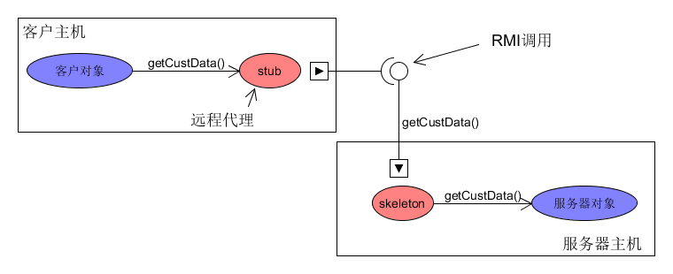
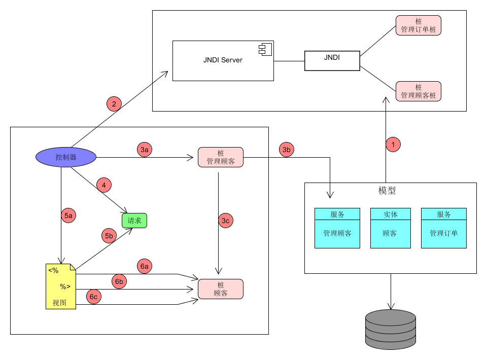

[TOC]

# Head First Servlet & JSP

## 第一章  前言

### 1.1 Web与HTTP
Q：  你的web服务器做些什么？
A：  Web服务器接收客户请求，然后向客户返回一些结果。用户可以通过web浏览器请求一个资源。web服务器得到请求后，查找资源然后向用户返回一个结果。资源可以是一个HTML页面、一个图片、一个文档等等。如果没有这样一个资源，或者资源不在服务器原来预想的位置上，此时会显示一个“404 NOT FOUND”错误。

Q：  web客户做些什么？
A：  web客户允许用户请求服务器上的某个资源，并向用户显示请求的结果。谈到客户时，通常指人类用户，或者浏览器应用，也可能二者都包括。浏览器是一个软件，它知道怎么与服务器通信。浏览器还有一个重要人物使解释HTML代码，并把web网页呈现给客户。从现在开始客户定指浏览器应用。

通常客户和浏览器的沟通是通过HTML和HTTP协议完成的。
当服务器对一个请求做出回答时，通常会向浏览器发送某种类型的内容，以便浏览器显示。
服务器一般会向浏览器发送一组通过HTML编写的指令，HTML告诉浏览器怎样把内容呈现给用户。
web上客户和服务器之间大多数会话是通过HTTP协议完成的，客户发送一个HTTP请求，服务器会用一个HTTP响应做出应答。
web服务器向客户发送HTML页面就是使用HTTP发送的。

HTTP请求流关键要素:

- HTTP方法（要完成的动作）
- 要访问的页面（URL）
- 表单参数

HTTP响应流关键要素：

- 状态码
- 内容类型
- 内容

HTTP方法名：方法名告诉服务器做了哪一类请求，并指出消息中余下的部分该如何格式化。方法名有很多种。

1. GET：GET是最简单的的HTTP方法，它的只要任务是要求服务器获得一个资源并把资源发过来。GET是要从服务器拿些东西回来。
2. POST：利用POST，可以请求某个东西，与此同时向服务器发送一些表单数据。
3. 其它方法：HEAD、TRACE、PUT、DELETE、OPTIONS、CONNECT

使用POST而不是GET的原因：

1. GET中的总字符数是有限的（取决于服务器）。比如如果用户在“搜索”输入框中键入了很长的一段文字，GET方法可能无法正常工作。
2. 用GET发送的数据会追加到URL的后面，在浏览器地址中显示出来，所以你发送的数据会完全暴露。
3. 如果使用POST而不是GET，用户就不能对一个表单提交建立书签。

*
HTTP请求剖析：p15-16
HTTP响应剖析：p17
*

### 1.2 要点

- HTTP代表超文本传输协议，这是Web上使用的网络协议。HTTP运行在TCP/IP之上
- HTTP使用一种请求/响应模型，客户做出一个HTTP请求，Web服务器返回一个HTTP响应，再由浏览器确定如何处理。
- 如果来自服务器的响应是一个HTML页面，就会把HTML增加到HTTP响应中。
- HTTP请求包括URL、HTTP方法、以及可选的表单参数数据。
- HTTP响应包含一个状态码、内容类型，以及响应的实际内容。
- GET请求会把表单数据追加得到URL的最后。
- POST请求会将表单数据包括再请求体中。
- MIME类型告诉浏览器要接收哪一类数据，以便浏览器知道如何加以处理。
- URL代表统一资源定位符。Web上的每个资源都有自己的唯一地址，都采用这种URL格式。首先是一个协议，然后是服务器名以及一个可选的端口号，再后面通常是一个特定的路径和资源名。如果URL对应一个GET请求，那么它还可能包含一个可选的查询串。
- Web服务器擅长提供静态HTML页面，但是如果需要页面中包含动态创建的数据，旧需要某种辅助应用与服务器协作。如果不用Java术语来说，这些辅助应用通常称为CGI，这代表公共网关接口。
- 把HTML放在println()语句中的做法很糟糕，也很容易出错，不过jsp可以解决这个问题，它允许把java放在HTML页面中，而不是把HTML放在Java代码中。

## 第二章  高层概述

### 2.1 容器

#### 2.1.1 什么是容器？

Servlet没有main()方法。它们受控于另一个Java应用，这个Java应用称为容器。Tomcat就是这样一个容器。如果web服务器应用（如Apache）得到一个指向某servlet的请求，此时服务器不是把这个请求交割servlet本身，而是交给部署该servlet的容器。由容器向servlet提供HTTP请求和响应，而且要由容器调用servlet的方法。

#### 2.1.2 容器可以提供什么？

- **通信支持。**利用容器提供的方法，我们可以轻松地让servlet与Web服务器对话。无需自己建立ServerSocket、监听端口、创建流等。容器知道自己与web服务器之间的协议，所以servlet不必担心web服务器和你自己的web代码之间的API。需要考虑的只是如何再servlet中实现业务逻辑。
- **生命周期管理。**容器控制着servlet的生与死。它会负责加载类、实例化和初始化servlet、调用servlet方法，并使servlet实例能够被垃圾回收。有了容器的控制就可以不用太多地考虑资源管理了。
- **多线程支持。**容器会自动地为它接收的每个servlet请求创建一个新的Java线程。针对客户的请求，如果servlet已经运行完相应的HTTP服务方法，这个线程就会结束。这并不是说不用考虑线程安全性，还是会遇到同步问题的。不过，由服务器创建和管理多个线程来处理多个请求，这样确实可以减少很多工作。
- **声明方式实现安全。**利用容器，可以使XML部署描述文件来配置和修改安全性，而不必将其硬编码到servlet或其它类代码中。
- **JSP支持。**容器负责把JSP翻译成Java。

#### 2.1.3 容器如何处理请求？

1. 用户点击一个链接，其URL指向一个servlet而不是静态页面。
2. 容器识别出这个请求要的是一个servlet，所以容器创建两个对象：HttpServletResponse、HttpServletRequest
3. 容器根据请求中的URL找到正确的servlet，为这个请求创建或分配一个线程，并把这个请求和响应对象传递给这个servlet线程。
4. 容器调用servlet的service()方法。根据请求的不同类型，service()会调用doGet()或doPost()方法。（99.9%的servlet都会覆盖这两个方法）
5. （假设调用doGet()方法）doGet()方法生成动态页面，并把这个页面“填入”响应对象。
6. 线程结束，容器把响应对象转换为一个HTTP响应，把它发回给客户，然后删除请求和响应对象。

### 2.2 Servlet & JSP中的MVC

- 模型（Java class）：包含具体的业务逻辑和状态。模型知道用什么规则来得到和更新状态。系统中只有这部分与数据库进行通信。
- 视图（JSP）：负责表示方面。他从控制器得到模型的状态（不是直接得到，控制器回把模型数据放在视图能找到的一个地方）。另外视图还负责获得用户的输入，并交给控制器。
- 控制器（Servlet）：从请求获得用户输入，并明确这些输入对模型有什么影响。告诉模型进行更新，并让视图能得到新的模型状态。

### 2.3 要点

- 容器为Web应用提供了通信支持、生命周期管理、多线程支持、声明方式安全以及JSP支持。
- 容器创建一个请求对象和一个响应对象，servlet（或web应用的其它部分）可以用这些对象得到有关请求的信息，并把信息发送给客户。
- 典型的servlet是一个扩展了HttpServletRequest的类，而且覆盖了一个或多个服务方法，分别对应于浏览器调用的Http方法。
- 部署人员可以把servlet映射到一个URL，这样客户可以使用这个URL来请求该servlet。部署名可以与实际的类文件名完全不同。

## 第三章  MVC迷你教程

### 3.1 构建一个迷你Web应用

步骤：

1. 分析用户的视图（浏览器要显示的东西）以及高层体系结构。
2. 创建用于开发这个项目的开发环境。
3. 创建用于部署这个项目的部署环境。
4. 对Web应用各个组件完成迭代式的开发和策略。

.....

*代码及部署部分：p70-90*

## 第四章  请求和响应

### 4.1 Servlet

**作为Servlet**
Servlet的存在就是要为客户服务。Servlet的任务是得到一个客户的请求，再发回一个响应。这个请求携带着一些重要的数据，你的Servlet代码必须知道怎么找到和使用这个请求。响应也携带者一些信息，浏览器需要这些信息来显示一个页面或下载数据。你的Servlet代码必须知道怎么发送这些信息。或者不发送......你的Servlet也可以把请求传递给其它人（另一个页面、Servlet或JSP）。

#### 4.1.1 Servlet的生命周期

生命周期：
1. Web容器加载Servlet类的class文件
2. Servlet的无参数构造函数运行
3. Servlet的init()方法运行，该方法再Servlet的生命周期中只调用一次，且在调用service()方法前完成
4. 调用service()方法对客户请求进行处理
5. service()方法结束，容器调用destory()方法，在Servlet被垃圾回收前清理相关其它资源。与init()方法一样只能调用一次。

生命周期中的三个重大时刻：

1. init()
	- 何时调用：Servlet实例创建后（构造函数之后），并在Servlet能为客户请求提供服务之前，容器要对Servlet调用init()方法
	- 作用：使你在Servlet处理客户请求之前有机会对其进行初始化
	- 是否可覆盖：可以覆盖。如果有初始化代码（如得到一个数据库连接，或向其它对象注册），就需要覆盖init()方法
2. service()
	- 何时调用：第一个客户请求到来时，容器会开始一个新线程，或者从线程池中分配一个线程并调用Servlet的service()方法
	- 作用：这个方法会查看请求，确定HTTP方法（GET、POST等），并在Servlet上调用对应的方法
	- 是否可覆盖：不**应该**覆盖该方法
3. doGet、doPost等方法
	- 何时调用：service()方法根据请求的HTTP方法来调用doGet()或doPost()等方法
	- 作用：在这个部分加入你的代码，实现客户的请求
	- 是否可覆盖：至少要覆盖doGet()或doPost()之一。无论覆盖哪一个，都能告诉容器你支持什么类型的请求。例如如果没有覆盖doPost()，就是在告诉容器这个Servlet不支持HTTP POST请求

**
每个请求都在一个单独的线程中运行。容器运行多个线程来处理对一个Servlet的多个请求。容器并不关心是谁做出的请求，是一个客户的一次或多次请求还是不同客户的一次或多次请求，每个到来的请求都意味着一个新的线程。每个客户为每个请求得到一个单独的线程，而且容器会分分配一对新的请求和响应对象。p101
**

#### 4.1.2 Servlet的初始化

Servlet从“不存在”状态迁移到“初始化”状态，首先是从构造函数开始。但是构造函数只是使之成为一个对象，而不是一个Servlet。你可能有一些Servlet初始化代码，如得到Web应用的配置信息，或查找应用另一部分的一个引用，如果在Servlet的生命中太早运行这些初始化代码就会**失败**。所以不要在Servlet的**构造函数**中放任何东西。而是放在init()方法中。

#### 4.1.3 ServletConfig对象和ServletContext

1. ServletConfig对象
	- 每个Servlet都有一个ServletConfig对象
	- 用于向Servlet传递部署时信息
	- 用于访问ServletContext
	- 参数在部署描述文件中配置
2. ServletContext
	+ 每个Web应用有一个ServletContext（应该叫做AppContext）
	+ 用于访问Web应用参数（也在部署文件中配置）
	+ 相当于一种应用公告栏，可以在这里放置消息（称为属性），应用的其它部分可以访问这些消息
	+ 用于得到服务器信息，包括容器名和容器版本，以及所支持API的版本等

#### 4.1.4 要点

- 容器加载类、调用Servlet的无参数构造函数，并调用Servlet的init()方法，从而初始化Servlet。
- init方法(开发人员可以覆盖)在Servlet一生中，至调用一次，往往在servlet为客户请求提供服务之前调用。
- init方法使Servlet可以访问ServletConfig和ServletContext对象，Servlet需要从这些对象得到有关的Servlet配置和Web应用信息。
- 容器通过调用Servlet的destroy()方法来结束Servlet的生命。
- Servlet一生的大多数时间都是在为某个客户请求运行service()方法。
- 对Servlet的每个请求都在一个单独的线程中运行!任何特定的Servlet类都只有一个实例。
- 你的Servlet一般都会扩展javax.servlet.http.HttpServlet,并由此继承service()方法的一个实现，他取一个HttpServletRequest和一个HttpServletResponse作为参数。
- GenericServlet实现了Servlet接口。
- 可以覆盖init方法，而且必须覆盖一个服务方法doGet()或doPost()
- Servlet相关的类（除了与JSP相关的类）都在以下两个包中：javax.servlet或javax.servlet.http。

### 4.2 HTTP请求和响应

*它们是一切的关键，也是service()方法的参数*

HttpServletRequest接口扩展ServletRequest接口。HttpServletRequest接口增加了与HTTP协议相关的方法，Servlet在与客户/浏览器通信时就要使用这些方法。
HttpServletRequest接口扩展ServletRequest接口。它同样增加了与Http协议相关的方法。

#### 4.2.1 请求

##### 4.2.1.1 HTTP请求方法

客户的请求总是包含一个特定的HTTP方法。如果这个方法是GET，service()方法就调用doGet()。如果这个HTTP请求方法是POST，service()方法就会调用doPost()。
除此之外HTTP 1.1还包括HEAD、TRACE、OPTIONS、PUT、DELETE、CONNECT方法。
除了CONNECT方法其余方法在HttpServlet类中都有一个匹配的doXxx()方法。
Servlet开发人员除了使用GET和POST外很少会用到其他方法。

##### 4.2.1.2 八种HTTP方法

- GET：要求得到所请求URL上的一个东西（资源/文件等）
- POST：要求服务器接收附加到请求的体信息，并提供所请求URL上的一个东西。也就是说随请求还发送了额外信息的"GET"
- HEAD：只要求得到GET返回结果的首部部分。类似GET，但是响应中没有体。它能提供所请求URL的相关信息，但是不会真正返回实际的那个东西
- TRACE：要求请求消息回送，这样客户能看到另一端上接收了什么，以便测试或排错
- PUT：指出要把所包含的信息（体）放在请求的URL上
- DELETE：指出删除所请求URL上的一个东西
- OPTIONS：要求得到一个HTTP方法列表，所请求URL上的东西可以对这些HTTP方法做出响应
- CONNECT：要求连接以便建立隧道

##### 4.2.1.3 GET和POST的区别

POST有一个体，这是二者区分的关键。GET和POST都能发送参数，但是利用GET的话，对参数数据有限制，参数数据只能是放在请求行中的内容。

例子：

**GET** /select/selcetBeerTaste.jsp**?color=dark&taste=malty** HTTP/1.1
（请求头部省略）
（无体）
**POST** /advisor/selectBeerTaste.do HTTP/1.1
（请求头部省略）
**color=dark&taste=malty** （消息体，也称为负载）

POST的参数显示在体中，因此不会像使用GET那样受到限制，而GET必须把参数放在请求行中。

除了发送数据方面的区别，在使用GET时，参数数据会显示在地址栏中，可能会产生安全问题。此外你是否需要或是希望最终用户对请求页面建立书签。GET请求可以建立书签，POST请求则不能。

除了上述三种问题之外，GET和POST之间还有一个重要差别，就是这些方法要如何使用。GET用于得到某些东西，仅此而已，只是简单的获取，服务器不会做任何改变。POST则用于发送数据来进行处理。可能很简单只是用一些查询参数用于确定要返回什么，这与GET一样。不过使用GET时要这样考虑：**这是一个更新。要把它认为是使用POST体的数据来修改服务器上的某些东西。**

**幂等性**是指重复使用同样的参数调用同一方法时总能获得同样的结果。

>幂等是很好的。这说明，你可与一遍一遍反复做同一间事情，而不会有预料不到的副作用。

HTTP 1.1规范中GET、HEAD、PUT是幂等的，POST不是幂等的。

##### 4.2.1.4 确定浏览器发送的是GET还是POST

GET：

简单的超链接为GET方法。
例子:

	&lt;a href="http://wickedlysmart.com/index.html"&gt;click here&lt;/a&gt;

&lt;form&gt;元素如果没有设置method属性或指定method="GET"，则为GET方法。

POST：

&lt;form&gt;元素设置method属性为method="POST"。

>如果开发人员想同时支持这两个方法，通常会把逻辑放在doGet()方法中，如果有必要，再建立doPost()方法委托到doGet()。

	public void doPost(...) throws ...{
		doGet(request, response);
	}

##### 4.2.1.5 获取请求的参数

表单和超链接传递的参数要使用request的getParameter(String name)和getParameterValues(String name)（用于接收单个参数的多个值，典型情况---复选框）方法来接收。前者返回这个参数的值，后者返回值构成的String数组。

##### 4.2.1.6 获取参数外的其它信息

ServletRequest和HttpServletRequest接口提供了大量可以调用的方法。
例如：

- 客户的平台和浏览器信息：String client = request.getHeader("User-Agent");
- 与请求相关的cookie：Cookie[] cookies = request.getCookies();
- 与客户相关的会话：HttpSession session = request.getSession();
- 请求的HTTP方法：String theMethod = request.getMethod();
- 请求的输入流：InputStream input = request.getInputStream();

##### 4.2.1.7 要点

- HttpServlet的doGet()和doPost方法取一个HttpServletRequest和一个HttpServletResponse作为参数。
- service()方法根据HTTP请求方法（GET、POST等）来确定运行Servlet中的方法。
- POST请求有一个体；GET请求没有，不过GET请求可以把请求参数追加到请求URL的后面。
- GET请求本质上是幂等的。它们应当能多次运行而不会对服务器产生任何副作用。GET请求不应该修改服务器上的任何东西。但是你也可以写一个非幂等的doGet()方法（强烈不推荐）。
- POST本质上将不是幂等的，所以要由开发人员来使当地设计和编写代码，如果一个客户错误地把一个请求发送了多次，也要能够正确处理。
- 如果表单没有明确使用POST，则默认为GET。
- 可以用getParameter(String name)方法从请求得到参数。返回值总是一个String；可以用getParameterValues(String name)方法得到一个给定参数名下的多个参数值，返回值是一个String数组。
- 从请求还可以得到其他东西，包括首部、cookie、会话、查询串和输入流。

#### 4.2.2 响应

##### 4.2.2.1 响应要做些什么

响应要返回给客户。这是浏览器得到、解析并呈现給客户的东西。通常会使用响应对象得到一个输出流（一般是一个Writer），并使用这个流写出HTML或其它类型的内容，返回給客户。响应对象除了I/O输出外还有其它方法。
大多数情况下使用响应只是为了向客户发回数据。会调用两个方法：setContentType()和getWriter()方法。不过也可以使用响应设置其它首部、发送错误以及增加cookie。

例子：向客户发送一个jar

代码：

	public void doGet(HttpServletRequest request, HttpServletResponse reponse) throws IOException, ServletException {
		response .setContentType("application/jar");

		ServletContext ctx = getServletContext();
		InputStream is = ctx.getResourceAsStream("/bookCode.jar");

		int read = 0;
		byte[] bytes = new byte[1024];

		OutputStream os = response.getOutputStream();
		while ((read = is.read(bytes)) != -1) {
			os.write(bytes, 0 , read);
		}
		os.flush();
		os.close();
	}

##### 4.2.2.2 MIME类型

MIME类型即内容类型。
响应必须要告诉浏览器要发回什么，这样浏览器才能进行正确的处理。内容类型是HTTP响应中必要的HTTP首部。

常用MIME类型：

- text/html
- application/pdf
- video/quicktime
- application/java
- image/jpeg
- application/jar
- application/x-zip
- application/octet-stream
- ...

**
总是先调用setContentType()，然后再调用获得输出流的方法。这样能保证不会遭遇内容类型和输出流之间的冲突。
**

*Q & A部分参见p131*

##### 4.2.2.3 字符输出和字节输出

Servlet接口只提供了两个流可供选择：ServletOutputStream用于输出字节，PrintWriter用于输出字符。

**PrintWriter**
例子：

	PrintWriter writer = response.getWriter();
	writer.println("some text and HTML");

用于：把文本数据打印到一个字符流。尽管也可以用字节流进行处理，但PrintWriter是专门设计用于处理字符数据的。

**OutputStream**
例子：

	ServletOutputStream out = response.getOutputStream();
	out.write(aByteArray);

用于：写其它任何内容。

**
PrintWriter实际上包装了ServletOutputStream。也就是说，PrintWriter有ServletOutputStream的一个引用，而且会把调用委托給ServletOutputStream。实际上返回給客户端的输出流只有一个，但是PrintWriter装饰了这个流，为它增加更高层的“字符友好”方法。
**

ServletOutputStream使用方法getOutputStream得到，并使用write()方法写出。
PrintWriter使用方法getWriter()得到，并使用println()方法写出。

##### 4.2.2.4 设置/增加响应首部

- response.addHeader(String name, String value)，为响应增加一个新首部和值，或者向一个现有首部增加另一个值。
- response.setHeader(String name, String value)，如果响应中已经有同名的首部，则用这个值替换原来的值。否则，向响应增加一个新首部和值。
- response.setIntHeader(String name, int value)，这是一个便利方法，用提供的整数值替换现有首部的值，或者向响应增加一个新首部和值。

如果响应中还没有首部（上述方法的第一个参数），setHeader()和addHeader()就会增加一个首部和响应的值。二者的区别是：**如果已经有这样一个首部，前者将设置一个值，而后者将增加一个值。**

**
setHeader()会覆盖现有的值。
addHeader()会增加另一个值。
**

调用setContentType("text/html")就是在设置一个首部，相当于setHeader("content-type", "text/html")。

##### 4.2.2.5 重定向

有时你可能不想自己处理响应，这时可以选择让别人来为你的请求处理响应。可以把请求重定向到一个完全不同的URL，或者把请求分配給web应用的另一个组件。

Servlet使用重定向让浏览器完成工作。
重定向使得Servlet完全卸下担子。确定无法完成工作之后，Servlet只是调用sendRedirect()方法：

	if (worksForMe) {
		// handle it
	} else {
		response.sendRedirect("url");
	}

sendRedirect()方法的参数可以使用绝对URL，也可以使用相对URL。

相对URL有两种：
假设用户原来键入的是
	
	http://www.wickedlysmart.com/myApp/cool/bar.do

- URL前没有斜线：此时如果使用sendRedirect("foo/stuff.html");则容器会相对于原先的请求URL建立完整的URL。则此时绝对URL为 http://www.wickedlysmart.com/myApp/cool/foo/stuff.html。
- URL前有斜线：此时如果使用sendRedirect("/foo/stuff.html");则容器就会相对于Web应用本身建立完整的URL。则此时绝对URL为http://www.wickedlysmart.com/foo/stuff.html。

**
不能在写到响应之后在调用senRedirect()
sendRedirect()的参数列表是String，不是URL对象
**

##### 4.2.2.6 要点

- 使用响应向客户发回数据。
- 对响应对象（HttpServletResponse）调用的最常用的方法是setContentType()和getWriter()。
- 利用getWriter()方法可以完成字符I/O，向流写入HTML或其它内容。
- 还可以使用响应来设置首部、发送错误，以及增加cookie。
- 要得到二进制流，需要在响应上调用getOutputStream()。
- setContentType()告诉浏览器应该如何处理随响应到来的数据。
- 可以使用addHeader()或setHeader()来设置响应首部。
- 如果你不想对一个请求做出响应，可以把请求重定向（sendRedirect()）到另一个URL。浏览器会负责把新请求发送到你提供的URL上。
- 不能在响应已经提交后再进行重定向。
- 请求分派与重定向是两回事。请求分派再服务端发生，重定向再客户端进行。请求分派把请求传递給服务器上的另一个组件；重定向是告诉浏览器去访问另一个URL。

## 第五章  属性和监听者

### 5.1 Servlet初始化参数

#### 5.1.1 设置和取得Servlet初始化参数

可以使用注解或DD文件对Servlet的初始化参数进行设置。

例子：

 使用@WebServlet时也可以配置初始化参数，它是通过@WebServlet的initParams参数来指定的。initParams是一个@WebInitParam数组，每一个@WebInitParam代表一个初始化参数。

	@WebServlet(urlPatterns = { "/InitParamServlet" }, initParams = {
		// 设置初始化参数
		@WebInitParam(name = "adminEmail", value = "likewecare@wickedlysmart") })

或使用web.xml进行配置。

		<servlet>
			<servlet-name>Xxxx</servlet-name>
			<servlet-class>xxx.xxxx.Xxxx</servlet-class>
			<init-param>
				<param-name>adminEamil</param-name>
				<param-value>likewecare@wickedlysmart</param-value>
			</init-param>
		</servlet>

设置后使用getServletConfig().getInitParameter(String param-name)；来取得参数的值。

**
在Servlet初始化之前不能使用Servlet初始化参数
**

Servlet继承了getServletConfig()方法，所以可以从Servlet中的任何地方调用getServletConfig()来得到ServletConfig的引用。一旦有了这个引用，就可以调用getInitParameter()。
**
不过在构造函数中不能调用这个方法，在容器调用init()方法前，它还不能算一个完整的Servlet。
**

容器初始化一个Servlet时会为这个Servlet创建一个唯一的ServletConfig。容器从DD或者注解中读取出Servlet的初始化参数，并把这些参数交给ServletConfig，然后把ServletConfig传递給Servlet的init()方法。

关于init()方法：
超类包括两个版本的init()方法，一个有ServletConfig参数，另一个没有任何参数。继承得到的init(ServletConfig)方法会调用无参数的init()方法，所以只需要覆盖无参数的init()就足够了。
**不推荐覆盖有参版本的init()方法。**

Servlet初始化参数只能读取一次-----就是在容器初始化Servlet的时候。此后容器不会再读取初始化参数，除非重新部署。

具体步骤：*p152*

1. 容器为这个Sevlet读取部署描述文件或注解，包括Servlet初始化参数。
2. 容器为这个Servlet创建一个新的ServletConifg实例。
3. 容器为每个Servlet初始化参数创建一个String键/值对。
4. 容器向ServletConfig提供键/值初始化参数的引用。
5. 容器调用构造函数创建Servlet的一个新实例。
6. 容器调用Servlet的init()方法，传入ServletConfig的引用

### 5.2 上下文初始化参数

上下文初始化参数与Servlet初始化参数很类似，只不过上下文参数对整个web应用可用，而不是只针对一个Servlet。一旦配置，应用中的所有Servlet和JSP都自动地能够访问上下文初始化参数。需要在DD文件中进行配置。

#### 5.2.1 设置和取得上下文初始化参数

再web.xml中设置上下文初始化参数：

	<context-param>
		<param-name>adminEmail</param-name>
		<param-value>clientheaderror@wickedlysmart.com</param-value>
	</context-param>

&lt;context-param&gt;是针对整个应用的，所以并不嵌套在某个&lt;servlet&gt;元素中。

获取参数：

每个Servlet都继承一个getServletContext()方法，在用其得到ServletContext引用后调用getInitParameter(String param-name)方法以得到参数名对应的值。

容器初始化ServletContext：
- 容器读取DD，对应每个&lt;context-param&gt;创建一个键/值String对。
- 容器创建ServletContext的一个新实例。
- 容器为ServletContext提供上下文初始化参数各个键/值对的引用。
- 在一个Web应用中部署的各个Servlet和JSP都能访问同一个ServletContext。

**
如果应用是分布式应用，那么每个JVM有一个ServletContext。
**

### 5.3 两个参数的异同

1. 配置位置不同
	- Servlet初始化参数可以配置在注解中，如果配置在web.xml中则需要配置在对应的Servlet中。
	- 上下文初始化参数配置在web.xml中，且独立于Servlet配置部分。
2. 可用性不同
	- Servlet初始化参数只对对应的Setvlet有效。
	- 上下文初始化参数对所有的Setvlet和JSP都有效。
3. 获取参数值的方法名相同，方法的参数列表也相同。但是要先通过getServletConfig()方法和getServletContext()方法获取到对应的引用。
4. 每个Servlet都有一个ServletConfig；每个Web应用有一个ServletContext。

### 5.4 监听者Listener

Listener有很多种，负责监听不同的事件。发生事件时监听者的通知顺序以DD文件中部署顺序为准。

#### 5.4.1 上下文监听者

ServletContextListener可以监听ServletContext一生中的两个关键事件，初始化和撤销。这个类实现了javax.servlet.ServletContextListener。

*使用该监听者的例子：p168-177*

#### 5.4.2 监听者的分类

场景 | 监听者接口及方法 | 事件类型
----- | ----- | -----
你想知道一个Web应用上下文中是否增加、删除或替换了一个属性。|javax.servlet.**ServletContextAttributeListener** attributeAdded attributeRemoved attributeReplaced|ServletContextAttributeEvent
你想知道有多少个并发用户。也就是说你想跟踪活动的会话。|javax.servlet.http.**HttpSessionListener** sessionCreated sessionDestroyed|HttpSessionEvent
每次请求到来时你都想知道，以便建立日志记录。|javax.servlet.**ServletRequestListener** sessionCreated sessionDestroyed|ServletRequestEvent
增加、删除或替换一个请求属性时你希望能够知道。|javax.servlet.**ServletRequestAttributeListener** requestInitialized requestDestroyed|ServletRequestAttributeEvent
你有一个属性类（这个类表示的对象将放在一个属性中），而且你希望这个类型的对象在绑定到一个会话或从会话删除时得到通知。|javax.servlet.**HttpSessionBindingListener** valueBound valueUnbound|HttpSessionBindingEvent
增加、删除或替换一个会话属性时你希望能够知道。|javax.servlet.http.**HttpSessionAttributeListener** attributeAdded attributeRemoved attributeReplaced|HttpSessionBindingEvent
你想知道是否创建或撤销了一个上下文。|javax.servlet.**ServletContextListener** contextInitialized contextDestroyed|ServletContextEvent
你有一个属性类，而且希望这个类型的对象在其绑定的会话迁移到另一个JVM时得到通知。|javax.servlet.http.**HttpSessionActiviationListener** sessionDidActivate sessionWillPassivate|HttpSessionEvent

#### 5.4.3 HttpSessionBindingListener

HttpSessionBindingListener与HttpSessionAttributeListener的区别：

- HttpSessionAttributeListener只是希望当会话中增加、删除或替换了某种类型的属性时能够知道。
- HttpSessionBindingListener不同，有了HttpSessionBindingListener，属性本身能够在增加到一个会话或者从会话中删除时得到通知。

使用HttpSessionBindingListener的例子：

Dog类：实现HttpSessionBindingListener接口，当该类的实例作为属性被添加到session中时会向控制台输出I'm in a session

	package com.tavish.model;

	import javax.servlet.http.HttpSessionBindingEvent;
	import javax.servlet.http.HttpSessionBindingListener;

	public class Dog implements HttpSessionBindingListener {
		
		private String breed;
		
		public Dog(String breed) {
			this.breed = breed;
		}
		
		public String getBreed() {
			return breed;
		}
		
		@Override
		public void valueBound(HttpSessionBindingEvent event) {
			// code to run now that I know I'm in a session
			System.out.println("I'm in a session " + getBreed());
		}
		
		@Override
		public void valueUnbound(HttpSessionBindingEvent event) {
			// code to run now that I know I am no longer part of a session
		}
	}

测试：

	Dog dog2 = new Dog("Bufflo");
	Dog dog3 = new Dog("Bull");
	request.getSession(true).setAttribute("dog", dog2);
	request.getSession(true).setAttribute("dog", dog3);

控制台输出：

	I'm in a session Bufflo
	I'm in a session Bull

### 5.5 属性

属性就是一个对象，可能设置到另外3个Servlet API对象中的某一个，包括ServletContext、HttpServletRequest（或ServletRequest）或者HttpSession。可以把它简单地人认为时一个影视实例对象中的键/值对，其中键是一个String，值是一个Object。

#### 5.5.1 属性的作用域

- 上下文属性：应用中的每一部分都能访问
- 会话属性：能访问特定HttpSession的部分才能访问
- 请求属性：能访问特定SevletRequest的部分才能访问

#### 5.5.2 属性API

三个属性作用域分别由ServletContext、HttpSession、ServletRequest接口处理。每个接口中对应属性的API方法完全相同。

方法：

- Object getAttribute(String name)
- void setAttribute(String name, Object value)
- void removeAttribute(String name)
- Enumeration getAttributeNames()

#### 5.5.3 线程安全问题

*p190-204*

##### 5.5.3.1 上下文属性

上下文作用域不是线程安全的。应用中的每一部分都能访问上下文属性。**而这意味着可能有多个Servlet。多个Servlet则说明可能有多个线程，**因为请求时并发处理的，每个请求在一个单独的线程中处理。不论这些请求指向同一个servlet还是不同的Servlet。

怎样让上下文属性做到线程安全？
>对服务方法加锁并不能保证上下文属性线程安全！

**对上下文加锁。**

保护上下文属性的一般做法是对上下文对象本身进行同步。如果访问上下文的每一个线程都必须先得到上下文对象的所，就能保证一次只有一个线程可以得到或设置上下文属性。只有当处理同一上下文属性的所有其它代码也对ServletContext同步时，这种做法才奏效。也就是说在**设计**Web应用时，可以要求每个线程在访问上下文属性前必须先请求一个锁。

例子：

	public void doGet(HttpServletRequest request, HttpServletResponse response) throws IOException, ServletException {
		response.setContentType("text/html;charset=utf-8");
		PrintWriter out = response.getWriter();
		out.println("test context attributes ");
		
		synchronized(getServletContext()) {
			getServletContext().setAttribute("foo", "22");
			getServletContext().setAttribute("bar", "42");

			out.println(getServletContext().getAttribute("foo"));
			out.println(getServletContext().getAttribute("bar"));
		}
	}

可以认为一旦进入了同步代码块，这些上下文属性就能安全地不被其它线程访问。

##### 5.5.3.2 会话属性

会话属性也需要同步。

使用同样的方法：

	public void doGet(HttpServletRequest request, HttpServletResponse response) throws IOException, ServletException {
		response.setContentType("text/html;charset=utf-8");
		PrintWriter out = response.getWriter();
		out.println("test session attributes ");
		HttpSession session = request.getSession();

		synchronized(session) {
			session.setAttribute("foo", "22");
			session.setAttribute("bar", "42");

			out.println(session.getAttribute("foo"));
			out.println(session.getAttribute("bar"));
		}
	}

##### 5.5.3.3 SingleThreadModel设计用来保护实例变量

Servlet规范中关于STM接口的说明：
>
确保Servlet一次只处理一个请求。
这个接口没有任何方法。如果一个Servlet实现了这个接口，就可以保证**不会在该Servlet的服务方法中并发执行两个线程。**通过同步对Servlet单个实例的访问，或者通过维护一个Servlet实例池并把每个心情求分配到一个空闲的Servlet，Servlet容器可以保证这一点。

你的Servlet应当扩展HttpServlet另外还要实现SingleThreadModel接口。实现了STM，web容器可以确保这个Servlet一次只能处理一个请求。

STM的两种实现策略：

1. 对所有请求排队，web容器将他们交给一个Servlet实例，一次处理一个请求。
2. 通过一个池发送请求，每个请求分别发送到同一个Servlet的不同实例。

>STM已经被Servlet API废弃了。

#### 5.5.4 请求属性和请求分派

如果希望其应用的其它组件接管全部或部分请求就可以使用请求属性。

	request.setAttribute("styles", result);
	RequestDispatcher view = request.getRequestDispatcher("result.jsp");
	view.forward(request, response);

使用RequestDispatcher让组件的其它部分接管请求。

RequestDispatcher：
RequestDispatcher只有两个方法forward()和include()，参数列表都是ServletRequest，ServletResponse。

从ServletRequest得到RequestDispatcher：可以使用相对路径或以/开头从根目录开始查找路径。

	RequestDispatcher view = request.getRequestDispatcher(url);

从ServletContext得到RequestDispatcher：url路径必须以/开头，即不能指定相对于当前资源的路径。

	RequestDispatcher view = getServletContext().getRequestDispatcher(url);

调用forward进行转发：

	view.forward(request, response);

**如果已经提交了响应，就能再转发请求。**

## 第六章  会话管理

>
web服务器没有短期记忆，一旦发送了响应，web服务器就会忘了你是谁。下一次你再做请求的时候，web服务器也不会认识你。换句话说，它们不记得你曾经做过哪些请求，也不记得它们曾经给你发出过响应。有时这样没关系，但有时可能需要跨多个请求保留与客户的会话状态。对于购物车，如果要求客户必须在一个请求中既做出选择又要结账，这是不合适的。

### 6.1 跟踪会话

- 使用一个有状态EJB：可以让Servlet成为一个有状态会话bean的客户端，每次请求到来时，就可以找到客户的有状态bean。为此需要解决很多小问题，不过确实可以使用一个有状态会话bean来保存会话状态。
- 使用一个数据库：可以把客户的数据写到数据库中，但是这样的运行时性能造成的影响与EJB几乎不相上下，这种做法超出了本来的需要。
- 使用HttpSession：我们可以使用一个HttpSession对象保存跨多个请求的会话状态。换句话说，保存与该客户的整个会话期间的会话状态。

**
HttpSession对象可以保存跨同一客户的多个请求的会话状态。换句话说，与一个特定客户的整个会话期间，HttpSession会持久化存储。对于会话期间客户做的所有请求，从中得到的所有信息都可以用HttpSession对象保存。
**

### 6.2 容器如何识别客户

Http协议使用的是无状态连接。客户浏览器与服务器建立连接，发出请求，得到响应，然后关闭连接。换句话说，连接只为一个请求/响应存在。

由于连接不会持久保留，所以容器认不出做第二个请求的客户与做前一个请求的客户是同一个客户。对容器而言，**每个请求都来自于一个新的客户。**

**客户需要一个唯一的会话ID**

对客户的第一个请求，容器会生成一个唯一的会话ID，并通过响应把它返回給客户。**客户再在以后的每一个请求中发回这个会话ID。**容器看到ID后，就会找到匹配的会话，并把这个会话与请求关联。

### 6.3 客户和容器如何交换会话ID

容器必须以某种方式把会话ID作为响应的一部分交给客户，而客户必须把会话ID作为请求的一部分发回。最简单而且最常用的方式是通过cookie交换这个会话ID信息。

例子：

服务器发回Http响应：

	HTTP/1.1 200 OK
	Set-Cookie: JSESSIONID=0AAB6C8DE415
	Content-Type:text/html
	Content-Length:397
	Date:Wed, 19 Nov 2003 03:25:40 GMT
	Server:Apache-Coyote/1.1
	Connection:close

	<html>
	...
	</html>

浏览器再次发出Http请求，将Cookie作为请求中的一个首部。

	POST /select/selectBeerTaste2.do HTTP/1.1
	Host: www.wickedlysmart.com
	User-Agent: Mozilla/5.0
	Cookie: JSESSIONID=0AAB6C8DE415
	...

Cookie的所有工作都在后台进行。

在响应中发送一个会话Cookie：
	
	HttpSession session = request.getSession();

余下的事情都会自动完成。
（向请求要一个会话，容器会负责余下的所有事情。这个方法不只是创建一个会话，对请求第一次调用这个方法时，会导致随响应发送一个cookie。）

从请求中得到会话：同样使用方法getSession()。

### 6.4 getSession()方法

如何知道会话是已经存在还是刚刚创建？

请求的无参数方法getSession()会返回一个会话，而不论是否已经有一个会话。因为总能从这个方法得到返回的一个HttpSession实例。所以想知道会话是不是新创建的，只有去问会话。

	// 无论如何getSession()方法都会返回一个会话
	HttpSession session = request.getSession();

	if (session.isNew()) {
		// 如果客户还没有用这个会话ID做过响应，isNew()返回true
	} else {

	}

如何得到一个已经有的会话？

使用重载的getSession()方法getSession(boolean)。如果你不想创建一个新会话，可以调用getSession(false)，调用这个方法要么得到null，要么得到一个已经有的HttpSession。

	HttpSession session = request.getSession(false);
	if (session == null) {
		// 如果会话为空，则创建一个新会话
		session = request.getSession();
	} else {

	}

getSession(true)等同于getSession().

### 6.5 Cookie禁用与URL重写

#### 6.5.1 Cookie被禁用
**
禁用Cookie的客户会忽略“Set-Cookie”响应首部。
**

>
如果客户不接受cookie，你不会得到异常。没有警告，没有提示，没人告诉你想与这个客户建立会话的企图没有得逞。实际上，这只是意味着客户会忽略你用会话ID设置cookie的企图。这意味着getSession()方法总会返回一个新会话（isNew()方法总会返回true）。但客户不会发回一个带有会话ID cookie首部的请求。

#### 6.5.2 URL重写
如果客户不接受cookie，可以把URL重写作为一条后路。假设你的做法得当，URL重写总能起作用，客户并不关心具体发生了什么，也不会采取任何行动来禁止URL重写。

URL重写能取得置于cookie中的会话ID，并把会话ID附加到访问应用的各个URL的最后。

假设有一个Web页面，其中每个链接都有一些额外信息（会话ID）附加到URL的最后。当用户点击这种链接时，到达容器的请求会在最后携带这个额外信息，容器会取下请求URL中这个部分，并用它查找匹配的会话。在响应发回的HTML中，把会话ID增加到所有URL的最后。

**
如果不能用cookie，而且只有告诉响应要对URL编码，URL重写才能奏效。
**

cookie不能工作时，容器就会求助与URL重写，但是**只有**当你额外做了一些工作，对响应中发送的所有URL完成了编码，此时URL重写才奏效（容器的一般做法是默认先使用cookie，其次再转而使用URL重写）。即如果你没有显示地对URL完成编码，且客户不接受cookie，就**无法使用会话**。

	PrintWriter out = response.getWriter();
	HttpSession session = request.getSession();
	out.printkn("<html><body>");
	out.println("< a href =\"" + reponse.encodeURL("/BeerTest.do") + "\">Click me</a>");

向这个URL增加额外的信息。

	reponse.encodeURL("/BeerTest.do");

>
Q: 容器如何知道cookie不能正常工作？容器什么时候决定使用URL重写？
A: 如果是一个很傻的容器，它并不关系cookie是否能工作，这个傻容器每次都会尝试发送cookie，同时完成URL重写，就算cookie能工作也不例外。如果是一个高级容器，容器看到一个getSession()调用，而且没有从客户的请求得到会话ID，容器就知道它必须尝试与客户建立一个新的会话。此时，容器并不知道cookie是否工作，所以向客户返回第一个响应时，它会同时尝试cookie和URL重写这两种做法。

**
使用sendRediect()的URL重写。
**

可能会有这样一种情况，你想把请求重定向到另外一个URL，但是还想使用一个会话。为此有一个特殊的URL编码方法：

	response.encodeRedirectURL("/...");

**
URL重写是自动的，但是有对URL完成了编码时才奏效。其它所有事情由容器完成。
URL编码由响应（HttpServletResponse）处理。
**

*注意：*

你不会直接用到“jsessionid”。如果看到一个“jsessionid”请求参数，说明肯定有问题。以下代码是错误的：
	
	String sessionID = request.getParameter("jsessionid");

而且在请求或响应中，不应该看到定制的“jsessionid”首部，以下代码是错误的，此时JSESSIONID被认为是一个首部：
	
	POST /select/selectBeerTaste.do HTTP/1.1
	User-Agent:Mozilla/5.0
	JSESSIONID:0AAB6C8DE415

实际上，唯一可以放“jsessionid”的地方就是在cookie首部或作为额外信息追加到URL的最后：

	POST /select/selectBeerTaste.do HTTP/1.1
	User-Agent:Mozilla/5.0
	Cookie:JSESSIONID=0AAB6C8DE415

	POST /select/selectBeerTaste.do;jsessionid=0AAB6C8DE415 HTTP/1.1

#### 6.5.3 要点

- 在写至响应的HTML中，URL重写会把会话ID增加到其中所有的URL的最后。
- 会话ID作为请求URL最后的“额外信息”再通过请求返回給容器。
- 如果客户不接受cookie，URL重写会自动发生，但是必须显示地对所有URL编码。
- 要对一个URL编码，需要调用response.encodeURL(URLString);
- 没有办法对静态页面完成自动的URL重写，所以如果你依赖于会话，就必须使用动态生成的页面。

### 6.6 删除会话

会话对象占用着资源。

HTTP协议没有提供任何机制让服务器知道客户是不是已经走了。

>
有些分布式应用使用租约，使服务器能知道客户什么时候离开。客户从服务器得到一个租约，然后必须按指定的间隔续租，告诉服务器这个客户仍存货。如果客户的租约到期，服务器就知道可以释放为这个客户保留的所有资源。

如果一个会话太长时间都不活动，容器需要把它识别出来，并撤销这个会话。当然我们需要告诉容器这个时间是多少。

javax.servlet.http.HttpSession中的方法：

- Object getAttribute(String)
- long getCreationTime()
- String getId()
- long getLastAccessedTime()
- int getMaxInactiveInterval()
- ServletContext getServletContext()
- void invalidate()
- boolean isNew()
- void removeAttribute(String)
- void setAttribute(String, Object)
- void setMaxInactiveInterval(int)
- ...

方法 | 用途 | 具体描述
-----|-----|-----
getCreationTime() |返回第一次创建会话的时间 | 得出这个会话有多“老”。你可能想把某些会话的寿命限制为一个固定的时间。例如，你可能会说“一旦登录，就必须再10分钟之内完成这个表单……”
getLastAccessedTime() |返回容器最后一次得到这个会话ID的请求过去了多长时间（毫秒数） | 得出客户最后一次访问这个会话是什么时候。可以用这个方法来确定客户是否已经离开了很长时间，这样可以采取某些措施询问客户是否还回来。或者调用invalidate()结束会话。
setMaxInactiveInterval(int) |指定对于这个会话客户请求的最大间隔时间（秒数） | 如果已经过去了指定的时间，而客户未对这个会话做任何请求，就会导致会话被撤销。可以用这个方法减少服务器中无用的会话。
getMaxInactiveInterval() |返回对于这个客户请求的最大间隔时间 |得出这个会话可以保持多长时间不活动但仍“存活”。可以使用这个方法来判断一个不活动的客户再会话撤销之前还有多长的“寿命”。
invalidate() |结束会话。当前存储再这个会话中的所有会话属性也会接触绑定 |如果客户已经不活动，或者你知道会话已经结束（例如客户注销），可以调用这个方法杀死会话。会话实力本身可能由容器回收。这个方法意味着会话ID不再存在，而且属性会从会话对象中删除。

 

会话有三种死法：

- 超时。
- 在会话对象上调用invalidate()。
- 应用结束（崩溃或取消部署）。

设置超时时间：

- 在DD中配置会话超时时间（全局有效）：在&lt;web-app&gt;元素中配置&lt;session-config&gt;元素。并在其内设置&lt;session-timeout&gt;xx&lt;/session-timeout&gt;（xx为分钟数）
- 设置一个特定会话的会话超时：session.setMaxInactiveInterval(20 * 60)，参数单位为秒（设置超时时间为-1，则永远不会到期）。

当对session调用invalidate()或setMaxInactiveInterval(0)以及session超时时，不能再从session中获取设置的属性，或调用isNew()等方法。否则抛出IllegalStateException。

### 6.7 Cookie的其它作用

>
尽管原先设计cookie时为了帮助支持会话状态，不过也可以使用定制cookie来完成其它的工作。cookie实际上就在在客户和服务器之间交换的一小段数据（一个String类型的键/值对）。服务器把cookie发送給客户，客户做出下一个请求时再把cookie返回給服务器。

cookie的一个好处是用户不必介入，cookie交换是自动完成的。

默认地，cookie与会话的寿命一样长；一旦客户离开浏览器，cookie就会小时。“JSESSIONID” cookie就是如此。**但是你可以让cookie获得更长一些，甚至浏览器已经关闭后仍存活。**

#### 6.7.1 利用Servlet API使用Cookie

可以从HTTP请求和响应得到与cookie相关的首部，**但最好不要这样做。**对于cookie，你要做的工作已经封装在了3个类的Servlet API中：HttpServletRequest、HttpServletResponse和Cookie。

HttpServletRequest| HttpServletResponse | Cookie
-----|-----|-----
getCookie() | addCookie() | 见下文

javax.servlet.http.Cookie

- Cookie(String, String)
- String getDomain()
- int getMaxAge()
- String getName()
- String getPath()
- boolean getSecure()
- String getValue()
- void setDomain(String)
- void setMaxAge(int)
- void setPath(String)
- void setValue(String)
- ...

示例：

	// 创建一个新Cookie
	Cookie cookie = new Cookie("username", name);
	// 设置cookie在客户端上存活多久
	// 设置单位为秒。如果设置为-1，则浏览器退出该cookie就会消失。
	cookie.setMaxAge(30 * 60);
	// 把cookie发送到客户
	response.addCookie(cookie);
	// 从客户请求中得到cookie（或多个cookie）
	Cookie[] cookies = request.getCookies();
	for (int i = 0; i < cookies.length; i++) {
		Cookie cookie = cookies[i]; 
		if (cookie.getName().equals("username")) {
			String username = cookie.getValue();
			out.println("hello " + username);
			break;
		}
	}

*没有getCookie(String)方法，只能得到一个Cookie数组，然后遍历这个数组来找到想要的cookie。*

### 6.8 会话生命周期及事件

生命周期：

- 创建或撤销会话
- 由应用的其它部分增加、删除或替换会话属性
- 会话在一个VM中钝化，并在一个分布式应用中的另一个VM中激活

事件及相应的监听器

- 生命周期：HttpSessionEvent、HttpSessionListener
	+ 创建会话：容器第一次创建一个会话。此时，会话还是新的（换句话说，客户还没有用这个会话ID发送请求）。
	+ 撤销会话：容器置一个会话无效（因其调用了invalidate()方法或超时）。
- 属性：HttpSessionBindingEvent、HttpSessionAttributeListener
	+ 增加一个属性：应用的某个部分对会话调用setAttribute()方法
	+ 删除一个属性：应用的某个部分对会话调用removeAttribute()方法
	+ 替换一个属性：应用的某个部分对会话调用setAttribute()方法，且这个属性名原来已经绑定到会话
- 迁移：HttpSessionEvent、HttpSessionActivationListener
	+ 会话准备钝化：容器打算把会话迁移到另一个VM中。要在会话移动之前调用，这样就能让属性有机会做好迁移的准备。
	+ 容器已经把会话迁移到另一个VM中。要在应用的其它部分对会话调用getAttribute()之前调用，这样刚移动的属性就有机会做好准备以供访问。

**
HttpSessionBindingListener，这个监听器是让一个对象知道它什么时候被放入会话和它什么时候被移除。该监听器不需要在DD中配置。
**

示例：

	public class Dog implements HttpSessionBindingListener {
		
		private String breed;
		
		public Dog(String breed) {
			this.breed = breed;
		}
		
		public String getBreed() {
			return breed;
		}
		
		@Override
		public void valueBound(HttpSessionBindingEvent event) {
			// code to run now that I know I'm in a session
			System.out.println("I'm in a session " + getBreed());
		}
		
		@Override
		public void valueUnbound(HttpSessionBindingEvent event) {
			// code to run now that I know I am no longer part of a session
		}
	}

### 6.9 会话迁移

分布式web应用：即应用的各个部分可以复制在网络中的多个节点上。

在一个集群环境中，容器可能会完成负载平衡，取得客户的请求，把请求发送到多个JVM上（我们并不关心这些JVM是否在同一物理主机上）。
这说明，每次客户请求时，最后有可能到达同一个Servlet的不同实例。换句话说，指向Servlet A的请求A可能在一个VM中完成，而指向ServletA的请求B可能在另一个不同的VM中完成。现在的问题是，ServletContext、ServletConfig和HttpSession对象会有什么变化？
**
只有HttpSession对象及其属性会从一个VM迁移到另一个VM上。
每个VM中有一个ServletContext，每个VM上的每个Servlet有一个ServletConfig。但是对于每个Web应用的一个给定的会话ID，只有一个HttpSession对象，而不论应用分布在多少个VM上（在任何给定时刻，会话只存在于一个位置，相同的会话不会出现在两个VM中）。
**
*
服务器开发商如何处理集群和web应用分布，在这方面每个开发商的做法都有所不同，而且J2EE规范中也并没有保证开发商必须支持分布式应用。如果开发商不支持分布式应用，容器就必须跨VM迁移会话，这还包括迁移会话属性。
*

#### 6.9.1 HttpSessionActivationListener

如果你的属性都是实现了Serializable接口的对象，那么可能不会用到这个监听者。

1. 确保你的属性是Serializable的，那就不用再处理了。
2. 但是如果属性类类型不是Serializable（可能因为属性对象的某个实例变量不是Serializable），可以让属性对象类实现HttpSessionActivationListener，并使用激活/钝化回调方法解决这个问题。

一些监听者的例子：

会话监听器：

	package com.tavish.listener;

	import javax.servlet.annotation.WebListener;
	import javax.servlet.http.HttpSessionEvent;
	import javax.servlet.http.HttpSessionListener;

	// 这个监听者允许你跟踪这个Web应用中活动会话的个数。
	@WebListener
	public class BeerSessionCounter implements HttpSessionListener {

		private static int activeSessions;
		
		public BeerSessionCounter() {
		}
		
		public int getActiveSessions() {
			return activeSessions;
		}

		@Override
		public void sessionCreated(HttpSessionEvent se) {
			activeSessions++;
		}

		@Override
		public void sessionDestroyed(HttpSessionEvent se) {
			activeSessions--;
		}
	}

属性监听器：

	package com.tavish.listener;

	import javax.servlet.annotation.WebListener;
	import javax.servlet.http.HttpSessionEvent;
	import javax.servlet.http.HttpSessionListener;

	// 这个监听者允许你跟踪这个Web应用中活动会话的个数。
	@WebListener
	public class BeerSessionCounter implements HttpSessionListener {

		private static int activeSessions;
		
		public BeerSessionCounter() {
		}
		
		public int getActiveSessions() {
			return activeSessions;
		}

		@Override
		public void sessionCreated(HttpSessionEvent se) {
			activeSessions++;
		}

		@Override
		public void sessionDestroyed(HttpSessionEvent se) {
			activeSessions--;
		}
	}

**属性类监听**
*这个监听者允许属性跟踪可能对属性本身很重要的事件，如增加到会话，或从会话删除，以及会话从一个VM迁移到另一个VM。*

	package com.tavish.model;
	import java.io.Serializable;
	import javax.servlet.http.HttpSessionActivationListener;
	import javax.servlet.http.HttpSessionBindingEvent;
	import javax.servlet.http.HttpSessionBindingListener;
	import javax.servlet.http.HttpSessionEvent;

	public class Dog implements HttpSessionBindingListener, HttpSessionActivationListener, Serializable {

		private static final long serialVersionUID = -3828421366549357135L;

		private String breed;
		// 假设这里还有更多实例变量，包括一些非Serializable的实例变量
		
		// 构造函数及其它set、get方法
		public String getBreed() {
			return breed;
		}
		
		// 会话激活事件
		@Override
		public void sessionDidActivate(HttpSessionEvent se) {
			// 这些代码用于恢复字段、取消在sessionWillPassivate()中做的动作
		}
		
		@Override
		public void sessionWillPassivate(HttpSessionEvent se) {
			// 这些代码将非Serializable字段置为某种状态，以便顺利地迁移到一个新VM
		}
		
		// 会话绑定事件
		@Override
		public void valueBound(HttpSessionBindingEvent event) {
			// 我知道我在一个会话中时要运行的代码
		}
		
		@Override
		public void valueUnbound(HttpSessionBindingEvent event) {
			// 我知道自己已经不在一个会话中时要运行的代码
		}
	}

## 第七章  JSP

**
JSP变成Servlet。
**

容器会查看你的JSP，把它转换成Java源代码，再编译成完整的Java Servlet类。
容器把所有的代码都放在一个通用的服务方法中，可以把它认为时一个全面的复合doGet/doPost。

### 7.1 JSP语法、指令、动作元素与隐式对象

#### 7.1.1 JSP语法

所有的脚本程序（scriptlet）、表达式在转为Java源代码后都被放在服务方法中。**这说明scriptlet中声明的变量总是局部变量。 但是，JSP声明用于声明所生成的Servlet类的成员（变量和方法都可以声明）。换句话说声明的内容都会增加到类中，也意味着可以声明静态变量和方法。**

##### 7.1.1.1 脚本程序

**
脚本程序可以包含任意量的Java语句、变量、方法或表达式，只要它们在脚本语言中是有效的。
**

语法格式：

	<% 代码片段 %>

或

	<jsp:scriptlet>
		代码片段
	</jsp:scriptlet>
**任何文本、HTML标签、JSP元素必须写在脚本程序的外面。**

示例：

	<html>
	<head><title>Hello World</title></head>
	<body>
	Hello World! 
	<%
	out.println("Your IP address is " + request.getRemoteAddr());
	%>
	</body>
	</html>

中文编码问题：如果我们要在页面正常显示中文，我们需要在 JSP 文件头部添加以下代码：

	<%@ page language="java" contentType="text/html; charset=UTF-8"
	pageEncoding="UTF-8"%>

##### 7.1.1.2 声明

一个声明语句可以声明一个或多个变量、方法，供后面的Java代码使用。在JSP文件中，您必须先声明这些变量和方法然后才能使用它们。

JSP声明的语法格式：

	<%! declaration; [ declaration; ]+ ... %>

或

	<jsp:declaration>
	   代码片段
	</jsp:declaration>

示例：

	<%! int i = 0; %> 
	<%! int a, b, c; %> 
	<%! Circle a = new Circle(2.0); %> 

##### 7.1.1.3 表达式

一个JSP表达式中包含的脚本语言表达式，先被转化成String，然后插入到表达式出现的地方。由于表达式的值会被转化成String，所以您可以在一个文本行中使用表达式而不用去管它是否是HTML标签。表达式元素中可以包含任何符合Java语言规范的表达式，但是不能使用分号来结束表达式。

JSP表达式的语法格式：

	<%= 表达式 %>

或

	<jsp:expression>
	   表达式
	</jsp:expression>

**绝对不能把一个返回类型为void的方法用作为表达式。**

示例：

	<%@ page language="java" contentType="text/html; charset=UTF-8"
		pageEncoding="UTF-8"%>
	<!DOCTYPE html>
	<html>
	<head>
	<meta charset="utf-8">
	<title>Title here</title>
	</head>
	<body>
	

	   今天的日期是: <%= (new java.util.Date()).toLocaleString()%>
	

	</body> 
	</html> 

##### 7.1.1.4 注释

	<%-- 注释 --%> JSP注释，注释内容不会被发送至浏览器甚至不会被编译
	<!-- 注释 --> HTML注释，通过浏览器查看网页源代码时可以看见注释内容

二者区别：

- HTML注释是显式注释，使用该方法注释的内容在客户端浏览器中是看不到的，但是可以通过查看页面源代码看到注释内容。
- JSP注释是隐式注释，使用该方法注释后，查看页面源代码也不能看到注释内容。
- HTML注释中如果出现Java代码，这些Java代码会被执行。
- JSP注释中如果出现Java代码，这些Java代码会被忽略。

#### 7.1.2 JSP指令

JSP指令用来设置与整个JSP页面相关的属性。

JSP指令语法格式：

	<%@ directive attribute="value" %>

三种指令标签：

指令|描述
-----|-----
<%@ page ... %> | 定义页面的依赖属性，比如脚本语言、error页面、缓存需求等等
<%@ include ... %> | 包含其他文件
<%@ taglib ... %> | 引入标签库的定义，可以是自定义标签

示例： 使用page指令导入包

- &lt;%@page import="foo.*" %&gt;
- &lt;%@page import="foo.\*, java.util.*" %&gt; （使用逗号来分隔多个包）

#### 7.1.3 JSP动作元素

JSP行为标签使用XML语法结构来控制servlet引擎。它能够动态插入一个文件，重用JavaBean组件，引导用户去另一个页面，为Java插件产生相关的HTML等等。

行为标签语法格式严格遵守XML标准：

	<jsp:action_name attribute="value" />

行为标签基本上是一些预先就定义好的函数，下表罗列出了一些可用的JSP行为标签：

语法 | 描述
----- | -----
jsp:include | 用于在当前页面中包含静态或动态资源
jsp:useBean | 寻找和初始化一个JavaBean组件
jsp:setProperty | 设置 JavaBean组件的值
jsp:getProperty | 将 JavaBean组件的值插入到output中
jsp:forward | 从一个JSP文件向另一个文件传递一个包含用户请求的request对象
jsp:plugin | 用于在生成的HTML页面中包含Applet和JavaBean对象
jsp:element | 动态创建一个XML元素
jsp:attribute | 定义动态创建的XML元素的属性  
jsp:body | 定义动态创建的XML元素的主体  
jsp:text | 用于封装模板数据 

#### 7.1.4 JSP隐式对象

JSP隐式对象是JSP容器为每个页面提供的Java对象，开发者可以直接使用它们而不用显式声明。JSP隐式对象也被称为预定义变量。

JSP所支持的九大隐式对象：

对象 | 描述
----- | -----
request | HttpServletRequest类的实例
response | HttpServletResponse类的实例
out | JspWriter类的实例，用于把结果输出至网页上
session | HttpSession类的实例
application | ServletContext类的实例，与应用上下文有关
config | ServletConfig类的实例
pageContext | PageContext类的实例，提供对JSP页面所有对象以及命名空间的访问
page | Object类的实例，相当于该JSP页面本身，类似于Java类中的this关键字
Exception | Exception类的对象，代表发生错误的JSP页面中对应的异常对象

	final javax.servlet.jsp.PageContext pageContext;
	final javax.servlet.ServletContext application;
	final javax.servlet.ServletConfig config;
	javax.servlet.jsp.JspWriter out = null;
	final java.lang.Object page = this;
	javax.servlet.jsp.JspWriter _jspx_out = null;
	javax.servlet.jsp.PageContext _jspx_page_context = null;

*只有指定的错误页面才能使用exception这个隐式对象。*

*PageContext封装了其它隐式对象，所以如果向某些辅助对象提供了一个PagetContext引用，这些辅助对象就可以使用这个PageContext引用得到其它隐式对象的引用以及所有所用作用域属性。*

*JspWriter与从HttpServletResponse得到的PrintWriter之间的不同：JspWriter不再PrintWriter的类层次体系中，所以不能用来取代PrintWriter。不过，它的大多数打印方法都与PrintWriter相同，只不过增加了一些缓冲功能。*
	
隐式对象分类：

1. 作用域对象：均有setAttribute和getAttribute方法，application对象随服务器启动而创建，随服务器关闭而销毁。
	- page：页面作用域，当前页面有效
	- request：请求作用域，一次请求中有效
	- session：会话作用域，一次会话有效
	- application：应用作用域，整个web工程中都有效
2. 输入输出对象：
	- request
	- response
	- out
3. 作用域通信对象：
	- session
	- application
	- pageContext：可以通过该对象的get方法获取其它所有8个对象
4. servlet对象：
	- page：JSP网页本身，page对象是当前页面转换后的Servlet类的实例。
	- config：保存配置信息
5. 错误对象：
	- exception：在错误页面中使用，需要配置页面isErrorPage="true"

### 7.2 JSP生成的Servlet的API

容器根据你的JSP生成一各类，这个类实现了HttpJspPage接口。关于由容器乘胜的Servlet的API，只要了解这个接口就可以了。

三个关键方法：

- jspInit()：这个方法由Servlet的init()方法调用。可以覆盖。
- jspDestory()：这个方法由Servlet的destory()方法调用。可以覆盖。
- _jspService()：这个方法由Servlet的service()方法调用，不能覆盖。

### 7.3 JSP的生命周期

1. Web应用被部署在服务器上，服务器启动。容器读取这个应用的配置文件，但是对JSP文件不做任何处理（直到获得第一个请求）。
2. 客户点击一个链接请求一个JSP。容器尝试将JSP翻译为一个Servlet类的java源代码。同时在这阶段会检查是否有JSP语法错误。
3. 容器尝试将这俄格Servlet的java源代码编译为class文件。同时在这个阶段会检查是否有Java语法错误。
4. 容器加载新生成的Servlet类。
5. 容器实例化Servlet，并导致Servlet的jspInit()方法运行。此时这个对象成为一个真正的Servlet，可以接受客户的请求了。
6. 容器创建一个新线程来处理这个客户的请求，Servlet的_jspService()方法运行。

如果一个Web应用包含JSP，部署这个应用时，在JSP生命周期中，整个转换和编译步骤只发生一次。JSP一旦得到转换和编译，就像其它Servelt一样了。

#### 7.3.1 初始化JSP

可以在JSP中完成Servlet初始化工作。

配置Servlet初始化参数

	<web-app>
	<servlet>
		<servlet-name>TestInit</servlet-name>
		<jsp-file>/TestInit.jsp</jsp-file>
		<init-param>
			<param-name>email</param-name>
			<param-value>test@qq.com</param-value>
		</init-param>
	</servlet>
	<servlet-mapping>
		<servlet-name>TestInit</servlet-name>
		<url-pattern>/TestInit.jsp</url-pattern>
	</servlet-mapping>
	</web-app>

覆盖jspInit()

如果你实现了jspInit()方法，在JSP页面成为Servlet的最开始容器会调用这个方法。这个方法由Servlet的init()方法调用，所以在运行jspInit()方法时已经有一个ServletConfig和ServletContext可供Servlet使用。这说明，**可以在jspInit()方法中调用getServletConfig()和getServletContext()。**

	<%!
		public void jspInit() {
			ServletConfig sConfig = getServletConfig();
			String emailAddr = sConfig.getInitParameter("email");
			ServletContext ctx = getServletContext();
			ctx.setAttribute("mail", emailAddr);
		}
	%>

### 7.4 JSP中的属性

大多数情况下，会使用4个隐式对象之一来得到和设置对应JSP中4个属性作用域的属性。

对象 | 设置属性
----- | -----
应用|application.setAttribute("foo", barObj);
请求|request.setAttribute("foo", barObj);
会话|session.setAttribute("foo", barObj);
页面|pageContext.setAttribute("foo", barObj);

**
使用PageContext得到属性。
**

*可以使用PageContext引用来得到任意作用域的属性。*访问其它作用域的方法要取一个int参数，这个参数用来指示是哪一个作用域。尽管属性存取方法放在JspContext中，但作用域常量在PageContext中（PageContext继承自JspContext）。

PageContext的static final 字段：

- APPLICATION_SCOPE
- PAGE_SCOPE
- REQUEST_SCOPE
- SESSION_SCOPE

PageContext得到任意隐式对象的方法：

- getRequest()
- getServletConfig()
- getServletContext()
- getSession()

示例：

设置一个页面作用域属性：(使用pageContext设置属性，该属性默认在page范围内)
	
	<%Float one = new Float(42.5);%>
	<%pageContext.setAttribute("foo", one);%>

获得一个页面作用域属性：

	<%=pageContext.getAttribute("foo")%>

使用pageContext设置一个会话作用域属性：(更改SCOPE也可以设置请求、应用作用域属性)

	<%Float two = new Float(42.5);%>
	<%pageContext.setAttribute("foo", two, PageContext.SESSION_SCOPE);%>

使用pageContext得到一个会话作用域属性：

	<%=pageContext.getAttribute("foo", PageContext.SESSION_SCOPE)%>
	// 上述代码等价于：
	<%=session.getAttribute("foo")%>

使用pageContext得到一个应用作用域属性：

	<%pageContext.getAttribute("mail", PageContext.APPLICATION_SCOPE);%>
	// 上述代码等价于：
	<%=application.getAttribute("mail")%>

**使用pageContext即使不知道作用域也可以查找一个属性：**

	<%=pageContext.findAttribute("foo")%>

*
findAttribute()方法首先在页面上下文中查找，如果找到一个“foo”属性，那么就相当于的调用了pageContext.getAttribute("foo")。如果页面作用域没有这个属性，那么再去其它作用域中查找。依次为：请求作用域、会话作用域、应用作用域。如果再一个作用域中找到指定名字的属性，则不会再去其它作用域中查找。
*

### 7.5 JSP中的三个指令

我们已经知道可以用带有一个import属性的page指令来进行导入操作。page指令是3个指令之一，import属性是page指令的13个属性之一。

1. page指令：定义页面特定的属性，如字符编码、相应的内容类型，以及这个页面是否要有隐式的会话对象。page指令可以使用之多13个不同属性。
2. taglib指令：定义JSP可以使用的标记库。
3. include指令：定义再转换时增加到当前页面的文本和代码。从而允许你建立可重用的块，这些可重用的块能增加到各个页面上，二不必在每个JSP中重复写这些代码。

**
page指令的13个属性：
**

属性|描述
-----|-----
import|定义Java import语句，所定义的import语句会增加到生成的Servlet类中。
isThreadSafe|定义生成的Servlet是否需要实现SingleThreadModel。默认值是true，默认值意味着“我的应用是安全的，所以不需要实现STM。”设置为false时才需要指定这个属性，同时这说明你希望生成的Servlet使用STM，**不要这么做！**
contentType|定义JSP相应的MIME内容（和可选的字符编码）
isELIgnored|定义转换这个页面时是否忽略EL语法。告诉容器忽略EL语法有两种方法，这是其中一种。
isErrorPage|定义当前页面是否是另一个JSP的错误页面。默认值为false。定义为true，则页面可以访问隐式对象exception。
errorPage|定义一个资源的URL，如果有未捕获到的Throwable，就会发送到这个资源。如果这个属性指定了一个JSP，该jsp的page指令中isErrorPage的属性值为true。
language|定义scriptlet、表达式和声明中使用的脚本语言。目前只有一个可用值“java”。
extends|JSP会编程一个Servlet类。这个属性定义了这个类的超类。一般不会使用这个属性，它会覆盖容器提供的类层次结构。
session|定义页面是否有一个隐式的session对象，默认值为true。
buffer|定义隐式out对象如何处理缓存。
autoFlush|定义缓存的输出是否自动刷新输出，默认值是true。
info|定义放到转换后页面中的串，这样就能使用所生成Servlet继承的getServletInfo()方法得到这个信息。
pageEncoding|定于iJSP的字符编码。默认为“ISO-8859-1”。

### 7.6 JSP中是否应该存在大量java代码

**答案是否定的。**

>
把Java代码放在JSP中会有问题吗？这不正是JSP的特点吗？这样就能在一个JSP中写Java代码，而不是在Java类中写HTML，不对吗？
有些人认为（理论上讲很多人都这样认为，包括JSP和Servlet规范小组），**把所有这些Java代码放在JSP中是一个不好的实践。**

**原先别无选择。**
也就是说，已经有大量这样JSP文件，页面中每一处都充斥着Java代码，这些Java代码嵌在scriptlet、表达式和声明标记中。导出都是脚本，对此过去没有人能做任何改变。所以必须要知道如何阅读和理解这些元素，必须知道怎么维护用这些脚本编写的页面。我们认为脚本还是有些意义的，要想很快地测试服务器上的某个功能，没有什么能签过简短的几行Java代码。但是，大多数情况下，对于生产环境的实际页面可能不会使用这种方法。

**EL语言**
对于把具体Java放在JSP中的做法，往往有两大抱怨：
1. 不应该要求Web页面设计人员必须懂Java
2. JSP中的Java代码很难修改和维护。

**
EL语言：Expression Language，表达式语言。从JSP2.0规范开始，它已经正式成为规范的一部分。原先能用scriptlet和表达式完成的事情，都能用EL完成，而且EL往往更为简单。
**

EL的用途是提供一种更简单的方法来调用Java代码，但是代码本身放在别的地方。换句话说，按照先进的最佳实践，不会在JSP中编写方法代码。要把Java方法写在别的地方，再用EL调用。

EL简单示例：

	Please contact: ${applicationScope.mail}

上述代码等价于：

	Please contact: <%=application.getAttribute("mail")%>

**禁用脚本元素：**
在DD中放一个&lt;sctiptling-invalid&gt;标记，就可以让JSP禁用脚本元素（scriptlet、表达式和声明）

示例：为所有JSP禁用脚本元素：

	<web-app>
		...
		<jsp-config>
			<jsp-property-group>
				<url-pattern>*.jsp</url-pattern>
				<scripting-invaild>true</scripting-invalid>
			</jsp-property-group>
		</jsp-config>
		...
	</web-app>

**可以选择忽略EL：（EL默认是启用的）**
如果你的JSP中有模板文本（普通的HTML或文本），其中包括了类似与EL的东西（${something}），你要告诉容器忽略这些看似EL的内容，而应该把它们作为不处理的文本对待。

方法一：在DD中放置&lt;el-ignored&gt;标记：

	<web-app>
		...
		<jsp-config>
			<jsp-property-group>
				<url-pattern>*.jsp</url-pattern>
				<el-ignored>true</el-ignored>
			</jsp-property-group>
		</jsp-config>
		...
	</web-app>

方法二：使用page指令的isELIgnored属性

	<%@page isELIgnored="true"%>

*page指令优先于DD设置：如果DD中的&lt;el-ignored&gt;设置与isELIgnored属性有冲突，指令优先。所以可以在DD中指定默认行为，而对于特定页面使用page指令来覆盖。*

### 7.7 JSP动作元素

形如：
	
	<jsp:include page="wickedFooter.jsp" />
	<c:set var="rate" value="32" />

是JSP的动作元素。之后的章节再进行介绍。

## 第八章  无脚本的JSP

**扔掉脚本代码，使用EL。**

### 8.1 bean标准动作

&lt;jsp:useBean&gt; ：寻找和初始化一个JavaBean组件
&lt;jsp:setProperty&gt; ：设置 JavaBean组件的值
&lt;jsp:getProperty&gt; ：将 JavaBean组件的值插入到output中

#### 8.1.1 声明、设置和获取

假设有一个JavaBean，Person类。其中有一个成员变量name，和对应的set/get方法。

Servlet代码：将一个Person对象转发給jsp，对象中含有name变量。

	public void doGet(HttpServletRequest request, HttpServletResponse response) throws IOException, ServletException {
		foo.Person p = new foo.Person();
		p.setName("Evan");
		request.setAttribute("person", p);

		request.getRequestDispatcher("result.jsp").forward(request, response);
	}

JSP代码：使用表达式

	<html><body>
	   Person is: <%=((foo.Person) request.getAttribute("person")).getName()%>
	</body></html>

	// JSP页面显示 Person is:Evan

JSP代码：不使用脚本代码，使用标准动作

	<html><body>
		<jsp:useBean id="person" class="foo.Person" scope="request"/>
		Person Created by servlet: <jsp:getProperty name="person" property="name"/>
	</body></html>

	// JSP页面显示 Person Created by servlet: Evan

分析这两个动作元素：

我们真正想要的是&lt;jsp:getProperty&gt;功能，因为我们只想显示person的“name”值。但是容器如何知道“person”是什么含义？如果JSP中只有&lt;jsp:getProperty&gt;标记，这就像是使用了一个未经声明的“person”变量。除非先再页面中放一个&lt;jsp:useBean&gt;，这个标签可以用来声明和初始在&lt;jsp:getProperty&gt;中使用的具体bean对象。

**
用&lt;jsp:useBean&gt;声明和初始化一个bean属性。
**

	<jsp:useBean id="person" class="foo.Person" scope="request"/>
- &lt;jsp:useBean&gt;标识标准动作。
- id="person"，声明bean对象标识符。对应于Servlet代码中所使用名称：request.setAttribute("person", p);
- class="foo.Person"，声明bean对象的类类型，使用完全限定名。
- scope="request"，标识这个bean对象的属性作用域。

**
用&lt;jsp:getProperty&gt;得到bean属性的属性值。
**

	<jsp:getProperty name="person" property="name"/>
- &lt;jsp:getProperty&gt;，标识标准动作。
- name="person"，标识具体的bean对象，与&lt;useBean&gt;标记的id值匹配。
- property="name"，标识属性中的性质名，与bean类中定义的成员变量名匹配。

**
&lt;jsp:useBean&gt;还能创建一个bean！
**
如果&lt;jsp:useBean&gt;找不到一个名为“person”的属性对象，它会创建一个。

	<jsp:useBean id="person" class="foo.Person" scope="request"/>

这个标记会变成_jspService()方法中的以下代码：

	// 根据id的值申明一个变量，从而允许JSP中的其它部分（包括其它bean标记）引用这个变量。
	foo.Person person = null; 
	// 尝试在标记中定义的作用域中得到属性，并把结果赋给id变量。
	person = (foo.Person) _jspx_page_context.getAttribute("person", javax.servlet.jsp.PageContext.REQUEST_SCOPE);
	// 如果这个作用域中没有这样一个属性
	if (person == null) {
		// 建立一个示例，并把它赋给id变量。
		person = new foo.Person();
		// 最后把这个新对象设置为所定义作用域中的一个属性。
		_jspx_page_context.setAttribute("person", person, javax.servlet.jsp.PageContext.REQUEST_SCOPE);
	}

**但是**如果容器使用这个标记创建了一个bean，这个bean肯定没有性质值。
可以使用&lt;jsp:setProperty&gt;标记进行赋值。

	<jsp:useBean id="person" class="foo.Person" scope="request"/>
	<jsp:setProperty name="person" property="name" value="Fred"/>

**但是**这样一来就说明，如果bean已经存在，我的JSP会重置现有bean的性质值（原性质值Evan被替换为Fred）！

解决方法：使用&lt;jsp:useBean&gt;体。
利用&lt;jsp:useBean&gt;体，可以有条件地运行代码，只有找不到bean属性，而且创建了一个新bean才会运行体中的代码。

	<jsp:useBean id="person" class="foo.Person" scope="page">
		 <jsp:setProperty name="person" property="name" value="Fred"/>
	</jsp:useBean>

Q & A :

1.

- Q：为什么不直接指定bean构造函数的参数？为什么要绕那么一个大圈来设置值？
- A：bean没有带参数的构造函数。作为java类，构造函数可以有参数，但是如果一个对象要作为bean，根据bean法则，只能调用bean的一个无参数的公共构造函数。实际上如果bean类中没有一个无参数的公共构造函数，就会全盘失败。

2.

- Q：什么是bean法则？
- A：就是遵循JavaBeans（非EJB）规范的法则。以下为与使用Servlet和JSP相关的法则：
	+ 必须有一个无参数的公共构造函数。
	+ 必须按命名约定来命名公共的获取方法和设置方法，是显示“get”（或者如果是一个布尔性质，获取方法的前置则是“is”）和“set”，后面是同一个词（getFoo()，setFoo()）。要得到性质名，先去掉“get”和“set”，并把余下部分的第一个字母变成小写。
	 + 设置方法的参数类型和获取方法的返回类型必须一致。
	+ 性质名和类型是由获取方法和设置方法得出，而不是得自于类中的一个成员。例如你有一个私有的int foo变量，着并不意味着存在这样一个性质。变量可以取你喜欢的任何名字。“foo”这个性质名是从方法中得到的。换句话说，如果说有一个性质，指示因为你有一对获取方法和设置方法。
	+ 结合JSP使用时，性质类型必须是String，或者是一个基本类型。如果不是这样，尽管也许是一个合法的bean，但是如此一来，可能还要使用脚本，而不能完全使用标准动作。

&lt;jsp:useBean&gt;有体时生成的Servlet ：容器把额外的性质设置代码放在if测试块中。

	foo.Person person = null;
	person = (foo.Person) _jspx_page_context.getAttribute("person", javax.servlet.jsp.PageContext.PAGE_SCOPE);
	if (person == null) {
		person = new foo.Person();
		_jspx_page_context.setAttribute("person", person, javax.servlet.jsp.PageContext.PAGE_SCOPE);
		// 新的代码，只有当<jsp:useBean>有体的时候才会出现
		org.apache.jasper.runtime.JspRuntimeLibrary.introspecthelper(_jspx_page_context.findAttribute("person"), "name", "Fred", null, null, false);
	}

#### 8.1.2 建立多态的bean引用

写&lt;jsp:useBean&gt;时，class属性确定了新对象的类（如果会创建新对象），同时还确定了所生成Servlet中使用的引用变量的类型。

	JSP：标记中的class属性既表示引用类型，又表示对象类型
	<jsp:useBean id="person" class="foo.Person" scope="page" />

	Servlet：
	foo.Person person = null; // 引用类型
	// 得到person的代码
	if (person == null) {
		person = new foo.Person(); // 对象类型
		...
	}

如果希望引用类型不同于具体对象类型怎么办？
例如我们把Person类修改成抽象类，再建立一个具体子类Employee。假设希望引用类型是Person，而对象的类型是Employee。

代码如下：

Person类：

	package foo;
	public abstract class Person {
		private String name;
		public void setName(String name) {
			this.name = name;
		}
		public String getName() {
			return name;
		}
	}

Employee类：

	package foo;
	public class Employee extends Person {
		private int empID;
		public void setEmpID(int empID) {
			this.empID = empID;
		}
		public int getEmpID() {
			return empID;
		}
	}

为&lt;jsp:useBean&gt;增加一个type属性。
要让引用变量类型为Person，而对象类型是Employee类的一个实例。需要向标记中增加一个type属性。

增加了type属性的新JSP：

	<jsp:useBean id="person" type="foo.Person" class="foo.Person" scope="page" />

生成的Servlet：现在引用类型是抽象类Person，对象类型是具体子类Employee。

	foo.Person person = null;
	// 得到person的代码
	if (person == null) {
		person = new foo.Employee();
		...
	}

**
type可以是class类型、抽象类型或者是一个接口。只要能用作为bean对象class类型的声明引用类型，都可以指定为type。当然不能违反Java的类型规则。这意味着class必须是type的一个子类或具体实现。
**

使用type但是没有class：
如果声明了一个type，但是没有class会怎么样？
	
	<jsp:useBean id="person" type="foo.Person" scope="page" />

- 如果“page”作用域中已经存在person属性则可以正常工作。
- 如果“page”作用域中不存在person属性，发生异常：java.lang.InstantiationException: bean person not found within scope.

*
type == 引用类型
class == 对象类型
type x = new class()
*

>
如果使用了type，但没有class，则bean必须已经存在（不会再创建一个新的bean）。同时标记体失去意义。
如果使用了class（有或没有type），class不能是抽象类，而且必须有一个无参数的公共构造函数。
*没有这样的退路：如果找不到对象，可以继续，把type同时用作为引用类型和对象类型。*

#### 8.1.3 scope属性

如果在&lt;jsp:useBean&gt;或&lt;jsp:getProperty&gt;标记中没有指定作用域，容器会使用默认的作用域“page”。

	<jsp:useBean id="person" class="foo.Person" scope="page" />
	等价于：
	<jsp:useBean id="person" class="foo.Person" />

#### 8.1.4 请求直接到JSP

假设我们没有使用Servlet控制器，而是HTML表单动作直接到JSP，应该如何使用请求参数设置bean的性质。

假设的表单：

	<html><body>
		<form action="TestBean.jsp">
			name:<input type="text" name="userName" />
			ID#:<input type="text" name="userID" />
			<input type="submit" value="submit" />
		</form>
	</body></html>

结合标准动作和脚本的处理方法：

	<jsp:useBean id="person" type="foo.Person" class="foo.Employee" />
	<%person.setName(request.getParameter("userName"));%>

在标准动作内部使用脚本的处理方法：

	<jsp:useBean id="person" type="foo.Person" class="foo.Employee" >
		<jsp:setProperty name="person" property="name" value="<%=request.getParameter("userName")%>" />
	</jsp:useBean>

**
使用param属性的处理方法：可以直接向bean发送一个请求参数，不用脚本，只用param属性就可以。
**

>
利用param属性，可以把bean的性质值设置为一个请求参数的值。只需指定请求参数。

	<jsp:useBean id="person" type="foo.Person" class="foo.Employee" >
		<jsp:setProperty name="person" property="name" param="userName" />
	</jsp:useBean>

*param值“userName”来自表单输入域的name属性。*

**
进一步改进：确保表单输入域名（请求参数名）与bean中的性质名相同。如果是这样，就不必在&lt;jsp:setProperty&gt;标记中指定param属性了。如果指定了property，但是没有指定value或param，就是在告诉容器，要从有匹配的请求参数得到值。
**

修改HTML表单，让输入域名与性质名匹配：现在name输入域的参数名与bean的性质name匹配。

	<html><body>
		<form action="TestBean.jsp">
			name:<input type="text" name="name" />
			ID#:<input type="text" name="userID" />
			<input type="submit" value="submit" />
		</form>
	</body></html>

JSP代码：

	<jsp:useBean id="person" type="foo.Person" class="foo.Employee" >
		<jsp:setProperty name="person" property="name" />
	</jsp:useBean>

**
继续改进：让所有请求的参数名都与bean性质名匹配。foo.Employee的一个实例具有两个性质name和empID。
**

修改HTML表单：

	<html><body>
		<form action="TestBean.jsp">
			name:<input type="text" name="name" />
			ID#:<input type="text" name="empID" />
			<input type="submit" value="submit" />
		</form>
	</body></html>

JSP代码：&lt;jsp:setProperty&gt;动作取String请求参数，将其转换为一个int，再把这个int传给该性质的相应的设置方法。

	<html><body>
	<jsp:useBean id="person" type="foo.Employee" class="foo.Employee" >
		<jsp:setProperty name="person" property="*" />
	</jsp:useBean>
	Person is: <jsp:getProperty name="person" property="name" />
	ID is: <jsp:getProperty name="person" property="empID" />
	</body></html>

**Q & A：**

- Q：如果bean性质不一定是一个String或基本类型，不用脚本的话怎样设置这样一个性质呢？标记的value属性总是一个String，对吗？
- A：完全可以创建一个支持bean的特殊类，称作定制属性编辑器，不过这可能需要做很多工作。它取得String值，并得出如何对其解析从而能用来设置一个更复杂的类型。不过这是JavaBeans规范的一部分，部署以JSP规范。另外&lt;jsp:setProperty&gt;标记中value属性是一个表达式，而不是一个String直接量，如果这个表达式计算为一个对象，它与bean性质的类型兼容，也许可以正常工作。

**
如果你使用脚本，就不会自动完成String到基本类型的转换！即使表达式在&lt;jsp:setProperty&gt;标记中也会失败。
**

如果使用&lt;jsp:setProperty&gt;标准动作标记，并讲其property设置为通配符；或者只有性质名，而没有value或param属性（这说明，该i性质名与请求参数名匹配）；或者使用一个param属性来指示请求参数，要把这个请求参数值赋给bean的性质；再或者键入了一个直接量值，在这些情况下，就会自动从String转换为int。以下例子都可以自动地完成转换：

	<jsp:setProperty name="person" property="*" />
	<jsp:setProperty name="person" property="empID" />
	<jsp:setProperty name="person" property="empID" value="343" /> 
	<jsp:setProperty name="person" property="empID" param="empID" />

但是如果使用脚本，则不会自动转换：

	<jsp:setProperty name="person" property="empID" value="<%=request.getParameter("empID")%>" />   

#### 8.1.5 如果性质不是String或基本类型

场景：Person类有一个String name性质。Person类有一个Dog dog性质。Dog有一个String name性质。我们需要打印Person的dog的name。

foo.Person:

- public String getName()
- public void setName(String)
- public Dog getDog();
- public void setDog(String)

foo.Dog:

- public String getName()
- public void setName(String)

Servlet代码：

	protected void doGet(HttpServletRequest request, HttpServletResponse response) throws ServletException, IOException {
		foo.Person p = new foo.Employee();
		p.setName("Evan");
		foo.Dog dog = new foo.Dog();
		dog.setName("Spike");
		p.setDog(dog);
		request.setAttribute("person", p);
		request.getRequestDispatcher("result.jsp").forward(request, response);
	}

**
显示性质的性质：
**

方案一：**使用脚本**

	<html><body>
		<%=((foo.Person) request.getAttribute("person")).getDog().getName()%>
	</body></html>

方案二：**使用标准动作**

	<html><body>
		<jsp:useBean id="person" class="foo.Person" scope="request" />
		Dog's name is:<jsp:getProperty name="person" property="dog" />
	</body></html>

但上述代码得到的是Person的dog属性，而不是这个Dog的name属性。上述代码将会打印：“Dog's name is:foo.Dog@3dcb7553”。

**
事实上，对于前面给定的Servlet代码，任何bean标准动作的组合都不能正常工作。
利用&lt;jsp:getProperty&gt;，只能访问bean的性质，不能访问嵌套性质（性质的性质）。
**

方案三：**使用EL表达式**

	<html><body>
		Dog's name is: ${person.dog.name}
	</body></html>

打印得到：Dog's name is: Spike

#### 8.1.6 要点

- &lt;jsp:useBean&gt;标准动作会定义一个变量，它可能是一个现有bean属性的引用，如果还不存在这样一个bean，则会创建一个新的bean，这个变量就是新bean的引用。
- &lt;jsp:useBean&gt;必须有一个“id”属性，这个属性生命了JSP引用bean时所用的变量名。
- 如果&lt;jsp:useBean&gt;中没有“scope”属性，作用域默认为页面（page）作用域。
- “class”是可选的，它生命了创建一个新bean时使用的类类型。这个类型必须是公共的、非抽象的，而且有一个公共的无参数构造器。
- 如果有一个“type”属性，bean必须能强制转换为这个类型。
- 如果有一个“type”属性，但是没有“class”属性，则bean必须已经存在，因为你没有指定为这个新bean实例化哪个类型。
- &lt;jsp:useBean&gt;可以有一个提，体中的内容会有条件地运行，只有当创建一个新的bean作为&lt;jsp:useBean&gt;的结果时才会运行提中的内容。
- &lt;jsp:useBean&gt;体的作用主要是使用&lt;jsp:setProperty&gt;设置新的bean的性质值。
- &lt;jsp:setProperty&gt;必须有一个name属性，且该属性与&lt;jsp:useBean&gt;的“id”匹配，还要有一个“property”属性。“property”属性必须是一个具体的性质名，或者是通配符“*”。
- 如果没有包含“value”属性，只有当一个请求参数名与性质名匹配时，容器才会设置性质值。如果“property”属性使用通配符，容器会为所有与某个请求参数名匹配的性质设置值。（其他性质不受影响）
- 请求参数名与性质名不同，但是你想把性质值设置为请求参数值，可以在&lt;jsp:setProperty&gt;标记中使用“param”属性。
- &lt;jsp:setProperty&gt;动作使用自省将“性质”匹配到一个JavaBean设置方法。如果性质是“*”，JSP将迭代处理所有请求参数来设置JavaBean性质。
- 性质值可以是String或基本类型，&lt;jsp:setProperty&gt;标准动作将自动完成转换。

### 8.2 JSP表达式语言（EL）

表达式语言的语法相当简单，变化也不太大。难的是，有些EL看上去很像Java，但表现却不同。**有些在Java中能够使用的语句在EL中不能使用，反之依然。**

#### 8.2.1 基本语法

EL表达式总是放在大括号中，且前面有一个美元符前缀。

	${person.name}

**
表达式的第一个命名变量可以是一个隐式对象，也可以是一个属性。
**

${firstThing.secondThing}

EL隐式对象：
>
映射（map）：一个保存键/值对的集合。

- 映射对象
	+ pageScope
	+ requestScope
	+ sessionScope
	+ applicationScope
	+ param
	+ paramValues
	+ header
	+ headerValues
	+ cookie
	+ initParam
- 非映射对象
	+ pageContext 

**
EL隐式对象与JSP脚本中可用的隐式对象不同，只有pageContext除外。
在所有隐式对象中，只有pageContext不是映射。这是pageContext对象的实际引用（pageContext是一个JavaBean）。
**

属性：如果EL表达式中的第一项是一个属性，可以是存储在任意一个可用作用域中的属性。

- 页面作用于中的属性
- 请求作用域中的属性
- 会话作用域中的属性
- 应用作用域中的属性

**
使用"."操作符访问性质和映射值。
**

- 如果表达式中变量后面有一个点号，点号左边的变量必须是一个Map或一个bean。

	${person.name}，person可以是java.util.Map的一个实现，或是一个bean。

- 点号右边必须是一个Map的键或是一个bean性质。
	
	${person.name}，name是该Map的一个键，或是该bean的一个性质。

- 点号右边必须遵循Java有关标识符的命名规则。

**
使用"[]"操作符进行操作
**

只有当点号右边是左边变量的一个bean性质或映射键时，点号操作符才能正常工作。"[]"操作符的功能更强大。

	${person["name"]} 等价于 ${person.name}

点号操作符之所以能工作是因为person是一个bean，而name是person的一个性质。
当使用中括号操作符时，左边还可以是一个List或任意类型的数组。同时右边可以是一个数，或者是可以解析为一个数，也可以是不遵循Java命名规则的标识符。

- 如果表达式中变量后面有一个中括号[]，左边的变量则有更多选择，可以是Map、bean、List或是数组
	
	${musicList["something"]}，其中musciList可以是Map、Bean、List或数组。

- 如果中括号里是一个String直接量，这可以是一个Map键、bean性质还可以是List或数组中的索引。

示例：

Servlet代码：

	String[] favoriteMusic = {"Zero 7", "Tahiti 80", "BT", "Frou Frou"};
	request.setAttribute("musicList", favoriteMusic);

JSP代码：

	Music is: ${musicList}
	// 输出：Music is: + 该数组的toString()形式
	First song is: ${musicList[0]}
	// 输出：First song is: Zero 7
	Second song is: ${musicList["1"]}
	// 输出: Second song is: Tahiti 80

*
数组和List中的String索引会强制转换为int。
*

*
对于bean和Map，这两种操作符都可以使用。
*

**
如果不是String直接量，就会进行计算。
**

如果中括号里没有引号，容器就会计算中括号中的内容，搜索与改名字绑定的属性，并替换为这个属性的值（如果有一个同名的隐式对象，那么总是使用隐式对象）。

示例：

	Music is: ${musicMap[Ambient]}
	如果是上述代码，由于Ambient没有加引号，会查找一个名为"Ambient"的属性。使用这个属性的值作为Map的键，或者返回null。

Servlet代码：

	Map<String, String> musicMap = new HashMap<>();
	musicMap.put("Ambient", "Zero 7");
	musicMap.put("Surf", "Tahiti 80");
	musicMap.put("DJ", "BT");
	musicMap.put("Indie", "Frou Frou");
	request.setAttribute("musicMap", musicMap);
	request.setAttribute("Genre", "Ambient");

JSP代码：

	Music is ${musicMap[Genre]}
			|
			| （进行计算）
			v
	Music is ${musicMap["Ambient"]}
	// 由于有一个名为"Genre"的请求属性，它的值为"Ambient"，而且"Ambient"是musicMap的一个键。

但如果使用下述的JSP，则会报错：

	Music is ${musicMap["Genre"]}
	// 由于加了引号，容器不会计算，认为这是一个直接量键名。

**
中括号中可以使用嵌套表达式。
**

EL中都是表达式。可以任意嵌套表达式，深度不限。表达式会从最内层的中括号开始计算。

示例：

Servlet代码：

	Map<String, String> musicMap = new HashMap<>();
	musicMap.put("Ambient", "Zero 7");
	musicMap.put("Surf", "Tahiti 80");
	musicMap.put("DJ", "BT");
	musicMap.put("Indie", "Frou Frou");
	request.setAttribute("musicMap", musicMap);
	String[] musicTypes = {"Ambient", "Surf", "DJ", "Indie"};
	request.setAttribute("Genre", "Ambient");

JSP代码：

	Music is ${musicMap[MusicTypes[0]]}
	// 输出 Music is Zero 7

**
EL会显示原始文本，包括HTML。
**

示例：

	

		<b>Tip of the day:</b>   
		${pageContent.currentTip}
	

假设上述EL表达式得到的内容为:
	
	<b></b> tags make things bold!

则文本内的HTML标记将被浏览器呈现为原始HTML---将页面上的一个空格加粗。
*所以用户不会在浏览器上看到这两个加粗标记。*

对于JSP表达式而言也是如此：

	<%=pageContent.getCurrentTip()%>

无论上述代码得到什么结果，都会作为标准的HTML，而不是作为文本显示。

对于标准动作&lt;jsp:getProperty&gt;也不例外。

#### 8.2.2 EL隐式对象

- Map
	+ 作用域属性的Map
		* pageScope
		* requestScope
		* sessionScope
		* applicationScope
	+ 请求参数的Map
		* param
		* paramValues
	+ 请求首部的Map
		* header
		* headerValues
	+ cookie的Map
		* cookie
	+ 上下文初始化参数的Map（不是Servlet初始化参数）
		* initParam
- 非Map
	+ pageContext（PageContext对象的一个实际引用）

##### 8.2.2.1 EL中的请求参数

如果你知道对应特定的参数名只有一个参数，就可以用param隐式对象。如果对应一个参数名有多个参数值，就要使用paramValues。

HTML表单：

	<!-- "name"和"empID"都只有一个值，"food"参数有两个值 -->
	<form action="TestBean.jsp">
		Name: <input type="text" name="name">
		ID#: <input type="text" name="empID">
		First food: <input type="text" name="food">
		Second food: <input type="text" name="food">
		<input type="submit">
	</form>

JSP：

	Request param name is : ${param.name}  
	Request param empID is : ${param.empID}  
	Request param food is : ${param.food}  
	First food request param : ${paramValues.food[0]}  
	Second food request param : ${paramValues.food[1]}  

提交HTML表单为：

	Name: Fluffy
	ID#: 423
	First food: Rice
	Second food: Sushi

JSP页面输出：

	Request param name is : Fluffy 
	Request param empID is : 423 
	Request param food is : Rice 
	First food request param : Rice 
	Second food request param : Sushi 

##### 8.2.2.2 从请求中得到更多信息

**
得到“host”首部
**

得到“host”首部可以使用脚本完成：

	Host is : <%=request.getHeader("host")%>

利用EL，可以使用header隐式对象做到：

	Host is : ${header["host"]}
	或
	Host is : ${header.host}

*
header隐式对象保存了所有首部的一个Map。使用任何一个访问操作符，传入首部名，就会打印该首部的值。（对于多值的首部，要使用headerValues隐式对象）
*

**
得到HTTP请求方法
**

使用脚本完成：

	Method is : <%=request.getMethod()%>

使用EL完成：

	以下为错误的EL表达式：
	Method is : ${request.method} // 没有request隐式对象
	Method is : ${requestScope.method} // 确实有一个隐式的requestScope，但是他不是请求对象本身。

*
requestScope不是请求对象：
隐式的requestScope只是请求作用域属性的一个Map，而不是request对象本身。HTTP方法是request对象的一个性质，并不是请求作用域上的一个属性（attribute）。
使用requestScope会得到请求属性，而不是request性质。要得到request性质，需要通过pageContext。
*

使用pageContext来得到一切：

	Method is : ${pageContext.request.method}

*
pageContext有一个request性质，request有一个method性质。
*

**
如果不使用作用域隐式对象对查找范围进行指定，EL会在所有4个作用域中查找该属性（Attribute）。
依次为：pageScope、requestScope、sessionScope、applicationScope。且只要找到一个符合的匹配就会立即返回。
**
如果你只是打印一个person的name性质值，你并不关心这个person在哪个作用域中，那么只需要：

	// 前提是4个作用域中只有一个person属性。
	${person.name}
	// 相当于依次执行
	${pageScope.person.name}
	${requestScope.person.name}
	${sessionScope.person.name}
	${applicationScope.person.name}

**
String不遵循Java变量命名规则的情况。
**
例如有以下代码，且4个作用域中只有一个foo.person属性：

	request.setAttribute("foo.person", p);

此时不加入作用域隐式对象会出现问题：
	
	// 这个表达式是合法的，但是容器会把foo当作是某个作用域中的属性。
	// 而且它有一个person性质。但是容器永远也找不到这个foo属性。
	${foo.person.name}

加入隐式对象解决这个问题：使不符合Java命名规则的String名也能顺利地使用。

	${requestScope["foo.person"].name}

##### 8.2.2.3 得到Cookie和初始化参数

**
打印一个名为"userName"的Cookie值：
**

使用脚本完成：

*
比较麻烦：因为request对象没有getCookie(cookieName)方法。我们必须先得到整个Cookie数组，然后进行遍历。
*

	<%
		Cookie[] cookies = request.getCookies();
		for (int i = 0; i < cookies.length; i++) {
			if (cookies[i].getName().equals("userName")) {
				out.println(cookies[i].getValue());
			}
		}
	%>

使用EL表达式：

*
非常简单，只需提供名字就可以从Cookie键/值对的Map返回适当的值。
*

	${cookie.userName.value}

**
打印一个上下文初始化参数：
**

再web.xml中设置上下文初始化参数：

	<context-param>
	    <param-name>adminEmail</param-name>
	    <param-value>likewecare@wickedlysmart.com</param-value>
	</context-param>

使用脚本完成:

	email is <%=application.getInitParameter("adminEmail")%>

使用EL完成:

	email is ${initParam.adminEmail}

#### 8.2.3 EL函数

如果还需要另外的帮助，比如说，想调用一个Java方法，但是你不想写脚本，就可以使用EL函数。编写简单的EL表达式，由它调用你写的一个普通Java类的静态方法。

**
规则：
**

1. 编写有一个公共静态方法的Java类。这个方法必须是公共的，而且是一个静态方法。这个类文件放在/WEB-INF/classes目录结构中。
2. 编写一个标记库描述文件（TLD）。对于一个EL函数，TLD提供了定义函数的Java类与调用函数的JSP之间的一个映射。这样一来，函数名和具体方法名可以是不同的。换句话说，EL中使用的名字不必与具体的方法名相同。这个映射就在TLD里定义。TLD文件放在/WEB-INF目录中。扩展名为.tld。（也可以放在其他位置，之后再介绍）
3. 在JSP中加入一个taglib指令。这个指令告诉容器你要使用的是哪个TLD。你可以使用多个TLD中的函数，就算是函数同名也可以。taglib指令好像给函数提供了一个完全限定名。调用函数时要同时指定函数名和TLD前缀。前缀可以是任何名字。
4. 使用EL调用函数。只需要按照${prefix:name()}的形式从表达式中调用函数就可以了。

示例：

有函数的类：

	package foo;
	public class DiceRoller {
		public static int rollDice() {
			return (int) ((Math.random() * 6) + 1);
		}
	}

标记库描述文件（TLD）：
taglib指令中的uri告诉容器TLD的名字（不一定是文件名），容器需要知道TLD名，这样它才能知道JSP调用EL函数时它该调用哪个方法。

	<?xml version="1.0" encoding="UTF-8"?>
	<!DOCTYPE xml>
	<taglib
		version="2.1"
		xmlns:xsi="http://www.w3.org/2001/XMLSchema-instance"
		xsi:schemaLocation="http://java.sun.com/xml/ns/javaee http://java.sun.com/xml/ns/javaee/web-jsptaglibrary_2_1.xsd ">

		<tlib-version>1.2</tlib-version>
		<uri>DiceFunctions</uri>
		<function>
			<name>rollIt</name>
			<function-class>foo.DiceRoller</function-class>
			<function-signature>int rollDice()</function-signature>
		</function>

	</taglib>

调用EL函数的JSP：
前缀prefix="mine"只是在这个页面中使用的一个昵称，这样可以区别不同的TLD。

	<%@page language="java" contentType="text/html; charset=UTF-8"
	    pageEncoding="UTF-8"%>
	<%-- uri与TLD中的uri对应 --%> 
	<%@taglib prefix="mine" uri="DiceFunctions" %>
	<!DOCTYPE html>
	<html>
	<head>
	<meta http-equiv="Content-Type" content="text/html; charset=UTF-8">
	<title>Roll It!</title>
	</head>
	<body>
		<%-- 方法名rollIt与TLD中的函数名对应 --%>
		${mine:rollIt()}
	</body>
	</html>

**Q & A：**

1. 
	- Q：如果一个函数没有返回值，可以使用EL调用吗？
	- A：可以。如果调用一个EL函数，它不返回任何东西，调用它的目的只是想得到它的副作用。不过之所以使用EL，部分原因就是想减少JSP中的逻辑部分。如果调用EL函数只是想得到它的副作用，这可能不是一个好的想法。
2.
	- Q：容器是如何找到TLD的，URI并没有与TLD的路径名或文件名匹配。
	- A：部署时，容器会搜索WEB-INF和它的子目录（或在Jar文件中搜索WEB-INF/lib），查找所有的.tld文件。如果找到，就读取URI，并创建一个映射。
3.
	- Q：EL函数可以有参数吗？
	- A：可以。但是要在TLD中为每个参数制定完全限定类名，除非这个参数是一个基本类型。例如一个函数如果取一个Map作为参数，则方法签名应该为：int rollDice(java.util.Map)，调用时为${mine:rollIt(aMapAttribute)}

#### 8.2.4 其他EL操作符

**不应该在EL中完成计算和实现逻辑**。JSP是视图，视图的任务就是呈现响应，而不是做重大决策，也不应该做大规模处理。但是如果功能不太多，则可以利用定制标记（包括JSTL标记）和EL函数。

不过对于一些小问题，有时候一个小的算术运算或者一个简单的布尔测试可能更方便。

算术运算符：

- 加法：+
- 减法：-
- 乘法：*
- 除法：/ 和 div（可以对0做除法，得到INFINITY）
- 取模：% 和 mod（不可以对0取模，抛出异常）

逻辑运算符：

- 与（AND）：&& 和 and
- 或（OR）：|| 和 or
- 非（NOT）：! 和 not

关系操作符：

- 等于：== 和 eq
- 不等于： != 和 ne
- 小于：< 和 lt
- 大于： > 和 gt
- 小于等于： <= 和 le
- 大于等于： >= 和 ge

**
不要使用EL保留字作为标识符！
**
上述内容含有11个保留字，他们是关系、逻辑和一些算数操作符的相应“文字表示”。除此之外还有另外一些：

- true 布尔直接量
- false 布尔直接量
- null 表示null
-  instanceof 为将来预留的保留字
- empty 这个操作符可以查看是否为null或为空。

**
处理null值：
**

>
EL开发人员提出了一个重要的设计决策，要妥善地处理null值而不抛出一场。因为他们认为给用户显示一个不完全的页面比显示一个错误页面更好一些。

EL能很友好地处理null。它能处理unknown或null值，即使找不到表达式中制定名的属性/性质/键，也会显示页面。在算数表达式中，EL把null看作式"0"。在逻辑表达式中，EL把null看作式“false”。

假设没有一个名为“foo”的属性，但确实有一个名为“bar”的属性，而且这个“bar”没有名为“foo”的性质或键。

JSP中代码：The Value is: + EL表达式

EL表达式 | 打印结果
----- | -----
$\{foo\}|The Value is:
$\{foo[bar]\}|The Value is:
$\{bar[foo]\}|The Value is:
$\{foo.bar\}|The Value is:
$\{7 + foo\}|The Value is:7
$\{7 / foo\}|The Value is:Infinity
$\{7 - foo\}|The Value is:7
$\{7 % foo\}|The Value is:抛出异常
$\{7 < foo\}|The Value is:false
$\{7 == foo\}|The Value is:false
$\{foo == foo\}|The Value is:true
$\{7 != foo\}|The Value is:true
$\{true and foo\}|The Value is:false
$\{true or foo\}|The Value is:true
$\{not foo\}|The Value is:true

#### 8.2.5 要点

- EL表达式总是用大括号括起，且前面有一个$作为前缀。
- 表达式中第一个命名变量要么式一个隐式对象，要么式某个作用域（4个作用域）中的一个属性。
- 点号操作符允许你使用一个Map键或一个bean性质名来访问值。例如，${foo.bar}可以得到bar的值，前提是bar是Map foo的一个键名，或者bar是bean foo的一个性质。放在点号操作符右边的东西必须遵循Java标识符命名规则。
- 中括号操作符比点号操作符功能更强大，利用中括号操作符可以访问数组和List，并且可以嵌套访问。
- EL并不关心列表或数组的索引加不加引号。
- 中括号内的内容如果没有用引号引起来，容器就会进行计算。如果放在引号里，而且不是一个数组或List的索引，容器就会把它看作是性质或键的直接量名。
- 除了一个EL隐式对象（pageContext）外，其他隐式对象都是Map。从这些Map隐式对象可以得到任意4个作用域中的属性、请求参数值、首部值、cookie值和上下文初始化蚕食。非映射的隐式对象pageContext是pageContext对象的一个引用。
- 不要把隐式EL作用域对象（属性的Map）与属性所绑定的对象混为一谈。换句话说不要把requestScope隐式对象与具体的JSP隐式对象request混淆。访问request对象只有一条路，就是通过pageContext隐式对象来访问。
- EL函数允许你调用一个普通Java类中的公共静态方法。
- 使用一个TLD将函数名映射到一个具体的静态方法。
- 要在JSP中使用函数，必须使用taglib指令声明一个命名空间。

### 8.3 可重用的模板部件

对于可重用的部分，JSP有一个相应的处理机制，这就是包含（include）。把可重用的部分放在一个特定的文件里。然后告诉容器把这个文件包含在当前页面上的指定位置。

例如：

	<html><body>
	<!-- 在这里插入页眉文件 -->
	Welcome to our site...
	blah blah blah more stuff here...
	<!-- 在这里插入页脚文件 -->
	</body></html>

包含的方式有两种：

- 使用include指令
- 使用&lt;jsp:include/&gt;标准动作

#### 8.3.1 include指令

include指令告诉容器：复制所包含文件中的所有内容，再把它战踢到这个文件中的指定位置。

header.jsp ：

	<%@page language="java" contentType="text/html; charset=UTF-8" pageEncoding="UTF-8"%>
	<!DOCTYPE html>
	<html>
	<head>
	<meta http-equiv="Content-Type" content="text/html; charset=UTF-8">
	<title>Insert title here</title>
	</head>
	<body>
		
		 
		<em>
			<strong>We know how to make SOAP suck less.</strong>
		</em>

	</body>
	</html>

contact.jsp ：

	<%@page language="java" contentType="text/html; charset=UTF-8" pageEncoding="UTF-8"%>
	<!DOCTYPE html>
	<html>
	<head>
	<meta http-equiv="Content-Type" content="text/html; charset=UTF-8">
	<title>Contact us</title>
	</head>
	<body>

		<%-- 这个指令代表将header.jsp的全部内容插入到这个位置 --%>
		<%@include file="header.jsp"%>
		 
		<em>We can help.</em>
		 
		 
		Contact us at: ${initParam.mainEmail}

	</body>
	</html>

#### 8.3.2 &lt;jsp:include/&gt;标准动作

&lt;jsp:include/&gt;标准动作看上去和include指令是一样的。

header.jsp ：

	<%@page language="java" contentType="text/html; charset=UTF-8" pageEncoding="UTF-8"%>
	<!DOCTYPE html>
	<html>
	<head>
	<meta http-equiv="Content-Type" content="text/html; charset=UTF-8">
	<title>Insert title here</title>
	</head>
	<body>
		
		 
		<em>
			<strong>We know how to make SOAP suck less.</strong>
		</em>

	</body>
	</html>

contact2.jsp ：

	<%@page language="java" contentType="text/html; charset=UTF-8" pageEncoding="UTF-8"%>
	<!DOCTYPE html>
	<html>
	<head>
	<meta http-equiv="Content-Type" content="text/html; charset=UTF-8">
	<title>Contact us</title>
	</head>
	<body>

		<%-- 这个指令代表将header.jsp的全部内容插入到这个位置 --%>
		<jsp:include page="header.jsp"/>
		 
		<em>We can help.</em>
		 
		 
		Contact us at: ${initParam.mainEmail}

	</body>
	</html>

#### 8.3.3 指令和标准动作的区别

**
二者实现的内部原理不同。
**

- include指令只是取得header.jsp文件的内容，并放在Servlet代码中。
- 标准动作并不会将header.jsp的内容放在Servlet中，而是选择运行时调用。

为页眉文件生成的Servlet代码：

	out.write("\r\n");
	out.write("<!DOCTYPE html>\r\n");
	out.write("<html>\r\n");
	out.write("<head>\r\n");
	out.write("<meta http-equiv=\"Content-Type\" content=\"text/html; charset=UTF-8\">\r\n");
	out.write("<title>Insert title here</title>\r\n");
	out.write("</head>\r\n");
	out.write("<body>\r\n");
	out.write("\t\r\n");
	out.write("\t \r\n");
	out.write("\t<em>\r\n");
	out.write("\t\t<strong>We know how to make SOAP suck less.</strong>\r\n");
	out.write("\t</em>\r\n");
	out.write("\r\n");
	out.write("</body>\r\n");
	out.write("</html>");

使用了include指令的contact.jsp生成的Servlet代码：

	out.write("\r\n");
	out.write("<!DOCTYPE html>\r\n");
	out.write("<html>\r\n");
	out.write("<head>\r\n");
	out.write("<meta http-equiv=\"Content-Type\" content=\"text/html; charset=UTF-8\">\r\n");
	out.write("<title>Contact us</title>\r\n");
	out.write("</head>\r\n");
	out.write("<body>\r\n");
	out.write("\r\n");
	out.write("\t");

	// 中间部分为header.jsp要输出的部分
	out.write("\r\n");
	out.write("<!DOCTYPE html>\r\n");
	out.write("<html>\r\n");
	out.write("<head>\r\n");
	out.write("<meta http-equiv=\"Content-Type\" content=\"text/html; charset=UTF-8\">\r\n");
	out.write("<title>Insert title here</title>\r\n");
	out.write("</head>\r\n");
	out.write("<body>\r\n");
	out.write("\t\r\n");
	out.write("\t \r\n");
	out.write("\t<em>\r\n");
	out.write("\t\t<strong>We know how to make SOAP suck less.</strong>\r\n");
	out.write("\t</em>\r\n");
	out.write("\r\n");
	out.write("</body>\r\n");
	out.write("</html>");
	// 中间部分为header.jsp要输出的部分

	out.write("\r\n");
	out.write("\t \r\n");
	out.write("\t<em>We can help.</em>\r\n");
	out.write("\t \r\n");
	out.write("\t \r\n");
	out.write("\tContact us at: ");
	out.write((java.lang.String) org.apache.jasper.runtime.PageContextImpl.proprietaryEvaluate("${initParam.mainEmail}", java.lang.String.class, (javax.servlet.jsp.PageContext)_jspx_page_context, null));
	out.write("\r\n");
	out.write("\r\n");
	out.write("</body>\r\n");
	out.write("</html>");

使用了标准动作的contact2.jsp生成的Servlet代码：

	out.write("\r\n");
	out.write("<!DOCTYPE html>\r\n");
	out.write("<html>\r\n");
	out.write("<head>\r\n");
	out.write("<meta http-equiv=\"Content-Type\" content=\"text/html; charset=UTF-8\">\r\n");
	out.write("<title>Contact us</title>\r\n");
	out.write("</head>\r\n");
	out.write("<body>\r\n");
	out.write("\r\n");
	out.write("\t");

	// 运行时调用header.jsp
	org.apache.jasper.runtime.JspRuntimeLibrary.include(request, response, "header.jsp", out, false);
	// 运行时调用header.jsp

	out.write("\r\n");
	out.write("\t \r\n");
	out.write("\t<em>We can help.</em>\r\n");
	out.write("\t \r\n");
	out.write("\t \r\n");
	out.write("\tContact us at: ");
	out.write((java.lang.String) org.apache.jasper.runtime.PageContextImpl.proprietaryEvaluate("${initParam.mainEmail}", java.lang.String.class, (javax.servlet.jsp.PageContext)_jspx_page_context, null));
	out.write("\r\n");
	out.write("\r\n");
	out.write("</body>\r\n");
	out.write("</html>");

**
include指令在转换时发生，标准动作在运行时发生。
**

如果使用include指令，这与打开JSP页面，并粘贴上header.jsp的内容没有两样。只不过是容器在做这个动作。标准动作完全不同，它不是复制源代码，而是在运行时插入header.jsp的响应。&lt;jsp:include/&gt;的关键是，容器要根据页面（page）属性创建一个RequestDispatcher，并应用include()方法。所分派/包含的JSP针对同样的请求和相应对象执行，而且是在同一个县城中运行。

**Q & A：**

1.
	- Q：为什么不一直使用&lt;jsp:include/&gt;呢？这样的话就总能保证有最新的内容。
	- 每个&lt;jsp:include/&gt;都会带来额外的一点性能开销。与此不同的是如果使用指令，这种影响只出现一次，也就是转换包含页面的时候才会对性能有影响。所以如果你嗯那个肯定，一旦进入生产阶段所包含的文件就不再改变，那就应该使用指令。当然使用指令会让生成的Servlet类大一些。
2.
	- Q：既然大多数容器都能检测到文件被修改，并重新转换包含文件，那么为什么还要使用&lt;jsp:include/&gt;呢？
	- A：因为规范中并不保证这一点。如果你写的代码全依赖于此，你的应用就不一定能移植到其他容器上。

**
对应第一个请求的include指令：
**

- 客户对contact.jsp做出一个请求，这个文件尚未转换。容器读取contact.jsp页面，开始转换。
- 容器读取到include指令，合并header.jsp和contact.jsp的源代码，并创建/转换为所生成的Servlet的源文件。（生成文件contact_jsp.java）
- 容器对这个Servlet源文件进行编译。前面的步骤只发生一次，以后不必再做。。除非contact.jsp发生变化（或者容器足够聪明可以检测到所包含的header.jsp发生变化）
- 容器加载编译得到的类文件，初始化这个Servlet，并调用_jspService()方法。

**
对应第一个请求的&lt;jsp:include/&gt;标准动作：
**

- 客户对contact.jsp做出一个请求，这个文件尚未转换。容器读取contact.jsp页面，开始转换。
- 容器读取到include标准动作，并用它在所生成的Servlet代码中插入一个方法调用。这会在运行时动态地将header.jsp的响应与contact.jsp的响应合并。容器为这两个JSP生成Servlet。（生成文件contact2_jsp.java、header_jsp.java）
- 容器把转换后的源文件编译为Servlet类。此后进入使用Servlet类的步骤。
- contact Servlet调用一个方法来完成动态包含，header Servlet生成的响应与contact Servlet生成的响应合并。

#### 8.3.4 去掉冗余标记

**
不要把开始和结束HTML和BODY标记放在可重用的部件中。设计和辨析布局模板部件时要假设他们会包含在其他页面中。
**

正确的做法是把被包含文件中的开始和结束标记去掉，这样一来被包含的文件本身就不能再生成合法的HTML页面了，他们现在必须包含再另一个更大的页面中。但是这正是关键，就应当这样设计可重用块，从而能利用较小的部件构成完整的布局，而无需手工重复编写代码。这些可重用块并不是完整的。

header.jsp ：

	
	 
	<em>
		<strong>We know how to make SOAP suck less.</strong>
	</em>

#### 8.3.5 定制包含的内容

上文中我们创建了一个可重用的页眉。但如果我们想定制页眉的一部分该怎么做？比如说希望页眉上有一个与上下文相关的子标题，它要依赖页面而定。

**
把子标题信息作为新的请求参数传递给所包含的页面。
该操作只适用于&lt;jsp:include/&gt;标准动作。
**

示例：

contact3.jsp ：

	<body>
		<jsp:include page="header2.jsp" >
			<jsp:param value="We take the sting out of SOAP." name="subTitle"/>
		</jsp:include>
		 
		<em>We can help.</em>
		 
		 
		Contact us at: ${initParam.mainEmail}
	</body>

header2.jsp ：

	
	 
	<em>
		<%-- 使用EL来得到请求参数 --%>
		<strong>${param.subTitle}</strong>
	</em>

### 8.4 JSP转发

确实可以从一个JSP转发到另一个JSP。或者从一个JSP转发到一个Servlet。还可以从一个JSP转发到Web应用中的任何资源。

**
使用&lt;jsp:forward/&gt;标准动作。
**

假设有一个JSP由一个请求来调用，请求中包含一个userName参数。我们先检查userName是否为null。如果不为null则完成响应。如果为null则转发这个请求给另一个询问userName的JSP。

提供条件转发的JSP（hello.jsp）: 

	<%@page language="java" contentType="text/html; charset=UTF-8" pageEncoding="UTF-8"%>
	<!DOCTYPE html>
	<html>
	<head>
	<meta http-equiv="Content-Type" content="text/html; charset=UTF-8">
	<title>Welcome</title>
	</head>
	<body>
		Welcome to our page!
		<%
		if (request.getParameter("userName") == null) {
		%>
		<jsp:forward page="handleit"></jsp:forward>
		<%
			}
		%>
		Hello ${param.userName}
	</body>
	</html>

请求转发到的目标JSP（handleit.jsp）：

	<%@page language="java" contentType="text/html; charset=UTF-8" pageEncoding="UTF-8"%>
	<!DOCTYPE html>
	<html>
	<head>
	<meta http-equiv="Content-Type" content="text/html; charset=UTF-8">
	<title>Login</title>
	</head>
	<body>
		We're sorry... you need to log in again.
		<form>
			<label for="userName">Name:</label>
			<input name="userName" type="text" id="userName">
			<input value="Login" type="submit">
		</form>
	</body>
	</html>

第一次请求hello.jsp时，JSP会完成条件测试，发现userName为null，所以转发到handleit.jsp。假设用户在name输入域中键入了一个名字，第二次请求时就不会完成转发，因为userName请求参数已经有了一个非null值。

为什么条件判断前的“Welcome to our page!”没有打印出来？

**
利用&lt;jsp:forward/&gt;，缓冲区会在转发之前清空。
**
发生转发时，请求转发到的目标资源首先会清空响应缓冲区。换句话说，转发前写到响应的所有内容都会清除。即如果发生了转发，转发前写的所有内容都不会出现。

Q & A ：

假设有以下代码：

	<body>
		Welcome to our page!
		<%out.flush();%>
		<%
		if (request.getParameter("userName") == null) {
		%>
		<jsp:forward page="handleit"></jsp:forward>
		<%
			}
		%>
		Hello ${param.userName}
	</body>

1.
	- Q：如果先调用了out.flush()再进行转发会发生什么？
	- A：容器首先会发送“Welcome to our page!”响应，然后容器看到要进行转发。此时后台会抛出IllegalStateException异常。此时当前页面余下的部分不再处理，页面工作结束，转发也没有发生。客户只会看到“Welcome to our page!”。

### 8.5 要点

*8.3及8.4部分的要点。*

- 通过使用两种包含机制之一可以利用可重用的组件建立页面。
- include指令在转换时完成包含，只发生一次。所以如果包含的内容一经部署后不太可能改变，使用include指令就很合适。
- include指令实际上只是复制被包含文件中的所有内容，把它粘贴到指令所在的位置。
- &lt;jsp:include&gt;标准动作在运行时将被包含页面的响应包含到原页面中。所以如果包含的内容在部署后可能更新，使用&lt;jsp:include&gt;就很合适。
- 这两种机制都能包含静态HTML页面，也能包含动态元素（例如，有EL表达式的JSP代码）。
- include指令是唯一一个对位置敏感的指令。
- include指令使用“file”属性，&lt;jsp:include&gt;使用“page属性”。
- 在重用的组件中去掉头尾标记。
- 可以在&lt;jsp:include&gt;体中使用&lt;jsp:param&gt;动作设置请求参数，用来定制所包含的文件。
- &lt;jsp:param&gt;只能用在&lt;jsp:forward&gt;和&lt;jsp:include&gt;中。
- 如果&lt;jsp:param&gt;中使用的参数名已经有一个值，新值会覆盖原来的值。否则就会向请求增加一个新的请求参数。
- 对被包含资源有一些限制：它不能改变响应状态码或设置首部。
- &lt;jsp:forward&gt;标准动作可以把请求转发到同一个Web应用中的另一个资源。
- 发生转发时会先清空响应缓冲区。
- 如果在转发之前先提交响应，会发生异常。

## 第九章  使用JSTL

有时只是EL或标准动作还不够。如果你想循环处理一个数组中的数据，并在一个HTML表中每行显示一项，该怎么做？当然如果使用scriptlet，这个问题很简单。不过你想尽量避开脚本。没问题，倘若EL和标准动作力不能及，你还可以使用定制标记。在JSP中使用定制标记与使用标准动作同样简单，更妙的是已经有人写了一大堆你很可能需要的定制标记，并把他们打包在JSP标准标记库中（JSP Standard Tag Library， JSTL）中。

**
WEB-INF/lib中添加两个jar包：taglibs-standard-impl-1.2.5.jar、taglibs-standard-spec-1.2.5.jar
**

### 9.1 JSTL“核心”库

JSP中加入taglib指令<%@ taglib prefix="c" uri="http://java.sun.com/jsp/jstl/core"%>

#### 9.1.1 &lt;c:out&gt;标记

&lt;c:out&gt;标记用来显示一个表达式的结果。
语法格式：

	<c:out value="<string>" default="<string>" escapeXml="<true|false>"/>

##### 9.1.1.1 特殊字符转换

上一章中出现了一个如果EL表达式得到的结果是HTML标记，则这些标记不会作为纯文本进行输出而是作为HTML标记输出的问题。即我们需要一种办法转换这些尖括号，使浏览器能够将转换得到的内容呈现为尖括号。

**
使用&lt;c:out&gt;标记。
**

**
可以显式地声明转换XML实体。
**
如果你知道或认为可能遇到一些需要显示而不只是呈现的XML实体，那么可以使用c:out的escapeXml属性。将这个属性设置为true，表示所有XML都将转换为web浏览器能呈现的形式，包括尖括号和所有XML内容。

	<c:out value='${pageContent.currentTip}' escapeXml='true'/>

**
可以显式地声明不转换XML实体。
**
有些情况正好相反。也许你在构建一个去内容的页面，而且希望用HTML格式显示这个内容。在这种情况下，可以关闭XML转换：

	<c:out value='${pageContent.currentTip}' escapeXml='false'/>

**
事实上转换会默认发生。
**
escapeXml属性的默认值为true，所以如果愿意完全可以不设置这个属性。如果c:out标记没有escapeXml属性，这就等同于一个escapeXml设置为true的c:out标记。

##### 9.1.1.2 对null值的处理

有以下代码：

	<b>Hello ${user}.</b>
	或
	<b>Hello <%=user%>.</b>

如果EL表达式和JSP表达式计算结果为null，则会输出“Hello .”。这样看起来很怪异。

**
用default属性设置一个默认值。
**

假设你希望向这些匿名用户显示这样一个消息“Hello guest”。使用c:out标记中的default属性，并提供表达式计算为null时你希望打印的值。

	<b>Hello <c:out value='${user}' default='guest' />.</b>
	如果EL表达式计算为null，会输出：<b>Hello guest.</b>

上述代码也可以这样写：

	<b>Hello <c:out value='${user}'>guest</c:out></b>

#### 9.1.2 &lt;c:forEach&gt;标记

**
不用脚本来实现循环。
**

语法格式：

	<c:forEach
	    items="<object>"
	    begin="<int>"
	    end="<int>"
	    step="<int>"
	    var="<string>"
	    varStatus="<string>">

	    ...

JSTL的&lt;c:forEach&gt;标记非常适合完成这个任务，它提供了一种简单的方法来迭代处理数组和集合。

Servlet代码：

	@WebServlet("/Ctrl1")
	public class Ctrl1 extends HttpServlet {
		private static final long serialVersionUID = 1L;
		protected void doGet(HttpServletRequest request, HttpServletResponse response) throws ServletException, IOException {
			String[] movieList = {"Amelie", "Return of the King", "Mean Girls"};
			request.setAttribute("movieList", movieList);
			request.getRequestDispatcher("foreach.jsp").forward(request, response);
		}
		protected void doPost(HttpServletRequest request, HttpServletResponse response) throws ServletException, IOException {
			doGet(request, response);
		}
	}

JSP代码：foreach.jsp

	<%@page language="java" contentType="text/html; charset=UTF-8" pageEncoding="UTF-8"%>
	<%@ taglib prefix="c" uri="http://java.sun.com/jsp/jstl/core"%>
	<!DOCTYPE html>
	<html>
	<head>
	<meta http-equiv="Content-Type" content="text/html; charset=UTF-8">
	<title>Movie List</title>
	</head>
	<body>
		<table>
			<c:forEach var="movie" items="${requestScope.movieList}">
				<tr>
					<td>${movie}</td>
				</tr>
			</c:forEach>
		</table>
	</body>
	</html>

	输出：
	Amelie
	Return of the King
	Mean Girls

**
&lt;c:forEach&gt;剖析
**

&lt;c:forEach&gt;可以完全对应与for循环，对于集合中的每个元素，都会重复执行一次标记的体。
var变量的作用域只在&lt;c:forEach&gt;标记内，如同for循环中定义的局部变量一样。

&lt;c:forEach&gt;标记：

	<c:forEach var="movie" items="${requestScope.movieList}">	
		${movie}
	</c:forEach>

对应的Java代码：

	String items[] = (String[]) request.getAttribute("movieList");
	for (int i = 0; i < items.length; i++) {
		String movie = items[i];
		out.println(movie);
	}

**
用可选属性varStatus得到一个循环计数器。
**

Servlet代码：不变

JSP代码：

	<table>
		<c:forEach var="movie" items="${requestScope.movieList}" varStatus="movieLoopCount">
			<tr>
				<td>Count: ${movieLoopCount.count}</td>
			</tr>
			<tr>
				<td>${movie}</td>
			</tr>
		</c:forEach>
	</table>

	输出：	
	Count: 1
	Amelie
	Count: 2
	Return of the King
	Count: 3
	Mean Girls

*
varStatus建立一个新变量，其中保存javax.servlet.jsp.jstl.core.LoopTagStatus的一个实例。
LoopTagStatus有一个count属性，可以提供迭代计数器的当前值，这与for循环中的“i”很类似。
*

**
嵌套&lt;c:forEach&gt;标记。
**

对于更复杂的表结构，可以嵌套&lt;c:forEach&gt;标记。

示例：把String数组放入一个ArrayList，然后把ArrayList设置为一个请求属性。

Servlet代码：

	@WebServlet("/Ctrl2")
	public class Ctrl2 extends HttpServlet {
		private static final long serialVersionUID = 1L;
		protected void doGet(HttpServletRequest request, HttpServletResponse response) throws ServletException, IOException {
			String[] movieArray1 = {"Matrix Revolutuibs", "Kill Bill", "Boondock Saints"};
			String[] movieArray2 = {"Amelie", "Return of the King", "Mean Girls"};
			List<String[]> movieList = new ArrayList<>();
			movieList.add(movieArray1);
			movieList.add(movieArray2);
			request.setAttribute("movieList", movieList);
			request.getRequestDispatcher("foreach2.jsp").forward(request, response);
		}

		protected void doPost(HttpServletRequest request, HttpServletResponse response) throws ServletException, IOException {
			doGet(request, response);
		}
	}

JSP代码：

	<%@page language="java" contentType="text/html; charset=UTF-8" pageEncoding="UTF-8"%>
	<%@ taglib prefix="c" uri="http://java.sun.com/jsp/jstl/core"%>
	<!DOCTYPE html>
	<html>
	<head>
	<meta http-equiv="Content-Type" content="text/html; charset=UTF-8">
	<title>Movie List</title>
	</head>
	<body>
		<table>
			<c:forEach var="listElement" items="${requestScope.movieList}">
				<c:forEach var="movie" items="${listElement}">
					<tr>
						<td>${movie}</td>
					</tr>
				</c:forEach>
			</c:forEach>
		</table>
	</body>
	</html>

	输出：
	Matrix Revolutuibs
	Kill Bill
	Boondock Saints
	Amelie
	Return of the King
	Mean Girls

**
改变迭代步长：&lt;c:forEach&gt;标记有可选的begin和end属性，另外如果想跳过某个元素，还提供了可选的step属性。
**

#### 9.1.3 &lt;c:if&gt;标记与&lt;c:choose&gt;标记

**
使用&lt;c:if&gt;完成条件包含。
**

语法格式：

	<c:if test="<boolean>" var="<string>" scope="<string>">
	   ...
	</c:if>

假设你有一个页面，用户可以在这里查看其他用户给出的评论。另外假设只有成员可以提交评论，非成员的游客不能。**所有人都得到同样的页面，但是成员在页面上能看到“更多的东西”**。即我们要完成一个条件性&lt;jsp:include&gt;。

JSP代码：

	<%@page language="java" contentType="text/html; charset=UTF-8" pageEncoding="UTF-8"%>
	<%@ taglib prefix="c" uri="http://java.sun.com/jsp/jstl/core"%>
	<!DOCTYPE html>
	<html>
	<head>
	<meta http-equiv="Content-Type" content="text/html; charset=UTF-8">
	<title>Comment</title>
	</head>
	<body>
		<strong>Member Comments</strong>
		
${commentList}

		<%-- 假设有一个Servlet会根据用户的登陆信息设置userType属性 --%>
		<c:if test="${userType eq 'member'}">
			<jsp:include page="inputcomments.jsp"/>
		</c:if>
	</body>
	</html>

被包含的页面：

	<form action="commentsprocess.jsp" method="post">
	Add your comment:  
	<textarea name="input" cols="40" rows="10"></textarea> 
	<input name="commentsSubmit" type="submit" value="Add Comment">
	</form>

**
需要else怎么办？
此时&lt;c:if&gt;标记就不适用了。因为它没有一个else子句。
此时需要使用&lt;c:choose&gt;标记。
**

在&lt;c:choose&gt;标记中使用&lt;c:when&gt;和&lt;c:otherwise&gt;。

语法格式：

	<c:choose>
	    <c:when test="<boolean>">
	        ...
	    </c:when>
	    <c:when test="<boolean>">
	        ...
	    </c:when>
	    ...
	    ...
	    <c:otherwise>
	        ...
	    </c:otherwise>
	</c:choose>

示例：

	<c:choose>
		<c:when test="${userPref == 'performance'}">
			Now you can stop even if you <em>do</em> drive insanely fast.
		</c:when>

		<c:when test="${userPref == 'safety'}">
			Our brakes will never lock uo, no matter how bad a driver you are.
		</c:when>

		<c:when test="${userPref == 'maintenance'}">
			You won't have to service these brakes for at least 3 years.
		</c:when>

		<c:otherwise>
			Our brakes are the best.
		</c:otherwise>

	</c:choose>
	<!-- the rest of the page goes here ... -->

*
最多只能运行这4个体中（包括&lt;c:otherwise&gt;）中的一个。（这不同于Java的switch语句）
如果&lt;c:when&gt;测试都不为true，&lt;c:otherwise&gt;就会作为默认选择运行。
&lt;c:choose&gt;标记不一定要有&lt;c:otherwise&gt;标记。
*

#### 9.1.4 &lt;c:set&gt;标记

&lt;c:set&gt;比&lt;jsp:setProperty&gt;功能强。&lt;jsp:setProperty&gt;只能做一件事，就是设置bean的性质。
但是如果你想设置一个Map中的值，或者创建一个新的请求作用域属性，这些都可以使用&lt;c:set&gt;来完成。

语法格式：

	<c:set
	   var="<string>"
	   value="<string>"
	   target="<string>"
	   property="<string>"
	   scope="<string>"/>

两种不同的设置：

- var：var版本的设置用于设置属性变量
- target：target版本的设置用于设置bean性质或Map值。

这两个版本都有两种形式：有体或没有体。

**
&lt;c:set&gt;设置属性变量var
**

没有体：

	<c:set var="userLevel" scope="session" value="Cowboy" />
	<%--
	1.如果没有一个名为“userLevel”的会话作用域属性，这个标记就会创建这样一个属性（假设value不为null）。
	2.value的值不必为String
	3.scope是可选的；var是必要的。
	--%>
	<c:set var="Fido" value="${person.dog}" />
	<%--
	如果${person.dog}计算为一个Dog对象，那么"Fido"的类型是Dog。
	--%>

有体：

	<c:set var="userLevel" scope="session">
		Sheriff, Bartender, Cowgirl
		<%--计算体，并用作为变量的值--%>
	</c:set>

*
如果值计算为null，变量会被删除！
&lt;c:set var="Fido" value="${person.dog}" /&gt;
假设使用了${person.dog}作为值（标记体中的值或使用value属性设置的值）。如果${person.dog}计算为null（这说明没有person，或者person的dog性质为null），那么倘若原来有一个名为“Fido”的变量属性，这个属性就会被删除！（如果没有指定作用域，会按顺序向下查找并删除）。即使“Fido”属性原来设置了一个值也同样会被删除。
*

**
对bean和Map使用&lt;c:set&gt;
**
这一类&lt;c:set&gt;只能那个用来设置两种东西：bean性质和Map值。不能用它向列表或数组中增加元素。用起来很简单，只需提供对象（bean或Map）、性质/键名以及值即可。

没有体：

	<c:set target="${PerMap}" property="dogName" value="Clover" />
如果指定了“target”属性，那么“property”属性也需要被指定。
如果“target”是一个Map，“property”指定的是该Map的一个键；
如果“target”是一个bean，“property”指定的是该bean的一个性质。

有体：

	<c:set target="${person}" property="name">
		${foo.name}
	</c:set>

体可以是一个String或表达式。

“target”必须计算为一个对象！不能键入bean或Map属性的String “id”名！

&lt;c:set&gt;的要点和技巧：

- &lt;c:set&gt;中不能同时出现“var”和“target”属性。
- scope是可选的，如果没有使用这个属性，则默认为页面（page）作用域。
- 如果“value”为null，“var”指定的属性将被删除。
- 如果“var”指定的属性不存在，则会创建一个属性，当且仅当“value”不为null。
- 如果“target”表达式为null，容器会抛出一个异常。
- 如果“target”表达式不是一个Map或bean，容器会抛出一个异常。
- 如果“target”表达式是一个bean，但是这个bean没有与“property”匹配的成员字段，容器会抛出一个异常。
- “target”中要放入一个能解析为实际对象的表达式。不能放入一个String直接量。

#### 9.1.5 &lt;c:remove&gt;标记 

语法格式：

	<c:remove var="<string>" scope="<string>"/>

- var属性必须时一个String直接量，不能是表达式。
- scope是可选的，但是如果没有指定作用域，救会从所有作用域中删除这个属性。

#### 9.1.6 &lt;c:import&gt;标记

语法格式：

	<c:import
	   url="<string>"
	   var="<string>"
	   scope="<string>"
	   varRender="<string>"
	   context="<string>"
	   charEncoding="<string>"/>

到目前为止我们已经有了两种将资源内容增加到一个JSP的方法，这是第三种。

1. include指令：&lt;%@include file="xxx.html/jsp"&gt;
	- 静态：在转换时将file属性值指定的文件的内容增加到当前页面。
2. &lt;jsp:include&gt;标准动作：&lt;jsp:include page="xxx.html/jsp"/&gt;
	- 动态：在请求时将page属性值指定的内容增加到当前页面。
3. &lt;c:import&gt;标记：&lt;c:import url="xxx/yyy/zzz.html/jsp"/&gt;
	- 动态：在请求时将URL属性值指定的内容增加到当前页面。不同于另外两种包含机制，该标记的url可以来自Web容器之外！

**
&lt;c:import&gt;可以到Web应用之外。
**
例子：服务器A上的一个JSP导入了服务器B上的一个URL内容。请求时所导入的文件的HTML块会增加到JSP中。

示例：

服务器A，完成导入的JSP：

	<%@taglib prefix="c" uri="http://java.sun.com/jsp/jstl/core"%>
	<html><body>
		<c:import uri="http://wickedlysmart.com/skyler/horse.html"/>
		 
		This is my Horse.
	</body></html>

服务器B，所导入的内容：

	

#### 9.1.7 &lt;c:param&gt;标记

使用&lt;c:param&gt;定制包含的内容。
语法格式：

	<c:param name="<string>" value="<string>"/>

之前我们曾使用过&lt;jsp:param&gt;来定制页眉的内容。现在换成&lt;c:param&gt;标记，二者的用法基本相同。

完成包含的JSP：

	<%@taglib prefix="c" uri="http://java.sun.com/jsp/jstl/core"%>
	<html><body>
		<c:import uri="header.jsp">
			<c:param name="subTitle" value="We take the sting out of SOAP" />
		</c:import>
	</body></html>

被包含的文件：header.jsp

	
	<em><strong>${param.subTitle}</strong></em>
	 

#### 9.1.8 &lt;c:url&gt;标记

语法格式：

	<c:url
	  var="<string>"
	  scope="<string>"
	  value="<string>"
	  context="<string>"/>

**Q & A：**

1. 
	- Q：如何在不适用脚本的前提下确保JSP跟踪会话？
	- A：JSP跟踪会话是自动发生的，除非使用page指令明确禁用会话跟踪，即把session属性设置为“false”。
2.
	- Q：如果用户不支持cookie，如何使url重写发生？怎样在JSP中得到增加到URL的会话ID？
	- A：使用&lt;c:url&gt;标记，这个标记会自动完成URL重写。

回忆之间写Servlet的日子，如果想使用一个会话，首先必须先得到会话（可能是一个已有会话，或是一个新会话）。此时容器知道它要把发出这个请求的客户与一个特定的会话ID关联起来。容器要使用cookie，希望在响应中包含一个唯一的cookie，以后这个客户每次发出请求时就会把这个cookie再发回给容器。如果客户禁用了cookie，容器会自动地完成URL重写，不过此时需要对URL进行编码。

在JSP中也可以做同样的事情，此时需要使用&lt;c:url&gt;标记。

Servlet的URL重写：

	public void doGet(HttpServletRequest request, HttpServletResponse response) throws IOException, ServletException {
		response.setContenType("text/html");
		PrintWriter out = response.getWriter();
		HttpSession session = request.getSession();
		out.println("<html><body>");
		out.println("< a href =\"" + reponse.encodeURL("/BeerTest.do") + "\">Click me</a>");
		out.println("</body></html>")
	}
	// 或在重定向时进行URL重写
	response.encodeRedirectURL("/...");

JSP的URL重写：

	<%@taglib prefix="c" uri="http://java.sun.com/jsp/jstl/core"%>
	<html><body>
	This is a hyperlink with URL rewriting enabled.
	<%-- 这会在“value”相对URL的最后增加jsessionid（如果禁用了cookie） --%>
	<a href="<c:url value='/inputcomments.jsp'/>">Click here</a>
	</body></html>

**
如果URL需要编码怎么办？
**
在HTTP GET请求中，参数会作为一个查询串追加到URL。但是如果请求中包含了不安全的字符，这个HTTP请求就无法完成工作。
URL通常都需要编码。URL编码的意思是，把不安全/保留的字符替换为其他字符，然后在服务器端再完成解码。例如URL中不允许出现空格，但是可以用一个“+”来代替空格。

**
&lt;c:url&gt;不会自动地对URL编码。&lt;c:url&gt;做的只是URL重写。
**

在&lt;c:url&gt;体中使用&lt;c:param&gt;。

&lt;c:param&gt;会负责编码。

inputcomments.jsp

	<c:set var="last" value="Hidden Cursor"/>
	<c:set var="first" value="Crouching Pixels"/>
	<c:url value="/inputcomments.jsp" var="inputurl">
		<c:param name="firstName" value="${first}"/>
		<c:param name="lastName" value="${last}"/>
	</c:url>
	The URL using params is ${inputurl}
	// 输出：（由于没有禁用cookie，所以url重写没有发生）
	The URL using params is /HSFJ_Ch09_JSTL/inputcomments.jsp?firstName=Crouching+Pixels&lastName=Hidden+Cursor

#### 9.1.9 &lt;c:catch&gt;标记与错误页面

语法格式：

	<c:catch var="<string>">
	...
	</c:catch>

**你可能不希望当发生异常或错误时让客户看到一个带有HTTP错误码及stackTrace的错误页面。我们需要建立自己的错误页面**

错误总是在所难免的，不过至少可以给用户一种更友好的错误页面响应。可以设计一个定制页面来处理错误，然后使用page指令配置错误页面。

##### 9.1.9.1 page指令配置错误页面

指定的错误页面：errorpage.jsp

	<@%page isErrorPage="true"%>
	<html><body>
	<strong>Bummer.</strong>
	 
	
	</body></html>

抛出异常的页面：badpage.jsp

	<@%page errorPage="errorpage.jsp"%>
	<html><body>
	About to be bad ...
	<%-- 使用数学计算引发异常 --%> 
	<%int x = 10 / 0;%>
	</body></html>

当请求badpage.jsp时就会跳转到errorpage.jsp，并由这个页面发回响应。

##### 9.1.9.2 在DD中配置错误页面
**
为整个Web应用指定错误页面。
**
使用&lt;error-page&gt;DD标记。
可以在DD中为整个Web应用声明错误类型，甚至可以为不同的异常类型或HTTP错误码类型配置不同的错误页面。**容器使用DD中的&lt;error-pag&gt;配置作为默认的错误页面，但是如果JSP有一个明确的errorPage指令，容器就会优先使用指令。**

**
声明一个“普遍”型错误页面。
**
它应用于Web应用中的所有部分，不只是JSP。可以在单个的JSP中增加一个包括errorPageDE属性的page指令覆盖这个设置。

	<error-page>
		<exception-type>java.lang.Throwable</exception-type>
		<location>/errorpage.jsp</location>
	</error-page>

**
为更明确的异常声明一个错误页面。
**
以下配置了一个错误页面，只有出现ArithmeticException异常时才会调用这个错误页面。如果既有这个声明，又有“普遍”型声明，非ArithmeticException的其他异常会导致调用"errorpage.jsp"。

	<error-page>
		<exception-type>java.lang.ArithmeticException</exception-type>
		<location>/arithmeticerror.jsp</location>
	</error-page>

**
根据一个HTTP状态码声明错误页面。
**
以下配置了一个错误页面，只有响应的状态码时“404”时才调用这个错误页面。

	<error-page>
		<error-code>404</error-code>
		<location>/notfounderror.jsp</location>
	</error-page>

*&lt;location&gt;必须相对于web-app的根/上下文，这说明它必须以一个斜线开头。*

**Q & A：**

1. 
	- Q：&lt;exception-type&gt;中可以声明哪些异常类型？
	- A：只要时Throwable就行，所以这包括java.lang.Error、运行时异常和所有受查异常（当然，受查异常类要在容器的类路径上）。
2. 
	- Q：能自己通过程序生成错误码吗？
	- A：可以。调用HttpServletResponse的sendError()方法，它会告诉容器生成错误，就好像是容器自己生成的一样。如果根据这个错误码配置了一个要发送给客户的错误页面，客户就会得到这个错误页面。

##### 9.1.9.3 错误页面的隐式对象

错误页面实际上是一个处理异常的JSP，所以容器为这个页面提供了一个额外的exception对象。在scriptlet中，可以使用隐式对象exception，在JSP中可以使用EL隐式对象${pageContext.exception}。这个对象的类型是java.lang.Throwable。在scriptlet中可以调用隐式对象exception的方法，利用EL可以访问隐式对象exception的stackTrace和message性质。

**
exception隐式对象只对错误页面可用，即只对有明确定义的page指令的页面有效。只在DD中配置错误页面还不够，仅凭DD配置容器不会向页面提供exception隐式对象。
**

更改后的errorpage.jsp：

	<@%page isErrorPage="true"%>
	<strong>Bummer.</strong>
	 
	You caused a ${pageContext.exception} on the server
	 
		

上述El表达式会输出：java.lang.ArithmeticException: / by zero

##### 9.1.9.4 使用&lt;c:catch&gt;标记对异常进行捕获

如果你的页面调用了一个有风险的标记，但是你认为能恢复，这是有办法的。可以使用&lt;c:catch&gt;标记完成一种try/catch，把有风险的标记或表达式抱起来。如果不这样就会抛出异常。

一个&lt;c:catch&gt;会同时作为try和catch部分，把有风险的EL或标记调用或其他部分包在&lt;c:catch&gt;标记的体中，异常就会在这里被捕获。一旦异常发生，控制就会跳至&lt;c:catch&gt;标记体的最后。
示例：

	<%@page language="java" contentType="text/html; charset=UTF-8" pageEncoding="UTF-8"%>
	<%@ taglib prefix="c" uri="http://java.sun.com/jsp/jstl/core"%>
	<!DOCTYPE html>
	<html>
	<head>
	<meta http-equiv="Content-Type" content="text/html; charset=UTF-8">
	<title>risky</title>
	</head>
	<body>
		About to do a risky thing：
		 
		<c:catch>
			<%
				int x = 10 / 0;
			%>
		</c:catch>
		If you see this, we survived.
	</body>
	</html>

	// 输出：
	About to do a risky thing： 
	If you see this, we survived.

**
将异常设置为一个属性。
**

由于exception隐式对象只能在指定的错误页面使用，所以我们不能直接使用该隐式对象。
以下代码是错误的。

	<c:catch>
		<%
			int x = 10 / 0;
		%>
	</c:catch>
	Exception was：${pageContext.exception}

**
在&lt;c:catch&gt;中使用“var”属性。
**
如果你想在&lt;c:catch&gt;标记结束后访问异常，可以使用可选的var属性。他会把异常对象放在页面作用域中，并按你声明的var值来命名。

修改后的risky.jsp

	<%@page language="java" contentType="text/html; charset=UTF-8" pageEncoding="UTF-8"%>
	<%@ taglib prefix="c" uri="http://java.sun.com/jsp/jstl/core"%>
	<!DOCTYPE html>
	<html>
	<head>
	<meta http-equiv="Content-Type" content="text/html; charset=UTF-8">
	<title>risky</title>
	</head>
	<body>
		About to do a risky thing：
		 
		<%-- 这会创建一个新的页面作用域属性，命名为“myException”，并把异常对象赋给这个变量 --%>
		<c:catch var="myException">
			<%
				int x = 10 / 0;
			%>
		</c:catch>
		<c:if test="${myException != null}">
			<%-- 由于myException是一个Throwable对象，所以有一个message性质 --%>
			There was an exception：${myException.message} 
		</c:if>
		If you see this, we survived.
	</body>
	</html>

	// 输出：
	About to do a risky thing： 
	There was an exception：/ by zero
	If you see this, we survived.

*
如果要使用var定义的异常对象，必须等到到达&lt;c:catch&gt;体的最后。换句话说，在&lt;c:catch&gt;体中无法使用有关异常的任何信息。
*

#### 9.1.10 &lt;c:redirect&gt;标记

&lt;c:redirect&gt;通过自动重写URL来将浏览器重定向至一个新的URL，它提供内容相关的URL，并且支持c:param标签。

	<c:redirect url="<string>" context="<string>"/>

示例：

1.把请求重定向到同一个Web应用中的target.jsp

	<c:redirect url="dir2/target.jsp" /> 

2.把请求重定向到JavaThinker网站的index.jsp

	<c:redirect url="http://www.javathinker.org/index.jsp" /> 

3.在&lt;c:redirect&gt;标记中也可以设置context属性，还可以加入&lt;c:param&gt;子标记。例如以下代码把请求重定向到helloapp1应用中的target.jsp，并且提供了num1和num2请求参数：

	<c:redirect url="/dir1/dir2/target.jsp" context="/helloapp1" > 
	  <c:param name="num1" value="10" /> 
	  <c:param name="num2" value="20" /> 
	</c:redirect> 

#### 9.1.11 &lt;c:forTokens&gt;标记

&lt;c:forTokens&gt;标记与&lt;c:forEach&gt;标记很类似。
相比而言，&lt;c:forEach&gt;标记是更加通用的标记，因为它迭代一个集合中的对象。&lt;c:forTokens&gt;标记通过指定分隔符（delims）将字符串分隔为一个数组然后迭代它们。

语法格式：

	<c:forTokens
	    items="<string>"
	    delims="<string>"
	    begin="<int>"
	    end="<int>"
	    step="<int>"
	    var="<string>"
	    varStatus="<string>">

示例：
	
	<html>
	<body>
	<c:forTokens items="google,runoob,taobao" delims="," var="name">
	   <c:out value="${name}"/>
	</c:forTokens>
	</body>
	</html>

	// 运行结果：
	google
	runoob
	taobao

### 9.2 JSTL的其他库

- “格式化”库：<%@ taglib prefix="fmt" uri="http://java.sun.com/jsp/jstl/fmt" %>
- “SQL”库：<%@ taglib prefix="sql" uri="http://java.sun.com/jsp/jstl/sql" %>
- “XML”库：<%@ taglib prefix="x" uri="http://java.sun.com/jsp/jstl/xml" %>

使用“XML”库需要两个XML和Xpath相关的库文件（XercesImpl.jar、xalan.jar），要把这两个文件复制到Tomcat安装目录的lib中。

“格式化”库：

- 国际化
	+ &lt;fmt:message&gt;
	+ &lt;fmt:setLocale&gt;
	+ &lt;fmt:bundle&gt;
	+ &lt;fmt:setBundle&gt;
	+ &lt;fmt:param&gt;
	+ &lt;fmt:requestEncoding&gt;
- 格式化
	+ &lt;fmt:timeZone&gt;
	+ &lt;fmt:setTimeZone&gt;
	+ &lt;fmt:formatNumber&gt;
	+ &lt;fmt:parseNumber&gt;
	+ &lt;fmt:parseDate&gt;

“SQL”库：

- 数据库访问
	+ &lt;sql:query&gt;
	+ &lt;sql:update&gt;
	+ &lt;sql:setDataSource&gt;
	+ &lt;sql:param&gt;
	+ &lt;sql:dataParam&gt;

“XML”库：

- 核心XML动作
	+ &lt;xml:parse&gt;
	+ &lt;xml:out&gt;
	+ &lt;xml:set&gt;
- XML流控制
	+ &lt;xml:if&gt;
	+ &lt;xml:choose&gt;
	+ &lt;xml:when&gt;
	+ &lt;xml:otherwise&gt;
	+ &lt;xml:forEach&gt;
- 转换动作	
	+ &lt;xml:transform&gt;
	+ &lt;xml:param&gt;

### 9.3 使用非JSTL的标记库

#### 9.3.1 概述

创建标记的支持代码并不轻松，下一章我们会来介绍如何开发自己的定制标记处理器。在这一章的最后一部分，我们将介绍如何使用定制标记。例如，如果有人为你的公司或项目创建了一个定制标记库，你怎么知道这些标记是什么，怎样使用。如果是JSTL，这很容易，JSTL规范明确了各个标记，包括如何使用每一个必要和可选的属性。
但是并不是所有定制标记都进行了妥善的打包，并具有完备的文档。即使文档很少，或者根本没有文档，你也必须知道如何了解一个标记，以及如何部署一个定制标记库。

需要知道的事情：

- 标记名和语法：
   显然，标记都有名字。对于&lt;c:set&gt;标记，标记名是*set*，前缀是c。可以使用你喜欢的任何前缀，不过这个名字取自TLD。语法包括必要和可选的属性，标记是否有体（如果有体，体中可以放什么内容），每个属性的类型，以及属性是否可以是一个表达式还是只能是一个String直接量。
- 库URI：
   URI是标记库描述文件（Tag Library Descriptor，TLD）的唯一标识符。换句话说，这是TLD描述的标记库的唯一名。taglib指令中就要放这个URI。它会告诉容器如何表示Web应用中的TLD文件，容器需要这个信息将JSP中使用的标记名映射到实际调用的Java代码。

#### 9.3.2 理解TLD

**
配置TLD。
**

TLD描述两个主要内容：定制标记和EL函数。在前一章建立掷骰子函数时我们曾经建立了一个TLD，但是那个TLD只有一个&lt;function&gt;元素。现在我们来看&lt;tag&gt;元素，这要复杂一些。

代码如下：

	<?xml version="1.0" encoding="UTF-8"?>
	<!DOCTYPE xml>
	<taglib
		version="2.1"
		xmlns:xsi="http://www.w3.org/2001/XMLSchema-instance"
		xsi:schemaLocation="http://java.sun.com/xml/ns/javaee http://java.sun.com/xml/ns/javaee/web-jsptaglibrary_2_1.xsd ">

		<!-- 必要：开发人员放这个标记来声明标记库的版本。 -->
		<tlib-version>1.2</tlib-version>
		<!-- 必要：主要由工具使用 -->
		<short-name>RandomTags</short-name>
		<!-- 上一章用到的EL函数 -->
		<function>
			<name>rollIt</name>
			<function-class>foo.DiceRoller</function-class>
			<function-signature>int rollDice()</function-signature>
		</function>

		<!-- ////分割线//// -->
		<!-- ////分割线//// -->
		<!-- ////分割线//// -->

		<!-- taglib指令中使用的唯一名！ -->
		<uri>randomThings</uri>
		<tag>
			<!-- 可选：不过有这个标记确实很有好处 -->
			<description>random advice</description>
			<!-- 必要：标记中使用的名字 -->
			<name>advice</name>
			<!-- 必要：这样容器才知道在JSP中使用这个标记时要调用什么 -->
			<tag-class>foo.AdvisorTagHandler</tag-class>
			<!-- 必要：这说明标记的体中不能有任何内容 -->
			<body-content>empty</body-content>
			<!-- 可选：如果标记有属性，那么每个属性都需要一个<attribute>元素 -->
			<attribute>
				<!-- 这说明标记中必须放一个"user"属性 -->
				<name>user</name>
				<required>true</required>
				<!-- 这说明"user"属性可以是一个运行时表达式，不一定必须是String直接量 -->
				<rtexprvalue>true</rtexprvalue>
			</attribute>
		</tag>
	</taglib>

**注意一，&lt;rtexprvalue&gt;：**
这个元素特别重要，因为他会告诉你属性的值是在转换时计算还是在运行时计算。如果该元素为false，或未定义该元素，那么属性值只能是一个String直接量。

&lt;rtexprvalue&gt;不只是针对EL表达式：
当属性（或标记体）的值允许有运行时表达式时，可以使用3种表达式。

	1. EL表达式
		<mine:advice user="${userName}" />
	2. 脚本表达式
		<mine:advice user='<%=request.getAttribute("userName")%>' />
	3. <jsp:attribute>标准动作
		<mine:advice>
			<jsp:attribute name="user">${userName}</jsp:attribute>
		</mine:advice>

就算时TLD中标记体明确声明为“empty”，仍可以使用&lt;jsp:attribute&gt;在标记体中放属性：
&lt;jsp:attribute&gt;只是另一种为标记定义属性的方法。关键是，对于外部标记的每个属性，必须只有一个&lt;jsp:attribute&gt;。所以，如果标记中有3个属性，在体中就要有3个&lt;jsp:attribute&gt;标记。每个属性都有一个相应的&lt;jsp:attribute&gt;标记。&lt;jsp:attribute&gt;字节也有一个属性：name，可以在这里指定你腰围外部标记的哪个属性设置值。

**注意二，怎样知道属性的类型？**
假如&lt;rtexprvalue&gt;为false（或根本没有设置），那么属性的类型就只能是String直接量。但是，如果使用一个表达式，就只能看标记描述和属性名，从中得出类型，或者开发人员在&lt;attribute&gt;元素中包含了可选的子元素&lt;type&gt;，从中也可以得出类型。&lt;type&gt;取一个完全限定类名作为类型。无论TLD是否声明，ing类型，容器都希望表达式的类型与标记处理器中该属性设置方法（setXxxx）的实参类型匹配。换句话说，如果标记处理器对于“dog”属性有一个setDog(Dog)方法，那么该属性的表达式值最好计算为一个Dog对象！（或者可以隐式地赋给Dog引用类型。）

**
使用定制的“advice”标记
**

“advice”标记是一个简单的标记，它有一个属性（user），并打印一个随机的建议。这个工作其实使用普通的EL函数也可以完成，但是我们还是把它做成一个简单的标记，来说明它是如何工作的。

使用这个标记的JSP：randomadvice.jsp

	<%@page language="java" contentType="text/html; charset=UTF-8" pageEncoding="UTF-8"%>
	<%-- 定义前缀为mine --%>
	<%@taglib prefix="mine" uri="randomThings"%>
	<%@taglib prefix="c" uri="http://java.sun.com/jsp/jstl/core"%>
	<!DOCTYPE html>
	<html>
	<head>
	<meta http-equiv="Content-Type" content="text/html; charset=UTF-8">
	<title>Random Advice</title>
	</head>
	<body>
		<%-- TLD中定义的EL函数 --%>
		Advice Page. ${mine:rollIt()} 
		 
		<c:set var="userName" value="Tavish" />
		<%-- TLD中定义的标记 --%>
		<mine:advice user="${userName}" />
	</body>
	</html>

**
定制标记处理器。
**
这个简单的标记处理器扩展了SimpleTagSupport类，而且实现了两个关键的方法：doTag()和setUser()。doTag()方法完成具体工作的方法；setUser()方法接受属性值。

	package foo;
	import java.io.IOException;
	import javax.servlet.jsp.JspException;
	import javax.servlet.jsp.tagext.SimpleTagSupport;

	public class AdvisorTagHandler extends SimpleTagSupport {

		private String user;

		// JSP使用TLD中声明的名字调用标记时，容器会调用doTag()
		@Override
		public void doTag() throws JspException, IOException {
			getJspContext().getOut().write("Hello " + user + " ");
			getJspContext().getOut().write("Here is your advice: " + getAdvice());
		}

		// 容器调用这个方法将值设置为标记属性的值
		public void setUser(String user) {
			this.user = user;
		}

		// 私有的内部方法
		private String getAdvice() {
			String[] adviceStrings = { "That color's not working for you.", "You should call in sick.",
					"You might want to rethink that haircut." };
			int random = (int) (Math.random() * adviceStrings.length);
			return adviceStrings[random];
		}
	}

测试：使用浏览器访问randomadvice.jsp

输出：

	Advice Page. 3 
	Hello Tavish
	Here is your advice: You should call in sick.

**
标记体中能放什么？
**

只有当标记的&lt;body-content&gt;元素值不是empty时，这个标记才能有体。（&lt;jsp:attribute&gt;除外）&lt;body-content&gt;元素值可以是以下几个值之一：

	<%--  这个标记不能有体： --%>
	<body-content>empty</body-content>

	<%--  这个标记不能有脚本元素（scriptlet、脚本表达式和声明），但可以有模板文本（所有非JSP元素）和EL，还可以是标记和JSP标准动作：--%>
	<body-content>scriptless</body-content>

	<%-- 标记体要看作是纯文本，所以不会计算EL，也不会触发标记和动作 --%>
	<body-content>tagdependent</body-content>

	<%-- 能放在JSP中的东西都可以放在这个标记体中 --%>
	<body-content>JSP</body-content>

**
对于没有体的标记，有3种调用方法：
**

如果TLD标记配置为&lt;body-content&gt;empty&lt;/body-content&gt;，采用以下三种方法来调用这个标记都是可以的。

1.空标记

	<mine:advice user=${userName} />

2.开始和结束标记之间没有内容的标记

	<mine:advice user=${userName}></mine:advice>

3.在开始和结束标记之间只有&lt;jsp:attribute&gt;标记

	<mine:advice>
		<jsp:attribute name="user">${userName}</jsp:attribute>
	</mine:advice>

#### 9.3.2 容器建立映射

在JSP2.0之前，开发人员必须为TLD中的&lt;uri&gt;与TLD文件的具体位置指定一个映射。部署描述文件（web.xml）必须告诉容器哪里去找有匹配&lt;uri&gt;的TLD文件。为此，要在DD中使用一个&lt;taglib&gt;元素。

示例：

	<web-app>
	...
	<jsp-config>
		<taglib>
			<taglib-uri>randomThings</taglib-uri>
			<taglib-location>/WEB-INF/randomtags.tld</taglib-location>
		</taglib>
	</jsp-config>
	</web-app>

目前，在新的规范中**容器会自动建立TLD和&lt;uri&gt;之间的映射。部署一个应用时，只要把TLD放在容器会搜索的位置上，容器就会发现这个TLD，并为标记库建立一个映射。**实际上，容器会先在DD中进行查找，如果容器发现DD文件中明确指定了&lt;taglib&gt;时，容器就会使用这个设置来建立映射。

容器会在以下4个位置查找TLD：

- 直接在WEB-INF目录中查找
- 直接在WEB-INF的一个子目录中查找
- 在WEB-INF/lib下一个JAR文件中的META-INF目录中查找
- 在WEB-INF/lib下一个JAR文件中的META-INF目录的子目录中查找

如果JSP使用了多个标记库，那么要确保：

- 每个TLD要有一个单独的taglib指令
- taglib uri是唯一的
- 不要使用保留的前缀
	+ jsp:
	+ jspx:
	+ java:
	+ javax:
	+ servlet:
	+ sun:
	+ sunw:

## 第十章 定制标记开发

**有时JSTL和标准动作还不够。**你需要些定制的东西，但又不想走老路写脚本，那么可以编写自己的标记处理器。这样一来，页面设计人员就能在他们的页面中使用你的标记，而所有的处理工作都由标记处理器类在后台完成。构建自己的标记处理器有3种不同的方法。

### 10.1 标记文件

通过使用&lt;jsp:include&gt;或&lt;c:import&gt;，可以动态第向页面种增加可重用的内容块，甚至可以设置新的请求参数，供被包含的文件使用，从而能定制被包含文件的行为。**但是，仅仅为了向被包含文件提供一些定制信息，真的有必要创建新的请求参数吗？**请求参数的本来目的应该是表示表单数据，这些数据要作为请求的一部分从客户发送过来。当然，在应用中，有时确实很有必要增加或修改请求参数，**但是用请求参数向被包含文件发送信息的做法并不是最便利的方法。**在JSP2.0之前，部署被包含的文件没有标准可依，可以把所被包含的部分放在Web应用的任何位置。如果一个JSP种有一大堆&lt;jsp:include&gt;或&lt;c:import&gt;标记，这样的JSP读起来很困难。

**
标记文件：很像include，但是比include更好。
**
利用标记文件，可以使用一个定制标记调用可重用的内容，而不是使用通用的&lt;jsp:include&gt;或&lt;c:import&gt;。可以把标记文件看作是一种*轻量级标记处理器*，这是因为页面开发人员嗯那个利用标记文件创建定制标记，而不用编写复杂的Java标记处理器类。

**
建立和使用标记文件的最简方法：
**

- 取一个被包含文件（如header.jsp），把它重命名为.tag扩展名。header.jsp - - - > header.tag
- 把标记文件（header.tag）放在WEB-INF目录下一个名为tags的目录中。
- 在JSP中放入一个taglib指令（含有一个tagdir属性），并调用这个标记。

header.tag：

	 

welcome.jsp：

	<%@page language="java" contentType="text/html; charset=UTF-8" pageEncoding="UTF-8"%>
	<%@taglib prefix="myTags" tagdir="/WEB-INF/tags"%>
	<!DOCTYPE html>
	<html>
	<head>
	<meta http-equiv="Content-Type" content="text/html; charset=UTF-8">
	<title>Welcome</title>
	</head>
	<body>
		<myTags:header />
		Welcome to our Page!
	</body>
	</html>

**
向这个标记文件发送参数。
**
首先复习一下&lt;jsp:include&gt;的使用：

被包含的文件（header.jsp）：设置参数获取${param.subTitle}

	 
	<em><strong>${param.subTitle}</strong></em>

完成包含的文件（welcome.jsp）：使用&lt;jsp:include&gt;和&lt;jsp:param&gt;

	<html><body>
	<jsp:include page="header.jsp">
		<jsp:param name="subTitle" value="Welcome!" />
	</jsp:include>
	</body></html>

**
对于标记文件，发送的不是请求参数，而是标记属性！
**

header.tag：因为是属性，所以没有param.。同时需要添加属性声明。

	<%@attribute name="subTitle" required="true" rtexprvalue="true"%>
	 
	<em><strong>${subTitle}</strong></em>

welcome.jsp：直接在标签中加入属性

	<body>
	<myTags:header subTitle="Welcome my friend!" />
	Welcome to our Page!
	</body>

**
关于标记属性的作用域：
**
所有标记属性都只有标记作用域，只在标记内部有效。一旦标记结束，该属性就会出作用域！&lt;jsp:include&gt;和&lt;jsp:param&gt;的值会作为请求参数，这与请求作用域属性是不同的。对于Web应用来说，&lt;jsp:param&gt;的键/值对就好像是从表单提交的来的一样。之所以我们不喜欢使用这个标记，这也是原因之一。因为本来只想把值传给所包含的文件，结果却是Web应用中参与这个请求的所有组件都能看到这个值。但标记文件的标记属性不存在这个问题，他们只有标记作用域。

示例：

	<html><body>
	<myTags:header subTitle="Welcome"/>
	<%-- 标记结束，subTitle属性已经无效 --%>
	 
	<%-- 取不到该属性 --%>
	${subTitle} 
	</body></html>

**
标记属性是否需要在TLD中声明：
**
如果是定制标记（包括JSTL），标记属性都要在TLD中定义。但标记文件属性并不在TLD中指定。**标记文件使用attribute指令，这个指令只能由标记文件使用。**

示例：name声明属性名；required指定该属性值是否为可选属性，true表示不可；rtexprvalue指定属性值是否可以是一个表达式，true表示可以；

	<%@attribute name="subTitle" required="true" rtexprvalue="true"%>
	 
	<em><strong>${subTitle}</strong></em>

**
如果属性值很大怎么办？
**
假设有一个标记属性很长，甚至是一段文字，把他们都放在开始标记里就很难看了。所以可以把这些内容放在标记体中，然后作为属性使用。

header.tag：添加&lt;jsp:dobody/&gt;，单独使用&lt;jsp:dobody/&gt;这个标记时不需要使用attribute指令声明属性。

	<%@attribute name="subTitle" required="true" rtexprvalue="true"%>
	 
	<em><strong>${subTitle}</strong></em> 
	<jsp:doBody/>

welcome.jsp：将“Welcome to our Page!”放在体中。体中的内容会传递给标记文件的&lt;jsp:dobody/&gt;部分。

	<%@page language="java" contentType="text/html; charset=UTF-8" pageEncoding="UTF-8"%>
	<%@taglib prefix="myTags" tagdir="/WEB-INF/tags"%>
	<!DOCTYPE html>
	<html>
	<head>
	<meta http-equiv="Content-Type" content="text/html; charset=UTF-8">
	<title>Welcome</title>
	</head>
	<body>
		<myTags:header subTitle="Welcome my friend!">
			Welcome to our Page!
		</myTags:header>
	</body>
	</html>

**
如果没有TLD文件，那么如何声明体中的内容（body-content）的类型？
**
为标记文件声明body-content类型只有一种方法，使用另一个新的标记文件指令：**tag指令**。标记文件中tag指令相当于JSP页面中的page指令，它们有很多相同的属性，另外tag指令还有page指令中所没有的一个重要属性：body-content。

**
在标记文件的体中不能使用脚本代码！标记文件的body-content默认为“scriptless”，所以除非你希望是另外两个值：“empty”（标记体中什么也没有）或“tagdependent”（把标记体看作是纯文本），否则不需要声明body-content。
**

>
如果是一个定制标记，TLD中&lt;tag&gt;元素的&lt;body-content&gt;元素是必要的！但是如果默认值（scriptless）可以接受，标记文件就不必声明&lt;body-content&gt;。（脚本元素可以是scriptlet、脚本表达式和声明）

header2.tag：带有属性fontColor，标记体中的内容视为纯文本。

	<%@attribute name="fontColor" required="true"%>
	<%@tag body-content="tagdependent"%>
	
	 
	<em>
		<strong>
			<jsp:doBody>
		</strong>
	</em>
	 

welcome2.jsp：

	<%@page language="java" contentType="text/html; charset=UTF-8" pageEncoding="UTF-8"%>
	<%@taglib prefix="myTags" tagdir="/WEB-INF/tags"%>
	<!DOCTYPE html>
	<html>
	<head>
	<meta http-equiv="Content-Type" content="text/html; charset=UTF-8">
	<title>Welcome</title>
	</head>
	<body>
		<myTags:header2 fontColor="#660099">
			We take the sting out of SOAP. OK, so it's not Jini, 
			but we'll help you get through it with the least 
			frustration and hair loss.${fontColor} 
		</myTags:header2>
	</body>
	</html>

	<%-- 使用浏览器访问welcome2.jsp，${fontColor}不会输出设置的值，而是作为纯文本输出。因为标记文件中body-content="tagdependent" --%>

**
容器在哪里查找标记文件？
**

- 直接在WEB-INF/tags目录中查找。
- 在WEB-INF/tags的子目录中查找。
- 在WEB-INF/lib下一个JAR文件的META-INF/tags的目录中查找。
- 在WEB-INF/lib下一个JAR文件的META-INF/tags的子目录中查找。

**注意：**

- 如果标记文件部署在一个JAR中，这个标记文件必须有一个TLD。
- 但是如果直接放在Web应用中（WEB-INF/tags目录或一个子目录中），就不需要TLD。

**Q & A：**

1. 
    - Q：标记文件（.tag）能访问request和response隐式对象吗？
    - A：可以。尽管它是一个.tag文件，但最后还是要作为一个JSP的一部分。可以使用JSP隐式对象request和response。还可以使用脚本、EL隐式对象，也可以访问JspContext。*不能访问ServletContext，标记文件要使用JspContext，而不是ServletContext*。
2. 
	- Q：标记文件中不是不能有脚本吗？
	- A：不对。标记文件中可以有脚本，但是如果一个标记要调用标记文件，这个标记的体中是不能写脚本的。
3. 
	- Q：能不能将标记文件与同一个目录中定制标记的TLD合并？
	- A：可以。实际上，如果建立了一个引用了标记文件的TLD，容器会认为同一个TLD中提到的标记文件和定制标记同属于一个库。
4. 
	- Q：标记文件不是没有TLD吗？
	- A：如果把标记文件部署在一个JAR中，就必须有一个TLD来描述它的位置，但是并不描述属性、body-content等内容。

一个标记文件的TLD如下所示：

	<taglib ...>
		<tlib-version>1.0</tlib-version>
		<uri>myTagLibrary</uri>
		<tag-file>
			<name>header</name>
			<path>/META-INF/tags/header.tag</path>
		</tag-file>
	</taglib>

### 10.2 标记处理器

#### 10.2.1 概述

如果标记文件还不够......有时还需要Java的协助。

如果要完成包含，使用标记文件就很合适，处理标记需要做的工作都有可以在另一个JSP中完成（这个JSP要重命名为.tag，并增加适当指令）。但是有时候这样还不够，有些请款你还需要Java代码，但又不想用scriplet，因为使用标记的出发点就是想避免脚本。

需要Java时，你想要的是一个定制标记处理器。标记处理器不同于标记文件，他是一个完成标记工作的Java类。这与EL函数相似，但是更强大，也更灵活。EL函数只是一些惊天方法，标记处理器类则可以访问标记属性、标记体，甚至访问页面上下文，从而得到作用域属性和请求及响应。

定制标记处理器有两种类型：传统和简单。传统标记时JSP以前版本中的定制标记，不过在JSP的新规范中又增加了一个新模型。如果你需要一个定制标记处理器，一般不再需要使用传统模型，因为这个简单模型（特别是结合JSTL和标记文件）几乎可以满足你的全部需要。但是我们还不能完全放弃传统模型：因为传统模型已经广泛使用，尽管可能不会再创建传统模型的标记处理器，但可能还需要阅读及维护这样的标记处理器。

#### 10.2.2 简单标记处理器

##### 10.2.2.1 创建简单标记处理器

对于简单标记处理器，创建过程很简单。

1. 编写一个扩展SimpleTagSupport的类
2. 覆盖doTag()方法
3. 为定制标记创建一个TLD
4. 部署标记处理器和TLD
5. 编写使用该标记的JSP

示例代码：

标记处理器类：SimpleTagTest1.java

	package foo;
	import java.io.IOException;
	import javax.servlet.jsp.JspException;
	import javax.servlet.jsp.tagext.SimpleTagSupport;

	public class SimpleTagTest1 extends SimpleTagSupport {
		
		@Override
		public void doTag() throws JspException, IOException {
			getJspContext().getOut().print("This is the lamest use of a custom tag");
		}
	}

TLD：

	<?xml version="1.0" encoding="UTF-8"?>
	<!DOCTYPE xml>
	<taglib
		version="2.1"
		xmlns:xsi="http://www.w3.org/2001/XMLSchema-instance"
		xsi:schemaLocation="http://java.sun.com/xml/ns/javaee http://java.sun.com/xml/ns/javaee/web-jsptaglibrary_2_1.xsd ">
		<tlib-version>1.0</tlib-version>
		<uri>simpleTags</uri>
		<tag>
			<description>worst use a custom tag</description>
			<name>simple1</name>
			<tag-class>foo.SimpleTagTest1</tag-class>
			<body-content>empty</body-content>
		</tag>
	</taglib>

使用标记的JSP：

	<%@page language="java" contentType="text/html; charset=UTF-8" pageEncoding="UTF-8"%>
	<%@taglib prefix="myTags" uri="simpleTags"%>
	<!DOCTYPE html> 
	<html>
	<head>
	<meta http-equiv="Content-Type" content="text/html; charset=UTF-8">
	<title>UseTag</title>
	</head>
	<body>
	<myTags:simple1/>  
	</body>
	</html>

**
有体的简单标记：
**

标记处理器类：SimpleTagTest2.java

	package foo;
	import java.io.IOException;
	import javax.servlet.jsp.JspException;
	import javax.servlet.jsp.tagext.SimpleTagSupport;

	public class SimpleTagTest2 extends SimpleTagSupport {
		
		@Override
		public void doTag() throws JspException, IOException {
			/*
			 * 这是说：“处理标记的体，并把它打印到响应”。
			 * null参数是指输出到响应，而不是输出到作为参数传入的某个writer。
			 */
			getJspBody().invoke(null);
		}
	}

TLD：增加一组&lt;tag&gt;元素

	<tag>
		<description>marginally better use of a custom tag</description>
		<name>simple2</name>
		<tag-class>foo.SimpleTagTest2</tag-class>
		<body-content>scriptless</body-content>
	</tag>

使用标记的JSP：增加对simple2的调用。

	<body>
		<myTags:simple1 />
		<myTags:simple2>
			This is the body
		</myTags:simple2>
	</body>

##### 10.2.2.2 简单标记API

简单标记共有2个接口和一个支持类。

简单标记处理器必须实现SimpleTag接口。最容易的方法是继承SimpleTagSupport类，并且覆盖doTag()方法。

体系：

- JspTag接口：javax.servlet.jsp.tagext.JspTag
	+ 没有方法，这个接口是用来组织类之间的关系和维护多态的。
- SimpleTag接口：javax.servlet.jsp.tagext.SimpleTag，继承JspTag接口。**类中的方法为生命周期方法，只要调用标记，容器就会调用这些方法。**
	+ void doTag()
	+ JspTag getParent()
	+ void setJspBody(JspFragment jspBody)
	+ void setJspContext(JspContext pc)
	+ void setParent(JspTag parent)
- SimpleTagSupport类：javax.servlet.jsp.tagext.SimpleTagSupport，实现SimpleTag接口，**我们需要继承的类。**
	+ void doTag()
	+ **static JspTag findAncestorWithClass(JspTag from, Class<?> klass)**
	+ **protected JspFragment getJspBody()**
	+ **protected JspContext getJspContext()**
	+ JspTag getParent()
	+ void setJspBody(JspFragment jspBody)
	+ void setJspContext(JspContext pc)
	+ void setParent(JspTag parent)

>
SimpleTagSupport 实现了SimpleTag的方法（但是doTagO()什么也不做，所以再你的标记处理器中必须覆盖这个方法）。它还增加了3个便利方法，包括最有用的getJspBody()。

##### 10.2.2.3 简单标记处理器的生命周期

JSP调用一个标记时，会实例化该标记处理器类的一个新实例，并调用处理器上的两个或更多的方法。doTag()方法完成时，处理器对象撤销（换句话说，这些处理器对象不会重用）。

**生命周期：**

- Web容器加载标记处理器的class文件。
- 运行无参数构造函数进行实例化。
- 调用setJspContext(JspContext pc)方法，这会为处理器提供PageContext（JspContext的一个子类）的一个引用。
- 如果标记是嵌套的（在另一个标记中调用），则调用setParent(JspTag parent)方法。嵌套标记可以与“包围”它的其他外层标记通信。
- 如果标记有属性，调用属性的设置方法（这个设置方法需要自己编写）。使用JavaBean命名约定调用每个属性的相应设置方法。
- 如果标记的&lt;body-content&gt;元素未声明为empty，而且标记有体，则调用setJspBody(JspFragment jspBody)方法，标记体作为JspFragment的一个实例通过这个方法传入。
- 调用doTag()方法。

##### 10.2.2.4 处理标记体

**
如果标记体使用了表达式。
**
如果有一个有体的标记，而且体中使用了一个属性的EL表达式。现在假设调用这个标记时该属性尚不存在！换句话说，标记体要依赖标记处理器设置属性。这个例子并没有多大的实际意义，这里只是想告诉你他是怎么工作的...

JSP标记调用：

	<myTags:simple3>
		<%-- 在四个作用域中并没有名为“message”属性 --%>
		<%-- 如果直接使用这个表达式会得到null，从而什么也不打印 --%>
		Message is ${message}
	</myTags:simple3>

标记处理器doTag()方法：

	public void doTag() throws JspException, IOException {
		<%-- 标记处理器设置一个属性，然后调用体 --%>
		getJspContext().setAttribute("message", "Wear sunscreen");
		getJspBody().invoke(null);
	}

**
有动态行数据的标记：迭代执行体
**

在下述的例子中，标记体中的EL表达式表示集合中的一个值，我们的目标是让标记为集合中的每个元素生成一行。这和简单，只要在doTag()方法中加入一个循环即可。

JSP调用：

	<table>
		<myTags:simple4>
			<tr>
				<%-- 调用标记时movie属性还不存在。标记处理器会设置这个属性，并重复调用体。 --%>
				<td>${movie}</td>
			</tr>
		</myTags:simple4>
	</table>

标记处理器doTag()方法：

	String[] movies = {"Monoon Wedding", "Saved!", "Fahrenheit 9/11"};

	public void doTag() throws JspException, IOException {
		for (int i = 0; i < movies.length; i++) {
			<%-- JspContext调用setAttribute(String name, Object value)方法，设置的属性存在于page作用域中 --%>
			getJspContext.setAttribute("movie", "movies[i]")

			<%--  标记处理器每次循环时都会重新设置“movie”属性值，并再次调用体  --%>
			getJspContext().invoke(null);
		}
	}

##### 10.2.2.5 有属性的简单标记

如果标记需要一个属性，就要在TLD中声明，并在标记处理器中为每个属性提供一个JavaBean式的设置方法。如果调用标记时包括属性，容器就会为每个属性调用一个设置方法。

示例，设计以下流程：

- HTML：设计一个表单，提交一些电影参数给Servlet。
- Servlet：处理传来的参数，生成一个Movie集合，并设置为请求属性，转发给JSP。
- JSP：调用标记对这个集合进行处理，并显示处理结果。
- 标记处理器：处理传来的Movie集合，并反馈给JSP。
- bean：Movie类。

TLD：simple.tld，增加新的标记处理器

	<tag>
		<description>takes an attribute and iterates over body</description>
		<name>simple5</name>
		<tag-class>foo.SimpleTagTest5</tag-class>
		<body-content>scriptless</body-content>
		<attribute>
			<name>movieList</name>
			<required>true</required>
			<rtexprvalue>true</rtexprvalue>
		</attribute>
	</tag>

标记处理器：SimpleTagTest5.java

	package foo;
	import java.io.IOException;
	import java.util.Iterator;
	import java.util.List;
	import javax.servlet.jsp.JspException;
	import javax.servlet.jsp.tagext.SimpleTagSupport;
	import bean.Movie;

	public class SimpleTagTest5 extends SimpleTagSupport {

		private List<Movie> movieList;
		
		public void setMovieList(List<Movie> movieList) {
			this.movieList = movieList;
		}
		
		@Override
		public void doTag() throws JspException, IOException {
			Iterator<Movie> iter = movieList.iterator();
			while(iter.hasNext()) {
				Movie movie = iter.next();
				getJspContext().setAttribute("movie", movie);
				getJspBody().invoke(null);
			}
		}
	}

bean类：Movie.java

	package bean;

	public class Movie {
		
		private String genre;
		private String name;
		
		public String getGenre() {
			return genre;
		}
		public void setGenre(String genre) {
			this.genre = genre;
		}
		public String getName() {
			return name;
		}
		public void setName(String name) {
			this.name = name;
		}
	}

JSP调用标记：movie.jsp

	<%@page language="java" contentType="text/html; charset=UTF-8"
	    pageEncoding="UTF-8"%>
	<%@taglib prefix="myTags" uri="simpleTags"%>
	<!DOCTYPE html>
	<html>
	<head>
	<meta http-equiv="Content-Type" content="text/html; charset=UTF-8">
	<title>Movie List</title>
	</head>
	<body>
		<table border="1">
			<tr>
				<td>Movie Name</td>
				<td>Movie Genre</td>
			</tr>
			<%-- 从请求作用域得到电影集合 --%>
			<myTags:simple5 movieList="${requestScope.movieCollection}"> 
			<tr>
				<td>${movie.name}</td>
				<td>${movie.genre}</td>
			</tr>
			</myTags:simple5>
		</table>	
	</body>
	</html>

HTML：movieinfo.html

	<!DOCTYPE html>
	<html>
	<head>
	<meta charset="UTF-8">
	<title>MovieInfo</title>
	</head>
	<body>
		<form action="ServletMovies" method="post">
			Movie1:
			<input type="text" name="moviename1">
			Genre1:
			<input type="text" name="genre1">
			Movie2:
			<input type="text" name="moviename2">
			Genre2:
			<input type="text" name="genre2">
			Movie3:
			<input type="text" name="moviename3">
			Genre3:
			<input type="text" name="genre3">
			<input type="submit" value="submit">
		</form>
	</body>
	</html>

Servlet：ServletMovies.java

	package ctrl;
	import java.io.IOException;
	import java.util.ArrayList;
	import javax.servlet.ServletException;
	import javax.servlet.annotation.WebServlet;
	import javax.servlet.http.HttpServlet;
	import javax.servlet.http.HttpServletRequest;
	import javax.servlet.http.HttpServletResponse;
	import bean.Movie;

	@WebServlet("/ServletMovies")
	public class ServletMovies extends HttpServlet {
		private static final long serialVersionUID = 1L;
		protected void doGet(HttpServletRequest request, HttpServletResponse response) throws ServletException, IOException {
			String moviename1 = request.getParameter("moviename1");
			String moviename2 = request.getParameter("moviename2");
			String moviename3 = request.getParameter("moviename3");
			String genre1 = request.getParameter("genre1");
			String genre2 = request.getParameter("genre2");
			String genre3 = request.getParameter("genre3");
			
			Movie movie1 = new Movie();
			Movie movie2 = new Movie();
			Movie movie3 = new Movie();
			
			movie1.setName(moviename1);
			movie1.setGenre(genre1);
			movie2.setName(moviename2);
			movie2.setGenre(genre2);
			movie3.setName(moviename3);
			movie3.setGenre(genre3);
			
			ArrayList<Movie> movieList = new ArrayList<>();
			movieList.add(movie1);
			movieList.add(movie2);
			movieList.add(movie3);
			
			// 将movieList设置为一个请求作用域属性，并转发到movie.jsp
			request.setAttribute("movieCollection", movieList);
			request.getRequestDispatcher("movie.jsp").forward(request, response);
		}
		protected void doPost(HttpServletRequest request, HttpServletResponse response) throws ServletException, IOException {
			doGet(request, response);
		}
	}

测试：

表单输入：

	movie1: Dog eat Dog, genre1: Crime
	movie2: Paradox, genre2: Action
	movie3: Schindler's List, genre3: History

显示结果：

Movie Name | Movie Genre
-----|-----	
Dog eat Dog | Crime
Paradox | Action
Schindler's List | History

##### 10.2.2.6 访问体内容-----JspFragment

JspFragment

- abstract JspContext getJspContext()
- abstract void	invoke(Writer out)

JspFragment是表示JSP代码的一个对象。它存在的意义就是让别人调用。换句话说，他要运行并生成输出。如果标记调用了一个简单的标记处理器，这个标记的体就会封装在JspFragement对象中，然后在setJspBody()方法中发送给标记处理器。

**
JspFragment中不能包含任何脚本元素！，也就是说可以包含模板文本、标准动作、标签（定制或JSTL）、以及EL表达式，但是不能出现scriptlet、声明和脚本表达式。
**

因为JspFragment是一个对象，所以可以把这个片段传递给其他辅助对象。这些辅助对象再调用JspFragment的另一个方法getJspContext()，从中得到信息。当然，一旦得到上下文，就可以请求属性。所以getJspContext()实际上是标记体向其他对象提供信息的一个途径。

不过在大多数情况下，使用JspFragment只是为了把标记体输出到响应。但是你可能还想访问体的内容。可以把体写到某处，但是不能直接得到体。**如果你确实想访问体，可以向invoke()方法传入一个java.io.Writer参数，然后使用该Writer的方法处理标记体的内容。如果想让体写至响应输出，可以传递null参数。**

##### 10.2.2.7 停止处理页面  SkipPageException

假设有一个页面调用了标记，而且标记依赖于特定的请求属性。
下面假设这个标记找不到它需要的属性，他知道自己不成功，页面的余下部分就不能正常工作，这时应该怎么办？可以让标记抛出一个JspException，这样就能让页面结束......但是如果只是想让这个页面的余下部分不工作，该怎么办？换句话说，如果你希望页面的前一部分（调用此标记之前已经计算的部分）还会作为响应出现，但响应中不该有“余下的部分”（即位于标记抛出异常之后还没有处理的部分），该怎么做？

**
抛出SkipPageException。
**

标记处理器doTag()方法：

	public void doTag() throws JspException, IOException {
		getJspContext().getOut().print("Message from within doTag. ");
		getJspContext().getOut().print("About to throw a SkipPageException");
		if (thingsDontWork) {
			throw new SkipPageException();
		}
	}

调用标记的JSP：

	<%@taglib prefix="myTags" uri="simpleTags"%>
	<html><body>
		About to invoke a tag that throws SkipPageException  
		<myTags:simple6/>
		 Back in the page after invoking the tags.
	</body></html>

如果thingsDontWork为true，doTag()方法中SkipPageException之前的所有内容都会在响应中显示出来，但是抛出异常后，标记或页面中余下的部分不再计算。

输出：
	
	About to invoke a tag that throws SkipPageException
	Message from within doTag.
	About to throw a SkipPageException

**
如果从一个被包含页面调用标记，会发生什么？
**	

示例：

PageA ：包含PageB

	<html><body>
		This is page (A) that includes another page (B). 
		Doing the include now: 
		<jsp:include page="badTagInclude.jsp" />
		 Back in page A after the include...
	</body></html>

PageB：调用可能抛出SkipPageException的标记

	<%@taglib prefix="myTags" uri="simpleTags"%>
	This is Page B that invokes the tag that throws SkipPageException.
	Invoking the tag now: 
	<myTags:simple6/>
	 Still in page B after the tag invocation...

标记处理器doTag()方法：
	
	public void doTag() throws JspException, IOException {
		getJspContext().getOut().print("Message from within doTag. ");
		getJspContext().getOut().print("About to throw a SkipPageException");
		throw new SkipPageException();
	}

测试结果，页面显示：

	This is page (A) that includes another page (B).
	Doing the include now:
	This is Page B that invokes the tag that throws SkipPageException.Invoking the tag now:
	Message from within doTag.
	About to throw a SkipPageException
	Back in page A after the include...

**
页面B停止了，但页面A还会处理！
**

**Q & A：**

1. 

    - Q：在一个SimpleTag处理器中，如果标记声明为有体，但是调用的却是一个空标记，此时还会调用setJspBody()吗？
    - A：不会，只有满足以下两种情况时才会调用setJspBody()：
	    + TLD中没有将标记的体声明为空
	    + 调用标记时有体
    这说明，即使标记声明为体非空，倘若以下两种方式调用标记，就不会调用setJspBody()方法：
	        - &lt;foo:bar/&gt;
	        - &lt;foo:bar&gt;&lt;/foo:bar&gt;
	

##### 10.2.2.8 要点

- 标记文件使用一个页面来实现标记功能，而标记处理器使用一个Java标记处理器类实现标记功能。
- 标记处理器有两种类型：传统和简单。
- 建立简单标记处理器时，要继承SimpleTagSupport类。
- 要部署一个标记处理器，必须创建一个TLD，使用&lt;tag&gt;元素来描述标记，JSTL和其他定制标记库也是用这个元素描述标记。
- 如果使用一个有体的简单标记，要保证这个标记的TLD&lt;tag&gt;没有将&lt;body-content&gt;声明为empty。然后调用getJspBody().invoke()来处理体。
- SimpleTagSupport类包括SimpleTag接口中所有方法的实现，另外还提供了3个便利方法，其中包括getJspBody()，可以用这个方法访问标记体的内容。
- 简单标记不会由容器重用，每次调用都会实例化一个新的标记处理器。
- 只有调用标记时确实有体，才会调用setJspBody()方法。如果标记有体，TLD必须反映出这一点，而且&lt;body-content&gt;不能为“empty”。
- 简单标记的doTag()方法可以设置标记体使用的一个属性，为此先调用getJspContext()。setAttribute()，再调用getJspBody().invoke()。
- doTag()方法声明了两个异常，所以可以直接写至JspWriter，而无需try/catch。
- 通过再循环中调用体（getJspBody。invoke()），可以迭代处理简单标记的体。
- 如果标记有属性，则要在TLD中声明，并在标记处理器类中提供一个JavaBean式的设置方法。
- getJspBody()方法返回一个JspFragment，它有两个方法：invoke(java.io.Writer)和getJspContext()，getJspContext()返回一个JspContext，标记处理器可以用这个JspContext访问PageContext API（访问隐式变量和作用域属性）。
- 如果向invoke()传入null，会把计算的体写至响应输出，不过，如果想直接访问体内容，可以传入另一个Writer。
- 如果你希望当前页面停止处理，可以抛出SkipPageException。如果调用标记的页面包含在另一个页面中，尽管被包含的页面在抛出异常之后就停止处理，但外层页面仍会继续。

#### 10.2.3 传统标记处理器

**
我们还是要对传统标记处理器有所了解。
**

虽然我们可能不会再创建传统标记处理器。但是，至少你可能要读一个传统标记处理器的源代码。而且可能让你维护或重构一个传统标记处理器类。

##### 10.2.3.1 传统标记 API

传统标记处理器API 有4个接口和两个支持类。

体系：

- JspTag接口：没有方法，这个接口只是用于组织和实现多态。
- Tag接口：继承JspTag接口
	+ int doEndTag()
	+ int doStartTag()
	+ Tag getParent()
	+ void release()
	+ void setPageContext(PageContext pc)
	+ void setParent(Tag t)
- IterationTag接口：继承Tag接口
	+ int doAfterBody()
- BodyTag接口：继承IterationTag接口
	+ void doInitBody()
	+ void setBodyContent(BodyContent b)
- TagSupport类：实现IterationTag接口
	+ int doAfterBody()
	+ int doEndTag()
	+ int doStartTag()
	+ void setPageContext(PageContext pageContext)
	+ ...

- BodyTagSupport类；继承TagSupport类，实现BodTag接口
	+ int	doAfterBody()
	+ int	doEndTag()
	+ BodyContent	getBodyContent()
	+ void	doInitBody()
	+ int	doStartTag()
	+ void	setBodyContent(BodyContent b)
	+ ...

##### 10.2.3.2 创建一个传统标记处理器

**
只覆盖一个方法的传统标记处理器。
**
这个例子十分基础，它与简单标记处理器的doTag()方法几乎没有区别。

TLD：

	<?xml version="1.0" encoding="UTF-8"?>
	<!DOCTYPE xml>
	<taglib
		version="2.1"
		xmlns:xsi="http://www.w3.org/2001/XMLSchema-instance"
		xsi:schemaLocation="http://java.sun.com/xml/ns/javaee http://java.sun.com/xml/ns/javaee/web-jsptaglibrary_2_1.xsd ">
		<tlib-version>1.0</tlib-version>
		<uri>KathyClassicTags</uri>

		<tag>
			<description>ludicrous use of a Classic tag</description>
			<name>classicOne</name>
			<tag-class>foo.Classic1</tag-class>
			<body-content>empty</body-content>
		</tag>

	</taglib>

传统标记处理器类：Classic1.java

	package foo;

	import java.io.IOException;
	import javax.servlet.jsp.JspException;
	import javax.servlet.jsp.JspWriter;
	import javax.servlet.jsp.tagext.TagSupport;

	public class Classic1 extends TagSupport {

		private static final long serialVersionUID = -5042963766139643896L;

		@Override
		public int doStartTag() throws JspException {
			JspWriter out = pageContext.getOut();
			try {
				out.println("classic tag output");
			} catch (IOException e) {
				throw new JspException("IOException-" + e.toString());
			}
			return SKIP_BODY;
		}
	}

- 通过扩展TagSupport，就实现了Tag和IterationTag。
- 传统标记从TagSupport继承了一个pageContext成员变量（SimpleTag要使用geJspContext()方法）
- 不能声明IOException，所以要进行try/catch
- 必须返回一个int来告诉容器接下来做什么

调用传统标记的JSP：classictag1.jsp

	<%@taglib prefix="mine" uri="KathyClassicTags"%>
	...
	<body>
		Classic Tag One:
		 
		<mine:classicOne />
	</body>
	...

输出：

	Classic Tag One: 
	classic tag output

**
有两个方法的传统标记处理器。
**

这个例子覆盖doStartTag()和doEndTag()方法。不过，完全用doStartTag()也能完成同样的输出。doEndTag()的关键是，它在体计算后再调用。

TLD：增加一组新的标记

	<tag>
		<description>Classic Tag with doEndTag</description>
		<name>classicTwo</name>
		<tag-class>foo.Classic2</tag-class>
		<body-content>empty</body-content>
	</tag>

标记处理器：Classic2.java

	private JspWriter out;
	
	@Override
	public int doStartTag() throws JspException {
		out = pageContext.getOut();
		try {
			out.println("in doStartTag()");
		} catch (IOException e) {
			throw new JspException("IOException- " + e.toString());
		}
		return SKIP_BODY;
	}
	
	@Override
	public int doEndTag() throws JspException {
		try {
			out.println("in doEndTag()");
		} catch (IOException e) {
			throw new JspException("IOException- " + e.toString());
		}
		return EVAL_PAGE;
	}

- SKIP_BODY：“如果有体，不要计算体，直接调用doEndTag()方法”
- EVAL_PAGE：“计算页面余下的部分”
- SKIP_PAGE：相当于抛出SkipPageException，页面余下的部分不再进行处理

调用标记的JSP：classictag2.jsp

	<%@taglib prefix="mine" uri="KathyClassicTags"%>
	...
	<body>
		Classic Tag Two:
		 
		<mine:classicTwo />
	</body>
	...

输出：

	Classic Tag Two: 
	in doStartTag() in doEndTag()

##### 10.2.3.3 处理标记体

先来看一下传统标记与简单标记的不同。对于简单标记，通过对封装了体的JspFragment调用invoke()，这样就会计算（执行）体。但是在传统标记中，体在doStartTag()和doEndTag()方法之间计算。

示例：

调用标记的JSP

	<%@taglib prefix="myTags" uri="myTags"%>
	<html><body>
		<myTags:simpleBody>
			This is the body.
		</myTags:simpleBody>
	</body></html>

简单标记处理器：

	public void doTag() throws JspException, IOException {
		getJspContext().getOut().print("Before body.");
		// 体进行计算
		getJspBody().invoke(null);
		getJspContext().getOut().print("After body.");
	}

如果要做同样的事情，传统标记处理器：

	private JspWriter out；
	public int doStartTag throws JspException {
		out = pageContext.getOut();
		try {
			out.println("Before body.");
		} catch (IOException e) {
			throw new JspException(e);
		}
		// 返回这个值告诉容器进行体计算
		return EVAL_BODY_INCLUDE;
	}
	public int doEndTag throws JspException {
		try {
			out.println("After body.");
		} catch (IOException e) {
			throw new JspException(e);
		}
		return EVAL_PAGE;
	}

##### 10.2.3.4 传统标记处理器的生命周期

引入一个问题。在传统标记中怎样循环处理体？

简单标记的做法：只要在doTag()中循环调用invoke()即可。

	public void doTag() throws JspException, IOException {
		// 设定循环次数为3
		for (int i = 0; i < 3; i++) {
			getJspBody().invoke(null);
		}
	}

但是传统标记有一个doStartTag()和一个doEndTag()，这就带来一个问题，什么时候计算体？上一节我们给出“在传统标记中，体在doStartTag()和doEndTag()方法之间计算。”。确切的说，这里有一个doAfterBody()方法，它在计算体之后并在doEndTag()运行前调用。

生命周期：

- Web容器加载传统标记处理器的class文件
- 运行无参数构造函数，对这个类进行实例化。
- **（上述两步会在第一次调用标记时发生，不过在此之后容器可能会重用传统标记处理器对象，这取决于具体情况）**
- 调用setPageContext(PageContext pageContext)，这为处理器提供了一个PageContext引用。
- 如果标记是嵌套的，则调用setParent(Tag t)方法，嵌套标记可以与保卫它的其他外层标记通信。
- 如果标记有属性，则调用标记的设置属性方法，这会调用每个属性的JavaBean式的set方法。
- 调用doStartTag()方法。这个方法只调用一次。
- 如果没有声明标记的体为空，而且调用标记时体确实不为空，另外doStartTag()方法返回EVAL_BODY_INCLUDE，则计算体。
- 如果计算了体，则调用doAfterBody()方法（这说明，在doStartTag()和doAfterBody()中间，体已经经过了一次计算）。这个方法允许你在计算体之后做些事情，它能调用多次。
- 调用doEndTag()方法。这个方法只调用一次。

**
传统标记生命周期取决于返回值。
**

doStartTag()、doAfterBody()、doEndTag()方法返回一个int。这个int告诉容器下一步应该做什么。返回值表示为常量，这些常量在Tag和IterationTag接口中声明。

返回值与流程的关系：

- doStartTag()：默认值为SKIP_BODY
	+ SKIP_BODY：跳过体的计算及调用doAfterBody()的步骤，接下来调用doEndTag()。
	+ EVAL_BODY_INCLUDE：进行体的计算
- doAfterBody()：默认值为SKIP_BODY
	+ SKIP_BODY：调用doEndTag()。
	+ EVAL_BODY_AGAIN（只有这个返回值常量是在IterationTag中声明的）：重新进行体的计算。
- doEndTag()：默认值为EVAL_PAGE
	+ SKIP_PAGE：跳过页面计算步骤。（相当于抛出SkipPageException）
	+ EVAL_PAGE：计算页面。

*如果未覆盖这些方法的实现，则会在调用时会返回默认值。*所以如果希望计算标记体，则必须覆盖doStartTag()。

**
IterationTag允许体重复执行。
**
编写一个扩展TagSupport的标记处理器时，会从Tag接口得到所有生命周期方法，另外还能得到IterationTag的一个方法：doAfterBody()。**如果没有这个方法就无法循环处理体，因为doStartTag()太早，doEndTag()太晚。**利用doAfterBody()，返回值会告诉容器应该再次重复执行体，还是调用doEndTag()方法。

示例：

对应以下SimpleTag的doTag()方法，编写一个传统标记处理器来实现同样的功能。假设TLD配置为允许有体内容。

SimpleTag：

	public void doTag() throws JspException, IOException {
		String[] movies = {"Spiderman", "Saved!", "Amelie"};
		for (int i = 0; i < movies.length; i++) {
			getJspContext().setAttribute("movie", movies[i]);
			getJspBody().invoke(null);
		}
	}

传统标记处理器：

	package foo;
	import javax.servlet.jsp.JspException;
	import javax.servlet.jsp.tagext.TagSupport;

	public class MyIteratorTag extends TagSupport {

		private static final long serialVersionUID = -1454788758400904780L;
		
		private String[] movies = {"Spiderman", "Saved!", "Amelie"};
		private int movieCounter;

		@Override
		public int doStartTag() throws JspException {
			movieCounter = 0;
			pageContext.setAttribute("movie", movies[movieCounter++]);
			return EVAL_BODY_INCLUDE;
		}
		@Override
		public int doAfterBody() throws JspException {
			if (movieCounter < movies.length) {
				pageContext.setAttribute("movie", movies[movieCounter++]);
				return EVAL_BODY_AGAIN;
			} else {
				return SKIP_BODY;
			}
		}
		@Override
		public int doEndTag() throws JspException {
			return EVAL_PAGE;
		}
	}

对应传统标记处理器的TLD：

	<tag>
		<description>My IteratorTag</description>
		<name>iteratorMovies</name>
		<tag-class>foo.MyIteratorTag</tag-class>
		<body-content>scriptless</body-content>
	</tag>

调用标记的JSP：classictag3.jsp

	<%@taglib prefix="mine" uri="KathyClassicTags"%>
	<body>
		<table border="1">
			<tr>
				<td>Movie</td>
			</tr>
			<mine:iteratorMovies>
				<tr>
					<td>${movie}</td>
				</tr>
			</mine:iteratorMovies>
		</table>
	</body>

结果显示：

|Movie|
|-----|
|Spiderman|
|Saved!|
|Amelie|

**Q & A：**

1. 
	- Q：doStartTag()和doAfterBody()中有重复的代码，这不是很傻吗？
	- A：是的，的确有一些重复的代码。在这个例子中，如果你继承了TagSupport，而且想要设置体能用的值，就必须在doStartTag()中设置这些属性值。不能等到doAfterBody()再设置，因为等到doAfterBody()运行时，体已经处理过一次了。
2. 
	- Q：为什么在doStartTag()里设置movieCounter成员变量值？
	- A：因为传统标记处理器可能放在缓冲池中，并由容器重用。这说明，你最好为每个新的标记调用重置你的实例变量值。否则这个代码在第一次能正常工作，但在之后调用时，movieCount变量会是上一次的值。

*容器可以重用传统标记处理器！所以必须特别小心成员变量，要在doStartTag()方法中对其进行重置。Tag接口确实有一个release()方法，但是这个方法只在标记处理器实例要被容器删除时才会调用。所以不要认为可以用这个方法在标记调用之前重置标记处理器的状态。*

##### 10.2.3.5 带有属性的传统标记

>
同样用简单标记中同样的方法处理。

在简单标记处理器和传统标记处理器的流程图中，都有一个地方要为每个属性调用一个JavaBean式的设置方法。这发生在简单标记的doTag()或传统标记的doStartTag()中。换句话说，在传统标记和简单标记中，标记属性的处理是一样的，而且也以同样的方式在TLD中声明。

##### 10.2.3.6 访问体内容-----BodyTagSupport

>
简单标记处理器通过JspFragment访问体的内容。

如果能直接访问具体的体内容，就可以做更多的事了。比如在表达式中使用体内容，或者以某种方式过滤或修改。

**为此，可以继承BodyTagSupport类，而不是TagSupport类。这样就能访问BodyTag接口中的方法。**

**
基于BodyTag接口，我们可以得到两个新方法。
**
实现BodyTag时（通过继承BodyTagSupport），我们可以得到另外两个生命周期方法：

- void doInitBody()：Prepare for evaluation of the body.
- void setBodyContent(BodyContent b)：Set the bodyContent property.

另外，doStartTag()还可以拿到一个新的返回值：EVAL_BODY_BUFFERED。（继承TagSupport时只有两个可能的返回值）

此时返回值与流程的关系如下：

- doStartTag()：默认值为SKIP_BODY
	+ SKIP_BODY：跳过体的计算及调用doAfterBody()的步骤，接下来调用doEndTag()。
	+ EVAL_BODY_INCLUDE：进行体的计算
	+ **EVAL_BODY_BUFFERED：依次执行setBodyContent()、doInitBody()。之后进行体的计算。**
- doAfterBody()：默认值为SKIP_BODY
	+ SKIP_BODY：调用doEndTag()。
	+ EVAL_BODY_AGAIN（只有这个返回值常量是在IterationTag中声明的）：重新进行体的计算。
- doEndTag()：默认值为EVAL_PAGE
	+ SKIP_PAGE：跳过页面计算步骤。（相当于抛出SkipPageException）
	+ EVAL_PAGE：计算页面。

**
利用BodyTag可以缓存体。
**
setBodyContent()的BodyContent()参数实际上是一种java.io.Writer。不过这说明可以采用某种方式处理体。比如说把体链到另一个IO流或得到原始字节来加以处理。

**Q & A：**

1. 
	- Q：即使调用标记为空，如果仍返回EVAL_BODY_BUFFERED会发生什么？
	- A：如果调用处理器的标记为空，setBodyContent()和doInitBody()方法不会调用！所谓标记为空，是指使用一个空标记&lt;my:tag /&gt;来调用，或者开始和结束标记&lt;my:tag&gt;&lt;/my:tag&gt;之间没有内容。容器知道这一次没内容，它就会跳到doEndTag()方法，所以这通常不是问题。**除非生命标记的体为空！**如果TLD生命了体为empty，那你别无选择，不能从doStartTag()返回EVAL_BODY_BUFFERED或EVAL_BODY_INCLUDE，必须返回SKIP_BODY！

#### 10.2.4 综合示例 --- 简单标记

##### 10.2.4.1 自动完成HTML表单的一部分

这里我们将对第三章的啤酒Web应用进行改进。

原HTML表单的一部分：

	<form method="post" action="SelectBeer.do">
		
Select beer characteristics:

		color:
		<!-- 我们希望这个<select>标记中选项的设置由应用完成 -->
		<!-- name: 下拉列表的名称。size: 下拉列表中可见选项的数目。-->
		<select name='color' size='1'>
			<option value='light'> light </option>
			<option value='amber'> amber </option>
			<option value='brown'> brown </option>
			<option value='dark'> dark </option>
		</select>
		  
		<input type="submit">
	</form>

如果这些选项作为动态选项，更新和修改将给为容易，而不用调整HTML。实际上，我们希望这些选项由Web应用中创建的一个Java List生成。为此，以下是我们希望构建的定制标记：selectbeer.jsp

	<form method="post" action="SelectBeer.do">
		
Select beer characteristics:

		Color:
		<formTags:select name='color' size='1' optionsList='${applicationScope.colorList}'/>
		  
		<input type="submit">
	</form>

下面我们来实现这个标记的标记处理器类：SelectTagHandler.java

	package com.example.taglib;
	// import 语句省略
	public class SelectTagHandler extends SimpleTagSupport {
		
		// 定义两个模板，增加代码可读性
		private static final String ATTR_TEMPLATE = "%s='%s'";
		private static final String option_TEMPLATE = " <option value='%1$s'> %1$s </option>";

		private List<String> optionsList;
		private String name;
		private String size;
		
		public void setOptionsList(List<String> optionsList) {
			this.optionsList = optionsList;
		}

		public void setName(String name) {
			this.name = name;
		}

		public void setSize(String size) {
			this.size = size;
		}

		@Override
		public void doTag() throws JspException, IOException {
			PageContext pageContext = (PageContext) getJspContext();
			JspWriter out = pageContext.getOut();
			
			// 开始HTML <select>元素，首先是HTML特定的属性
			out.print("<select ");
			out.println(String.format(ATTR_TEMPLATE, "name", this.name));
			out.println(String.format(ATTR_TEMPLATE, "size", this.size));
			out.println(">");
			
			// 从optionList生成<option>元素
			for (String option : optionsList) {
				String optionTag = String.format(OPTION_TEMPLATE, option);
				out.println(optionTag);
			}
			
			// 结束<select>元素
			out.print(" </select>");
		}
	}

TLD：forms.tld

	<uri>http://example.com/tags/forms</uri>
	<tag>
		<name>select</name>
		<tag-class>com.example.taglib.SelectTagHandler</tag-class>
		<body-content>empty</body-content>
		
		<attribute>
			<name>optionsList</name>
			<type>java.util.List</type>
			<required>true</required>
			<rtexprvalue>true</rtexprvalue>
		</attribute>
		
		<attribute>
			<name>name</name>
			<required>true</required>
		</attribute>
		
		<attribute>
			<name>size</name>
			<required>true</required>
		</attribute>
	</tag>

**
我们的动态&lt;select&gt;还不完整：
**
HTML&lt;select&gt;元素还几首其他更多的属性，而不只是name和size：

- 核心属性：
	+ id、class、style和title
- 国际化属性：
	+ lang和dir
- 事件属性：
	+ onclick、ondblclick、onmouseup....
- 表单属性：可以使用这些属性建立列表框中的列表菜单
	+ name、disabled、multiple、size....

**
解决方案一：增加更多定制标记属性....
**

如果我们采取这种解决方案，意味着我们要为所有HTML直传标记属性分别增加一个设置方法...同时还要在doTag()对属性是否为null进行逐一判断....

**上述的解决方案很糟糕。**这样做会增加太多的代码。标记处理器类必须为TLD中生命的每个标记实现一个set方法。但是这些设置方法所做的可能没由多大意义。这些属性的价值就是要传递到为HTML&lt;select&gt;元素生成的输出中。

这里要引入一个设计原则：**封装有变化的部分。**
在这里，HTML标记中的可选属性的设置就是这个标记处理器中变化的部分。一种解决方案是将所有属性放入一个散列表中，这样可以繁华标记对象属性的存储。但是我们无法把所有这些设置方法去掉，除非有办法告诉JSP引擎使用一种泛型接口设置标记属性。

##### 10.2.4.2 DynamicAttributes接口

**
解决方案二：实现DynamicAttributes接口。
**
JSP规范专门针对这个问题提供了一个API：DynamicAttributes接口。

DynamicAttributes接口：这个设置方法用于每一个动态属性。

- void setDynamicAttribute(String uri, String localName, Object value)
    （这个设置方法用于每一个动态属性。name参数是属性名，value参数是属性值。uri参数定义该属性的XML命名空间。通常可以忽略这个参数）

具体使用：
我们的标记处理器类必须实现JSP API的DynamicAttributes接口。这个接口要求必须实现setDynamicAttribute()方法。这个方法需要存储属性键/值对，而存储这个信息最佳的数据结构就是HashMap。

实现DynamicAttributes的SelectTagHandler.java：

	package com.example.taglib;
	// import语句省略
	public class SelectTagHandler extends SimpleTagSupport implements DynamicAttributes {
		
		private Map<String, Object> tagAttrs = new HashMap<>();
		private static final String ATTR_TEMPLATE = "%s='%s' ";
		private static final String OPTION_TEMPLATE = " <option value='%1$s'> %1$s </option>";
		private List<String> optionsList;
		private String name;
		
		// 储存optionList属性
		public void setOptionsList(List<String> optionsList) {
			this.optionsList = optionsList;
		}
		// 储存name属性
		public void setName(String name) {
			this.name = name;
		}
		
		@Override
		public void doTag() throws JspException, IOException {
			PageContext pageContext = (PageContext) getJspContext();
			JspWriter out = pageContext.getOut();
			// 开始 HTML<select>元素
			out.print("<select ");
			// 增加必要属性
			out.print(String.format(ATTR_TEMPLATE, "name", this.name));
			// 增加动态属性
			for (String attrName : tagAttrs.keySet()) {
				String attrDefinition = String.format(ATTR_TEMPLATE, attrName, tagAttrs.get(attrName));
				out.println(attrDefinition);
			}
			out.print(">");
			
			// 从optionList生成<option>元素
			for (String option : optionsList) {
				String optionTag = String.format(OPTION_TEMPLATE, option);
				out.println(optionTag);
			}
			
			// 结束HTML<select>元素
			out.print("</select>");
		}

		// 储存其他动态属性
		@Override
		public void setDynamicAttribute(String uri, String localName, Object value) throws JspException {
			tagAttrs.put(localName, value);
		}
	}

重新配置TLD：forms.tld

	<tag>
		<name>select</name>
		<tag-class>com.example.taglib.SelectTagHandler</tag-class>
		<body-content>empty</body-content>
		<description>
			This tag constructs an HTML form 'select' tag.It also generates the 'option' tags
			based on the set of items in a list passed in by the optionList tag attribute.
		</description>

		<!-- 声明必要属性，对应这些属性，在标记处理器中必须有明确的设置方法 -->
		<attribute>
			<name>optionsList</name>
			<type>java.util.List</type>
			<required>true</required>
			<rtexprvalue>true</rtexprvalue>
		</attribute>
		<attribute>
			<name>name</name>
			<required>true</required>
		</attribute>

		<!-- 声明这个标记可以接受任意数目的动态属性 -->
		<dynamic-attributes>true</dynamic-attributes>
	</tag>

配置web.xml，将颜色作为上下文初始化参数：

	<context-param>
		<param-name>color1</param-name>
		<param-value>light</param-value>
	</context-param>
	<context-param>
		<param-name>color2</param-name>
		<param-value>amber</param-value>
	</context-param>
	<context-param>
		<param-name>color3</param-name>
		<param-value>brown</param-value>
	</context-param>
	<context-param>
		<param-name>color4</param-name>
		<param-value>dark</param-value>
	</context-param>

设置一个Servlet，获得上下文初始化参数，并将其转为List后作为属性储存在application作用域中：ServletColorList.java（@WebServlet("/ServletColorList")）

	protected void doGet(HttpServletRequest request, HttpServletResponse response) throws ServletException, IOException {
		List<String> colorList = new ArrayList<>();
		ServletContext sc = getServletContext();
		Enumeration<String> names = sc.getInitParameterNames();
		while (names.hasMoreElements()) {
			String name = names.nextElement();
			if (name.contains("color")) {
				String value = sc.getInitParameter(name);
				colorList.add(value);
			}
		}
		sc.setAttribute("colorList", colorList);
		request.getRequestDispatcher("selectbeer.jsp").forward(request, response);
	}

测试结果：略。

**Q & A：**

1. 
	- Q：**传统标记是否也适用上述方法？**
	- A：是的，传统标记可以采用与简单标记完全相同的方式实现DynamicAttributes接口。甚至TLD文件中配置也完全一样。
2. 
	- Q：动态属性接受运行时表达式？比如说EL或脚本表达式。
	- A：可以。默认地，每个动态属性都可以使用EL或JSP表达式标记来指定属性的值。
3. 
	- Q：如果我需要对一个给定动态属性中的数据进行”计算“该怎么办？
	- A：可以检查name参数，决定对该属性的值完成某种计算或转换。不过，如果你需要这种功能，可能要将这个属性置为显式属性，并在该属性的设置方法中完成计算。
4. 
	- **Q：如果定制标记用户输入一个非法的属性名会怎么样？**
	- A：这个问题很好。因为属性名并未在TLD中显示声明，JSP引擎会使用setDynamicAttribute()方法将所有其他属性发送给标记处理器。其结果是，JSP开发人员可能把某个标准HTML属性名写错了，而他可能永远也不会知道这一点（至少等到浏览器无法正常调用该属性的行为时才有可能发现）。

##### 10.2.4.3 包含动态属性的标记文件

标记文件也可以包含动态属性。其原理基本相同，不过对于标记文件，**JSP引擎会为你提供Map对象**，然后你可以使用JSTL检查或迭代这个属性/值对的映射。

使用标记文件完成示例中的功能：select.tag

	<%-- dynamic-attributes属性的值是一个页面作用域变量 --%>
	<%@ tag body-content='empty' dynamic-attributes='tagAttrs'%>
	<%@attribute name='optionsList' type='java.util.List' required='true' rtexprvalue='true'%>
	<%@attribute name='name' required='true'%>
	<%@taglib prefix='c' uri='http://java.sun.com/jsp/jstl/core'%>

	<select name='${name}' 
		<c:forEach var="attrEntry" items="${tagAttrs}">
				${attrEntry.key}='${attrEntry.value}'
		</c:forEach>
	>
		<c:forEach var="color" items="${colorList}">
			<option value='${color}'>${color}</option>
		</c:forEach>
	</select>

调用select.tag的JSP：selectbeer2.jsp

	<%@page language="java" contentType="text/html; charset=UTF-8" pageEncoding="UTF-8"%>
	<%@taglib prefix="formTags2" tagdir="/WEB-INF/tags"%>
	<!DOCTYPE html>
	<html>
	<head>
	<meta http-equiv="Content-Type" content="text/html; charset=UTF-8">
	<title>Beer Select</title>
	</head>
	<body>
		<form method="post" action="SelectBeer.do">
			
Select beer characteristics:

			Color: 
			<formTags2:select name='color' size='1' optionsList='${applicationScope.colorList}' />
			 
			 
			<input type="submit">
		</form>
	</body>
	</html>

设置一个Servlet，获得上下文初始化参数，并将其转为List后作为属性储存在application作用域中：ServletColorList2.java（@WebServlet("/ServletColorList2")）

	protected void doGet(HttpServletRequest request, HttpServletResponse response) throws ServletException, IOException {
		List<String> colorList = new ArrayList<>();
		ServletContext sc = getServletContext();
		Enumeration<String> names = sc.getInitParameterNames();
		while (names.hasMoreElements()) {
			String name = names.nextElement();
			if (name.contains("color")) {
				String value = sc.getInitParameter(name);
				colorList.add(value);
			}
		}
		sc.setAttribute("colorList", colorList);
		request.getRequestDispatcher("selectbeer2.jsp").forward(request, response);
	}

##### 10.2.4.4 要点

- DynamicAttributes接口允许标记处理器类接受任意数目的标记属性。
- TLD中的标记声明必须包含&lt;dynamic-attributes&gt;元素。
- 显式标记属性必须有一个设置方法。
- 一般会使用setDynamicAttribute()方法利用一个HashMap存储动态属性键/值对。
- 标记文件也可以使用动态属性。
- 标记文件要使用tag指令的dynamic-attributes属性。
- dynamic-attributes的值包含动态属性的一个HashMap。
- 一般会使用JSTL的&lt;c:forEach&gt;迭代处理这个映射。

#### 10.2.5 合作标记

假设有这样一个情况：你有一个&lt;mine:Menu&gt;标记，要建立一个导航条，它要有菜单项。所以你在&lt;mine:Menu&gt;标记中使用&lt;mine:MenuItem&gt;标记。

	<mine:Menu>
		<mine:MenuItem itemValue="Dogs"/>
		<mine:MenuItem itemValue="Cats"/>
		<mine:MenuItem itemValue="Horses"/>
	</mine:Menu>

问题是：标记之间怎样通信？换句话说，外围标记怎么从内部/嵌套标记得到属性值？

**
有一种在外标记和内标记之间传递信息的机制，而不论嵌套层次有多深。
**
这说明可以从一个嵌套很深的标记得到信息，这个信息可以提供给嵌套层次结构中的任意一个上层标记，而不只是其直接外层标记。

简单标记接口（SimpleTag）和传统标记接口（Tag）都有一个getParent()方法。Tag中的getParent()方法返回一个Tag，SimpleTag的getParent()返回一个JspTag实例。

继承体系：

JspTag接口

- SimpleTag接口继承JspTag接口
	+ JspTag getParent()
- Tag接口继承JspTag接口
	+ Tag getParent()

示例标记：

	<mine:OuterTag>
		<mine:InnerTag/>
	</mine:OuterTag>

**
在传统标记处理器中得到父标记：
**

	public int doStartTag() throws JspException {
		// OuterTag不是具体类型
		OuterTag parent = (OuterTag) getParent();
		// 用它做一些处理
		return EVAL_BODY_INCLUDE;
	}

**
在简单标记处理器中得到父标记：
**

	public void doTag() throws JspException, IOException {
		// OuterTag不是具体类型
		OuterTag parent = (OuterTag) getParent();
	}

**
嵌套的深度：可以沿着祖先标记链一直往上走，只需继续对getParent()返回的标记再调用getParent()。
**

传统标记：

JSP：nestedtag_classic.jsp

	<%@taglib prefix="mine" uri="nested_classic_tag"%>
	<body>
		<mine:NestedLevel_classic>
			<mine:NestedLevel_classic>
				<mine:NestedLevel_classic/>
			</mine:NestedLevel_classic>
		</mine:NestedLevel_classic>
	</body>

传统标记处理器：NestedLevelTagClassica.java

	package foo;
	import java.io.IOException;
	import javax.servlet.jsp.JspException;
	import javax.servlet.jsp.tagext.Tag;
	import javax.servlet.jsp.tagext.TagSupport;

	public class NestedLevelTagClassic extends TagSupport {
		private static final long serialVersionUID = -2296731474177326139L;
		private int nestLevel = 0;
		@Override
		public int doStartTag() throws JspException {
			nestLevel = 0;
			Tag parent = getParent();
			while (parent != null) {
				parent = parent.getParent();
				nestLevel++;
			}
			try {
				pageContext.getOut().println(" Tag nested level: " + nestLevel);
			} catch (IOException e) {
				e.printStackTrace();
			}
			return EVAL_BODY_INCLUDE;
		}
	}

TLD：nested.tld

	<uri>nested_tag</uri>
	<tag>
		<name>NestedLevel_classic</name>
		<tag-class>foo.NestedLevelTagClassic</tag-class>
		<body-content>scriptless</body-content>
	</tag>

访问nestedtag_classic.jsp，输出：

	Tag nested level: 0 
	Tag nested level: 1 
	Tag nested level: 2

简单标记：

JSP：nestedtag_simple.jsp

	<%@taglib prefix="mine" uri="nested_tag"%>
	<body>
		<mine:NestedLevel_simple>
			<mine:NestedLevel_simple>
				<mine:NestedLevel_simple />
			</mine:NestedLevel_simple>
		</mine:NestedLevel_simple>
	</body>

简单标记处理器：NestedLevelTagSimple.java

	package foo;
	import java.io.IOException;
	import javax.servlet.jsp.JspException;
	import javax.servlet.jsp.tagext.SimpleTag;
	import javax.servlet.jsp.tagext.SimpleTagSupport;

	public class NestedLevelTagSimple extends SimpleTagSupport {

		@Override
		public void doTag() throws JspException, IOException {
			int nestLevel = 0;
			SimpleTag parent = (SimpleTag) getParent();
			while (parent != null) {
				parent = (SimpleTag) parent.getParent();
				nestLevel++;
			}
			getJspContext().getOut().print(" Tag nested level: " + nestLevel);
			if (getJspBody() != null) {
				getJspBody().invoke(null);
			}
		}
	}

TLD：nested.tld

	<tag>
		<name>NestedLevel_simple</name>
		<tag-class>foo.NestedLevelTagSimple</tag-class>
		<body-content>scriptless</body-content>
	</tag>

访问nestedtag_simple.jsp，输出：

	Tag nested level: 0 
	Tag nested level: 1 
	Tag nested level: 2

**
简单标记的父标记可以是传统标记。
**
这不是什么问题，因为SimpleTag的getParent()返回类型是JspTag，而传统标记和简单标记都实现了JspTag接口。*实际上传统标记也可以有简单标记作为父标记，但是需要做一些其它工作才能让它们正常工作。因为不能把SimpleTag强制转换为Tag接口getParent()的Tag返回值，所以我们不会过多地讨论如何从一个传统子标记访问简单父标记。*

即我们需要知道：
**
通过getParent()，传统标记可以访问传统父标记；简单标记既可以访问简单父标记，也可以访问传统父标记。
**

示例：

JSP：SimpleInnerClassicParent.jsp

	<%@taglib prefix="mine" uri="nested_tag"%>
	<body>
		<%-- 一个必要属性，两个动态属性 --%>
		<mine:ClassicParent name="ClassicParentTag" id="3" param="test">
			<mine:SimpleInner/>
		</mine:ClassicParent>
	</body>

SimpleInner处理器：SimpleInner.java

	public class SimpleInner extends SimpleTagSupport {
		public void doTag() throws JspException, IOException {
			// 访问传统父标记
			ClassicParent parent = (ClassicParent) getParent();
			// 调用传统父标记处理器的方法
			getJspContext().getOut().print("Parent attribute is: " + parent.getName() + ";" + parent.getAttrs());
		}
	}

ClassicParent处理器：ClassicParent.java

	public class ClassicParent extends TagSupport implements DynamicAttributes {

		private static final long serialVersionUID = -1597233349247140527L;
		private Map<String, Object> tagAttrs = new HashMap<>();
		private String name;
		// 储存必要属性
		public void setName(String name) {
			this.name = name;
		}
		// 为属性设置一个获取方法，方便子标记获取属性值
		public String getName() {
			return name;
		}
		public String getAttrs() {
			StringBuilder sb = new StringBuilder();
			Set<String> keySet = tagAttrs.keySet();
			Iterator<String> iter = keySet.iterator();
			while (iter.hasNext()) {
				String key = iter.next();
				Object value = tagAttrs.get(key);
				sb.append(key + ":" + value.toString() + " ");
			}
			return sb.toString();
			
		}
		public int doStartTag() throws JspException {
			return EVAL_BODY_INCLUDE;
		}
		// 储存动态属性
		@Override
		public void setDynamicAttribute(String uri, String localName, Object value) throws JspException {
			tagAttrs.put(localName, value);
		}
	}

TLD：

	<tag>
		<name>ClassicParent</name>
		<tag-class>foo.ClassicParent</tag-class>
		<body-content>scriptless</body-content>
		<attribute>
			<name>name</name>
			<required>true</required>
			<rtexprvalue>true</rtexprvalue>
		</attribute>
		// 声明该标记接受动态属性
		<dynamic-attributes>true</dynamic-attributes>
	</tag>

	<tag>
		<name>SimpleInner</name>
		<tag-class>foo.SimpleInner</tag-class>
		<body-content>scriptless</body-content>
	</tag>

访问SimpleInnerClassicParent.jsp，输出：

	Parent attribute is: ClassicParentTag;param:test id:3

**
一个标记可以访问父标记，但是不能访问子标记。
**

我们只有getParent()方法，而没有getChild()方法。那么父标记如何得到子标记的信息呢？

父标记从子标记获取信息的方法：**需要子标记把自己交给父标记。**

由于没有自动机制让父标记找到他的子标记，我已只能使用同样的设计方法从子标记得到信息交给父标记，这与子标记从父标记得到信息的做法一样。**你要得到父标记的一个引用，然后调用方法。只不过不是获取方法，这一次要调用某种设置方法或增加方法。**

示例：使用传统标记

JSP：menu.jsp

	<%taglib prefix="mine" uri="KathyClassicTags"%>
	<html><body>
	<mine:Menu>
		<mine:MenuItem itemValues="Dogs"/>
		<mine:MenuItem itemValues="Cats"/>
		<mine:MenuItem itemValues="Horses"/>
	</mine:Menu>
	</body></html>

子标记MenuItem：MenuItem.java

	package foo;

	// import语句省略

	public class MenuItem extends TagSupport {

		private static final long serialVersionUID = -5337690992450854984L;
		
		private String itemValues;

		public void setItemValues(String itemValues) {
			this.itemValues = itemValues;
		}
		
		@Override
		public int doStartTag() throws JspException {
			return EVAL_BODY_INCLUDE;
		}
		
		@Override
		public int doEndTag() throws JspException {
			Menu parent = (Menu) getParent();
			parent.addMenuItem(itemValues);
			return EVAL_PAGE;
		}
	}

父标记Menu：Menu.java

	package foo;

	// import语句省略

	public class Menu extends TagSupport {

		private static final long serialVersionUID = -5580647932009064346L;

		private ArrayList<String> items;
		
		/*
		 *  子标记得到父标记的引用，引用调用该方法来获得当前子标记的属性。
		 *  该方法在doStartTag()和doEndTag()之间调用。
		 */
		
		public void addMenuItem(String item) {
			items.add(item);
		}
		
		@Override
		public int doStartTag() throws JspException {
			items = new ArrayList<>();
			return EVAL_BODY_INCLUDE;
		}

		@Override
		public int doEndTag() throws JspException {
			try {
				pageContext.getOut().println("Menu items are: " + items);
			} catch (Exception e) {
				e.printStackTrace();
			}
			// 假设这里有一些复杂的构建菜单的代码
			return EVAL_PAGE;
		}
	}

TLD：classic.tld

	<tag>
		<name>Menu</name>
		<tag-class>foo.Menu</tag-class>
		<body-content>scriptless</body-content>
	</tag>
	<tag>
		<name>MenuItem</name>
		<tag-class>foo.MenuItem</tag-class>
		<body-content>scriptless</body-content>
		<attribute>
			<name>itemValues</name>
			<required>true</required>
			<rtexprvalue>true</rtexprvalue>
		</attribute>
	</tag>

访问menu.jsp，输出：

	Menu items are: [Dogs, Cats, Horses]

**
得到任意一个祖先：findAncestorWithClass()方法。
**

如果你愿意，还可以使用另外一种机制来跳过某些嵌套层次，直接打到某个祖父标记或标记嵌套层次结构中的更高层次。TagSupport和SimpleTagSupport中都有这个方法（表现稍有不同）。

- 简单标记处理器：返回JspTag
- 传统标记处理器：返回Tag

具体方法：

	WayOuterTag ancestor = (WayOuterTag) findAncestorWithClass(this, WayOuterTag.class);

两个参数：

- this：开始标记
- WayOuterTag.class：所要寻找的标记类

容器会沿着嵌套层次结构查找，直到找到作为此类实例的一个标记。他会返回找到的第一个标记。

#### 10.2.6 标记处理器的PageContext API

标记处理器不是一个Servlet或JSP，所以并不是自动地就能访问一组隐式对象。但是它确实是有PageContext的一个引用，利用这个引用就可以得到你需要的所有东西。

简单标记：利用getJspContext()方法返回一个JspContext（通常就是一个PageContext）
传统标记：利用继承自TagSupport的pageContext隐式变量。

尽管简单标记得到的是JspContext的引用，但是这个引用通常就是一个PageContext实例。所以，如果你的简单标记处理器需要访问PageContext特定的方法或字段，必须把JspContext强制转为PageContext。

PageContext上可以调用两个重载getAttribute()方法：一个版本只有String参数，还有一个版本取两个参数：一个String和一个int。单参数版本用于获取绑定到pageContext对象的属性。但是两参数的版本可以用于得到4个作用域中任何一个作用域的属性。

findAttribute()方法会搜索全部4个作用域来找到一个匹配的属性。搜索顺序为：页面、请求、会话和应用作用域。它会返回与参数匹配的第一个属性。

## 第十一章 Web应用部署

在本章中，我们要学习Web应用部署的以下内容。

- 构建Web应用的文件和目录结构，包括：
	+ 静态内容
	+ JSP页面
	+ Servlet类
	+ 部署描述文件
	+ 标记库
	+ JAR文件
	+ Java类文件
- 说明以下部署描述文件元素的作用：
	+ error-page
	+ init-param
	+ mime-mapping
	+ servlet
	+ servlet-class
	+ servlet-mapping
	+ servlet-name
	+ welcome-file
- 为以下各个部署描述文件元素建立正确的结构：
	+ error-page
	+ init-param
	+ mime-mapping
	+ servlet
	+ servlet-class
	+ servlet-name
	+ welcome-file
- 描述如何保护资源文件避免HTTP访问。
- 解释WAR文件的作用，并说明WAR文件的内容，以及如何构建一个WAR文件。
- 编写一个语法正确的JSP文档（基于XML语法）。

上述内容引出的三个主要问题：

1. 你把Web应用中的东西放在哪里？
2. 容器会在哪里寻找Web应用的东西？
3. 客户怎么请求Web应用里的东西。

### 11.1 Web应用中的东西要放在哪里

Servlet和JSP规范关于各个东西该放在哪里有许多严格的规则，我们必须掌握。

一个典型示例：

Web应用的目录结构要求很严，各个内容只能放在它该放的地方。所以要移动一个Web应用时是很让人头疼的。我们可以将Web应用打包为一个WAR（Web Archive）。

**
War文件。
**
WAR文件只是Web应用结构的一个快照，采用了一种可移植的压缩形式（是将上就是一个JAR文件）。建立WAR文件时，就是把整个WEB应用结构（去掉Web应用上下文目录，也就是把WEB-INF之上的一级目录去掉）压缩起来，并指定一个.war扩展名。然后将这个WAR文件放在tomcat/webapps目录中。
**在Tomcat中，WAR文件的文件名就会成为Web应用的名字。**Tomcat会解开WAR，使用WAR文件名创建Web应用上下文目录。
在WAR文件中，可以在META-INF/MANIFEST.MF文件中声明库依赖性，这样在部署时就能检查容器能否找到应用依赖的包和类。
>
META-INF文件夹还可以放其他配置文件，如使用context.xml配置一个数据库连接池。

当MyTestApp作为一个WAR部署时：MyTestApps.war被容器解开，创建上下文目录。

### 11.2 访问Web应用

**
使静态内容和JSP可以直接访问。
**
部署静态HTML和JSP时，可以选择是否允许从Web应用外部直接访问。所谓直接访问是指客户在浏览器中输入资源的路径，服务器就会返回这个资源。**但是只要把文件放在WEB-INF下，或者如果应用部署为一个WAR文件，可以把不允许直接访问的文件放在META-INF下，这样就能避免直接访问。**
>
当前规范下，如果应用不部署为WAR，直接将文件放在META-INF下，也会得到保护，不能被直接访问。（有待考证）

- 合法请求：
	+ http://localhost:8080/HSFJ_Ch11_DeployWebapp/NotFound_404.html
	+ http://localhost:8080/HSFJ_Ch11_DeployWebapp/html/NotFound_404.html
- 非法请求：（HTTP Status 404）
	+ http://localhost:8080/HSFJ_Ch11_DeployWebapp/WEB-INF/NotFound_404.html
	+ http://localhost:8080/HSFJ_Ch11_DeployWebapp/META-INF/NotFound_404.html

客户可以直接访问Web应用根一级或子目录中的静态内容或JSP。
META-INF和WEB-INF下的任何内容都不能直接访问，不过确实可以把文件放在这里。

**Q & A：**

1. 
	- Q：如果不能对外提供WEB-INF或META-INF中的内容，那么把页面放在这里有什么意义呢？
	- A：把他们放在上述这些位置可以保护他们不能由客户直接访问到，但这个WEB应用的其他部分仍可使用这些静态内容和JSP。例如，你可能想转发到一个文件或包含一个文件，而且希望确保任何客户都不能直接请求这个文件。**如果想保护一个资源，防止直接访问，要使用WEB-INF而不是META-INF。（放在WEB-INF内的资源不能直接访问，必须通过转发的形式访问，它可以保护资源。）**
2. 
	- Q：那么WEB-INF/LIB下JAR文件中的META-INF目录呢？是不是和WAR文件中的META-INF一样能提供保护呢？
	- A：是的，但事实上内容放在META-INF中并不重要。在这种情况下，由于文件被放在了WEB-INF下的lib目录，所以文件得到了保护。**所以内容在WEB-INF下的哪个位置并不重要，都会得到保护。**我们说META-INF是收到保护的，实际上是指WAR文件中的META-INF。
3. 
	- Q：必须要在META-INF/MANIFEST.MF中指定库依赖吗？不是说WEB-INF/LIB下的JARA文件和WEB-INF/classes目录中的所有类都会自动放在这个应用的类路径上吗？
	- A：不错，如果使用WEB-INF/classes目录或WEB-INF/lib中的一个JAR文件在WEB应用中部署类，那么这些类就能自动得到。但是，你的容器的类路径上可能由一些可选的包，你也许会依赖其中某些包，或者可能会依赖某个特定版本的库！**有了MANIFEST.MF文件，就能告诉容器你必须访问哪些可选的库。如果容器无法提供这些库，就不能成功地部署应用。**否则在运行时可能会发生运行时错误，相比之下无法部署反而更好一些。
4. 
	- Q：容器怎样访问WEB-INF/lib中的JAR文件内的内容。
	- A：容器自动地将JAR文件放在其类路径中，所以Servlet、Listener、Filter、bean等类都可用，就好想你把这些类放在WEB-INF/classes目录中一样（当然要按照正确的类结构）。**不过，在容器查看WEB-INF/lib下的JAR文件前，会先查看WEB-INF/classes目录中的类。**
5. 
 	- Q：如果我需要访问一个文本文件，它部署在WEB-INF/lib中的一个JAR里，该怎么做？
 	- A：这就完全不同了。如果你的Web应用代码需要直接访问一个资源（文本文件、JPEG等），而这个资源在一个JAR中，这就需要使用类加载器（ClassLoader）的getResource()或getResourceAsStream()方法，这是J2SE的内容，并非Servlet所特有（**可以使用J2SE的相关机制从JAR文件得到资源**）。这两个方法在ServletContext API中也存在。区别在于，ServletContext中的方法只用于Web引用中未部署在JAR文件中的资源。

### 11.3 Servlet映射

Servlet的配置有两种配置形式：

**使用注解：**

属性名|类型|描述
-----|-----|-----
name|String|指定Servlet的name属性，等价于&lt;servlet-name&gt;。如果没有显式指定，则该Servlet的name取值为类的全限定名。
value|String[]|该属性等价于urlPatterns属性，二者不能共存。如果同时指定，通常是忽略value的取值。
urlPatterns|String[]|指定一组Servlet的URL匹配模式，等价与&lt;url-pattern&gt;标签。
loadOnStartup|int|指定Servlet的加载顺序，等价于&lt;load-on-startup&gt;标签。
initParams|WebInitParam[]|指定一组Servlet的初始化参数，等价于&lt;init-param&gt;标签。
asyncSupported|boolean|声明Servlet是否支持一部操作模式，等价于&lt;async-supported&gt;标签。
description|String|该Servlet的描述信息，等价于&lt;description&gt;标签。
displayName|String|该Servlet的显示名，通常配合工具使用，等价于&lt;display-name&gt;标签。

示例：

- @WebServlet("/ServletColorList")
- @WebServlet(name="helloUser2", urlPatterns={"/getUser","/userInfo"},loadOnStartup=1)
- @WebServlet(displayName = "This is Login Action",name = "LoginAction",urlPatterns = { "/servlet/LoginAction" },loadOnStartup = 1,initParams = { @WebInitParam(name = "username", value = "张三") }) 

**在web.xml中配置：**

示例：

	<servlet>
	  	<servlet-name>Beer</servlet-name>   
	  	<servlet-class>com.example.BeerSelect</servlet-class>
	  	<init-param>                                    
	 		<param-name>参数名称</param-name>              
	    	<param-value>参数值</param-value>              
	  	</init-param>
	</servlet>
	<servlet-mapping>
	  	<servlet-name>Beer</servlet-name>               
	  	<url-pattern>/Beer/SelectBeer.do</url-pattern>         
	</servlet-mapping>

以下使用在DD文件中配置的形式说明Servlet映射。

每个Servlet映射都有两部分------&lt;servlet&gt;元素和&lt;servlet-mapping&gt;元素。前者定义了一个Servlet名和类，后者定义了映射至一个Servlet名的URL模式。

**&lt;url-pattern&gt;中的内容只在DD中有意义，并不存在与实际的物理结构中。物理结构中并没有一个Beer文件夹，文件夹内也没有SelectBeer.do文件。**

Servlet映射中的URL模式可能完全是假的。这是虚拟的、假象的。只是提供给客户的一个逻辑名，因为客户不需要也不应该了解Web应用的实际物理结构。

**
四种&lt;url-pattern&gt;元素
**
1）完全匹配：以一个“/”开头，可以有扩展名，但不必要。

	<url-pattern>/Beer/SelectBeer.do</url-pattern>
2）目录匹配：以一个“/”开头，以一个“/*”结尾。

	<url-pattern>/Beer/*</url-pattern>
3）扩展名匹配：以一个“*”开头，后面跟着一个加点的扩展名。

	<url-pattern>*.do</url-pattern>

4）缺省匹配：只有一个“/”。（缺省的Servlet用于处理所有其他Servlet不处理的访问请求。）

	<url-pattern>/</url-pattern>

**匹配顺序：**

1. 精确路径匹配
2. 最长路径匹配
3. 扩展名匹配
4. 缺省匹配

示例：

- 例如ServletA的&lt;url-pattern&gt;为/test，ServletB的&lt;url-pattern&gt;为/*。如果访问url为HTTP://localhost/test，这时容器会先进行精确路径匹配，发现ServletA可以精确匹配，就会使用ServletA。虽然ServletB也匹配，但容器会忽略它。
- 假如ServletA的&lt;url-pattern&gt;为/test/\*，ServletB的&lt;url-pattern&gt;为/test/a/*。如果此时http://localhost/test/a，容器会选择路径最长的Servlet来匹配，也就是ServletB。
- 如果精确路径匹配和最长路径匹配均未成功，且url最后一段包含扩展名，容器就会选择使用扩展名匹配。
- 如果前三种匹配均未成功，容器就会使用缺省匹配。

### 11.4 缺省Servlet

单独解释一下缺省Servlet的相关问题。

示例：

缺省Servlet：DefaultServlet.java （@WebServlet("/")）

	protected void doGet(HttpServletRequest request, HttpServletResponse response) throws ServletException, IOException {
		response.setContentType("html;charset=utf-8");
		response.getWriter().println("<h1>Default Servlet Run</h1>");
	}

DD文件：web.xml

	<display-name>HSFJ_Ch11_DeployWebapp</display-name>

	<welcome-file-list>
		<welcome-file>index.html</welcome-file>
		<welcome-file>default.jsp</welcome-file>
	</welcome-file-list>

*欢迎页面的配置问题在下一节。*

欢迎页面1：index.html

	<!DOCTYPE html>
	<html>
	<head>
	<meta charset="UTF-8">
	<title>Index HTML</title>
	</head>
	<body>
		Index HTML
	</body>
	</html>

欢迎页面2：default.jsp

	<%@page language="java" contentType="text/html; charset=UTF-8"
	    pageEncoding="UTF-8"%>
	<!DOCTYPE html>
	<html>
	<head>
	<meta http-equiv="Content-Type" content="text/html; charset=UTF-8">
	<title>Default JSP</title>
	</head>
	<body>
		Default JSP
	</body>
	</html>

普通的HTML：normal.html

	<!DOCTYPE html>
	<html>
	<head>
	<meta charset="UTF-8">
	<title>Normal HTML</title>
	</head>
	<body>
		Normal HTML
	</body>
	</html>

普通的JSP：normal.jsp

	<%@page language="java" contentType="text/html; charset=UTF-8"
	    pageEncoding="UTF-8"%>
	<!DOCTYPE html>
	<html>
	<head>
	<meta http-equiv="Content-Type" content="text/html; charset=UTF-8">
	<title>Normal JSP</title>
	</head>
	<body>
		Normal JSP
	</body>
	</html>

WebContent下的一个文本文件：test.txt

	TestFile

请求：

- 请求1：http://localhost:8080/HSFJ_Ch11_DeployWebapp/index.html 
- 请求2：http://localhost:8080/HSFJ_Ch11_DeployWebapp/default.jsp 
- 请求3：http://localhost:8080/HSFJ_Ch11_DeployWebapp/normal.html
- 请求4：http://localhost:8080/HSFJ_Ch11_DeployWebapp/normal.jsp
- 请求5：http://localhost:8080/HSFJ_Ch11_DeployWebapp/
- 请求6：http://localhost:8080/HSFJ_Ch11_DeployWebapp/abc
- 请求7：http://localhost:8080/HSFJ_Ch11_DeployWebapp/test.txt

不配置缺省Servlet的输出：

	请求1：Index HTML
	请求2：Default JSP
	请求3：Normal HTML
	请求4：Normal JSP
	请求5：Index HTML （DD文件中靠前）
	请求6：HTTP Status 404 – Not Found （根本不存在该目录，该目录下也没有任何欢迎页面）
	请求7：TestFile

配置缺省Servlet的输出：

	请求1：Default Servlet Run
	请求2：Default JSP
	请求3：Default Servlet Run
	请求4：Normal JSP
	请求5：Default Servlet Run （由于html在jsp前，所以请求被缺省Servlet处理了。调整DD中的顺序，将default.jsp放在前面，则输出Default JSP）
	请求6：Default Servlet Run
	请求7：Default Servlet Run

>
JSP不会被DefaultServlet拦截，因为JSP会被转换为一个Servlet，而这个Servlet处理了请求。（有待考证）

### 11.5 在DD中配置欢迎页面

通常来说，如果键入Web网站名，而没有指定特定的文件，也是可以看到一个页面的。这个页面就是默认页面，也称为欢迎页面。

可以在DD中配置欢迎页面，DD再确定当客户输入一个部分URL时容器要选择哪个页面，所谓部分URL是指这个URL只有一部分，比如说一个目录，而不包含目录中特定的资源。

示例：

	<web-app ...>
		<welcome-file-list>
			<!-- 不能以斜线开头或结尾 -->
			<welcome-file>index.html</welcome-file>
			<welcome-file>default.jsp</welcome-file>
		</welcome-file-list>
	</web-app>

无论可能列出多少个欢迎文件，他们都要放在DD文件中的一个元素中：&lt;welcome-file-list&gt;。
无论请求的是哪个目录，容器总会按照配置的列表进行查找并选择找到的第一个匹配。

示例：

假设有以下目录结构及DD文件。

目录结构：省略了非必要部分。

DD文件：

	<welcome-file-list>
		<welcome-file>index.html</welcome-file>
		<welcome-file>default.jsp</welcome-file>
		<welcome-file>welcome.html</welcome-file>
	</welcome-file-list>

请求如下及容器选择：

请求|容器选择
-----|-----
http://localhost:8080/MyTestApps/|MyTestApps/index.html
http://localhost:8080/MyTestApps/registration/|MyTestApps/registration/welcome.html
http://localhost:8080/MyTestApps/search|MyTestApps/search/default.jsp
http://localhost:8080/MyTestApps/registration/newMember/|如果找不到&lt;welcome-file-list&gt;中的文件，具体行为根据开发商不同而有所不同。可能会显示newMember的一个目录列表（将显示“foo.txt”），或显示“404 Not Found”。

**
在上述例子中，如果“search”目录中同时有一个“default.jsp”和一个“index.html”，容器会选择“index.html”，因为它在DD中的顺序更靠前。
**

### 11.6 在DD中配置错误页面

本节内容参见9.1.9.2。

### 11.7 在DD中配置Servlet初始化

Servlet默认地会在每一个请求到来时初始化。这说明，第一个客户要承受类加载、实例化和初始化等一切开销，然后容器才能正常工作。

如果你希望在部署时（或在服务器重启时）加载Servlet，而不是等到第一个请求到来时才加载，可以在DD中使用&lt;load-on-startup&gt;元素或在注解中使用loadOnStartup。**如果这个值为一个正整数，就是在告诉容器要在应用部署时初始化Servlet。**

DD文件：

	<servlet>
	  	<servlet-name>Beer</servlet-name>   
	  	<servlet-class>com.example.BeerSelect</servlet-class>
	  	<load-on-startup>1</load-on-startup>
	</servlet>
注解：

	@WebServlet(name="helloUser2", urlPatterns={"/getUser","/userInfo"}, loadOnStartup=1)

如果你想预加载多个Servlet，而且想控制他们的初始化顺序，可以依靠&lt;load-on-startup&gt;或loadOnStartup的值。**这个值越大，初始化顺序越靠后。如果值相同，则会按照DD文件中的部署顺序初始化。**
>
注解应该是按照类文件的完全限定名的自然顺序进行初始化。（有待考证）

### 11.8 在DD中配置扩展名和MIME类型之间的映射

mime-mapping元素将mime类型映射到扩展名, 用于规定下载格式。

示例：

	<mime-mapping>
		<extension>mpg</extension>
		<mime-type>video/mpeg</mime-type>
	</mime-mapping>

### 11.9 建立一个XML兼容的JSP：JSP文档

正常的JSP只是一个页面，除非采用了正常JSP语法对应的XML语法来编写，这样一来它就成为一个JSP文档。

这说明可以用两种语法来建立一个JSP。

-|正常的JSP页面语法|JSP文档语法
-----|-----|-----
指令（taglib除外）|&lt;%@page import="java.util.*"%&gt;|&lt;jsp:directive.page import="java.util.*"/&gt;
声明|&lt;%! int y = 3;%&gt;|&lt;jsp:declaration&gt;int y = 3;&lt;/jsp:declaration&gt;
Scriptlet|&lt;%list.add("Fred");%&gt;|&lt;jsp:scriptlet&gt;list.add("Fred");&lt;/jsp:scriptlet&gt;
文本|There is no spoon.|&lt;jsp:text&gt;There is no spoon.&lt;/jsp:text&gt;
脚本表达式|&lt;%=it.next()%&gt;|&lt;jps:expression&gt;it.next()&lt;/jsp:expression&gt;

## 第十二章 Web应用安全

作为一个Web应用开发人员，需要防范三类坏人：假冒者（Impersonator）、非法升级者（Upgrader）和窃听者（Eavesdropper）。

### 12.1 Servlet安全的4大要素

就Servlet规范来说，Servlet安全可以划分为4大概念：**认证、授权、机密性和数据完整性**。

对于大多数Web应用，大多数情况下，Web应用的安全约束都应该以声明方式处理，也就是在部署描述文件中指定。

原因：

- 可以以更灵活的方式使用以前写的Servlet。
- 允许应用开发人员重用Servlet，而不用纠缠源代码。
- 随着应用的扩展，可以减少可能的维护。
- 支持基于组件的开发思想。

### 12.2 认证

对于一个J2EE容器，认证可以总结为：询问一个用户名和口令，再验证他们是否匹配。

#### 12.2.1 认证中的通信及启用认证

当客户请求网站上的一个安全（受限）资源时，浏览器和Web容器之间如何通信：

- 浏览器向一个Web资源（update.jsp）发出请求。
- 服务器确定这个“update.jsp”是一个受限资源。
- 容器发回一个HTTP 401（Unauthorized），包含一个www-authenticate首部和realm（领域）信息。
- 浏览器的401，根据Realm信息要求用户提供用户名和口令。
- 浏览器再次请求“update.jsp”，但是这一次还包括一个安全HTTP首部以及用户名和口令。
- 容器验证用户名和口令是否匹配，如果匹配，则完成认证，接着检查用户是否被允许访问这个资源（授权）。如果认证失败，则再返回一个HTTP 401。

Wwb容器具体做了什么：

- 接受到请求时，容器在“安全表”中查找URL。（安全表存在于容器中，用于保存安全信息）
- 如果容器在安全表中找到URL，会查看你所请求的资源时否是受限的。如果是，则返回401。
- 容器接受到有用户名和口令的请求时，在安全表中查找URL。
- 如果在安全表中找到URL，且发现这是一个受限资源，则检查用户名和口令，确保他们匹配。
- 如果用户名和口令确实匹配，容器会查看这个用户是否允许访问这个资源（授权），如果授权通过则把资源返回给客户。

Servlet规范没有指出容器应该如何实现对认证数据的支持。但是一般做法是，容器会提供开发商特定的一个表，其中包含用户名和相关的口令和角色。但是，几乎所有开发商都没有就此止步，还会提供某种方法维护你的公司的特定的认证数据，通常存储在一个关系型数据库或LDAP系统中。一般地，这些数据由管理员来维护。

**
安全“领域”（realm）：
**

就Servlet规范而言，领域就是存储认证信息的地方。在Tomcat测试你的应用时，可以使用一个名为“tomcat-users.xml”的文件。**这个文件应用于webapps下部署的所有应用。**，Tomcat会在启动时将这个文件读入内存。

	<tomcat-users ...>
		<role rolename="Guest"/>
		<role rolename="Member"/>
		<user username="Bill" password="coder" roles="Member, Guest"/>
		...
	</tomcat-user>

如果要启用认证，需要在DD中配置：

	<login-config>
		<auth-method>BASIC</auth-method>
	</login-config>

#### 12.2.2 四种认证类型

- 基本（BASIC）：基本认证以一种编码形式（未加密）传输登陆信息。由于编码机制（base64）已广为人知，所以基本认证的安全性很弱。
- 摘要（DIGEST）：摘要认证以一种更安全的方式传输登陆信息，但是由于加密机制没有得到广泛使用，并不要求J2EE容器一定要支持摘要认证。
- 客户证书（CLIENT-CERT）：客户证书认证以一种非常安全的形式传输登陆信息，它使用了公共密钥证书（Public Key Certificates，PKC）。这种机制的缺点是，你的客户必须先有一个证书才能登录你的系统，。这种方式主要用于B2B系统。
- 表单（FORM）：表单认证允许你利用合法的HTML建立自己的定制登录表单。但是.....在这4种认证中，基于表单的信息会以最不安全的方式传输。用户名和口令都在HTTP请求种发回，而且未经加密。

*
前三种认证都使用了浏览器的标准弹出表单来输入用户名和口令。
*

类型|规范|数据完整性|注释
-----|-----|-----|-----
BASIC|HTTP|Base64-弱|HTTP标准，所有浏览器都支持
DIGEST|HTTP|强一些-但不是SSL|对于HTTP和J2EE容器是可选的
FORM|J2EE|非常弱，没有加密|允许有定制的登陆屏幕
CLIENT-CERT|J2EE|强-公共密钥(PKC)|很强，但是用户必须持有证书

**
数据完整性、机密性与认证的关系？
**

认证用户时，他会给你发送用户名和口令。数据完整性和机密性是指窃听者窃取或篡改此信息的程度。数据完整性是指到达的数据与发出的数据是一样的。机密性是指，传送过程中别人都无法看到数据。二者目标一致，都是在传输过程中保护数据。

#### 12.2.3 实现认证

在DD中声明认证机制。

BASIC：
	
	<web-app ...>
		...
		<login-config>
			<auth-method>BASIC</auth-method>
		</login-config>
	</web-app>

DIGEST：

	<web-app ...>
		...
		<login-config>
			<auth-method>DIGEST</auth-method>
		</login-config>
	</web-app>

CLIENT-CERT：

	<web-app ...>
		...
		<login-config>
			<auth-method>CLIENT-CERT</auth-method>
		</login-config>
	</web-app>

FORM：

	<web-app ...>
		...
		<login-config>
			<auth-method>FORM</auth-method>
			<form-login-config>
				<form-login-page>/loginPage.html</form-login-page>
				<form-error-page>/loginError.html</form-error-page>
			</form-login-config>
		</login-config>
	</web-app>

*
除了表单认证，一旦在DD中声明了&lt;login-config&gt;元素，实现认证的工作就完成了。
*

#### 12.2.4 基于表单的认证

与其他形式的认证比起来，尽管基于表单的认证实现起来要多做一些工作，但这并不表示这种认证最不好。首先，要为用户的登陆创建你自己定制的HTML表单（也可用JSP），然后创建一个定制的HTML错误页面，当用户产生给你一个登陆错误时容器就可以使用这个错误页面。最后在DD中使用&lt;login-config&gt;元素把两个页面关联起来。

**
如果使用基于表单的认证，一定要启用SSL或会话跟踪。否则返回登陆表单时容器可能不认识。
**

HTML登陆表单中有3项是与容器通信的关键：

- j_security_check
- j_username
- j_password

示例：

DD文件：web.xml

	<login-config>
		<auth-method>FORM</auth-method>
		<form-login-config>
			<form-login-page>/loginPage.html</form-login-page>
			<form-error-page>/loginError.html</form-error-page>
		</form-login-config>
	</login-config>

登陆页面：loginPage.html	

	Please login : 
	<form method="POST" action="j_security_check">
		<input type="text" name="j_username">
		<input type="password" name="j_password">
		<input type="submit" value="Enter">
	</form>

错误页面：loginError.html

	<html><body>
		Sorry Dude, wrong PASSWORD.
	</body></html>

### 12.3 授权

目前，我们假设系统已经有了足够的认证数据，可以讨论授权了。如果用户没有经过认证，就无法得到授权。 

#### 12.3.1 授权步骤

**
第一步：定义角色。
**
Servlet中授权最常用的形式是：由容器确定一个特定的Servlet（和HTTP请求方法）能否由已经指派了某个安全“角色”的某个用户调用，所以第一步就是把开发商特定“用户”文件中的角色映射到部署描述文件中建立的角色。

开发商（Tomcat）特定：

tomcat-users.xml中的&lt;role&gt;元素：

*一个用户可以有多个角色。*

	<!--  开发商特定的用户和角色数据结构  -->
	<tomact-users>
		<role rolename="Admin"/>
		<role rolename="Member"/>
		<role rolename="Guest"/>
		<user username="Annie" password="admin" role="Admin, Member, Guest"/>
		<user username="Diane" password="coder" role="Member, Guest"/>
		<user username="Ted" password="newbie" roles="Guest"/>
	</tomcat-users>

Servlet规范：

web.xml中的DD&lt;security-role&gt;元素：

	<security-role><role-name>Admin</role-name></security-role>
	<security-role><role-name>Member</role-name></security-role>
	<security-role><role-name>Guest</role-name></security-role>

	<!--  别忘了必须启用认证  -->
	<login-config>
		<auth-method>BASIC</auth-method>
	</login-config>

授权时容器会把开发商特定的“角色”信息映射到&lt;security-role&gt;中找到的&lt;role-name&gt;。

**
第二步：定义资源/方法约束
**
在这一步中，我们要以声明的方式指定一个给定的资源/方法组合，只能由特定角色的用户访问。我们要做的大多数安全工作都可能与DD中的&lt;security-constraint&gt;元素有关。

DD中的&lt;security-constraint&gt;元素：

	<web-app ...>
		...
		<security-constraint>
			<web-resource-collection>
				<!--  这个名字是必要的，由工具使用。  -->
				<web-resource-name>UpdateRecipes</web-resource-name>

				<!--  url-pattern定义要约束的资源  -->
				<url-pattern>/Beer/AddRecipe/*</url-pattern>
				<url-pattern>/Beer/ReviewRecipe/*</url-pattern>

				<!--  http-method描述对于url-pattern指定的资源哪些HTTP方法是受约束的（受限的）  -->
				<http-method>GET</http-method>
				<http-method>POST</http-method>

			</web-resource-collection>

			<!--  
				可选的auth-constraint元素列出了哪些角色可以调用受约束的HTTP方法。
				换句话说，它指出了谁能在特定url-pattern所指定资源上调用GET和POST方法。
			-->
			<auth-constraint>
				<role-name>Admin</role-name>
				<role-name>Member</role-name>
			</auth-constraint>

		</security-constraint>
	</web-app>

#### 12.3.2 &lt;security-constraint&gt;的子元素

##### 12.3.2.1 &lt;web-resource-collection&gt;元素

该元素的作用是告诉容器哪些资源和HTTP方法组合要以某种方式受约束，及只能由响应&lt;auth-constraint&gt;标记中的角色访问。上述代码中指出，只有角色是Admin和Member的用户才能在url-pattern指定的资源上调用GET和POST方法，**但是，角色是Guest的用户可以调用这些资源的其他HTTP方法，例如HEAD、PUT、TRACE等。**

**关于&lt;web-resource-collection&gt;的要点：**

- &lt;web-resource-collection&gt;元素有两种主要的子元素：&lt;url-pattern&gt;和&lt;http-method&gt;。
- &lt;url-pattern&gt;和&lt;http-method&gt;共同定义受限的资源请求，这些资源只能由&lt;auth-constraint&gt;定义的角色访问。
- **&lt;web-resource-name&gt;元素是必要的。**
- &lt;description&gt;是可选的。
- &lt;url-pattern&gt;元素使用Servlet标准命名和映射规则。
- **必须至少指定一个&lt;url-pattern&gt;，可以有多个&lt;url-pattern&gt;。&lt;http-method&gt;是可选的，可以没有也可以有多个。**
- &lt;http-method&gt;元素的合法方法包括：GET、POST、PUT、TRACE、DELETE、HEAD和OPTIONS。
- **如果没有指定任何HTTP方法，那么所有方法都是受约束的，这表示此时&lt;url-pattern&gt;中定义的资源的所有HTTP方法只能由&lt;auth-constraint&gt;中定义的角色访问。**
- 一个&lt;security-constraint&gt;中可以有多个&lt;web-resource-collection&gt;元素。
- **&lt;auth-constraint&gt;元素应用与&lt;security-constraint&gt;中的所有&lt;web-resource-collection&gt;元素。**

**
约束不是建立在资源层次上的，而是建立在HTTP请求层次上：
**

很容易误认为是资源本身收到了约束，但实际上应该是资源+HTTP方法组合收到约束。如果你说“这是一个受限资源”，实际上应该说是“对于HTTP的GET方法，这是一个受限资源”。资源总是会针对某个HTTP方法收到约束。&lt;auth-constraint&gt;元素并不是定义哪些角色可以访问&lt;web-resource-collection&gt;中的资源。相反，它只是定义了哪些角色可以做出受约束的请求。

**
如果指定一个&lt;http-method&gt;元素，所有未指定的HTTP方法都不受约束：
**

Web服务器的任务是提供服务，所以默认的假设是希望HTTP方法不受约束，除非已经明确指出（使用&lt;http-method&gt;）你希望某个方法受约束（针对&lt;url-pattern&gt;匹配的资源）。如果在安全约束中只放一个&lt;http-method&gt;GET&lt;/http-method&gt;，那么POST、TRACE、PUT等方法都不受约束！当然，使用这些HTTP方法的前提是在响应的Servlet中有对应的doXXX()方法。

##### 12.3.2.2 &lt;auth-constraint&gt;元素

&lt;auth-constraint&gt;规则：

- 在&lt;security-constraint&gt;元素中，&lt;auth-constraint&gt;元素是可选的。
- 如果存在一个&lt;auth-constraint&gt;，容器必须对相关URL完成认证。
- 如果不存在&lt;auth-constraint&gt;，容器允许不经认证就能访问这些URL。
- 如果使用&lt;auth-constraint/&gt;空标记，这意味着任何角色都不能访问前面定义的受限的HTTP方法。

&lt;role-name&gt;规则：

- 在&lt;auth-constraint&gt;元素中&lt;role-name&gt;元素是可选的。
- 如果有&lt;role-name&gt;元素，他们会告诉容器哪些角色得到许可。
- 如果存在一个&lt;auth-constraint&gt;元素，但是美哦有任何&lt;role-name&gt;元素，那么所有用户都遭拒绝。
- 如果有&lt;role-name&gt;*&lt;/role-name&gt;，那么所有用户都是允许的。
- 角色名严格区分大小写。

#### 12.3.3 多个&lt;security-constraint&gt;元素如何交互

多个&lt;security-constraint&gt;元素可能会发生冲突。例如对同一个受限资源和相同的角色，如果一个&lt;security-constraint&gt;不允许访问，而另一个&lt;security-constraint&gt;明确地授予访问权会发生什么？

&lt;url-pattern&gt;和&lt;http-method&gt;元素相同（或部分比配的）&lt;security-constraint&gt;元素：

	<web-app ...>
		...
		<security-constraint>

			<web-resource-collection>
				<web-resource-name>Recipes</web-resource-name>
				<url-pattern>/Beer/DisplayRecipes/*</url-pattern>
				<url-pattern>/Beer/UpdateRecipes/*</url-pattern>
				<http-method>POST</http-method>
			</web-resource-collection>

			<!-- Section A -->

		</security-constraint>

		<security-constraint>

			<web-resource-collection>
				<web-resource-name>Update</web-resource-name>
				<url-pattern>/Beer/UpdateRecipes/*</url-pattern>
				<url-pattern>/Beer/UpdateUsers/*</url-pattern>
				<http-method>POST</http-method>
			</web-resource-collection>

			<!-- Section B -->

		</security-constraint>
	<web-app>

两个&lt;security-constraint&gt;都有&lt;url-pattern&gt;/Beer/UpdateRecipes/*&lt;url-pattern&gt;。&lt;!-- Section X --&gt;代表&lt;auth-constraint&gt;。

当Section A 和 Section B中的内容不同时，容器的处理方式：
（角色：Admin、Member、Guest）

-|A 的内容|B 的内容|谁能通过POST方法访问“UpdateRecipe”
-----|-----|-----|-----
1|&lt;auth-constraint&gt; &lt;role-name&gt;Guest&lt;role-name&gt; &lt;auth-constraint&gt;|&lt;auth-constraint&gt; &lt;role-name&gt;Admin&lt;role-name&gt; &lt;auth-constraint&gt;|Guest和Admin
2|&lt;auth-constraint&gt; &lt;role-name&gt;Guest&lt;role-name&gt; &lt;auth-constraint&gt;|&lt;auth-constraint&gt; &lt;role-name&gt;*&lt;role-name&gt; &lt;auth-constraint&gt;|Admin、Member和Guest
3|&lt;auth-constraint/&gt;|&lt;auth-constraint&gt; &lt;role-name&gt;Admin&lt;role-name&gt; &lt;auth-constraint&gt;| 没有角色可以访问
4|没有&lt;auth-constraint&gt;元素|&lt;auth-constraint&gt; &lt;role-name&gt;Admin&lt;role-name&gt; &lt;auth-constraint&gt;|所有角色都可以访问

**
规则解释：
**

1. 合并单个的角色名时，所列的所有角色名都允许访问。（如果两个不同的非空&lt;auth-constraint&gt;元素应用于同一个受限资源，那么这两个元素中所有角色的并集都允许访问。）
2. 角色名“*”与其他设置合并时，所有人都允许访问。
3. &lt;auth-constraint/&gt;元素与其他设置合并时，所有人都不允许访问。
4. 如果&lt;security-constraint&gt;没有某个&lt;auth-constraint&gt;元素，它与其他设置合并时，所有人都允许访问。

**Q & A：**

1. 
	- Q：放一个 &lt;auth-constraint/&gt;元素会告诉容器：任何角色的任何人都不能访问受限资源。如果一个资源谁也不能访问，那它还有什么意义？
	- A：我们说“没有人能访问”是指“Web应用之外的任何人都不允许访问”。换句话说，客户不能访问受限资源，但是Web应用的其他部分是可以的。你可能想使用一个请求分派器转发到Web应用的另一部分，但是你不希望客户直接请求这个资源。可以把受限资源想成是Java类中的某个私有方法，仅供内部使用。

#### 12.3.4 程序式安全

在HttpServletRequest中，有3个方法与程序式安全有关：

- getUserPrincipal()：这个方法主要用于EJB，不做介绍。
- getRemoteUser()：可以用于检查认证状态。这个方法很少使用，不做介绍。
- isUserRole()：这个方法可以不再HTTP方法层次上完成授权，而是对方发中的某些部分建立访问授权（是否允许访问方法的一部分）。

使用isUserRole()方法，你就可以根据用户的角色定制服务方法的行为。

这个方法如何工作：

	if (isUserRole("Manager")) {
		// ...
	}

- 调用isUserRole()方法前，用户要得到“认证”。如果对一个未经认证的用户调用这个方法，容器总会返回false。
- 容器得到isUserRole()的参数，把它与请求中为此用户定义的角色进行比较。
- 如果用户可以映射到这个角色，容器返回true。

**
程序式安全也有声明的一面：
**
程序员把安全角色名硬编码在Servlet中时（用作为isUserRole()的参数），程序员很可能只是建立了一个“人造名”。他也许不知道实际的角色名，也可能在写一个可重用的组件，这个组件要由多个公司所用，而且这些公司不太可能刚有这个程序员所用的角色名。（如果觉得硬编码的方式太糟，可以使用通过获取Servlet初始化参数的方法得到我们自定义的角色名）
部署描述文件有一种机制可以把Servlet中硬编码的角色名映射到容器中“正式的”&lt;security-role&gt;声明。

示例：将Servlet硬编码的Manager映射到DD文件中定义的角色Admin上。

Servlet代码：

	if (request.isUserInRole("Manager")) {
		// 处理UpdateRecipe页面
		...
	} else {
		// 处理ViewRecipe页面
		...
	}
DD文件：

	<web-app ...>
		...
		<servlet>
			<security-role-ref>
				<role-name>Manager</role-name>
				<role-link>Admin</role-link>
			</security-role-ref>
			...
		</servlet>
		...

		<security-role>
			<role-name>Admin</role-name>
		</security-role>
	</web-app>

**
&lt;security-role-ref&gt;元素把程序中的角色名称映射到声明的&lt;security-role&gt;元素。在这种情况下，如果&lt;security-role-ref&gt;元素不存在，就会失败，因为没有名为“Manager”的&lt;security-role&gt;。
就算程序中的角色名确实与一个实际的&lt;security-role&gt;名匹配，容器也会有限使用&lt;security-role-ref&gt;映射！
**

### 12.4 保护正在传输的数据

你告诉J2EE容器要实现数据机密性和/或完整性，J2EE规范可以保证所传输的数据会经过一个“有保护的传输层链接”传送。换句话说，容器不必使用任何特定的协议来处理安全传输，但在实际中几乎都会使用SSL之上的HTTPS。

HTTP请求与HTTPS请求的区别：

- HTTP：非法窃听者得到HTTP请求的一个副本，其中包含客户的信息。这个数据未得到包好，所以会议哟中完全可读的形式放在POST请求的体中。
- HTTPS：非法窃听者得到HTTP请求的一个副本，其中包含客户的信息。但是因为这是通过SSL之上的高安全强度的HTTPS发送的，所以窃听者无法读懂信息。

**
以声明方式保守地实现数据机密性和完整性：
**
我们需要在DD中配置，来实现数据机密性和完整性。为此需要在&lt;scurity-constraint&gt;元素中增加一个&lt;user-data-constraint&gt;元素。

DD文件：web.xml

	<web-app...>
		...
		<security-constraint>

			<web-resource-collection>
				<web-resource-name>Recipes</web-resource>
				<url-pattern>/Beer/UpdateRecipes/*</url-pattern>
				<http-method>POST</http-method>
			</web-resource-colletion>		

			<auth-constraint>
				<role-name>Member</role-name>
			</auth-constraint>

			<user-data-constraint>
				<transport-guarantee>CONFIDENTIAL</transport-guarantee>
			</user-data-constraint>

		</security-constraint>
		...
	</web-app>	

这个DD文件的内容可以解读为：只有Member可以对UpdateRecipes目录中找到的资源完成POST请求，而且确保传输是安全的。

所有数据完整性和机密性都是在&lt;user-data-constraint&gt;元素中处理。

&lt;user-data-constraint&gt;的合法值：

- NONE：默认值。意味着没有数据保护。
- INTEGRAL：数据在传输过程中不能更改。
- CONFIDENTIAL：数据在传输过程中不能被别人看到。

**
保护请求资源：
**

>
如何保证请求数据是机密的？在客户做出请求之前，容器并不知道它要保护数据传输。

记住，在DD中，&lt;security-constraint&gt;针对的是请求之后发生的事情。换句话说，如果容器开始查看&lt;security-constraint&gt;元素来决定如何响应，此时客户已经做出了请求。请求数据已经在传输了，如何提示浏览器使用SSL？

我们要明确如何保护来自请求的数据，即使此时客户还没有登陆。我们要保护他们的登陆数据。

未经认证的客户请求一个没有传输保证的受限资源：

1. 客户请求/BuyStuff.jsp，DD中已经为这个页面配置了&lt;security-constraint&gt;。
2. 容器检查&lt;security-constraint&gt;，发现/BuyStuff是一个首先资源，这说明用户必须经过认证。同时容器发现这个请求没有传输保证。
3. 容器向客户发送一个401响应，告诉浏览器要从用户获得登陆信息。
4. 浏览器再次做出这个请求，但是这一次还会在首部中提供用户的登陆信息。
5. 容器对用户及逆行认证，然后容器对请求授权，确保这个用户的角色可以得到受限资源。一切都检查完毕后然后发送响应。

未经认证的客户请求一个受限资源，这个资源有机密性传输保证：

1. 客户请求/BuyStuff.jsp，这个受限资源有传输保证。
2. 容器看到这个受限资源有一个传输保证，而此时没有安全地传输请求。
3. 容器向客户发送一个301响应，这就告诉浏览器使用一个安全传输来完成请求的重定向。（重定向到同一个资源，但时要使用另一个协议HTTPS）
4. 浏览器再次做出请求，不过这一次会通过一个安全的链接。换句话说，资源还是一样的，但是现在用的协议是HTTPS。
5. 现在容器看到资源是首先得，而且这个用户未经认证，所以容器开始认证过程，向浏览器发送一个401响应。
6. 浏览器再次做出请求，但是这一次请求首部中提供了用户登陆数据，而且请求使用一个安全连接传送。所以这一次客户的登陆数据会安全地传输！

**
也就是说，请求到来时，容器会先查看&lt;transport-guarantee&gt;，如果有这样一个元素，容器处理时会先问一个问题，“这个请求来自一个安全的链接吗？”如果不是，容器根本不会取查看认证/授权信息，而是告诉客户，“等你安全时再回来，然后我们再说认证等问题。”
**

**
为了确保用户的登陆数据能安全地传输到服务器，要对每个可能触发登陆过程的受限资源设置一个传输保证！
**
记住，使用声明式认证时，客户不会直接请求登陆。实际上，客户请求首先资源时会触发登陆/认证过程。所以，如果你希望确保客户的登陆数据能通过一个安全连接到达服务器，就要对每个可能为客户触发登陆表单的受限资源设置一个&lt;transport-guarantee&gt;。
这样依赖，容器得到对受限资源的请求时，在要求浏览器获得客户的登陆数据之前，容器会告诉浏览器，需要浏览器使用安全的连接。这之后的所有连接就都是安全连接了。

## 第十三章 过滤器和包装器 

### 13.1 过滤器

#### 13.1.1 概述

**过滤器允许你拦截请求和控制响应，而Servlet对此一无所知。**它不知道再客户做出请求和容器调用Servlet的service()方法之间已经有人介入。

过滤器组件实现Filter接口。

与Servlet非常类似，过滤器就是Java组件，请求发送到Servlet之前，可以用过滤器截获和处理请求，另外在Servlet结束工作后，但在响应发回给客户之前，可以用过滤器处理响应。

#### 13.1.2 过滤器要做的事

请求过滤器：

- 完成安全检查
- 重新格式化请求首部或体
- 建立请求审计或日志
- ....

响应过滤器：

- 压缩响应流
- 追加或修改响应流
- 创建一个完全不同的响应
- ....

#### 13.1.3 过滤器与Servlet

过滤器在3个方面很像Servlet。

- 容器知道过滤器API：过滤器有自己的API。如果一个Java类实现了Filter接口，对容器来说就有很大的不同，这个类会从原先一个普通的Java类变成一个正式的J2EE过滤器。过滤器API的其它成员允许过滤器访问ServletContext，而且可以与其他过滤器链接。

- 容器管理过滤器的声明周期：同Servlet一样，过滤器有init()和Destory()方法，同时Filter还有一个doFilter()方法。

- 声明方式相同：Web应用可以有很多过滤器，一个给定请求可能导致执行多个过滤器。针对请求要运行哪些过滤器，以及运行的顺序如何，这些都要在DD中声明（或使用注解进行硬编码）。

#### 13.1.4 过滤器的生命周期

一个请求过滤器实例：

	package edu.tavish.filter;

	import java.io.IOException;
	import javax.servlet.Filter;
	import javax.servlet.FilterChain;
	import javax.servlet.FilterConfig;
	import javax.servlet.ServletException;
	import javax.servlet.ServletRequest;
	import javax.servlet.ServletResponse;
	import javax.servlet.annotation.WebFilter;
	import javax.servlet.http.HttpServletRequest;

	@WebFilter("/BeerRequestFilter")
	public class BeerRequestFilter implements Filter {

		private FilterConfig fc;

		/*
		 * @see javax.servlet.Filter#init(javax.servlet.FilterConfig)
		 * 必须实现init()，通常只需要保存配置（config）对象
		 */
		public void init(FilterConfig fConfig) throws ServletException {
			this.fc = fConfig;
		}

		public void doFilter(ServletRequest request, ServletResponse response, FilterChain chain)
				throws IOException, ServletException {
			HttpServletRequest req = (HttpServletRequest) request;
			String name = req.getRemoteUser();
			if (name != null) {
				fc.getServletContext().log("user " + name + " is updating");
			}
			chain.doFilter(request, response);
		}

		/*
		 * @see javax.servlet.Filter#destroy() 必须实现destroy()方法，通常这个方法为空
		 */
		public void destroy() {

		}
	}

每个过滤器都必须实现Filter接口中的三个方法：init()、doFilter()和destory()。

- 容器在决定实例化一个过滤器时，会调用init()方法。要在这个方法中完成调用过滤器之前的所有初始化任务。通常我们用它来保存一个FilterConfig对象的引用。
- 过滤器的功能在doFilter()方法中实现，doFilter()方法有三个参数，ServletRequest、ServletResponse和FilterChain。
- 当容器决定销毁一个Filter实例时就会调用destory()方法，这样你就有机会在真正撤销实例之前完成所需的所有清理工作。

**
FilterChain:
**

过滤器设计为一些模块化的“积木”，可以采用多种不同方式把这些过滤器结合起来，共同来完成一些事情，要让这一切成为可能，FilterChain功不可没。过滤器并不知道请求所涉及的其他过滤器，但是必须有人知道过滤器执行的顺序才行，这个人就是FilterChain，它由DD中指定的filter元素驱动。FilterChain与Filter都在同一个javax.servlet包中。

**
在doFilter()中调用chain.doFilter()：
**
FilterChain接口的doFilter()方法与Filter接口的doFilter()方法不同。
FilterChain的doFilter()方法要负责明确接下来调用谁的doFilter()方法（如果已经到达链尾，则确定调用哪个Servlet的service()方法）。而Filter接口的doFilter()方法通常只完成过滤。
这说明，FilterChain可以调用一个过滤器或一个Servlet。假设容器能把请求URL映射到一个Servlet或JSP，那么链尾总是一个Servlet或JSP。

Servlet规范并没有明确指出容器中如何处理chain.doFilter(req, res)方法。不过，实际中考虑过滤器相互链接的过程时，可以把他们想象成栈上的方法调用。

概念（虚拟）调用栈：栈底------栈顶

- Filter3 doFilter(r, r, c)：得到请求时，容器调用Filter3的doFilter(r, r, c)它会在此运行，直到遇到其中的chain.doFilter()调用。
- Filter3 doFilter(r, r, c)- - -Filter7 doFilter(r, r, c)：容器把Filter7的doFilter(r, r, c)方法压入栈，并执行这个方法，知道遇到其中的chain.doFilter()调用。
- Filter3 doFilter(r, r, c)- - -Filter7 doFilter(r, r, c)- - -ServletA service()：容器把ServletA的service()方法压入栈，执行这个方法，直到结束，然后从栈中弹出。
- Filter3 doFilter(r, r, c)- - -Filter7 doFilter(r, r, c)：容器把控制交给Filter7，其doFilter(r, r, c)方法完成，从栈中弹出。
- Filter3 doFilter(r, r, c)：容器把控制交给Filter3，其doFilter(r, r, c)方法完成，从栈中弹出。容器完成响应。

#### 13.1.5 声明和确定过滤器顺序

*
以下使用在DD中配置的形式进行声明。
*

在DD中配置过滤器时，通常要做三件事：

- 声明过滤器
- 将过滤器映射到想过滤的Web资源
- 组织这些映射，创建过滤器调用序列

**
声明过滤器：
**

	<filter>
		<filter-name>BeerRequest</filter-name>
		<filter-class>edu.tavish.filter.BeerRequestFilter</filter-class>
		<init-param>
			<param-name>LogFileName</param-name>
			<param-value>UserLog.txt</param-value>
		</init-param>
	</filter>

**
声明对应URL模式的过滤器映射:
**

	<filter-mapping>
		<filter-name>BeerRequest</filter-name>
		<url-pattern>*.do</url-pattern>
	</filter-mapping>

**
声明对应Servlet名的过滤器映射：
**

	<filter-mapping>
		<filter-name>BeerRequest</filter-name>
		<servlet-name>AdviceServlet</servlet-name>	
	</filter-mapping>

**
注意：&lt;url-pattern&gt;映射总是在&lt;servlet-name&gt;映射之前。
**

&lt;filter&gt;的规则：

- 必须有&lt;filter-name&gt;。
- 必须有&lt;filter-class&gt;。
- &lt;init-param&gt;是可选的，可以有多个该元素。

&lt;filter-mapping&gt;的规则：

- 必须有&lt;filter-name&gt;，用于链接到适当的&lt;filter&gt;元素。
- 必须要有&lt;url-pattern&gt;或&lt;servlet-name&gt;元素之一。
- &lt;url-pattern&gt;元素定义了哪些Web应用资源要使用这个过滤器。
- &lt;servlet-name&gt;元素定义了哪个Web应用资源要使用这个过滤器。

**
关于确定过滤器顺序的容器规则：
**
当多个过滤器映射到一个给定资源时，容器会使用以下规则：

1. 先找到与URL模式匹配的所有过滤器。客户做出一个资源请求时，容器会采用URL映射规则来选择“适当的资源”，但这里不同，因为所有匹配的过滤器都会放在链中！与URL模式匹配的过滤器会按DD中声明的顺序组成一个链。
2. 一旦将与URL匹配的所有过滤器都放在链中，容器会用同样的办法确定与DD中&lt;servlet-name&gt;匹配的过滤器。

示例：

根据以下DD片段判断请求到来时过滤器的执行顺序：

DD文件：

	<filter-mapping>
		<filter-name>Filter1</filter-name>
		<url-pattern>/Recipes/*</url-pattern>
	</filter-mapping>

	<filter-mapping>
		<filter-name>Filter2</filter-name>
		<servlet-name>/Recipes/HopsList.do</servlet-name>
	</filter-mapping>

	<filter-mapping>
		<filter-name>Filter3</filter-name>
		<url-pattern>/Recipes/Add/*</url-pattern>
	</filter-mapping>

	<filter-mapping>
		<filter-name>Filter4</filter-name>
		<servlet-name>/Recipes/Modify/ModRecipes.do</servlet-name>
	</filter-mapping>

	<filter-mapping>
		<filter-name>Filter5</filter-name>
		<url-pattern>/*</url-pattern>
	</filter-mapping>

请求路径 | 过滤器执行序列
-----|-----
/Recipes/HopReport.do|1，5
/Recipes/HopList.do|1，5，2
/Recipes/ModifyModRecipes.do|1，5，4
/HopsList|5
/Recipes/Add/AddRecipes.do|1，3，5

**
过滤器应用于请求分派器：
**
	
	<filter-mapping>
		<filter-name>MonitorFilter</filter-name>
		<url-pattern>*.do</url-patter>
		<dispatcher>REQUEST</dispatcher>
		<!-- 和/或 -->
		<dispatcher>INCLUDE</dispatcher>
		<!-- 和/或 -->
		<dispatcher>FORWARD</dispatcher>
		<!-- 和/或 -->
		<dispatcher>ERROR</dispatcher>
	</filter-mapping>

声明规则：

- 必须要有&lt;filter-name&gt;
- 必须要有&lt;url-pattern&gt;或&lt;servlet-name&gt;元素之一。
- 可有有0~4个&lt;dispatcher&gt;元素。如果没有指定这个元素，则默认为REQUEST。
- REQUEST表示对客户请求启用过滤器。
- INCLUDE表示对由一个include()调用分派来的请求启用过滤器。
- FORWARD表示对由一个forward()调用分派来的请求启用过滤器。
- ERROR值表示对错误处理器调用的资源启用过滤器。

#### 13.1.6 响应过滤器

*实现一个过滤器，进行输出压缩。*

前面我们展示了一个非常简单的请求过滤器。现在来看一个响应过滤器。响应过滤器稍难一些，但是他们很有用。**利用响应过滤器，可以在Servlet完成工作之后，而且是响应发送到客户之前，对响应输出做些处理。**所以不必一开始就介入，不用在Servlet拿到请求之前就插手，完全可以在最后再接手，也就是Servlet得到请求并生成响应之后。
**
先来看一个*错误*的示例：
**

基本结构：首先，完成请求相关的工作，然后调用chain.doFilter()，最后当Servlet（以及当前过滤器之后的所有其他过滤器）工作结束后，控制返回到原先的doFilter()方法时，对响应进行处理。

第一版过滤器伪代码：

	public class MyComppressionFilter implements Filter {
		init();

		public void doFilter(request, response, chain) {
			// 处理请求
			chain.doFilter(request, response);
			// Servlet工作结束，接着完成压缩逻辑
		}

		destory();
	}

概念调用栈：栈底-----栈顶

- MyCompressionFilter doFilter(r,r,c)：压缩过滤器的doFilter()方法运行，并调用doFilter()。现在不进行响应的压缩，我们的目标是压缩Servlet生成的响应输出。
- MyCompressionFilter doFilter(r,r,c)- - -ServletA service()：Servlet的service()方法来到栈顶，做一些工作，生成一个响应输出，然后结束。
- MyCompressionFilter doFilter(r,r,c)：既然ServletA的service()方法已经从栈中弹出，压缩过滤器doFilter()方法的余下部分可以运行，并且对Servlet写至响应输出的内容进行压缩。

**
不过就像开头说的，这样做是错误的！
**

按照上述逻辑进行实现，实际发生的过程如下：

- 容器收到客户的请求，将请求和响应对象发送给压缩过滤器。
- 压缩过滤器在处理后，调用chain.doFilter()方法，将请求和响应对象发送给ServletA，并等待ServletA的service()方法结束。
- ServletA拿到请求和响应对象，创建输出。但ServletA并不知道这个输出要被压缩。
- ServletA生成的输出通过容器返回，并没客户拿到。
- chain.doFilter()方法返回，过滤器希望拿到输出，并开始压缩....

**
太晚了！输出已经发送给了客户，容器并没有为过滤器把输出缓存起来。等到过滤器的doFilter()方法至于概念栈的栈顶时，过滤器再想处理输出为时已晚！
**

**
输出改头换面。
**
>
我们不能在Servlet之外完成压缩，因为这样太晚了，输出会从Servlet直接返回给客户。
Servlet实际上是从响应对象得到输出流或书写器。那么如果不把实际时机的响应对象传给Servlet，而是由过滤器还一个定制的响应对象，而且这个定制响应对象有一个我们能控制的输出流，这样是否可行？毕竟没有要求说chain.doFilter()时必须传入实际的响应。
也就是说，容器将请求和响应对象传给Filter的doFilter()方法，过滤器在调用chain.doFilter()时传入原来的请求对象和一个定制的响应对象。

**
实现自己的响应。
**
容器已经实现了HttpServletResponse接口；doFilter()和service()方法就是以这样一个响应作为参数。但是要让这个压缩过滤器正常工作，必须建立我们自己的HttpServletResponse接口的定制实现，并把它通过chain.doFilter()调用传递给Servlet。而且这个定制实现还必须包含一个定制输出流，在Servlet写输出之后并且在输出返回给客户之前，过滤器就能截获这个输出。

实现逻辑：

- 过滤器向Servlet传入一个定制的“MyResponse”，这个类实现了HttpServletResponse。
- “MyResponse”对象有一个定制的输出流，它会压缩Servlet所写的数据，**然后把压缩的数据直接发送给原来的输出流。**
- “MyResponse”对象把它接受到的大部分调用委托给“实际的”响应对象。	

### 13.2 包装器

>
创建自己的定制HttpServletResponse实现可能很费劲。特别是当你只是想实现很少的几个方法时更是麻烦。由于HttpServletResponse接口扩展了另一个接口，所以要实现自己的定制响应，就必须实现HttpServletResponse及其超接口SevletResponse中的所有方法。

Servlet API中的包装器类功能极其强大，它们为你要包装的东西实现了所需要的所有方法，并将所有调用委托给底层的请求或响应对象。**我们要做的只是扩展某个包装器，并覆盖某些方法。**

>
我们在J2SE API中已经见过支持类，比如GUI的监听者适配器类。JSP API中也有，如定制标记支持类。尽管这些支持类及包装器都是便利类，但包装器稍有不同：**因为他们包装的对象正是他们实现的类型。**换句话说，他们不只是提供了一个接口实现，还确实包含有相同接口类型的对象的一个引用，可以把方法调用委托给这个对象。

创建一个特定版本的请求或响应，这在创建过滤器时是很常见的，Sun为我们提供了4个“便利”类，以便我们容易地完成这个任务。

- ServletRequestWrapper
- HttpServletRequestWrapper
- ServletRequestWrapper
- HttpServletResponseWrapper

#### 13.2.1 为设计增加包装器

第二版过滤器伪代码：

	class CompressionRequestWrapper extends HttpServletResponseWrapper {
		// 覆盖要定制的方法
	}

	public class MyCompressionFilter implements Filter {
		init();

		public void doFilter(request, response, chain) {
			CompressionResponseWrapper wrappedResp = new CompressionResponseWrapper(response);
			chain.doFilter(request, wrappedResp);
			// 完成压缩逻辑
		}

		destory();
	}

第三版过滤器伪代码：

	class CompressionRequestWrapper extends HttpServletResponseWrapper {
		public ServletOutputStream getOutputStream() throws... {
			...
			/*
			 * 用我们定制的ServletOutputStream包装器类“包装”ServletOutputStream。
			 * 这里假设GzipServletOutputStream（即GzipSOS）扩展了ServletOutputStream。
			 */
			servletGzipOS = new GzipSOS(resp.getOutputStream());
			return servletGzipOS;
		}
	}

- 过滤器向Servlet传递一个请求对象和一个定制响应对象。定制响应有一个特殊的getOutputStream()方法。
- Servlet调用这个getOutputStream()方法用以获得输出流，但它不知道会得到一个特殊的输出流。

正式的代码：

压缩包装器代码：CompressionResponseWrapper.java

	package edu.tavish.wrapper;

	import java.io.IOException;
	import java.io.OutputStreamWriter;
	import java.io.PrintWriter;
	import java.util.zip.GZIPOutputStream;

	import javax.servlet.ServletOutputStream;
	import javax.servlet.WriteListener;
	import javax.servlet.http.HttpServletResponse;
	import javax.servlet.http.HttpServletResponseWrapper;

	class GZIPServletOutputStream extends ServletOutputStream {

		GZIPOutputStream internalGzipOS;
		private ServletOutputStream servletOutputStream;

		public GZIPServletOutputStream(ServletOutputStream sos) throws IOException {
			this.internalGzipOS = new GZIPOutputStream(sos);
			servletOutputStream = sos;
		}

		/*
		 * 这个方法把write()调用委托给GZIP压缩流，从而实现压缩装饰，
		 * GZIP压缩流包装了原来的ServletOutputStream（ServletOutputStream则包装
		 * 了返回客户的TCP网络输出流）。
		 */
		@Override
		public void write(int param) throws IOException {
			internalGzipOS.write(param);
		}

		@Override
		public void setWriteListener(WriteListener writeListener) {
			this.servletOutputStream.setWriteListener(writeListener);
		}

		@Override
		public boolean isReady() {
			return this.servletOutputStream.isReady();
		}
	}

	/*
	 * 这个响应包装器装饰了原来的响应对象，
	 * 在原Servlet输出流上增加了一个压缩装饰器。
	 */
	public class CompressionResponseWrapper extends HttpServletResponseWrapper {

		/*
		 * Servlet响应的压缩输出流。
		 */
		private GZIPServletOutputStream servletGzipOS = null;
		/*
		 * 压缩输出流的PrintWriter对象。
		 */
		private PrintWriter pw = null;
		private Object streamUsed = null;

		/*
		 * super构造函数完成装饰器的职责：
		 * 保存所装饰对象的一个引用，在这里被装饰的对象就是HTTP响应对象。
		 */
		public CompressionResponseWrapper(HttpServletResponse response) {
			super(response);
		}

		/*
		 * 过滤器使用这个装饰器方法为压缩过滤器提供一个GZIP输出流的句柄，
		 * 以便过滤器“完成”和刷新输出GZIP流。
		 */
		public GZIPOutputStream getGZIPOutputStream() {
			return this.servletGzipOS.internalGzipOS;
		}

		/*
		 * 允许访问所装饰的Servlet输出流。
		 */
		public ServletOutputStream getOutputStream() throws IOException {
			/*
			 * 仅当Servlet还没有访问打印书写器时，允许Servlet访问Servlet输出流。
			 */
			if ((streamUsed != null) && (streamUsed != pw)) {
				throw new IllegalStateException();
			}
			if (servletGzipOS == null) {
				/*
				 * 用我们的压缩输出流包装原来的Servlet输出流。
				 */
				servletGzipOS = new GZIPServletOutputStream(getResponse().getOutputStream());
				streamUsed = servletGzipOS;
			}
			return servletGzipOS;
		}

		/*
		 * 允许访问所装饰的打印书写器。
		 */
		public PrintWriter getWriter() throws IOException {
			/*
			 * 当且仅当Servlet还没有访问Servlet输出流时，允许Servlet访问打印书写器。
			 */
			if ((streamUsed != null) && (streamUsed != servletGzipOS)) {
				throw new IllegalStateException();
			}
			if (pw == null) {
				/*
				 * 要建立一个打印书写器，必须首先包装Servlet输出流，
				 * 然后把压缩Servlet输出流包装在另外两个输出流装饰器中：
				 * 首先OutputStreamWriter把字符转换为字节，
				 * 再用PrintWriter包装OutputStreamWriter对象。
				 */
				servletGzipOS = new GZIPServletOutputStream(getResponse().getOutputStream());
				OutputStreamWriter osw = new OutputStreamWriter(servletGzipOS, getResponse().getCharacterEncoding());
				pw = new PrintWriter(osw);
				streamUsed = pw;
			}
			return pw;
		}
	}

压缩过滤器代码：CompressionFilter.java

	package edu.tavish.filter;

	import java.io.IOException;
	import java.util.zip.GZIPOutputStream;

	import javax.servlet.Filter;
	import javax.servlet.FilterChain;
	import javax.servlet.FilterConfig;
	import javax.servlet.ServletContext;
	import javax.servlet.ServletException;
	import javax.servlet.ServletRequest;
	import javax.servlet.ServletResponse;
	import javax.servlet.http.HttpServletRequest;
	import javax.servlet.http.HttpServletResponse;

	import edu.tavish.wrapper.CompressionResponseWrapper;

	/*
	 * 这个过滤器的核心是用装饰器包装响应对象，
	 * 它用一个压缩I/O流包装输出流。
	 * 当且亲当客户包含一个Accept-Encoding首部（具体为gzip）时，
	 * 才会完成输出流的压缩。
	 */
	public class CompressionFilter implements Filter {

		private ServletContext ctx;
		private FilterConfig fConfig;
		
		/*
		 * init方法保存配置对象，并保存Servlet上下文对象的一个引用，以便完成日志。
		 */
		@Override
		public void init(FilterConfig fConfig) throws ServletException {
			this.fConfig = fConfig;
			ctx = fConfig.getServletContext();
			ctx.log(fConfig.getFilterName() + " initialized.");
		}

		@Override
		public void doFilter(ServletRequest req, ServletResponse res, FilterChain chain)
				throws IOException, ServletException {
			HttpServletRequest request = (HttpServletRequest) req;
			HttpServletResponse response = (HttpServletResponse) res;

			String valid_encodings = request.getHeader("Accept-Encoding");
			/*
			 * 判断客户是否接受GZIP压缩
			 */
			if (valid_encodings.indexOf("gzip") > -1) {
				/*
				 * 如果客户接受GZIP压缩，则用一个压缩包装器包装响应对象。
				 */
				CompressionResponseWrapper wrappedResp = new CompressionResponseWrapper(response);
				wrappedResp.setHeader("Content-Encoding", "gzip");
				chain.doFilter(request, wrappedResp);

				GZIPOutputStream gzos = wrappedResp.getGZIPOutputStream();
				/*
				 * GZIP压缩流必须“结束”，这也会刷新输出GZIP流缓冲区，
				 * 将所有数据发送到原来的响应流。
				 */
				gzos.finish();
				ctx.log(fConfig.getFilterName() + ": finished the request.");
			} else {
				ctx.log(fConfig.getFilterName() + ": no encoding performed.");
				chain.doFilter(request, response);
			}

		}

		@Override
		public void destroy() {
			fConfig = null;
			ctx = null;
		}
	}

## 第十四章 模式与struts

**
企业设计模式：
**
通过使用J2EE特有的设计模式以及其他设计模式，可以大大简化代码。Web应用最重要的设计模式是MVC，对此甚至还有一个相当流行的框架struts。利用这个框架，可以构建一个灵活而且可维护的Servlet前端控制器。

### 14.1 复杂Web应用

大型Web应用中，大多数软件都位于“Web层”或“业务层”。

- Web层：又称为表示层。Servlet和JSP等就放在这一层。
	+ 包括：HTML页面、Servlet、JSP、控制器、模型组件以及其他静态资源。
- 业务层：业务逻辑都放在这一层。
	+ 包括：EJB、JNDI和数据库等。

### 14.2 Web应用常见的任务

Web应用最重要的任务是为最终客户提供一种可靠、有用而且正确的体验。除此之外，还要面对一些后台需求，也就是非功能性需求。

**
几个主要的非功能需求：
**

- 性能：网站的响应速度要快。
- 模块性：为了让应用的不容部分能同时在不同的主机上运行，软件必须是模块化的。
- 灵活性：需要能够修改系统，而且无需太长的开发周期。
- 可维护性：实际开发中很可能会出现例如更换数据库开发商、对命名服务进行重构等需求，这要求系统是可维护的。
- 可扩展性：系统随时面临可能的新功能，所以系统必须是可扩展的。

**
一些术语：
**

- 遵循接口编写代码：接口就是两个对象之间的某种契约。接口还有一个重要的作用：多态。
- 关注点分离和内聚：如果软件组件功能专一，组件将更容易创建、维护和重用。分离关注点有一个很自然的附加结果，这就是内聚度会随之增加。所谓内聚，就是设计类来完成某个任务或用途时“凝聚”成都如何。
- 隐藏复杂性：隐藏复杂性通常与关注点分离密不可分。例如，如果你的系统需要与一个查找服务通信，最好将这个操作复杂性隐藏在某个组件中，并让所有其他需要访问查找服务的组件都能使用这个专用组件。通过这种方法，就能使所涉及的所有系统组件都得到简化。

**
更多设计原则：
**

- 松耦合：究其本质，面向对象系统就是由相互通信的对象组成。如果遵循接口来编写代码，一个雷与另一个类通信时，就不用对另一个类了解太多。两个类相互了解得越少，他们仙湖之间的耦合就越松。
- 远程代理：如今，一个Web网站要扩展，采用的手段往往是集成更多的服务器，而不是升级一个大型服务器。这就带来一个结果，Java对象会位于不同主机和各自不同的堆中，而且必须相互通信。客户对象与代理对象通信，代理则处理与具体服务对象的所有网络复杂性。在客户看来，他只是在与一个本地对象通信。
- 增强声明性控制：以声明方式控制应用，这是J2EE容器的一个强大的特性。通常，这种声明式控制使用应用的部署描述文件（或DD）来实现。通过修改DD，我们就能改变系统行为而无需修改代码。

### 14.3 支持远程模型组件的模式

我们已经从理论上讨论了J2EE模式对于简化复杂的Web应用有何帮助，还介绍了J2EE模式底层的软件设计原则。在此基础上，下面更具体一些，我们来看一些比较简单的J2EE模式。以下讨论的3种模式有一个共同的目标，都是**让远程模型组件更可管理。**

#### 14.3.1 引入问题

>
假设我们有一个很小的.com公司，这个公司有一个网站，能为喜欢啤酒的人提供家庭调酒配方、建议、配料以及相关服务。这个公司有两个独立的软件开发小组来扩展应用，一个是“Web设计小组”，他们负责系统的视图组件；另一个是“业务逻辑小组”，他们负责系统的控制器组件（Rachel负责）和模型组件（Kim负责）。

#### 14.3.2 MVC组件在同一个JVM中运行

当MVC组件在同一个JVM运行时，只要业务逻辑小组保证模型组件的接口是一致的就可以了。在他们的设计中有两个关键的接口点，首先是控制器第一次与模型组件交互时（step.1和step.2），然后是JSP视图与所需的bean交互时（step.3和step.4）。

**
为客户获得顾客数据：
**

- 1：接受到有关顾客信息的请求时，控制器调用ManageCustomer服务组件。这个服务组件对数据库做一个JDBC调用，然后创建一个顾客bean，其中填入了数据库的顾客数据。
- 2：控制器将顾客bean的引用作为一个属性增加到请求对象。
- 3：控制器转发到视图JSP。这个JSP从请求对象得到顾客bean的引用。
- 4：视图JSP使用EL得到为满足最初请求所需要的顾客bean的性质。

#### 14.3.3 MVC组件不在同一个JVM中运行

所有Web应用组件（M、V、C）都在同一个服务器上，而且在同一个JVM中运行，这种情况下问题相当简单。这只是普通的Java开发。但是当模型组件对于Web应用来说是远程组件该怎么办？

**
JNDI和RMI速览：
**
对象跨网络通信时存在一些问题，Java和J2EE提供了一些机制，可以解决其中最常见的两个难题:**查找远程对象，以及处理本地和远程对象之间的底层网络I/O通信。**也就是如何找到远程对象，以及如何调用其方法。
**
JNDI核心手册：
**
JNDI（Java Naming and Directory Interface）代表Java命名和目录接口，这是一个访问命名和目录服务的API。基于JNDI，可以在网络中的一个集中位置上完成查找。**如果你有一些对象，而且希望网络上的其他程序找到并访问这些对象，就要向JNDI注册这些对象。**其他层序想要使用你的对象时，则可以使用JNDI来查找。

有了JNDI，就能更容易地在网络上重新放置组件。一旦重新放置了组件，你要做的只是把这个新位置告诉JNDI。这样依赖，其他客户组件只需要知道如何找到JNDI，而无需知道向JNDI注册的对象具体在什么位置。
**
RMI核心手册：
**
RMI（Remote Method Invocation）代表远程方法调用，利用这种机制，获得对象并跨网络通信的过程就能大大简化。

#### 14.3.4 RMI

你希望对象能跨网络通信。换句话说，你希望一个JVM中的对象调用一个远程对象上的方法（也就是说，这个远程对象在另一个JVM上），但是，你想假装成好像在调用本地对象的方法一样。这正是RMI的作用，利用RMI，你几乎就能假装成正在完成一个常规的普通本地方法调用。

**
RMI如何工作。
**
假设你是“业务小组”中的一员，你希望远程客户能够使用某个方法。通过RMI，你创建了一个**代理**，并把这个对象**注册**到某种注册表中。如果客户想调用你的方法，都能在这个注册表上进行查找，并得到远程代理的一个副本。然后客户对这个远程代理做调用，**假装它就是实际的服务器对象**。远程代理（stub，桩）处理所有通信细节，如套接字、I/O流、TCP/IP、对方法参数和返回值的串行化和逆串行化、异常处理等。服务器端通常也有一个代理（skeleton，骨架），它会在远程（服务）对象所在的服务器端完成类似的通信事务。

一共有三个版本的getCustData()方法。远程代理的版本、骨架的版本以及服务器的版本。
服务器版本的getCustData()才真正获取数据。

**
RMI的服务器端和客户端。
**

服务器端RMI的4大步骤：如何启用在服务器上运行的一个远程模型服务

- **创建一个远程接口。**getCustData()等方法的签名就放在这个接口中。桩（代理）和具体的模型服务（远程对象）要实现这个接口。
- **创建远程实现。**也就是创建具体的模型对象（位于模型服务器）。这一步还包括向一个已知注册服务（如JNDI或RMI注册表）注册模型。
- 生成桩，还可能要生成骨架。RMI提供了一个名为rmic的编译器，会为你创建代理。
- 启动模型服务（他会自行向注册表注册，并等待远程客户的调用）。

**
使用和不使用RMI的客户端：
**
（伪代码）

不用RMI的客户：

	public void goClient() {
		try {
			// 得到一个新的Socket

			// 得到一个OutputStream
			//把它链到一个ObjectOutputStream

			// 发送opcode & op参数
			// 刷新输出OS

			// 得到InputStream
			// 把它链到一个ObjectInputStream

			// 读取返回值和/或处理异常
		} catch (Exception e) {
			// 处理异常
		}
	}

使用RMI的客户：

	public void goClient() {
		try {
			// 查找远程对象（桩）
			// 调用远程对象的方法
		} catch (Exception e) {
			// 处理异常
		}
	}

**
为控制器增加RMI和JNDI：
**

- 1：模型向JNDI服务注册了它的模型组件。
- 2：控制器得到一个请求，控制器代码完成一个JNDI查找，得到远程模型服务的桩代理。
- 3：控制器在桩上完成业务方法调用。

设计改进：
>
当前的设计中，这些方法调用确实很像使用本地模型的方法调用。但是，我们还是需要修改控制器代码，要把整个JNDI查找都放在控制器代码中。我们希望不论模型是本地还是远程，我们都能使用同一个控制器。

**
创建一个中间对象。
**
针对这个问题，常用的解决方案是创建一个新对象：一个简单的中间对象，控制器与这个中间对象对话，而不是直接与模型对象通信，这样控制器就无需考虑模型对象是否为远程。
这样做的好处：

- 隐藏复杂的JNDI查找：中间对象处理JNDI查找，控制器代码就能更简单，而且不必了解在哪里以及如何查找模型。
- 隐藏与远程有关的复杂性：如果中间对象可以处理与桩的通信，控制器就不用考虑远程问题，这也包括远程异常。

**
中间对象是一个业务委托。
**
*Web层可能有很多业务委托。每个远程模型都有一个业务委托。
*
伪代码：
	
	// 得到请求，并完成JNDI查找
	// 得到一个桩
	// 调用业务方法
	// 处理并抽出所有远程异常
	// 把返回值发送给控制器

	

*但是上述设计中存在重复代码。*

**
用服务定位器简化业务委托。
**
除非你的业务委托使用了一个服务定位器，否则处理查找服务时就会存在重复代码。
要实现一个服务定位器，应当去除完成JNDI查找的所有逻辑，把这些逻辑从多个业务委托中移出，放在一个服务定位器中。
J2EE应用中，通常可能有多个组件使用相同的JNDI服务。有些复杂的应用可能会为Web服务端使用多个不同的注册表（如JNDI和UDDI），但是单个组件一般只需要访问一个注册表。一般地，一个服务定位器就支持一个特定的注册表。
让业务委托对象只处理业务方法，而不要同时处理注册表查找，这样就能提高业务委托的内聚度。

现在得到桩的工作有服务定位器来完成。所有业务委托要做的只是处理桩上的业务方法。

服务定位器伪代码：

	// 得到一个InitialContext对象
	// 完成远程查找
	// 处理远程问题
	// 还可以缓存引用

**
简化Web设计人员的JSP，避开远程模型复杂性。
**
通过使用业务委托和服务定位器模式，控制器可以避开远程模型组件的复杂性。下面来看对于Web设计人员的JSP如何做到这一点。

先回忆一下原来非远程的方式，也就是JSP使用EL从本地模型得到信息。

- 1：接受到有关顾客信息的请求时，控制器调用ManageCustomer服务组件。这个服务组件对数据库做一个JDBC调用，然后创建一个顾客bean，其中填入了数据库的顾客数据。
- 2：控制器将顾客bean的引用作为一个属性增加到请求对象。
- 3：控制器转发到视图JSP。这个JSP从请求对象得到顾客bean的引用。
- 4：视图JSP使用EL得到为满足最初请求所需要的顾客bean的性质。

下面来看本地模型图与远程模型图的比较：

- 1：向JNDI注册服务。
- 2：使用业务委托和服务定位器从JNDI得到管理顾客桩。
- 3：使用业务委托和桩来得到“顾客bean”，在这里，“顾客”也是一个桩。把这个桩的引用返回给控制器。
- 将顾客桩引用增加到请求。
- 控制器转发到JSP。这个JSP从请求对象得到顾客bean（桩）的引用。
- 视图JSP使用EL得到为满足最初请求所需的顾客bean性质。

这个体系成功地对控制器和JSP隐藏了复杂性，而且很好地利用了业务委托和服务定位器模式。
*不好的是：JSP获取数据时，存在两个问题，这两个问题都与一个事实有关，即JSP处理的bean实际上是一个远程对象的桩。*

1. **所有这些细粒度的网络调用都会大大影响性能。**每个EL表达式都会触发一个远程方法调用。这不仅是一个带宽/延迟问题，所有这些调用可能导致服务器出问题。每个调用可能会在服务器上导致一个单独的食物和数据库加载。
2. 如果远程服务器崩溃，**JSP不适合处理可能由此产生的异常。**

**
与其让JSP与一个桩通信，为什么不让JSP与一个普通的bean直接对话呢？
**

**
Q & A：
**

1. 
	- Q：如果你希望JSP与一个JavaBean直接对话，这个bean从哪里来？
	- A：嗯，原先都来自本地模型/服务对象，所以，为什么不能来自远程模型/服务对象呢？
2. 
	- Q：那你怎么跨网络得到一个bean？
	- A：只要它是可串行化的，利用RMI就完全可以发送跨网络对象。
3. 
	- Q：这又有什么好处？
	- A：首先，我们可以完成一个大规模的网络调用，而不是许多小调用。其次，由于JSP与一个本地对象通信，所以不用担心远程异常。
4. 
	- Q：**如果你在客户端使用一个bean，发送这个bean时它的数据难道不会过时吗？**
	- A：是的，没错，这里需要权衡：到底是性能重要，还是更强调数据必须最新。你要根据自己的需求来做出决定。如果视图组件使用的数据必须完全反映数据库任何时候的当前状态，就需要一个远程引用。例如，如果你对顾客做了3个调用：getName()、getAddress()和getPhone()，在调用getName()和getAddress()之间顾客的电话号码可能会改变，为此需要（通过远程对象）回过头去访问数据库，但是这个信息可能不会太快改变，如果只是考虑到存在这种情况就总是去访问数据库，那就不太值得了。另一方面，在一个高度动态的环境中，假设一个顾客全天候（24/7）都在交易，就必须显示最新的信息。倘若只是为客户发回一个JavaBean，这意味着视图会得到填写bean时数据库的一个快照，但是由于bean并没有与数据库链接，所以数据会立即过时。

**
传输对象。
**
可能会要求一个业务服务通过一个很大的粗粒度消息来发送或接受全部或大部分数据，为此，这个服务一般会在API中提供这个特性。通常，业务服务会创建一个可串行化的Java对象，其中包含大量实例变量。*Sun把这个对象称为传输对象。*

从客户的角度来看，业务委托是这样的：

	try {
		// 从桩请求对象
		Customer c = custStub.getCustData();
	} catch (Exception e) {
		throw new CustomerException();
	}

仅此而已。在底层，传输对象会完成串行化、传输，然后逆串行化到客户的本地JVM堆上。此时它与其他本地bean没有什么不同。

- 1：向JNDI注册你的服务。
- 2：想使用业务委托和服务定位器从JNDI得到管理顾客桩
- 3：使用业务委托和桩得到“顾客Bean”，在这里会得到一个传输对象。把这个传输对象的引用返回给控制器。
- 4：把bean的引用增加到请求。
- 5：控制器转发到视图JSP。这个JSP从请求对象得到顾客传输对象bean的引用。
- 6：视图JSP使用EL得到为满足最初请求所需的顾客传输对象bean的性质。

### 14.4 Struts

#### 14.4.1 引入Struts

**
实际Web应用中的MV：还有什么能比MVC更好？
**
每个浏览器用例都有一组相应的模型、视图和控制器组件。根据不同用例，这些组件可以采用多种不同的方式混合、匹配和重新组合。

我们要处理的问题是：**有许多专用控制器，从面向对象角度来看这好像很好，但是这样依赖，应用的所有控制器中都会有重复代码，而且可维护性和灵活性都不能令人满意。**

一个MVC应用可能有多个模型、视图和控制器：

- 请求1-----控制器1（调用模型1，转发至视图1）
- 请求2-----控制器2（调用模型2，转发至视图2）
- 请求3-----控制器3（调用模型3，转发至视图3）
- 请求4-----控制器4（调用模型4，转发至视图4）
- 请求5-----控制器5（调用模型5，转发至视图5）
- ...

**
分析MVC控制器：
**
通用MVC控制器的伪代码：

	public class ControllerServlet extends HttpServlet {
		public void doPost(request, response) {
			String c = req.getParameter("xxx");
			// 处理请求参数

			// 调用硬编码的模型组件，处理模型

			// 调用硬编码的视图组件，分派到视图
		}
	}

**
改进MVC控制器：
**
上述MVC控制器缺乏内聚，且控制器与模型和视图组件紧密耦合，可能还存在重复代码。

控制器的3大任务|更好的解决办法
-----|-----
获得和处理请求参数|把这个任务交给另外一个单独的表单验证组件，由它获得表单参数、完成转换、进行验证、处理验证错误，并创建一个对象保存参数值。
调用模型|我们不想把模型硬编码到控制器中，所以可以用声明的方式来完成，在我们自己的定制部署描述文件中列出一些模型，控制器可以读取这些模型，并且根据请求来决定要使用哪些模型。
分派到视图|这个工作也可以用声明完成，这样依赖根据请求URL，控制器就能从定制的部署描述文件区分出要分派到哪个视图。

改进后的通用MVC控制器的伪代码：

	public class ControlServlet extends HttpServlet {
		public void doPost(request, response) {
			// 以声明方式调用一个验证组件

			// 以声明方式调用一个请求处理组件

			// 以声明方式掉用一个模型组件

			// 以声明方式分派到视图JSP
		}
	}

**
超级控制器：
**

- 1：接受到请求时，控制器在声明XML文件中找到正确的表单验证组件。控制器调用这个表单验证组件。控制器调用这个表单验证组件，向它发送请求。如果验证组件找到错误，它会告诉控制器返回哪个视图。
- 2：通过使用声明XML文件，控制器找到并调用请求动作组件，由它调用模型。
- 3：通过使用声明XML文件，控制器找到并调用视图。

#### 14.4.2 Struts框架

上一节中的“超级控制器”款正式struts框架的基本思想。

框架图：

**
Struts关键组件：
**

- Action Servlet：又称为前端控制器。每个应用只需要一个Action Servlet。这个组件由Struts提供。
- Form Bean：对于应用需要处理的各个HTML表单，都要为它写一个这样的Form Bean。他们都是JavaBean，而且一旦Action Servlet调用了表单bean上的设置方法（在bean中填入表单参数），它就会调用bean的validate()方法，所以完全可以把数据转换和错误处理逻辑放在这里。
- Action对象：一般地，动作（action）映射到用例中的一个活动。它有一个类似回调的方法，名为execute()，可以在这个方法中获得验证表单参数，并调用模型组件。可以把Action对象认为是一个轻量级的Servlet。
- struts-config.xml这是Struts特定的部署描述文件，要在这个文件中定义以下映射：**请求URL到Action、Action到Form Bean以及Action到视图。**

Struts与Servlet容器相似的5个方面：

1. 声明方式：都使用一个XML文件以声明的方式配置应用。
2. 生命周期：都为预定类型的对象提供了生命周期。
3. 回调：都会完成是主要生命周期方法的自动回调。
4. API：都为所支持的主要对象提供了API。
5. 应用控制：都提供了一个可供应用运行的受控环境。它们是应用对外界的窗口。

**
前端控制器：
**
前端控制器也是J2EE的一种模式。实际上**Struts只是使用前端控制器模式的一个例子。**前端控制器模式的基本思想：**一个组件作为Web应用表示层的一个控制点。采用前端控制器模式的话，应用的所有请求都会通过一个控制器，由它处理，并将请求分派到适当的地方。**

**
Struts为前端控制器增加的8个特性：
**

1. 声明式控制：Struts允许在请求URL、验证对象、调用模型的都系昂以及视图之间建立声明方式的映射。
2. 自动请求分派：Action.execute()方法返回一个指示性的ActionForward，它告诉Action Servlet要分派到哪个视图。这样就能在控制器和视图组件之间提供另外一个抽象层，使二者实现送耦合。
3. 数据源：Struts可以提供数据源管理。
4. 定制标记：Struts提供了数十个定制标记。
5. 国际化支持：错误类和定制标记都有国际化支持。
6. 声明式验证：Struts提供了验证框架，这样就无需在表单bean中再编写验证方法。验证表单的规则可以在XML文件中配置，而且不必影响表单bean代码就能修改验证表单的规则。
7. 全局异常处理：Struts提供了一种声明方式的错误处理机制，与DD中的&lt;error-page&gt;很类似。不过，对于Struts，异常可能是Action对象中应用代码特定的异常。
8. 插件：Struts提供了一个PlugIn接口，它有两个方法：init()和destory()。可以创建自己的插件来改进你的Struts应用，他们会为你管理这些插件。例如，验证器框架就是用插件初始化。

#### 14.4.3 建立Struts应用

>
以下使用struts-1.3。

啤酒建议应用：

表单Bean：BeerSelectForm.java

	package com.example.web;

	import javax.servlet.http.HttpServletRequest;

	import org.apache.struts.action.ActionErrors;
	import org.apache.struts.action.ActionForm;
	import org.apache.struts.action.ActionMapping;
	import org.apache.struts.action.ActionMessage;

	/*
	 * Form Bean，表单bean
	 */
	// Form Bean必须扩展ActionForm
	public class BeerSelectForm extends ActionForm {
		
		private static final long serialVersionUID = -8101706689567686603L;
		private String color;

		/*
		 * 通常Form Bean要有所有表单参数的获取方法和设置方法
		 */
		public String getColor() {
			return color;
		}

		public void setColor(String color) {
			this.color = color;
		}
		
		/*
		 * ActionServlet调用validate()。
		 * Struts提供了ActionErrors来管理验证错误。
		 */
		private static final String VALID_COLORS = "amber,dark,light,brown";
		
		public ActionErrors validate(ActionMapping mapping, HttpServletRequest request) {
			ActionErrors errors = new ActionErrors();
			if (VALID_COLORS.indexOf(color) == -1) {
				errors.add("color", new ActionMessage("error.colorField.notValid"));
			}
			return errors;
		}
	}

Action对象：BeerSelectAction.java

	package com.example.web;

	import java.util.List;

	import javax.servlet.http.HttpServletRequest;
	import javax.servlet.http.HttpServletResponse;

	import org.apache.struts.action.Action;
	import org.apache.struts.action.ActionForm;
	import org.apache.struts.action.ActionForward;
	import org.apache.struts.action.ActionMapping;

	import com.example.model.BeerExpert;

	/*
	 * Action对象。
	 * Action对象实际是一个分派器。它由ActionServlet调用。
	 * ActionServlet会调用Action对象的execute()方法。
	 */
	public class BeerSelectAction extends Action {
		public ActionForward execute(ActionMapping mapping, ActionForm form, HttpServletRequest request,
				HttpServletResponse response) {
			// 把表单转换为应用特定的表单
			BeerSelectForm myForm = (BeerSelectForm) form;
			// 处理业务逻辑
			BeerExpert be = new BeerExpert();
			List<String> result = be.getBrands(myForm.getColor());
			// 将数据存储在请求作用域并转发到结果视图
			request.setAttribute("styles", result);
			return mapping.findForward("show_result");
			
		}
	}

表单页面：Form.jsp

	<%@page language="java" contentType="text/html; charset=UTF-8"
	    pageEncoding="UTF-8"%>
	<!DOCTYPE html>
	<html>
	<head>
	<meta http-equiv="Content-Type" content="text/html; charset=UTF-8">
	<title>Beer Selection Page</title>
	</head>
	<body>
		<h1 align="center">Beer Seletion Page</h1>
		<form action="SelectBeer.do">
			
Select beer characteristics

			<select name="color" size="1">
				<option value="light">light</option>
				<option value="amber">amber</option>
				<option value="brown">brown</option>
				<option value="dark">dark</option>
			</select>
			 
			 
			<input type="submit">
		</form>
	</body>

结果页面：result.jsp

	<%@page language="java" contentType="text/html; charset=UTF-8" pageEncoding="UTF-8"%>
	<%@ taglib prefix="c" uri="http://java.sun.com/jsp/jstl/core"%>
	<!DOCTYPE html>
	<html>
	<head>
	<meta http-equiv="Content-Type" content="text/html; charset=UTF-8">
	<title>Result Page</title>
	</head>
	<body>
		<h1 align="center">Beer Recommendations JSP</h1>
		

			<c:forEach var="style" items="${requestScope.styles}">
	           try: ${style}  
	        </c:forEach>
		

	</body>
	</html>

	Struts配置文件：struts-config.xml

	<?xml version="1.0" encoding="UTF-8"?>
	<!DOCTYPE struts-config PUBLIC "-//Apache Software Foundation//DTD Struts Configuration 1.3//EN"
	"http://struts.apache.org/dtds/struts-config_1_3.dtd">

	<struts-config>

		<!-- form-bean元素声明表单bean对象的符号名和类。 -->
		<form-beans>
			<form-bean
				name="selectBeerForm"
				type="com.example.web.BeerSelectForm" />
		</form-beans>

		<action-mappings>
			<!-- 
				action元素将URL路径映射到控制器类；
				路径的.do扩展名不包含在Struts配置中。
			 -->
			<!-- 
			 	action还用于将一个表单bean与动作（action）相关联。
			 	这由表单bean符号名指定。Struts会创建这个bean，并
			 	保存在特定作用域。
			 	如果进行验证，而且从验证方法返回了错误，input属性会
			 	声明负责显示错误消息的视图：这通常就是提交这个动作（action）
			 	的表单。
			 -->
			<action
				path="/SelectBeer"
				type="com.example.web.BeerSelectAction"
				name="selectBeerForm"
				scope="request"
				validate="true"
				input="/form.jsp">
				
				<!-- forward元素在视图符号名和视图组件物理路径之间创建一个映射 -->
				<forward
					name="show_result"
					path="/result.jsp" />
			</action>
		</action-mappings>

		<message-resources parameter="ApplicationResources" />

	</struts-config>

部署描述文件：web.xml

	<?xml version="1.0" encoding="UTF-8"?>
	<web-app
		xmlns:xsi="http://www.w3.org/2001/XMLSchema-instance"
		xmlns="http://xmlns.jcp.org/xml/ns/javaee"
		xsi:schemaLocation="http://xmlns.jcp.org/xml/ns/javaee http://xmlns.jcp.org/xml/ns/javaee/web-app_3_1.xsd"
		id="WebApp_ID"
		version="3.1">
		<display-name>HSFJ_Ch14_PatternsAndStruts</display-name>

		<!-- Define the controller Servlet -->
		<servlet>
			<servlet-name>FrontController</servlet-name>
			<servlet-class>org.apache.struts.action.ActionServlet</servlet-class>

			<!-- Name the struts configuration file -->
			<init-param>
				<param-name>config</param-name>
				<param-value>/WEB-INF/struts-config.xml</param-value>
			</init-param>
			
			<!-- Guarantee that this servlet is loaded on startup -->
			<load-on-startup>1</load-on-startup>
		</servlet>
		
		<!-- The Struts controller mapping -->
		<servlet-mapping>
			<servlet-name>FrontController</servlet-name>
			<url-pattern>*.do</url-pattern>
		</servlet-mapping>

	</web-app>

**可选的资源属性文件：ApplicationResources.properties**
如果希望将显示给用户的文本实现国际化，就要创建一个资源属性文件。不要硬编码写入要显示的错误文本或其他String，而是可以使用一个资源属性文件来提供键/值映射，在你的JSP中，通过调用键相应的特殊标记，就会显示与之映射的文本。

### 14.5 特性、功能与原则---模式的总结

#### 14.5.1 业务委托

**
使用业务委托模式，Web层控制器就不用考虑应用的模型组件是否是远程的。
**

特性：

- 相当于一个代理，实现了远程服务接口。
- 初始化与远程服务的通信。
- 处理通信细节和异常。
- 从控制器组件接受请求。
- 转换请求，通过桩转发到业务服务。
- 转换相应，并返回给控制器组件。
- 处理远程组件查找和通信的有关细节，使控制器更为内聚。

原则：

- 业务委托建立在以下原则基础上：
	+ 隐藏复杂性
	+ 根据接口编写代码
	+ 松耦合
	+ 关注点分离
- 尽可能减少业务层改变对Web层的影响。
- 减少层间耦合。
- 向应用增加一层，这会增加复杂性。
- 对业务委托的方法调用应当是粗粒度的，以减少网络流量。

#### 14.5.2 服务定位器

**
使用服务定位器模式来完成注册表查找，使其他要完成JNDI查找（或其他类型的注册表查找）的组件（如业务委托）得到简化。
**

特性：

- 得到InitialContext对象。
- 完成注册表查找。
- 处理通信细节和异常。
- 通过缓存先前得到的引用，可以提高性能。
- 可以用于多种类型的注册表，如JNDI、RMI、UDDI和COS命名。

原则：

- 服务定位器建立在以下原则基础上：
	+ 隐藏复杂性
	+ 关注点分离
- 当远程组件改变位置或容器时，尽可能减少对Web层的影响。
- 减少层间的耦合。

#### 14.5.3 传输对象

**
使用传输对象模式，通过提供粗粒度远程组件（通常是一个实体）的本地表示，尽量减少网络流量。
**

功能：

- 提供远程实体的一个本地表示。
- 尽量减少网络流量。
- 可以遵循JavaBean约定，以便其他对象轻松访问。
- 实现为一个可串行化的对象，从而能跨网络移动。
- 通常视图组件能很容易访问。

原则：

- 传输对象建立在以下原则基础上：
	+ 减少网络流量。
- 通过细粒度调用访问远程组件的数据时，利用传输对象能尽量减少对Web层性能的影响。
- 减少层间耦合。
- 缺点是，访问传输对象的组件可能接收到过时的数据，因为传输对象的数据实际上表示在别处存储的状态。
- 要让可更新的传输对象安全地实现并发，这通常很复杂。

#### 14.5.4 拦截过滤器

**
使用拦截过滤器模式来修改发送至Servlet的请求或者修改发送给用户的响应。
**

功能：

- 可以在请求到达Servlet前拦截/修改请求。
- 在响应返回给客户前可以拦截/修改响应。
- 过滤器要使用DD以声明的方式部署。
- 过滤器是模块化的，因此可以串成链执行。
- 过滤器的生命周期由容器管理。
- 过滤器必须实现容器回调方法。

原则：

- 拦截过滤器建立在以下原则基础上：
	+ 内聚
	+ 松耦合
	+ 增强声明式控制。
- 通过声明式控制，可以很容易地暂时或永久地实现过滤器。
- 利用声明式控制，可以很容易地更新调用顺序。

#### 14.5.5 MVC

**
使用MVC模式来创建一个逻辑结构，将代码分离到应用的3中基本组件。这回增加各组件的内聚度，并且能得到更大的重用性，特别是模型组件。
**

特性：

- 可以独立地修改视图，而不影响控制器和模型。
- 模型组件对视图和控制器组件隐藏了内部细节（数据结构）。
- 如果模型遵循一个严格的接口，那么这些组件可以在其他应用中重用。
- 模型代码与控制器代码分离，这样可以更容易地移植为使用远程业务组件。

原则：

- MVC建立在以下原则基础上：
	+ 关注点分离
	+ 松耦合
- 提高各组件的内聚都。
- 增加应用的整体复杂性。
- 尽量减少应用中其他层改动所带来的影响。

#### 14.5.6 前端控制器

**
前端控制器模式，将常用的（而且经常是冗余的）请求代码收集到一个组件中。这样能使控制器更加内聚，并且降低复杂性。
**

特性：

- 把Web应用的初始请求处理任务都集中在一个组件中。
- 结合其他模式使用前端控制器时，可以采用声明方式建立表示层分派，从而提供送耦合。
- 前端控制器的一个缺点是，与Struts相比，它相当简单。要使用前端控制器模式从头建立一个合理的应用，可能要重写Struts中已经有的许多特性。

原则：

- 前端控制器建立在以下原则基础上：
	+ 隐藏复杂性
	+ 关注点分离
	+ 松耦合
- 提高应用控制器组件的内聚度。
- 减少应用的整体复杂性。
- 改善基础代码的可维护性。
