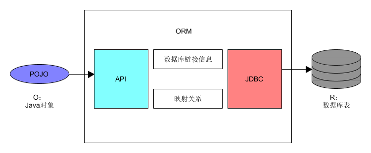

[TOC]

# Hibernate

Hibernate是一个开放源代码的ORM（Object-Relationship Mapping，对象关系映射）框架，它对JDBC进行了非常轻量级的对象封装，是的Java程序员可以随心所欲的使用对象编程思维来操纵数据库。Hibernate可以应用在任何使用JDBC的场合。

## 第一章 持久化

### 1.1 什么是对象持久化

所谓持久化，即把数据（内存中的对象）保存到持久化设备，即可永久保存的存储设备中。

### 1.2 为什么要持久化

1. 内存不能持久。
2. 内存容量有限。
3. 业务数据共享的需要。
4. 为了使用大规模的检索。
5. 数据管理的需要。

### 1.3 怎样实现持久化

1. 对象序列化：即实现了Serializable接口的类。适合于少量对象进行暂时的持久化，适合于在网络上传输对象，但不符合企业级应用的需要。企业应用中对数据的要求是大量的、长时间的。
2. JDBC：
    - 优点：功能晚辈、从理论上说是效率最高的；可以存储海量的数据并且适合进行大规模的检索。
    - 缺点：开发效率和维护效率低；开发难度大；代码量大。
3. ORM：ORM是一种接君问题的思路，是一种思想。它的实质就是将关系数据库中的业务数据用对象的形式表现出来，并通过面向对象的方式将这些对象组织起来，以实现系统业务逻辑。或者说，ORM就是内存中的对象与数据库中的数据间的映射关系。ORM实现框架的特点：开源的，实现了JDBC的封装，实现了简单的API，轻量级解决方案，持久化对象是一个POJO类。
4. JPA框架：JPA，Java Persistence API，是JavaEE的标准ORM接口。它是一种规范，一套接口，但不是实现。用于实现之一规范的ORM很多，其中Hibernate就是之一。

**
JPA、ORM与Hibernate之间的关系：
ORM是一种思想。JPA则是这种思想的具体的表现形式，是以Java语法规范表现出来的一种形式，是一套标准接口。Hibernate则是这套接口的具体实现。
**

## 第二章 Hibernate框架

>使用版本hibernate-release-5.0.1.Final。

Hibernate在三层框架中的位置：DAO层。

### 2.1 工作原理

### 2.2 第一个Hibernate程序

>以下源代码在Hibernate-01-primary中。

定义bean类：Student.java

    package edu.bit.beans;

    public class Student {
        private Integer id; 
        private String name;
        private int age;
        private double score;
        
        public Student() {
            super();
        }

        public Student(String name, int age, double score) {
            super();
            this.name = name;
            this.age = age;
            this.score = score;
        }

        public Integer getId() {
            return id;
        }

        public void setId(Integer id) {
            this.id = id;
        }

        public String getName() {
            return name;
        }

        public void setName(String name) {
            this.name = name;
        }

        public int getAge() {
            return age;
        }

        public void setAge(int age) {
            this.age = age;
        }

        public double getScore() {
            return score;
        }

        public void setScore(double score) {
            this.score = score;
        }

        @Override
        public String toString() {
            return "Student [id=" + id + ", name=" + name + ", age=" + age + ", score=" + score + "]";
        }
    }

定义映射文件：Student.hbm.xml

    <?xml version="1.0" encoding="utf-8"?>
    <!DOCTYPE hibernate-mapping PUBLIC 
        "-//Hibernate/Hibernate Mapping DTD 3.0//EN"
        "http://www.hibernate.org/dtd/hibernate-mapping-3.0.dtd">
        
    <!-- 
        映射文件的作用：
        1. 完成类到表的映射
        2. 完成属性到字段的映射
    -->
    <hibernate-mapping package="edu.bit.beans">
        <class name="Student" table="t_student">
            <id name="id" column="tid">
                <generator class="native"/>
            </id>
            <property name="name" column="tname"/>
            <property name="age" column="tage"/>
            <property name="score" column="tscore"/>
        </class>
    </hibernate-mapping>

定义主配置文件：hibernate.cfg.xml

    <?xml version="1.0" encoding="utf-8"?>
    <!DOCTYPE hibernate-configuration PUBLIC
        "-//Hibernate/Hibernate Configuration DTD 3.0//EN"
        "http://www.hibernate.org/dtd/hibernate-configuration-3.0.dtd">
    <hibernate-configuration>
        <session-factory>
            <!-- DB连接四要素： -->
            <property name="hibernate.connection.driver_class">com.mysql.jdbc.Driver</property>
            <property name="hibernate.connection.url">jdbc:mysql://localhost:3306/test</property>
            <property name="hibernate.connection.username">root</property>
            <property name="hibernate.connection.password">mysql</property>

            <!-- 指定方言 -->
            <property name="hibernate.dialect">org.hibernate.dialect.MySQL5Dialect</property>

            <!-- 注册c3p0数据库连接池 -->
            <property name="hibernate.connection.provider_class">org.hibernate.c3p0.internal.C3P0ConnectionProvider</property>

            <!-- 注册当前session上下文，保证同一线程中获取到的Session是同一个Session -->
            <property name="hibernate.current_session_context_class">thread</property>

            <!-- 配置自动建表，方式为更新 -->
            <property name="hibernate.hbm2ddl.auto">update</property>
        
            <!-- 显示SQL -->
            <property name="hibernate.show_sql">true</property>
            
            <!-- 格式化SQL -->
            <property name="hibernate.format_sql">true</property>
            
            <!-- 注册映射文件 -->
            <mapping resource="edu/bit/beans/Student.hbm.xml" />

        </session-factory>
    </hibernate-configuration>

测试类：MyTest.java

    package edu.bit.test;

    import org.hibernate.Session;
    import org.hibernate.SessionFactory;
    import org.hibernate.cfg.Configuration;
    import org.junit.Test;

    import edu.bit.beans.Student;

    public class MyTest {
        @Test
        public void testSave() {
            // 1.加载主配置文件
            Configuration config = new Configuration().configure();
            // 2.创建Session工厂对象
            SessionFactory sessionFactory = config.buildSessionFactory();
            // 3.获取Session对象
            Session session = sessionFactory.getCurrentSession();
            try {
                // 4.开启事务
                session.beginTransaction();
                // 5.执行保存操作
                Student student = new Student("田七", 27, 97.5);
                session.save(student);
                // 6.事务提交
                session.getTransaction().commit();
            } catch (Exception e) {
                // 7.若发生异常，事务回滚
                session.getTransaction().rollback();
            }
        }
    }

### 2.3 Hibernate API

#### 2.3.1 Configuration类

org.hibernate.cfg.Configuration类的作用是加载主配置文件及映射文件，以实现对Hibernate的启动。

Configuration实例的获取方式：

    Configuration cfg = new Configuration().configure();

configure()源码：

    public Configuration configure() throws HibernateException {
        return configure( StandardServiceRegistryBuilder.DEFAULT_CFG_RESOURCE_NAME );
    }

    public Configuration configure(String resource) throws HibernateException {
        standardServiceRegistryBuilder.configure( resource );
        // todo : still need to have StandardServiceRegistryBuilder handle the "other cfg.xml" elements.
        //      currently it just reads the config properties
        properties.putAll( standardServiceRegistryBuilder.getSettings() );
        return this;
    }

根据源码，我们可以自己定义主配置文件的文件名，然后传入configure(String)方法。

#### 2.3.2 SessionFactory接口

org.hibernate.SessionFactory接口对象是由Configuration对象通过buildSessionFactory()方法创建。创建该对象的目的是，用于开启Session对象。

    SessionFactory sessionFactory = cfg.buildSessionFactory();

##### 2.3.2.1 SessionFactory对象的特点

重量级对象，系统开销大，单例的，线程安全的。
SessionFactory接口的实现类SessionFactoryImpl类中的大多数成员变量是final的。

##### 2.3.2.2 SessionFacory对象使用原则

基于其是线程安全的重量级对象，其创建与销毁时系统开销大，又是单例的特点，SessionFactory对象一般不手工关闭，而是在应用结束时自动将其销毁。因此，SessionFactory不用及逆行close()关闭。

#### 2.3.3 Session接口

org.hibernate.classic.Session接口是应用程序与Hibernate连接的核心API，是Hibernate向应用程序提供操纵DB的最主要接口。它提供了基本的保存、更新、删除与查询方法。由SessionFactory对象创建。

    Session session = sessionFactory.getCurrentSession();
    Session session = sessionFactory.openSession();

##### 2.3.3.1 Session对象的特点

一个轻量级对象、线程不安全的、多例的。
在Web应用中，多个用户对同一应用访问，Hibernate会为每个用户创建一个Session对象。所以是多例的。Session中包含大量非final成员变量，对于同一个用户的操作，可能会产生多个事务，这多个事务若同时对一个Session的同一个成员变量进行访问，就会引起发并发问题，所以Session不是线程安全的。

##### 2.3.3.2 Session对象的使用原则

基于Session的以上特点，Session在使用时要做到一个线程一个Session，即一个事务一个Session。使用完毕，立即关闭。Session不要作为某个类的成员变量出现，因为这样会出现多个实例对象对同一个Session的共享，使其更不安全。

##### 2.3.3.3 Session对象的获取

两种方式：

    // 每次执行都会创建一个新的Session对象
    sessionFactory.openSession();

    // 获取当前线程中的Session
    sessionFactory.getCurrentSession();

两种方式的区别：

-|getCurrentSession()|openSession()
-----|-----|-----
获取的对象|无论执行多少次该方法，只要是在同一线程中，获取的都是同一个Session对象。|每执行一次该方法，获取到的都是一个新的Session对象。
对象的关闭|事务回滚或提交后自动关闭Session，无需手工关闭。|需要手工关闭Session对象。
环境的注册|需要注册Session的运行环境。|无需注册。
查询对事务的支持|查询必须在事务内执行。|查询可以不在事务内运行。
线程绑定|会绑定到当前线程|不会绑定到当前线程

##### 2.3.3.4 Session中的常用方法

- save()/persist()：添加对象
- update()：修改对象
- saveOrUpdate()：添加或修改对象
- delete()：删除对象
- get()/load()：根据主键查询

#### 2.3.4 Transcation接口

通过该接口，可以将事务从持久层提上到业务层。

由Session创建：session.getTransaction();

- 事务的开启：session.beginTranscation();/session.getTransaction().begin();
- 事务的提交：session.getTransaction().commit();
- 事务的回滚：session.getTransaction().rollback();

### 2.4 CURD操作

>以下源代码在Hibernate-02-CURD中。

utils类：

    package edu.bit.utils;

    import org.hibernate.Session;
    import org.hibernate.SessionFactory;
    import org.hibernate.cfg.Configuration;

    public class HbnUtils {
        
        private static SessionFactory sessionFactory;

        /*
         * 获取Session。
         */        
        public static Session getSession() {
            return getSessionFactory().getCurrentSession();     
        }
        
        /*
         * 获取SessionFactory
         */
        public static SessionFactory getSessionFactory() {
            if (sessionFactory == null || sessionFactory.isClosed()) {
                sessionFactory = new Configuration().configure().buildSessionFactory();
            }
            return sessionFactory;
        }
    }

#### 2.4.1 save/persist（添加）操作

    @Test
    public void testSave() {
        Session session = HbnUtils.getSession();
        try {
            session.beginTransaction();
            Student student = new Student("张三",23,93.5);
            session.save(student);
            session.getTransaction().commit();
        } catch (HibernateException e) {
            e.printStackTrace();
            session.getTransaction().rollback();
        }
    }

    @Test
    public void testPersist() {
        Session session = HbnUtils.getSession();
        try {
            session.beginTransaction();
            Student student = new Student("张三",23,93.5);
            session.persist(student);
            session.getTransaction().commit();
        } catch (HibernateException e) {
            e.printStackTrace();
            session.getTransaction().rollback();
        }
    }

#### 2.4.2 delete（删除）操作

    @Test
    public void testDelete() {
        Session session = HbnUtils.getSession();
        try {
            session.beginTransaction();
            Student student = new Student();
            student.setId(1);
            session.delete(student);
            session.getTransaction().commit();
        } catch (HibernateException e) {
            e.printStackTrace();
            session.getTransaction().rollback();
        }
    }

#### 2.4.3 update（修改）操作

    @Test
    public void testUpdate() {
        Session session = HbnUtils.getSession();
        try {
            session.beginTransaction();
            Student student = new Student("李四", 24, 94.5);
            student.setId(2);
            session.update(student);
            session.getTransaction().commit();
        } catch (HibernateException e) {
            e.printStackTrace();
            session.getTransaction().rollback();
        }
    }

#### 2.4.4 get/load（查询）操作

    @Test
    public void testGet() {
        Session session = HbnUtils.getSession();
        try {
            session.beginTransaction();
            Student student = session.get(Student.class, 2);
            System.out.println(student);
            session.getTransaction().commit();
        } catch (HibernateException e) {
            e.printStackTrace();
            session.getTransaction().rollback();
        }
    }
    
    @Test
    public void testLoad() {
        Session session = HbnUtils.getSession();
        try {
            session.beginTransaction();
            Student student = session.load(Student.class, 2);
            System.out.println(student);
            session.getTransaction().commit();
        } catch (HibernateException e) {
            e.printStackTrace();
            session.getTransaction().rollback();
        }
    }

get()和load()的共同点和区别：

- 共同点：根据id加载对象
- 区别：
    + **如果未能发现符合条件的记录，get方法返回null，而load方法会抛出一个ObjectNotFoundException。**
    + **load方法返回没有加载实体数据的代理类实例，而get方法永远返回有实体数据的对象。load方法只有在用到查找到的对象时才真正执行SQL语句，而get方法会立即执行SQL语句。**

修改上述例子中的testLoad方法：

    @Test
    public void testLoad_2() {
        Session session = HbnUtils.getSession();
        try {
            session.beginTransaction();
            Student student = session.load(Student.class, 2);
            // 先提交事务，再打印student对象。
            session.getTransaction().commit();
            System.out.println(student);
        } catch (HibernateException e) {
            e.printStackTrace();
            session.getTransaction().rollback();
        }
    }

报错：

    org.hibernate.LazyInitializationException: could not initialize proxy - no Session

原因为在执行load这段代码时，数据库并没有执行sql语句，得到Student对象。而是在用到（这里为打印）Student对象的时候才会执行sql语句。但是由于事务提交后就不能再执行sql语句了，所以没有得到Student，导致报错。

#### 2.4.5 saveOrUpdate操作

被操作对象（无论数据库中是否有该对象）若存在id，则执行update；没有id则执行save。

    // 执行update
    @Test
    public void testSaveOrUpdate() {
        Session session = HbnUtils.getSession();
        try {
            session.beginTransaction();
            Student student = new Student("王五", 26, 94.5);
            student.setId(2);
            session.saveOrUpdate(student);
            session.getTransaction().commit();
        } catch (HibernateException e) {
            e.printStackTrace();
            session.getTransaction().rollback();
        }
    }

    // 执行save
    @Test
    public void testSaveOrUpdate() {
        Session session = HbnUtils.getSession();
        try {
            session.beginTransaction();
            Student student = new Student("王五", 26, 94.5);
            session.saveOrUpdate(student);
            session.getTransaction().commit();
        } catch (HibernateException e) {
            e.printStackTrace();
            session.getTransaction().rollback();
        }
    }

#### 2.4.6 查询操作对事务的要求

测试情况：

    /*
     * 测试查询操作对事务的要求
     */
    
    // load方法，使用getCurrentSession()方法获取Session，没有创建事务
    @Test
    public void testGetLoad() {
        Session session = HbnUtils.getSession();
        
        Student student = session.load(Student.class, 2);
        
        System.out.println(student);
    }
    // output: HibernateException: load is not valid without active transaction
    
    // load方法，使用getCurrentSession()方法获取Session，没有创建事务
    @Test
    public void testGetLoad_2() {
        Session session = HbnUtils.getSession();
        
        Student student = session.get(Student.class, 2);
        
        System.out.println(student);
    }
    // output: HibernateException: get is not valid without active transaction

    /*
     * 结论：通过getCurrentSession()获取到的Session所执行的查询，必须在事务环境下运行。
     */
    
    // get方法，使用openSession()方法获取Session，没有创建事务
    @Test
    public void testGetLoad_3() {
        Session session = HbnUtils.getSessionFactory().openSession();
        
        Student student = session.load(Student.class, 2);
        
        System.out.println(student);
    }
    // output：Student [id=2, name=王五, age=26, score=94.5]
    
    /*
     * 结论：通过openSession()获取到的Session所执行的查询，无需在事务环境下运行。
     */

#### 2.4.7 增删改操作的默认执行顺序

执行代码。

代码顺序：查-删-增-查-改

    @Test
    public void testCURD() {
        Session session = HbnUtils.getSession();
        try {
            session.beginTransaction();
            
            Student student = session.get(Student.class, 2);
            
            // 删除操作
            session.delete(student);
            
            // 插入操作
            Student student2 = new Student("王五", 25, 95.5);
            session.save(student2);
            
            // 更新操作
            Student student3 = session.get(Student.class, 3);
            student3.setName("赵六");
            session.update(student3);
            
            session.getTransaction().commit();
            
        } catch (HibernateException e) {
            e.printStackTrace();
            session.getTransaction().rollback();
        }
    }

底层执行sql语句为：

    Hibernate: 
        select
            student0_.tid as tid1_0_0_,
            student0_.tname as tname2_0_0_,
            student0_.tage as tage3_0_0_,
            student0_.tscore as tscore4_0_0_ 
        from
            t_student student0_ 
        where
            student0_.tid=?
    Hibernate: 
        insert 
        into
            t_student
            (tname, tage, tscore) 
        values
            (?, ?, ?)
    Hibernate: 
        select
            student0_.tid as tid1_0_0_,
            student0_.tname as tname2_0_0_,
            student0_.tage as tage3_0_0_,
            student0_.tscore as tscore4_0_0_ 
        from
            t_student student0_ 
        where
            student0_.tid=?
    Hibernate: 
        update
            t_student 
        set
            tname=?,
            tage=?,
            tscore=? 
        where
            tid=?
    Hibernate: 
        delete 
        from
            t_student 
        where
            tid=?

实际执行顺序为：查-增-查-改-删

**
增删改三个操作放在一个事务中执行，其默认执行顺序为：增改删。
如要修改执行顺序，可以在调整顺序后手动对session进行刷新，在要执行的操作后增加如下代码：
**

    session.flush();

示例：

代码顺序：查-删-插-查-改

    @Test
    public void testCURD_2() {
        Session session = HbnUtils.getSession();
        try {
            session.beginTransaction();
            
            Student student = session.get(Student.class, 8);
            
            // 删除操作
            session.delete(student);
            
            // 刷新Session
            session.flush();
            
            // 插入操作
            Student student2 = new Student("王五", 25, 95.5);
            session.save(student2);
            
            // 刷新Session
            session.flush();
            
            // 更新操作
            Student student3 = session.get(Student.class, 3);
            student3.setName("赵小六");
            session.update(student3);
            
            // 刷新Session
            session.flush();
            
            session.getTransaction().commit();
            
        } catch (HibernateException e) {
            e.printStackTrace();
            session.getTransaction().rollback();
        }
    }

底层执行sql语句为：

    Hibernate: 
        select
            student0_.tid as tid1_0_0_,
            student0_.tname as tname2_0_0_,
            student0_.tage as tage3_0_0_,
            student0_.tscore as tscore4_0_0_ 
        from
            t_student student0_ 
        where
            student0_.tid=?
    Hibernate: 
        delete 
        from
            t_student 
        where
            tid=?
    Hibernate: 
        insert 
        into
            t_student
            (tname, tage, tscore) 
        values
            (?, ?, ?)
    Hibernate: 
        select
            student0_.tid as tid1_0_0_,
            student0_.tname as tname2_0_0_,
            student0_.tage as tage3_0_0_,
            student0_.tscore as tscore4_0_0_ 
        from
            t_student student0_ 
        where
            student0_.tid=?
    Hibernate: 
        update
            t_student 
        set
            tname=?,
            tage=?,
            tscore=? 
        where
            tid=?

实际执行顺序与代码顺序一致：查-删-增-查-改

### 2.5 主配置文件

>源代码在Hibernate-03-primary中。

    <?xml version="1.0" encoding="utf-8"?>
    <!DOCTYPE hibernate-configuration PUBLIC
        "-//Hibernate/Hibernate Configuration DTD 3.0//EN"
        "http://www.hibernate.org/dtd/hibernate-configuration-3.0.dtd">
    <hibernate-configuration>
        <session-factory>
            <!-- DB连接四要素： -->
            <property name="hibernate.connection.driver_class">com.mysql.jdbc.Driver</property>
            <property name="hibernate.connection.url">jdbc:mysql://localhost:3306/test</property>
            <property name="hibernate.connection.username">root</property>
            <property name="hibernate.connection.password">mysql</property>

            <!-- 指定方言 -->
            <property name="hibernate.dialect">org.hibernate.dialect.MySQL5Dialect</property>

            <!-- 注册c3p0数据库连接池 -->
            <property name="hibernate.connection.provider_class">org.hibernate.c3p0.internal.C3P0ConnectionProvider</property>

            <!-- 注册当前session上下文，保证同一线程中获取到的Session是同一个Session -->
            <property name="hibernate.current_session_context_class">thread</property>

            <!-- 配置自动建表 -->
            <property name="hibernate.hbm2ddl.auto">update</property>
        
            <!-- 显示SQL -->
            <property name="hibernate.show_sql">true</property>
            
            <!-- 格式化SQL -->
            <property name="hibernate.format_sql">true</property>
            
            <!-- 注册映射文件 -->
            <mapping resource="edu/bit/beans/Student.hbm.xml" />

        </session-factory>
    </hibernate-configuration>

#### 2.5.1 hibernate.properties配置文件

Hibernate在运行时会自动加载该配置文件。这个配置文件可以存放主配置文件中的property条目。

hibernate.properties

    #连接数据库四要素
    hibernate.connection.driver_class=com.mysql.jdbc.Driver
    hibernate.connection.url=jdbc:mysql://localhost:3306/test
    hibernate.connection.username=root
    hibernate.connection.password=mysql

当hibernate.properties文件与hibernate.cfg.xml配置冲突时，xml文件优先。

#### 2.5.2 Hibernate内置连接池

    <!-- 注册c3p0数据库连接池 -->
    <property name="hibernate.connection.provider_class">org.hibernate.c3p0.internal.C3P0ConnectionProvider</property>

在配置文件中如果我们删去c3p0连接池配置，在运行程序时Hibernate会使用它自己的内建连接池。

日志：

    [WARN ][2017-11-19 10:45:13] HHH000402: Using Hibernate built-in connection pool (not for production use!)

### 2.6 映射配置文件

    <?xml version="1.0" encoding="utf-8"?>
    <!DOCTYPE hibernate-mapping PUBLIC 
        "-//Hibernate/Hibernate Mapping DTD 3.0//EN"
        "http://www.hibernate.org/dtd/hibernate-mapping-3.0.dtd">
        
    <!-- 
        映射文件的作用：
        1. 完成类到表的映射
        2. 完成属性到字段的映射
    -->
    <hibernate-mapping package="edu.bit.beans">
        <class name="Student" table="t_student">
            <id name="id" column="tid">
                <generator class="native"/>
            </id>
            <property name="name" column="tname"/>
            <property name="age" column="tage"/>
            <property name="score" column="tscore"/>
        </class>
    </hibernate-mapping>

如果去掉table属性，则代表表名与类名相同；如果去掉column属性，则代表表的字段名与类的属性名相同。

#### 2.6.1 Hibernate常用的内置主键生成策略

生成策略是指如下代码中的内容：

    <id ...>
        <generator class="..."/>
    </id>

##### 2.6.1.1 increment策略

+ **该策略是Hibernate自己在维护主键的值（Hibernate自己生成并填入主键，不使用数据库生成的主键）。**当准备在数据库表中插入一条新纪录时，首先从数据库中获取当前主键字段的最大值，然后在最大值基础上加1，作为新插入记录的主键值。
+ 用其生成的主键字段所对应的属性类型可以是long、short、int及其封装类的类型。这种生成策略只有在没有其他进程向同一张表种插入数据时才能使用。在高并发下或集群下不能使用。
+ 测试情况是，后台会产生对当前最大id的查询语句。

进行插入操作，执行SQL语句为：

    Hibernate: 
        select
            max(tid) 
        from
            t_student
    Hibernate: 
        insert 
        into
            t_student
            (tname, tage, tscore, tid) 
        values
            (?, ?, ?, ?)

此时如果创建了新表，则该表的主键没有自增属性，自增由Hibernate维护。

DDL信息：

    CREATE TABLE `t_student` (
      `tid` int(11) NOT NULL,
      `tname` varchar(255) DEFAULT NULL,
      `tage` int(11) DEFAULT NULL,
      `tscore` double DEFAULT NULL,
      PRIMARY KEY (`tid`)
    ) ENGINE=InnoDB DEFAULT CHARSET=utf8

##### 2.6.1.2 identity策略

- **该策略使用数据库自身的自增长来维护主键。**如mysql使用auto_increment来维护。用其生成的主键字段所对应的属性类型可以是long、short、int及其封装类型。
- 该策略在生成主键时会出现以下情况：对于插入操作，即使最后执行的是回滚，DB中记录的主键值的变量也会增一。因为该生成策略在发生回滚之前已经调用过DB的主键自增。
- 测试情况是，后台不会产生任何有关id生成值的语句。

进行插入操作，执行SQL语句为：

    Hibernate: 
        insert 
        into
            t_student
            (tname, tage, tscore) 
        values
            (?, ?, ?)

此时如果创建了新表，则该表的主键有自增属性，AUTO_INCREMENT。

DDL信息：

    CREATE TABLE `t_student` (
      `tid` int(11) NOT NULL AUTO_INCREMENT,
      `tname` varchar(255) DEFAULT NULL,
      `tage` int(11) DEFAULT NULL,
      `tscore` double DEFAULT NULL,
      PRIMARY KEY (`tid`)
    ) ENGINE=InnoDB AUTO_INCREMENT=2 DEFAULT CHARSET=utf8

##### 2.6.1.3 sequence策略

- 在Oracle、DB2和PostgreSQL等数据库中创建一个序列（sequence），然后Hibernate通过该序列为当前记录获取主键值，从而为实体对象赋予主键字段映射属性值。此即sequence生成策略，用其生成的字段映射属性值的类型可以是long、short、int及其封装类的类型。
- 对于MySQL数据库，原本是不支持序列的。但稍作修改后，MySQL也可以支持该生成策略。

测试情况：在第一次执行时，后台会输出以下查询语句，并报错。

    Hibernate:
        select
            next_val as id_val
        from
            hibernate_sequence for update

    org.hibernate.id.IdentifierGenerationException: could not read a hi value - you need to populate the table: hibernate_sequence

- 该语句是，从hibernate_sequence序列表中查询字段值next_val，该值将作为要插入数据的主键值。当然该查询语句中的for update表示，对该表的操作使用了悲观锁。
- 打开数据库，发现多生成了一张表hibernate_squence，打开该表，发现初值为空，无法进行自增运算。这就是报错的原因：没有初始值。手工为其赋初始值1即可再运行了。

测试：

初次运行save方法，报错，并生成hibernate_sequence表，其next_val字段初值为null。

    Hibernate:
        select
            next_val as id_val
        from
            hibernate_sequence for update

    org.hibernate.id.IdentifierGenerationException: could not read a hi value - you need to populate the table: hibernate_sequence

为next_val赋值1，再次运行save方法。

执行以下sql语句：

    Hibernate: 
        select
            next_val as id_val 
        from
            hibernate_sequence for update
                
    Hibernate: 
        update
            hibernate_sequence 
        set
            next_val= ? 
        where
            next_val=?
    Hibernate: 
        insert 
        into
            t_student
            (tname, tage, tscore, tid) 
        values
            (?, ?, ?, ?)

插入成功，hibernate_sequence表的next_val字段此时值自增1为2。

##### 2.6.1.4 native策略

- 由Hibernate根据所使用的数据库支持能力从identity、sequence生成策略中选择一种。
- 使用这种标识符属性生成策略可以根据不同的数据库采用不同的生成策略，如Oracle中使用squence，在MySQL中使用identity便于Hibernate引用在不同的数据库之间进行移植。

测试情况：如果没有生成任何id生成值有关的SQL语句。说明使用的是identity生成策略。

##### 2.6.1.5 assigned策略

- 该生成策略的主键值来自于程序员手工设置，即通过setId()方法进行设置。属性类型可以是整型也可以是String，一般为String。
- 此生成策略，主要应用于业务相关主键。例如学号、身份证号等。

##### 2.6.1.6 uuid策略

>代码在Hibernate-04-uuid

- uuid生成策略采用UUID（Universally Unique Identifier，通用唯一识别码）算法来生成一个String类型的主键值，该值使用ip地址、JVM启动时间（精确到1/4秒）、当前系统时间和一个计数器值（在当前JVM中唯一）经过计算产生，可以用于分布式的Hibernate应用中。产生的标识符属性是一个32位长度的字符串。使用这种生成策略，要求属性的类型必须为String类型。
- 这种标识符属性生成策略生成的数值可以保证多个数据库之间的唯一性，并且由于其生成与具体的数据库没有关系，所以移植性强。但由于该值是32位长的字符串，所以占用数据库空间较大，并且检索速度较慢。
- 除了使用Hibernate外，在JDBC中也可以使用uuid生成主键。因为UUID是java.util包中的一个独立的类。在JRE System Library库中的rt.jar包内的java.util包下可以找到UUID类。

测试：

修改id的类型为String：

    package edu.bit.beans;

    public class Student {
        private String id; 
        private String name;
        private int age;
        private double score;
        
        public Student() {
            super();
        }

        public Student(String name, int age, double score) {
            super();
            this.name = name;
            this.age = age;
            this.score = score;
        }

        // setter & getter

        @Override
        public String toString() {
            return "Student [id=" + id + ", name=" + name + ", age=" + age + ", score=" + score + "]";
        }
    }

修改策略为uuid。

执行三次testSave()方法，底层执行的SQL语句为：

    Hibernate: 
        insert 
        into
            t_student
            (tname, tage, tscore, tid) 
        values
            (?, ?, ?, ?)

此时表中数据为：

tid|tname|tage|tscore
-----|-----|-----|-----
8a2afea75fd32ee0015fd32ee1730000|王二麻子|23|93.5
8a2afea75fd32ef0015fd32ef0c60000|王二麻子|23|93.5
8a2afea75fd32ef9015fd32ef9b80000|王二麻子|23|93.5

DDL信息：

    CREATE TABLE `t_student` (
      `tid` varchar(255) NOT NULL,
      `tname` varchar(255) DEFAULT NULL,
      `tage` int(11) DEFAULT NULL,
      `tscore` double DEFAULT NULL,
      PRIMARY KEY (`tid`)
    ) ENGINE=InnoDB DEFAULT CHARSET=utf8

### 2.7 对象状态持久管理

#### 2.7.1 Hibernate对象的状态

对象的状态一般是指对象的一组属性的值。而这里的状态是指对象处于什么存储介质中。用于存放对象的存储介质有三个：普通内存（与Hibernate无关）、Session缓存和数据库。对象处于不同的介质中，就处于不同的状态。

1. 瞬时态：transient状态，对象在内存中存在，但在DB中无记录，与Session无关，是个过渡状态。
2. 持久态：persistent状态，在内存中存在，DB中也有记录，与Session相关，在Session中有对象的副本。
3. 游离态：detached状态，在内存中存在，在DB中有记录，与Session无关。
4. 无名态：在内存中不存在，但在DB中有记录，与Session无关。

各状态数据存在位置：（执行方法后进行了事务的提交）

-|普通内存|DB|Session
-----|-----|-----|-----
瞬时态|√|X|X
持久态|√|√|√
游离态|√|√|X
无名态|X|√|X

*前三种状态在Hibernate文档中有具体的描述和命名，第四种状态只有描述没有命名。“无名态”是为了方便描述而加的名字。*

#### 2.7.2 状态转换图及状态转换常用方法

- save()：将瞬时态对象同步到DB中。
- update()：将游离态对象同步到DB中。
- delete()：将指定的对象从Session中删除，同时也删除DB中的该数据。
- close()：关闭Session对象。
- clear()：清空Session缓存。
- saveOrUpdate()：根据参数对象的id属性是否为null来判断是执行保存还是更新操作。
- evict()：将指定对象从Session中删除，但不删除DB中的该数据。
- load()：将无名态对象转换为持久态对象。
- get()：将无名态对象转换为持久态对象。

*
Session缓存通过id来管理插入的对象。
*

测试：

    @Test
    public void testSave() {
        // 1.加载主配置文件：hibernate.cfg.xml
        Configuration config = new Configuration().configure();
        // 2.创建Session工厂对象
        SessionFactory sessionFactory = config.buildSessionFactory();
        // 3.获取Session对象
        Session session = sessionFactory.getCurrentSession();
        try {
            // 4.开启事务
            session.beginTransaction();
            // 5.执行保存操作
            Student student = new Student("田七", 27, 97.5);
            System.out.println("save前： " + student);
            session.save(student);
            System.out.println("save后： " + student);
            session.clear();
            System.out.println("clear后： " + student);
            // 6.事务提交
            session.getTransaction().commit();
        } catch (Exception e) {
            // 7.若发生异常，事务回滚
            session.getTransaction().rollback();
        }
    }

执行上述测试代码，输出：

    save前： Student [id=null, name=田七, age=27, score=97.5] edu.bit.beans.Student@63a5d002
    Hibernate: 
        insert 
        into
            t_student
            (tname, tage, tscore) 
        values
            (?, ?, ?)
    save后： Student [id=1, name=田七, age=27, score=97.5] edu.bit.beans.Student@63a5d002
    clear后： Student [id=1, name=田七, age=27, score=97.5] edu.bit.beans.Student@63a5d002

**
普通内存与Session缓存中的对象其实是同一个对象，他们的不同之一是，当对象刚被创建出来是还处于瞬时态，id属性是没有值得。而当其被Session管理后，其id属性已经被赋值。但无论id属性是否有值，他们都是同一个对象，占用同一块内存空间。
session调用clear方法后，Student对象仍然持有id，但此时这个Student对象已经不由Session进行管理，它的id没有在Session中“注册”。
**

**
save()方法执行的过程：native或identity策略
**

- 向数据库发送一条信息，告诉数据库要执行insert语句，让数据库生成一个id并返回。
- 接收到数据库发送来的id，并使用该id初始化Student对象的id属性。
- 现在该对象拥有了id，那么Session缓存就可以对其进行管理了：
    + 将Student对象的id作为key，该对象的引用作为value放入到Session缓存（本质为一个Map）中，被Session缓存管理。（也就是说只有id属性不为null的对象才有可能被Session管理）

## 第三章 单表查询

Hibernate的单表查询使用的是HQL语句。

Hibernate是DAO层技术，对数据的使用，查询是最为重要的。Hibernate的查询技术非常强大，支持原始SQL语句查询，支持QBC查询以及支持Hibernate特有的HQL查询。

HQL，Hibernate Query Language，Hibernate查询语言，他与SQL非常相似。但是HQL是面向对象的查询语言，而SQL是面向二维表的。HQL查询语句中使用的是类名与属性名，SQL语句使用的是表名与字段名。
QBC，Query By Criteria，标准查询，一种比HQL更为面向对象的查询方法。

### 3.1 API

#### 3.1.1 Query接口- - -HQL

Hibernate进行HQL查询的接口，支持动态绑定参数的功能。使用Session对象的createQuery方法可获取Query对象。

    Query query = session.createQuery(hql_statement);

**
HQL查询语句中使用的是类名与属性名。
**

    String hql = "from Student where sage>? and sscore<?";

- Student为类名
- sage和sscore为属性名

**
在不使用类的别名的情况下，在HQL中直接使用字段名也是可以通过的。
**

    String hql = "from Student where age>? and score<?";

- Student为类名
- age和score为表中字段名

**
但若使用“类别名.属性名”的形式，则不能使用字段名替代属性名，只能使用类属性名。
**

    // 错误写法
    String hql = "from Student s where s.age>? and s.score<?";

- Student为类名，s为其别名
- age和score为字段名

**
建议在HQL中只使用类属性名，不要用字段名。
**

#### 3.1.2 SQLQuery接口- - -SQL

Hibernate进行SQL原生查询的接口，支持动态绑定参数的功能，是Query接口的子接口。

    SQLQuery sqlQuery = session.createSQLQuery(sql_statement);

其查询出的结果对象默认为Object，若结果为List，则其元素为Object。使用SQLQuery的addEntity(Xxx.class)方法，可以将其结果泛型设定为指定类型。

#### 3.1.3 Criteria接口- - -QBC

Criteria，标准查询，进一步面向对象。Hibernate进行Criteria查询的接口，与Query接口无关。使用Session.createCriteria()方法可以获取到Criteria对象。

QBC所有的功能均由其API实现，没有查询语句。

    Criteria criteria = session.createCriteria(Xxx.class);

### 3.2 分类查询

>代码在Hibernate-05-hql下。

#### 3.2.1 查询表中所有数据

(1) 使用SQL语句查询所有。

addEntity方法使用映射文件对查询的结果进行封装。

    @Test
    public void test01_SQL() {
        Session session = HbnUtils.getSession();
        
        try {
            session.beginTransaction();
            // 创建SQL语句
            String sql = "select * from t_student";
            // 查询得到结果，封装为Student对象，并获取这个列表
            @SuppressWarnings("unchecked")
            List<Student> list = session.createSQLQuery(sql).addEntity(Student.class).list();
            for (Student student : list)
                System.out.println(student);
            
            session.getTransaction().commit();
        } catch (Exception e) {
            e.printStackTrace();
            session.getTransaction().rollback();
        }
    }

output：

    Student [id=1, name=杨老六, age=35, score=90.24]
    Student [id=2, name=刘大脑袋, age=36, score=90.29]
    Student [id=3, name=杨老六, age=35, score=90.85]
    Student [id=4, name=赵四, age=24, score=90.14]
    Student [id=5, name=梁老七, age=33, score=90.35]
    Student [id=6, name=梁老七, age=22, score=90.73]
    Student [id=7, name=刘大脑袋, age=35, score=90.47]
    Student [id=8, name=梁老七, age=33, score=90.37]
    Student [id=9, name=杜老三, age=32, score=90.77]
    Student [id=10, name=杨老六, age=25, score=90.98]

底层执行语句为：

    Hibernate: 
        select
            * 
        from
            t_student

(2) 使用HQL语句查询所有。

无需封装，直接面向对象。

    @Test
    public void test01_HQL() {
        Session session = HbnUtils.getSession();
        
        try {
            session.beginTransaction();
            // 这里的Student是类名
            String hql = "from Student";
            @SuppressWarnings("unchecked")
            List<Student> list = session.createQuery(hql).list();
            for (Student student : list)
                System.out.println(student);
            session.getTransaction().commit();
        } catch (Exception e) {
            e.printStackTrace();
            session.getTransaction().rollback();
        }
    }

output:

    Student [id=1, name=杨老六, age=35, score=90.24]
    Student [id=2, name=刘大脑袋, age=36, score=90.29]
    Student [id=3, name=杨老六, age=35, score=90.85]
    Student [id=4, name=赵四, age=24, score=90.14]
    Student [id=5, name=梁老七, age=33, score=90.35]
    Student [id=6, name=梁老七, age=22, score=90.73]
    Student [id=7, name=刘大脑袋, age=35, score=90.47]
    Student [id=8, name=梁老七, age=33, score=90.37]
    Student [id=9, name=杜老三, age=32, score=90.77]
    Student [id=10, name=杨老六, age=25, score=90.98]

底层执行语句为：

    Hibernate: 
        select
            student0_.tid as tid1_0_,
            student0_.tname as tname2_0_,
            student0_.tage as tage3_0_,
            student0_.tscore as tscore4_0_ 
        from
            t_student student0_

（3）使用QBC查询所有：

直接面向对象，没有语句。

    @Test
    public void test01_QBC() {
        Session session = HbnUtils.getSession();
        
        try {
            session.beginTransaction();
            
            @SuppressWarnings("unchecked")
            List<Student> list = session.createCriteria(Student.class).list();
            
            for (Student student : list)
                System.out.println(student);
            session.getTransaction().commit();
        } catch (Exception e) {
            e.printStackTrace();
            session.getTransaction().rollback();
        }
    }

output：

    Student [id=1, name=杨老六, age=35, score=90.24]
    Student [id=2, name=刘大脑袋, age=36, score=90.29]
    Student [id=3, name=杨老六, age=35, score=90.85]
    Student [id=4, name=赵四, age=24, score=90.14]
    Student [id=5, name=梁老七, age=33, score=90.35]
    Student [id=6, name=梁老七, age=22, score=90.73]
    Student [id=7, name=刘大脑袋, age=35, score=90.47]
    Student [id=8, name=梁老七, age=33, score=90.37]
    Student [id=9, name=杜老三, age=32, score=90.77]
    Student [id=10, name=杨老六, age=25, score=90.98]

底层执行语句为：

    Hibernate: 
        select
            this_.tid as tid1_0_0_,
            this_.tname as tname2_0_0_,
            this_.tage as tage3_0_0_,
            this_.tscore as tscore4_0_0_ 
        from
            t_student this_

#### 3.2.2 查询结果排序

*按照年龄降序排列*

（1）使用SQL语句：

    @Test
    public void test02_SQL() {
        Session session = HbnUtils.getSession();
        
        try {
            session.beginTransaction();
            
            String sql = "select * from t_student order by tage desc";
            @SuppressWarnings("unchecked")
            List<Student> list = session.createSQLQuery(sql).addEntity(Student.class).list();
            for (Student student : list)
                System.out.println(student);
            
            session.getTransaction().commit();
        } catch (Exception e) {
            e.printStackTrace();
            session.getTransaction().rollback();
        }
    }

output:

    Student [id=2, name=刘大脑袋, age=36, score=90.29]
    Student [id=1, name=杨老六, age=35, score=90.24]
    Student [id=3, name=杨老六, age=35, score=90.85]
    Student [id=7, name=刘大脑袋, age=35, score=90.47]
    Student [id=5, name=梁老七, age=33, score=90.35]
    Student [id=8, name=梁老七, age=33, score=90.37]
    Student [id=9, name=杜老三, age=32, score=90.77]
    Student [id=10, name=杨老六, age=25, score=90.98]
    Student [id=4, name=赵四, age=24, score=90.14]
    Student [id=6, name=梁老七, age=22, score=90.73]

底层执行语句为：

    Hibernate: 
        select
            * 
        from
            t_student 
        order by
            tage desc

（2）使用HQL语句：

    @Test
    public void test02_HQL() {
        Session session = HbnUtils.getSession();
        
        try {
            session.beginTransaction();
            // 这里的Student是类名，age为类属性名，使用tage表字段名也可以。
            String hql = "from Student order by age desc";
            @SuppressWarnings("unchecked")
            List<Student> list = session.createQuery(hql).list();
            for (Student student : list)
                System.out.println(student);
            session.getTransaction().commit();
        } catch (Exception e) {
            e.printStackTrace();
            session.getTransaction().rollback();
        }
    }

output：

    Student [id=2, name=刘大脑袋, age=36, score=90.29]
    Student [id=1, name=杨老六, age=35, score=90.24]
    Student [id=3, name=杨老六, age=35, score=90.85]
    Student [id=7, name=刘大脑袋, age=35, score=90.47]
    Student [id=5, name=梁老七, age=33, score=90.35]
    Student [id=8, name=梁老七, age=33, score=90.37]
    Student [id=9, name=杜老三, age=32, score=90.77]
    Student [id=10, name=杨老六, age=25, score=90.98]
    Student [id=4, name=赵四, age=24, score=90.14]
    Student [id=6, name=梁老七, age=22, score=90.73]

底层执行语句：

    Hibernate: 
        select
            student0_.tid as tid1_0_,
            student0_.tname as tname2_0_,
            student0_.tage as tage3_0_,
            student0_.tscore as tscore4_0_ 
        from
            t_student student0_ 
        order by
            tage desc

（3）使用QBC

    @Test
    public void test02_QBC() {
        Session session = HbnUtils.getSession();
        
        try {
            session.beginTransaction();
            
            @SuppressWarnings("unchecked")
            List<Student> list = session.createCriteria(Student.class).addOrder(Order.desc("age")).list();
            
            for (Student student : list)
                System.out.println(student);
            session.getTransaction().commit();
        } catch (Exception e) {
            e.printStackTrace();
            session.getTransaction().rollback();
        }
    }

#### 3.2.2 动态参数赋值

*查询年龄大于30，成绩大于90.3的数据。*

**参数编号从0开始。JDBC参数编号从1开始。**

（1）使用SQL语句

    @Test
    public void test03_SQL() {
        Session session = HbnUtils.getSession();

        try {
            session.beginTransaction();

            String sql = "select * from t_student where tage>? and tscore>?";
            @SuppressWarnings("unchecked")
            List<Student> list = session.createSQLQuery(sql).addEntity(Student.class).setInteger(0, 20).setDouble(1, 90.3).list();
            for (Student student : list)
                System.out.println(student);

            session.getTransaction().commit();
        } catch (Exception e) {
            e.printStackTrace();
            session.getTransaction().rollback();
        }
    }

output：

    Student [id=3, name=杨老六, age=35, score=90.85]
    Student [id=5, name=梁老七, age=33, score=90.35]
    Student [id=6, name=梁老七, age=22, score=90.73]
    Student [id=7, name=刘大脑袋, age=35, score=90.47]
    Student [id=8, name=梁老七, age=33, score=90.37]
    Student [id=9, name=杜老三, age=32, score=90.77]
    Student [id=10, name=杨老六, age=25, score=90.98]

底层执行语句：

    Hibernate: 
        select
            * 
        from
            t_student 
        where
            tage>? 
            and tscore>?

**
使用SQL语句查询，同样可以使用setParameter方法对参数进行赋值，也同样可以使用“:”对参数设置别名。
**

（2.1）使用HQL语句

    @Test
    public void test03_HQL() {
        Session session = HbnUtils.getSession();

        try {
            session.beginTransaction();

            String hql = "from Student where age>? and score>?";

            @SuppressWarnings("unchecked")
            List<Student> list = session.createQuery(hql).setInteger(0, 20).setDouble(1, 90.3).list();
            // 可以使用set+具体类型的方法，也可以使用setParameter方法对参数进行设置。
            // List<Student> list = session.createQuery(hql).setParameter(0, 20).setParameter(1, 90.3).list();
            for (Student student : list)
                System.out.println(student);

            session.getTransaction().commit();
        } catch (Exception e) {
            e.printStackTrace();
            session.getTransaction().rollback();
        }
    }

output：

    Student [id=3, name=杨老六, age=35, score=90.85]
    Student [id=5, name=梁老七, age=33, score=90.35]
    Student [id=6, name=梁老七, age=22, score=90.73]
    Student [id=7, name=刘大脑袋, age=35, score=90.47]
    Student [id=8, name=梁老七, age=33, score=90.37]
    Student [id=9, name=杜老三, age=32, score=90.77]
    Student [id=10, name=杨老六, age=25, score=90.98]

底层执行语句：

    Hibernate: 
        select
            student0_.tid as tid1_0_,
            student0_.tname as tname2_0_,
            student0_.tage as tage3_0_,
            student0_.tscore as tscore4_0_ 
        from
            t_student student0_ 
        where
            student0_.tage>? 
            and student0_.tscore>?

（2.2）使用HQL语句的第二种方式

    @Test
    public void test03_HQL_2() {
        Session session = HbnUtils.getSession();

        try {
            session.beginTransaction();
            // 设置参数的别名，使用:开头，通常别名与属性名一致。
            String hql = "from Student where age>:age and score>:score";

            @SuppressWarnings("unchecked")
            List<Student> list = session.createQuery(hql).setInteger("age", 20).setDouble("score", 90.3).list();
            // 可以使用set+具体类型的方法，也可以使用setParameter方法对参数进行设置。
            // List<Student> list = session.createQuery(hql).setParameter("age", 20).setParameter("score", 90.3).list();
            for (Student student : list)
                System.out.println(student);

            session.getTransaction().commit();
        } catch (Exception e) {
            e.printStackTrace();
            session.getTransaction().rollback();
        }
    }

output：

    Student [id=3, name=杨老六, age=35, score=90.85]
    Student [id=5, name=梁老七, age=33, score=90.35]
    Student [id=6, name=梁老七, age=22, score=90.73]
    Student [id=7, name=刘大脑袋, age=35, score=90.47]
    Student [id=8, name=梁老七, age=33, score=90.37]
    Student [id=9, name=杜老三, age=32, score=90.77]
    Student [id=10, name=杨老六, age=25, score=90.98]

底层执行语句：

    Hibernate: 
        select
            student0_.tid as tid1_0_,
            student0_.tname as tname2_0_,
            student0_.tage as tage3_0_,
            student0_.tscore as tscore4_0_ 
        from
            t_student student0_ 
        where
            student0_.tage>? 
            and student0_.tscore>?

（3）使用QBC

**
添加约束，gt：大于，lt：小于.....更多约束参见API。
**

    @Test
    public void test03_QBC() {
        Session session = HbnUtils.getSession();

        try {
            session.beginTransaction();

            @SuppressWarnings("unchecked")
            List<Student> list = session.createCriteria(Student.class).add(Restrictions.gt("age", 20))
                    .add(Restrictions.gt("score", 90.3)).list();

            for (Student student : list)
                System.out.println(student);
            session.getTransaction().commit();
        } catch (Exception e) {
            e.printStackTrace();
            session.getTransaction().rollback();
        }
    }

output：

    Student [id=3, name=杨老六, age=35, score=90.85]
    Student [id=5, name=梁老七, age=33, score=90.35]
    Student [id=6, name=梁老七, age=22, score=90.73]
    Student [id=7, name=刘大脑袋, age=35, score=90.47]
    Student [id=8, name=梁老七, age=33, score=90.37]
    Student [id=9, name=杜老三, age=32, score=90.77]
    Student [id=10, name=杨老六, age=25, score=90.98]

底层执行语句：

    Hibernate: 
        select
            this_.tid as tid1_0_0_,
            this_.tname as tname2_0_0_,
            this_.tage as tage3_0_0_,
            this_.tscore as tscore4_0_0_ 
        from
            t_student this_ 
        where
            this_.tage>? 
            and this_.tscore>?

#### 3.2.3 分页查询

*10条数据，每页显示3条，显示第二页。*

（2）使用HQL语句

    @Test
    public void test04_HQL() {
        Session session = HbnUtils.getSession();

        try {
            session.beginTransaction();

            String hql = "from Student";
            int pageNumber = 2; // 显示第二页
            int pageSize = 3; // 每页显示3条
            int startIndex = (pageNumber - 1) * pageSize; // 索引从这个值开始（表中的第一个索引是0）

            @SuppressWarnings("unchecked")
            List<Student> list = session.createQuery(hql).setFirstResult(startIndex).setMaxResults(pageSize).list();
            
            for (Student student : list)
                System.out.println(student);

            session.getTransaction().commit();
        } catch (Exception e) {
            e.printStackTrace();
            session.getTransaction().rollback();
        }
    }

output:

    Student [id=4, name=赵四, age=24, score=90.14]
    Student [id=5, name=梁老七, age=33, score=90.35]
    Student [id=6, name=梁老七, age=22, score=90.73]

底层执行语句：

Hibernate: 
    select
        student0_.tid as tid1_0_,
        student0_.tname as tname2_0_,
        student0_.tage as tage3_0_,
        student0_.tscore as tscore4_0_ 
    from
        t_student student0_ limit ?,?

#### 3.2.4 模糊查询

*查询名字中带有“老”字的数据。*

    @Test
    public void test05_HQL() {
        Session session = HbnUtils.getSession();

        try {
            session.beginTransaction();
            // 使用别名的方式
            String hql = "from Student where name like :name";

            @SuppressWarnings("unchecked")
            List<Student> list = session.createQuery(hql).setString("name", "%老%").list();
            
            for (Student student : list)
                System.out.println(student);

            session.getTransaction().commit();
        } catch (Exception e) {
            e.printStackTrace();
            session.getTransaction().rollback();
        }
    }

output：

    Student [id=1, name=杨老六, age=35, score=90.24]
    Student [id=3, name=杨老六, age=35, score=90.85]
    Student [id=5, name=梁老七, age=33, score=90.35]
    Student [id=6, name=梁老七, age=22, score=90.73]
    Student [id=8, name=梁老七, age=33, score=90.37]
    Student [id=9, name=杜老三, age=32, score=90.77]
    Student [id=10, name=杨老六, age=25, score=90.98]

底层执行语句：

    Hibernate: 
        select
            student0_.tid as tid1_0_,
            student0_.tname as tname2_0_,
            student0_.tage as tage3_0_,
            student0_.tscore as tscore4_0_ 
        from
            t_student student0_ 
        where
            student0_.tname like ?

#### 3.2.5 唯一性查询

*查询id为2的学生。*

    @Test
    public void test06_HQL() {
        Session session = HbnUtils.getSession();

        try {
            session.beginTransaction();
            // 使用别名的方式
            String hql = "from Student where id=:id";

            Student student = (Student) session.createQuery(hql).setInteger("id", 2).uniqueResult();
            
            System.out.println(student);

            session.getTransaction().commit();
        } catch (Exception e) {
            e.printStackTrace();
            session.getTransaction().rollback();
        }
    }

output：

    Student [id=2, name=刘大脑袋, age=36, score=90.29]

底层执行语句：

    Hibernate: 
        select
            student0_.tid as tid1_0_,
            student0_.tname as tname2_0_,
            student0_.tage as tage3_0_,
            student0_.tscore as tscore4_0_ 
        from
            t_student student0_ 
        where
            student0_.tid=?

#### 3.2.6 聚合函数查询

*查询总条目数，count(\*)与count(id)等价。*

    @Test
    public void test07_HQL() {
        Session session = HbnUtils.getSession();

        try {
            session.beginTransaction();
            String hql = "select count(id) from Student";
            Long count = (Long) session.createQuery(hql).uniqueResult();
            System.out.println(count);
            session.getTransaction().commit();
        } catch (Exception e) {
            e.printStackTrace();
            session.getTransaction().rollback();
        }
    }

output：

    10  

底层执行语句：

    Hibernate: 
        select
            count(*) as col_0_0_ 
        from
            t_student student0_

#### 3.2.7 投影查询

*查询所有学生，只显示姓名和年龄数据。*

    @Test
    public void test08_HQL() {
        Session session = HbnUtils.getSession();

        try {
            session.beginTransaction();
            // 要求Student类有一个以name和age为参数的构造器。
            String hql = "select new Student(name,age) from Student";
            
            @SuppressWarnings("unchecked")
            List<Student> list = session.createQuery(hql).list();
            
            for (Student student : list) {
                System.out.println(student);
            }
            
            session.getTransaction().commit();
        } catch (Exception e) {
            e.printStackTrace();
            session.getTransaction().rollback();
        }
    }

output：

    Student [id=null, name=杨老六, age=35, score=0.0]
    Student [id=null, name=刘大脑袋, age=36, score=0.0]
    Student [id=null, name=杨老六, age=35, score=0.0]
    Student [id=null, name=赵四, age=24, score=0.0]
    Student [id=null, name=梁老七, age=33, score=0.0]
    Student [id=null, name=梁老七, age=22, score=0.0]
    Student [id=null, name=刘大脑袋, age=35, score=0.0]
    Student [id=null, name=梁老七, age=33, score=0.0]
    Student [id=null, name=杜老三, age=32, score=0.0]
    Student [id=null, name=杨老六, age=25, score=0.0]

底层执行语句：

    Hibernate: 
        select
            student0_.tname as col_0_0_,
            student0_.tage as col_1_0_ 
        from
            t_student student0_

#### 3.2.8 分组查询

*按年龄进行分组，并显示人数大于等于2的组。*

    @Test
    public void test09_HQL() {
        Session session = HbnUtils.getSession();

        try {
            session.beginTransaction();
            String hql = "select age from Student group by age having count(age) >= 2";
            
            @SuppressWarnings("unchecked")
            List<Integer> list = session.createQuery(hql).list();
            
            System.out.println(list);
            session.getTransaction().commit();
        } catch (Exception e) {
            e.printStackTrace();
            session.getTransaction().rollback();
        }
    }

output:

    [33, 35]

底层执行语句：

    Hibernate: 
        select
            student0_.tage as col_0_0_ 
        from
            t_student student0_ 
        group by
            student0_.tage 
        having
            count(student0_.tage)>=2

#### 3.2.9 iterate()

iterate()方法返回一个Iterator，然后我们可以遍历这个迭代器。

*查询id小于4的条目。*

使用list()方法：

    @Test
    public void test10_HQL_1() {
        Session session = HbnUtils.getSession();

        try {
            session.beginTransaction();
            String hql = "from Student where id < 4";
            
            @SuppressWarnings("unchecked")
            List<Integer> list = session.createQuery(hql).list();
            
            System.out.println(list);
            session.getTransaction().commit();
        } catch (Exception e) {
            e.printStackTrace();
            session.getTransaction().rollback();
        }
    }

底层执行语句：

*1次详情查询。*

    Hibernate: 
        select
            student0_.tid as tid1_0_,
            student0_.tname as tname2_0_,
            student0_.tage as tage3_0_,
            student0_.tscore as tscore4_0_ 
        from
            t_student student0_ 
        where
            student0_.tid<4

使用iterate()方法：

    @Test
    public void test10_HQL_2() {
        Session session = HbnUtils.getSession();

        try {
            session.beginTransaction();
            String hql = "from Student where id < 4";
            
            @SuppressWarnings("unchecked")
            Iterator<Integer> it = session.createQuery(hql).iterate();
            while (it.hasNext()) {
                System.out.println(it.next());
            }
            session.getTransaction().commit();
        } catch (Exception e) {
            e.printStackTrace();
            session.getTransaction().rollback();
        }
    }

底层执行语句及结果：

*1次主键查询，3次详情查询。*

    Hibernate: 
        select
            student0_.tid as col_0_0_ 
        from
            t_student student0_ 
        where
            student0_.tid<4
    Hibernate: 
        select
            student0_.tid as tid1_0_0_,
            student0_.tname as tname2_0_0_,
            student0_.tage as tage3_0_0_,
            student0_.tscore as tscore4_0_0_ 
        from
            t_student student0_ 
        where
            student0_.tid=?
    Student [id=1, name=杨老六, age=35, score=90.24]
    Hibernate: 
        select
            student0_.tid as tid1_0_0_,
            student0_.tname as tname2_0_0_,
            student0_.tage as tage3_0_0_,
            student0_.tscore as tscore4_0_0_ 
        from
            t_student student0_ 
        where
            student0_.tid=?
    Student [id=2, name=刘大脑袋, age=36, score=90.29]
    Hibernate: 
        select
            student0_.tid as tid1_0_0_,
            student0_.tname as tname2_0_0_,
            student0_.tage as tage3_0_0_,
            student0_.tscore as tscore4_0_0_ 
        from
            t_student student0_ 
        where
            student0_.tid=?
    Student [id=3, name=杨老六, age=35, score=90.85]

**
但是，再次使用iterate()方法时，即当iterate()方法用于第二次查询时，只需要进行1次主键查询。
**

连续两次使用iterate()方法：

    @Test
    public void test10_HQL_3() {
        Session session = HbnUtils.getSession();
        try {
            session.beginTransaction();
            String hql = "from Student where id < 4";
            
            @SuppressWarnings("unchecked")
            Iterator<Integer> it = session.createQuery(hql).iterate();
            while (it.hasNext()) {
                System.out.println(it.next());
            }
            System.out.println("===============");
            @SuppressWarnings("unchecked")
            Iterator<Integer> it2 = session.createQuery(hql).iterate();
            while (it2.hasNext()) {
                System.out.println(it2.next());
            }   
            session.getTransaction().commit();
        } catch (Exception e) {
            e.printStackTrace();
            session.getTransaction().rollback();
        }
    }

底层执行语句及结果：

    Hibernate: 
        select
            student0_.tid as col_0_0_ 
        from
            t_student student0_ 
        where
            student0_.tid<4
    Hibernate: 
        select
            student0_.tid as tid1_0_0_,
            student0_.tname as tname2_0_0_,
            student0_.tage as tage3_0_0_,
            student0_.tscore as tscore4_0_0_ 
        from
            t_student student0_ 
        where
            student0_.tid=?
    Student [id=1, name=杨老六, age=35, score=90.24]
    Hibernate: 
        select
            student0_.tid as tid1_0_0_,
            student0_.tname as tname2_0_0_,
            student0_.tage as tage3_0_0_,
            student0_.tscore as tscore4_0_0_ 
        from
            t_student student0_ 
        where
            student0_.tid=?
    Student [id=2, name=刘大脑袋, age=36, score=90.29]
    Hibernate: 
        select
            student0_.tid as tid1_0_0_,
            student0_.tname as tname2_0_0_,
            student0_.tage as tage3_0_0_,
            student0_.tscore as tscore4_0_0_ 
        from
            t_student student0_ 
        where
            student0_.tid=?
    Student [id=3, name=杨老六, age=35, score=90.85]
    ===============
    Hibernate: 
        select
            student0_.tid as col_0_0_ 
        from
            t_student student0_ 
        where
            student0_.tid<4
    Student [id=1, name=杨老六, age=35, score=90.24]
    Student [id=2, name=刘大脑袋, age=36, score=90.29]
    Student [id=3, name=杨老六, age=35, score=90.85]

先执行list()，再使用iterate()方法：

    @Test
    public void test10_HQL_4() {
        Session session = HbnUtils.getSession();
        try {
            session.beginTransaction();
            String hql = "from Student where id < 4";
            
            @SuppressWarnings("unchecked")
            List<Integer> list = session.createQuery(hql).list();
            
            System.out.println(list);
            System.out.println("===============");

            @SuppressWarnings("unchecked")
            Iterator<Integer> it = session.createQuery(hql).iterate();
            while (it.hasNext()) {
                System.out.println(it.next());
            }
            
            session.getTransaction().commit();
        } catch (Exception e) {
            e.printStackTrace();
            session.getTransaction().rollback();
        }
    }

底层执行语句及结果：

    Hibernate: 
        select
            student0_.tid as tid1_0_,
            student0_.tname as tname2_0_,
            student0_.tage as tage3_0_,
            student0_.tscore as tscore4_0_ 
        from
            t_student student0_ 
        where
            student0_.tid<4
    [Student [id=1, name=杨老六, age=35, score=90.24], Student [id=2, name=刘大脑袋, age=36, score=90.29], Student [id=3, name=杨老六, age=35, score=90.85]]
    ===============
    Hibernate: 
        select
            student0_.tid as col_0_0_ 
        from
            t_student student0_ 
        where
            student0_.tid<4
    Student [id=1, name=杨老六, age=35, score=90.24]
    Student [id=2, name=刘大脑袋, age=36, score=90.29]
    Student [id=3, name=杨老六, age=35, score=90.85]

**
当Session缓存中存在符合条件的详情数据时，iterate()方法会从Session缓存中读取该数据，即直接进行主键查找。iterate()方法工作流程：先到Session缓存找，如果没有再进行数据库查找。
**

**2N+1问题**：
根据iterate()方法的工作流程，若Session缓存中没有数据，在初次使用iterate()方法时会在Session缓存中查找N次，之后再去数据库中查找N次，这里的1为主键查找。N代表符合条件的条目数。

在上面test10_HQL_2()例子中，符合条件的条目数为3，所以先对Session进行了3次查询，然后进行了一次主键查询，最后又对数据库进行了3次详情查询。

**避免2N+1问题：**
先执行list()方法，进行一次详情查询，在之后的查询中再使用iterate()方法。即上述的test10_HQL_4()例子。

**
如果前后两次查询的条件不一致，例如，使用iterate()方法的第二次查找条件范围较大，即iterate()方法在Session缓存中没有得到全部满足条件的数据，则iterate()方法还会到数据库中对满足条件但不在Session缓存中的数据进行查找。
**

#### 3.2.10 命名查询

命名查询，namedQuery，是指HQL语句不直接写在Java代码中，而是写入到映射文件中。Java代码从映射文件中将被命名的HQL，通过名称读出并执行。

将HQL写入到配置文件的好处是，在项目真正上线后，若只需要修改HQL进行检索优化，则只需要修改配置文件中的HQL然后重启服务器即可，无需再编译项目。

在映射文件中通过&lt;query&gt;标签定义HQL，该标签可以写到任意的映射文件。

映射文件：

    <?xml version="1.0" encoding="utf-8"?>
    <!DOCTYPE hibernate-mapping PUBLIC 
        "-//Hibernate/Hibernate Mapping DTD 3.0//EN"
        "http://www.hibernate.org/dtd/hibernate-mapping-3.0.dtd">
    <hibernate-mapping package="edu.bit.beans">
        <class name="Student" table="t_student">
            <id name="id" column="tid">
                <generator class="native"/>
            </id>
            <property name="name" column="tname"/>
            <property name="age" column="tage"/>
            <property name="score" column="tscore"/>
        </class>
        
        <!-- 命名查询，该语句不属于任何类，故不放在class标签内 -->
        <query name="selectById">from Student where id=:id</query>
    </hibernate-mapping>

测试类：

    @Test
    public void test11_HQL() {
        Session session = HbnUtils.getSession();

        try {
            session.beginTransaction();

            Student student = (Student) session.getNamedQuery("selectById").setInteger("id", 2).uniqueResult();

            System.out.println(student);

            session.getTransaction().commit();
        } catch (Exception e) {
            e.printStackTrace();
            session.getTransaction().rollback();
        }
    }

## 第四章 关联关系映射

*源代码在Hibernate-06-relations-...下。*

关联关系，是使用最多的一种关系，非常重要。在内存中反映为实体关系，映射到DB中为主外键关系。实体间的关联，即对外键的维护。关联关系的发生，即对外键数据的改变。
**
外键：外面的主键，即使用其他表的主键值作为自己的某字段的取值。
**
在一对多的关系关联中，外键总是被定义在多方表中。例如，国家Country与城市City间的关系就属于一对多关联关系，外键一般情况下是被定义在多方表中的（City表）。

这里countryId为外键，其值来自于另一个表的主键值。

### 4.1 基本概念

#### 4.1.1 关联数量

实体对象间的关系，从数量上可以划分为：1:1，1:n，n:1，m:n。

#### 4.1.2 关联属性

Java代码的实体类定义中，声明的另一个实例类类型或其集合类型的属性，称为关联属性。

示例：

    public class Minister {
        private Integer mid;
        private String mname;
        private Country country;
    }

    public class Country {
        private Integer cid;
        private String cname;
        private Set<Minister> ministers;
    }

#### 4.1.3 关联方向

**
（1）单向关联
**
指具有关联关系的实体对象间的加载与访问关系是单项的。即，只有一个实体对象可以加载和访问对方，但对方是看不到另一方的。

**
（2）双向关联
**
指具有关联关系的实体对象间的加载与访问关系是双向的。即，任何一方均可加载和访问另一方。

#### 4.1.4 级联操作

当对某一类的对象a进行操作，如增加、删除、修改时，同时会自动对另一类的某对象b进行相同的操作。此时称，对象a、b具有级联关系，对象b为对象a的级联对象。

级联操作是通过映射文件的cascade属性设置的。该属性的值较多，其介绍如下：

- none：在保存、更新或删除当前对象时，忽略其他关联的对象，即不使用级联。它是默认值。
- save-update：当通过Session的save()、update()、saveOrUpdate()方法来保存或更新当前对象时，将级联到其他DB中的相关联的表。
- delete：当通过Session的delete()方法删除当前对象时，将级联删除所有关联的对象。
- all：包含save-update及delete级联的所有行为。另外，当对当前对象执行lock()操作时，也会对所有关联的持久化对象执行lock()操作。
- delete-orphan：删除所有和当前对象解除关联关系的对象。
- all-delete-orphan：包含all和delete-orphan级联的所有行为。

#### 4.1.5 关联关系维护

关联关系的维护，也称为外键维护，即为外键字段赋值。Hibernate默认情况下，关联的双方都具有维护权。即在代码中均可通过调用自己关联属性的set方法来建立关联关系。反映到数据库中，即是为外键字段赋值。

在1:n关系中，例如国家Country与部长Minister的关系中，代码如下：

    // 多方
    public class Minister {
        private Integer mid;
        private String mname;
        // 关联属性
        private Country country;
    }

    // 一方
    public class Country {
        private Integer cid;
        private String cname;
        // 关联属性
        private Set<Minister> ministers;
    }

Country对象可以调用自己的setMinisters()方法来建立关联关系，Minister也可以调用自己的setCountry()方法来建立关联关系。不过，由于外键是建立在多方表minister中的，所以对于外键的维护方式，即为外键字段赋值的方式，一方维护与多方维护，其底层执行是不同的。

**
关联由一方维护：
**
即Country对象执行country.setMinisters(ministers)方法，然后执行Session.save(country)。底层先向minister表插入数据，此时该条目的外键为null，然后向country表插入数据，最后再用update语句对刚刚插入到minister表中的数据进行外键更新。

**
关联由多方维护：
**
即Minister对象执行minister.setCountry(country)方法，然后执行Session.save(minister)。底层先向country表插入数据，然后再向minister表插入数据时即可直接对外键赋值，即通过insert语句来完成。

**
即，无论使用save方法的参数是什么对象，Hibernate先执行的一定是插入对方。（输出的Hibernate语句顺序与底层实际执行的语句顺序可能不一致）
**

**
关联维护权的放弃（反转）：
**

一方在**双向关联中**具有放弃维护权的能力。通过对一方关联属性inverse=“true”设置，即可放弃关联关系维护权，将维护权完全交给多方。具体参照4.2.6。

    <set name="ministers" cascade="save-update" inverse="true">
        <key column="country_id"/>
        <one-to-many class="Minister"/>
    </set>

**
Java代码中，谁在维护关联关系，就使用Session.save()去save这个对象。
**

### 4.2 关系映射

#### 4.2.1 1:n---单向关联

示例：one2many_s，国家（Country）与部长（Minister）。一方可以看到多方，多方看不到一方，即国家可以看到部长，部长看不到国家。

具体代码：

bean类，Minister：

    package edu.bit.beans;

    public class Minister {
        private Integer mid;
        private String mname;

        public Minister(String mname) {
            super();
            this.mname = mname;
        }

        public Minister() {
            super();
        }

        public Integer getMid() {
            return mid;
        }

        public void setMid(Integer mid) {
            this.mid = mid;
        }

        public String getMname() {
            return mname;
        }

        public void setMname(String mname) {
            this.mname = mname;
        }

        @Override
        public String toString() {
            return "Minister [mid=" + mid + ", mname=" + mname + "]";
        }

    }

bean类，Country：

    package edu.bit.beans;

    import java.util.HashSet;
    import java.util.Set;

    public class Country {
        private Integer cid;
        private String cname;
        private Set<Minister> ministers;

        public Country() {
            ministers = new HashSet<>();
        }

        public Country(String cname) {
            this();
            this.cname = cname;
        }

        public Integer getCid() {
            return cid;
        }

        public void setCid(Integer cid) {
            this.cid = cid;
        }

        public String getCname() {
            return cname;
        }

        public void setCname(String cname) {
            this.cname = cname;
        }

        public Set<Minister> getMinisters() {
            return ministers;
        }

        public void setMinisters(Set<Minister> ministers) {
            this.ministers = ministers;
        }

        @Override
        public String toString() {
            return "Country [cid=" + cid + ", cname=" + cname + ", ministers=" + ministers + "]";
        }
    }

映射文件，Minister.hbm.xml：

    <?xml version="1.0" encoding="utf-8"?>
    <!DOCTYPE hibernate-mapping PUBLIC 
        "-//Hibernate/Hibernate Mapping DTD 3.0//EN"
        "http://www.hibernate.org/dtd/hibernate-mapping-3.0.dtd">
    <hibernate-mapping package="edu.bit.beans">
        <class name="Minister">
            <id name="mid">
                <generator class="native" />
            </id>
            <property name="mname" />
        </class>
    </hibernate-mapping>

映射文件，Country.hbm.xml：

    <?xml version="1.0" encoding="utf-8"?>
    <!DOCTYPE hibernate-mapping PUBLIC 
        "-//Hibernate/Hibernate Mapping DTD 3.0//EN"
        "http://www.hibernate.org/dtd/hibernate-mapping-3.0.dtd">
    <hibernate-mapping package="edu.bit.beans">
        <class name="Country">
            <id name="cid">
                <generator class="native" />
            </id>
            <property name="cname" />

            <!-- 设置关联关系 -->
            <set name="ministers">
                <!-- 指定一方主键对应多方的外键字段名 -->
                <key column="countryId" />
                <!-- 指定一对多中的多方 -->
                <one-to-many class="Minister" />
            </set>
        </class>
    </hibernate-mapping>

主配置文件，hibernate.cfg.xml：

        <!-- 注册映射文件 -->
        <mapping resource="edu/bit/beans/Country.hbm.xml" />
        <mapping resource="edu/bit/beans/Minister.hbm.xml" />

测试方法：

    @Test
    public void test01_1() {
        Session session = HbnUtils.getSession();

        try {
            session.beginTransaction();

            Minister minister = new Minister("aaa");
            Minister minister2 = new Minister("bbb");
            Minister minister3 = new Minister("ccc");

            Country country = new Country("USA");

            country.getMinisters().add(minister);
            country.getMinisters().add(minister2);
            country.getMinisters().add(minister3);

            // 如果不先在Session中注册这三个minister对象，则会报错：
            // org.hibernate.TransientObjectException: object references an unsaved
            // transient instance - save the transient instance before flushing:
            // edu.bit.beans.Minister
            session.save(minister);
            session.save(minister2);
            session.save(minister3);
            
            session.save(country);

            session.getTransaction().commit();
        } catch (HibernateException e) {
            e.printStackTrace();
            session.getTransaction().rollback();
        }

底层执行语句：

    Hibernate: 
        insert 
        into
            Minister
            (mname) 
        values
            (?)
    Hibernate: 
        insert 
        into
            Minister
            (mname) 
        values
            (?)
    Hibernate: 
        insert 
        into
            Minister
            (mname) 
        values
            (?)
    Hibernate: 
        insert 
        into
            Country
            (cname) 
        values
            (?)
    Hibernate: 
        update
            Minister 
        set
            countryId=? 
        where
            mid=?
    Hibernate: 
        update
            Minister 
        set
            countryId=? 
        where
            mid=?
    Hibernate: 
        update
            Minister 
        set
            countryId=? 
        where
            mid=?

**
设置级联操作以避免org.hibernate.TransientObjectException异常的发生，即不再手动对各个Minister对象进行Session的注册。
**

修改Country.hbm.xml，添加cascade属性，设置级联操作为保存：

    <set name="ministers" cascade="save-update">
        ...
    </set>

测试方法：

    @Test
    public void test01_2() {
        Session session = HbnUtils.getSession();
        
        try {
            session.beginTransaction();
            
            Minister minister = new Minister("aaa");
            Minister minister2 = new Minister("bbb");
            Minister minister3 = new Minister("ccc");
            
            Country country = new Country("USA");
            // Country（一方）在维护关联关系
            country.getMinisters().add(minister);
            country.getMinisters().add(minister2);
            country.getMinisters().add(minister3);
            
            session.save(country);
            
            session.getTransaction().commit();
        } catch (HibernateException e) {
            e.printStackTrace();
            session.getTransaction().rollback();
        }
    }

底层执行语句：*虽然先输出的语句是插入Country，但底层仍然是先插入Minister，再插入Country，最后再更新Minister。*

    Hibernate: 
        insert 
        into
            Country
            (cname) 
        values
            (?)
    Hibernate: 
        insert 
        into
            Minister
            (mname) 
        values
            (?)
    Hibernate: 
        insert 
        into
            Minister
            (mname) 
        values
            (?)
    Hibernate: 
        insert 
        into
            Minister
            (mname) 
        values
            (?)
    Hibernate: 
        update
            Minister 
        set
            countryId=? 
        where
            mid=?
    Hibernate: 
        update
            Minister 
        set
            countryId=? 
        where
            mid=?
    Hibernate: 
        update
            Minister 
        set
            countryId=? 
        where
            mid=?

#### 4.2.2 1:n---双向关联

国家和部长均可以看到对方。

bean类，Country：不做修改。

bean类，Minister：*注意toString()问题。*

    package edu.bit.beans;

    public class Minister {
        private Integer mid;
        private String mname;
        // 关联属性
        private Country country;

        public Minister(String mname) {
            super();
            this.mname = mname;
        }

        public Minister() {
            super();
        }

        public Integer getMid() {
            return mid;
        }

        public void setMid(Integer mid) {
            this.mid = mid;
        }

        public String getMname() {
            return mname;
        }

        public void setMname(String mname) {
            this.mname = mname;
        }
        
        public Country getCountry() {
            return country;
        }

        public void setCountry(Country country) {
            this.country = country;
        }

        // 不要在toString中加入Country属性，由于双方均持有对方引用，
        // 打印时会造成toString的递归调用，导致StackOverflow。
        // 所以双向关联在定义toString时，要求只有一方可以输出对方。
        @Override
        public String toString() {
            return "Minister [mid=" + mid + ", mname=" + mname + "]";
        }
    }

映射文件，Country.hbm.xml：不做修改。

    <?xml version="1.0" encoding="utf-8"?>
    <!DOCTYPE hibernate-mapping PUBLIC 
        "-//Hibernate/Hibernate Mapping DTD 3.0//EN"
        "http://www.hibernate.org/dtd/hibernate-mapping-3.0.dtd">
    <hibernate-mapping package="edu.bit.beans">
        <class name="Country">
            <id name="cid">
                <generator class="native" />
            </id>
            <property name="cname" />

            <!-- 设置关联关系 -->
            <set
                name="ministers"
                cascade="save-update">
                <!-- 指定一方主键对应多方的外键字段名 -->
                <key column="countryId" />
                <!-- 指定一对多中的多方 -->
                <one-to-many class="Minister" />
            </set>
        </class>
    </hibernate-mapping>

映射文件，Minister.hbm.xml：同样需要指定外键。如果不指定，当由Minister来维护关联关系时，会自动将many-to-one的name属性值作为外键字段名，这样就导致关系维护方不同，得到的外键字段名不同。

    <?xml version="1.0" encoding="utf-8"?>
    <!DOCTYPE hibernate-mapping PUBLIC 
        "-//Hibernate/Hibernate Mapping DTD 3.0//EN"
        "http://www.hibernate.org/dtd/hibernate-mapping-3.0.dtd">
    <hibernate-mapping package="edu.bit.beans">
        <class name="Minister">
            <id name="mid">
                <generator class="native" />
            </id>
            <property name="mname" />

            <!-- 
                设置关联关系：
                class属性可省略；
                必须指定column属性，其属性值与Country.hbm.xml
                中的key标签column属性值相对应。
             -->
            <many-to-one
                name="country"
                class="Country"
                cascade="save-update"
                column="countryId" />
        </class>
    </hibernate-mapping>

主配置文件，hibernate.cfg.xml：不做修改。

测试方法：一方维护关联关系

    @Test
    public void test02_1() {
        Session session = HbnUtils.getSession();

        try {
            session.beginTransaction();

            Minister minister = new Minister("aaa");

            Country country = new Country("USA");
            
            country.getMinisters().add(minister);
            
            session.save(country);

            session.getTransaction().commit();
        } catch (HibernateException e) {
            e.printStackTrace();
            session.getTransaction().rollback();
        }
    }

底层执行语句：

    Hibernate: 
        insert 
        into
            Country
            (cname) 
        values
            (?)
    Hibernate: 
        insert 
        into
            Minister
            (mname, countryId) 
        values
            (?, ?)
    Hibernate: 
        update
            Minister 
        set
            countryId=? 
        where
            mid=?

测试方法：多方维护关联关系

    @Test
    public void test02_2() {
        Session session = HbnUtils.getSession();

        try {
            session.beginTransaction();

            Minister minister = new Minister("aaa");

            Country country = new Country("USA");
            
            minister.setCountry(country);
            
            session.save(minister);

            session.getTransaction().commit();
        } catch (HibernateException e) {
            e.printStackTrace();
            session.getTransaction().rollback();
        }
    }

底层执行语句：

    Hibernate: 
        insert 
        into
            Country
            (cname) 
        values
            (?)
    Hibernate: 
        insert 
        into
            Minister
            (mname, countryId) 
        values
            (?, ?)

#### 4.2.3 自关联 

所谓自关联是指，自己即充当一方，又充当多方，是1:n双向关联的变型。例如，对于新闻栏目Column，可以充当一方，即父栏目，也可以充当多方，即子栏目。而反映到DB表中，只有一张表，这张表中具有一个外键，用于表示该栏目的父栏目。一级栏目的外键值为NULL，而子栏目则具有外键值。

例如：

示例：

实体类，NewsLabel：

    package edu.bit.beans;

    import java.util.HashSet;
    import java.util.Set;

    // 自关联，新闻栏目实体

    // 一级栏目是一方，包含子栏目；二级栏目是多方，具有父栏目。
    public class NewsLabel {

        private Integer id; // 栏目id
        private String name; // 栏目名称
        private String content; // 栏目内容

        private NewsLabel parentNewsLable; // 父栏目
        private Set<NewsLabel> childNewsLabels; // 子栏目

        public NewsLabel() {
            childNewsLabels = new HashSet<>();
        }

        public NewsLabel(String name, String content) {
            this();
            this.name = name;
            this.content = content;
        }

        public Integer getId() {
            return id;
        }

        public void setId(Integer id) {
            this.id = id;
        }

        public String getName() {
            return name;
        }

        public void setName(String name) {
            this.name = name;
        }

        public String getContent() {
            return content;
        }

        public void setContent(String content) {
            this.content = content;
        }

        public NewsLabel getParentNewsLable() {
            return parentNewsLable;
        }

        public void setParentNewsLable(NewsLabel parentNewsLable) {
            this.parentNewsLable = parentNewsLable;
        }

        public Set<NewsLabel> getChildNewsLabels() {
            return childNewsLabels;
        }

        public void setChildNewsLabels(Set<NewsLabel> childNewsLabels) {
            this.childNewsLabels = childNewsLabels;
        }

        // 注意toString的递归问题
        @Override
        public String toString() {
            return "NewsLabel [id=" + id + ", name=" + name + ", content=" + content + ", childNewsLabel=" + childNewsLabels
                    + "]";
        }
    }

映射文件，NewsLabel.hbm.xml：

    <?xml version="1.0" encoding="utf-8"?>
    <!DOCTYPE hibernate-mapping PUBLIC 
        "-//Hibernate/Hibernate Mapping DTD 3.0//EN"
        "http://www.hibernate.org/dtd/hibernate-mapping-3.0.dtd">
    <hibernate-mapping package="edu.bit.beans">
        <class name="NewsLabel">
            <id name="id">
                <generator class="native" />
            </id>
            <property name="name" />
            <property name="content" />
            
            <!-- 自关联 -->
            
            <!-- 设置一方关联关系 -->
            <set
                name="childNewsLabels"
                cascade="save-update">
                <!-- 指定一方主键对应多方的外键字段名 -->
                <key column="pid" />
                <!-- 指定一对多中的多方 -->
                <one-to-many class="NewsLabel" />
            </set>
            <!-- 设置多方关联关系 -->
            <many-to-one
                name="parentNewsLable"
                cascade="save-update"
                column="pid" />
        </class>
    </hibernate-mapping>

主配置文件，hibernate.cfg.xml：

    <!-- 注册映射文件 -->
    <mapping resource="edu/bit/beans/NewsLabel.hbm.xml" />

测试方法，父栏目（一方）维护关联关系：
 
    @Test
    public void test03_1() {
        Session session = HbnUtils.getSession();

        try {
            session.beginTransaction();

            NewsLabel child = new NewsLabel("足球", "足球足球足球足球足球");
            NewsLabel child2 = new NewsLabel("篮球", "篮球篮球篮球篮球篮球");
            
            NewsLabel sports = new NewsLabel("体育新闻", "体育新闻体育新闻体育新闻体育新闻");
            
            sports.getChildNewsLabels().add(child);
            sports.getChildNewsLabels().add(child2);

            session.save(sports);
            
            session.getTransaction().commit();
        } catch (HibernateException e) {
            e.printStackTrace();
            session.getTransaction().rollback();
        }
    }

底层执行语句：

    Hibernate: 
        insert 
        into
            NewsLabel
            (name, content, pid) 
        values
            (?, ?, ?)
    Hibernate: 
        insert 
        into
            NewsLabel
            (name, content, pid) 
        values
            (?, ?, ?)
    Hibernate: 
        insert 
        into
            NewsLabel
            (name, content, pid) 
        values
            (?, ?, ?)
    Hibernate: 
        update
            NewsLabel 
        set
            pid=? 
        where
            id=?
    Hibernate: 
        update
            NewsLabel 
        set
            pid=? 
        where
            id=?

测试方法，子栏目（多方）维护关联关系：

    @Test
    public void test03_2() {
        Session session = HbnUtils.getSession();

        try {
            session.beginTransaction();

            NewsLabel child = new NewsLabel("足球", "足球足球足球足球足球");
            NewsLabel child2 = new NewsLabel("篮球", "篮球篮球篮球篮球篮球");

            NewsLabel sports = new NewsLabel("体育新闻", "体育新闻体育新闻体育新闻体育新闻");
            
            child.setParentNewsLable(sports);
            child2.setParentNewsLable(sports);
            
            session.save(child);
            session.save(child2);
            
            session.getTransaction().commit();
        } catch (HibernateException e) {
            e.printStackTrace();
            session.getTransaction().rollback();
        }
    }

底层执行语句：

    Hibernate: 
        insert 
        into
            NewsLabel
            (name, content, pid) 
        values
            (?, ?, ?)
    Hibernate: 
        insert 
        into
            NewsLabel
            (name, content, pid) 
        values
            (?, ?, ?)
    Hibernate: 
        insert 
        into
            NewsLabel
            (name, content, pid) 
        values
            (?, ?, ?)

#### 4.2.4 n:1---单向关联

*多方可以看到一方，一方看不到多方。*

示例：

实体类，Country：

    package edu.bit.beans;

    public class Country {
        private Integer cid;
        private String cname;

        public Country() {
            
        }

        public Country(String cname) {
            this.cname = cname;
        }

        public Integer getCid() {
            return cid;
        }

        public void setCid(Integer cid) {
            this.cid = cid;
        }

        public String getCname() {
            return cname;
        }

        public void setCname(String cname) {
            this.cname = cname;
        }

        @Override
        public String toString() {
            return "Country [cid=" + cid + ", cname=" + cname + "]";
        }
        
    }

实体类，Minister：

    package edu.bit.beans;

    public class Minister {
        private Integer mid;
        private String mname;
        // 关联属性
        private Country country;

        public Minister(String mname) {
            super();
            this.mname = mname;
        }

        public Minister() {
            super();
        }

        public Integer getMid() {
            return mid;
        }

        public void setMid(Integer mid) {
            this.mid = mid;
        }

        public String getMname() {
            return mname;
        }

        public void setMname(String mname) {
            this.mname = mname;
        }
        
        public Country getCountry() {
            return country;
        }

        public void setCountry(Country country) {
            this.country = country;
        }

        @Override
        public String toString() {
            return "Minister [mid=" + mid + ", mname=" + mname + ", country=" + country + "]";
        }
    }

映射文件，Country.hbm.xml：

    <?xml version="1.0" encoding="utf-8"?>
    <!DOCTYPE hibernate-mapping PUBLIC 
        "-//Hibernate/Hibernate Mapping DTD 3.0//EN"
        "http://www.hibernate.org/dtd/hibernate-mapping-3.0.dtd">
    <hibernate-mapping package="edu.bit.beans">
        <class name="Country">
            <id name="cid">
                <generator class="native" />
            </id>
            <property name="cname" />
        </class>
    </hibernate-mapping>

映射文件，Minister.hbm.xml：

    <?xml version="1.0" encoding="utf-8"?>
    <!DOCTYPE hibernate-mapping PUBLIC 
        "-//Hibernate/Hibernate Mapping DTD 3.0//EN"
        "http://www.hibernate.org/dtd/hibernate-mapping-3.0.dtd">
    <hibernate-mapping package="edu.bit.beans">
        <class name="Minister">
            <id name="mid">
                <generator class="native" />
            </id>
            <property name="mname" />

            <!-- 
                设置关联关系：
                class属性可省略；
                必须指定column属性，其属性值与Country.hbm.xml
                中的key标签column属性值相对应。
             -->
            <many-to-one
                name="country"
                class="Country"
                cascade="save-update"
                column="countryId" />
        </class>
    </hibernate-mapping>

主配置文件，hibernate.cfg.xml：

    <!-- 注册映射文件 -->
    <mapping resource="edu/bit/beans/Country.hbm.xml" />
    <mapping resource="edu/bit/beans/Minister.hbm.xml" />

测试方法：

    // 多方维护关联关系
    @Test
    public void test04() {
        Session session = HbnUtils.getSession();

        try {
            session.beginTransaction();

            Minister minister = new Minister("aaa");

            Country country = new Country("USA");
            
            minister.setCountry(country);
            
            session.save(minister);

            session.getTransaction().commit();
        } catch (HibernateException e) {
            e.printStackTrace();
            session.getTransaction().rollback();
        }
    }

底层执行语句：

    Hibernate: 
        insert 
        into
            Country
            (cname) 
        values
            (?)
    Hibernate: 
        insert 
        into
            Minister
            (mname, countryId) 
        values
            (?, ?)

#### 4.2.5 n:1---双向关联

*与1:n---双向关联没有区别，参照4.2.2。*

#### 4.2.6 双向关联中一方维护权的放弃（反转）

*代码在1:n---双向关联的基础上修改。*

实体类，Country、Minister均可看到对方，不变。

映射文件，Country.hbm.xml：set标签加入inverse属性。

    <?xml version="1.0" encoding="utf-8"?>
    <!DOCTYPE hibernate-mapping PUBLIC 
        "-//Hibernate/Hibernate Mapping DTD 3.0//EN"
        "http://www.hibernate.org/dtd/hibernate-mapping-3.0.dtd">
    <hibernate-mapping package="edu.bit.beans">
        <class name="Country">
            <id name="cid">
                <generator class="native" />
            </id>
            <property name="cname" />

            <!-- 设置关联关系 -->
            <set
                name="ministers"
                cascade="save-update"
                inverse="true">
                <!-- 指定一方主键对应多方的外键字段名 -->
                <key column="countryId" />
                <!-- 指定一对多中的多方 -->
                <one-to-many class="Minister" />
            </set>
        </class>
    </hibernate-mapping>

映射文件，Minister.hbm.xml不变。

主配置文件不变。

测试方法，一方此时已经放弃维护权：

    @Test
    public void test05_1() {
        Session session = HbnUtils.getSession();

        try {
            session.beginTransaction();

            Minister minister = new Minister("aaa");

            Country country = new Country("USA");
            
            country.getMinisters().add(minister);
            
            session.save(country);

            session.getTransaction().commit();
        } catch (HibernateException e) {
            e.printStackTrace();
            session.getTransaction().rollback();
        }
    }

底层执行语句：只有insert语句，没有对外键进行更新的update语句。*这将导致minister表中的数据外键为null。*

    Hibernate: 
        insert 
        into
            Country
            (cname) 
        values
            (?)
    Hibernate: 
        insert 
        into
            Minister
            (mname, countryId) 
        values
            (?, ?)

测试方法，多方维护关联关系：

    @Test
    public void test05_2() {
        Session session = HbnUtils.getSession();

        try {
            session.beginTransaction();

            Minister minister = new Minister("aaa");

            Country country = new Country("USA");
            
            minister.setCountry(country);
            
            session.save(minister);

            session.getTransaction().commit();
        } catch (HibernateException e) {
            e.printStackTrace();
            session.getTransaction().rollback();
        }
    }

底层执行语句：*数据库中插入数据一切正常。*

    Hibernate: 
        insert 
        into
            Country
            (cname) 
        values
            (?)
    Hibernate: 
        insert 
        into
            Minister
            (mname, countryId) 
        values
            (?, ?)

#### 4.2.7 n:m---单向关联

*多对多实际上是由n个一对多构成的。*例如：一个老师可以对应多个学生，一个学生同时可以对应多个老师；一个学生可以选择多门课程，一门课程也可以被多个学生选择。

**
多对多实际上是由中间表连接起来的。中间表中存放的是外键。
**

在这种关联关系中，两方均是多方，地位平等。

示例：以学生选课为例，学生可以看到课程，课程不能看到学生。

实体类，Student：

    package edu.bit.beans;

    import java.util.HashSet;
    import java.util.Set;

    public class Student {
        private Integer sid;
        private String sname;
        
        private Set<Course> courses;

        public Student() {
            courses = new HashSet<>();
        }

        public Student(String sname) {
            this();
            this.sname = sname;
        }

        public Integer getSid() {
            return sid;
        }

        public void setSid(Integer sid) {
            this.sid = sid;
        }

        public String getSname() {
            return sname;
        }

        public void setSname(String sname) {
            this.sname = sname;
        }

        public Set<Course> getCourses() {
            return courses;
        }

        public void setCourses(Set<Course> courses) {
            this.courses = courses;
        }

        @Override
        public String toString() {
            return "Student [sid=" + sid + ", sname=" + sname + ", courses=" + courses + "]";
        }
    }

实体类，Course：

    package edu.bit.beans;

    public class Course {
        private Integer cid;
        private String cname;
        public Course() {
            super();
        }
        public Course(String cname) {
            super();
            this.cname = cname;
        }
        public Integer getCid() {
            return cid;
        }
        public void setCid(Integer cid) {
            this.cid = cid;
        }
        public String getCname() {
            return cname;
        }
        public void setCname(String cname) {
            this.cname = cname;
        }
        @Override
        public String toString() {
            return "Course [cid=" + cid + ", cname=" + cname + "]";
        }
    }

映射文件，Student.hbm.xml：

    <?xml version="1.0" encoding="utf-8"?>
    <!DOCTYPE hibernate-mapping PUBLIC 
        "-//Hibernate/Hibernate Mapping DTD 3.0//EN"
        "http://www.hibernate.org/dtd/hibernate-mapping-3.0.dtd">
    <hibernate-mapping package="edu.bit.beans">
        <class name="Student">
            <id name="sid">
                <generator class="native" />
            </id>
            <property name="sname" />
            <set
                name="courses"
                cascade="save-update"
                table="middle"> <!-- middle为中间表 -->
                <!-- 设置当前表主键在中间表中对应的外键名称 -->
                <key column="studentId" />
                <!-- 设置对方主键在中间表中对应的外键名称 -->
                <many-to-many class="Course" column="courseId"/>
            </set>
        </class>
    </hibernate-mapping>

映射文件，Course.hbm.xml：

    <?xml version="1.0" encoding="utf-8"?>
    <!DOCTYPE hibernate-mapping PUBLIC 
        "-//Hibernate/Hibernate Mapping DTD 3.0//EN"
        "http://www.hibernate.org/dtd/hibernate-mapping-3.0.dtd">
    <hibernate-mapping package="edu.bit.beans">
        <class name="Course">
            <id name="cid">
                <generator class="native" />
            </id>
            <property name="cname" />
        </class>
    </hibernate-mapping>

主配置文件，hibernate.cfg.xml：

    <!-- 注册映射文件 -->
    <mapping resource="edu/bit/beans/Course.hbm.xml" />
    <mapping resource="edu/bit/beans/Student.hbm.xml" />

测试方法：

    @Test
    public void test06() {
        Session session = HbnUtils.getSession();

        try {
            session.beginTransaction();

            Course course1 = new Course("JavaSE");
            Course course2 = new Course("JavaEE");
            Course course3 = new Course("Android");
            
            Student student1 = new Student("张三");
            Student student2 = new Student("李四");
            
            student1.getCourses().add(course1);
            student1.getCourses().add(course2);
            
            student2.getCourses().add(course1);
            student2.getCourses().add(course3);
            
            session.save(student1);
            session.save(student2);

            session.getTransaction().commit();
        } catch (HibernateException e) {
            e.printStackTrace();
            session.getTransaction().rollback();
        }
    }

底层执行语句：

    Hibernate: 
        insert 
        into
            Student
            (sname) 
        values
            (?)
    Hibernate: 
        insert 
        into
            Course
            (cname) 
        values
            (?)
    Hibernate: 
        insert 
        into
            Course
            (cname) 
        values
            (?)
    Hibernate: 
        insert 
        into
            Student
            (sname) 
        values
            (?)
    Hibernate: 
        insert 
        into
            Course
            (cname) 
        values
            (?)
    Hibernate: 
        insert 
        into
            middle
            (studentId, courseId) 
        values
            (?, ?)
    Hibernate: 
        insert 
        into
            middle
            (studentId, courseId) 
        values
            (?, ?)
    Hibernate: 
        insert 
        into
            middle
            (studentId, courseId) 
        values
            (?, ?)
    Hibernate: 
        insert 
        into
            middle
            (studentId, courseId) 
        values
            (?, ?)

得到表：student、course和用于保存两个外键的middle表。由于*外键总是定义在多方表中的，*所以这里middle表是多方，student、course表都是一方，即多对多是由n个一对多构成的。

#### 4.2.8 n:m---双向关联

*代码在单向关联的基础上进行修改。同时由于Student和Course都是一方，所以二者均有放弃维护权的权利。*

示例：

实体类，Student，不变。

实体类，Course，添加关联属性：

    package edu.bit.beans;

    import java.util.HashSet;
    import java.util.Set;

    public class Course {
        private Integer cid;
        private String cname;
        private Set<Student> students;
        public Course() {
            students = new HashSet<>();
        }
        public Course(String cname) {
            this();
            this.cname = cname;
        }
        public Integer getCid() {
            return cid;
        }
        public void setCid(Integer cid) {
            this.cid = cid;
        }
        public String getCname() {
            return cname;
        }
        public void setCname(String cname) {
            this.cname = cname;
        }
        
        public Set<Student> getStudents() {
            return students;
        }
        public void setStudents(Set<Student> students) {
            this.students = students;
        }
        // 注意toString递归问题
        @Override
        public String toString() {
            return "Course [cid=" + cid + ", cname=" + cname + "]";
        }
    }

映射文件，Student.hbm.xml，不变。

映射文件，Course.hbm.xml：

    <?xml version="1.0" encoding="utf-8"?>
    <!DOCTYPE hibernate-mapping PUBLIC 
        "-//Hibernate/Hibernate Mapping DTD 3.0//EN"
        "http://www.hibernate.org/dtd/hibernate-mapping-3.0.dtd">
    <hibernate-mapping package="edu.bit.beans">
        <class name="Course">
            <id name="cid">
                <generator class="native" />
            </id>
            <property name="cname" />
            <set
                name="students"
                cascade="save-update"
                table="middle">
                <key column="courseId" />
                <many-to-many
                    class="Student"
                    column="studentId" />
            </set>
        </class>
    </hibernate-mapping>

主配置文件，hibernate.cfg.xml，不变。

测试方法：

Student维护关联关系测试略。

Course维护关联关系：

    @Test
    public void test07_2() {
        Session session = HbnUtils.getSession();

        try {
            session.beginTransaction();

            Course course1 = new Course("JavaSE");
            Course course2 = new Course("JavaEE");
            Course course3 = new Course("Android");
            
            Student student1 = new Student("张三");
            Student student2 = new Student("李四");
            
            course1.getStudents().add(student1);
            course1.getStudents().add(student2);
            
            course2.getStudents().add(student1);
            course3.getStudents().add(student2);
            
            session.save(course1);
            session.save(course2);
            session.save(course3);

            session.getTransaction().commit();
        } catch (HibernateException e) {
            e.printStackTrace();
            session.getTransaction().rollback();
        }
    }

底层执行语句：

    Hibernate: 
        insert 
        into
            Course
            (cname) 
        values
            (?)
    Hibernate: 
        insert 
        into
            Student
            (sname) 
        values
            (?)
    Hibernate: 
        insert 
        into
            Student
            (sname) 
        values
            (?)
    Hibernate: 
        insert 
        into
            Course
            (cname) 
        values
            (?)
    Hibernate: 
        insert 
        into
            Course
            (cname) 
        values
            (?)
    Hibernate: 
        insert 
        into
            middle
            (courseId, studentId) 
        values
            (?, ?)
    Hibernate: 
        insert 
        into
            middle
            (courseId, studentId) 
        values
            (?, ?)
    Hibernate: 
        insert 
        into
            middle
            (courseId, studentId) 
        values
            (?, ?)
    Hibernate: 
        insert 
        into
            middle
            (courseId, studentId) 
        values
            (?, ?)

得到表的情况与单向关联时相同。

### 4.3 级联删除

#### 4.3.1 cascade="delete"

*当通过Session的delete()方法删除当前对象时，将级联删除所有关联的对象。**级联删除是很危险的操作。***

以学生和课程为例：

**
cascade属性没有设置为"all"或"delete"时，删除某个学生数据，对课程表无影响，middle表中对应外键的studentId被删除。
**

示例：

准备数据：

    session.beginTransaction();

    Course course1 = new Course("JavaSE");
    Course course2 = new Course("JavaEE");
    Course course3 = new Course("Android");
    
    Student student1 = new Student("张三");
    Student student2 = new Student("李四");
    
    student1.getCourses().add(course1);
    student1.getCourses().add(course2);
    
    student2.getCourses().add(course1);
    student2.getCourses().add(course3);
    
    session.save(student1);
    session.save(student2);

    session.getTransaction().commit();

执行删除方法：删除学生李四，此时Student映射文件中cascade属性为save-update。

    session.beginTransaction();

    Student student = session.get(Student.class, 2);
    session.delete(student);

    session.getTransaction().commit();

执行结果：student表中李四被删除，course表不变，middle表中studentId为2的条目被删除。

**
将Student映射文件中cascade属性改为all，Course映射文件cascade属性为save-update。
**

重新准备数据，测试方法不变。

执行结果：student表中李四被删除，course表中李四所选的两门课程“JavaSE”和“Android”被删除，middle表中studentId为2的条目被删除。

**
设置Course映射文件的cascade属性为all，Student映射文件中cascade属性为save-update，然后删除任意一门课程得到的结果同理，选了这门课程的学生数据会被删除，测试略。
**

**
将Student、Course的映射文件的cascade属性均设置为all。执行测试删除李四，会导致三个表的数据被清空。原因：李四的删除会导致其所选课程的删除，被删除的课程放过来又会导致选了这门课的学生被删除。
**

#### 4.3.2 cascade="delete-orphan"

*当一个条目成为孤儿节点时删除它。*

所谓孤儿，是指与主表解除关联关系的从表中的记录。
主表中的记录称为“parent row”，而从表中的关联记录就称为“child row”。与主表脱离关系的“child row”则称为“孤儿”。

在DB中，若主表中的某记录被从表关联，直接删除主表中的该记录，则会报出错误。其中就用到了“parent row”的概念。

示例：以一对多双向关联为例。

准备测试数据：

    session.beginTransaction();

    Minister minister1 = new Minister("aaa");
    Minister minister2 = new Minister("bbb");
    Minister minister3 = new Minister("ccc");

    Country country = new Country("USA");
    
    country.getMinisters().add(minister1);
    country.getMinisters().add(minister2);
    country.getMinisters().add(minister3);
    
    session.save(country);

    session.getTransaction().commit();

生成表：country、minister。

构造孤儿节点：在集合中删除元素。

    session.beginTransaction();
    
    // 获取一个Minister
    Minister minister = session.get(Minister.class, 2);

    // 获取Country对象，并获取这个Country对象的ministers集合
    Country country = session.get(Country.class, 1);
    Set<Minister> ministers = country.getMinisters();
    
    // 在集合中删除前面获取到的minister对象
    // 此时minister表中的2号数据外键被清空，与country表解除了关联关系
    // 即此时这个条目变成了“孤儿节点”。
    ministers.remove(minister);

    session.getTransaction().commit();

结果：minister表中2号条目的外键countryId为null，成为孤儿节点。

重新构造测试数据，设置Country映射文件的cascade属性为delete-orphan。再次执行在集合中删除部长的方法。

结果：minister表中2号条目被完全删除。

## 第五章 多表连接查询

*多表连接查询实际只查询一次，先将不同的表按照规则连接，然后在对其进行查询。*

代码在Hibernate-07-...下。

### 5.1 DB基本理论中的多表连接分类

#### 5.1.1 笛卡儿积

两个分别为n个字段和m个字段的表R与表S的笛卡儿积是一个（n+m）字段的集合，记为RXS。若R有k1条记录，S有k2条记录，则RXS将有（K1*K2）条记录。

语句：

    select * from R,S

#### 5.1.2 条件查询

从两个表的连接迪卡尔积中挑选出符合连接条件的部分记录的集合。当条件为两个字段的等值比较时，称为等值连接。

语句：

    select * from R, S where C=E

#### 5.1.3 内连接

与条件连接功能相同，只不过，语法不同。

语句：

    select * from R inner join S on C=E

inner可省略： 

    select * from R join S on C=E

#### 5.1.4 左外连接

*保证左边表的数据不丢失。*

若是R左外连接S，则保留R表中所有记录，连接结果集中S表中字段值可能为NULL。

语句：

    select * from R left outer join S on R.B=S.B

outer可省略：

    select * from R left join S on R.B=S.B

#### 5.1.4 右外连接

*保证右边表的数据不丢失。*

若是R右外连接S，则保留S表中所有记录，连接结果集中R表中字段值可能为NULL。

语句：

    select * from R right outer join S on R.B=S.B

outer可省略：

    select * from R right join S on R.B=S.B

### 5.2 Hibernate支持的多表关联连接类型

类型如下：

连接类型|语法格式
-----|-----
条件连接|from where
内连接|inner join \ join
迫切内连接|inner join fetch \ join fetch
左外连接|left outer join \ left join
迫切左外连接|left outer join fetch \ left join fetch
右连接|right outer join \ right join

*实现部分使用1:n---双向关联关系中的Country和Minister为例。*

#### 5.2.1 左外连接HQL实现

**左外连接的查询结果为List，其泛型为Object[]。**每个List元素，即每个Object[]，均包含两个数组元素：数组的第一个元素为查询出的Country对象。数组的第二个元素为该Country对象集合元素中的一个元素，即查询出的Minister对象。若Country对象的集合属性中包含多个Minister对象，则会生成多个Object[]元素。

List元素的个数，等于查询出的每个Country对象所包含的集合元素的和。即，若查询出3个Country对象，第一个Country中包含2个Minister，第二个Country中包含1个Minister，第三个Country中包含5个Minister，则List元素的个数为2 + 1 +5 = 8 个。而这8个对象分别为：

代码实现：

实体类、映射文件及配置文件略。

准备测试数据：

    @Test
    public void test00() {
        Session session = HbnUtils.getSession();

        try {
            session.beginTransaction();

            Minister minister1 = new Minister("aaa");
            Minister minister2 = new Minister("bbb");
            Minister minister3 = new Minister("ccc");
            Minister minister4 = new Minister("ddd");
            Minister minister5 = new Minister("eee");

            Country country1 = new Country("USA");
            Country country2 = new Country("England");

            country1.getMinisters().add(minister1);
            country1.getMinisters().add(minister2);
            country1.getMinisters().add(minister3);

            country2.getMinisters().add(minister4);
            country2.getMinisters().add(minister5);

            session.save(country1);
            session.save(country2);

            session.getTransaction().commit();
        } catch (HibernateException e) {
            e.printStackTrace();
            session.getTransaction().rollback();
        }

查询方法：

    @Test
    public void test01_1() {
        Session session = HbnUtils.getSession();

        try {
            session.beginTransaction();

            // 左外连接的对象为Country的ministers属性
            String hql = "from Country c left outer join c.ministers";
            
            // 左外连接的查询结果为List，但其泛型为Object[]。
            // 数组的第一个元素为查询出的Country数据，已经封装为了Country对象。
            // 数组的第二个元素为查询出的Minister数据，已经封装为了Minister对象。
            
            @SuppressWarnings("unchecked")
            List<Object[]> list = session.createQuery(hql).list();
            for (Object[] objects : list) {
                System.out.println(objects[0] + " : " + objects[1]);
            }

            session.getTransaction().commit();
        } catch (HibernateException e) {
            e.printStackTrace();
            session.getTransaction().rollback();
        }
    }

输出：

     Country [cid=1, cname=USA, ministers=[Minister [mid=2, mname=aaa], Minister [mid=3, mname=ccc], Minister [mid=1, mname=bbb]]] : Minister [mid=1, mname=bbb]
     Country [cid=1, cname=USA, ministers=[Minister [mid=2, mname=aaa], Minister [mid=3, mname=ccc], Minister [mid=1, mname=bbb]]] : Minister [mid=2, mname=aaa]
     Country [cid=1, cname=USA, ministers=[Minister [mid=2, mname=aaa], Minister [mid=3, mname=ccc], Minister [mid=1, mname=bbb]]] : Minister [mid=3, mname=ccc]
     Country [cid=2, cname=England, ministers=[Minister [mid=4, mname=eee], Minister [mid=5, mname=ddd]]] : Minister [mid=4, mname=eee]
     Country [cid=2, cname=England, ministers=[Minister [mid=4, mname=eee], Minister [mid=5, mname=ddd]]] : Minister [mid=5, mname=ddd]

#### 5.2.2 迫切左外连接HQL实现

迫切左外连接的查询结果为List，但其泛型为Country。即系统已将查询数据进行了自动封装。不过，其List的元素个数仍为查询出的每个Country对象所包含的集合元素的和，而非Country对象的个数，即List元素会出现重复现象。

代码实现：

实体类、映射文件及配置文件略。

查询方法：

    @Test
    public void test02_1() {
        Session session = HbnUtils.getSession();

        try {
            session.beginTransaction();

            // 迫切左外连接较之左外连接，语法上就是多了个fetch
            String hql = "from Country c left outer join fetch c.ministers";

            // 迫切左外连接的查询结果为List，但其泛型为Country。及系统已经将查询数据进行了自动封装。
            // 并且还将查询出的Minister对象也封装到了相应的Country中。
            // 所以迫切左外连接实现了对数据的自动封装。
            @SuppressWarnings("unchecked")
            List<Country> list = session.createQuery(hql).list();

            for (Country country : list) {
                System.out.println(country);
            }

            session.getTransaction().commit();
        } catch (HibernateException e) {
            e.printStackTrace();
            session.getTransaction().rollback();
        }
    }

output：有重复，主加载对象有几个关联对象，结果就会重复几次，所以需要对结果去重。

    Country [cid=1, cname=USA, ministers=[Minister [mid=1, mname=bbb], Minister [mid=2, mname=aaa], Minister [mid=3, mname=ccc]]]
    Country [cid=1, cname=USA, ministers=[Minister [mid=1, mname=bbb], Minister [mid=2, mname=aaa], Minister [mid=3, mname=ccc]]]
    Country [cid=1, cname=USA, ministers=[Minister [mid=1, mname=bbb], Minister [mid=2, mname=aaa], Minister [mid=3, mname=ccc]]]
    Country [cid=2, cname=England, ministers=[Minister [mid=4, mname=eee], Minister [mid=5, mname=ddd]]]
    Country [cid=2, cname=England, ministers=[Minister [mid=4, mname=eee], Minister [mid=5, mname=ddd]]]

去重：使用关键字distinct

    @Test
    public void test02_2() {
        Session session = HbnUtils.getSession();

        try {
            session.beginTransaction();
            
            // 增加关键字distinct
            String hql = "select distinct c from Country c left outer join fetch c.ministers";

            @SuppressWarnings("unchecked")
            List<Country> list = session.createQuery(hql).list();

            for (Country country : list) {
                System.out.println(country);
            }

            session.getTransaction().commit();
        } catch (HibernateException e) {
            e.printStackTrace();
            session.getTransaction().rollback();
        }
    }

output：

    Country [cid=1, cname=USA, ministers=[Minister [mid=1, mname=bbb], Minister [mid=3, mname=ccc], Minister [mid=2, mname=aaa]]]
    Country [cid=2, cname=England, ministers=[Minister [mid=4, mname=eee], Minister [mid=5, mname=ddd]]]

#### 5.2.3 左外连接QBC实现（去重）

代码实现：

实体类、映射文件及配置文件略。

查询方法：

    @Test
    public void test03() {
        Session session = HbnUtils.getSession();

        try {
            session.beginTransaction();

            // 指定Country要与其关联属性ministers进行左外连接，并对结果去重。

            @SuppressWarnings("unchecked")
            List<Country> list = session.createCriteria(Country.class)
                    .createCriteria("ministers", JoinType.LEFT_OUTER_JOIN)
                    .setResultTransformer(Criteria.DISTINCT_ROOT_ENTITY).list();

            for (Country country : list) {
                System.out.println(country);
            }

            session.getTransaction().commit();
        } catch (HibernateException e) {
            e.printStackTrace();
            session.getTransaction().rollback();
        }
    }

output：

    Country [cid=1, cname=USA, ministers=[Minister [mid=1, mname=bbb], Minister [mid=3, mname=ccc], Minister [mid=2, mname=aaa]]]
    Country [cid=2, cname=England, ministers=[Minister [mid=5, mname=ddd], Minister [mid=4, mname=eee]]]

## 第六章 Hibernate检索优化

*源代码在Hibernate-08-...*

检索即查询。

为了减轻DB的访问压力，提高检索效率，Hibernate对检索进行了优化。
所谓检索优化，指的是对查询语句的执行时机进行了细致、严格的把控：并不是代码中一出现查询语句，马上就在后台调用执行select语句。而是在代码中真正需要时才执行select。即将select的执行进行了最大可能的“延迟”。

对对象进行检索的目的是为了将对象加载到内存，让程序使用其数据。所以，对象检索也称为对象加载。直接通过get()、load()等查询语句加载的对象，成为主加载对象，而主加载对象所关联的对象称为关联加载对象，或从加载对象。

根据检索对象的不同，可以将检索优化分为两类：

- 当前对象检索优化
- 关联对象检索优化

对于不使用优化进行对象检索的过程，称为直接加载；否则称为延迟加载，或懒加载。

延迟加载的底层实现，在Hibernate3.3版本之前使用的是CGLIB生成代理实现的，而3.3版本以后是由javassist代理实现的。若实体类使用final修饰，将无法生成CGLIB代理，即对于3.3版本之前的Hibernate将无法实现延迟加载。考虑到对老版本代码的兼容问题，实体类最好不要使用final修饰。

### 6.1 当前对象检索优化

使用get和load方法进行对象加载，参见2.4.4。

**
load方法使用了延迟加载，即只有在使用到（例如println()）所加载的对象时才会真正的执行sql语句。
**

load方法示例：

    @Test
    public void testLoad() {
        Session session = HbnUtils.getSession();
        try {
            session.beginTransaction();
            
            Student student = session.load(Student.class, 2); 
            // 只有调用了student的方法时load方法才真正执行。
            System.out.println("student.id: " + student.getId());
            System.out.println("student.name: " + student.getName());
            
            session.getTransaction().commit();
        } catch (Exception e) {
            e.printStackTrace();
            session.getTransaction().commit();
        }
    }

对Student对象的加载为延迟加载：代码运行到load()时，后台并未立即调用执行select；当运行到输出id时，也还未执行select；当运行到输出name时，才进行对student对象的检索加载。
将查询的执行推迟到需要真正的数据时，这就是对检索的优化。

**
为什么对id属性的访问不会引发select的执行?
**
因为对于load()方法，第二个参数必须为要加载对象的id，此值不用从DB中获取，直接从load()参数即可获得。所以，对id属性的访问，不会引发select的执行。

上述过程详解：在load方法行加入断点，使用debug模式进行分析。

    @Test
    public void testLoad() {
        Session session = HbnUtils.getSession();
        try {
            session.beginTransaction();
            
            Student student = session.load(Student.class, 2); 
            
            System.out.println("student.id: " + student.getId());
            System.out.println("student.name: " + student.getName());
            
            session.getTransaction().commit();
        } catch (Exception e) {
            e.printStackTrace();
            session.getTransaction().commit();
        }
    }

当load方法执行后（此时程序停在输出id行），此时还未对student对象进行查询，student对象相关属性为null，其代理（handler）的initialized属性为false，target属性为null。

程序向下执行一行（停在在输出name行），输出student.id: 2，此时这个id=2是从方法的参数中获取的，所以仍未执行查询语句，student对象的相关属性仍为null，其代理（handler）的initialized属性仍为false，target属性仍为null。

程序继续执行一行（输出name行被执行），输出：

    Hibernate: 
        select
            student0_.tid as tid1_0_0_,
            student0_.tname as tname2_0_0_,
            student0_.tage as tage3_0_0_,
            student0_.tscore as tscore4_0_0_ 
        from
            t_student student0_ 
        where
            student0_.tid=?
    student.name: 刘大脑袋

查询语句被执行，此时各对象状态为：

student对象的相关属性仍为null，其代理的initialized属性变为true，target属性值为Student，并得到其各个属性值。*如果没有查询到指定id的条目，那么在使用查询到的结果初始化target时会报错。*

**
取消load()方法的延迟加载：
**
load()方法默认情况下采用延迟加载策略，但也是可以改变的，可以改为直接加载。
在该类映射文件的class标签中有个属性lazy，其默认值为true，即采用延迟加载策略。将其值修改为false，则load()的执行也将采用直接加载。

示例：

    <class name="Student" table="t_student" lazy="false">
        <id name="id" column="tid">
            <generator class="native"/>
        </id>
        <property name="name" column="tname"/>
        <property name="age" column="tage"/>
        <property name="score" column="tscore"/>
    </class>

### 6.2 关联对象检索优化

对于关联对象的检索，也可进行延迟加载的优化。采用何种优化策略，要依据映射文件的配置。映射文件中对于关联对象检索的优化配置属性有两个：lazy、fetch。

**lazy用于指定对象加载时机，即何时加载问题。**
**fetch用于指定对象加载方式，即如何加载问题，即采用哪种select查询。**

lazy与fetch各的不同值的组合，表示不同的对象加载策略。

根据这两个属性配置位置的不同，又分为两种：

- 多端加载优化
- 单端加载优化

#### 6.2.1 多端加载优化

多端加载优化，指**一方为主加载对象，而多方作为从加载对象，**对于多方加载时进行的延迟加载优化配置。鉴于此，fetch、lazy应设置在一方映射文件的关联属性中，即设置在set标签中。

在多端加载优化中，fetch和lazy可以分别取值：

- lazy：false、true、extra
- fetch：join、select、subselect

取值含义：

lazy取值|意义
-----|-----
false|直接加载
true|延迟加载
extra|特别延迟加载。能用聚合函数解决的问题，就不进行详情查询。

fetch取值|意义
-----|-----
join|采用迫切左外连接查询，此时lazy属性失效
select|采用普通select查询
subselect|采用子查询

*以下均以Country、Minister的1:n双向关联关系为例。*

##### 6.2.1.1 fetch="join"

在该加载策略下lazy属性失效。其作用是采用“迫切左外连接”的select语句进行查询。该策略只会生成一条select语句，会将主表与从表进行迫切左外连接，查询出新表中符合的信息。

实体类，映射文件，Minister.hbm.xml略。

映射文件，Country.hbm.xml：

    <?xml version="1.0" encoding="utf-8"?>
    <!DOCTYPE hibernate-mapping PUBLIC 
        "-//Hibernate/Hibernate Mapping DTD 3.0//EN"
        "http://www.hibernate.org/dtd/hibernate-mapping-3.0.dtd">
    <hibernate-mapping package="edu.bit.beans">
        <class name="Country">
            <id name="cid">
                <generator class="native" />
            </id>
            <property name="cname" />

            <!-- 设置关联关系 -->
            <set
                name="ministers"
                cascade="save-update">
                <!-- 指定一方主键对应多方的外键字段名 -->
                <key column="countryId" />
                <!-- 指定一对多中的多方 -->
                <one-to-many class="Minister" />
            </set>
        </class>
    </hibernate-mapping>

准备测试数据：

    @Test
    public void test00() {
        Session session = HbnUtils.getSession();

        try {
            session.beginTransaction();

            Minister minister1 = new Minister("aaa");
            Minister minister2 = new Minister("bbb");
            Minister minister3 = new Minister("ccc");
            Minister minister4 = new Minister("ddd");
            Minister minister5 = new Minister("eee");

            Country country1 = new Country("USA");
            Country country2 = new Country("England");

            country1.getMinisters().add(minister1);
            country1.getMinisters().add(minister2);
            country1.getMinisters().add(minister3);

            country2.getMinisters().add(minister4);
            country2.getMinisters().add(minister5);

            session.save(country1);
            session.save(country2);

            session.getTransaction().commit();
        } catch (HibernateException e) {
            e.printStackTrace();
            session.getTransaction().rollback();
        }
    }

在不添加fetch="join"的情况下，使用get方法进行查询：

    public void test01() {
        Session session = HbnUtils.getSession();

        try {
            session.beginTransaction();

            Country country = session.get(Country.class, 2);
            Set<Minister> ministers = country.getMinisters();
            
            System.out.println("ministers.size = " + ministers.size());
            for (Minister minister : ministers) {
                System.out.println(minister);
            }
            
            session.getTransaction().commit();
        } catch (HibernateException e) {
            e.printStackTrace();
            session.getTransaction().rollback();
        }
    }

底层执行语句及输出：

    Hibernate: 
        select
            country0_.cid as cid1_0_0_,
            country0_.cname as cname2_0_0_ 
        from
            Country country0_ 
        where
            country0_.cid=?
    Hibernate: 
        select
            ministers0_.countryId as countryI3_1_0_,
            ministers0_.mid as mid1_1_0_,
            ministers0_.mid as mid1_1_1_,
            ministers0_.mname as mname2_1_1_,
            ministers0_.countryId as countryI3_1_1_ 
        from
            Minister ministers0_ 
        where
            ministers0_.countryId=?
    ministers.size = 2
    Minister [mid=5, mname=ddd]
    Minister [mid=4, mname=eee]

修改Country.hbm.xml，添加fetch="join"：

    <?xml version="1.0" encoding="utf-8"?>
    <!DOCTYPE hibernate-mapping PUBLIC 
        "-//Hibernate/Hibernate Mapping DTD 3.0//EN"
        "http://www.hibernate.org/dtd/hibernate-mapping-3.0.dtd">
    <hibernate-mapping package="edu.bit.beans">
        <class name="Country">
            <id name="cid">
                <generator class="native" />
            </id>
            <property name="cname" />

            <!-- 设置关联关系 -->
            <set
                name="ministers"
                cascade="save-update"
                fetch="join">
                <!-- 指定一方主键对应多方的外键字段名 -->
                <key column="countryId" />
                <!-- 指定一对多中的多方 -->
                <one-to-many class="Minister" />
            </set>
        </class>
    </hibernate-mapping>

再次执行测试方法，底层执行语句及输出：

    Hibernate: 
        select
            country0_.cid as cid1_0_0_,
            country0_.cname as cname2_0_0_,
            ministers1_.countryId as countryI3_1_1_,
            ministers1_.mid as mid1_1_1_,
            ministers1_.mid as mid1_1_2_,
            ministers1_.mname as mname2_1_2_,
            ministers1_.countryId as countryI3_1_2_ 
        from
            Country country0_ 
        left outer join
            Minister ministers1_ 
                on country0_.cid=ministers1_.countryId 
        where
            country0_.cid=?
    ministers.size = 2
    Minister [mid=4, mname=eee]
    Minister [mid=5, mname=ddd]

##### 6.2.1.2 fetch="select" lazy="false"

修改Country.hbm.xml，增加fetch="select" lazy="false"：

    <?xml version="1.0" encoding="utf-8"?>
    <!DOCTYPE hibernate-mapping PUBLIC 
        "-//Hibernate/Hibernate Mapping DTD 3.0//EN"
        "http://www.hibernate.org/dtd/hibernate-mapping-3.0.dtd">
    <hibernate-mapping package="edu.bit.beans">
        <class name="Country">
            <id name="cid">
                <generator class="native" />
            </id>
            <property name="cname" />

            <!-- 设置关联关系 -->
            <set
                name="ministers"
                cascade="save-update"
                fetch="select"
                lazy="false">
                <!-- 指定一方主键对应多方的外键字段名 -->
                <key column="countryId" />
                <!-- 指定一对多中的多方 -->
                <one-to-many class="Minister" />
            </set>
        </class>
    </hibernate-mapping>

在get方法行加入断点，使用debug模式进行测试。当程序执行了get行后，马上输出：

    Hibernate: 
        select
            country0_.cid as cid1_0_0_,
            country0_.cname as cname2_0_0_ 
        from
            Country country0_ 
        where
            country0_.cid=?
    Hibernate: 
        select
            ministers0_.countryId as countryI3_1_0_,
            ministers0_.mid as mid1_1_0_,
            ministers0_.mid as mid1_1_1_,
            ministers0_.mname as mname2_1_1_,
            ministers0_.countryId as countryI3_1_1_ 
        from
            Minister ministers0_ 
        where
            ministers0_.countryId=?

查询了两张表，一方和多方均被查询出。

##### 6.2.1.3 fetch="select" lazy="true"

修改Country.hbm.xml，添加fetch="select" lazy="true"

    <?xml version="1.0" encoding="utf-8"?>
    <!DOCTYPE hibernate-mapping PUBLIC 
        "-//Hibernate/Hibernate Mapping DTD 3.0//EN"
        "http://www.hibernate.org/dtd/hibernate-mapping-3.0.dtd">
    <hibernate-mapping package="edu.bit.beans">
        <class name="Country">
            <id name="cid">
                <generator class="native" />
            </id>
            <property name="cname" />

            <!-- 设置关联关系 -->
            <set
                name="ministers"
                cascade="save-update"
                fetch="select"
                lazy="true">
                <!-- 指定一方主键对应多方的外键字段名 -->
                <key column="countryId" />
                <!-- 指定一对多中的多方 -->
                <one-to-many class="Minister" />
            </set>
        </class>
    </hibernate-mapping>

在get方法行加入断点，使用debug模式进行测试。当程序执行了get行后，马上输出：

    Hibernate: 
        select
            country0_.cid as cid1_0_0_,
            country0_.cname as cname2_0_0_ 
        from
            Country country0_ 
        where
            country0_.cid=?

这里只对一方、Country进行了查询，其关联对象的查询被延迟加载。

当执行了getMinisters方法后，查询也没有发生。

当执行输出ministers.size语句时，查询发生，输出：

    Hibernate: 
        select
            ministers0_.countryId as countryI3_1_0_,
            ministers0_.mid as mid1_1_0_,
            ministers0_.mid as mid1_1_1_,
            ministers0_.mname as mname2_1_1_,
            ministers0_.countryId as countryI3_1_1_ 
        from
            Minister ministers0_ 
        where
            ministers0_.countryId=?
    ministers.size = 2

##### 6.2.1.4 fetch="select" lazy="extra"

修改Country.hbm.xml，添加fetch="select" lazy="extra"

    <?xml version="1.0" encoding="utf-8"?>
    <!DOCTYPE hibernate-mapping PUBLIC 
        "-//Hibernate/Hibernate Mapping DTD 3.0//EN"
        "http://www.hibernate.org/dtd/hibernate-mapping-3.0.dtd">
    <hibernate-mapping package="edu.bit.beans">
        <class name="Country">
            <id name="cid">
                <generator class="native" />
            </id>
            <property name="cname" />

            <!-- 设置关联关系 -->
            <set
                name="ministers"
                cascade="save-update"
                fetch="select"
                lazy="extra">
                <!-- 指定一方主键对应多方的外键字段名 -->
                <key column="countryId" />
                <!-- 指定一对多中的多方 -->
                <one-to-many class="Minister" />
            </set>
        </class>
    </hibernate-mapping>

在get方法行加入断点，使用debug模式进行测试。当程序执行了get行后，马上输出：

    Hibernate: 
        select
            country0_.cid as cid1_0_0_,
            country0_.cname as cname2_0_0_ 
        from
            Country country0_ 
        where
            country0_.cid=?

当执行了getMinisters方法后，查询也没有发生。

当执行输出ministers.size语句时，查询发生，输出：

    Hibernate: 
        select
            count(mid) 
        from
            Minister 
        where
            countryId =?
    ministers.size = 2

**这里使用了聚合函数来代替详情查询。**这就是extra模式，能不用详情查询就不使用详情查询。

在这里详情查询被推到了for循环，执行for循环，输出：

    Hibernate: 
        select
            ministers0_.countryId as countryI3_1_0_,
            ministers0_.mid as mid1_1_0_,
            ministers0_.mid as mid1_1_1_,
            ministers0_.mname as mname2_1_1_,
            ministers0_.countryId as countryI3_1_1_ 
        from
            Minister ministers0_ 
        where
            ministers0_.countryId=?

执行for循环中的输出语句，输出：

    Minister [mid=5, mname=ddd]
    Minister [mid=4, mname=eee]

##### 6.2.1.5 fetch="subselect"

*此时lazy的取值也可为false、true与extra，它们的意义与fetch为select时的相同。*

*设置subselect后，原测试方法需要改动以显示效果：如果查出来的主加载对象只有一个（即使用get/load方法进行查询），则subselect与select无区别。*

设置新的测试方法：

    @Test
    public void test02() {
        Session session = HbnUtils.getSession();

        try {
            session.beginTransaction();

            String hql = "from Country";
            @SuppressWarnings("unchecked")
            List<Country> countrys = session.createQuery(hql).list();
            
            for (Country country : countrys) {
                Set<Minister> ministers = country.getMinisters();
                System.out.println("ministers.size = " + ministers.size());
                for (Minister minister : ministers) {
                    System.out.println(minister);
                } 
            }
            session.getTransaction().commit();
        } catch (HibernateException e) {
            e.printStackTrace();
            session.getTransaction().rollback();
        }
    }

修改Country.hbm.xml，添加fetch="select" lazy="true"，看使用hql查询时select/true的搭配效果：

    <?xml version="1.0" encoding="utf-8"?>
    <!DOCTYPE hibernate-mapping PUBLIC 
        "-//Hibernate/Hibernate Mapping DTD 3.0//EN"
        "http://www.hibernate.org/dtd/hibernate-mapping-3.0.dtd">
    <hibernate-mapping package="edu.bit.beans">
        <class name="Country">
            <id name="cid">
                <generator class="native" />
            </id>
            <property name="cname" />

            <!-- 设置关联关系 -->
            <set
                name="ministers"
                cascade="save-update"
                fetch="select"
                lazy="true">
                <!-- 指定一方主键对应多方的外键字段名 -->
                <key column="countryId" />
                <!-- 指定一对多中的多方 -->
                <one-to-many class="Minister" />
            </set>
        </class>
    </hibernate-mapping>

在hql声明行加入断点，使用debug模式进行测试：

当使用createQuery方法对hql语句进行查询后，输出：

    Hibernate: 
        select
            country0_.cid as cid1_0_,
            country0_.cname as cname2_0_ 
        from
            Country country0_

程序向下执行，当执行了输出ministers.size行时，输出：

    Hibernate: 
        select
            ministers0_.countryId as countryI3_1_0_,
            ministers0_.mid as mid1_1_0_,
            ministers0_.mid as mid1_1_1_,
            ministers0_.mname as mname2_1_1_,
            ministers0_.countryId as countryI3_1_1_ 
        from
            Minister ministers0_ 
        where
            ministers0_.countryId=?
    ministers.size = 3

继续执行for循环至其完成，输出：

    Minister [mid=1, mname=aaa]
    Minister [mid=3, mname=ccc]
    Minister [mid=2, mname=bbb]

回到外层for循环，继续执行，当程序执行到ministers.size时又执行了一次查询：

    Hibernate: 
        select
            ministers0_.countryId as countryI3_1_0_,
            ministers0_.mid as mid1_1_0_,
            ministers0_.mid as mid1_1_1_,
            ministers0_.mname as mname2_1_1_,
            ministers0_.countryId as countryI3_1_1_ 
        from
            Minister ministers0_ 
        where
            ministers0_.countryId=?
    ministers.size = 2

继续执行for循环至其完成，输出：

    Minister [mid=5, mname=ddd]
    Minister [mid=4, mname=eee]

**程序共计执行了三次select查询。**

修改Country.hbm.xml，添加fetch="subselect" lazy="true"，重新执行测试方法：

当使用createQuery方法对hql语句进行查询后，输出：

    Hibernate: 
        select
            country0_.cid as cid1_0_,
            country0_.cname as cname2_0_ 
        from
            Country country0_

程序向下执行，当执行了输出ministers.size行时，输出：

    Hibernate: 
        select
            ministers0_.countryId as countryI3_1_1_,
            ministers0_.mid as mid1_1_1_,
            ministers0_.mid as mid1_1_0_,
            ministers0_.mname as mname2_1_0_,
            ministers0_.countryId as countryI3_1_0_ 
        from
            Minister ministers0_ 
        where
            ministers0_.countryId in (
                select
                    country0_.cid 
                from
                    Country country0_
            )
    ministers.size = 3

这里使用**子查询。**

继续执行for循环至其完成，输出：

    Minister [mid=2, mname=aaa]
    Minister [mid=1, mname=bbb]
    Minister [mid=3, mname=ccc]

回到外层for循环，继续执行，此时程序在执行到输出ministers.size行时不再进行查询，即无select语句生成。

程序继续向下执行依次输出：

    ministers.size = 2
    Minister [mid=4, mname=eee]
    Minister [mid=5, mname=ddd]

**subselect与select的区别：**

- 当查询出的主加载对象是多个的时候，如果使用select，则会逐一遍历查出的主加载对象的id，进行关联对象的查询。即有几个主加载对象就查询几次。
- 如果使用subselect，主加载对象只查询一次。同时在查询关联对象时会把主加载对象的id放在sql的条件中的in语句中。

*
假设数据库中Country表有10条数据，则使用select会执行11次查询（1次对主加载对象+10次对其各自的关联对象）；而使用subselect只会执行2次查询（1次对主加载对象+1次对所有关联对象）。
*

#### 6.2.2 单端加载优化

单端加载优化，是指**多方为主加载对象，而一方为从加载对象，**对于一方加载时所进行的延迟加载优化配置。此fetch、lazy设置在多方映射文件的关联属性中的many-to-one标签中。

在单端加载优化中，fetch和lazy可以分别取值：

- lazy：false、proxy、no-proxy
- fetch：join、select

取值含义：

lazy取值|意义
-----|-----
false|直接加载
proxy|使用字节码代理。关联属性是否延迟加载由该类的lazy值决定。
no-proxy|该策略要求对实体类“编译时进行字节码增强”，否则其与lazy="proxy"效果相同。

fetch取值|意义
-----|-----
join|采用迫切左外连接查询，此时lazy失效
select|采用普通select查询

##### 6.2.2.1 fetch="join"

测试数据同上一节，实体类略。

测试方法：

    @Test
    public void test03() {
        Session session = HbnUtils.getSession();

        try {
            session.beginTransaction();

            Minister minister = session.get(Minister.class, 3);
            Country country = minister.getCountry();
            System.out.println("country.name = " + country.getCname());
            
            session.getTransaction().commit();
        } catch (HibernateException e) {
            e.printStackTrace();
            session.getTransaction().rollback();
        }
    }

在不添加fetch="join"的前提下进行测试，输出：

    Hibernate: 
        select
            minister0_.mid as mid1_1_0_,
            minister0_.mname as mname2_1_0_,
            minister0_.countryId as countryI3_1_0_ 
        from
            Minister minister0_ 
        where
            minister0_.mid=?
    Hibernate: 
        select
            country0_.cid as cid1_0_0_,
            country0_.cname as cname2_0_0_ 
        from
            Country country0_ 
        where
            country0_.cid=?
    country.name = USA

修改Minister.hbm.xml文件，添加fetch="join"：

    <?xml version="1.0" encoding="utf-8"?>
    <!DOCTYPE hibernate-mapping PUBLIC 
        "-//Hibernate/Hibernate Mapping DTD 3.0//EN"
        "http://www.hibernate.org/dtd/hibernate-mapping-3.0.dtd">
    <hibernate-mapping package="edu.bit.beans">
        <class name="Minister">
            <id name="mid">
                <generator class="native" />
            </id>
            <property name="mname" />
            <many-to-one
                name="country"
                class="Country"
                cascade="save-update"
                column="countryId"
                fetch="join" />
        </class>
    </hibernate-mapping>

执行测试方法，输出：

    Hibernate: 
        select
            minister0_.mid as mid1_1_0_,
            minister0_.mname as mname2_1_0_,
            minister0_.countryId as countryI3_1_0_,
            country1_.cid as cid1_0_1_,
            country1_.cname as cname2_0_1_ 
        from
            Minister minister0_ 
        left outer join
            Country country1_ 
                on minister0_.countryId=country1_.cid 
        where
            minister0_.mid=?
    country.name = USA

##### 6.2.2.2 fetch="select" lazy="false"

修改Minister.hbm.xml文件，添加fetch="select" lazy="false"：

    <?xml version="1.0" encoding="utf-8"?>
    <!DOCTYPE hibernate-mapping PUBLIC 
        "-//Hibernate/Hibernate Mapping DTD 3.0//EN"
        "http://www.hibernate.org/dtd/hibernate-mapping-3.0.dtd">
    <hibernate-mapping package="edu.bit.beans">
        <class name="Minister">
            <id name="mid">
                <generator class="native" />
            </id>
            <property name="mname" />
            <many-to-one
                name="country"
                class="Country"
                cascade="save-update"
                column="countryId"
                fetch="select"
                lazy="false" />
        </class>
    </hibernate-mapping>

在get方法行加入断点，使用debug模式进行测试：

当程序执行get方法时，输出：

    Hibernate: 
        select
            minister0_.mid as mid1_1_0_,
            minister0_.mname as mname2_1_0_,
            minister0_.countryId as countryI3_1_0_ 
        from
            Minister minister0_ 
        where
            minister0_.mid=?
    Hibernate: 
        select
            country0_.cid as cid1_0_0_,
            country0_.cname as cname2_0_0_ 
        from
            Country country0_ 
        where
            country0_.cid=?

##### 6.2.2.3 fetch="select" lazy="proxy"

修改Minister.hbm.xml文件，添加fetch="select" lazy="proxy"：

    <?xml version="1.0" encoding="utf-8"?>
    <!DOCTYPE hibernate-mapping PUBLIC 
        "-//Hibernate/Hibernate Mapping DTD 3.0//EN"
        "http://www.hibernate.org/dtd/hibernate-mapping-3.0.dtd">
    <hibernate-mapping package="edu.bit.beans">
        <class name="Minister">
            <id name="mid">
                <generator class="native" />
            </id>
            <property name="mname" />
            <many-to-one
                name="country"
                class="Country"
                cascade="save-update"
                column="countryId"
                fetch="select"
                lazy="proxy" />
        </class>
    </hibernate-mapping>

*lazy="proxy"：使用字节码代理。关联属性是否延迟加载由该类的lazy值决定。*在这里，是否延迟加载由Country类决定。

修改Country.hbm.xml文件，在class标签上增加lazy="false"（lazy的默认值为true）：

    <?xml version="1.0" encoding="utf-8"?>
    <!DOCTYPE hibernate-mapping PUBLIC 
        "-//Hibernate/Hibernate Mapping DTD 3.0//EN"
        "http://www.hibernate.org/dtd/hibernate-mapping-3.0.dtd">
    <hibernate-mapping package="edu.bit.beans">
        <class name="Country" lazy="false">
            <id name="cid">
                <generator class="native" />
            </id>
            <property name="cname" />

            <set
                name="ministers"
                cascade="save-update">
                <key column="countryId" />
                <one-to-many class="Minister" />
            </set>
        </class>
    </hibernate-mapping>

在get方法行加入断点，使用debug模式进行测试：

当程序执行get方法时，输出：

    Hibernate: 
        select
            minister0_.mid as mid1_1_0_,
            minister0_.mname as mname2_1_0_,
            minister0_.countryId as countryI3_1_0_ 
        from
            Minister minister0_ 
        where
            minister0_.mid=?
    Hibernate: 
        select
            country0_.cid as cid1_0_0_,
            country0_.cname as cname2_0_0_ 
        from
            Country country0_ 
        where
            country0_.cid=?

情况与fetch="select" lazy="false"相同。

修改Country.hbm.xml文件，去掉class标签上的lazy="false"，或改为true：

    <?xml version="1.0" encoding="utf-8"?>
    <!DOCTYPE hibernate-mapping PUBLIC 
        "-//Hibernate/Hibernate Mapping DTD 3.0//EN"
        "http://www.hibernate.org/dtd/hibernate-mapping-3.0.dtd">
    <hibernate-mapping package="edu.bit.beans">
        <class name="Country" lazy="true">
            <id name="cid">
                <generator class="native" />
            </id>
            <property name="cname" />

            <set
                name="ministers"
                cascade="save-update">
                <key column="countryId" />
                <one-to-many class="Minister" />
            </set>
        </class>
    </hibernate-mapping>

在get方法行加入断点，使用debug模式进行测试：

当程序执行get方法时，输出：

    Hibernate: 
        select
            minister0_.mid as mid1_1_0_,
            minister0_.mname as mname2_1_0_,
            minister0_.countryId as countryI3_1_0_ 
        from
            Minister minister0_ 
        where
            minister0_.mid=?

此时没有对从加载对象Country进行查询。

程序继续向下执行，执行getCountry方法时也没有进行查询。

当程序执行输出country.name时，输出：

    Hibernate: 
        select
            country0_.cid as cid1_0_0_,
            country0_.cname as cname2_0_0_ 
        from
            Country country0_ 
        where
            country0_.cid=?
    country.name = USA

##### 6.2.2.4 fetch="select" lazy="no-proxy"

这种策略需要我们在编译时手动进行字节码增强，不做研究，略。

## 第七章 Hibernate缓存机制

*源代码在Hibernate-09-...中。*

缓存（Cache）就是数据交换的缓冲区，它先于内存与CPU交换数据，因此速率很快。当某一硬件要读取数据时，会首先从缓存中查找需要的数据，如果找到了则直接执行，找不到的话则从内存中找。由于缓存的运行速度比内存快的多，故缓存的作用就是帮助硬件更快地运行。

### 7.1 缓存范围分类

应用程序中根据缓存的范围将缓存分为三类：

- 事务范围缓存，一级缓存
- 应用范围缓存，二级缓存
- 集群范围缓存

#### 7.1.1 事务范围缓存

事务范围缓存，是单Session缓存。其**只能被当前事务访问**，每个事务都有各自的缓存。缓存的生命周期依赖于事务的生命周期：当事务结束时，缓存的生命周期也会结束。事务范围的缓存使用内存作为存储介质。
**Hibernate中的一级缓存就属于事务范围。**

#### 7.1.2 应用范围缓存

应用范围缓存，是单SessionFactory缓存。其**可以被应用程序内的所有事务共享访问**。缓存的生命周期依赖于应用的生命周期，当应用结束时，缓存的生命周期同时结束。应用范围的缓存可以使用内存或硬盘作为存储介质。
**Hibernate中的二级缓存就属于应用范围。**

#### 7.1.3 集群范围缓存

集群环境缓存，是多SessionFactory缓存。在集群环境中，**缓存被一个机器或多个机器的进程共享**，缓存中的数据被复制到集群环境中的每个进程节点，进程间通过远程通信来保证缓存中的数据的一致性，缓存中的数据通常采用对象的松散数据形式。
**有些Hibernate的二级缓存第三方插件支持集群范围缓存。**

### 7.2 一级缓存

#### 7.2.1 什么是一级缓存

一级缓存，就是Session缓存，其实就是内存中的一块空间，在这个内存空间存放了相互关联的Java对象的引用。
**Session缓存是事务级缓存。伴随着事务的开启而开启，伴随着事务的关闭而关闭。Session缓存由Hibernate进行管理。**
**Session缓存，是Hibernate内置的。是不能被程序员取消的。**即，只要使用Hibernate，就一定要使用，更确切地说，就一定在使用Session缓存。
当程序调用Session的load()方法、get()方法、save()方法、saveOrUpdate()方法、update()方法或查询接口方法时，Hibernate会对实体对象进行缓存。
当通过load()或get()方法查询实体对象时，Hibernate会首先到缓存中查询，在找不到实体对象的情况下，Hibernate才会发出SQL语句到DB中查询。从而提高了Hibernate的使用效率。

#### 7.2.2 一级缓存管理的相关方法

与一级缓存管理相关的方法如下，它们均是Session实例的方法：

- evict(Object o)：从Session中删除指定对象
- clear()：无参数，将Session缓存清空
- contains(Object o)：判断指定对象是否在Session中存在
- flush()：无参数，将Session中对象状态同步到DB中

#### 7.2.3 证明一级缓存的存在

测试方法：

    @Test
    public void test01() {
        Session session = HbnUtils.getSession();
        try {
            session.beginTransaction();
            
            // 第一次查询
            Student student1 = session.get(Student.class, 2);
            System.out.println("student = " + student1);
            
            System.out.println("================");
            
            // 第二次查询
            Student student2 = session.get(Student.class, 2);
            System.out.println("student2 = " + student2);
            
            session.getTransaction().commit();
        } catch (Exception e) {
            e.printStackTrace();
            session.getTransaction().commit();
        }
    }

输出：get方法只进行了一次详情查询。

    Hibernate: 
        select
            student0_.tid as tid1_0_0_,
            student0_.tname as tname2_0_0_,
            student0_.tage as tage3_0_0_,
            student0_.tscore as tscore4_0_0_ 
        from
            t_student student0_ 
        where
            student0_.tid=?
    student = Student [id=2, name=刘大脑袋, age=31, score=90.71]
    ================
    student2 = Student [id=2, name=刘大脑袋, age=31, score=90.71]

### 7.3 快照

快照，即副本。Hibernate中的快照即是数据库的副本。快照中的数据由Hibernate自己维护。**快照中的数据始终保持与DB中数据是一致的**，不能由代码对副本中内容进行修改。其作用主要是为了在处理数据更新时，将Session中数据与快照中数据进行对比（即与DB中数据库进行对比，因为快照中数据与DB中数据始终是一致的），以此来判断是否真正执行update语句。

当代码通过Session的查询方法调用，将数据加载到内存后，框架会将此数据存于Session缓存，当然快照中也有该数据的副本。Session缓存中数据是可以修改的，但快照中数据是不能修改的，始终保持与DB中数据是一致的。默认情况下，当事务在提交时，会首先对比Session缓存中数据与快照中数据，若不一致，则说明数据发生更新，此时Session缓存中数据通过update语句更新到DB。当然，快照中数据也会更新。若一致，则说明数据未发生改变，无需做数据同步。

#### 7.3.1 快照的作用

测试方法：

    @Test
    public void test02() {
        Session session = HbnUtils.getSession();
        try {
            session.beginTransaction();
            
            /*
             * session.get()做了如下工作：
             * 1. 将数据从DB中读取出来
             * 2. 将数据转变为对象存放到堆内存
             * 3. 将对象的id放入session缓存map的key中，
             *       将对象的引用放入该map的value中
             * 4. 将对象的详情数据放入到“快照”中。
             */
            Student student = session.get(Student.class, 2);
            
            // 这个set方法修改的是堆内存中的对象数据
            student.setName("张三");
            
            /*
             * 事务提交时做了如下工作：
             * 将堆内存中的数据与“快照” 中数据进行对比，
             * 若比较的结果不同，则执行“同步操作：将session中的数据更新到DB”。
             * 若比较结果相同，则不执行“同步操作”。
             */
            session.getTransaction().commit();
        } catch (Exception e) {
            e.printStackTrace();
            session.getTransaction().commit();
        }
    }

输出：

    Hibernate: 
        select
            student0_.tid as tid1_0_0_,
            student0_.tname as tname2_0_0_,
            student0_.tage as tage3_0_0_,
            student0_.tscore as tscore4_0_0_ 
        from
            t_student student0_ 
        where
            student0_.tid=?
    Hibernate: 
        update
            t_student 
        set
            tname=?,
            tage=?,
            tscore=? 
        where
            tid=?

#### 7.3.2 Session的同步与刷新

Session的同步是指，将Session缓存中的数据同步更新到DB中。
**执行同步的时间点只有一个：事务的提交**

Session的刷新是指，Session缓存中数据的更新。

当代码中执行了对Session中现有数据的修改操作，即update()与delete()语句后，Session缓存并不会马上刷新，即并不会马上执行update与delete的SQL语句，而是在某个时间点到来时，才会刷新缓存，更新缓存中的数据。

**刷新时间点主要有三个**：

- 执行Query查询
- 执行session.flush()
- 执行事务的提交

需要注意的是，对于增删改操作，当刷新时间点到来时是否马上进行缓存更新，各自的情况还是不同的。

- 删除操作：对于删除操作，当刷新时间点到来时，会马上执行缓存更新，即马上执行delete语句。
- 修改操作：对于修改操作，当刷新时间点到来时，是否马上执行缓存更新，即update语句是否马上执行，还要看修改后的数据是否与快照中数据一致。若一致，即数据实际未被修改，则不执行update语句。否则，当到达刷新时间点时，会执行update语句。
- 插入操作：对于插入操作，由于不是修改Session中现有数据，所以与刷新时间点没有关系。在执行完save()方法后，会马上执行insert语句，更新Session缓存中的数据。

当然，刷新过缓存后，即缓存中数据被更新后，是否真正能够同步到数据库，还要看最终事务是否被提交。若最终事务未提交，或发生回滚，则刷新过的缓存内容是无法同步到DB中的。

*以下内容使用的刷新点为：执行Query查询。*

##### 7.3.2.1 删除操作与刷新点

*执行session.delete()后不会马上执行delete的SQL语句，而是在到达刷新点后才会执行。*

测试方法：

    @Test
    public void test03() {
        Session session = HbnUtils.getSession();
        
        try {
            session.beginTransaction();
            
            Student student = session.get(Student.class, 2);
            
            // 删除这个student
            session.delete(student);

            // 添加刷新点--Query查询
            session.createQuery("from Student").list();
        } catch (Exception e) {
            e.printStackTrace();
            session.getTransaction().rollback();
        }
    }

在delete方法行加入断点，使用debug模式进行分析。

程序执行get方法时输出：

    Hibernate: 
        select
            student0_.tid as tid1_0_0_,
            student0_.tname as tname2_0_0_,
            student0_.tage as tage3_0_0_,
            student0_.tscore as tscore4_0_0_ 
        from
            t_student student0_ 
        where
            student0_.tid=?

当程序执行delete方法时，没有输出，因为还没到刷新点。

程序继续向下执行，当执行了刷新点---Query查询时输出：

    Hibernate: 
        delete 
        from
            t_student 
        where
            tid=?
    Hibernate: 
        select
            student0_.tid as tid1_0_,
            student0_.tname as tname2_0_,
            student0_.tage as tage3_0_,
            student0_.tscore as tscore4_0_ 
        from
            t_student student0_

在Query查询前，先执行了delete操作。但由于没有到达Session的同步点，所以DB数据没有更新。

修改测试方法，在delete后在进行一次查询：

    @Test
    public void test03_2() {
        Session session = HbnUtils.getSession();
        
        try {
            session.beginTransaction();
            
            Student student = session.get(Student.class, 2);
            
            // 删除这个student
            session.delete(student);
            
            // 进行第二次查询
            Student student2 = session.get(Student.class, 2);
            System.out.println(student2);
            
            // 添加刷新点--Query查询
            session.createQuery("from Student").list();
            
        } catch (Exception e) {
            e.printStackTrace();
            session.getTransaction().rollback();
        }
    }

执行测试方法，输出：

    Hibernate: 
        select
            student0_.tid as tid1_0_0_,
            student0_.tname as tname2_0_0_,
            student0_.tage as tage3_0_0_,
            student0_.tscore as tscore4_0_0_ 
        from
            t_student student0_ 
        where
            student0_.tid=?
    null
    Hibernate: 
        delete 
        from
            t_student 
        where
            tid=?
    Hibernate: 
        select
            student0_.tid as tid1_0_,
            student0_.tname as tname2_0_,
            student0_.tage as tage3_0_,
            student0_.tscore as tscore4_0_ 
        from
            t_student student0_

**
发现第二次查询输出的student2为null。这是因为delete方法虽然没有马上执行sql删除语句，但其也做了一些相关工作：在Session缓存（Map）中删除了其id（key）对应的value，即将其引用从Map中删除了，但是保留了id，这也是为什么第二次get没有发出查询语句的原因（Session中有该键值对，但其值为null）。
**

但是，为什么要将value值删除而保留key？

**
因为，到达同步点后，要将Session中的数据与DB中的数据进行同步，即要删除DB中的该对象。这个对DB中数据的删除操作还需要根据id进行，所以不能删除Map中的key。
**

##### 7.3.2.2 修改操作与刷新点

测试方法：

    @Test
    public void test04() {
        Session session = HbnUtils.getSession();
        
        try {
            session.beginTransaction();
            
            Student student = session.get(Student.class, 2);
            
            // 修改这个student
            student.setName("李四");
            
            // 添加刷新点--Query查询
            session.createQuery("from Student").list();
            
        } catch (Exception e) {
            e.printStackTrace();
            session.getTransaction().rollback();
        }
    }

在setName方法行加入断点，使用debug模式进行分析：

执行get方法输出的查询略。

程序执行setName方法时没有输出。

程序继续向下执行，当到达查询点后，输出：

    Hibernate: 
        update
            t_student 
        set
            tname=?,
            tage=?,
            tscore=? 
        where
            tid=?
    Hibernate: 
        select
            student0_.tid as tid1_0_,
            student0_.tname as tname2_0_,
            student0_.tage as tage3_0_,
            student0_.tscore as tscore4_0_ 
        from
            t_student student0_

在执行Query查询前先执行了update语句。

由于没有到达Session的同步点，所以DB数据没有更新。

修改测试方法，在setName方法后加入session.update方法：

    @Test
    public void test04() {
        Session session = HbnUtils.getSession();
        
        try {
            session.beginTransaction();
            
            Student student = session.get(Student.class, 2);
            
            // 修改这个student
            student.setName("李四");
            session.update(student);
            
            // 添加刷新点--Query查询
            session.createQuery("from Student").list();
            
        } catch (Exception e) {
            e.printStackTrace();
            session.getTransaction().rollback();
        }
    }

继续使用debug模式分析。

程序执行setName和update方法时并没有输出任何sql语句。当到达刷新点后输出结果同上。

这说明：**对于修改操作，是否使用session.update()方法，效果一样。**

**
但如果，setName方法设置的新name与原对象的name属性一致，即实际上没有做出修改，则到达刷新点时也不会执行update语句。
**

*到达刷新点后，update语句是否马上执行，还要看修改后的数据是否与快照中数据一致。若一致，即数据实际未被修改，则不执行update语句。否则，当到达刷新时间点时，会执行update语句。*

##### 7.3.2.3 插入操作与刷新点

测试方法：

    @Test
    public void test05() {
        Session session = HbnUtils.getSession();
        
        try {
            session.beginTransaction();
            
            // 创建新对象
            Student student = new Student("Tavish", 23, 100d);
            
            session.save(student);
            
            // 添加刷新点--Query查询
            session.createQuery("from Student").list();
            
        } catch (Exception e) {
            e.printStackTrace();
            session.getTransaction().rollback();
        }
    }

在save语句行加入断点，并使用debug模式进行分析：

当程序执行save语句时，输出：

    Hibernate: 
        insert 
        into
            t_student
            (tname, tage, tscore) 
        values
            (?, ?, ?)

即save方法在执行时会立即执行insert语句。

由于没有到达Session的同步点，所以DB数据没有更新。

#### 7.2.3 修改缓存刷新模式、

当三个刷新时间点到来时是否会刷新缓存数据取决于缓存刷新模式的设置。通过Session的setFlushMode()方法，可以设置缓存刷新模式。

缓存刷新模式|Query查询|事务提交|session.flush()
-----|-----|-----|-----
FlushMode.AUTO（默认）|√|√|√
FlushMode.ALWAYS|√|√|√
FlushMode.COMMIT|X|√|√
FlushMode.MANUAL|X|X|√

测试方法：使用FlushMode.COMMIT，此时Query查询将不作为刷新点。

    @Test
    public void test06() {
        Session session = HbnUtils.getSession();
        
        try {
            session.beginTransaction();
            
            session.setFlushMode(FlushMode.COMMIT);
            
            Student student = session.get(Student.class, 2);
            
            // 删除这个student
            session.delete(student);
            
            // 添加刷新点--Query查询
            session.createQuery("from Student").list();
            
        } catch (Exception e) {
            e.printStackTrace();
            session.getTransaction().rollback();
        }
    }

执行方法，输出：此时没有输出delete语句，只有get和Query查询的select语句。

    Hibernate: 
        select
            student0_.tid as tid1_0_0_,
            student0_.tname as tname2_0_0_,
            student0_.tage as tage3_0_0_,
            student0_.tscore as tscore4_0_0_ 
        from
            t_student student0_ 
        where
            student0_.tid=?

    Hibernate: 
        select
            student0_.tid as tid1_0_,
            student0_.tname as tname2_0_,
            student0_.tage as tage3_0_,
            student0_.tscore as tscore4_0_ 
        from
            t_student student0_

### 7.4 二级缓存

二级缓存是**SessionFactory级别**的缓存，其生命周期与SessionFactory一致。 SessionFactory缓存可以依据功能和目的的不同而划分为内置缓存和外置缓存。

SessionFactory的**内置缓存中存放了映射元数据和预定义SQL语句**，映射元数据是映射文件中数据的副本，而预定义SQL语句是在Hibernate初始化阶段根据映射元数据推导出来的SQL。**SessionFactory的内置缓存是只读的**，应用程序不能修改缓存中的映射元数据和预定义SQL语句，因此SessionFactory不需要进行内置缓存与映射文件的同步。

SessionFactory的外置缓存是一个可配置的插件。在默认情况下，SessionFactory不会启用这个插件。外置缓存的数据是数据库数据的副本，外置缓存的介质可以是内存或者硬盘。**SessionFactory的外置缓存也被称为Hibernate的二级缓存。**

Hibernate本身只提供了二级缓存的规范，但并未实现，故需要第三方缓存产品的支持。常用的二级缓存第三方插件有：

- EHCache
- Memcached
- OSCache
- SwarmCache
- JBossCache
- ...

这些插件的功能各有侧重，各有特点。

组件|存储位置|集群|查询缓存
-----|-----|-----|-----
EHCache|内存，硬盘|不支持|支持
Memcached|内存，硬盘|支持|支持
OSCache|内存，硬盘|支持|支持
SwarmCache|集群|支持|不支持
JBossCache|集群|支持|支持

*这里我们使用EHCache。*

#### 7.4.1 Hibernate缓存执行顺序

当Hibernate根据ID访问数据对象时，首先会从一级缓存Session中查找。若查不到且配置了二级缓存，则会从二级缓存中查找；若还找不到就会查询数据库，把结果按照ID放入到缓存中。

执行增、删、改操作时会同步更新缓存。

#### 7.4.2 二级缓存内容分类

根据缓存内容的不同，可以将Hiberante二级缓存分为三类：

- 类缓存：缓存对象为实体类对象
- 集合缓存：缓存对象为集合类对象
- 查询缓存：缓存对象为查询结果

#### 7.4.3 二级缓存的并发访问策略

- 事务型（transactional）：隔离级别最高，对于经常被读但很少被改的数据，可以采用此策略。因为它可以防止脏读与不可重复读的并发问题。发生异常的时候，缓存也能够回滚（系统开销大）。
- 读写型（read-write）：对于经常被读但很少被改的数据，可以采用此策略。因为它可以防止脏读的并发问题。更新缓存的时候会锁定缓存中的数据。
- 非严格读写型（nonstrict-read-write）：不保证缓存与数据库中数据的一致性。对于极少被改，并且允许偶尔脏读的数据，可采用此策略。不锁定缓存中的数据。
- 只读型（read-only）：对于从来不会被修改的数据，可使用此策略。

对于二级缓存中的数据，一般设置其为只读。因为二级缓存中的数据对于所有事务来说都是共享的。若每个事务都有读写的权限，则当一个事务根据id从二级缓存中读取数据时，总会担心该数据是否与DB中的数据一致，因为若不一致，则说明读到的时“脏数据”。

对于EHCache而言，二级缓存时只读到的，是read-only的。

#### 7.4.4 EHCache用法

##### 7.4.4.1 第一步：导包

在hibernate-release-5.0.1.Final\lib\optional\ehcache下找到：

- ehcache-core-2.4.3.jar
- hibernate-ehcache-5.0.1.Final.jar

##### 7.4.4.2 第二步：开启二级缓存

在主配置文件中加入：

    <!-- 开启二级缓存 -->
    <property name="hibernate.cache.use_second_level_cache">true</property>
    <!-- 注册二级缓存区域工厂bean -->
    <property name="hibernate.cache.region.factory_class">org.hibernate.cache.ehcache.EhCacheRegionFactory</property>

##### 7.4.4.3 第三步：添加ehcache.xml

在src下添加配置文件：

    <ehcache
        xmlns:xsi="http://www.w3.org/2001/XMLSchema-instance"
        xsi:noNamespaceSchemaLocation="../config/ehcache.xsd">
        
        <diskStore path="java.io.tmpdir" />
        <defaultCache
            maxElementsInMemory="10000"
            eternal="false"
            timeToIdleSeconds="120"
            timeToLiveSeconds="120"
            overflowToDisk="true"
            maxElementsOnDisk="10000000"
            diskPersistent="false"
            diskExpiryThreadIntervalSeconds="120"
            memoryStoreEvictionPolicy="LRU" />
    </ehcache>

各属性及标签的意义：

- &lt;diskStore&gt;：用来配置ehcache的磁盘存储的，磁盘存储可以存储内存中驱除过来的元素，也可以在系统重启的时候将内存中的缓存信息保存起来，供系统重新启动后使用。
    + **path**：定义用于存放的路径。可选值：
        *  user.home
        *  user.dir
        *  java.io.tmpdir
        *  ehcache.disk.store.dir
        *  绝对路径
- &lt;defaultCache&gt;：默认的管理策略 
    + **maxElementsInMemory**：指定该内存缓冲区可以存放缓存对象的最多个数。
    + **eternal**：设定缓存对象是否不会过期。如果设为true，表示对象永远不会过期，此时会忽略timeToIdleSeconds、timeToLiveSeconds的相关设置。默认值为false。
    + **timeToIdleSeconds**：设定允许对象处于空闲状态的最擦汗给你时间，以秒为单位。当对象自从最近一次访问后，若处于空闲状态的时间超过了该设定值，这个对象就会过期。当对象过期，EHCache就会将它从缓存清除。设置值为0，则对象可以无限期地处于空闲状态。
    + **timeToLiveSeconds**：设定对象允许存在于缓存中的最长时间，以秒为单位。当对象自从被存放到缓存后，若处于缓存中的时间超过了该设定值，这个对象就会过期。当对象过期，EHCache就会将它从缓存中清除。设置值为0，则对象可以无限期地存在于缓存中。注意只有timeToLiveSeconds≥timeToIdleSeconds，才有意义。
    + **overflowToDisk**：设定为true，表示当缓存对象达到了maxElementsInMemory界限，会将溢出的对象写到&lt;diskStore&gt;的path属性指定的位置。
    + **maxElementsOnDisk**：指定硬盘缓存区可以存放缓存对象的最多个数。
    + **diskPersistent**：指定当程序结束时，硬盘缓存区中的缓存对象是否做持久化。
    + **diskExpiryThreadIntervalSeconds**：指定硬盘中缓存对象失效时间间隔。
    + **memoryStoreEvictionPolicy**：如果内存缓存区超出限制，选择移向硬盘缓存区中的对象时使用的策略。其支持策略有：
        * **FIFO**：First in First Out，先进先出。
        * **LFU**：Less Frequently Used，使用频率最小的。
        * **LRU**：Least Recently Used，未被使用时间最长的。

##### 7.4.4.4 第四步：指定缓存内容

第一种指定方式，在映射文件中进行定义：不方便管理。

一方：

    <?xml version="1.0" encoding="utf-8"?>
    <!DOCTYPE hibernate-mapping PUBLIC 
        "-//Hibernate/Hibernate Mapping DTD 3.0//EN"
        "http://www.hibernate.org/dtd/hibernate-mapping-3.0.dtd">
    <hibernate-mapping package="edu.bit.beans">
        <class name="Country">

            <!-- 指定该类为缓存对象，即类缓存 -->
            <cache usage="read-only"/>

            <id name="cid">
                <generator class="native" />
            </id>
            <property name="cname" />

            <!-- 设置关联关系 -->
            <set
                name="ministers"
                cascade="save-update"
                fetch="select"
                lazy="true">

                <!-- 指定该集合为缓存对象，即集合缓存 -->
                <cache usage="read-only"/>

                <key column="countryId" />
                <one-to-many class="Minister" />
            </set>
        </class>
    </hibernate-mapping>

多方：

    <?xml version="1.0" encoding="utf-8"?>
    <!DOCTYPE hibernate-mapping PUBLIC 
        "-//Hibernate/Hibernate Mapping DTD 3.0//EN"
        "http://www.hibernate.org/dtd/hibernate-mapping-3.0.dtd">
    <hibernate-mapping package="edu.bit.beans">
        <class name="Minister">

            <!-- 指定该类为缓存对象，即类缓存 -->
            <cache usage="read-only" />

            <id name="mid">
                <generator class="native" />
            </id>
            <property name="mname" />

            <many-to-one
                name="country"
                class="Country"
                cascade="save-update"
                column="countryId" />
        </class>
    </hibernate-mapping>

第二种方式，在主配置文件中定义：便于管理。

    <!-- 定义缓存内容 -->
    
    <!-- 指定类缓存 -->
    <class-cache usage="read-only" class="edu.bit.beans.Country"/>
    <class-cache usage="read-only" class="edu.bit.beans.Minister"/>

    <!-- 指定集合缓存 -->
    <collection-cache usage="read-only" collection="edu.bit.beans.Country.ministers"/>

#### 7.4.5 证明二级缓存的存在

测试方法：

    @Test
    public void test02() {
        Session session = HbnUtils.getSession();

        try {
            session.beginTransaction();
            
            // 第一次查询
            Country country = session.get(Country.class, 2);
            System.out.println("country = " + country);
            
            // 第二次查询
            Country country2 = session.get(Country.class, 2);
            System.out.println("country2 = " + country2);
            
            // 清理一级缓存
            session.clear();
            
            // 第三次查询
            Country country3 = session.get(Country.class, 2);
            System.out.println("country3 = " + country3);
            
            session.getTransaction().commit();
        } catch (HibernateException e) {
            e.printStackTrace();
            session.getTransaction().rollback();
        }
    }

在进行了二级缓存配置之后，执行测试方法，输出：

    Hibernate: 
        select
            country0_.cid as cid1_0_0_,
            country0_.cname as cname2_0_0_ 
        from
            Country country0_ 
        where
            country0_.cid=?
    Hibernate: 
        select
            ministers0_.countryId as countryI3_1_0_,
            ministers0_.mid as mid1_1_0_,
            ministers0_.mid as mid1_1_1_,
            ministers0_.mname as mname2_1_1_,
            ministers0_.countryId as countryI3_1_1_ 
        from
            Minister ministers0_ 
        where
            ministers0_.countryId=?
    country = Country [cid=2, cname=England, ministers=[Minister [mid=5, mname=eee], Minister [mid=4, mname=ddd]]]
    country2 = Country [cid=2, cname=England, ministers=[Minister [mid=5, mname=eee], Minister [mid=4, mname=ddd]]]
    country3 = Country [cid=2, cname=England, ministers=[Minister [mid=4, mname=ddd], Minister [mid=5, mname=eee]]]

可以看到，在第一次查询之后，此时一级缓存缓存了country对象，所以第二次查询无需发出sql语句；当清空了一级缓存之后，由于有二级缓存，所以第三次查询country也步需要重新发出sql语句。

#### 7.4.6 一级、二级缓存中对象的不同

注释Country类的toString方法，在二级缓存存在的基础上重新执行上节的测试方法，输出：

    Hibernate: 
        select
            country0_.cid as cid1_0_0_,
            country0_.cname as cname2_0_0_ 
        from
            Country country0_ 
        where
            country0_.cid=?
    country = edu.bit.beans.Country@2a27cb34
    country2 = edu.bit.beans.Country@2a27cb34
    country3 = edu.bit.beans.Country@2b556bb2

可以看到，二级缓存中的对象与一级缓存中的对象（堆内存对象，注：Session缓存（Map）持有的是堆内存对象的引用）是不同的两个对象。
**
原因是二级缓存的工厂类为其缓存的对象专门开辟了一块内存区域用于存储缓存的对象。
**

#### 7.4.7 类缓存与集合缓存缓存内容

由上两节的测试我们得出：**类缓存，缓存的内容为详情。**

下面我们测试集合缓存的缓存内容。

测试方法：

    @Test
    public void test04() {
        Session session = HbnUtils.getSession();

        try {
            session.beginTransaction();
            
            // 第一次查询
            Country country = session.get(Country.class, 2);
            Set<Minister> ministers = country.getMinisters();
            System.out.println("ministers.size = " + ministers.size());
            
            // 第二次查询
            Country country2 = session.get(Country.class, 2);
            Set<Minister> ministers2 = country2.getMinisters();
            System.out.println("ministers2.size = " + ministers2.size());
            
            // 清理一级缓存
            session.clear();
            
            // 第三次查询
            Country country3 = session.get(Country.class, 2);
            Set<Minister> ministers3 = country3.getMinisters();
            System.out.println("ministers3.size = " + ministers3.size());
            
            session.getTransaction().commit();
        } catch (HibernateException e) {
            e.printStackTrace();
            session.getTransaction().rollback();
        }
    }

输出：

    Hibernate: 
        select
            country0_.cid as cid1_0_0_,
            country0_.cname as cname2_0_0_ 
        from
            Country country0_ 
        where
            country0_.cid=?
    Hibernate: 
        select
            ministers0_.countryId as countryI3_1_0_,
            ministers0_.mid as mid1_1_0_,
            ministers0_.mid as mid1_1_1_,
            ministers0_.mname as mname2_1_1_,
            ministers0_.countryId as countryI3_1_1_ 
        from
            Minister ministers0_ 
        where
            ministers0_.countryId=?
    ministers.size = 2
    ministers2.size = 2
    ministers3.size = 2

关闭Minister类的类缓存，再次执行测试方法，输出：

    Hibernate: 
        select
            country0_.cid as cid1_0_0_,
            country0_.cname as cname2_0_0_ 
        from
            Country country0_ 
        where
            country0_.cid=?
    Hibernate: 
        select
            ministers0_.countryId as countryI3_1_0_,
            ministers0_.mid as mid1_1_0_,
            ministers0_.mid as mid1_1_1_,
            ministers0_.mname as mname2_1_1_,
            ministers0_.countryId as countryI3_1_1_ 
        from
            Minister ministers0_ 
        where
            ministers0_.countryId=?
    ministers.size = 2
    ministers2.size = 2
    Hibernate: 
        select
            minister0_.mid as mid1_1_0_,
            minister0_.mname as mname2_1_0_,
            minister0_.countryId as countryI3_1_0_ 
        from
            Minister minister0_ 
        where
            minister0_.mid=?
    Hibernate: 
        select
            minister0_.mid as mid1_1_0_,
            minister0_.mname as mname2_1_0_,
            minister0_.countryId as countryI3_1_0_ 
        from
            Minister minister0_ 
        where
            minister0_.mid=?
    ministers3.size = 2

由输出可知，第三次查询时执行了sql语句，这说明集合缓存没有存放Minister的详情。同时由查询条件where minister0_.mid=?可推出：集合缓存缓存有集合中所有对象的id，因为除了集合缓存，mid已经没有了任何可能来源。

**
类缓存对象存放在专门的一个称为实体区域的缓存中，缓存内容为对象的详情；
集合缓存对象存放在专门的一个称为集合区域的缓存中，缓存内容为集合中所包含对象的id。
**

#### 7.4.8 与二级缓存管理相关的方法

与二级缓存管理相关的方法，一般都定义在Cache接口中。而Cache对象的获取，需要通过SessionFactory的getCache()方法。

    Cache cache = sessionFactory.getCache();

部分方法说明：

- evict(Class c)：从二级缓存中删除指定参类型的所有对象。
- evictCollection(String s)：从二级缓存中删除指定的集合。该参数要指定集合对象的全限定名。
- evictEntity(String s)：与evict()的作用相同，参数为字符串类型的完整性类名。
- evictEntity(String s, Serializable id)：从二级缓存中删除由s指定类型，由id指定的对象。

#### 7.4.9 Query缓存

*Query查询结果会存放于缓存中。*

##### 7.4.9.1 证明Query查询结果会存放于缓存中

测试方法：

    @Test
    public void test01() {
        Session session = HbnUtils.getSession();

        try {
            session.beginTransaction();

            // 第一次查询
            String hql = "from Country where cid=?";
            Country country = (Country) session.createQuery(hql).setInteger(0, 2).uniqueResult();
            System.out.println("country = " + country);
            
            // 第二次查询
            Country country2 = session.get(Country.class, 2);
            System.out.println("country2 = " + country2);
            
            // 清理一级缓存
            session.clear();
            
            // 第三次查询
            Country country3 = session.get(Country.class, 2);
            System.out.println("country3 = " + country3);
            

            session.getTransaction().commit();
        } catch (HibernateException e) {
            e.printStackTrace();
            session.getTransaction().rollback();
        }
    }

输出：

    Hibernate: 
        select
            country0_.cid as cid1_0_,
            country0_.cname as cname2_0_ 
        from
            Country country0_ 
        where
            country0_.cid=?
    Hibernate: 
        select
            ministers0_.countryId as countryI3_1_0_,
            ministers0_.mid as mid1_1_0_,
            ministers0_.mid as mid1_1_1_,
            ministers0_.mname as mname2_1_1_,
            ministers0_.countryId as countryI3_1_1_ 
        from
            Minister ministers0_ 
        where
            ministers0_.countryId=?
    country = Country [cid=2, cname=England, ministers=[Minister [mid=5, mname=eee], Minister [mid=4, mname=ddd]]]
    country2 = Country [cid=2, cname=England, ministers=[Minister [mid=5, mname=eee], Minister [mid=4, mname=ddd]]]
    country3 = Country [cid=2, cname=England, ministers=[Minister [mid=5, mname=eee], Minister [mid=4, mname=ddd]]]

**
上述输出结果表明Query查询的结果也会放到一、二级缓存中。
**

##### 7.4.9.2 开启Query缓存 

更改测试方法，将三次查询均改为使用Query查询：

    @Test
    public void test02() {
        Session session = HbnUtils.getSession();

        try {
            session.beginTransaction();

            // 第一次查询
            String hql = "from Country where cid=?";
            Country country = (Country) session.createQuery(hql).setInteger(0, 2).uniqueResult();
            System.out.println("country = " + country);
            
            // 第二次查询
            Country country2 = (Country) session.createQuery(hql).setInteger(0, 2).uniqueResult();
            System.out.println("country2 = " + country2);
            
            // 清理一级缓存
            session.clear();
            
            // 第三次查询
            Country country3 = (Country) session.createQuery(hql).setInteger(0, 2).uniqueResult();
            System.out.println("country3 = " + country3);
            
            session.getTransaction().commit();
        } catch (HibernateException e) {
            e.printStackTrace();
            session.getTransaction().rollback();
        }
    }

输出：

    Hibernate: 
        select
            country0_.cid as cid1_0_,
            country0_.cname as cname2_0_ 
        from
            Country country0_ 
        where
            country0_.cid=?
    Hibernate: 
        select
            ministers0_.countryId as countryI3_1_0_,
            ministers0_.mid as mid1_1_0_,
            ministers0_.mid as mid1_1_1_,
            ministers0_.mname as mname2_1_1_,
            ministers0_.countryId as countryI3_1_1_ 
        from
            Minister ministers0_ 
        where
            ministers0_.countryId=?
    country = Country [cid=2, cname=England, ministers=[Minister [mid=5, mname=eee], Minister [mid=4, mname=ddd]]]
    Hibernate: 
        select
            country0_.cid as cid1_0_,
            country0_.cname as cname2_0_ 
        from
            Country country0_ 
        where
            country0_.cid=?
    country2 = Country [cid=2, cname=England, ministers=[Minister [mid=5, mname=eee], Minister [mid=4, mname=ddd]]]
    Hibernate: 
        select
            country0_.cid as cid1_0_,
            country0_.cname as cname2_0_ 
        from
            Country country0_ 
        where
            country0_.cid=?
    country3 = Country [cid=2, cname=England, ministers=[Minister [mid=4, mname=ddd], Minister [mid=5, mname=eee]]]

*Minister只被查询了一次的原因：Minister在第一查询Country时被查询，而之后我们只是在打印Country的时候调用了Minister，而没有像Country一样每次都通过Query进行查询。即所有Country对象都是通过Query查询中得到的，而Minister对象只是被调用了3次，没有通过Query查询。*

**
上述输出结果表示：Query查询不会到缓存中读取数据。    
**

开启Query缓存，使Query查询可以读取缓存中的内容，修改主配置文件增加以下内容：

    <!-- 开启Query缓存总开关 -->
    <property name="hibernate.cache.use_query_cache">true</property>

上述配置开启了Query缓存，除此之外还需要修改测试方法，添加“子开关”setCacheable(true)：

    @Test
    public void test03() {
        Session session = HbnUtils.getSession();

        try {
            session.beginTransaction();

            // 第一次查询
            String hql = "from Country where cid=?";
            Country country = (Country) session.createQuery(hql).setCacheable(true).setInteger(0, 2).uniqueResult();
            System.out.println("country = " + country);
            
            // 第二次查询
            Country country2 = (Country) session.createQuery(hql).setCacheable(true).setInteger(0, 2).uniqueResult();
            System.out.println("country2 = " + country2);
            
            // 清理一级缓存
            session.clear();
            
            // 第三次查询
            Country country3 = (Country) session.createQuery(hql).setCacheable(true).setInteger(0, 2).uniqueResult();
            System.out.println("country3 = " + country3);
            
            session.getTransaction().commit();
        } catch (HibernateException e) {
            e.printStackTrace();
            session.getTransaction().rollback();
        }
    }

执行测试方法，输出：

    Hibernate: 
        select
            country0_.cid as cid1_0_,
            country0_.cname as cname2_0_ 
        from
            Country country0_ 
        where
            country0_.cid=?
    Hibernate: 
        select
            ministers0_.countryId as countryI3_1_0_,
            ministers0_.mid as mid1_1_0_,
            ministers0_.mid as mid1_1_1_,
            ministers0_.mname as mname2_1_1_,
            ministers0_.countryId as countryI3_1_1_ 
        from
            Minister ministers0_ 
        where
            ministers0_.countryId=?
    country = Country [cid=2, cname=England, ministers=[Minister [mid=4, mname=ddd], Minister [mid=5, mname=eee]]]
    country2 = Country [cid=2, cname=England, ministers=[Minister [mid=4, mname=ddd], Minister [mid=5, mname=eee]]]
    country3 = Country [cid=2, cname=England, ministers=[Minister [mid=5, mname=eee], Minister [mid=4, mname=ddd]]]

##### 7.4.9.3 Query缓存的缓存内容

修改测试方法，使用3个不同的hql语句查询相同的内容，演示Query缓存的缓存内容：

    @Test
    public void test04() {
        Session session = HbnUtils.getSession();

        try {
            session.beginTransaction();

            // 第一次查询
            String hql = "from Country where cid=2";
            Country country = (Country) session.createQuery(hql).setCacheable(true).uniqueResult();
            System.out.println("country = " + country);
            
            // 第二次查询
            String hql2 = "from Country where cid in (2)";
            Country country2 = (Country) session.createQuery(hql2).setCacheable(true).uniqueResult();
            System.out.println("country2 = " + country2);
            
            // 清理一级缓存
            session.clear();
            
            // 第三次查询
            String hql3 = "from Country where cid like 2";
            Country country3 = (Country) session.createQuery(hql3).setCacheable(true).uniqueResult();
            System.out.println("country3 = " + country3);
            
            session.getTransaction().commit();
        } catch (HibernateException e) {
            e.printStackTrace();
            session.getTransaction().rollback();
        }
    }

输出：

    Hibernate: 
        select
            country0_.cid as cid1_0_,
            country0_.cname as cname2_0_ 
        from
            Country country0_ 
        where
            country0_.cid=2
    Hibernate: 
        select
            ministers0_.countryId as countryI3_1_0_,
            ministers0_.mid as mid1_1_0_,
            ministers0_.mid as mid1_1_1_,
            ministers0_.mname as mname2_1_1_,
            ministers0_.countryId as countryI3_1_1_ 
        from
            Minister ministers0_ 
        where
            ministers0_.countryId=?
    country = Country [cid=2, cname=England, ministers=[Minister [mid=5, mname=eee], Minister [mid=4, mname=ddd]]]
    Hibernate: 
        select
            country0_.cid as cid1_0_,
            country0_.cname as cname2_0_ 
        from
            Country country0_ 
        where
            country0_.cid in (
                2
            )
    country2 = Country [cid=2, cname=England, ministers=[Minister [mid=5, mname=eee], Minister [mid=4, mname=ddd]]]
    Hibernate: 
        select
            country0_.cid as cid1_0_,
            country0_.cname as cname2_0_ 
        from
            Country country0_ 
        where
            country0_.cid like 2
    country3 = Country [cid=2, cname=England, ministers=[Minister [mid=5, mname=eee], Minister [mid=4, mname=ddd]]]

使用3个不同的hql语句对cid=2的Country查询了3次。

**
Query缓存缓存内容：在Query缓存中查找的依据不再是查询结果对象的id，而是Query查询语句。
也就是说，Query查询结果存放到Query缓存时，其key为Query的查询语句，value为查询结果。
**

##### 7.4.9.4 修改时间戳

*使用Query的executeUpdate方法进行更新。*

测试方法：

    @Test
    public void test05() {
        Session session = HbnUtils.getSession();

        try {
            session.beginTransaction();

            // 第一次查询的结果肯定会放到一、二级缓存中
            Country country = session.get(Country.class, 2);
            System.out.println("执行更新前country.name = " + country.getCname());
            
            String hql = "update Country set cname='AAA' where cid=2";
            session.createQuery(hql).executeUpdate();
            
            Country country2 = session.get(Country.class, 2);
            System.out.println("执行更新后一级缓存country2.name = " + country2.getCname());

            // 清空一级缓存
            session.clear();
            
            // 按照之前的理论，这里的get方法会先查询一级缓存：一级缓存已被清空
            // 再查找二级缓存：二级缓存存在数据
            Country country3 = session.get(Country.class, 2);
            System.out.println("执行更新后二级缓存country3.name = " + country3.getCname());

            session.getTransaction().commit();
        } catch (HibernateException e) {
            e.printStackTrace();
            session.getTransaction().rollback();
        }
    }

执行测试前，DB中id=2的Country名字为England，执行测试，输出：

    Hibernate: 
        select
            country0_.cid as cid1_0_0_,
            country0_.cname as cname2_0_0_ 
        from
            Country country0_ 
        where
            country0_.cid=?
    执行更新前country.name = England
        
    Hibernate: 
        update
            Country 
        set
            cname='AAA' 
        where
            cid=2
    执行更新后一级缓存country2.name = England
    Hibernate: 
        select
            country0_.cid as cid1_0_0_,
            country0_.cname as cname2_0_0_ 
        from
            Country country0_ 
        where
            country0_.cid=?
    执行更新后二级缓存country3.name = AAA

此时数据库该条目已被修改为AAA。

**
在执行update语句后，第二次查询仍然输出England。这说明，executeUpdate()方法执行的更新会绕过session缓存，直接更新DB，此时会造成session与DB不同步。且此修改与快照没有任何关系。
**

**
同时executeUpdate()方法不会考虑修改前后是否是同一值，即该方法在执行时不会与快照进行对比，如果要修改的值与数据库当前值相同，也会执行update语句。
**

但是第三次查询为什么没有从二级缓存中读取数据，而是重新做了DB查询？

**
原因是因为Query的executeUpdate()方法会修改二级缓存对象中的一个属性----updateTimestamp，修改时间戳。
**

**
实际上二级缓存对象缓存的内容，要比一级缓存对象缓存内容多一个属性：修改时间戳。在读取二级缓存的内容时会判断修改时间戳有没有发生改变。一旦这个属性被修改，那么查询就不会从二级缓存中读取数据，而是直接从DB中查询。
**

如果注释commit方法行，即不提交事务，则第三次查询仍然会发出sql语句并输出AAA，但此时由于事务没有提交，数据库的该条目并没有做出修改。

那么为什么第三次查询在发出了sql语句后仍然会输出AAA，而不是England？
这是因为这次查询访问的是事务自己的缓存。这不是Hibernate的特性，而是数据库本身的特性。

## 第八章 事务处理

### 8.1 数据库事务

#### 8.1.1 事务四大特性（ACID）

- 原子性（Atomicity）：事务中的全部操作在数据库中是不可分割的，要么全部完成，要么均不执行。
- 一致性（Consistency）：几个并行执行的事务，其执行结果必须与按某一顺序串行执行结果相一致。
- 隔离性（Isolation）：事务的执行不受其他事务的干扰，事务执行的中间结果对其他事务必须是透明的。
- 持久性（Durability）：对于任意已提交事务，系统必须保证该事务对数据库的改变不被丢失，即使数据库出现故障。 

#### 8.1.2 事务的并发问题

事务的并发问题，主要有以下几种：

- 脏读（Dirty Reads）
- 不可重复读（Non-Repeatable Reads）
- 丢失修改（Lost Update）
- 幻读（Phantom Reads）

*前三个问题是《数据库系统概论》中给出的并发问题，第四个不是，而是显示存在的由于对数据库的并发访问所引发的问题。*

##### 8.1.2.1 脏读

A事务读取了B事务未提交的数据。
说明：对于事务隔离级别设置较低的数据库，其是允许将未提交的数据写入到数据库的。但是，即使写入到数据库，若事务回滚，也是可以再将数据恢复为原数据的。
所以，可能发生脏读的现象：A事务修改了某数据，但还未提交。此时，B事务读取了该数据。但此时A事务又发生了回滚。那么，B事务读取到的就是个“不存在”的脏数据。

##### 8.1.2.2 不可重复读

读取了已提交的事务。A事务先读取了一个数据，事务执行更新操作，使A无法再现前一次的读取结果。不可重复读包括三种情况：

- A事务读取某一数据后，B事务对其进行修改（update），当A事务再次读取该数据时，得到与前一次不同的值。
- A事务按一定条件从数据库中读取某数据记录后，B事务删除（delete）了其中部分记录，当A事务再次按相同条件读取数据时，发现某些记录神秘地消失了。
- A事务按一定条件从数据库中读取某数据记录后，B事务插入（insert）了一些记录，当A事务再次按相同条件读取数据时，发现多了一些记录。

后两种不可重复读，也称为幻影（Phantom Row）现象。

##### 8.1.2.3 丢失修改

两个事务A和B，读入同一数据并修改，B提交的结果破坏了A提交的结果，导致A的修改丢失。

（1）第一类丢失修改

也称为回滚丢失修改。A、B事务同时读取某数据，并均做修改。A事务先做了提交，而B事务又做回滚。此时，A事务提交的更新数据丢失。

（2）第二类丢失修改

也称为提交丢失修改。A、B事务同时读取某数据，并均做修改。A事务先做了提交，然后B事务也做提交。此时，A事务提交的更新数据会被B事务的提交给覆盖。

##### 8.1.2.4 幻读

也叫虚读。这里幻读是指，在同一事务中，虽然多次执行相同的查询，查询结果是相同的，但后面的查询结果已经与DB中真正的数据不一致了（由于读取了缓存中的数据）。在同一事务中多次读取到的数据，不是真实DB中当前数据，是虚的数据，就像是DB中数据的幻像。

#### 8.1.3 事务的隔离级别

产生上述三类读数据不一致性的主要原因是并发操作破坏了事务的隔离性，并发控制就是要用正确的方式调度并发操作，使一个事务的执行不受其它事务的干扰，从而避免造成数据的不一致性。

为了防止读并发问题的发生，标准SQL定义了四个隔离级别。级别由低到高分别为：读取未提交、读取已提交、可重复读、串行化。随着隔离级别的提高，其防止并发的效果也是逐步提高，但其系统开销也是逐步提高的，代码的执行效率是逐步降低的。

- 读取未提交：不防止任何并发问题
- 读取已提交：防止脏读，可能出现不可重复读与幻读
- 可重复读：防止脏读与不可重复读，可能出现幻读
- 串行化：不存在并发问题

MySql默认的事务隔离级别为可重复读，即防止了脏读与不可重复读，但可能会存在幻读。

java.sql.Connection接口，其有五个静态常量，代表五个隔离级别。

名称|说明|常量值
-----|-----|-----
TRANSACTION_NONE|指示事务不受支持的常量|0
TRANSACTION_READ_UNCOMMITTED（读取未提交）|指示可以发生脏读、不可重复读和幻读的常量|1
TRANSACTION_READ_COMMITTED（读取已提交）|指示不可以发生脏读的常量；不可重复读和幻读可以发生|2
TRANSACTION_REPEATABLE_READ（可重复读）|指示不可以发生脏读和不可重复读的常量；幻读可以发生|4
TRANSACTION_SERIALIZABLE（串行化）|指示不可以发生脏读、不可重复读和幻读的常量|8

#### 8.1.4 封锁机制

**事务的隔离级别，使DBMS隐式的为数据添加了锁。**其底层实际上是在一个事务操作一个数据时，为该数据添加了一把锁。只有当该数据上的所有锁被释放后，其它事务才可操作该数据。但这个“操作”仅指修改、删除，不包括查询。当然，除了串行化级别时为表添加的表级锁外，其它隔离级别所添加的锁均为行锁。

在实际应用中，若要实现“只为某些满足条件的记录添加锁，其它数据处于正常事务隔离级别中”的情况，则可以为这些数据手工加锁。这个加锁的过程，称为封锁。

封锁是实现并发控制的一个非常重要的技术。所谓封锁是指，事务T在对某个数据对象例如表、记录等操作之前，先向系统发出请求，对其加锁。加锁后事务T就对该数据对象有了一定的控制，在事务T释放它的锁之前，其它事务不能更新此数据对象。

锁可以分为两类：

乐观锁(Optimistic lock)：每次访问数据时，都会乐观的认为其它事务此时肯定不会同时修改该数据。但在真正修改时，会在**代码中通过对锁的状态的判断来判断数据是否被其它事务修改过。**这是在代码中完成的，所以**乐观锁是加在代码中的。**

悲观锁(Pessimistic lock)：每次访问数据时，都会悲观的认为其它事务一定会同时修改该数据。所以，**其在访问数据时，在数据库中就会先给数据加锁**，以防止其它事务同时修改该数据。所以**锁是加在数据库中的。**

##### 8.1.4.1 乐观锁

乐观锁是加在代码中的锁机制，一般充当乐观锁的有两类数据：**版本号**与**时间戳**。它们的工作原理是相同的。

A、B事务从DB中读取数据时同时会读出一个数据版本号。当A事务将修改过的数据写入到DB中时，会使版本号增1。当B事务发生回滚或覆盖时，会首先对比自己数据的版本号与DB中数据的版本号。若它们相等，则说明DB中数据没有发生变化，B事务可以将数据回滚到原始状态，或将修改写入到DB中。若小于DB中的版本号，则说明其它事务已经修改过该数据，将抛出异常。

##### 8.1.4.2 悲观锁

悲观锁是加在DB中的封锁机制，又分为两种：

- 排他锁（Exclusive Locks），也称为X锁，写锁。
- 共享锁（Share Locks），也称为S锁，读锁。

悲观锁是行锁，若要为表中的记录添加行锁，则需要通过执行查询语句为符合条件的记录添加指定的锁。

在查询语句后添加for update，则会为每一条符合条件的记录添加写锁。例如：

    select * from student where id in (1,2,3) for update;

会id为1、2、3的记录添加写锁。
**此时其他事务可以修改id为1、2、3之外的其它记录数据，可以查看所有记录数据，但不能修改id为1、2、3的记录数据，不能再为这些数据添加其它类型的锁。**

在查询语句后添加lock in share mode，则会为每一条符合条件的记录添加读锁。例如：

    select * from student where id in (1,2,3) lock in share mode;

会为id为1、2、3的记录添加读锁。
**此时其它事务可以再为这三条记录添加读锁，可以任意读取其中的数据，但不能修改这些数据，不能为该数据添加写锁。**

- 排他锁：若事务T对数据对象A加上写锁，则只允许T修改A，其它任何事务都不能再对A添加任何类型的锁，直到T释放A上的写锁。这就保证了其它事务再T释放A上的锁之前不能再修改A。但对于“表级锁”和“行级锁”，排他锁对于其它事务的读取权限规定是不同的。
    + “表级锁”中的排他锁：其他事物不仅不能修改表中的数据，连读取的权限也没有。即一旦为表添加了排他锁，则其它事务对该表的增删改查操作权限全无。
    + “行级锁”中的排他锁：其他事物不能修改被绑定的数据，但可以读取。**只不过读到的是记录加锁之前DB中的原始数据。**
- 共享锁：若事务T对数据对象A加上读锁，则事务T可以读取A但不能修改A，其他事务只能再加读锁，而不能加写锁。直到A上的读锁被全部释放。

总结：

- 一旦数据加上了排他锁，则该数据上只能有排他锁这一把锁，不能再有其它任何锁。为该数据加锁的事务具有对该数据的增删改查的权限，而其它事务只有读取的权限。
- 一旦数据加上了共享锁，则该数据上可以再添加更多的共享锁，但不能添加排他锁。无论哪个事务，都只能读取该事物，而不具有修改的权限。只有当该数据上的所有共享锁都被释放后，才可以为其添加排他锁。

### 8.2 Hibernate并发问题解决

*源代码在Hibernate-10-lock-...下。*

#### 8.2.1 设置Hibernate事务隔离级别

Hibernate建议事务隔离级别为4级，即可重复读。即在主配置文件中设置：

    <!-- 设置事务隔离级别 -->
    <property name="hibernate.connection.isolation">4</property>

#### 8.2.2 Hibernate乐观锁的实现

在Hibernate映射文件的class标签中添加子标签version，其name属性用于指定作为版本的属性名称；或添加自标签timestamp用于执行作为时间戳的属性名称。

这两个自标签用法相同，不同的是，作为版本的属性要求其类型为int，而作为时间戳的属性，要求其类型为java.sql.timestamp。

示例：使用version标签，实体Bean类中要增加一个用于记录版本的属性，类型为int，其值由系统自动维护（初始值为0，每修改一次自动增加1）。

添加属性sversion，并提供set/get方法：

    package edu.bit.beans;

    public class Student {
        private Integer id; 
        private int sversion;
        private String name;
        private int age;
        private double score;
        
        public Student() {
            super();
        }

        public Student(String name, int age, double score) {
            super();
            this.name = name;
            this.age = age;
            this.score = score;
        }
        
        public Student(String name, int age) {
            super();
            this.name = name;
            this.age = age;
        }

        public Integer getId() {
            return id;
        }

        public void setId(Integer id) {
            this.id = id;
        }

        public String getName() {
            return name;
        }

        public void setName(String name) {
            this.name = name;
        }

        public int getAge() {
            return age;
        }

        public void setAge(int age) {
            this.age = age;
        }

        public double getScore() {
            return score;
        }

        public void setScore(double score) {
            this.score = score;
        }
        
        public int getSversion() {
            return sversion;
        }

        public void setSversion(int sversion) {
            this.sversion = sversion;
        }

        @Override
        public String toString() {
            return "Student [id=" + id + ", name=" + name + ", age=" + age + ", score=" + score + "]";
        }
    }

映射文件增加对应的标签：

    <?xml version="1.0" encoding="utf-8"?>
    <!DOCTYPE hibernate-mapping PUBLIC 
        "-//Hibernate/Hibernate Mapping DTD 3.0//EN"
        "http://www.hibernate.org/dtd/hibernate-mapping-3.0.dtd">
    <hibernate-mapping package="edu.bit.beans">
        <class name="Student" table="t_student">
            <id name="id" column="tid">
                <generator class="native"/>
            </id>
            <version name="sversion" column="tversion" />
            <property name="name" column="tname"/>
            <property name="age" column="tage"/>
            <property name="score" column="tscore"/>
        </class>
    </hibernate-mapping>

执行准备数据的方法，此时数据表中多了一列：t_version，用于保存版本信息。

测试方法：

    @Test
    public void test01() {
        Session session = HbnUtils.getSession();
        try {
            session.beginTransaction();
            
            Student student = session.get(Student.class, 2);
            student.setName("张三");
            System.out.println(student);
            
            session.getTransaction().commit();
        } catch (Exception e) {
            e.printStackTrace();
            session.getTransaction().commit();
        }
    }

执行测试方法，输出：

    Hibernate: 
        select
            student0_.tid as tid1_0_0_,
            student0_.tversion as tversion2_0_0_,
            student0_.tname as tname3_0_0_,
            student0_.tage as tage4_0_0_,
            student0_.tscore as tscore5_0_0_ 
        from
            t_student student0_ 
        where
            student0_.tid=?
    Student [id=2, name=张三, age=25, score=90.44]
    Hibernate: 
        update
            t_student 
        set
            tversion=?,
            tname=?,
            tage=?,
            tscore=? 
        where
            tid=? 
            and tversion=?

此时数据库中tid为2的student，名字被修改为“张三”，该条目的tversion由0变为1。

重置测试数据，并对setName行加入断点，然后使用debug模式进行分析：

当程序执行到事务提交行（session.getTransaction().commit()）时，手动修改数据库中2号学生的tversion值，由0改为5。程序继续向下执行，发生报错：

    org.hibernate.StaleStateException: Batch update returned unexpected row count from update [0]; actual row count: 0; expected: 1

**这是因为程序在查询时得到的版本号为0，而在提交事务时版本号已经变成了5，所以报错。**

#### 8.2.3 Hibernate悲观锁的实现

**写锁实现：**

重新准备测试数据，并准备测试方法：

    @Test
    public void test01() {
        Session session = HbnUtils.getSession();
        try {
            session.beginTransaction();
            
            // 增加写锁
            @SuppressWarnings("unused")
            Student student = session.get(Student.class, 2, LockMode.PESSIMISTIC_WRITE);
            
            session.getTransaction().commit();
        } catch (Exception e) {
            e.printStackTrace();
            session.getTransaction().commit();
        }
    }

在get方法行加入断点，并使用debug模式进行分析：

在执行了get行后输出：

    Hibernate: 
        select
            student0_.tid as tid1_0_0_,
            student0_.tname as tname2_0_0_,
            student0_.tage as tage3_0_0_,
            student0_.tscore as tscore4_0_0_ 
        from
            t_student student0_ 
        where
            student0_.tid=? for update

此时程序停在事务提交行，for update表明此时该条数据被加了写锁。

此时手动修改数据库中tid为2的数据，将名字改为“张三”，发生错误，数据库此时无法对该条数据进行保存，说明写锁发挥了作用。

**读锁实现：**

测试方法：

    @Test
    public void test02() {
        Session session = HbnUtils.getSession();
        try {
            session.beginTransaction();
            
            // 增加读锁
            @SuppressWarnings("unused")
            Student student = session.get(Student.class, 2, LockMode.PESSIMISTIC_READ);
            
            session.getTransaction().commit();
        } catch (Exception e) {
            e.printStackTrace();
            session.getTransaction().commit();
        }
    }

在get方法行加入断点，并使用debug模式进行分析：

在执行了get行后输出：

    Hibernate: 
        select
            student0_.tid as tid1_0_0_,
            student0_.tname as tname2_0_0_,
            student0_.tage as tage3_0_0_,
            student0_.tscore as tscore4_0_0_ 
        from
            t_student student0_ 
        where
            student0_.tid=? lock in share mode

此时程序停在事务提交行，lock in share mode表明此时该条数据被加了读锁。

此时手动修改数据库中tid为2的数据，将名字改为“张三”，并执行保存，数据库此时无法对该条数据进行保存，操作被挂起，说明读锁发挥了作用。

手动执行以下sql语句：

    SELECT * FROM t_student WHERE tid=2 FOR UPDATE

或

    UPDATE t_student SET tname="张三" WHERE tid=2

数据库不能执行sql语句，操作被挂起，证明读锁发挥了作用。

## 第九章 Hibernate注解

*源代码在Hiberante-11-annotation-...下。*

在Hibernate中使用注解，**主要是为了替代映射文件**，完成“类到表，属性到字段”的映射。

JPA提供了一套功能强大的注解。Hibernate直接使用了JPA的这套注解。当然，对于JPA中的一些不足，Hibernate又开发了一些自己的注解。这些注解要么继承自JPA，要么是独立的注解，作为JPA的补充。故，我们使用注解，基本是javax.persistence包中的。

使用注解时需注意以下几点：

1. 使用的均为javax.persistence包中的注解。
2. 不再需要映射文件了。
3. 在Hibernate主配置文件中无需指定映射文件，但需要指定注解的实体类。

例如：

    <!-- 注册实体类 -->
    <mapping class="com.abc.beans.Country" />
    <mapping class="com.abc.beans.Minister" />

### 9.1 基本注解

示例：

实体类，Student.java：

    package edu.bit.beans;

    import javax.persistence.Basic;
    import javax.persistence.Column;
    import javax.persistence.Entity;
    import javax.persistence.GeneratedValue;
    import javax.persistence.GenerationType;
    import javax.persistence.Id;
    import javax.persistence.Table;
    import javax.persistence.Transient;

    // 类到表的映射
    @Entity
    @Table(name="t_student") // 指定表名
    public class Student {
        
        // 属性到字段
        @Id // 指定主键
        @GeneratedValue(strategy=GenerationType.IDENTITY) // 指定生成策略
        @Column(name="tid") // 指定字段
        private Integer id; 
        
        @Basic // 表示当前属性将被持久化到DB，默认存在该注解
        @Column(name="tname")
        private String name;
        
        @Basic 
        @Column(name="tage")
        private int age;
        
        @Transient // 表示当前属性不写入到DB
        private double score;
        
        public Student() {
            super();
        }

        public Student(String name, int age, double score) {
            super();
            this.name = name;
            this.age = age;
            this.score = score;
        }
        
        public Student(String name, int age) {
            super();
            this.name = name;
            this.age = age;
        }

        public Integer getId() {
            return id;
        }

        public void setId(Integer id) {
            this.id = id;
        }

        public String getName() {
            return name;
        }

        public void setName(String name) {
            this.name = name;
        }

        public int getAge() {
            return age;
        }

        public void setAge(int age) {
            this.age = age;
        }

        public double getScore() {
            return score;
        }

        public void setScore(double score) {
            this.score = score;
        }

        @Override
        public String toString() {
            return "Student [id=" + id + ", name=" + name + ", age=" + age + ", score=" + score + "]";
        }
    }

Hibernate主配置文件：

    <!-- 注册实体类 -->
    <mapping class="edu.bit.beans.Student" />

运行准备数据的方法，此时生成的表不再具有tscore列。

注意：

- @GeneratedValue注解中的strategy不能选AUTO，因为这里AUTO对默认是SEQUENCE。
- @Basic注解默认存在，无需显式指定；反之@Transient注解必须显式指定。
- 当类名与表名相同时，可省略@Table。
- 当属性名与字段名相同时，可省略@Column。

**
使用Hibernate提供的生成策略：
**

1. 定义@GenericGenerator，指定name，和策略。
2. 在@GeneratedValue中指定该Generator。

例如：

    @Id
    @GeneratedValue(generator="xxx")
    @GenericGenerator(name="xxx", strategy="native")

### 9.2 关联关系映射注解

#### 9.2.1 一对多单向关联

注册实体类，略。

定义一方实体类，Country.java：

    package edu.bit.beans;

    import java.util.HashSet;
    import java.util.Set;
    import javax.persistence.*;
    import org.hibernate.annotations.GenericGenerator;

    @Entity
    public class Country {
        @Id
        @GeneratedValue(generator="xxx")
        @GenericGenerator(name="xxx", strategy="native")
        private Integer cid;
        private String cname;
        // 定义一方所对应的多方实体（可省略）；定义级联（只能用ALL）；定义外键
        @OneToMany(targetEntity=Minister.class, cascade=CascadeType.ALL)
        @JoinColumn(name="countryId")
        private Set<Minister> ministers;

        public Country() {
            ministers = new HashSet<>();
        }

        public Country(String cname) {
            this();
            this.cname = cname;
        }

        public Integer getCid() {
            return cid;
        }

        public void setCid(Integer cid) {
            this.cid = cid;
        }

        public String getCname() {
            return cname;
        }

        public void setCname(String cname) {
            this.cname = cname;
        }

        public Set<Minister> getMinisters() {
            return ministers;
        }

        public void setMinisters(Set<Minister> ministers) {
            this.ministers = ministers;
        }

        @Override
        public String toString() {
            return "Country [cid=" + cid + ", cname=" + cname + ", ministers=" + ministers + "]";
        }
    }

定义多方实体类，Minister.java：由于是单向关联，所以不用设置关联相关的注解。

    package edu.bit.beans;

    import javax.persistence.*;

    import org.hibernate.annotations.GenericGenerator;

    @Entity
    public class Minister {
        @Id
        @GeneratedValue(generator="xxx")
        @GenericGenerator(name="xxx", strategy="native")
        private Integer mid;
        private String mname;

        public Minister(String mname) {
            super();
            this.mname = mname;
        }

        public Minister() {
            super();
        }

        public Integer getMid() {
            return mid;
        }

        public void setMid(Integer mid) {
            this.mid = mid;
        }

        public String getMname() {
            return mname;
        }

        public void setMname(String mname) {
            this.mname = mname;
        }

        @Override
        public String toString() {
            return "Minister [mid=" + mid + ", mname=" + mname + "]";
        }
    }

测试方法：

    @Test
    public void test01_1() {
        Session session = HbnUtils.getSession();

        try {
            session.beginTransaction();

            Minister minister = new Minister("aaa");

            Country country = new Country("USA");
            
            country.getMinisters().add(minister);
            
            session.save(country);

            session.getTransaction().commit();
        } catch (HibernateException e) {
            e.printStackTrace();
            session.getTransaction().rollback();
        }
    }

数据库插入数据正常。

#### 9.2.2 一对多双向关联

注册实体类，略。

定义一方实体类，Country.java：

    package edu.bit.beans;

    import java.util.HashSet;
    import java.util.Set;
    import javax.persistence.*;
    import org.hibernate.annotations.GenericGenerator;

    @Entity
    public class Country {
        @Id
        @GeneratedValue(generator="xxx")
        @GenericGenerator(name="xxx", strategy="native")
        private Integer cid;
        private String cname;
        // 定义一方所对应的多方实体（可省略）；定义级联（只能用ALL）；定义外键
        @OneToMany(targetEntity=Minister.class, cascade=CascadeType.ALL)
        @JoinColumn(name="countryId")
        private Set<Minister> ministers;

        public Country() {
            ministers = new HashSet<>();
        }

        public Country(String cname) {
            this();
            this.cname = cname;
        }

        public Integer getCid() {
            return cid;
        }

        public void setCid(Integer cid) {
            this.cid = cid;
        }

        public String getCname() {
            return cname;
        }

        public void setCname(String cname) {
            this.cname = cname;
        }

        public Set<Minister> getMinisters() {
            return ministers;
        }

        public void setMinisters(Set<Minister> ministers) {
            this.ministers = ministers;
        }

        @Override
        public String toString() {
            return "Country [cid=" + cid + ", cname=" + cname + ", ministers=" + ministers + "]";
        }
    }

定义多方实体类，Minister.java：

    package edu.bit.beans;

    import javax.persistence.*;

    import org.hibernate.annotations.GenericGenerator;

    @Entity
    public class Minister {
        @Id
        @GeneratedValue(generator="xxx")
        @GenericGenerator(name="xxx", strategy="native")
        private Integer mid;
        private String mname;
        // 定义多方所对应的一方实体（可省略）；定义级联（只能用ALL）；定义外键
        @ManyToOne(targetEntity=Country.class, cascade=CascadeType.ALL)
        @JoinColumn(name="countryId")
        private Country country;

        public Minister(String mname) {
            super();
            this.mname = mname;
        }

        public Minister() {
            super();
        }

        public Integer getMid() {
            return mid;
        }

        public void setMid(Integer mid) {
            this.mid = mid;
        }

        public String getMname() {
            return mname;
        }

        public void setMname(String mname) {
            this.mname = mname;
        }
        
        public Country getCountry() {
            return country;
        }

        public void setCountry(Country country) {
            this.country = country;
        }

        // 不要在toString中加入Country属性，由于双方均持有对方引用，
        // 打印时会造成toString的递归调用，导致StackOverflow。
        // 所以双向关联在定义toString时，要求只有一方可以输出对方。
        @Override
        public String toString() {
            return "Minister [mid=" + mid + ", mname=" + mname + "]";
        }
    }

测试方法，一方维护关联关系：

    @Test
    public void test01_1() {
        Session session = HbnUtils.getSession();

        try {
            session.beginTransaction();

            Minister minister = new Minister("aaa");

            Country country = new Country("USA");
            
            country.getMinisters().add(minister);
            
            session.save(country);

            session.getTransaction().commit();
        } catch (HibernateException e) {
            e.printStackTrace();
            session.getTransaction().rollback();
        }
    }

执行方法，输出：

    Hibernate: 
        insert 
        into
            Country
            (cname) 
        values
            (?)
    Hibernate: 
        insert 
        into
            Minister
            (countryId, mname) 
        values
            (?, ?)
    Hibernate: 
        update
            Minister 
        set
            countryId=? 
        where
            mid=?

数据库插入数据正常。

测试方法，多方维护关联关系：

    @Test
    public void test01_2() {
        Session session = HbnUtils.getSession();

        try {
            session.beginTransaction();

            Minister minister = new Minister("bbb");

            Country country = new Country("England");
            
            minister.setCountry(country);
            
            session.save(minister);

            session.getTransaction().commit();
        } catch (HibernateException e) {
            e.printStackTrace();
            session.getTransaction().rollback();
        }
    }

执行方法，输出：

    Hibernate: 
        insert 
        into
            Country
            (cname) 
        values
            (?)
    Hibernate: 
        insert 
        into
            Minister
            (countryId, mname) 
        values
            (?, ?)

数据库插入数据正常。

**
使用注解设置一方放弃维护权：
**

在Country类的@OneToMany注解中加入mappedBy="country"。这里的country是多方Minister定义的属性Country country。
此时应去掉Country类的@JoinColumn注解，因其已经放弃维护权，故不需要再指定外键。

#### 9.2.3 自关联

实体类，NewsLabel.java

    package edu.bit.beans;
    import java.util.HashSet;
    import java.util.Set;
    import javax.persistence.*;
    import org.hibernate.annotations.GenericGenerator;
    // 注解自关联

    // 一级栏目是一方，包含子栏目；二级栏目是多方，具有父栏目。
    @Entity
    public class NewsLabel {

        @Id
        @GeneratedValue(generator="xxx")
        @GenericGenerator(name="xxx", strategy="native")
        private Integer id; // 栏目id
        private String name; // 栏目名称
        private String content; // 栏目内容

        @ManyToOne(cascade=CascadeType.ALL)
        @JoinColumn(name="pid")
        private NewsLabel parentNewsLable; // 父栏目
        @OneToMany(cascade=CascadeType.ALL)
        @JoinColumn(name="pid")
        private Set<NewsLabel> childNewsLabels; // 子栏目

        public NewsLabel() {
            childNewsLabels = new HashSet<>();
        }

        public NewsLabel(String name, String content) {
            this();
            this.name = name;
            this.content = content;
        }

        public Integer getId() {
            return id;
        }

        public void setId(Integer id) {
            this.id = id;
        }

        public String getName() {
            return name;
        }

        public void setName(String name) {
            this.name = name;
        }

        public String getContent() {
            return content;
        }

        public void setContent(String content) {
            this.content = content;
        }

        public NewsLabel getParentNewsLable() {
            return parentNewsLable;
        }

        public void setParentNewsLable(NewsLabel parentNewsLable) {
            this.parentNewsLable = parentNewsLable;
        }

        public Set<NewsLabel> getChildNewsLabels() {
            return childNewsLabels;
        }

        public void setChildNewsLabels(Set<NewsLabel> childNewsLabels) {
            this.childNewsLabels = childNewsLabels;
        }

        // 注意toString的递归问题
        @Override
        public String toString() {
            return "NewsLabel [id=" + id + ", name=" + name + ", content=" + content + ", childNewsLabel=" + childNewsLabels
                    + "]";
        }
    }

测试方法，父栏目维护关联关系：

    @Test
    public void test03_1() {
        Session session = HbnUtils.getSession();

        try {
            session.beginTransaction();

            NewsLabel child = new NewsLabel("足球", "足球足球足球足球足球");
            NewsLabel child2 = new NewsLabel("篮球", "篮球篮球篮球篮球篮球");
            
            NewsLabel sports = new NewsLabel("体育新闻", "体育新闻体育新闻体育新闻体育新闻");
            
            sports.getChildNewsLabels().add(child);
            sports.getChildNewsLabels().add(child2);

            session.save(sports);
            
            session.getTransaction().commit();
        } catch (HibernateException e) {
            e.printStackTrace();
            session.getTransaction().rollback();
        }
    }

执行方法输出：

    Hibernate: 
        insert 
        into
            NewsLabel
            (content, name, pid) 
        values
            (?, ?, ?)
    Hibernate: 
        insert 
        into
            NewsLabel
            (content, name, pid) 
        values
            (?, ?, ?)
    Hibernate: 
        insert 
        into
            NewsLabel
            (content, name, pid) 
        values
            (?, ?, ?)
    Hibernate: 
        update
            NewsLabel 
        set
            pid=? 
        where
            id=?
    Hibernate: 
        update
            NewsLabel 
        set
            pid=? 
        where
            id=?

测试方法，子栏目维护关联关系：

    @Test
    public void test03_2() {
        Session session = HbnUtils.getSession();

        try {
            session.beginTransaction();

            NewsLabel child = new NewsLabel("足球", "足球足球足球足球足球");
            NewsLabel child2 = new NewsLabel("篮球", "篮球篮球篮球篮球篮球");

            NewsLabel sports = new NewsLabel("体育新闻", "体育新闻体育新闻体育新闻体育新闻");
            
            child.setParentNewsLable(sports);
            child2.setParentNewsLable(sports);
            
            session.save(child);
            session.save(child2);
            
            session.getTransaction().commit();
        } catch (HibernateException e) {
            e.printStackTrace();
            session.getTransaction().rollback();
        }
    }

执行方法输出：

    Hibernate: 
        insert 
        into
            NewsLabel
            (content, name, pid) 
        values
            (?, ?, ?)
    Hibernate: 
        insert 
        into
            NewsLabel
            (content, name, pid) 
        values
            (?, ?, ?)
    Hibernate: 
        insert 
        into
            NewsLabel
            (content, name, pid) 
        values
            (?, ?, ?)

两个测试方法均能正常向数据库插入数据。

#### 9.2.4 多对一单向关联

定义实体类，Country.java：由于是单向关联，所以不用设置关联相关的注解。

    package edu.bit.beans;

    import javax.persistence.*;
    import org.hibernate.annotations.GenericGenerator;

    @Entity
    public class Country {
        @Id
        @GeneratedValue(generator="xxx")
        @GenericGenerator(name="xxx", strategy="native")
        private Integer cid;
        private String cname;

        public Country() {
            
        }
        
        public Country(String cname) {
            this.cname = cname;
        }

        public Integer getCid() {
            return cid;
        }

        public void setCid(Integer cid) {
            this.cid = cid;
        }

        public String getCname() {
            return cname;
        }

        public void setCname(String cname) {
            this.cname = cname;
        }

        @Override
        public String toString() {
            return "Country [cid=" + cid + ", cname=" + cname + "]";
        }

    }

定义实体类，Minister.java：

    package edu.bit.beans;

    import javax.persistence.*;

    import org.hibernate.annotations.GenericGenerator;

    @Entity
    public class Minister {
        @Id
        @GeneratedValue(generator="xxx")
        @GenericGenerator(name="xxx", strategy="native")
        private Integer mid;
        private String mname;
        
        @ManyToOne(cascade=CascadeType.ALL)
        @JoinColumn(name="countryId")
        private Country country;
        
        public Minister(String mname) {
            super();
            this.mname = mname;
        }

        public Minister() {
            super();
        }

        public Integer getMid() {
            return mid;
        }

        public void setMid(Integer mid) {
            this.mid = mid;
        }

        public String getMname() {
            return mname;
        }

        public void setMname(String mname) {
            this.mname = mname;
        }

        public Country getCountry() {
            return country;
        }

        public void setCountry(Country country) {
            this.country = country;
        }

        @Override
        public String toString() {
            return "Minister [mid=" + mid + ", mname=" + mname + ", country=" + country + "]";
        }
    }

测试方法：

    @Test
    public void test01() {
        Session session = HbnUtils.getSession();

        try {
            session.beginTransaction();

            Minister minister = new Minister("aaa");

            Country country = new Country("USA");
            
            minister.setCountry(country);
            
            session.save(minister);

            session.getTransaction().commit();
        } catch (HibernateException e) {
            e.printStackTrace();
            session.getTransaction().rollback();
        }
    }

执行测试方法，数据库插入数据正常。

#### 9.2.5 多对多单向关联映射

示例：Student可以看到Course，而Course看不到Student。

多对多关联使用@ManyToMany注解。其会自动生成一个中间表，表名为两个关联对象的映射表名的联合：表1_表2。该表包含两个字段，字段名也与表名相关。字段名分别为：表1_id与表2_id。当然，默认的表名与字段名均可通过@JoinTable进行修改，十分麻烦，不研究。

定义实体类，Student.java：

    package edu.bit.beans;

    import java.util.HashSet;
    import java.util.Set;
    import javax.persistence.*;
    import org.hibernate.annotations.GenericGenerator;

    @Entity
    public class Student {
        @Id
        @GeneratedValue(generator="xxx")
        @GenericGenerator(name="xxx", strategy="native")
        private Integer sid;
        private String sname;
        
        @ManyToMany(cascade=CascadeType.ALL)
        private Set<Course> courses;

        public Student() {
            courses = new HashSet<>();
        }

        public Student(String sname) {
            this();
            this.sname = sname;
        }

        public Integer getSid() {
            return sid;
        }

        public void setSid(Integer sid) {
            this.sid = sid;
        }

        public String getSname() {
            return sname;
        }

        public void setSname(String sname) {
            this.sname = sname;
        }

        public Set<Course> getCourses() {
            return courses;
        }

        public void setCourses(Set<Course> courses) {
            this.courses = courses;
        }

        @Override
        public String toString() {
            return "Student [sid=" + sid + ", sname=" + sname + ", courses=" + courses + "]";
        }
    }

定义实体类，Course.java：

    package edu.bit.beans;

    import javax.persistence.*;
    import org.hibernate.annotations.GenericGenerator;

    @Entity
    public class Course {
        @Id
        @GeneratedValue(generator="xxx")
        @GenericGenerator(name="xxx", strategy="native")
        private Integer cid;
        private String cname;
        
        public Course() {
            
        }
        public Course(String cname) {
            this();
            this.cname = cname;
        }
        public Integer getCid() {
            return cid;
        }
        public void setCid(Integer cid) {
            this.cid = cid;
        }
        public String getCname() {
            return cname;
        }
        public void setCname(String cname) {
            this.cname = cname;
        }
        
        @Override
        public String toString() {
            return "Course [cid=" + cid + ", cname=" + cname + "]";
        }
    }

测试方法：

    @Test
    public void test07_1() {
        Session session = HbnUtils.getSession();

        try {
            session.beginTransaction();

            Course course1 = new Course("JavaSE");
            Course course2 = new Course("JavaEE");
            Course course3 = new Course("Android");
            
            Student student1 = new Student("张三");
            Student student2 = new Student("李四");
            
            student1.getCourses().add(course1);
            student1.getCourses().add(course2);
            
            student2.getCourses().add(course1);
            student2.getCourses().add(course3);
            
            session.save(student1);
            session.save(student2);

            session.getTransaction().commit();
        } catch (HibernateException e) {
            e.printStackTrace();
            session.getTransaction().rollback();
        }
    }

执行测试方法，数据库插入数据正常。

#### 9.2.6 多对多双向关联映射

**
多对多双向关联使用注解配置，需要其中一方设置放弃维护权，然后其余工作，例如中间表的建立和外键的建立全部委托给系统处理。否则会生成两张中间表。我们也可以自己指定中间表名和外键名，但十分麻烦，不研究。
**

实体类，Student.java：

    package edu.bit.beans;

    import java.util.HashSet;
    import java.util.Set;
    import javax.persistence.*;
    import org.hibernate.annotations.GenericGenerator;

    @Entity
    public class Student {
        @Id
        @GeneratedValue(generator="xxx")
        @GenericGenerator(name="xxx", strategy="native")
        private Integer sid;
        private String sname;
        
        @ManyToMany(cascade=CascadeType.ALL)
        private Set<Course> courses;

        public Student() {
            courses = new HashSet<>();
        }

        public Student(String sname) {
            this();
            this.sname = sname;
        }

        public Integer getSid() {
            return sid;
        }

        public void setSid(Integer sid) {
            this.sid = sid;
        }

        public String getSname() {
            return sname;
        }

        public void setSname(String sname) {
            this.sname = sname;
        }

        public Set<Course> getCourses() {
            return courses;
        }

        public void setCourses(Set<Course> courses) {
            this.courses = courses;
        }

        @Override
        public String toString() {
            return "Student [sid=" + sid + ", sname=" + sname + ", courses=" + courses + "]";
        }
    }

实体类，Course.java：

这里我们设置Course放弃维护权。

    package edu.bit.beans;

    import java.util.HashSet;
    import java.util.Set;
    import javax.persistence.*;
    import org.hibernate.annotations.GenericGenerator;

    @Entity
    public class Course {
        @Id
        @GeneratedValue(generator="xxx")
        @GenericGenerator(name="xxx", strategy="native")
        
        private Integer cid;
        private String cname;
        
        @ManyToMany(cascade=CascadeType.ALL, mappedBy="courses")
        private Set<Student> students;
        public Course() {
            students = new HashSet<>();
        }
        public Course(String cname) {
            this();
            this.cname = cname;
        }
        public Integer getCid() {
            return cid;
        }
        public void setCid(Integer cid) {
            this.cid = cid;
        }
        public String getCname() {
            return cname;
        }
        public void setCname(String cname) {
            this.cname = cname;
        }
        
        public Set<Student> getStudents() {
            return students;
        }
        public void setStudents(Set<Student> students) {
            this.students = students;
        }
        // 注意toString递归问题
        @Override
        public String toString() {
            return "Course [cid=" + cid + ", cname=" + cname + "]";
        }
    }

测试方法，Student维护关联关系：

    @Test
    public void test07_1() {
        Session session = HbnUtils.getSession();

        try {
            session.beginTransaction();

            Course course1 = new Course("JavaSE");
            Course course2 = new Course("JavaEE");
            Course course3 = new Course("Android");
            
            Student student1 = new Student("张三");
            Student student2 = new Student("李四");
            
            student1.getCourses().add(course1);
            student1.getCourses().add(course2);
            
            student2.getCourses().add(course1);
            student2.getCourses().add(course3);
            
            session.save(student1);
            session.save(student2);

            session.getTransaction().commit();
        } catch (HibernateException e) {
            e.printStackTrace();
            session.getTransaction().rollback();
        }
    }

执行方法，输出：略。

执行完毕后，数据库生成三张新表：student、course以及中间表student_course，且对应数据已经正确写入。

#### 9.2.7 二级缓存注解

二级缓存注解**主要替换的是配置文件中对类缓存对象及集合缓存对象的指定配置**。至于在主配置文件中开启二级缓存、注册二级缓存区域工厂，仍然还是需要的。

*对于查询缓存（Query缓存），没有相应的注解，只能使用配置文件。*

对于类缓存与集合缓存的注解，只要使用@Cache注解（Hibernate的API，非JPA），其中有一个属性usage，用于指定二级缓存所使用的事务并发访问策略，其取值是一个枚举型CacheConcurrencyStrategy常量值，该枚举常量类型具有5个常量值。当然，这里也只能使用READ_ONLY。

值|含义
-----|-----
NONE|不适用并发访问策略
NONSTRICT_READ_WRITE|非严格读写策略
READ_ONLY|只读策略
READ_WRITE|读写策略
TRANSACTIONAL|事务策略

示例：

删除主配置文件中关于类缓存和集合缓存的配置。

定义实体类，Country.java：

    package edu.bit.beans;

    import java.util.HashSet;
    import java.util.Set;

    import javax.persistence.CascadeType;
    import javax.persistence.Entity;
    import javax.persistence.GeneratedValue;
    import javax.persistence.Id;
    import javax.persistence.JoinColumn;
    import javax.persistence.OneToMany;

    import org.hibernate.annotations.Cache;
    import org.hibernate.annotations.CacheConcurrencyStrategy;
    import org.hibernate.annotations.GenericGenerator;

    @Entity
    @Cache(usage=CacheConcurrencyStrategy.READ_ONLY) // 表示当前类为缓存对象
    public class Country {
        @Id
        @GeneratedValue(generator="xxx")
        @GenericGenerator(name="xxx", strategy="native")
        private Integer cid;
        
        private String cname;
        
        @OneToMany(cascade=CascadeType.ALL)
        @JoinColumn(name="countryId")
        @Cache(usage=CacheConcurrencyStrategy.READ_ONLY) // 表示当前集合为缓存对象 
        private Set<Minister> ministers;

        public Country() {
            ministers = new HashSet<>();
        }

        public Country(String cname) {
            this();
            this.cname = cname;
        }

        public Integer getCid() {
            return cid;
        }

        public void setCid(Integer cid) {
            this.cid = cid;
        }

        public String getCname() {
            return cname;
        }

        public void setCname(String cname) {
            this.cname = cname;
        }

        public Set<Minister> getMinisters() {
            return ministers;
        }

        public void setMinisters(Set<Minister> ministers) {
            this.ministers = ministers;
        }

        @Override
        public String toString() {
            return "Country [cid=" + cid + ", cname=" + cname + ", ministers=" + ministers + "]";
        }
    }

定义实体类，Minister.java：

package edu.bit.beans;

    import javax.persistence.CascadeType;
    import javax.persistence.Entity;
    import javax.persistence.GeneratedValue;
    import javax.persistence.Id;
    import javax.persistence.JoinColumn;
    import javax.persistence.ManyToOne;

    import org.hibernate.annotations.Cache;
    import org.hibernate.annotations.CacheConcurrencyStrategy;
    import org.hibernate.annotations.GenericGenerator;

    @Entity
    @Cache(usage=CacheConcurrencyStrategy.READ_ONLY) // 表示当前类为缓存对象
    public class Minister {
        @Id
        @GeneratedValue(generator="xxx")
        @GenericGenerator(name="xxx", strategy="native")
        private Integer mid;
        private String mname;
        @ManyToOne(cascade=CascadeType.ALL)
        @JoinColumn(name="countryId")
        private Country country;

        public Minister(String mname) {
            super();
            this.mname = mname;
        }

        public Minister() {
            super();
        }

        public Integer getMid() {
            return mid;
        }

        public void setMid(Integer mid) {
            this.mid = mid;
        }

        public String getMname() {
            return mname;
        }

        public void setMname(String mname) {
            this.mname = mname;
        }
        
        public Country getCountry() {
            return country;
        }

        public void setCountry(Country country) {
            this.country = country;
        }

        // 不要在toString中加入Country属性，由于双方均持有对方引用，
        // 打印时会造成toString的递归调用，导致StackOverflow。
        // 所以双向关联在定义toString时，要求只有一方可以输出对方。
        @Override
        public String toString() {
            return "Minister [mid=" + mid + ", mname=" + mname + "]";
        }
    }

准备测试数据：

    @Test
    public void test00() {
        Session session = HbnUtils.getSession();

        try {
            session.beginTransaction();

            Minister minister1 = new Minister("aaa");
            Minister minister2 = new Minister("bbb");
            Minister minister3 = new Minister("ccc");
            Minister minister4 = new Minister("ddd");
            Minister minister5 = new Minister("eee");

            Country country1 = new Country("USA");
            Country country2 = new Country("England");

            country1.getMinisters().add(minister1);
            country1.getMinisters().add(minister2);
            country1.getMinisters().add(minister3);

            country2.getMinisters().add(minister4);
            country2.getMinisters().add(minister5);

            session.save(country1);
            session.save(country2);

            session.getTransaction().commit();
        } catch (HibernateException e) {
            e.printStackTrace();
            session.getTransaction().rollback();
        }
    }

测试方法：

    @Test
    public void test01() {
        Session session = HbnUtils.getSession();

        try {
            session.beginTransaction();
            
            // 第一次查询
            Country country = session.get(Country.class, 2);
            System.out.println("country = " + country);
            
            // 第二次查询
            Country country2 = session.get(Country.class, 2);
            System.out.println("country2 = " + country2);
            
            // 清理一级缓存
            session.clear();
            
            // 第三次查询
            Country country3 = session.get(Country.class, 2);
            System.out.println("country3 = " + country3);
            
            session.getTransaction().commit();
        } catch (HibernateException e) {
            e.printStackTrace();
            session.getTransaction().rollback();
        }
    }

执行测试方法，输出：

    Hibernate: 
        select
            country0_.cid as cid1_0_0_,
            country0_.cname as cname2_0_0_ 
        from
            Country country0_ 
        where
            country0_.cid=?
    Hibernate: 
        select
            ministers0_.countryId as countryI3_1_0_,
            ministers0_.mid as mid1_1_0_,
            ministers0_.mid as mid1_1_1_,
            ministers0_.countryId as countryI3_1_1_,
            ministers0_.mname as mname2_1_1_ 
        from
            Minister ministers0_ 
        where
            ministers0_.countryId=?
    country = Country [cid=2, cname=England, ministers=[Minister [mid=5, mname=eee], Minister [mid=4, mname=ddd]]]
    country2 = Country [cid=2, cname=England, ministers=[Minister [mid=5, mname=eee], Minister [mid=4, mname=ddd]]]
    country3 = Country [cid=2, cname=England, ministers=[Minister [mid=4, mname=ddd], Minister [mid=5, mname=eee]]]

由输出可知，二级缓存发挥了作用，即使用注解配置成功。