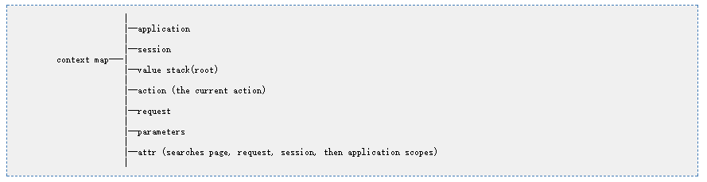

[TOC]

# Struts2

## 第一章 struts2入门

### 1.1 Struts2简介

struts2在MVC三层架构中位置：

#### 1.1.1 Struts2的优点

1. Struts2是非侵入式设计。Struts2的Action类为POJO类，不依赖于Servlet API和Struts API。
2. Struts2提供了拦截器，利用拦截器可以进行AOP编程。
3. Struts2提供了类型转换器，可以将特殊的请求参数转换成需要的类型。
4. Struts2的输入验证可以对指定方法进行验证。
5. 提供了全局范围、包范围和Action范围的国际化资源文件管理实现。
6. Struts2提供支持多种表现层技术，如JSP、freeMarker、Velocity等。

#### 1.1.2 开发环境的搭建

*使用版本struts-2.5.13。*

使用Jar包：

- asm-5.2：字节码增强，生成代理
- asm-commons-5.2：字节码增强，生成代理
- asm-tree-5.2：字节码增强，生成代理
- javassist-3.20.0-GA：字节码增强，生成代理
- commons-fileupload-1.3.3：文件上传组件
- commons-io-2.5：文件上传组件依赖的IO
- commons-lang3-3.6：对java.lang的扩展
- freemarker-2.3.23：Struts2的UI标签模板
- log4j-api-2.9.1：log4j2日志支持
- log4j-core-2.9.1：log4j2日志支持
- ognl-3.1.15：对象图导航语言
- struts2-core-2.5.13：Struts2核心包

在web.xml配置Struts2的启动项：

    <filter>
        <filter-name>struts2</filter-name>
        <filter-class>org.apache.struts2.dispatcher.filter.StrutsPrepareAndExecuteFilter</filter-class>
    </filter>
    <filter-mapping>
        <filter-name>struts2</filter-name>
        <url-pattern>/*</url-pattern>
    </filter-mapping>

定义struts2配置文件：

    <?xml version="1.0" encoding="UTF-8"?>
       <!DOCTYPE struts PUBLIC
        "-//Apache Software Foundation//DTD Struts Configuration 2.5//EN"
        "http://struts.apache.org/dtds/struts-2.5.dtd">

    <struts>

    </struts>

#### 1.1.3 简单的程序实现

*源代码在Struts2-01-primary下。*

Action类：

    package tavish.bit.actions;

    public class LoginAction {

        private String name;
        private int age;
        public String getName() {
            return name;
        }
        public void setName(String name) {
            this.name = name;
        }
        public int getAge() {
            return age;
        }
        public void setAge(int age) {
            this.age = age;
        }
        
        public String execute() {
            
            return "success";
        }
    }

Jsp：

index.jsp

    <%@ page language="java" contentType="text/html; charset=utf-8" pageEncoding="utf-8"%>
    <!DOCTYPE html>
    <html>
    <head>
    <meta charset="utf-8">
    <title>Index Form</title>
    </head>
    <body>
        <form action="test/login.action" method="post">
            <label>姓名：<input type="text" name="name"></label> 
            <label>年龄：<input type="text" name="age"></label> 
            <input type="submit" value="submit"> 
        </form>
    </body>
    </html>

welcome.jsp

    <%@ page language="java" contentType="text/html; charset=utf-8" pageEncoding="utf-8"%>
    <!DOCTYPE html>
    <html>
    <head>
    <meta charset="utf-8">
    <title>Welcome</title>
    </head>
    <body>
        姓名：${name}
         
        年龄：${age}
    </body>
    </html>

struts.xml

    <package name="xxx" namespace="/test" extends="struts-default">
        <action name="login" class="tavish.bit.actions.LoginAction">
            <result name="success">/welcome.jsp</result>
        </action>
    </package>

### 1.2 Struts2工作流程

#### 1.2.1 Struts2开发流程

1. 编写页面
2. 定义Action类
3. 注册Action类
4. 编写结果页面

#### 1.2.2 Struts2执行流程

**Struts2的过滤器应该处在web项目过滤器的底端。**

### 1.3 绝对路径与相对路径

*源代码在Struts2-02-path下。*

在上述项目中，我们的namespace属性值为/test，具有斜杆；而index.jsp的form表单的action属性值却没有斜杠：

    <form action="test/login.action" method="post">
        <label>姓名：<input type="text" name="name"></label> 
        <label>年龄：<input type="text" name="age"></label> 
        <input type="submit" value="submit"> 
    </form>

如果我们在给action的test属性加上斜杠，再次提交这个表单就会发生404错误。

#### 1.3.1 访问路径与资源名称

通常的URL资源路径由两部分构成：访问路径与资源名称。

- 资源名称：指的是要访问资源的直接名称，如login.jsp，或与要访问资源的资源存在映射关系简介名称，如login.action。
- 访问路径：是通过该路径可以找到指定的资源，即在URL资源访问路径中除了资源名称以外的部分。

在URL访问路径中，最后一部分为资源名称，而其他部分则为访问路径。

    http://localhost:8080/test/login.action

- 资源名称：login.action
- 访问路径：http://localhost:8080/test/

根据“访问路径是否可以独立完成资源准确定位”的判别标准，可以将访问路径分为绝对路径与相对路径。

#### 1.3.2 绝对路径

绝对路径，指无法改变的路径，根据给出的路径可以准确定位的路径。

计算机中的绝对路径又分为本地绝对路径与网络绝对路径。**但无论哪种绝对路径，都是指带有访问协议的路径。**

- 本地绝对路径：带有盼复的路径。例如d:\foo\bar\images\flower.png就是一个绝对路径。但实际上这个路径省略了file协议，全路径应为：file:///d:\foo\bar\images\flower.png
- 网络绝对路径：http://localhost:8080/test/index.jsp 就是一个绝对路径，带有http访问协议。

#### 1.3.3 相对路径

相对路径，是指根据参照路径的不同，给出路径的实际路径可以发生改变的路径。

在Web应用中，相对路径的写法有两种：一种是以斜杠（\）开头的相对路径，一种是不以斜杠开头的相对路径。**根据相对路径是否以斜杠开头，且出现的位置不同，其默认的参照路径又是不同的。**

##### 1.3.3.1 以斜杠开头的相对路径

以斜杠开头的相对路径，根据路径所在文件的不同，又分为两种：前台路径与后台路径。

（A）前台相对路径

所谓前台相对路径是指，由浏览器解析执行的代码中所包含的路径。例如HTML、CSS、js中的路径，以及JSP中静态部分的路径。例如：

    
    
    <form action=""></form>
    background:img("")
    window.location.href=""

上述这些都属于前台路径。

**前台相对路径的参照路径是Web服务器的根路径，即http://localhost:8080/**

（B）后台相对路径

所谓后台相对路径是指，由服务器解析执行的代码即文件中所包含的路径。例如，Java代码中的路径、JSP文件动态部分中的路径、XML文件中的路径（XML文件被Java代码加载并解析）等。

**后台相对路径的参照路径是Web应用的的路径，即http://localhost:8080/Struts2-01-primary/**

##### 1.3.3.2 不以斜杠开头的相对路径

**
不以斜杠开头的相对路径，不论是前台路径还是分后台路径，其参照路径均为当前资源的访问路径，而*不是当前资源的保存路径。*
**

#### 1.3.4 相关现象解析

（1）404问题

struts.xml：

    <package name="xxx" namespace="/test" extends="struts-default">
        <action name="login" class="tavish.bit.actions.LoginAction">
            <result name="success">/welcome.jsp</result>
        </action>
    </package>

这里的/test是**后台相对路径**，其参照路径为http://localhost:8080/Struts2-01-primary/

所以此时定义的要访问该action的绝对路径为：http://localhost:8080/Struts2-01-primary/test/login.action

加了斜杠后的JSP表单：

    <form action="/test/login.action" method="post">
        <label>姓名：<input type="text" name="name"></label> 
        <label>年龄：<input type="text" name="age"></label> 
        <input type="submit" value="submit"> 
    </form>

这里的action中表示的为**前台相对路径**，其参照路径为：http://localhost:8080/
所以此时该action表示的绝对路径为：http://localhost:8080/test/login.action
这个路径与xml中表示的路径不匹配，所以发生404错误。

不带有斜杠的JSP表单：

    <form action="test/login.action" method="post">
        <label>姓名：<input type="text" name="name"></label> 
        <label>年龄：<input type="text" name="age"></label> 
        <input type="submit" value="submit"> 
    </form>

此时不区分前台路径与后台路径，参照路径变为当前资源的访问路径。

当前访问这个JSP的URL为：http://localhost:8080/Struts2-01-primary/index.jsp
所以其参照路径是：http://localhost:8080/Struts2-01-primary/
则此时action属性所表示的绝对路径为：http://localhost:8080/Struts2-01-primary/test/login.action 。这个路径与xml中表示的路径匹配，所以可以访问。

在form表单使用/test/login.action的前提下解决404错误，使用EL表达式写绝对路径：

    <form action="${pageContext.request.contextPath}/test/login.action" method="post">
        <label>姓名：<input type="text" name="name"></label> 
        <label>年龄：<input type="text" name="age"></label> 
        <input type="submit" value="submit"> 
    </form>

（2）跳转回index页面后地址栏的路径问题

修改struts.xml，使提交表单经由Action处理后再次返回到index页面：

    <package name="xxx" namespace="/test" extends="struts-default">
        <action name="login" class="tavish.bit.actions.LoginAction">
            <result name="success">/index.jsp</result>
        </action>
    </package>

JSP表单为不带有斜杠表单：

    <form action="test/login.action" method="post">
        <label>姓名：<input type="text" name="name"></label> 
        <label>年龄：<input type="text" name="age"></label> 
        <input type="submit" value="submit"> 
    </form>

此时点击提交按钮后，页面确实回到了index页面，然而地址栏却多了一个test。在多次提交表单后浏览器地址栏路径变为：

    http://localhost:8080/Struts2-02-path/test/test/test/test/test/test/test/login.action

原因分析：

由于form表单的action属性值为无斜杠的相对路径，所以其参照路径为当前的访问路径。在第一次提交表单时，“当前访问路径”为：http://localhost:8080/Struts2-02-path/ ，所以相对于它的访问路径即为：http://localhost:8080/Struts2-02-path/test/login.action 
在此访问路径下再次提交表单，此时的“当前访问路径”已经发生了变化，变为：http://localhost:8080/Struts2-02-path/test/ 。所以再提交表单相对于它的访问路径就变为了：http://localhost:8080/Struts2-02-path/test/test/login.action 
所以导致地址栏每提交一次就会多出一个test。

解决办法：

1. 使用EL表达式${pageContext.request.contextPath}/test/login.action
2. 使用JSP的base标签，页面中的base标签会在当前页面的资源请求路径前自动加上该标签所代表的路径，将相对路径变为绝对路径。**这种方式要求页面中的请求不能以斜杠开头。**

方法二示例：

    <%@ page language="java" contentType="text/html; charset=utf-8" pageEncoding="utf-8"%>
    <%
        String path = request.getContextPath();
        String basePath = request.getScheme() + "://" + request.getServerName() + ":" + request.getServerPort()
                + path + "/";
    %>
    <!DOCTYPE html>
    <html>
    <head>
    <!-- 解决地址栏路径问题 -->
    <base href="<%= basePath %>">
    <meta charset="utf-8">
    <title>Index Form</title>
    </head>
    <body>
        <!-- 提交表单后返回index页面，发生地址栏路径问题 -->       
        <form action="test/login.action" method="post">
            <label>姓名：<input type="text" name="name"></label> 
            <label>年龄：<input type="text" name="age"></label> 
            <input type="submit" value="submit"> 
        </form>
    </body>
    </html>

### 1.4 成员变量与属性

*源代码在Struts2-12-ValueStack-manipulate下。*

**成员变量不等于属性。**

属性的定义：getter或setter方法的方法名去掉get或set后，剩余部分首字母变为小写后的部分称为属性。

示例：

    public class Example {

        private String name; 
        
        public void setMyName(String name) {
            this.name = name;
        }

        public String getMyName() {
            return name;
        }
    }

- name：成员变量
- myName：属性

此时只能通过对属性myName的操作来修改或访问成员变量name。

当一个Action中出现is/set/getXxxx时，即意味着这个Action具有了属性xxx。

使用OGNL\EL表达式是通过属性对成员变量进行访问，而不是直接访问成员变量。

示例：

该Action类具有成员变量testString、testInt；具有属性test2String、test2Int。并在execute()方法中对成员变量进行赋值。

    public class TestAction {
        
        private String testString;
        
        private int testInt;

        public String getTest2String() {
            return testString;
        }

        public void setTest2String(String testString) {
            this.testString = testString;
        }

        public int getTest2Int() {
            return testInt;
        }

        public void setTest2Int(int testInt) {
            this.testInt = testInt;
        }
        
        public String execute() {
            testString = "BIT";
            testInt = 3;
            return "success";
        }
    }

JSP：

    <body>
        
------- OGNL -------

        testString =
        <s:property value="testString" />
         
        testInt =
        <s:property value="testInt" />
         
        test2String =
        <s:property value="test2String" />
         
        test2Int =
        <s:property value="test2Int" />
         
        
        
------- EL -------

        testString = ${testString}
         
        testInt = ${testInt}
         
        test2String = ${test2String}
         
        test2Int = ${test2Int}
         
    </body>

访问这个Action，输出：证明在页面中访问的是属性。

    ------- OGNL -------

    testString = 
    testInt = 
    test2String = BIT 
    test2Int = 3 
    ------- EL -------

    testString = 
    testInt = 
    test2String = BIT 
    test2Int = 3 

## 第二章 Struts2配置文件

*源代码在Struts2-03-configuration下。*

### 2.1 Struts2相关的六个配置文件

#### 2.1.1 struts-default.xml

Struts2的默认核心配置文件，其中主要定义了11种返回类型、35种拦截器、各种拦截器栈以及转换器等等。**是Struts2核心功能的体现。**

*位于struts2-core-2.5.13.jar下。*

示例：

返回类型：

默认的返回类型是请求转发。

拦截器：

默认的拦截器栈：

**默认拦截器栈是Struts2的每一个Action都要经过的，无需单独声明。**

#### 2.1.2 default.properties

**定义了Struts2种用到的常量默认值。**

*位于struts2-core-2.5.13.jar下的org/apache/struts2中。*

示例：（#为被注释项）

    # struts.locale=en_US
    struts.i18n.encoding=UTF-8 // 国际化使用编码
    # struts.objectFactory = spring
    struts.objectFactory.spring.autoWire = name // 与Spring联合使用时的默认域属性注入方式
    struts.multipart.maxSize=2097152 // 上传文件的最大大小
    struts.action.extension=action,, // 默认可以使用.action扩展名或不使用扩展名
    struts.enable.DynamicMethodInvocation = false // 动态方法调用默认关闭
    struts.devMode = false // 开发模式默认关闭
    ...

#### 2.1.3 struts-plugin.xml

Struts2与第三方插件的整合配置文件。

位于struts2-xxx-plugin-2.5.13中。

#### 2.1.4 struts.xml

**Struts2核心配置文件。**是程序员主要进行配置的位置，位于classpath下。

#### 2.1.5 struts.properties

**用于修改常量的值。**由于常量值也可以在struts.xml中进行设置，所以一般不适用该文件。
该文件由程序员手工创建，放在classpath下。

示例：

在classpath下添加struts.properties文件，并对扩展名进行修改：

    struts.action.extension=do

此时JSP表单action属性无扩展名：

    <form action="${pageContext.request.contextPath}/test/login" method="post">
        <label>姓名：<input type="text" name="name"></label> 
        <label>年龄：<input type="text" name="age"></label> 
        <input type="submit" value="submit"> 
    </form>

此时提交会发生404错误，因为当前只能用.do来提交表单。

当然也可以这样定义（不建议）：

    struts.action.extension=php,asp,html,htm

#### 2.1.6 web.xml

可以用于设置常量、扩展Struts2等，但一般不这样使用，因为常量设置在struts.xml中均可设置。但如果在这些文件中具有不同的设置，web.xml具有最高优先级。

定义常量示例：

    <filter>
        <filter-name>struts2</filter-name>
        <filter-class>org.apache.struts2.dispatcher.filter.StrutsPrepareAndExecuteFilter</filter-class>
        <init-param>
            <param-name>struts.action.extension</param-name>
            <param-value>do</param-value>
        </init-param>
    </filter>
    <filter-mapping>
        <filter-name>struts2</filter-name>
        <url-pattern>/*</url-pattern>
    </filter-mapping>

此时定义了请求扩展名为do，这个设置会覆盖其他配置文件的相关设置。

### 2.2 Struts2核心配置文件

*源代码在Struts2-04-configuration-core下。*

Struts2的核心配置文件为struts.xml，一般放在src目录中。Struts2配置使用包来管理Action。包的作用与Java中包的作用相似，用于管理一组业务功能相关的Action。在实际应用中，应将一组业务功能相关的Action放在同一个包下。

#### 2.2.1 &lt;package/&gt;标签

**（1）name属性**

配置包时必须指定name属性，该属性值可以取任意名，但必须唯一。其与Java的类包间无对应关系。若其他包要继承该包，则必须通过该属性进行引用。

**（2）namespace属性**

包的namespace属性用于定义该包的命名空间。命名空间是访问该包下Action的路径的一部分。**如果配置该属性则必须以/开头。**

通常来说，name与namespace在实际使用时有如下关系：

    <package name="foo-bar" namespace="/foo/bar" extends="...">
        <action ...>
            <result ...>...</result>
        </action>
    </package>

namespace的正确写法：

    <package name="demo" namespace="/test" extends
    <package name="demo" namespace="/" extends="...">
    <package name="demo" namespace="/foo/bar" extends="...">
    <package name="demo" namespace="" extends="...">
    <package name="demo" extends="...">

namespace的错误写法：

    <package name="demo" namespace="foobar" extends="...">

**Action名称的搜索顺序**

**获得请求路径的URL，例如URL是：http://server/Struts2/path1/path2/path3/test.action**

1. 首先寻找namespace为/path1/path2/path3的package，如果不存在这个package则执行步骤2。如果存在这个pacage，则在这个package中寻找名字为test的action。当在该package下找不到名为test的action，则到默认namespace的package里寻找名为test的action。如果还找不到则提示页面找不到该action。
2. 寻找namespace为/path1/path2的package，如果不存在这个package，则执行步骤3。如果存在这个package，则在这个package中寻找名为test的action。当在该package下找不到名为test的action，则到默认namespace的package里寻找名为test的action。如果还找不到则提示页面找不到该action。
3. 寻找namespace为/path1的package，如果不存在这个package，则执行步骤4。如果存在这个package，则在这个package中寻找名为test的action。当在该package下找不到名为test的action，则到默认namespace的package里寻找名为test的action。如果还找不到则提示页面找不到该action。
4. 寻找namespace为/的package，如果存在这个package，则在这个package中寻找名为test的action。当在该package下找不到名为test的action，则到默认namespace的package里寻找名为test的action。如果还找不到则提示页面找不到该action。

**默认命名空间的package**：没有namespace属性，或namespace属性为空字符串。

    <package name="tavish" namespace="" extends="struts-default">
        ...
    <package>

namespace为空意味着：只要找到一个index.action，没有找到精确的对应的namespace，全部都交给namespace为空的这个package去处理，所以这个package囊括了其他所有package处理不了的action。

**（3）extends属性**

通常情况下，包需要继承struts-default包。因为Struts2的核心功能都定义在这个包中。继承了这个包也就拥有了这些功能。struts-default包定义在struts-default.xml。

**（4）abstract属性**

包可以通过abstra="true"定义为抽象包。抽象包中不能包含Action。抽象包一般就是用于被继承的。struts-default包即为抽象包。

#### 2.2.2 &lt;action/&gt;标签

**（1）name属性**

在Struts2中，访问Struts2中的action的URL路径由两部分组成：包的命名空间 + action的name属性值。

**（2）class属性**

class属性用于指定该Action所要执行的Action类。有三种写法：

1. 直接写要执行的类的全限定名。
2. 在SSH中，Action交由Spring管理，此时class属性要设置为一个伪类名，该伪类名与Spring配置文件中的相关设置对应。
3. class属性缺省。对于class属性缺省情况是指，若用户提交某个请求后，不需要经过某个Action处理，而是直接要转向某个视图页面。如简单的页面间的超链接，则可以采用这种形式。

class属性缺省示例：

页面超链接：

    <a href="${pageContext.request.contextPath}/foo/bar/toRegisterPage.action">注册</a>

定义Action：

    <action name="toRegisterPage">
        <result name="success">/register.jsp</result>
    </action>

此时，由于没有class属性，则默认执行ActionSupport类。因为在struts-default包中有如下定义：

    <default-class-ref class="com.opensymphony.xwork2.ActionSupport" />

ActionSupport有一个execute方法，其返回值为常量SUCCESS，即字符串"success"。

    public String execute() throws Exception {
        return SUCCESS;
    }

所以示例中的超链接会跳转到register.jsp页面。

**（3）method属性**

action标签有一个有一个属性method，该属性用于指定所要执行的Action类的哪个Action方法。若没有指定该属性值，则默认值为“execute”，即执行指定Action类的execute方法。

**如果修改了Action类中的Action方法名，而又不指定method属性值，提交请求则会报错。**

**我们可以在同一个Action类中定义多个Action方法，并在配置文件中指定多个action标签，这几个action标签的class属性相同，但name与method均不同。**

示例：

Action类：

    public String execute1() {
        System.out.println("执行execute1");
        return "success";
    }

    public String execute2() {
        System.out.println("执行execute2");
        return "success";
    }

配置文件：

    <action name="execute1" class="tavish.bit.actions.LoginAction" method="execute1">
        <result name="success">/welcome.jsp</result>
    </action>
    <action name="execute2" class="tavish.bit.actions.LoginAction" method="execute2">
        <result name="success">/welcome.jsp</result>
    </action>

表单：

    <form action="${pageContext.request.contextPath}/foo/bar/execute1.action" method="post">
        <label>姓名：<input type="text" name="name"></label> 
        <label>年龄：<input type="text" name="age"></label> 
        <input type="submit" value="submit"> 
    </form>
    <form action="${pageContext.request.contextPath}/foo/bar/execute2.action" method="post">
        <label>姓名：<input type="text" name="name"></label> 
        <label>年龄：<input type="text" name="age"></label> 
        <input type="submit" value="submit"> 
    </form>

当提交第一个表单时，控制台会输出“执行execute1”；提交第二个表单时，控制台会输出“执行execute2”。

**这说明action标签的定义粒度并非Action类，而是Action的method。即action标签定义的是“Action类 + method”。**

#### 2.2.3 &lt;result/&gt;标签

result标签用于指定Action执行完毕后所要转向的视图资源。

**（1）name属性**

其name属性用于指定该视图的名称，如果name属性缺省，默认值为字符串常量“success”。

示例：

    <action name="toRegisterPage">
        <result>/register.jsp</result>
    </action>

**（2）type属性**

*源代码在Struts2-05-...下。*

Struts2中提供了11种视图转向类型，类型由result标签的type属性指定，type属性的值在struts-default.xml中可以查到。默认值为dispatcher。

**对于请求转发的页面，可以是WEB-INF中的页面；而重定向的页面不能是WEB-INF中的页面。因为重定向相当于用户再次发出一个请求，而用户是不能直接访问WEB-INF中的资源的。**

**A) dispatcher**

请求转发到页面。

示例：

form表单：

    <form action="${pageContext.request.contextPath}/foo/bar/login.action" method="post">
        <label>姓名：<input type="text" name="name"></label> 
        <label>年龄：<input type="text" name="age"></label> 
        <input type="submit" value="submit"> 
    </form>

待转发的页面：

    <body>
        name = ${name} 
        age = ${age} 
        requestScopeName = ${requestScope.name} 
        requestScopeAge = ${requestScope.age} 
    </body>

配置文件：

    <package name="foo-bar" namespace="/foo/bar" extends="struts-default">
        <action name="login" class="tavish.bit.actions.LoginAction">
            <result type="dispatcher">/welcome.jsp</result>
        </action>
    </package>

Action类：

    package tavish.bit.actions;

    public class LoginAction {

        private String name;
        private int age;

        public String getName() {
            return name;
        }

        public void setName(String name) {
            this.name = name;
        }

        public int getAge() {
            return age;
        }

        public void setAge(int age) {
            this.age = age;
        }

        public String execute() {
            return "success";
        }
    }

填写数据提交表单，四个EL表达式均能正常输出，requestScope的两个属性可以正常输出是因为使用了请求转发；另外两个属性值的获取则是通过值栈获取的。

    name = tavish
    age = 23
    requestScopeName = tavish
    requestScopeAge = 23

**B) redirect**

重定向到页面。

使用redirect，修改配置文件：

    <package name="foo-bar" namespace="/foo/bar" extends="struts-default">
        <action name="login" class="tavish.bit.actions.LoginAction">
            <result type="redirect">/welcome.jsp</result>
        </action>
    </package>

其余不变。

*填写数据提交表单，此时跳转到新的页面，4个EL表达式均未获取到值。*

为请求添加参数：（XML中的${}为OGNL表达式，非EL表达式）

    <action name="login" class="tavish.bit.actions.LoginAction">
        <result type="redirect">
            <param name="location">/welcome.jsp</param>
            <param name="name">${name}</param>
            <param name="age">${age}</param>
        </result>
    </action>

同时修改welcome页面：

    <body>
        name = ${name} 
        age = ${age} 
        paramName = ${param.name} 
        paramAge = ${param.age} 
    </body>

填写表单，提交数据，得到结果：

    name = 
    age = 
    paramName = tavish
    paramAge = 23

**C) redirectAction**

重定向到Action。

定义一个Action，用于重定向：

    package tavish.bit.actions;

    public class SecondAction {

        private String uname;

        private int uage;

        public String getUname() {
            return uname;
        }

        public void setUname(String uname) {
            this.uname = uname;
        }

        public int getUage() {
            return uage;
        }

        public void setUage(int uage) {
            this.uage = uage;
        }

        public String execute() {
            return "success";
        }
    }

配置文件：actionName用于指示要重定向的action，不加扩展名。

    <action name="login" class="tavish.bit.actions.LoginAction">
        <result type="redirectAction">
            <param name="actionName">second</param>
            <param name="uname">${name}</param>
            <param name="uage">${age}</param>
        </result>
    </action>
    
    <action name="second" class="tavish.bit.actions.SecondAction">
        <result>/welcome.jsp</result>
    </action>

form表单：

    <form action="${pageContext.request.contextPath}/foo/bar/login.action" method="post">
        <label>姓名：<input type="text" name="name"></label> 
        <label>年龄：<input type="text" name="age"></label> 
        <input type="submit" value="submit"> 
    </form>

welcome.jsp：

    <body>
        name = ${uname} 
        age = ${uage} 
        requestScopeName = ${requestScope.uname} 
        requestScopeAge = ${requestScope.uage} 
    </body>

整体的请求流程为：表单将请求提交给login，login重定向到second，second通过请求转发到welcome页面。

提交表单，结果为：

    name = tavish
    age = 23
    requestScopeName = tavish
    requestScopeAge = 23

**D) chain**

请求转发到action。

定义一个Action，其中不定义成员变量及属性，只用于请求转发：

    package tavish.bit.actions;

    public class SecondAction {
        public String execute() {
            return "success";
        }
    }

配置文件：同样不要在名字后面加扩展名。

    <action name="login" class="tavish.bit.actions.LoginAction">
        <result type="chain">second</result>
    </action>
    
    <action name="second" class="tavish.bit.actions.SecondAction">
        <result>/welcome.jsp</result>
    </action>

form表单：

    <form action="${pageContext.request.contextPath}/foo/bar/login.action" method="post">
        <label>姓名：<input type="text" name="name"></label> 
        <label>年龄：<input type="text" name="age"></label> 
        <input type="submit" value="submit"> 
    </form>

welcome页面：

    <body>
        name = ${name} 
        age = ${age} 
        requestScopeName = ${requestScope.name} 
        requestScopeAge = ${requestScope.age} 
    </body>

整体的请求流程为：表单将请求提交给login，login转发到second，second再转发到welcome页面。

提交表单，结果为：

    name = tavish
    age = 23
    requestScopeName = tavish
    requestScopeAge = 23

#### 2.2.4 全局视图

*源代码在Struts2-06-...下。*

全局视图分为包范围全区视图和应用范围全局视图。

**（1）包范围全局视图**

若某试图页面可以被同一包中的多个action所公用，则应将其定义为包范围全局视图。包范围全局试图定义于包中，在包中是可见的。

示例：

定义Action：

    package tavish.bit.actions;

    public class SomeAction {

        private String name;
        private int age;

        public String getName() {
            return name;
        }

        public void setName(String name) {
            this.name = name;
        }

        public int getAge() {
            return age;
        }

        public void setAge(int age) {
            this.age = age;
        }

        public String doFirst() {
            if("aaa".equals(name)) {
                return "aResult";
            }
            if("bbb".equals(name)) {
                return "bResult";
            }
            return "success1";
        }
        
        public String doSecond() {
            if(age < 15) {
                return "aResult";
            }
            if(age > 40) {
                return "bResult";
            }
            return "success2";
        }
    }

配置文件：

        <action name="first" class="tavish.bit.actions.SomeAction" method="doFirst">
            <result name="aResult">/apage.jsp</result>
            <result name="bResult">/bpage.jsp</result>
            <result name="success1">/success1.jsp</result>
        </action>
        
        <action name="second" class="tavish.bit.actions.SomeAction" method="doSecond">
            <result name="aResult">/apage.jsp</result>
            <result name="bResult">/bpage.jsp</result>
            <result name="success2">/success2.jsp</result>
        </action>

这其中两个action有相同的result页面，可以将其定义为包范围全局视图。

修改为：

    <!-- 定义包范围全局视图 -->
    <global-results>
        <result name="aResult">/apage.jsp</result>
        <result name="bResult">/bpage.jsp</result>
    </global-results>
    
    <action name="first" class="tavish.bit.actions.SomeAction" method="doFirst">
        <result name="success1">/success1.jsp</result>
    </action>
    
    <action name="second" class="tavish.bit.actions.SomeAction" method="doSecond">
        <result name="success2">/success2.jsp</result>
    </action>

此时action在执行完毕后会现在自己的定义范围内找符合条件的result，如果没有就到全局视图中找。

**（2）应用范围全局视图**

若要使某个视图为所有包可用，即定义其为应用范围全局视图。可定义一个基本包，在基本包中定义全局视图。然后，让其它包都继承自该基本包即可，**当然，基本包要继承struts-default。**

通常情况下，定义全局视图的基本包不再定义其它Action，所以可以设置其为抽象。

示例：

Action类与上节相同，两个package内容相同。

配置文件：

    <!-- 定义基本包 -->
    <package name="base" extends="struts-default" abstract="true">
        <!-- 基本包中包含全局视图 -->
        <global-results>
            <result name="aResult">/apage.jsp</result>
            <result name="bResult">/bpage.jsp</result>
        </global-results>
    </package>
    
    <!-- 继承基本包即可使用其中的全局视图 -->
    <package name="foo-bar" namespace="/foo/bar" extends="base">
        <action name="first" class="tavish.bit.actions.SomeAction" method="doFirst">
            <result name="success1">/success1.jsp</result>
        </action>
        <action name="second" class="tavish.bit.actions.SomeAction" method="doSecond">
            <result name="success2">/success2.jsp</result>
        </action>
    </package>
    <package name="foo2-bar2" namespace="/foo2/bar2" extends="base">
        <action name="first" class="tavish.bit.actions.SomeAction" method="doFirst">
            <result name="success1">/success1.jsp</result>
        </action>
        <action name="second" class="tavish.bit.actions.SomeAction" method="doSecond">
            <result name="success2">/success2.jsp</result>
        </action>
    </package>

#### 2.2.5 为应用指定多个配置文件

*源代码在Struts2-07-multiConfig下。*

在大部分应用里，随着应用规模的增加，系统中Action数量也大量增加，导致struts.xml配置文件变得非常庞大、臃肿。为了避免这种情况的产生，提高struts.xml的可读性与可维护性，可以将一个struts.xml配置文件分解为多个配置文件，文件名任意，然后在struts.xml文件中包含其它配置文件。

**通常情况下，是按照功能模块来拆分struts.xml配置文件的。需要注意的是，要保证各个子配置文件中的各个包的name、namespace属性不能重复。**

使用include标签：

    <struts>
        <include file="struts-destop.xml"/>
        <include file="struts-workflow.xml"/>
    </struts>

*若各个子配置文件的命名结构相同，可以使用通配符。*

    <struts>
        <include file="struts-*.xml"/>
    </struts>    

示例：

struts-action.xml：

    <?xml version="1.0" encoding="UTF-8"?>
       <!DOCTYPE struts PUBLIC
        "-//Apache Software Foundation//DTD Struts Configuration 2.5//EN"
        "http://struts.apache.org/dtds/struts-2.5.dtd">

    <struts>
        <!-- 继承基本包即可使用其中的全局视图 -->
        <package name="foo-bar" namespace="/foo/bar" extends="base">
            <action name="first" class="tavish.bit.actions.SomeAction" method="doFirst">
                <result name="success1">/success1.jsp</result>
            </action>
            <action name="second" class="tavish.bit.actions.SomeAction" method="doSecond">
                <result name="success2">/success2.jsp</result>
            </action>
        </package>
        <package name="foo2-bar2" namespace="/foo2/bar2" extends="base">
            <action name="first" class="tavish.bit.actions.SomeAction" method="doFirst">
                <result name="success1">/success1.jsp</result>
            </action>
            <action name="second" class="tavish.bit.actions.SomeAction" method="doSecond">
                <result name="success2">/success2.jsp</result>
            </action>
        </package>
    </struts>

struts-base.xml：

    <?xml version="1.0" encoding="UTF-8"?>
       <!DOCTYPE struts PUBLIC
        "-//Apache Software Foundation//DTD Struts Configuration 2.5//EN"
        "http://struts.apache.org/dtds/struts-2.5.dtd">

    <struts>
        <!-- 定义基本包 -->
        <package name="base" extends="struts-default" abstract="true">
            <!-- 基本包中包含全局视图 -->
            <global-results>
                <result name="aResult">/apage.jsp</result>
                <result name="bResult">/bpage.jsp</result>
            </global-results>
        </package>
    </struts>

struts.xml：

    <?xml version="1.0" encoding="UTF-8"?>
       <!DOCTYPE struts PUBLIC
        "-//Apache Software Foundation//DTD Struts Configuration 2.5//EN"
        "http://struts.apache.org/dtds/struts-2.5.dtd">

    <struts>
        <include file="struts-*.xml" />
    </struts>

## 第三章 Struts2核心内容

### 3.1 获取ServletAPI

*源代码在Struts2-08-GetServletAPI-...下。*

为避免与ServletAPI耦合，Struts2对HttpServletRequest、HttpSession、ServletContext进行了封装，构造了三个**Map对象**来替代这三个对象。当然我们也可以获取到真正的这三个Servlet的API。

#### 3.1.1 通过ActionContext获取

*无法获取HttpResponse对象。*

在Struts2框架中，通过Action的执行上下文类ActionContext可以获取request/session/application的**域属性空间**（并非ServletAPI中的相关对象）。

    ActionContext ctx = ActionContext.getContext();
    Map<String, Object> application = ctx.getApplication();
    Map<String, Object> session = ctx.getSession();

对于向request范围中添加属性，直接向ActionContext对象中添加即可。

我们可以使用put方法（等同于ServletAPI中的setAttribute()方法）向这三种域空间存入值。

ActionContext类的部分源码：

存入ActionContext，可以在requestScope中获取到。

    private Map<String, Object> context;
    // ...
    public void put(String key, Object value) {
        context.put(key, value);
    }

存入Session域属性中，可以在sessionScope中获取到。

    public static final String SESSION = "com.opensymphony.xwork2.ActionContext.session";
    // ...
    public Object get(String key) {
        return context.get(key);
    }
    // ...
    public Map<String, Object> getSession() {
        return (Map<String, Object>) get(SESSION);
    }

存入Applcation域属性中，可以在applicationScope中获取到。

    public static final String APPLICATION = "com.opensymphony.xwork2.ActionContext.application";
    // ...
    public Object get(String key) {
        return context.get(key);
    }
    // ...
    public Map<String, Object> getSession() {
        return (Map<String, Object>) get(APPLICATION);
    }

**根据源码：ActionContext类的成员变量context（Map对象）不仅可以保存用于requestScope属性的键值对，同时也保存了用于sessionScope、applicationScope的Map对象引用，而这两个Map对象用来存放用于对应域属性的键值对。**

示例：

    package tavish.bit.actions;

    import com.opensymphony.xwork2.ActionContext;

    // 通过ActionContext获取ServletAPI
    public class GetServletAPIAction {
        
        public String execute() {
            
            // 设置request域属性
            ActionContext.getContext().put("req", "req_value");
            
            // 设置session域属性
            ActionContext.getContext().getSession().put("sess", "sess_value");
            
            // 设置application（ServletContext）域属性
            ActionContext.getContext().getApplication().put("app", "app_value");
            
            return "success";
        }
    }

配置文件：

    <package name="demo" namespace="/test" extends="struts-default">
        <action name="getServletAPI" class="tavish.bit.actions.GetServletAPIAction">
            <result>/result.jsp</result>
        </action>
    </package>

测试页面：

    <body>
        req = ${requestScope.req}  
        sess = ${sessionScope.sess}  
        app = ${applicationScope.app}  
    </body>

访问Action，得到结果：

    req = req_value 
    sess = sess_value 
    app = app_value 

#### 3.1.2 通过ServletActionContext获取

通过ActionContext获取的request、session、application均为Map对象，并非真正的ServletAPI。而**通过ServletActionContext，可以获取到Http请求中的ServletAPI对象。**

    HttpServletRequest request = ServletActionContext.getRequest();
    HttpServletResponse response = ServletActionContext.getResponse();
    HttpSession session = request.getSession();
    ServletContext ctx = ServletActionContext.getServletContext();

示例：

    package tavish.bit.actions;

    import javax.servlet.ServletContext;
    import javax.servlet.http.HttpServletRequest;
    import javax.servlet.http.HttpServletResponse;
    import javax.servlet.http.HttpSession;

    import org.apache.struts2.ServletActionContext;

    // 通过ServletActionContext获取ServletAPI
    public class GetServletAPIAction {
        
        public String execute() {
            
            // 获取HttpServletRequest
            HttpServletRequest request = ServletActionContext.getRequest();
            request.setAttribute("req", "req_value");
            
            // 获取HttpServletResponse
            @SuppressWarnings("unused")
            HttpServletResponse response = ServletActionContext.getResponse();
            
            // 获取HttpSession
            HttpSession session = request.getSession();
            session.setAttribute("sess", "sess_value");
            
            // 获取Application（ServletContext）
            ServletContext ctx = ServletActionContext.getServletContext();
            ctx.setAttribute("app", "app_value");
            
            return "success";
        }
    }

页面及配置文件不变，访问action，得到结果：

    req = req_value 
    sess = sess_value 
    app = app_value 

#### 3.1.2 通过实现特定接口获取

通过让Action实现特定的接口，也可以获取到request/session/application的**域属性空间**（并非ServletAPI中的相关对象）。

- RequestAware接口
- SessionAware接口
- ApplicationAware接口

这三个接口都只有一个set方法。

示例：

    package tavish.bit.actions;

    import java.util.Map;

    import org.apache.struts2.interceptor.ApplicationAware;
    import org.apache.struts2.interceptor.RequestAware;
    import org.apache.struts2.interceptor.SessionAware;

    // 通过实现特定接口来获取ServletAPI

    public class GetServletAPIAction implements RequestAware, SessionAware, ApplicationAware {

        // 定义成员变量用于接受set方法的设值
        private Map<String, Object> req;
        private Map<String, Object> sess;
        private Map<String, Object> app;

        @Override
        public void setRequest(Map<String, Object> request) {
            req = request;
        }

        @Override
        public void setSession(Map<String, Object> session) {
            sess = session;
        }

        @Override
        public void setApplication(Map<String, Object> application) {
            app = application;
        }

        public String execute() {
            req.put("req", "req_value");
            sess.put("sess", "sess_value");
            app.put("app", "app_value");
            return "success";
        }
    }

页面及配置文件不变，访问action，得到结果：

    req = req_value 
    sess = sess_value 
    app = app_value 

### 3.2 OGNL与值栈

#### 3.2.1 OGNL

*源代码在Struts2-09-ognl下。*

**（1）什么是OGNL**

OGNL是Object-Graph Navigation Language的缩写，它是一种功能强大的表达式语言。

OGNL本身是与Struts2没有任何关系的。但Struts2框架使用了OGNL用于进行表达式的计算工作。Struts2通过使用OGNL简单一致的表达式语法，可以存取对象的任意属性，调用对象的方法，遍历整个对象的结构图，实现字段类型转化等功能。

*Jar包：ognl-3.1.15.jar*

**（2）OGNL的特点**

相对于其它表达式语言，它提供了更加丰富的功能：

- 支持对象方法调用，如xxx.sayHello();
- 支持类静态方法调用和常量访问，格式：@全限定性类名@方法名|常量名
- 可以操作集合对象
- 可以直接创建对象

*使用静态方法需要在struts.xml中定义常量来开启静态方法访问。*

    <constant name="struts.ognl.allowStaticMethodAccess" value="true" />

Struts2框架使用了一个“标准命名上下文”来计算OGNL表达式。用于处理OGNL的最顶层对象是一个Map（通常被称为上下文Map或上下文）。在上下文Map中，OGNL有一个根对象的概念。在表达式中，根对象的引用不用使用任何“标记”，而引用其它对象则需要使用#标记。

Struts2框架将ActionContext设置为OGNL上下文对象，将值栈（ValueStack）设置为OGNL跟对象（值栈是一个包含多个对象的集合，对于OGNL来说，它是作为一个对象出现的）。和值栈一起，框架也防止了其它对象到ActionContext中，其中包含表现为application、session和request上下文的Map。这些对象将与值栈中的数据共存于ActionContext中。

>
The framework sets the OGNL context to be our ActionContext, and the value stack to be the OGNL root object. (The value stack is a set of several objects, but to OGNL it appears to be a single object.) Along with the value stack, the framework places other objects in the ActionContext, including Maps representing the application, session, and request contexts. These objects coexist in the ActionContext, alongside the value stack (our OGNL root).

*There are other objects in the context map. The diagram is for example only.*

>
The Action instance is always pushed onto the value stack. Because the Action is on the stack, and the stack is the OGNL root, references to Action properties can omit the # marker. But, to access other objects in the ActionContext, we must use the # notation so OGNL knows not to look in the root object, but for some other object in the ActionContext.

- OGNL上下文：ActionContext
- OGNL根对象：valueStack

OGNL中有一个上下文概念，即Context，用于存放数据。OGNL的上下文其实质就是一个Map，其中存放着很多的JavaBean对象。这些对象根据对其操作方式的不同分为两类：跟对象与非根对象。**对于非根对象，需要使用#来访问，而对于根对象，则可以直接访问。**无论是根对象还是非根对象，在Struts2中均是用于在应用中共享数据的。一般情况下，会在Action方法中存入数据，而在JSP页面中读取数据。

**OGNL表达式需要写在Struts2标签中。**

#### 3.2.1 值栈

*源代码在Struts2-10-ValueStack下。*

对于Struts2的值栈学习，主要是要搞清楚以下几个对象间的关系：

- 值栈与ActionContext的关系。
- 值栈与值栈的context属性的关系。
- 值栈的context属性与ActionContext的关系。

##### 3.2.1.1 值栈对象

用户提交一个Action请求后，系统会马上创建两个对象：Action实例与值栈对象。Struts2中的值栈ValueStack是个接口，其实现类为OgnlValueStack。

OgnlValueStack类中定义了两个十分重要的属性：

- CompoundRoot root：CompoundRoot本质上是ArrayList类型，但实际操作中当作栈来操作。
- Map<String, Object> context：值栈初始化会初始化root属性，root属性在初始化时会初始化context属性。

构造器：

    protected OgnlValueStack(XWorkConverter xworkConverter, CompoundRootAccessor accessor, TextProvider prov, boolean allowStaticAccess) {
        setRoot(xworkConverter, accessor, new CompoundRoot(), allowStaticAccess);
        push(prov);
    }

    protected OgnlValueStack(ValueStack vs, XWorkConverter xworkConverter, CompoundRootAccessor accessor, boolean allowStaticAccess) {
        setRoot(xworkConverter, accessor, new CompoundRoot(vs.getRoot()), allowStaticAccess);
    }

setRoot：

    protected void setRoot(XWorkConverter xworkConverter, CompoundRootAccessor accessor, CompoundRoot compoundRoot,
                           boolean allowStaticMethodAccess) {
        this.root = compoundRoot;
        this.securityMemberAccess = new SecurityMemberAccess(allowStaticMethodAccess);
        this.context = Ognl.createDefaultContext(this.root, accessor, new OgnlTypeConverterWrapper(xworkConverter), securityMemberAccess);
        context.put(VALUE_STACK, this);
        Ognl.setClassResolver(context, accessor);
        ((OgnlContext) context).setTraceEvaluations(false);
        ((OgnlContext) context).setKeepLastEvaluation(false);
    }

代码context.put(VALUE_STACK, this);表示context属性保存了当前的ValueStack对象。

*宏观上来讲root对象是值栈对象，微观上来讲root对象是值栈对象的root属性。*

##### 3.2.1.2 值栈的获取--方式一

当一个Action请求到来时，不仅会创建一个Action实例，还会创建一个ValueStack对象，用于存放当前Action运行过程中的相关数据。当该请求结束时，Action实例小时，用于记录其运行期间数据的值栈也就没有了意义。所以当请求结束时，同时需要将值栈对象销毁。**即值栈的声明周期与请求Request相同。**为了保证这一点，就将值栈对象通过setAttribute()方法，将其放入到了Request域属性中，并将该属性的key以常量的形式保存在ServletActionContext中。

值栈的实质是Request中的一个属性值，这个属性的名称为：struts.valueStack，保存在ServletActionContext的常量STRUTS_VALUESTACK_KEY中。

示例：

    // 通过request获取值栈
    public String execute() {
        
        HttpServletRequest request = ServletActionContext.getRequest();

        @SuppressWarnings("unused")
        ValueStack vStack = (ValueStack) request.getAttribute(ServletActionContext.STRUTS_VALUESTACK_KEY);
        
        return "success";
    }

##### 3.2.1.3 context属性

*源代码在Struts2-11-context下。*

在Struts2中，值栈的context属性作用很大，且在代码中需要经常访问。但从上节分析来看，要获取到context属性，首先要获取到值栈对象，而获取值栈对象很麻烦，这就导致了获取context属性更加麻烦。

**为了方便获取值栈的context属性，Struts2专门为其又起了个别名----ActionContext。**通过ActionContext.getContext().getContextMap()就可以直接获取到值栈的context属性。

示例：

    // 获取context属性
    public String execute2() {
        
        @SuppressWarnings({ "unused" })
        Map<String, Object> context = ActionContext.getContext().getContextMap();
        
        return "success";
    }

测试：由值栈获取到的context属性与ActionContext获取的Map是同一个Map。

    public String testContext() {
        // 通过ActionContext获取
        Map<String, Object> context1 = ActionContext.getContext().getContextMap();
        // 通过值栈获取
        Map<String, Object> context2 = ((ValueStack)ServletActionContext.getRequest().getAttribute(ServletActionContext.STRUTS_VALUESTACK_KEY)).getContext();
        System.out.println(context1 == context2);
        return "success";
    }

访问这个Action，控制台输出：true。

**存放在它们任意一个中的非根对象，在另一个中均可再次赋值将原值覆盖。**

如果只是为了向context中存入数据，则无需getContextMap()。直接在ActionContext的基础上调用put(String, Object)方法就可以，因为这个put方法会把存入动作委托给context的put(String, Object)方法。
**实际上ActionContext把绝大部分的set/get方法委托给了context属性的put/get方法。**

测试：通过两种方法存入属性，后者会覆盖前者。

    // 测试存入属性
    public String testPutAttr() {
        ActionContext.getContext().put("req", "req_value");
        ((ValueStack)ServletActionContext.getRequest().getAttribute(ServletActionContext.STRUTS_VALUESTACK_KEY)).getContext().put("req", "req_value_v2");
        return "success";
    }

访问这个Action，使用${req}取值，输出 req = req_value_v2。

##### 3.2.1.4 值栈的获取--方式二

由于ValueStack在创建并初始化root属性（setRoot()）时有如下代码：

    context.put(VALUE_STACK, this);

所以我们也可以通过context属性来获取ValueStack。

示例：

    // 通过context来获取值栈
    public String execute2() {
        @SuppressWarnings("unused")
        ValueStack vStack = ActionContext.getContext().getValueStack();
        return "success";
    }

上述代码等同于：

    ValueStack vStack = (ValueStack) ActionContext.getContext().getContextMap().get("ValueStack.VALUE_STACK");

##### 3.2.1.5 值栈的栈操作

查看OgnlValueStack类中的peek、pop、push方法可知，对值栈对象的栈操作，本质是对root栈对象的操作。即**从宏观上可以说值栈就是根对象，但其实根对象是指的值栈的root对象，而非根对象是值栈的context对象。**

    /**
     * @see com.opensymphony.xwork2.util.ValueStack#peek()
     */
    public Object peek() {
        return root.peek();
    }

    /**
     * @see com.opensymphony.xwork2.util.ValueStack#pop()
     */
    public Object pop() {
        return root.pop();
    }

    /**
     * @see com.opensymphony.xwork2.util.ValueStack#push(java.lang.Object)
     */
    public void push(Object o) {
        root.push(o);
    }

##### 3.2.1.6 总结归纳

用户提交一个Action请求后，系统会马上创建两个对象：Action实例和值栈对象。系统创建值栈对象时构造器调用了setRoot()方法。setRoot()方法创建了两个数据结构：root（当成栈操作的ArrayList）和context（Map）。

创建的这个栈，即root，就是值栈对象所拥有的真正的用于存放根对象的栈。为了方便对当前Action的访问，就将当前Action实例直接放入到了该栈中。

创建的这个Map，即context，在Struts2中是很重要的对象，需要经常访问。但若要直接通过值栈访问这个context比较麻烦。所以为了方便获取这个context Map，就给这个context定义了另一个名称 ---- ActionContext。

所以ActionContext这个Map最终存放着如下内容：

#### 3.2.3 值栈操作

*源代码在Struts2-12-ValueStack-manipulate下。*

这里的值栈指的是宏观上的值栈，即包含根对象root与非根对象context。对于值栈的操作包含两个方面：**向值栈中放入数据和从值栈中读取数据**。值栈中的数据可以通过Struts2标签显示：

    <s:property value="OGNL Expression" />

向值栈中放入数据分为两种：

- **显式放入：**显式获取到值栈对象，然后向其中放入数据。
- **隐式放入：**没有专门将数据直接放入值栈对象中的代码，却已经将数据放入。

Struts2中有一个标签&lt;s:debug/&gt;，开启后便于对数据的存放情况进行了解。其在页面显式为一个可展开/关闭的连接。

##### 3.2.3.1 向root中显式放入数据

向root中显式放入数据共有5种方式。

**（A）通过操作值栈来添加无名称对象**

值栈的peek、pop、push方法是委托给root来实现的，而root的本质是ArrayList，其特点是向其中添加的对象是无法指定名称的。

示例：

    
    public String execute1() {
        // （A）通过操作值栈来添加无名称对象
        Student student = new Student("Tavish", 23);

        ValueStack vStack = ActionContext.getContext().getValueStack();
        
        vStack.push(student);
        
        return "success";
    }

JSP:

    <body>
        <s:debug />
        
------- OGNL -------

        name =
        <s:property value="name" />
         
        age =
        <s:property value="age" />
         
    </body>

访问这个Action，输出：

    ------- OGNL -------

    name = Tavish 
    age = 23 

为什么我们没有指明是Student对象的name和age属性却也能访问到？

点击页面上的[Debug]连接，显示：

这里的Value Stack Contents就是root；Stack Context就是context。

虽然我们存入的是无名称对象，但是栈顶对象具有属性name、age，所以可以直接在OGNL中使用name、age进行访问。**OGNL会从栈顶向栈底进行查找，查看栈中的对象是否有指定的属性。查到第一个匹配项后就会输出并停止查找。**

如果我们再压入一个对象：

    Student student2 = new Student("Taco", 24);
    vStack.push(Student2);

此时访问这个action会输出：

    ------- OGNL -------

    name = Taco
    age = 24 

因为此时的栈顶对象为student2。

**（B）通过操作root来添加无名称对象**

示例：
 
    public String execute() {

        ValueStack vStack = ActionContext.getContext().getValueStack();
        
        // （A）通过操作值栈来添加无名称对象
        Student student1 = new Student("Tavish", 23);
        vStack.push(student1);
        
        // （B）通过操作root来添加无名称对象
        Student student2 = new Student("Taco", 24);
        vStack.getRoot().push(student2);
        
        return "success";
    }

**（C）添加Map对象**

将对象放入map中，再将map添加到root中。Map的特点是可指定向其中添加对象的名称。

    public String execute1() {
        
        ValueStack vStack = ActionContext.getContext().getValueStack();
        
        // （A）通过操作值栈来添加无名称对象
        Student student1 = new Student("Tavish", 23);
        vStack.push(student1);
        
        // （B）通过操作root来添加无名称对象
        Student student2 = new Student("Taco", 24);
        vStack.getRoot().push(student2);
        
        // （C）添加Map对象
        Student student3 = new Student("Tavish", 23);
        Map<String, Student> map = new HashMap<>();
        map.put("myStudent", student3);
        vStack.push(map);
        
        return "success";
    }

JSP：使用名称myStudent访问。

    <body>
        <s:debug />
        
------- OGNL -------

        name =
        <s:property value="name" />
         
        age =
        <s:property value="age" />
         
        myStudent.name =
        <s:property value="myStudent.name" />
         
        myStudent.age =
        <s:property value="myStudent.age" />
         
    </body>

访问action输出：

    [Debug]
    ------- OGNL -------

    name = Taco 
    age = 24 
    myStudent.name = Tavish 
    myStudent.age = 23 

点击Debug，查看栈内对象的情况：

栈顶元素是HashMap，但其中并没有myStudent属性和属性值。而是具有属性empty（由于Map对象具有isEmpty()方法），这个属性的属性值为null（这里的null意义同false相同），意味着这个Map对象是非空的。

**（D）直接添加有名对象**

OgnlValueStack值栈有一个方法set()，可向其中添加的对象指定名称，其底层也是采用map来实现的。

示例：

    public String execute() {
        
        ValueStack vStack = ActionContext.getContext().getValueStack();
        
        // （A）通过操作值栈来添加无名称对象
        Student student1 = new Student("Tavish", 23);
        vStack.push(student1);
        
        // （B）通过操作root来添加无名称对象
        Student student2 = new Student("Taco", 24);
        vStack.getRoot().push(student2);
        
        // （C）添加Map对象
        Student student3 = new Student("Tavish", 23);
        Map<String, Student> map = new HashMap<>();
        map.put("myStudent", student3);
        vStack.push(map);
        
        // （D）直接添加有名对象
        Student student4 = new Student("wangwu", 25);
        vStack.set("myStudent2", student4);
        
        return "success";
    }

JSP：使用myStudent2访问

    <body>
        <s:debug />
        
------- OGNL -------

        name =
        <s:property value="name" />
         
        age =
        <s:property value="age" />
         
        myStudent.name =
        <s:property value="myStudent.name" />
         
        myStudent.age =
        <s:property value="myStudent.age" />
         
        myStudent2.name =
        <s:property value="myStudent2.name" />
         
        myStudent2.age =
        <s:property value="myStudent2.age" />
         
    </body>

访问这个Aciton，输出：

    [Debug]
    ------- OGNL -------

    name = Taco 
    age = 24 
    myStudent.name = Tavish 
    myStudent.age = 23 
    myStudent2.name = wangwu 
    myStudent2.age = 25 

**（E）将root作为ArrayList来添加对象**

root的本质是ArrayList，所以可以调用其add()方法来添加数据。

示例：

    public String execute() {
        
        ValueStack vStack = ActionContext.getContext().getValueStack();
        
        // （A）通过操作值栈来添加无名称对象
        Student student1 = new Student("Tavish", 23);
        vStack.push(student1);
        
        // （B）通过操作root来添加无名称对象
        Student student2 = new Student("Taco", 24);
        vStack.getRoot().push(student2);
        
        // （C）添加Map对象
        Student student3 = new Student("Tavish", 23);
        Map<String, Student> map = new HashMap<>();
        map.put("myStudent", student3);
        vStack.push(map);
        
        // （D）直接添加有名对象
        Student student4 = new Student("wangwu", 25);
        vStack.set("myStudent2", student4);
        
        // （E）将root作为ArrayList来添加对象
        Student student5 = new Student("zhaoliu", 26);
        vStack.getRoot().add(student5);
        return "success";
    }

需要注意的是，通过add()方法添加的数据，是将root作为ArrayList来使用的，而ArrayList的add()方法会自动将数据加入到list的最后。所以**通过add()方法添加的数据会放入到root栈的栈底。**

访问Action，点击Debug，显示：

##### 3.2.3.2 向root中隐式放入数据

当Struts2接受到一个请求后，会马上创建一个Action，然后为该Action对象创建一个ActionContext对象，那么也就创建了值栈对象。

**值栈对象创建好后，首先会将创建好的Action对象直接放入到值栈的栈顶。于是JSP页面对于Action属性的访问是直接写上Action属性名称即可。注意是属性而非成员变量名。**

示例：

Action：

    package tavish.bit.actions;

    //向root中隐式放入数据
    public class RootImplicitAction {

        private String name;

        private int age;

        public String getName() {
            return name;
        }

        public void setName(String name) {
            this.name = name;
        }

        public int getAge() {
            return age;
        }

        public void setAge(int age) {
            this.age = age;
        }

        public String execute() {

            return "success";
        }
    }

JSP：

    <body>
        <s:debug />
        
------- OGNL -------

        name =
        <s:property value="name" />
         
        age =
        <s:property value="age" />
        
------- EL -------

        name = ${name}
         
        age = ${age}
         
    </body>

使用如下参数去访问Action：

    manipulate/rootImplicitAction?name=Tavish&age=23

结果：

    ------- OGNL -------

    name = Tavish 
    age = 23
    ------- EL -------

    name = Tavish 
    age = 23 

此时栈顶元素为RootImplicitAction：

**
EL表达式也是从值栈栈顶读取的数据，如果将Action中的成员变量及set/get方法注释（即Action只负责跳转），再使用上述的URL访问Action，则不会显示任何数据。栈顶的Action也没有任何属性。
**

##### 3.2.3.3 向context中显式放入数据

向context中放入数据，就是向map中放入数据。需要指定key。Struts2中已经定义好了一些key（application、session、request、attr），用于完成特殊功能，访问context中数据，即为非根数据，需要使用#。

**（A）向context中直接放入数据**

向context中直接放入数据，相当于再context中添加了用户自定义的key与value。

示例：

    public String execute() {
        
        // （A）向context中直接放入数据
        ActionContext.getContext().put("foo", "foo_value");
        
        return "success";
    }

此时相当于直接向ActionContext中写入数据，此时的key：foo与下面所列key是并列关系。

由于context本身是request范围，那么向context中直接添加数据，也即放入request范围中数据。此时JSP页面可通过系统定义好的名称为request的key来访问。

JSP:

    <body>
        <s:debug />
        
--------- OGNL ---------

        foo = <s:property value="#foo"/>  
        foo = <s:property value="#request.foo"/>  
        
--------- EL ---------
 
        foo = ${foo}  
        foo = ${requestScope.foo}  
    </body>

访问这个Action，输出：

    [Debug]
    --------- OGNL ---------

    foo = foo_value 
    foo = foo_value 
    --------- EL ---------

    foo = foo_value 
    foo = foo_value 

点击Debug，会发现ContextExplicitAction此时位于值栈栈顶；Stack Context的key中出现foo，其对应的值为foo_value (class java.lang.String)。

**（B）向context的session中放入数据**

向context的session放入数据，即将对象放到session范围。

    ActionContext.getContext().getSession.put("...", "...");

示例：

    public String execute() {
        
        // （A）向context中直接放入数据
        ActionContext.getContext().put("foo", "foo_value");
        
        // （B）向context的session放入数据
        ActionContext.getContext().getSession().put("foo_sess", "foo_sess_value");
        return "success";
    }

JSP：

    <body>
        <s:debug />
        
--------- OGNL ---------

        foo = <s:property value="#foo"/>  
        foo = <s:property value="#request.foo"/>  
        foo_session = <s:property value="#session.foo_sess"/>  
        
--------- EL ---------
 
        foo = ${foo}  
        foo = ${requestScope.foo}  
        foo_session = ${sessionScope.foo_sess}  
    </body>

访问Action，输出：

    [Debug]
    --------- OGNL ---------

    foo = foo_value 
    foo = foo_value 
    foo_session = foo_sess_value 
    --------- EL ---------

    foo = foo_value 
    foo = foo_value 
    foo_session = foo_sess_value 

**（C）向context的application中放入数据**

向context的application中放入数据，即将对象放入到appliaciton范围。

    public String execute() {
        
        // （A）向context中直接放入数据
        ActionContext.getContext().put("foo", "foo_value");
        
        // （B）向context的session放入数据
        ActionContext.getContext().getSession().put("foo_sess", "foo_sess_value");
        
        // （C）向context的application放入数据
        ActionContext.getContext().getApplication().put("foo_app", "foo_app_value");
        return "success";
    }

JSP：

    <body>
        <s:debug />
        
--------- OGNL ---------

        foo = <s:property value="#foo"/>  
        foo = <s:property value="#request.foo"/>  
        foo_session = <s:property value="#session.foo_sess"/>  
        foo_app = <s:property value="#application.foo_app"/>  
        
--------- EL ---------
 
        foo = ${foo}  
        foo = ${requestScope.foo}  
        foo_session = ${sessionScope.foo_sess}  
        foo_app = ${applicationScope.foo_app}  
    </body>

访问Action，输出：

    [Debug]
    --------- OGNL ---------

    foo = foo_value 
    foo = foo_value 
    foo_session = foo_sess_value 
    foo_app = foo_app_value 
    --------- EL ---------

    foo = foo_value 
    foo = foo_value 
    foo_session = foo_sess_value 
    foo_app = foo_app_value 

**（D）JSP页面通过称为attr的key读取数据**

JSP页面通过名称为attr的key读取数据，系统会依次从page、request、session、application范围来查找指定key 的数据。若没有找到，则为其赋值为null。（这相当于不指定Scope的EL表达式，例如：${foo}，此时会依次在pageScope、requestScope、sessionScope、applicationScope中查找。）

示例：

    public String execute() {
        
        // （A）向context中直接放入数据
        ActionContext.getContext().put("foo", "foo_value");
        
        // （B）向context的session放入数据
        ActionContext.getContext().getSession().put("foo_sess", "foo_sess_value");
        
        // （C）向context的application放入数据
        ActionContext.getContext().getApplication().put("foo_app", "foo_app_value");
        
        // （D）向context的application放入数据并使用attr读取
        ActionContext.getContext().getApplication().put("foo_app_attr", "foo_app_attr_value");
        
        return "success";
    }

JSP：

    <body>
        <s:debug />
        
--------- OGNL ---------

        foo = <s:property value="#foo"/>  
        foo = <s:property value="#request.foo"/>  
        foo_session = <s:property value="#session.foo_sess"/>  
        foo_app = <s:property value="#application.foo_app"/>  
        foo_app_attr = <s:property value="#attr.foo_app_attr"/>  
        
        
--------- EL ---------
 
        foo = ${foo}  
        foo = ${requestScope.foo}  
        foo_session = ${sessionScope.foo_sess}  
        foo_app = ${applicationScope.foo_app}  
        foo_app_attr = ${foo_app_attr}  
    </body>

访问Action，输出：

    [Debug]
    --------- OGNL ---------

    foo = foo_value 
    foo = foo_value 
    foo_session = foo_sess_value 
    foo_app = foo_app_value 
    foo_app_attr = foo_app_attr_value 
    --------- EL ---------

    foo = foo_value 
    foo = foo_value 
    foo_session = foo_sess_value 
    foo_app = foo_app_value 
    foo_app_attr = foo_app_attr_value 

##### 3.2.3.4 向context中隐式放入数据

有两种数据是在用户不知情的情况下自动放入context的。

**（A）请求参数**

在提交Action请求时所携带的参数，会自动存放到context的parameters属性中。

**
需要注意的是，提交Action请求时所携带的参数，如果Action中具有接受该参数的属性，那么参数会写到context的parameters中，而属性则会写入到root中。
**

示例：

    package tavish.bit.actions;

    public class ContextImplicitAction {
        
        // 定义成员变量uname、uage
        private String uname;
        private int uage;
        
        // 设置属性name、age
        public String getName() {
            return uname;
        }
        public void setName(String name) {
            this.uname = name;
        }
        public int getAge() {
            return uage;
        }
        public void setAge(int age) {
            this.uage = age;
        }
        
        public String execute() {
            
            return "success";
        }
    }

JSP：

    <body>
        <s:debug />
        
------- OGNL -------

        
----------------- 从root中读取数据 -----------------

        uname = <s:property value="name"/>  
        uage = <s:property value="age"/>  
        
----------------- 从context中读取数据 -----------------

        name = <s:property value="#parameters.name"/>  
        age = <s:property value="#parameters.age"/>  
        
------- EL -------

        
----------------- 从root中读取数据 -----------------

        uname = ${name}  
        uname = ${age}  
        
----------------- 从context中读取数据 -----------------

        name = ${param.name}  
        age = ${param.age}  
    </body>

使用url：/manipulate/contextImplicitAction?name=Tavish&age=23访问Action，输出：

    [Debug]
    ------- OGNL -------

    ----------------- 从root中读取数据 -----------------

    uname = Tavish 
    uage = 23 
    ----------------- 从context中读取数据 -----------------

    name = Tavish 
    age = 23 
    ------- EL -------

    ----------------- 从root中读取数据 -----------------

    uname = Tavish 
    uname = 23 
    ----------------- 从context中读取数据 -----------------

    name = Tavish 
    age = 23 

此时ValueStack（root）中具有属性：

context的parameters中具有键值对：

Action重定向时提交的参数，若重定向到Action，并且Action中有属性用于接收该参数，则是放入到root中的；若重定向到的Action中无属性接收该参数，或直接重定向到页面，则是将参数放入到context中key为parameters的map中。

**（B）Action对象**

当Action示例创建好后，不仅会自动将该Action的属性放入到root的栈顶，而且会将Action实例本身也放入到context的action属性中。

所以也可以这样访问，JSP：

    name = <s:property value="#action.name"/>  
    age = <s:property value="#action.age"/>  

##### 3.2.3.5 数据的加载顺序

*源代码在Struts2-12-ValueStack-loadOrder下。*

**（A）root中数据的加载顺序**

当在Action中仅仅向context放入某数据foo后，页面无论是通过#从context中读取数据还是不使用#直接从root中读取数据，均可得到放入的值。

示例：

    public String rootOrder() {
        ActionContext.getContext().put("foo", "foo_value");
        return "success";
    }

JSP：

    <s:debug/>
    
------- 从root中读取数据 -------

    foo_root = <s:property value="foo"/>  
    
------- 从context中读取数据 -------

    foo_context = <s:property value="#foo"/>  

访问Action，输出：
    
    [Debug]

    ------- 从root中读取数据 -------

    foo_root = foo_value 
    ------- 从context中读取数据 -------

    foo_context = foo_value 

**
这是因为当使用&lt;s:property/&gt;读取root中的数据时，会调用值栈的findValue方法，先从root中加载数据，若不存在该数据，则会从context中加载，而不会直接设值为null。
**

**（B）#request中数据的加载顺序**

当在Action中向context与root中分别为某数据bar赋予不同的值时，页面从root与context中可获取其相应的值。但若从#request中获取bar的值，会发现其获取的值与root中的值相同。

示例：

    public String requestOrder() {
        // 存入context
        ActionContext.getContext().put("bar", "bar_context_value");
        // 存入root
        ActionContext.getContext().getValueStack().set("bar", "bar_root_value");
        return "success";
    }

JSP：

    <body>
        <s:debug/>
        
------- 从root中读取数据 -------

        bar_root = <s:property value="bar"/>  
        
------- 从context中读取数据 -------

        bar_context = <s:property value="#bar"/>  
        
------- 从request中读取数据 -------

        bar_request = <s:property value="#request.bar"/>  
    </body>

访问Action，输出：

    [Debug]
    ------- 从root中读取数据 -------

    bar_root = bar_root_value 
    ------- 从context中读取数据 -------

    bar_context = bar_context_value 
    ------- 从request中读取数据 -------

    bar_request = bar_root_value 

此时从request中取值与从root中取值相同。同时点击Debug，在request中找不到key为bar的键值对。因为我们根本没有向request中写入数据。

**这是因为Struts2对HttpServletRequest进行了包装，增强了其功能。**

在JSP页面输出其隐式对象request，会发现其类型为：org.apache.struts2.dispatcher.StrutsRequestWrapper，这个类继承了ServletRequestWrapper并实现了HttpServletRequest接口。

对于使用&lt;s:property/&gt;从request中读取数据，其底层调用了StrutsRequestWrapper的getAttribute()方法。这个方法的查找顺序为：若request范围的属性值不为null，则直接取该值；若为null，则调用值栈的findValue方法，即先从root查找，若找到，则取root中的值；若root中也没有找到，则再从context中查找。

**这也就是说：前面提到的ActionContext.getContext()所获取的为request范围，并不准确，或者说并不正确。之所以会出现这种现象，是因为request中没有该key对应的值，而root中也没有该key所对应的值，所以最后使用了context中该key所对应的值。也就是说如果只向context中赋值，那么root和request也可以取到这个值。**

对context、root与request写入数据进行区分：

    public String realRequest() {
        
        // 向context中写入数据（之前认为这也是向request中写入数据）
        ActionContext.getContext().put("foobar", "foobar_context_value");
        // 向root中写入数据
        ActionContext.getContext().getValueStack().set("foobar", "foobar_root_value");
        // 向request中写入数据
        ServletActionContext.getRequest().setAttribute("foobar", "foobar_req_value");
        return "success";
    }

JSP：

    <body>
        <%=request %>  
        <s:debug/>
        
------- 从root中读取数据 -------

        foobar_root = <s:property value="foobar"/>  
        
------- 从context中读取数据 -------

        foobar_context = <s:property value="#foobar"/>  
        
------- 从request中读取数据 -------

        foobar_request = <s:property value="#request.foobar"/>  
    </body>

访问Action，输出：

    org.apache.struts2.dispatcher.StrutsRequestWrapper@1bbeeb78 

    [Debug]
    ------- 从root中读取数据 -------

    foobar_root = foobar_root_value 
    ------- 从context中读取数据 -------

    foobar_context = foobar_context_value 
    ------- 从request中读取数据 -------

    foobar_request = foobar_req_value 

此时点击Debug，会在request找到key为foobar键值对。

#### 3.2.4 OGNL对集合的操作

*源代码在Struts2-13-ognlCollection下。*

Struts2中使用OGNL对于集合的操作只要涉及以下几种情况：

1. 创建List与Map集合
2. 遍历List与Map集合
3. 集合元素的判断
4. 集合投影
5. 集合过滤

##### 3.2.4.1 创建和遍历List

OGNL表达式中使用如下形式可以创建List集合：List集合的创建：{元素1, 元素2, ...}

借助Struts2标签&lt;s:set/&gt;可以创建一个有名称的List对象：

    <s:set var="myList" value="{'zs', 'ls', 'ww'}" />

遍历List集合：

    <s:iterator value="#myList">
        <s:property />
    </s:iterator>

访问页面显示：

    zs ls ww

*iterator标签默认会将当前迭代对象放入到值栈栈顶，而property标签会默认输出值栈栈顶元素。*

##### 3.2.4.2 创建和遍历Map

OGNL表达式中使用如下形式可以创建Map集合：#{'key1':'value1','key2':'value2',...}

借助Struts2标签&lt;s:set/&gt;可以创建一个有名称的Map对象：

    <s:set var="myMap" value="#{'mobile':'1234567','QQ':'7654321'}" />

遍历Map集合：

    <s:iterator value="#myMap">
        <s:property />
    </s:iterator>

访问页面显示：

    mobile=1234567 QQ=7654321

##### 3.2.4.3 集合元素的判断

对于集合类型，可以使用双目运算符 in 和 not in 组成表达式，来判断指定元素是否为指定集合的元素。其两个运算数为OGNL表达式：

    e1 in c1 
    e1 not in c2

其中，in用来判断e1是否在集合对象c1种；not in判断e2是否不在集合对象c2中。其结果为boolean类型。

示例：

     ------------------ in/not in ------------------ 
    <s:property value="'zs' in #myList"/>  
    <s:property value="'zs' not in #myList"/>  

输出：

    ------------------ in/not in ------------------
    true 
    false 

##### 3.2.4.4 集合投影

集合投影指的是对于集合中的所有数据，只选择集合的某个属性值作为一个新的集合。

示例：

首先需要一个实体类：

    package tavish.bit.beans;

    public class Student {
        private String name;
        private int age;

        public String getName() {
            return name;
        }

        public void setName(String name) {
            this.name = name;
        }

        public int getAge() {
            return age;
        }

        public void setAge(int age) {
            this.age = age;
        }

        @Override
        public String toString() {
            return "Student [name=" + name + ", age=" + age + "]";
        }
    }

在页面上创建bean：

    <s:bean name="tavish.bit.beans.Student" var="student1">
        <s:param name="name" value="'张三'" />
        <s:param name="age" value="23" />
    </s:bean>
    <s:bean name="tavish.bit.beans.Student" var="student2">
        <s:param name="name" value="'李四'" />
        <s:param name="age" value="24" />
    </s:bean>
    <s:bean name="tavish.bit.beans.Student" var="student3">
        <s:param name="name" value="'王五'" />
        <s:param name="age" value="25" />
    </s:bean>

输出bean：

    <s:property value="#student1"/>  
    <s:property value="#student2"/>  
    <s:property value="#student3"/>  

将三个Student对象组成一个List：

    <s:set var="students" value="{#student1, #student2, #student3}" />

将上述三个Student对象的name属性值再组成一个List，并进行遍历：

    <s:set var="studentsNames" value="#students.{name}" />
    <s:iterator value="#studentsNames">
        <s:property />
    </s:iterator>

访问网页输出：

    张三 李四 王五

##### 3.2.4.5 集合查询

集合查询也称为集合过滤，指对于集合中的所有数据，进行条件筛选，形成的结果集。集合查询需要使用关键字this，表示当前检索的对象。

对于结果集的选择，可以使用以下三个符号：

- ?：结果集的所有内容
- ^：结果集的第一条内容
- $：结果集的最后一条内容

示例：

     ------ 集合查询1：查询上述Student中年龄大于23的所有人 ------ 
    <s:iterator value="#students.{?#this.age > 23}">
        <s:property/>  
    </s:iterator>
     ------ 集合查询2：查询上述Student中年龄大于23的第一条记录 ------ 
    <s:iterator value="#students.{^#this.age > 23}">
        <s:property/>  
    </s:iterator>
     ------ 集合查询3：查询上述Student中年龄大于23的最后一条记录 ------ 
    <s:iterator value="#students.{$#this.age > 23}">
        <s:property/>  
    </s:iterator>

访问网页，输出：

    ------ 集合查询1：查询上述Student中年龄大于23的所有人 ------
    Student [name=李四, age=24] 
    Student [name=王五, age=25] 

    ------ 集合查询2：查询上述Student中年龄大于23的第一条记录 ------
    Student [name=李四, age=24] 

    ------ 集合查询3：查询上述Student中年龄大于23的最后一条记录 ------
    Student [name=王五, age=25] 

### 3.3 动态调用方法

*源代码在Struts2-14-dynamicMethodInvocation下。*

若Action中存在多个方法，但在配置文件中注册该Action时并未为每个方法制定一个action标签，而是只为这一个Action类注册了一个action标签。那么当用户访问该action时到底执行哪个方法，则是由用户发出的请求动态决定。
这种情况成为动态调用方法，其有两种实现。

#### 3.3.1 动态方法调用

动态方法调用是指，在地址栏提交请求时，直接在URL后加上“!方法名”，使用这种方式制定要执行的方法。

**动态方法调用默认是关闭的，**需要手动开启。

    <constant name="struts.enable.DynamicMethodInvocation" value="true" />

同时需要在动态访问的action所在的package中加入：

    <global-allowed-methods>regex:.*</global-allowed-methods>

示例：

定义Action：

    public class SomeAction {
        public String doFirst() {
            System.out.println("doFirst Run");
            return "success";
        }
        
        public String doSecond() {
            System.out.println("doSecond Run");
            return "success";
        }
    }

配置文件：

    <constant name="struts.enable.DynamicMethodInvocation" value="true" />
    <package name="dynamicMethodInvocation" namespace="/dmi" extends="struts-default">
        <global-allowed-methods>regex:.*</global-allowed-methods>
        <action name="some" class="tavish.bit.actions.SomeAction">
            <result name="success">/success.jsp</result>
        </action>
    </package>

index：

    <body>
        Nothing here, but index.
         
        <a href="${pageContext.request.contextPath}/dmi/some!doFirst.action">动态方法调用doFirst</a>
         
        <a href="${pageContext.request.contextPath}/dmi/some!doSecond.action">动态方法调用doSecond</a>
         
    </body>

#### 3.3.2 使用通配符

使用通配符是指在配置文件中定义action时，其name中包含通配符“*”。请求URL中提交的action的具体值将作为通配符的真实值。而action中的占位符将接受这个真实值。占位符一般出现在method属性中。

同样需要在动态访问的action所在的package中加入：

    <global-allowed-methods>regex:.*</global-allowed-methods>

但无需开启struts.enable.DynamicMethodInvocation常量。

示例：

action：

    package tavish.bit.actions;

    public class OtherAction {
        public String doFirst() {
            System.out.println("wildcard doFirst Run");
            return "success";
        }
        
        public String doSecond() {
            System.out.println("wildcard doSecond Run");
            return "success";
        }
    }

配置文件：

*下划线不是必须的，只是为了进行分隔。*

    <package name="wildcard" namespace="/dmi-wildcard" extends="struts-default">
        <global-allowed-methods>regex:.*</global-allowed-methods>
        <action name="other_*" class="tavish.bit.actions.OtherAction" method="{1}">
            <result name="success">/success.jsp</result>
        </action>
    </package>

index：

    <body>
        Nothing here, but index.
         
        <a href="${pageContext.request.contextPath}/dmi/some!doFirst.action">动态方法调用doFirst</a>
         
        <a href="${pageContext.request.contextPath}/dmi/some!doSecond.action">动态方法调用doSecond</a>
         
        <a href="${pageContext.request.contextPath}/dmi-wildcard/other_doFirst.action">通配符调用doFirst</a>
         
        <a href="${pageContext.request.contextPath}/dmi-wildcard/other_doSecond.action">通配符调用doSecond</a>
         
    </body>

### 3.4 接受请求参数

#### 3.4.1 属性驱动方式

*源代码在Struts2-15-GetParams-byProperties下。*

属性驱动方式是指服务器端接收来自客户端的离散数据的方式。用户提交的数据，Action原封不动的进行逐个接受。**该接收方式要求，在Action类中定义与请求参数同名的属性，即要定义该属性的set方法。这样就能使Action自动将请求参数的值赋予同名属性。**

*实际开发中很少用这种。*

示例：

表单：

    <form action="${pageContext.request.contextPath}/getparams/some.action" method="post">
        <label>name:<input type="text" name="name"></label>
        <label>age:<input type="text" name="age"></label>
        <input type="submit" value="submit">
    </form>

action：

    package tavish.bit.actions;

    public class SomeAction {
        private String name;
        private int age;
        public String getName() {
            System.out.println("getName");
            return name;
        }
        public void setName(String name) {
            System.out.println("setName");
            this.name = name;
        }
        public int getAge() {
            System.out.println("getAge");
            return age;
        }
        public void setAge(int age) {
            System.out.println("setAge");
            this.age = age;
        }
        
        public String execute() {
            return "success";
        }
    }

result页面：

    <body>

    name = ${name}  
    age = ${age}  

    </body>

配置文件略。

提交表单，控制台输出：

    setAge
    setName
    getName
    getAge

#### 3.4.2 域驱动方式

*源代码在Struts2-15-GetParams-byField。*

域驱动方式是指，服务器端以封装好的对象方式接收来自客户端的数据方式。将用户提交的多个数据以封装对象的方式进行整体接受。**该方式要求，表单提交时，参数以对象属性的方式提交。而Action中要将同名的对象定义为属性。这样请求将会以封装好的对象数据形式提交给Action。**

示例：

bean类：

    package tavish.bit.beans;

    public class Student {

        private String name;
        private int age;

        public String getName() {
            System.out.println("getName name = " + name);
            return name;
        }

        public void setName(String name) {
            System.out.println("setName name = " + name);
            this.name = name;
        }

        public int getAge() {
            System.out.println("getAge age = " + age);
            return age;
        }

        public void setAge(int age) {
            System.out.println("setAge age = " + age);
            this.age = age;
        }

        @Override
        public String toString() {
            return "Student [name=" + name + ", age=" + age + "]";
        }
    }

action:

    package tavish.bit.actions;

    import tavish.bit.beans.Student;

    public class SomeAction {
        
        private Student student;

        public Student getStudent() {
            System.out.println("getStudent student = " + student);
            return student;
        }

        public void setStudent(Student student) {
            System.out.println("setStudent student = " + student);
            this.student = student;
        }
        
        public String execute() {
            return "success";
        }
    }

表单：

    <form action="${pageContext.request.contextPath}/getparams/some.action" method="post">
        <label>name:<input type="text" name="student.name"></label>
        <label>age:<input type="text" name="student.age"></label>
        <input type="submit" value="submit">
    </form>

result：

    <body>
        <s:debug />
         
        name = ${student.name}
         
        age = ${student.age}
         
    </body>

提交表单，控制台输出：

    getStudent student = null
    setStudent student = Student [name=null, age=0]
    setAge age = 23
    getStudent student = Student [name=null, age=23]
    setName name = tavish
    getStudent student = Student [name=tavish, age=23]
    getStudent student = Student [name=tavish, age=23]
    getName name = tavish
    getStudent student = Student [name=tavish, age=23]
    getAge age = 23

点击debug，此时发现student属性位于值栈栈顶。

分析输出：

1. 表单参数传递到Action后，系统会通过get方法获取一个student对象来接受表单的参数。所以先执行getStudent方法，但由于此时没有student对象，所以输出为null。
2. 由于获取不到student对象，系统就自动创建了一个，并通过set方法赋值，所以执行setStudent方法，此时该student的name、age属性未初始化。
3. 对于字符串和整型变量，系统先对整型变量进行复制，所以执行setAge方法。
4. 再次执行getStudent方法获取student对象，此时获取到一个age已赋值，但name未赋值的student对象。
5. 执行setName方法对name属性进行赋值。
6. 由于页面上使用的struts2的debug标签，所以又执行了一次getStudent方法，用以在值栈中显示。
7. 对于页面上的两个EL表达式，每次都要获取student对象，然后再调用对应的get方法获取属性，所以有两组getStudent、getXxx。

#### 3.4.3 ModelDriven方式

ModelDriven接受请求参数运行背后使用了Struts2的核心功能ValueStack。Struts2的默认拦截器栈中存在一个拦截器ModelDrivenInterceptor。当一个请求经过该拦截器时，在这个拦截器中，首先会判断当前要调用的Action对象是否实现了ModelDriven接口。如果实现了这个接口，则调用getModel()方法，并把返回值压入ValueStack栈顶。

    <interceptor name="modelDriven" class="com.opensymphony.xwork2.interceptor.ModelDrivenInterceptor"/>

源码：

    @Override
    public String intercept(ActionInvocation invocation) throws Exception {
        Object action = invocation.getAction();

        if (action instanceof ModelDriven) {
            ModelDriven modelDriven = (ModelDriven) action;
            ValueStack stack = invocation.getStack();
            Object model = modelDriven.getModel();
            if (model !=  null) {
                stack.push(model);
            }
            if (refreshModelBeforeResult) {
                invocation.addPreResultListener(new RefreshModelBeforeResult(modelDriven, model));
            }
        }
        return invocation.invoke();
    }

*常用此方式获取参数。*

示例：

bean类：

    package tavish.bit.beans;

    public class Student {

        private String name;
        private int age;

        public String getName() {
            return name;
        }

        public void setName(String name) {
            this.name = name;
        }

        public int getAge() {
            return age;
        }

        public void setAge(int age) {
            this.age = age;
        }

        @Override
        public String toString() {
            return "Student [name=" + name + ", age=" + age + "]";
        }
    }

action：

    package tavish.bit.actions;

    import com.opensymphony.xwork2.ModelDriven;

    import tavish.bit.beans.Student;

    public class SomeAction implements ModelDriven<Student>{
        
        private Student student;

        public String execute() {
            return "success";
        }

        @Override
        public Student getModel() {
            
            if (student == null) {
                student = new Student();
            }
            return student;
        }
    }

表单：

    <form action="${pageContext.request.contextPath}/getparams/some.action" method="post">
        <label>name:<input type="text" name="name"></label>
        <label>age:<input type="text" name="age"></label>
        <input type="submit" value="submit">
    </form>

result：

    <body>
        <s:debug />
         
        name = <s:property value="name"/>
         
        age = <s:property value="age"/>
         
        model = <s:property value="model"/>
         
    </body>

提交表单，输出：

    [Debug] 
    name = tavish 
    age = 23 
    Student [name=tavish, age=23]

点击debug，此时Student对象位于栈顶。

#### 3.4.4 集合数据接受

*域驱动的一种特殊形式。*

*源代碼在Struts2-15-GetParams-byCollection下。*

所谓集合数据接受是指以集合对象方式接受数据。此情况与域驱动接受数据原理相同。

示例：

bean类：

    package tavish.bit.beans;

    public class Student {

        private String name;
        private int age;

        public String getName() {
            System.out.println("getName name = " + name);
            return name;
        }

        public void setName(String name) {
            System.out.println("setName name = " + name);
            this.name = name;
        }

        public int getAge() {
            System.out.println("getAge age = " + age);
            return age;
        }

        public void setAge(int age) {
            System.out.println("setAge age = " + age);
            this.age = age;
        }

        @Override
        public String toString() {
            return "Student [name=" + name + ", age=" + age + "]";
        }
    }

Action：

集合使用List，不能使用数组。

    package tavish.bit.actions;

    import java.util.List;

    import tavish.bit.beans.Student;

    public class SomeAction {

        private List<Student> students;

        public List<Student> getStudents() {
            return students;
        }

        public void setStudents(List<Student> students) {
            this.students = students;
        }

        public String execute() {
            return "success";
        }
    }

表单：

    <form action="${pageContext.request.contextPath}/getparams/some.action" method="post">
        <label>name1:<input type="text" name="students[0].name"></label>
        <label>age1:<input type="text" name="students[0].age"></label>
        <label>name2:<input type="text" name="students[1].name"></label>
        <label>age2:<input type="text" name="students[1].age"></label>
        <input type="submit" value="submit">
    </form>

result：

    <body>
        <s:debug />
         
        name1 = <s:property value="students[0].name"/>
         
        age1 = <s:property value="students[0].age"/>
         
        name2 = <s:property value="students[1].name"/>
         
        age2 = <s:property value="students[1].age"/>
         
    </body>

### 3.5 类型转换

#### 3.5.1 默认类型转换器

*源代码在Struts2-16-TypeConvertor-default下。*

Struts2默认情况下可以将表单中输入的文本数据转换为相应的基本数据类型。这个功能的实现，主要是由于Struts2内置了类型转换器。这些转换器在struts-default中看到其定义。

常见的类型，基本均可由String转换为相应类型：

- int和Integer
- long和Long
- float和Float
- double和Double
- char和Character
- boolean和Boolean
- Date：可以接受yyyy-MM-dd或yyyy-MM-dd HH:mm:ss格式字符串，并转换为Date类型。
- 数组：可以将多个同名参数存放到数组
- 集合：可以将数据保存到List、Map

示例：

Action：使用Date类型接收日期，使用int类型接收年龄

    package tavish.bit.actions;

    import java.util.Date;

    public class SomeAction {

        private Date birthday;
        private int age;

        public Date getBirthday() {
            return birthday;
        }

        public void setBirthday(Date birthday) {
            this.birthday = birthday;
        }

        public int getAge() {
            return age;
        }

        public void setAge(int age) {
            this.age = age;
        }
        
        public String execute() {
            return "success";
        }
    }

表单：

    <form action="${pageContext.request.contextPath}/getparams/some.action" method="post">
        <label>birthday:<input type="text" name="birthday"></label> 
        <label>age:<input type="text" name="age"></label> 
        <input type="submit" value="submit">
    </form>

result：

    <s:debug/> 
    birthday_strutsTag = <s:date name="birthday"/>   
    birthday_EL = ${birthday}   
    age = <s:property value="age"/>   

提交表单，日期使用93-12-6，输出：

    [Debug] 
    birthday_strutsTag = 1993-12-6 0:00:00 
    birthday_EL = Mon Dec 06 00:00:00 CST 1993 
    age = 25 

#### 3.5.2 自定义类型转换器

*源代码在Struts2-16-TypeConvertor-custom下。*

在上述程序中，若输入非yyyy-MM-dd格式的日期，如输入yyyy/MM/dd格式，则在结果页面中struts2的date标签不能输出正确的日期：

示例：输入1994/02/27，提交表单。

    [Debug] 
    birthday_strutsTag = 
    birthday_EL = 1994/02/27 
    age = 24 

后台输出：

    birthday = null
    age = 24

##### 3.5.2.1 定义自定义类型转换器

若要使系统可以接收其它格式的日期类型，则需要自定义类型转换器。

自定义类型转换器需要继承DefaultTypeConverter类，并覆盖父类方法convertValue()，用以完成类型转换。

    /*
     * value：待转换的值
     * toType：要转换为的目标类型
     */
     @Override
     public Object convertValue(Object value, Class toType) {

        return super.convertValue(value, toType);
     }

**定义convertValue方法时需要注意，其类型一般是定义为双向的。**
就本例而言，浏览器表单请求提交到服务器action时，是由String到Date的转换。当类型转换成功但服务器端其它部分出问题后，需要返回原页面。此时用户填写过的数据应重新回显。回显是由服务器端向浏览器端的运行，需要将转换过的Date类型重新转换为String。

**注意第一个参数value，若转换方向为请求到action，则value实际上是字符串数组。因为请求中允许携带多个同名参数。例如checkbox类型的input。**

    <form ...>
        <input type="checkbox" name="hobby" value="fitness"> 健身
        <input type="checkbox" name="hobby" value="running"> 跑步
        <input type="checkbox" name="hobby" value="swimming"> 游泳
        ...
    </form>

此时这个同名参数就是数组。Struts2为了兼顾这种多个同名参数的情况，就将从请求到action方向转换的value制定为String[]，而非String。

另外，对于服务器端向浏览器端的转换，需要使用**Struts2标签定义的表单**才能演示出。
例如age元素填入非数字字符，birthday填写正确。

此外，需要向&lt;action/&gt;中添加input视图，Action类需要继承ActionSupport类。

之所以要继承ActionSupport类，是因为ActionSupport类实现了Action接口，而该接口中定义了INPUT字符串常量。**一旦发生类型转换异常TypeconversionException，系统将自动转向input视图。**

示例：

定义类型转换器：

    package tavish.bit.convertor;

    import java.util.Date;
    import java.text.ParseException;
    import java.text.SimpleDateFormat;

    import com.opensymphony.xwork2.conversion.impl.DefaultTypeConverter;

    public class MyDateConvertor extends DefaultTypeConverter {

        /*
         * value：待转换的值
         * toType：要转换为的目标类型
         * 页面---->服务端：String---->Date
         * 服务端---->页面：Date---->String
         */
        @SuppressWarnings("rawtypes")
        @Override
        public Object convertValue(Object value, Class toType) {
            
            SimpleDateFormat sdf = new SimpleDateFormat("yyyy/MM/dd");
            
            // 如果是页面到服务端的转换
            if (toType == Date.class) {
                String dateStr = ((String[])value)[0];
                try {
                    return sdf.parse(dateStr);
                } catch (ParseException e) {
                    e.printStackTrace();
                }
                // 如果是服务端到页面的转换
            } else if(toType == String.class) {
                Date date = (Date)value;
                return sdf.format(date);
            }
            
            return super.convertValue(value, toType);
        }
    }

##### 3.5.2.2 将转换器定义为局部类型转换器

局部类型转换器，仅仅对制定Action的指定属性起作用。**需在Action类所在的包下**放置名称为如下格式的属性文件：ActionClassName-conversion.properties。其中ActionClassName为Action的类名，**-conversion.properties是固定写法。**

示例：SomeAction-conversion.properties

    birthday=tavish.bit.convertor.MyDateConvertor

测试：

提交表单：

    2018/1/5
    0

显示：

    [Debug] 
    birthday_strutsTag = 2018-1-5 0:00:00 
    birthday_EL = Fri Jan 05 00:00:00 CST 2018 
    age = 0 

控制台输出：

    birthday = Fri Jan 05 00:00:00 CST 2018
    age = 0

*但是，此时无法再接收yyyy-MM-dd格式的日期。如果需要同时满足接收各种类型的日期格式，则需要重新定义该转换器。*

提交表单：

    2018-1-5
    0

显示：

    [Debug] 
    birthday_strutsTag = 
    birthday_EL = 
    age = 0 

底层显示：

    birthday = null
    age = 0

并发生异常：java.text.ParseException: Unparseable date: "2018-1-5"

##### 3.5.2.3 将转换器定义为全局类型转换器

全局类型转换器，会对所有Action的制定类型的属性生效。其注册方式为，在src目录下放置名称为xwork-conversion.properties的属性文件。文件内格式为：待转换类型=类型转换器的全类名。

示例：

    java.util.Date=tavish.bit.convertor.MyDateConvertor

##### 3.5.2.4 发生类型转换异常跳转回input视图

使Action继承ActionSupport类：

    package tavish.bit.actions;

    import java.util.Date;

    import com.opensymphony.xwork2.ActionSupport;

    public class SomeAction extends ActionSupport {

        private static final long serialVersionUID = -4119635083232137094L;
        private Date birthday;
        private int age;

        public Date getBirthday() {
            return birthday;
        }

        public void setBirthday(Date birthday) {
            this.birthday = birthday;
        }

        public int getAge() {
            return age;
        }

        public void setAge(int age) {
            this.age = age;
        }
        
        public String execute() {
            System.out.println("birthday = " + birthday);
            System.out.println("age = " + age);
            return "success";
        }
    } 

注册input：

    <package name="getParams" namespace="/getparams" extends="struts-default">
        <action name="some" class="tavish.bit.actions.SomeAction">
            <result name="success">/success.jsp</result>
            <result name="input">/index.jsp</result>
        </action>
    </package>

测试：

填写表单并提交：日期格式正确，年龄格式不正确

    2018/1/5
    0a

此时页面会直接返回到index.jsp，但没有回显。

**此时，是因为发生了类型转换异常TypeconversionException才导致跳转到input页面，如果发生的不是类型转换异常而是其他异常，则不会发生该跳转。**

示例：

填写表单并提交：日期格式不正确，年龄格式正确

    2018-1-5
    0

控制台报出异常：java.text.ParseException: Unparseable date: "2018-1-5"

由于这个异常不是类型转换异常，所以页面没有跳转会input视图。

##### 3.5.2.5 跳转input并回显

该功能需要使用struts2标签来构建表单来实现：

    
Struts2 表单

    <s:form action="getparams/some.action" method="post">
        <s:textfield name="birthday" label="birthday" />
        <s:textfield name="age" label="age" />
        <s:submit value="submit" />
    </s:form>

填写并提交表单：

    2018/1/5
    aa

此时页面会跳转回input视图同时发生回显，并在发生类型转换失败的表单上显示错误：

    Invalid field value for field "age".

##### 3.5.2.6 类型转换异常提示信息的修改

类型转换异常提示信息是系统定义好的内容，若直接显示到用户页面，会使页面显得不友好，所以需要修改。

步骤：

1. Action所在包中添加名称为ActionClassName.properties的属性文件，其中ActionClassName为Action类的类名。
2. 在该文件中写入内容：**invalid.fieldvalue.变量名=异常提示信息**。

测试：

定义属性文件，SomeAction.properties：

    invalid.fieldvalue.age=年龄必须为整数。

填写表单，并提交：

    2018/01/05
    23a

提交后页面返回input视图，并回显，同时显示：年龄必须为整数。

##### 3.5.2.7 接收多种日期格式的类型转换器

对于之前定义的MyDateConverter类型转换器，无论是局部还是全局的，其类型转换的日期格式只能是在转换器中定义的格式：yyyy/MM/dd。而不能是其他格式，原来的默认格式yyyy-MM-dd也不行。并且此时会发生异常java.text.ParseException，这个异常不是类型转换异常，即也不会发生回显。

下面重新定义日期类型转换器，使其可以接收多种格式，并使其在提交错误的日期格式时可以回显：

转换器：*该类中正则表达式并不严谨。*

    package tavish.bit.convertor;

    import java.text.ParseException;
    import java.text.SimpleDateFormat;
    import java.util.Date;
    import java.util.regex.Pattern;

    import com.opensymphony.xwork2.ActionContext;
    import com.opensymphony.xwork2.conversion.TypeConversionException;
    import com.opensymphony.xwork2.conversion.impl.DefaultTypeConverter;

    /*
     * 日期类型转换器，可接受的格式有：
     * 1. yyyy-MM-dd
     * 2. yyyy/MM/dd
     * 3. yyyyMMdd
     */
    public class FinalDateConvertor extends DefaultTypeConverter {

        private SimpleDateFormat simpleDateFormat;
        
        @SuppressWarnings("rawtypes")
        @Override
        public Object convertValue(Object value, Class toType) {

            if (toType == Date.class) {
                String dateStr = ((String[]) value)[0];
                // 如果这个方法调用没有抛出异常，即代表匹配成功，则return语句就没有机会发生异常。
                simpleDateFormat = getSimpleDateFormat(dateStr);
                ActionContext.getContext().getSession().put("sdf", simpleDateFormat);
                try {
                    return simpleDateFormat.parse(dateStr);
                } catch (ParseException e) {
                    e.printStackTrace();
                }
            } else if (toType == String.class) {
                simpleDateFormat = (SimpleDateFormat) ActionContext.getContext().getSession().get("sdf");
                return simpleDateFormat.format((Date) value);
            }

            return super.convertValue(value, toType);
        }
        
        private SimpleDateFormat getSimpleDateFormat(String dateStr) {

            String[] regexs = { "^\\d{4}-\\d{2}-\\d{2}$", "^\\d{4}/\\d{2}/\\d{2}$", "^\\d{4}\\d{2}\\d{2}$" };

            if (Pattern.matches(regexs[0], dateStr)) {
                simpleDateFormat = new SimpleDateFormat("yyyy-MM-dd");
            } else if (Pattern.matches(regexs[1], dateStr)) {
                simpleDateFormat = new SimpleDateFormat("yyyy/MM/dd");
            } else if (Pattern.matches(regexs[2], dateStr)) {
                simpleDateFormat = new SimpleDateFormat("yyyyMMdd");
            } else {
                // 当三种正则表达式均无法匹配时，抛出类型转换错误。此异常会导致回显的发生。
                throw new TypeConversionException();
            }

            return simpleDateFormat;
        }
    }

注册类型转换器：

    birthday=tavish.bit.convertor.FinalDateConvertor

此时以下的日期均可以接收了：

    2018-01-05
    2018/01/05
    20180105

### 3.6 数据验证

在Web应用中，为了防止客户端传来的数据引发程序异常，常常需要对数据进行验证。输入验证分为客户端验证与服务器端验证。客户端验证主要通过JS脚本进行，服务端验证主要通过Java代码进行。*数据验证在类型转换之后发生。*

**通常两个验证都需要进行。**

Struts2中的输入验证有两种实现方式：

1. 手工编写代码验证
2. 基于XML配置方式验证。

需求：

登陆表单中提供用户名与手机号两个输入。要求用户名与手机号不能为空，并且手机号要符合手机号码的格式：以1开头，后跟3、4、5、8，最后是9位数组。验证需要同时验证这两个输入。

#### 3.6.1 手工编写代码验证

在Struts2中，验证代码是在Action中完成的。由于数据使用者是Action方法，所以验证过程需要在Action方法执行前进行。

验证分为两类：

- 对Action中所有方法执行前的验证
- 对Action中指定方法执行前的验证

##### 3.6.1.1 对Action中所有方法执行前的验证

*源代码在Struts2-17-validation-manually-overall中。*

首先，**需要进行数据验证的Action需要继承ActionSupport，然后重写validate()方法。**这样Action中所有方法在执行之间，validate()均会被调用，以实现对数据的验证。

当某个数据验证失败时，Struts2会调用addFieldError()方法向系统的一个Map集合fieldErrors中添加验证失败信息。如果该集合中包含失败信息，Struts2会将请求转发到名为input的视图。在input视图可以使用Struts2标签fielderror显示失败信息。

完成需求：

Action：

    package tavish.bit.actions;

    import java.util.regex.Pattern;

    import com.opensymphony.xwork2.ActionSupport;

    public class LoginAction extends ActionSupport {

        private static final long serialVersionUID = -4765684799349095460L;
        private String name;
        private String mobile;

        public String getName() {
            return name;
        }

        public void setName(String name) {
            this.name = name;
        }

        public String getMobile() {
            return mobile;
        }

        public void setMobile(String mobile) {
            this.mobile = mobile;
        }

        public String execute1() {
            System.out.println("execute1");
            return "success";
        }

        public String execute2() {
            System.out.println("execute2");
            return "success";
        }

        @Override
        public void validate() {
            if (name == null || "".equals(name.trim())) {
                // 如果fieldErrors.size() > 0，则自动跳转到input视图。
                this.addFieldError("name", "用户名不能为空");
            }
            if (mobile == null || "".equals(mobile.trim())) {
                // 如果fieldErrors.size() > 0，则自动跳转到input视图。
                this.addFieldError("mobile", "手机号不能为空");
            } else if (!Pattern.matches("^1[34578]\\d{9}$", mobile)) {
                this.addFieldError("mobileFormat", "手机号格式不正确");
            }
        }
    }

此时，validate方法会对execute1和execute2均进行**执行前**验证。

表单：

    <s:fielderror />
     
    
execute1

    <form action="validate/login_execute1.action" method="post">
        <label>用户名：<input type="text" name="name"/></label> 
        <label>手机号：<input type="text" name="mobile"/></label> 
        <input type="submit" value="submit" />
    </form>
    
execute2

    <form action="validate/login_execute2.action" method="post">
        <label>用户名：<input type="text" name="name"/></label> 
        <label>手机号：<input type="text" name="mobile"/></label> 
        <input type="submit" value="submit" />
    </form>

##### 3.6.1.2 对Action中特定方法执行前的验证

*源代码在Struts2-17-validation-manually-specific中。*

对指定方法的验证是通过在Action中定义validateXxx()来实现的。validateXxx只会验证Action中方法名为xxx的方法。

当数据验证失败时，调用addFieldError()方法同样会向系统的fieldErrors集合中添加验证失败信息。

示例：

Action：只对execute2方法进行验证。

    package tavish.bit.actions;

    import java.util.regex.Pattern;

    import com.opensymphony.xwork2.ActionSupport;

    public class LoginAction extends ActionSupport {

        private static final long serialVersionUID = -4765684799349095460L;
        private String name;
        private String mobile;

        public String getName() {
            return name;
        }

        public void setName(String name) {
            this.name = name;
        }

        public String getMobile() {
            return mobile;
        }

        public void setMobile(String mobile) {
            this.mobile = mobile;
        }

        public String execute1() {
            System.out.println("execute1");
            return "success";
        }

        public String execute2() {
            System.out.println("execute2");
            return "success";
        }

        public void validateExecute2() {
            if (name == null || "".equals(name.trim())) {
                // 如果fieldErrors.size() > 0，则自动跳转到input视图。
                this.addFieldError("name", "用户名不能为空");
            }
            if (mobile == null || "".equals(mobile.trim())) {
                // 如果fieldErrors.size() > 0，则自动跳转到input视图。
                this.addFieldError("mobile", "手机号不能为空");
            } else if (!Pattern.matches("^1[34578]\\d{9}$", mobile)) {
                this.addFieldError("mobileFormat", "手机号格式不正确");
            }
        }
    }

#### 3.6.2 XML配置验证

使用XML配置方式实现输入数据的验证，**Action类仍需要继承自ActionSupport类。**验证仍然分为两类：对Action中所有方法执行前的验证；对Action中指定方法进行验证。

该XML使用的约束：xwork-validator-1.0.3.dtd

    <!DOCTYPE validators PUBLIC
        "-//Apache Struts//XWork Validator 1.0.3//EN"
        "http://struts.apache.org/dtds/xwork-validator-1.0.3.dtd">

Struts2定义的验证器：

##### 3.6.2.1 对Action中所有方法执行前的验证

*源代码在Struts2-17-validation-xml-overall下。*

在Action类所在包中放入一个XML配置文件，该文件的取名为ActionClassName-validation.xml。

示例：

Action：

    package tavish.bit.actions;

    import com.opensymphony.xwork2.ActionSupport;

    public class LoginAction extends ActionSupport {

        private static final long serialVersionUID = -4765684799349095460L;
        private String name;
        private String mobile;

        public String getName() {
            return name;
        }

        public void setName(String name) {
            this.name = name;
        }

        public String getMobile() {
            return mobile;
        }

        public void setMobile(String mobile) {
            this.mobile = mobile;
        }

        public String execute1() {
            System.out.println("execute1");
            return "success";
        }

        public String execute2() {
            System.out.println("execute2");
            return "success";
        }
    }

xml：LoginAction-validation.xml

    <?xml version="1.0" encoding="UTF-8"?>
    <!DOCTYPE validators PUBLIC
        "-//Apache Struts//XWork Validator 1.0.3//EN"
        "http://struts.apache.org/dtds/xwork-validator-1.0.3.dtd">

    <validators>
        <field name="name">
            <field-validator type="requiredstring">
                <!-- 默认为true，不用配置 -->
                <!-- <param name="trim">true</param> -->
                <message>用户名不能为空</message>
            </field-validator>
        </field>
        <field name="mobile">
            <field-validator type="requiredstring">
                <message>手机号不能为空</message>
            </field-validator>
            <field-validator type="regex">
                <param name="regex"><![CDATA[^1[34578]\d{4}$]]></param>
                <message>手机号格式不正确</message>
            </field-validator>
        </field>
    </validators>

此时这个xml可以完成Action中所有方法的执行前校验。

##### 3.6.2.2 对Action中特定方法执行前的验证

*源代码在Struts2-17-validation-xml-specific下。*

若要对指定方法进行验证，则需要按如下规则命名配置文件：ActionClassName-ActionName-validation.xml。其中ActionName指的是struts.xml中action标签的name属性值。

该配置文件也放在该Action所在包中。

示例：

Action：

    package tavish.bit.actions;

    import com.opensymphony.xwork2.ActionSupport;

    public class LoginAction extends ActionSupport {

        private static final long serialVersionUID = -4765684799349095460L;
        private String name;
        private String mobile;

        public String getName() {
            return name;
        }

        public void setName(String name) {
            this.name = name;
        }

        public String getMobile() {
            return mobile;
        }

        public void setMobile(String mobile) {
            this.mobile = mobile;
        }

        public String execute1() {
            System.out.println("execute1");
            return "success";
        }

        public String execute2() {
            System.out.println("execute2");
            return "success";
        }
    }

struts.xml：

    <package name="validate" namespace="/validate" extends="struts-default">
        <global-allowed-methods>regex:.*</global-allowed-methods>
        <action name="login_*" class="tavish.bit.actions.LoginAction" method="{1}">
            <result name="success">/success.jsp</result>
            <result name="input">/index.jsp</result>
        </action>
    </package>

校验器：LoginAction-login_execute1-validation.xml

    <?xml version="1.0" encoding="UTF-8"?>
    <!DOCTYPE validators PUBLIC
        "-//Apache Struts//XWork Validator 1.0.3//EN"
        "http://struts.apache.org/dtds/xwork-validator-1.0.3.dtd">

    <validators>
        <field name="name">
            <field-validator type="requiredstring">
                <!-- 默认为true，不用配置 -->
                <!-- <param name="trim">true</param> -->
                <message>用户名不能为空</message>
            </field-validator>
        </field>
        <field name="mobile">
            <field-validator type="requiredstring">
                <message>手机号不能为空</message>
            </field-validator>
            <field-validator type="regex">
                <param name="regexExpression"><![CDATA[^1[34578]\d{4}$]]></param>
                <message>手机号格式不正确</message>
            </field-validator>
        </field>
    </validators>

则此时只有execute1方法会被校验，execute2方法不会。

##### 3.6.2.3 常用验证器的用法

required：非空验证器

    <field-validator type="required">
        <message>xx不能为空</message>
    </field-validator>

requiredstring：非空字符串验证器

    <field-validator type="requiredstring">
        <param name="trim">true</param>
        <message>xxx不能为空</message>
    </field-validator>

fieldexpression：字段表达式关系判断

    <field-validator type="fieldexpression">
        <param name="expression">pwd==repwd</param>
        <message>确认密码与密码不一致</message>
    </field-validator>

stringlength：字符串长度验证器

    <field-validator type="stringlength">
        <param name="minLength">2</param>
        <param name="maxLength">10</param>
        <param name="trim">true</param>
        <message>名称应在${minLength}-${maxLength}之间</message>
    </field-validator>

int：整数范围校验器

    <field-validator type="int">
        <param name="min">1</param>
        <param name="max">150</param>
        <param name="trim">true</param>
        <message>年龄必须在${min}-${max}之间</message>
    </field-validator>

*int、long、short、double、与date校验器均继承自RangeValidatorSupport<T>类，是范围校验器，即不对数据类型进行校验，只对其有效范围进行校验。他们均有两个参数min和max。*

email：邮件地址校验器

    <field-validator type="email">
        <message>电子邮件地址无效</message>
    </field-validator>

regex：正则表达式校验器

    <field-validator type="regex">
        <param name="regexExpression"><![CDATA[]]></param>
        <message>xxx格式不正确</message>
    </field-validator>

#### 3.6.3 Action类的执行原理及顺序

当表单提交参数给Action类后，Action的执行顺序如下

**（1）类型转换**

首先执行类型转换，以Date类型转换为例。

类型转换失败是在Action调用相应属性的set方法之前发生的。类型转换失败将抛出TypeConversionException，且会自动跳转到input视图。

但对于系统定义好的DateConverter，当输入格式不是yyyy-MM-dd时，则会抛出解析异常，并返回null，即将日期类型属性的值赋为null。而发生解析异常是不会转向input视图的。

**（2）set方法**

当类型转换成功，将执行该属性的set方法，将接收到并转换过的值传递给Action相应的属性。

**（3）数据验证**

当验证器对通过set方法设置的属性值进行验证时，若验证失败，则会将验证失败信息写入到一个专门的Map集合（fieldErrors）中。当所有数据验证完毕后，若fieldErrors集合中存在异常信息，即fieldErrors集合不为null，且其size大于0，则拦截器workFlow会返回一个“input”字符串，使请求转发到input视图。此时请求将无法到达Action，也无法执行Action方法。

**（4）Action方法**

经过上面的执行，如果系统中的fieldErros集合存在异常信息，系统则将请求转发至input视图。如果系统中的fieldErrors没有任何异常信息，系统将执行Action方法。

### 3.7 拦截器

拦截器是Struts2的一个重要特性。因为Struts2的大多数核心功能都是通过拦截器实现的。拦截器可以在执行Action方法之前拦截请求，执行某些操作；或在Action方法执行之后拦截住用户发送的相应，执行某些操作。即拦截器在Action方法执行前后执行，以增强Action方法的功能。

Struts2内置了很多拦截其，每个拦截器完成相对独立的功能，多个拦截器的组合体称为拦截器栈，最终重要的拦截器栈为系统默认的拦截器栈DefaultStack。

#### 3.7.1 普通拦截器定义

通常情况下，自定义一个普通的拦截器需要实现拦截器接口interceptor或继承AbstractInterceptor类，并覆盖以下三个方法（如果选择继承则只需要实现第三个方法）：

- void init()：拦截器实例被创建之前被调用
- void destroy()：拦截器实例被销毁之前被调用
- String intercept(ActionInvocation invocation) throws Exception：拦截器的功能在该方法中实现。

intercept方法中需要调用invocation.invoke()。这是ActionInvocation中的方法，而ActionInvocation是Action调度者，所以这个方法具备以下2层含义： 

1. 如果拦截器堆栈中还有其他的Interceptor，那么invocation.invoke()将调用堆栈中下一个Interceptor的执行。 
2. 如果拦截器堆栈中只有Action了，那么invocation.invoke()将调用Action执行。 

我们可以发现，invocation.invoke()这个方法其实是整个拦截器框架的实现核心。基于这样的实现机制，我们还可以得到下面2个非常重要的推论： 

1. 如果在拦截器中，我们不使用invocation.invoke()来完成堆栈中下一个元素的调用，而是直接返回一个字符串作为执行结果，那么整个执行将被中止。 
2. 我们可以以invocation.invoke()为界，将拦截器中的代码分成2个部分，在invocation.invoke()之前的代码，将会在Action之前被依次执行，而在invocation.invoke()之后的代码，将会在Action之后被逆序执行。 

从上面的分析，我们知道，整个拦截器的核心部分是invocation.invoke()这个函数的调用位置。事实上，我们也正是根据这句代码的调用位置，来进行拦截类型的区分的。

在Struts2中，Interceptor的拦截类型，分成以下两类： 

1. before：before拦截，是指在拦截器中定义的代码，它们存在于invocation.invoke()代码执行之前。这些代码，将依照拦截器定义的顺序，顺序执行。 
2. after：after拦截，是指在拦截器中定义的代码，它们存在于invocation.invoke()代码执行之后。这些代码，将一招拦截器定义的顺序，逆序执行。 

Interceptor执行顺序：

Interceptor的执行顺序或许是我们在整个过程中最最关心的部分。根据上面所提到的概念，我们实际上已经能够大致明白了Interceptor的执行机理。我们来看看Struts2的Reference对Interceptor执行顺序的一个形象的例子。 

XML：

    <interceptor-stack name="xaStack">   
      <interceptor-ref name="thisWillRunFirstInterceptor"/>   
      <interceptor-ref name="thisWillRunNextInterceptor"/>   
      <interceptor-ref name="followedByThisInterceptor"/>   
      <interceptor-ref name="thisWillRunLastInterceptor"/>   
    </interceptor-stack>   

执行顺序如下：

1. before invocation.invoke()：
    - thisWillRunFirstInterceptor
    - thisWillRunNextInterceptor
    - followedByThisInterceptor
    - thisWillRunLastInterceptor
2. Action1- - ->（chain）- - ->Action2- - ->...- - ->result
3. after invocation.invoke()：
    - thisWillRunLastInterceptor
    - followedByThisInterceptor
    - thisWillRunNextInterceptor
    - thisWillRunFirstInterceptor

**即，每个拦截器中的代码的执行顺序，在Action之前，拦截器的执行顺序与堆栈中定义的一致；而在Action和Result之后，拦截器的执行顺序与堆栈中定义的顺序相反。**

#### 3.7.2 拦截器注册

拦截器类在定义好之后，需要在struts.xml中进行注册。

注册方式有以下几种，但无论哪一种，**都需要引入Struts的默认拦截器栈defaultStack。**否则会失去Struts2的核心功能。

**（1）拦截器方式注册**

在package中定义拦截器，之后在action中引用该拦截器。*注意需要引用默认拦截器栈。*

    <struts>
        <package name="interceptor" namespace="/interceptor" extends="struts-default">

            <interceptors>
                <interceptor name="permission" class="tavish.bit.interceptors.PermissionInterceptor"/>
            </interceptors>

            <action name="login" class="tavish.bit.actions.LoginAction">
                <interceptor-ref name="permission" />
                <interceptor-ref name="defaultStack" />
                <result name="success">/success.jsp</result>
            </action>

        </package>
    </struts>

**（2）拦截器栈方式注册**

在package中定义拦截器，之后将该拦截器与默认拦截器栈组合为一个新的拦截器栈，然后在action中引用这个新的拦截器栈。

    <struts>
        <package name="interceptor" namespace="/interceptor" extends="struts-default">
        
            <interceptors>
                <interceptor name="permission" class="tavish.bit.interceptors.PermissionInterceptor"/>
                <interceptor-stack name="permissionStack">
                    <interceptor-ref name="permission" />
                    <interceptor-ref name="defaultStack" />
                </interceptor-stack>
            </interceptors>
            
            <action name="login" class="tavish.bit.actions.LoginAction">
                <interceptor-ref name="permissionStack" />
                <result name="success">/success.jsp</result>
            </action>
            
        </package>
    </struts>

**（3）默认拦截器栈方式注册**

若该package下的所有Action均要使用该拦截器，则可指定默认的拦截器（栈）。每个package只能有一个默认拦截器（栈）。**若为该包中的某个action显式指定了某个拦截器，则默认拦截器（栈）将失效。**

    <struts>
        <package name="interceptor" namespace="/interceptor" extends="struts-default">
        
            <interceptors>
                <interceptor name="permission" class="tavish.bit.interceptors.PermissionInterceptor"/>
                <interceptor-stack name="permissionStack">
                    <interceptor-ref name="permission" />
                    <interceptor-ref name="defaultStack" />
                </interceptor-stack>
            </interceptors>
            
            <default-interceptor-ref name="permissionStack" />
            
            <action name="login" class="tavish.bit.actions.LoginAction">
                <result name="success">/success.jsp</result>
            </action>
            
        </package>
    </struts>

#### 3.7.3 示例：权限拦截器

只有经过登陆的用户可以访问Action中的方法，否则返回“无权访问”提示。

登陆使用JSP页面进行模拟，在页面中将用户信息存放入session中，也就是说只要访问过该页面，就说明登陆了。没访问过，则为未登录用户。

*源代码在Struts2-18-interceptor-Authorization下。*

示例：

Action：

    package tavish.bit.actions;

    public class SystemAction {
        public String execute() {
            System.out.println("已经进入系统");
            return "success";
        }
    }

拦截器：如果在Session中获取到了user，则认为已经登录。

    package tavish.bit.interceptors;

    import com.opensymphony.xwork2.ActionContext;
    import com.opensymphony.xwork2.ActionInvocation;
    import com.opensymphony.xwork2.interceptor.AbstractInterceptor;

    public class PermissionInterceptor extends AbstractInterceptor {

        private static final long serialVersionUID = 1424688972303067377L;

        @Override
        public String intercept(ActionInvocation invocation) throws Exception {
            System.out.println("拦截器permission");
            
            String str = (String) ActionContext.getContext().getSession().get("user");
            
            if (str != null) {
                // 执行下一个拦截器或Action方法
                return invocation.invoke();
            }
            // 如果没有登录，跳转到“fail”视图
            return "fail";
        }
    }

视图：

login.jsp

    <body>
        <%
            session.setAttribute("user", "Tavish");
        %>
        登录！
    </body>

logoff.jsp

    <body>
        <%
            session.removeAttribute("user");
        %>
        登出！
    </body>

success.jsp

    <body>
        Success
    </body>

fail.jsp

    <body>
        Fail
    </body>

index.jsp

    <body>
        index page.
         
        <a href="interceptor/system.action">访问system.action</a>
         
        <a href="login.jsp">login</a>
         
        <a href="logoff.jsp">logoff</a>
         
    </body>

测试结果：如果没有访问login.jsp就访问system.action则会跳转到fail.jsp，反之跳转到success.jsp。如果先后访问login.jsp和logoff.jsp，则访问system.action会跳转到fail.jsp。

#### 3.7.4 方法过滤拦截器

实现对Action中的指定方法进行拦截。方法过滤拦截器需要继承MethodFilterInterceptor类。重写doIntercept()方法。

MethodFilterInterceptor拦截器有两个参数可以进行设置，用于执行或排除要拦截的方法名。**这两个属性不能同时设置。**

- excludeMethods：要排除的方法名。
- includeMethods：要拦截的方法名。

示例：排除exec1方法，仅对exec2、exec3进行拦截

Action：

    package tavish.bit.actions;

    public class SomeAction {

        public String exec1() {
            System.out.println("exec1 run");
            return "success";
        }

        public String exec2() {
            System.out.println("exec2 run");
            return "success";
        }

        public String exec3() {
            System.out.println("exec3 run");
            return "success";
        }
    }

拦截器：

    package tavish.bit.interceptors;

    import com.opensymphony.xwork2.ActionInvocation;
    import com.opensymphony.xwork2.interceptor.MethodFilterInterceptor;

    public class MyMethodFilterInterceptor extends MethodFilterInterceptor {

        private static final long serialVersionUID = -5952779383671953667L;

        @Override
        protected String doIntercept(ActionInvocation invocation) throws Exception {
            System.out.println("拦截器启动");
            return invocation.invoke();
        }
    }

配置文件：

    <struts>
        <package name="interceptor" namespace="/mfi" extends="struts-default">
        
            <interceptors>
                <interceptor name="Mymfi" class="tavish.bit.interceptors.MyMethodFilterInterceptor" />
            </interceptors> 
        
            <global-allowed-methods>regex:.*</global-allowed-methods>
            <action name="some_*" class="tavish.bit.actions.SomeAction" method="{1}">
                <interceptor-ref name="Mymfi">
                    <param name="excludeMethods">exec1</param>
                </interceptor-ref>
                <interceptor-ref name="defaultStack" />
                <result>/success.jsp</result>
            </action>
            
        </package>
    </struts>

### 3.8 国际化

所谓国际化是指使程序不做任何修改的情况下，就可以使用在不同的语言环境中。国际化一般性项目是不常用的。

实现国际化工程的一个重要工作就是，创建若干资源文件，用于存放不同语言文件的内容。Struts2提供了三种范围的国际化资源文件：

- 全局范围
- 包范围
- Action范围

国际化的原理：**通过修改浏览器的语言来使浏览器读取不同语言的资源文件。**

#### 3.8.1 国际化基础

##### 3.8.1.1 获取系统支持的语言与国家简称

进行国际化编程与调试，需要了解系统支持的语言与国家简称，及浏览器切换语言的位置。

在Java中可以通过java.util.Locale类中的静态方法获取Java支持的语言及国家简称：

    Locale[] locales = Locale.getAvailableLocales();
    for (Locale locale : locales) {
        System.out.println(locale);
    }

##### 3.8.1.2 Struts2的i18n拦截器

Struts2的默认拦截器栈中包含了i18n拦截器。而i18n拦截器中包含一个属性request_locale，专门用于设置浏览器的语言。

通过设置i18n拦截器的request_locale属性，可对被拦截Action所要转向页面的浏览器的语言进行设置。

    <a href="namespace/xxx.action?request_locale=zh_CN">中文</a>
    <a href="namespace/xxx.action?request_locale=en_US">English</a>

页面内容的国际化需要使用Struts2标签，Action中的国际化需要Action继承ActionSupport。

#### 3.8.2 全局范围资源文件

所谓全局范围资源文件是指，整个应用中的所有文件均可访问资源文件。其命名要遵循以下格式：

    baseName_language_cocuntry.properties

- baseName：是资源文件的基本名，我们可以自定义。
- language：Java支持的语言。
- country：Java支持的国家简称。

例如：

    login_zh_CN.properties
    login_en_US.properites

对于全局资源文件，需要注意以下几点：

1. 国家简称必须为大写。
2. 对同一内容进行解释的资源文件，其基本名必须相同。
3. 资源文件需要在struts.xml中注册，注册其位置与基本名。
4. 一般情况下全局资源文件放在src下。

示例：对index页面、welcome页面及Action进行国际化

定义资源文件：

login_en_US.properties

    index.form.head=Login Form
    index.form.name=Your name
    index.form.age=Your age
    index.form.submit=login
    action.login.msg=You are in system now!
    welcome.page.text=Welcome to our system.

login_zh_CN.properties

    index.form.head=登录表单
    index.form.name=姓名
    index.form.age=年龄
    index.form.submit=登录
    action.login.msg=你已进入系统！
    welcome.page.text=欢迎来到系统！

index页面：

    <body>
        <a href="i18n/language.action?request_locale=zh_CN">中文</a>
        <a href="i18n/language.action?request_locale=en_US">English</a>
         
        <s:text name="index.form.head"/>
         
        <s:form action="i18n/login.action" method="post">
            <s:textfield name="name" key="index.form.name" />
            <s:textfield name="age" key="index.form.age" />
            <s:submit key="index.form.submit" />
        </s:form>
    </body>

welcome页面：

    <body>
        <s:text name="welcome.page.text" />
         

        ${sessionScope.msg}
    </body>

Action：

    package tavish.bit.actions;

    import com.opensymphony.xwork2.ActionContext;
    import com.opensymphony.xwork2.ActionSupport;

    public class LoginAction extends ActionSupport {
        
        private static final long serialVersionUID = 5865835970782620041L;
        private String name;
        private int age;

        public String getName() {
            return name;
        }

        public void setName(String name) {
            this.name = name;
        }

        public int getAge() {
            return age;
        }

        public void setAge(int age) {
            this.age = age;
        }

        public String execute() {
            String msg = this.getText("action.login.msg");
            System.out.println(msg);
            ActionContext.getContext().getSession().put("msg", msg);
            return "success";
        }
    }

配置文件：

    <struts>
        <constant name="struts.custom.i18n.resources" value="login" />
        <package name="i18n" namespace="/i18n" extends="struts-default">
            <action name="login" class="tavish.bit.actions.LoginAction">
                <result>/welcome.jsp</result>
            </action>
            <!-- 设置浏览器语言及地区用 -->
            <action name="language">
                <result>/index.jsp</result>
            </action>
        </package>
    </struts>

此时在中文环境下提交表单，页面及后台显示的是zh_CN中的内容；英文环境下提交表单，页面及后台显示的是en_US中的内容。

#### 3.8.3 为资源文件中动态参数赋值

资源文件中的value值也可以包含动态参数，即在程序运行时才确定资源文件中value的值。此时，资源文件中的value值中的动态参数将以占位符的形式出现如：{0}、{1}。

以全局国际化为例，*源代码在Struts2-19-i18n-overall-dynamicParams下。*

对资源文件添加占位符：**注意，该占位符从0开始计数。**

login_en_US.properties

    index.form.head=Login Form
    index.form.name=Your name
    index.form.age=Your age
    index.form.submit=login
    action.login.msg=You are in system now {0}!
    welcome.page.text=Welcome to our system, {0}

login_zh_CN.properties

    index.form.head=登录表单
    index.form.name=姓名
    index.form.age=年龄
    index.form.submit=登录
    action.login.msg={0}你已进入系统！
    welcome.page.text=欢迎{0}来到系统！

对Action中国际化部分进行动态参数赋值：getText()方法可以有第二个参数，接收一个数组对占位符进行赋值。

    public String execute() {
        String msg = this.getText("action.login.msg", new String[] {name});
        System.out.println(msg);
        ActionContext.getContext().getSession().put("msg", msg);
        return "success";
    }

对welcome页面国际化部分进行动态参数赋值：需要使用struts2标签param和property。property读取到值栈中的name并作为参数赋值给资源文件的占位符。

    <body>
        <s:text name="welcome.page.text">
            <s:param>
                <s:property value="name"/>
            </s:param>
        </s:text>
         

        ${sessionScope.msg}
    </body>

测试：

中文环境下，提交表单name=张三

welcome页面：

    欢迎张三来到系统！ 
    张三你已进入系统！

控制台输出：

    张三你已进入系统！

英文环境下，提交表单name=Tavish

    Welcome to our system, Tavish 
    You are in system now Tavish!

控制台输出：

    You are in system now Tavish!

#### 3.8.4 包范围资源文件

*源代码在Struts2-19-i18n-package下。*

在一个大型应用中，整个应用有大量的内容需要实现国际化。若均放入全局资源文件中，则会使全局资源文件过于庞大，所以可以针对不同模块、不同的Action来组织国际化文件。

在要使用该资源文件的Java包下，放置如下格式命名的资源文件：

    package_language_country.properties

其中package为固定写法。**此时，处于该包及包下的所有action都可以访问该资源。**当查找指定key的信息时，系统会先从package范围资源文件查找，如果找不到才会去全局资源文件寻找。

*包范围国际化资源无需在struts.xml中注册。*

**
注意：非经Action转发而至的JSP页面中读取的是全局资源文件中的内容，而经Action转发而来的JSP页面其读取的是Action所在包的资源文件。
**

示例：复制两个全局资源文件，粘贴到actions包中，并重命名

package_en_US.properties

    index.form.head=P_Login Form
    index.form.name=P_Your name
    index.form.age=P_Your age
    index.form.submit=P_login
    action.login.msg=P_You are in system now {0}!
    welcome.page.text=P_Welcome to our system, {0}

package_zh_CN.properties

    index.form.head=P_登录表单
    index.form.name=P_姓名
    index.form.age=P_年龄
    index.form.submit=P_登录
    action.login.msg=P_{0}你已进入系统！
    welcome.page.text=P_欢迎{0}来到系统！

此时项目中同时具有全局范围资源文件和包范围资源文件。

访问index.jsp此时页面显示的是全局范围资源文件中的内容。

提交表单，由于此时请求经过了Action转发，所以显示的是包范围资源文件中的内容。

#### 3.8.5 Action范围资源文件

*源代码在Struts2-19-i18n-action下。*

我们同样可以单独为某个action指定资源文件。**只需在Action所在的包中放置命名格式如下的资源文件即可：**

    ActionClassName_language_country.properties

其中ActionClassName为action类的简单名称。当查找指定key的信息时，系统会依次在action范围、包范围、全局范围查找对应的key。**注意：当同时存在三种范围的资源文件时，不能单独指定Action类中国际化时读取的资源文件。**

示例：此时应用同时具有三个范围的资源文件

LoginAction_en_US.properties

    index.form.head=A_Login Form
    index.form.name=A_Your name
    index.form.age=A_Your age
    index.form.submit=A_login
    action.login.msg=A_You are in system now {0}!
    welcome.page.text=A_Welcome to our system, {0}

LoginAction_zh_CN.properties

    index.form.head=A_登录表单
    index.form.name=A_姓名
    index.form.age=A_年龄
    index.form.submit=A_登录
    action.login.msg=A_{0}你已进入系统！
    welcome.page.text=A_欢迎{0}来到系统！

#### 3.8.6 JSP页面中访问指定的资源文件

*源代码在Struts2-19-i18n-jsp下。*

由于JSP页面所访问资源文件不是由JSP页面本身决定的，这将引发项目在进行分工协作时的麻烦。

Struts2的i18n标签可以让JSP访问指定资源文件，读取的文件由路径+baseName指定。

**注意：EL表达式只用于显示，EL表达式要显示的内容是在Action中进行设置的，而我们不能指定Action类使用哪一个范围内的资源文件，所以也不能指定EL表达式要使用的资源文件。**

示例：

使index页面读取action范围资源文件：修改前，index页面应读取全局资源文件

    <body>
        <a href="i18n/language.action?request_locale=zh_CN">中文</a>
        <a href="i18n/language.action?request_locale=en_US">English</a>
         
        <s:i18n name="tavish/bit/actions/LoginAction">
            <s:text name="index.form.head"/>
             
            <s:form action="i18n/login.action" method="post">
                <s:textfield name="name" key="index.form.name" />
                <s:textfield name="age" key="index.form.age" />
                <s:submit key="index.form.submit" />
            </s:form>
        </s:i18n>
    </body>

使welcome页面分别读取package范围资源文件和全局范围资源文件：修改前welcome页面应读取action范围资源文件

    <body>
        <s:i18n name="tavish/bit/actions/package">
            <s:text name="welcome.page.text">
                <s:param>
                    <s:property value="name"/>
                </s:param>
            </s:text>
        </s:i18n>
         
        <s:i18n name="login">
            <s:text name="welcome.page.text">
                <s:param>
                    <s:property value="name"/>
                </s:param>
            </s:text>
        </s:i18n>
         
        ${sessionScope.msg}
    </body>

### 3.9 文件上传

Struts2是通过拦截器实现文件上传的，而默认拦截器栈中包含了文件上传拦截器。故表单通过Struts2的文件上传拦截器可直接将文件上传。其底层是通过apache的commons-fileupload完成的。

拦截器将客户端上传的文件自动存放到了系统临时目录。Struts2的Action需要做的就是将临时目录中的文件通过IO流将其存放到指定目录。

#### 3.9.1 单文件上传

*源代码在Struts2-20-fileUpload-monofile下。*

示例：

上传表单：index.jsp

    <%@ page language="java" contentType="text/html; charset=utf-8" pageEncoding="utf-8"%>
    <%@ taglib uri="/struts-tags" prefix="s"%>
    <%
        String path = request.getContextPath();
        String basePath = request.getScheme() + "://" + request.getServerName() + ":" + request.getServerPort()
                + path + "/";
    %>
    <!DOCTYPE html>
    <html>
    <head>
    <base href="<%=basePath%>">
    <meta charset="utf-8">
    <title>Index Page</title>
    </head>
    <body>
        <s:fielderror />
        <form action="fileupload/upload" method="post" enctype="multipart/form-data">
            文件：<input type="file" name="file"> 
            <input type="submit" value="上传">
        </form>
    </body>
    </html>

Action：单纯上传文件无需继承ActionSupport，这里是为了使用数据校验validate()方法，在没有选择文件就点击上传按钮时返回input视图并输出错误信息。

    package tavish.bit.actions;

    import java.io.File;
    import java.io.IOException;

    import org.apache.commons.io.FileUtils;
    import org.apache.struts2.ServletActionContext;

    import com.opensymphony.xwork2.ActionSupport;

    public class FileUploadAction extends ActionSupport {

        private static final long serialVersionUID = -7177640808954914648L;

        // 与表单提交的name值匹配
        private File file;

        // 获取文件名：该成员变量名必须为xxxFileName，xxx为表单提交的name值
        private String fileFileName;

        public File getFile() {
            return file;
        }

        public void setFile(File file) {
            this.file = file;
        }

        public String getFileFileName() {
            return fileFileName;
        }

        public void setFileFileName(String fileFileName) {
            this.fileFileName = fileFileName;
        }

        public String execute() {

            String path = ServletActionContext.getServletContext().getRealPath("/uploadedFile");
            System.out.println(path);
            File destFile = new File(path);
            if (!destFile.exists()) {
                destFile.mkdirs();
            }
            try {
                FileUtils.copyFile(file, new File(destFile, fileFileName));
            } catch (IOException e) {
                e.printStackTrace();
            }
            return "success";
        }

        @Override
        public void validate() {
            if (file == null) 
                this.addFieldError("fileError", "没有选择任何文件");
        }
    }

配置文件略。

#### 3.9.2 修改上传文件的最大值

Struts2默认上传文件的大小是不能超过2M的，若要上传大于2M的文件，则需要在struts.xml中增加对上传最大值的常量设置，单位为byte。

示例：设置为20M。

    <constant name="struts.multipart.maxSize" value="20971520"/>

**
注意，这里限制的是一次上传中所有文件的总和，而不是单个文件的大小。
**

#### 3.9.3 限制上传文件的扩展名

对FileUploadInterceptor的allowedExtensions属性进行设置，以达到限制文件扩展名的目的。

示例：此时上传的文件扩展名只能为以下三种的一种。

    <!-- 修改defaultStack拦截器栈的fileUpload拦截的allowExtensions属性 -->
    <interceptor-ref name="defaultStack">
        <param name="fileUpload.allowedExtensions">jpg,png,gif</param>
    </interceptor-ref>

或者也可以对FileUploadInterceptor的allowedTypes属性进行设置，以达到限制文件类型的目的，这个属性设置的不是扩展名，而是MIME，例如text/html。

#### 3.9.4 上传多个文件

*源代码在Struts2-20-fileUpload-multifiles下。*

与上传单个文件相比，发生了如下变化：

- 提交表单中出现多个文件上传栏，这些多个上传栏的name属性名必须相同。
- Action中文件不再为File类型，而是File类型的数组或List。文件名也为相应的数组或List。
- Action方法需要便利这些集合来上传文件。

示例：

表单：

    <body>
        <s:fielderror />
        <form action="fileupload/upload" method="post" enctype="multipart/form-data">
            文件1：<input type="file" name="files"> 
            文件2：<input type="file" name="files"> 
            文件3：<input type="file" name="files"> 
            <input type="submit" value="上传">
        </form>
    </body>

Action：

    package tavish.bit.actions;

    import java.io.File;
    import java.io.IOException;

    import org.apache.commons.io.FileUtils;
    import org.apache.struts2.ServletActionContext;

    import com.opensymphony.xwork2.ActionSupport;

    public class FileUploadAction extends ActionSupport {

        private static final long serialVersionUID = -7177640808954914648L;

        // 与表单提交的name值匹配
        private File[] files;

        // 获取文件名：该成员变量名必须为xxxFileName，xxx为表单提交的name值
        private String[] filesFileName;

        public File[] getFiles() {
            return files;
        }

        public void setFiles(File[] files) {
            this.files = files;
        }

        public String[] getFilesFileName() {
            return filesFileName;
        }

        public void setFilesFileName(String[] filesFileName) {
            this.filesFileName = filesFileName;
        }

        public String execute() {

            String path = ServletActionContext.getServletContext().getRealPath("/uploadedFile");
            System.out.println(path);
            File destFile = new File(path);
            if (!destFile.exists()) {
                destFile.mkdirs();
            }
            // 遍历数组
            for (int i = 0; i < files.length; i++) {
                try {
                    FileUtils.copyFile(files[i], new File(destFile, filesFileName[i]));
                } catch (IOException e) {
                    e.printStackTrace();
                }
            }
            return "success";
        }

        @Override
        public void validate() {
            // 如果用户没有选择任何上传文件，files数组不会被创建。
            if (files == null)
                this.addFieldError("fileError", "没有选择任何文件");
        }
    }

### 3.10 文件下载

服务端向客户端浏览器发送文件时，如果是浏览器支持的文件类型，一般会默认使用浏览器打开，比如txt、jpg等，这些内容会在浏览器中显示；如果需要用户以附件的形式保存，则称为文件下载。

如果需要向浏览器提供文件下载功能，则需要设置HTTP响应头部content-Disposition属性，即内容配置属性值为attachment。

**Action类中需要提供两个属性，一个是文件输入流，用于指定服务器向客户端所提供下载的文件资源；一个是文件名，即用户要下载的资源文件名。**而配置文件中Action的result类型，即type属性应设置为stream。

示例：

在WebContent下存放文件：DownloadFile/1e2eb9389b504fc2303410e9eedde71191ef6df7.jpg用于下载。

下载连接：

    <body>
        <a href="filedownload/download.action">下载支付宝红包二维码</a>
    </body>

Action：

    package tavish.bit.actions;

    import java.io.InputStream;
    import java.io.UnsupportedEncodingException;

    import org.apache.struts2.ServletActionContext;

    public class FileDownloadAction {
        
        private InputStream is;
        private String fileName;

        public InputStream getIs() {
            return is;
        }

        public void setIs(InputStream is) {
            this.is = is;
        }

        public String getFileName() {
            return fileName;
        }

        public void setFileName(String fileName) {
            this.fileName = fileName;
        }

        public String execute() throws UnsupportedEncodingException {
            // 实际应用中，这个fileName可能是从数据库中获取的，名字会很怪异
            fileName = "1e2eb9389b504fc2303410e9eedde71191ef6df7.jpg";
            // 获取该文件的输入流。
            is = ServletActionContext.getServletContext().getResourceAsStream("/DownloadFile/" + fileName);
            // 在通过fileName获取到输入流之后，对fileName重新赋值，用在下载弹窗中
            fileName = "支付宝.jpg";
            // 使用中文作为文件名时，需要解决乱码问题。转为byte[]再重新编码
            fileName = new String(fileName.getBytes("utf-8"), "iso-8859-1");
            return "success";
        }
    }

配置文件：

    <package name="fileDownload" namespace="/filedownload" extends="struts-default">
        <action name="download" class="tavish.bit.actions.FileDownloadAction">
            <!-- type为stream -->
            <result type="stream">
                <!-- 设置以附件形式打开文件，同时设置该文件被下载时的文件名 -->
                <param name="contentDisposition">attachment;filename=${fileName}</param>
                <!-- Action类中InputStream的名字 -->
                <param name="inputName">is</param>
            </result>
        </action>
    </package>

此时点击链接，弹出下载“支付宝.jpg”的弹窗。

对于配置文件中的inputName参数，根据源码，inputName是该类StreamResult的默认参数，所以可以写成如下形式：

    <param>is</param>

又因为，StreamResult中输入流默认配置的名字是inputStream，所以当Action类中的InputStream的属性名为inputStream时，可以不用在param中配置该名称。

即当Action中输入流属性名为inputStream时，可以省略该配置，即得到以下配置文件：

    <package name="fileDownload" namespace="/filedownload" extends="struts-default">
        <action name="download" class="tavish.bit.actions.FileDownloadAction">
            <!-- type为stream -->
            <result type="stream">
                <!-- 设置以附件形式打开文件，同时设置该文件被下载时的文件名 -->
                <param name="contentDisposition">attachment;filename=${fileName}</param>
            </result>
        </action>
    </package>

### 3.11 防止表单重复提交

在实际应用中，由于网速等原因，用户在提交过表单后，可能很长时间内服务器未给出任何响应。此时，用户就可能会重复对表单进行提交。

或者是表单提交后，服务器也给出了相应，但用户在响应页面不断点击“刷新”按钮进行页面刷新。此时，用户也是在对表单进行重复提交。

#### 3.11.1 重定向

重定向是放置重复提交的最简单的方案。因为用户提交请求的URL与最终地址栏显示的URL是不一样的。用户即使再点击“刷新”按钮，所发出的请求，已经不再是第一次请求所提交的URL了。

但是，重定向无法防止用户使用浏览器上的“后退”后的重复提交。因为“后退”后地址栏显示的URL又变为了第一次请求时的URL。

#### 3.11.2 令牌机制

Struts2中，使用令牌机制防止表单重复提交。

令牌机制是指，当用户提交页面资源请求后，服务器会产生一个随机的字符串，该字符串即为令牌。并为该字符串保留两个副本：一个保留在服务器，一个随着响应返回给客户端浏览器。

当用户在页面中进行一次提交时，会将副本字符串与服务器中的副本字符串进行比较。其比较结果一定是相同的，因为这是第一次提交。

当比较结果相同后，服务器会将其保留的副本数据修改。但此修改并不通知浏览器端的原副本。

当用户在页面中重复提交时，在发出的请求中仍然携带有原副本字符串，服务器仍然会将该副本与自己的令牌字符串进行比较。但服务端的令牌字符串已经发生改变，所以比较结果一定不同。这就说明不是第一次提交该请求，是重复提交了。

**防止表单重复提交注意事项：**

1. 使用Struts2的token标签时，该标签应放在form标签中，以便在提交请求时，将令牌字符串一起提交。
2. 在定义Action时，要求Action必须继承ActionSupport类，以便在重复提交时返回“invalid.token”字符串。
3. Struts2配置文件的action标签中需要定义名称为“invalid.token”的视图。
4. Struts2配置文件的action标签中需要使用token拦截器，该拦截器不在默认的拦截器栈中。

示例：

表单页面：

    <body>
        <form action="token/login.action" method="post">
            <s:token/>
            <label>姓名：<input type="text" name="name"></label> 
            <label>年龄：<input type="text" name="age"></label> 
            <input type="submit" value="登录">
        </form>
    </body>

Action类：

    package tavish.bit.actions;

    import com.opensymphony.xwork2.ActionSupport;

    public class LoginAction extends ActionSupport{
        
        private static final long serialVersionUID = 5865835970782620041L;
        private String name;
        private int age;

        public String getName() {
            return name;
        }

        public void setName(String name) {
            this.name = name;
        }

        public int getAge() {
            return age;
        }

        public void setAge(int age) {
            this.age = age;
        }

        public String execute() {
            System.out.println("name = " + name);
            System.out.println("age = " + age);
            return "success";
        }
    }

invalid.action视图：

    <body>
        表单不允许重复提交！ 
        <a href="index.jsp">回到表单页面</a>
    </body>

配置文件：

    <struts>
        <package name="token" namespace="/token" extends="struts-default">
        
            <interceptors>
                <interceptor-stack name="tokenIntercept">
                    <interceptor-ref name="token" />
                    <interceptor-ref name="defaultStack"/>
                </interceptor-stack>
            </interceptors>
            
            <action name="login" class="tavish.bit.actions.LoginAction">
                <interceptor-ref name="tokenIntercept" />
                <result>/success.jsp</result>
                <result name="invalid.token">/message.jsp</result>
            </action>
        </package>
    </struts>

此时，当在表单页面提交请求后刷新页面，请求被token拦截器拦截并跳转到invalid.action视图。

#### 3.11.3 重定向与令牌机制的对比

- 重定向可以防止用户“刷新式”的重复提交，但无法防止“后退式”的重复提交。
- 令牌机制既可以防止用户“刷新式”的重复提交，又可以防止“后退式”的重复提交。**但只能防止表单的重复提交。**

### 3.12 Struts2标签

Struts2提供了非常强大的标签支持。Struts2标签可以分为两大类：

- 一般标签
- UI标签

无论使用哪种标签，使用之前首先要加入taglib指令，将标签库引入：

    <%@ taglib uri="/struts-default" prefix="s"%>

一般标签：

ui标签：

各个标签的具体用法参见文档：struts-2.5.13\docs\docs\tag-reference.html

**通常来说，不建议使用Struts2标签，JSP中能使用JSTL或自定义JSP标签的地方就尽量不要使用Struts2标签，这是因为一旦使用了Struts2标签，这就意味着除了Controller与Struts2发生耦合，View层和Struts2也发生了耦合。**

## 第四章 Struts2注解式开发

随着项目的扩大，配置文件会变得越来越大，越来越臃肿，不利于开发和维护。而注解式编程，则可以大大缩小配置文件。

### 4.1 Struts2注解注意事项

- Jar包：使用Struts2注解，需要将注解的Jar包struts2-convention-plugin-2.5.13.jar导入。
- Action包的定义：Action类所在包的功能顶层包，必须为action、actions、struts、struts2中之一。
- Struts2的配置文件：Struts2注解主要是用于完成Action的定义。但诸如常量定义、拦截器定义等还需要在struts.xml中完成。所以，根据需要确定Struts2配置文件struts.xml是否删除。

### 4.2 Struts2注解使用示例

#### 4.2.1 重定向至Action

*源代码在Struts2-23-Annotation-redirectAction下。*

表单JSP：

    <body>
        <form action="${pageContext.request.contextPath}/test/login.action" method="post">
            <label>姓名：<input type="text" name="name"></label> 
            <label>年龄：<input type="text" name="age"></label> 
            <input type="submit" value="submit"> 
        </form>
    </body>

Action1：LoginAction

    package tavish.bit.actions;

    import org.apache.struts2.convention.annotation.Action;
    import org.apache.struts2.convention.annotation.Namespace;
    import org.apache.struts2.convention.annotation.ParentPackage;
    import org.apache.struts2.convention.annotation.Result;

    @Namespace("/test") // 命名空间
    @ParentPackage("struts-default") // 父包
    public class LoginAction {

        private String name;
        private int age;

        public String getName() {
            return name;
        }

        public void setName(String name) {
            this.name = name;
        }

        public int getAge() {
            return age;
        }

        public void setAge(int age) {
            this.age = age;
        }

        // 设置原xml中action标签的内容
        // 注意从动态参数使用的是%而不是$
        @Action(value = "login",
                results = {@Result(name = "success", type = "redirectAction", 
                location = "second", params = { "uname", "%{name}", "uage", "%{age}" }) })
        public String execute() {
            return "success";
        }
    }

Action2：SecondAction

    package tavish.bit.actions;

    import org.apache.struts2.convention.annotation.Action;
    import org.apache.struts2.convention.annotation.Namespace;
    import org.apache.struts2.convention.annotation.ParentPackage;
    import org.apache.struts2.convention.annotation.Result;

    @Namespace("/test")
    @ParentPackage("struts-default")
    public class SecondAction {

        private String uname;

        private int uage;

        public String getUname() {
            return uname;
        }

        public void setUname(String uname) {
            this.uname = uname;
        }

        public int getUage() {
            return uage;
        }

        public void setUage(int uage) {
            this.uage = uage;
        }

        @Action(value = "second", results = { 
                @Result(name = "success", type = "dispatcher", location = "/welcome.jsp") 
                })
        public String execute() {
            return "success";
        }
    }

welcome页面：

    <body>
        name = ${uname} 
        age = ${uage} 
        requestScopeName = ${requestScope.uname} 
        requestScopeAge = ${requestScope.uage} 
    </body>

测试正常。

#### 4.2.2 全局视图

示例：

*源代码在下。*

index页面：

    <body>
        <a href="foo/bar/first.action?name=aaa">doFirst方法访问aResult视图</a> 
        <a href="foo/bar/first.action?name=bbb">doFirst方法访问bResult视图</a> 
        <a href="foo/bar/first.action?name=other">doFirst方法访问success1视图</a> 
        <a href="foo/bar/second.action?age=10">doSecond方法访问aResult视图</a> 
        <a href="foo/bar/second.action?age=50">doSecond方法访问bResult视图</a> 
        <a href="foo/bar/second.action?age=25">doSecond方法访问success1视图</a> 
    </body>

Action：

    package tavish.bit.actions;

    import org.apache.struts2.convention.annotation.Action;
    import org.apache.struts2.convention.annotation.Namespace;
    import org.apache.struts2.convention.annotation.ParentPackage;
    import org.apache.struts2.convention.annotation.Result;
    import org.apache.struts2.convention.annotation.Results;

    @Namespace("/foo/bar")
    @ParentPackage("struts-default")
    // 定义全局视图
    @Results({ @Result(name = "aResult", location = "/apage.jsp"), 
        @Result(name = "bResult", location = "/bpage.jsp") })
    public class SomeAction {

        private String name;
        private int age;

        public String getName() {
            return name;
        }

        public void setName(String name) {
            this.name = name;
        }

        public int getAge() {
            return age;
        }

        public void setAge(int age) {
            this.age = age;
        }

        @Action(value = "first", 
                results = { @Result(name = "success1", location = "/success1.jsp") })
        public String doFirst() {
            if ("aaa".equals(name)) {
                return "aResult";
            }
            if ("bbb".equals(name)) {
                return "bResult";
            }
            return "success1";
        }

        @Action(value = "second", 
                results = { @Result(name = "success2", location = "/success2.jsp") })
        public String doSecond() {
            if (age < 15) {
                return "aResult";
            }
            if (age > 40) {
                return "bResult";
            }
            return "success2";
        }
    }

#### 4.2.3 拦截器

*源代码在Struts2-23-Annotation-Authorization下。*

**由于拦截器及拦截器栈定义在配置文件中，故配置文件不能删除。**

拦截器：

    package tavish.bit.interceptors;

    import com.opensymphony.xwork2.ActionContext;
    import com.opensymphony.xwork2.ActionInvocation;
    import com.opensymphony.xwork2.interceptor.AbstractInterceptor;

    public class PermissionInterceptor extends AbstractInterceptor {

        private static final long serialVersionUID = 1424688972303067377L;

        @Override
        public String intercept(ActionInvocation invocation) throws Exception {
            System.out.println("拦截器permission");
            
            String str = (String) ActionContext.getContext().getSession().get("user");
            
            if (str != null) {
                // 执行下一个拦截器或Action方法
                return invocation.invoke();
            }
            // 如果没有登录，跳转到“fail”视图
            return "fail";
        }
    }

Action：

    package tavish.bit.actions;

    import org.apache.struts2.convention.annotation.Action;
    import org.apache.struts2.convention.annotation.InterceptorRef;
    import org.apache.struts2.convention.annotation.Namespace;
    import org.apache.struts2.convention.annotation.ParentPackage;
    import org.apache.struts2.convention.annotation.Result;

    @Namespace("/interceptor")
    @ParentPackage("interceptor") // 需要继承定义拦截器的包
    // 引用xml中注册的默认拦截器：<default-interceptor-ref name="permissionStack" />
    // 此时@Action中无需再设置interceptorRefs。
    // @InterceptorRefs(@InterceptorRef(value="permissionStack")) 
    public class SystemAction {
        @Action(value = "system", results = { 
                @Result(location = "/success.jsp"),
                @Result(name = "fail", location = "/fail.jsp") }, 
                interceptorRefs = {@InterceptorRef(value = "permissionStack") })
        public String execute() {
            System.out.println("已经进入系统");
            return "success";
        }
    }

配置文件：

    <struts>
        <package name="interceptor" extends="struts-default" abstract="true">
            <interceptors>
                <interceptor name="permission" class="tavish.bit.interceptors.PermissionInterceptor" />
                <interceptor-stack name="permissionStack">
                    <interceptor-ref name="permission" />
                    <interceptor-ref name="defaultStack" />
                </interceptor-stack>
            </interceptors>     
        </package>
    </struts>